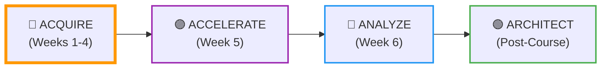
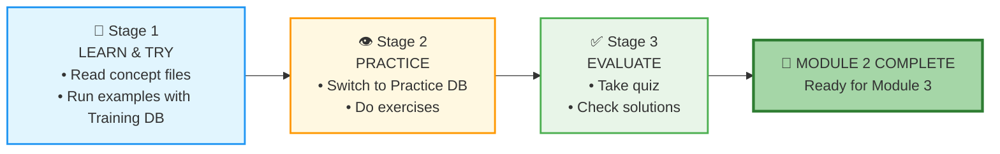
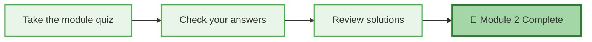
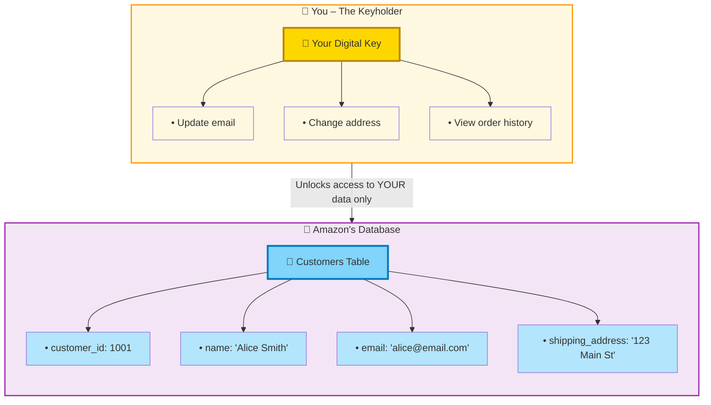

# 🗄️🤖 SQL & GenAI Course
**🎯 Quality Education for Anyone, Anywhere, Anytime — 💫 with Comfort, Convenience at no Cost**

## 🗺️ Module 2 Guide: Your First SQL Queries

Welcome to your first technical module. This is where the "Artisan" starts using the tools of the trade. You will learn to extract specific information from a database using SQL's most fundamental commands. In this guide, you'll follow the **PREPARE → PRACTICE → EVALUATE** rhythm to master `SELECT` and `WHERE`. By the end, you'll be comfortable retrieving and filtering data from any single table.

---

<div align="center" style="border: 2px solid #ff9800; border-radius: 8px; padding: 15px; margin: 20px 0; background: #fff8e1;">

### 📍 Your Position in the 4 A's Journey

| Phase | Current Module | AI Role |
|-------|----------------|---------|
| **🔴 ACQUIRE** (Weeks 1-4) | **Module 2: SELECT & WHERE** | **Conceptual Guide Only** |



**📍 You are here:** Module 2 of ACQUIRE – writing your first SQL.

</div>

---

## 🏢 **The Browser Office: Your Universal Launchpad**

**🚀 Kickstart: Any Computer, Any Browser, Anytime.**  
**🌍 Destination: Any country, Any city, Any Platform.**

### **📋 The Standard Four-Tab Setup (Levels 1 & 2)**
The Browser Office transforms any computer with a browser into a complete learning environment.

| Tab | Purpose | Tools & Examples | Description |
| :--- | :--- | :--- | :--- |
| **1: The Map** | Learning content & navigation | Course Repository (GitHub) | Your central hub for all course materials, module guides, and resources. |
| **2: The Factory** | Hands-on practice | SQLite Online | An online SQL environment where you'll run queries and experiment with databases. |
| **3: The Consultant** | AI assistance & explanations | ChatGPT, Claude, Gemini | Your AI learning partner, configured to provide conceptual guidance without writing code for you. |
| **4: The Vault** | Progress tracking & portfolio | GitHub Web, notes | Your personal GitHub repository where you'll store all your work, reflections, and completed exercises. |

> **Keyboard Shortcuts:** `Ctrl+1` / `Cmd+1` for Tab 1, `Ctrl+2` / `Cmd+2` for Tab 2, `Ctrl+3` / `Cmd+3` for Tab 3, `Ctrl+4` / `Cmd+4` for Tab 4.

---

### 🔧 **Need Help?**

| 🔧 Troubleshooting | 🔄 Workflow | ⌨️ Tab Operations |
| :---: | :---: | :---: |
| [Troubleshooting Common Issues](../../../Setup/STEP1_COMMISSION_BROWSER_OFFICE.md) | [Browser Office Workflow](../../../Setup/STEP2_ESTABLISH_LEARNING_RITUAL.md) | [Tab Operations & Shortcuts](../../../Setup/STEP3_MASTER_TAB_OPERATIONS.md) |

---

## 🏢 **Your Browser Office for Module 2 (SQL Mode)**

🚀 Foundation First, AI Next, Projects Last.  
💎 Gemstone by Gemstone, Skill by Skill.

For this module, here's exactly how to use each tab:

| Tab | Purpose | What to Do |
| :--- | :--- | :--- |
| **1: The Map** | Read concept files | Work through `1-sqlCommands/` in order. |
| **2: The Factory** | Run queries | • **Learning:** Keep `training_institution_sample.db` loaded while reading.<br>• **Practice:** Switch to `level1_estore_basic.db` when doing exercises. |
| **3: The Consultant** | Conceptual Q&A only | Ask about syntax, operators, or why a query returns unexpected results. ❌ Never ask for full code. |
| **4: The Vault** | Save your queries | Save every successful query in the appropriate folder: `.../Module2/2-practiceExercises/` (or keep notes in `1-sqlCommands/`). |

---

<div style="border: 2px solid #f44336; border-radius: 10px; padding: 15px; margin: 20px 0; background: #ffebee;">

### 🔴 **Your ACQUIRE Foundation**

| 🗄️ Database Ecosystem | 📚 Knowledge Base | 🧠 Mindset Tuning |
| :---: | :---: | :---: |
| [Database Ecosystem](../../Guides/Section1-ACQUIRE/2_Database_Ecosystem.md) | [Knowledge Base (Vault)](../../Guides/Section1-ACQUIRE/3_Knowledge_Base.md) | [Mindset Tuning](../../Guides/Section1-ACQUIRE/4_Mindset.md) |

</div>

---

## 📚 **Deep Philosophy: Why You Must Type Every Query**

SQL is a language. You wouldn't learn French by only reading French – you have to speak it. The same goes for SQL. Typing every query yourself builds **muscle memory**. It's the difference between watching someone play piano and playing it yourself.

Your AI Consultant is your patient tutor, but **you** are the one doing the work.

---

## 📈 The PREPARE → PRACTICE → EVALUATE Rhythm



| Stage | Folder | Purpose |
|-------|--------|---------|
| **📘 LEARN & TRY** | `1-sqlCommands/` | Read concept files and run examples with the Training DB. |
| **👁️ PRACTICE** | `2-practiceExercises/` | Write your own queries using the E‑Store DB. |
| **✅ EVALUATE** | `3-quizCheckpoint/` + `4-exerciseAndQuizSolutions/` | Test your skills and review solutions. |

---

# 📘 STAGE 1: PREPARE (The Knowledge)

```mermaid
flowchart LR
    A[File 1<br/>The SELECT Clause] --> B[File 2<br/>The WHERE Clause]
    B --> C[File 3<br/>Logical Operators]
    C --> D[File 4<br/>IN & BETWEEN]
    D --> E[File 5<br/>LIKE & Wildcards]
    E --> F[File 6<br/>NULL Handling]
    F --> G[File 7<br/>DISTINCT & Aliases]
    
    style A fill:#e1f5fe,stroke:#2196f3
    style B fill:#e1f5fe,stroke:#2196f3
    style C fill:#e1f5fe,stroke:#2196f3
    style D fill:#e1f5fe,stroke:#2196f3
    style E fill:#e1f5fe,stroke:#2196f3
    style F fill:#e1f5fe,stroke:#2196f3
    style G fill:#e1f5fe,stroke:#2196f3
```



Read these files **in order**. Keep the **Training Institution database** (`training_institution_sample.db`) open in Tab 2 and run every example query you see.

| File | What You'll Learn | Outcome |
|------|-------------------|---------|
| **File 1** | The `SELECT` clause – choosing columns, `SELECT *`. | You can retrieve any columns from a table. |
| **File 2** | Filtering with `WHERE` and comparison operators. | You can find rows that meet specific conditions. |
| **File 3** | Combining conditions with `AND`, `OR`, `NOT`. | You can write complex filters. |
| **File 4** | Using `IN` and `BETWEEN` for cleaner filters. | Your queries become more readable. |
| **File 5** | Searching text with `LIKE` and wildcards. | You can find patterns like names starting with 'A'. |
| **File 6** | Dealing with `NULL` – `IS NULL`, `IS NOT NULL`. | You handle missing data correctly. |
| **File 7** | `DISTINCT`, column aliases (`AS`). | Your output is clean and well‑labeled. |

---

### 🚀 Kickstart Your Journey

➡️ **[Begin Stage 1: The SELECT Clause](./1-sqlCommands/1-the-sieve-select.md)**  
*Type every query. Your future self will thank you.*

---

### ✅ STAGE 1 COMPLETE – READY FOR NEXT STAGE

**🎉 Great!** You've learned the syntax. Now it's time to apply it to a new database.

**Proceed to Next Stage:**
➡️ **📖 Next Step:** Read the **STAGE 2** section below  
   **🎯 Action:** Switch to the E‑Store database and start the exercises.

<div align="center" style="border: 1px solid #2196f3; padding: 15px; margin: 20px 0; background: #e3f2fd; border-radius: 8px;">

### ✅ **BEFORE YOU BEGIN STAGE 2**

**What are the 3 most important things you learned about writing queries?**

1. _________________________________________
2. _________________________________________
3. _________________________________________

**Document these insights in your Vault.**

*This step marks your official completion of STAGE 1.*

**Ready for the next stage? Proceed to STAGE 2 below.**  

</div>

---

# 👁️ STAGE 2: PRACTICE – The Hands-on: Write Your Own Queries

Now switch your **Factory (Tab 2)** to the practice database:  
`Resources/sample_databases/level1_estore_basic.db`

Work through the exercises in `2-practiceExercises/`. They are designed to build confidence step by step.

| Exercise | What You'll Practice | Outcome |
|----------|----------------------|---------|
| **Exercise 1** | Simple `SELECT` on `customers` and `products`. | You can retrieve any columns from a table. |
| **Exercise 2** | Filter with `=`, `<>`, `>`, `<`, etc. | You can find rows based on numeric/text conditions. |
| **Exercise 3** | Combine conditions with `AND`/`OR`, use `IN` and `BETWEEN`. | You write precise filters. |
| **Exercise 4** | Search patterns with `LIKE`; handle `NULL`. | You can deal with real‑world messy data. |
| **Exercise 5** | Mix of all concepts from the module. | You're ready for the quiz. |

For each exercise, use **Tab 3 (The Consultant)** if you need a hint – but only after your own attempts. Save every working query in your Vault.

---

### 🚀 Continue Your Journey

➡️ **[Begin Stage 2: Basic SELECT Practice](./2-practiceExercises/1-basic-select.md)**  
*Practice transforms syntax into skill.*

---

### ✅ STAGE 2 COMPLETE – READY FOR FINAL STAGE

**🎉 Excellent!** You've written real queries on a fresh dataset. Now let's check your understanding.

**Proceed to Next Stage:**
➡️ **📖 Next Step:** Read the **STAGE 3** section below  
   **🎯 Action:** Take the quiz and review solutions.

<div align="center" style="border: 1px solid #ff9800; padding: 15px; margin: 20px 0; background: #fff8e1; border-radius: 8px;">

### ✅ **BEFORE YOU BEGIN STAGE 3**

**What was the trickiest exercise? What did you learn from it?**

_______________________________________________________

**Document this insight in your Vault.**

*This step marks your official completion of STAGE 2.*

**Ready for the final stage? Proceed to STAGE 3 below.**  

</div>

---

# ✅ STAGE 3: EVALUATE – The Assessment



### ✅ Your Evaluation Tasks

1. **Take the quiz:** Go to `3-quizCheckpoint/module2-sql-quiz.md`.
   - Answer the questions – some may ask you to write queries.
   - Write your answers in a new file `quiz_answers.sql` (or `.md`) inside your Vault at:
     ```
     Learning/Level-1-beginner/Level1-1-ACQUIRE/Module2-BasicRetrieval-SelectAndWhere/3-quizCheckpoint/
     ```

2. **Check your answers:** Open the solutions in `4-exerciseAndQuizSolutions/quiz-answers.md`.
   - Compare your queries and reasoning.

3. **Review exercise solutions** if you want to see alternative approaches:
   - `select-solutions.md`
   - `where-solutions.md`

---

### 🚀 Complete Your Journey

➡️ **[Begin Stage 3: Take the Quiz](./3-quizCheckpoint/module2-sql-quiz.md)**  
*Evaluation turns practice into mastery.*

---

### ✅ STAGE 3 COMPLETE – MODULE 2 FINISHED

**🎉 Outstanding!** You've written real SQL and can now retrieve and filter data from a single table.

<div align="center" style="border: 1px solid #4caf50; padding: 15px; margin: 20px 0; background: #e8f5e8; border-radius: 8px;">

### ✅ **REFLECT BEFORE MOVING ON**

**What was the most satisfying query you wrote? What did it teach you?**

_______________________________________________________

**Document this reflection in your Vault.**

*This step marks your official completion of Module 2.*

</div>

---

## 💎 DESIGNER'S PERIGON

<div style="border: 3px solid #9c27b0; border-radius: 10px; padding: 20px; margin: 25px 0; background: linear-gradient(135deg, #f3e5f5 0%, #e1bee7 100%);">

### *Beyond Syntax – The Universal Key*


Throughout Module 2, we've explored the **SQLVerse** – our universe where every domain is a **planet** and every database is a **world** to explore. 

In our journey we explored different planets - Education Planet, HR Planet, E-Commerce Planet and Fintech Planet. The exploration has helped us to understand how the **planets** have their own unique **data landscapes**, yet all follow the same fundamental laws of SQL. Planets may change but **SQL remains constant** across every world.

But now, step outside the **SQLVerse** for a moment. In the **real world**, this is how databases are perceived by non-technical people:

---

### 🗝️ **The Digital Locker and Key**

Think of a **Database** as a **Secure Digital Locker** – a safe place where we store valuable data that can be accessed anytime on demand by authorized users.

Think of **SQL** as the **Digital Key** that lets you:

1. **Open the locker** – Connect to the database
2. **Access the data** – Retrieve exactly what you need
3. **Analyze the data** – Transform raw facts into **knowledge**
4. **Provide valuable insights** – Turn knowledge into business decisions

---

### 🌍 **From SQLVerse to Reality**

You have learned the basics of SQL in this module. You have worked with two very different databases:

| Database | Domain |
|----------|--------|
| **Training Institution** | Education |
| **E‑Store** | E‑Commerce |

Yet you used the **same SQL commands** on both. This is the superpower of SQL – it is **domain‑agnostic**.

The `SELECT` and `WHERE` commands you've mastered are not limited to education or e‑commerce. They are your digital keys to unlock data in:

- 🏦 **Banking Domain** – Find all transactions above $10,000
- 💳 **Fintech** – Retrieve users who joined in the last month
- 📊 **Business Intelligence** – Filter sales data by region
- 📝 **Content Management** – Get all published articles by a specific author
- 🏢 **Enterprise Resource Planning** – List employees in a certain department
- 💻 **Software Development** – Query user data for a mobile app
- 📱 **Web Applications** – Display products that are in stock

---
### 🏛️ **The Keyholder's Power – A Module 1 Connection**

Remember back in **[Module 1, File 2](../../Module1-Introduction-Database-AICo-pilot/1-sqlCommands/2-database-components.md)** when we explored the **anatomy of a database**? We learned that:

- A **table** is a **contract** – every column makes a promise about what it will contain.
- A **schema** is a **constitution** – it governs how data lives, relates, and is protected.

Now see how the **Digital Locker and Key** metaphor brings that to life:



**As an Amazon customer, you hold the key to YOUR own data.** You can:

- **Update your email** – The database contract ensures your email column always contains a valid address. Your key lets you modify it whenever you want.
- **Change your shipping address** – Move to a new home? Your key unlocks that specific record, and the schema's constitution protects the integrity of every other customer's data.
- **View your order history** – Your key only unlocks your locker, not anyone else's.

The table's **contract** promises your data will be accurate. The schema's **constitution** ensures it stays protected. And **your digital key** – granted through authentication – lets you exercise control over your own information.

> 💎 **Artisan's Insight:** *"In [Module 1](../../Module1-Introduction-Database-AICo-pilot/1-sqlCommands/2-database-components.md), you learned that a table is a contract and a schema is a constitution. In Module 2, you're learning to wield the key that unlocks that contract. Every time you write a `SELECT` statement, you're using your digital key to open exactly the locker you need – nothing more, nothing less. The power isn't just in having the key – it's in knowing which lock to open and when."*

---


### 🧠 **The Artisan's Truth**

> *"You are no longer just a learner – you are becoming a keyholder. In the SQLVerse, you learned the laws. In the real world, you apply them. With SQL in your hands, you can unlock the value hidden in any dataset, from any domain, for any purpose."*

</div>

---

## 🎉 MODULE 2 COMPLETE

<div align="center" style="border: 3px solid #4caf50; border-radius: 10px; padding: 25px; margin: 30px 0; background: linear-gradient(135deg, #e8f5e8, #c8e6c9);">

### ✅ Congratulations, You've Mastered Basic SQL!

**You have successfully:**
- Retrieved data with `SELECT`
- Filtered rows with `WHERE`
- Used comparison and logical operators
- Searched text with `LIKE`
- Handled `NULL` values
- Polished output with `DISTINCT` and aliases

---

### 🎓 **Your Achievement Awaits**

You've successfully completed Module 2! Your journey from data observer to **SQLVerse Navigator** is complete.

**View your official certificate here:**  
[📜 **MODULE 2 CERTIFICATE →**](./MODULE2_GRADUATION.md)

*Print it, share it, celebrate it. Then return here to continue your journey.*

---

<div align="center" style="border: 1px solid #ff9800; padding: 20px; margin: 30px 0; background: #fff8e1; border-radius: 8px;">

### 💎 **REFLECT BEFORE YOU PROCEED**

**What was the most powerful insight you gained from writing `SELECT` and `WHERE` queries? How has your ability to ask questions of data changed?**

_______________________________________________________
_______________________________________________________

**Which concept from this module do you think will be most essential when you start sorting and grouping data in Module 3?**

_______________________________________________________

*Document these reflections in your Vault. They're the evidence of your evolution from Observer to Navigator.*

</div>

---

### 🚀 **Ready for the Next Adventure?**

**You are now ready for Module 3, where you'll sort, group, and aggregate data!**

# [▶️ **PROCEED TO MODULE 3: SORTING, AGGREGATION, GROUPING**](../../Module3-Sort-Aggregate-Group/README.md)

</div>


*Part of our mission for 🎯 Quality Education for Anyone, Anywhere, Anytime — 💫 with Comfort, Convenience at no Cost.*

**Level 1 | Module 2 Guide | Next: Module 3 – Sorting, Aggregation, Grouping**

