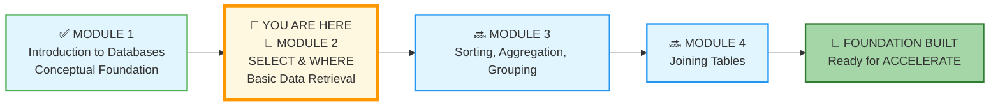
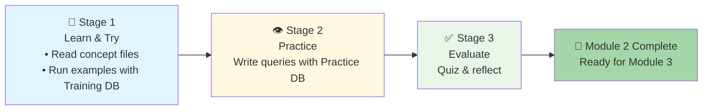

# 🗄️🤖 SQL & GenAI Course
**🎯 Quality Education for Anyone, Anywhere, Anytime — 💫 with Comfort, Convenience at no Cost**

## 📖 Module 2: Basic Retrieval – SELECT & WHERE

Welcome to Module 2! This is where you write your first SQL commands. You'll learn to retrieve exactly the data you need using the **SELECT** statement and filter it with the **WHERE** clause. By the end of this module, you'll be able to ask precise questions to the database and get immediate answers.

💎 **The Artisan's Insight:** *"Every master was once a beginner who understood the foundation first. Now it's time to speak the language. Every query you write is a conversation with data – start the dialogue."*

---

## 📊 **Your ACQUIRE Journey – Where You Are Now**

### 📍 You Are Here
- **Phase:** 🔴 ACQUIRE (Weeks 1‑4)
- **Module:** 2 of 4 – SELECT & WHERE
- **Mode:** Hands‑on SQL (finally!)

---

## 🎯 Quick Overview

| Goal | Master the two most essential SQL commands: SELECT and WHERE. Transition from *thinking* about data to *commanding* it. |
|------|---------------------------------------------------------------|
| Time | 3‑4 hours (learn + practice) |
| Structure | **Learn & Try → Practice → Evaluate** (a refined rhythm) |

---

## 🧭 **Your Learning Compass for This Module**

**Journey Stage:** Foundation Building – **First SQL Commands**  
**AI Co-pilot Role:** Conceptual Explainer only (no code generation)  
**Primary Goal:** Write queries to retrieve and filter data from a single table, building muscle memory for SQL syntax.

**What This Means for You:**
- **🧠 Mindset Focus:** SQL is a language – you learn it by speaking, not just listening. Type every query yourself. Mistakes are your best teachers.
- **🤖 AI Guidelines:** Your Consultant (Tab 3) can explain concepts, clarify syntax, and help you understand error messages, but **will never write the query for you**. This is how you build genuine skill.
- **🎯 Success Metric:** By module's end, you can confidently write `SELECT ... FROM ... WHERE ...` queries on any single table without looking up syntax.

> **Philosophical Anchor:** "A craftsman doesn't blame their tools – they master them. SQL is your first real tool. Use it with intention."

---

## 🎯 **Learning Objectives**

By completing this module, you will be able to:

1. **Write** `SELECT` statements to retrieve specific columns from a table.
2. **Filter** rows using the `WHERE` clause with comparison operators (`=`, `<>`, `>`, `<`, `>=`, `<=`).
3. **Combine** multiple conditions using logical operators (`AND`, `OR`, `NOT`).
4. **Use** `IN` and `BETWEEN` for cleaner, more readable filters.
5. **Search** text patterns with `LIKE` and wildcards (`%`, `_`).
6. **Handle** `NULL` values correctly with `IS NULL` and `IS NOT NULL`.
7. **Polish** your output with `DISTINCT` and column aliases.
8. **Save** every successful query in your Vault for future reference.

---

## 🏢 **The Browser Office: Your Universal Launchpad**

**🚀 Kickstart: Any Computer, Any Browser, Anytime.**  
**🌍 Destination: Any country, Any city, Any Platform.**

### **📋 The Standard Four-Tab Setup (Levels 1 & 2)**
The Browser Office transforms any computer with a browser into a complete learning environment.

| Tab | Purpose | Tools & Examples | Keyboard Shortcut |
| :--- | :--- | :--- | :--- |
| **1: The Map** | Learning content & navigation | Course Repository (GitHub) | `Ctrl+1` / `Cmd+1` |
| **2: The Factory** | Hands-on practice | SQLite Online | `Ctrl+2` / `Cmd+2` |
| **3: The Consultant** | AI assistance & explanations | ChatGPT, Claude, Gemini | `Ctrl+3` / `Cmd+3` |
| **4: The Vault** | Progress tracking & portfolio | GitHub Web, notes | `Ctrl+4` / `Cmd+4` |

---

## 📋 **Prerequisites**

Before beginning Module 2, ensure you have:

- [ ] **Module 1 Complete:** You've finished all concept files, exercises, and the quiz.
- [ ] **Browser Office Open:** All four tabs configured and accessible.
- [ ] **Training Database Loaded:** `training_institution_sample.db` open in Tab 2 (for learning).
- [ ] **E‑Store Database Ready:** `level1_estore_basic.db` – you'll use it for practice.
- [ ] **Student Mode Active:** Your Consultant (Tab 3) configured with the Student Mode prompt.
- [ ] **Vault Ready:** Your GitHub repository structure matches Pillar 3 requirements.

---

## 🎓 **Database Strategy – Two Databases, One Purpose**

### **For Learning: `training_institution_sample.db`**
- **What it is:** A pre‑built database with tables, data, and relationships.
- **How to use:** Load this file in Tab 2 (SQLite Online) to follow along with the concept files.
- **For Module 2:** We focus only on the **`students`** table to keep learning simple.

### **For Practice: `level1_estore_basic.db`**
- **What it is:** A separate e‑commerce database for hands‑on exercises.
- **How to use:** Switch to this file when you work through `2-practiceExercises/`.
- **Tables:** `customers`, `products`, `orders`, `order_items`.

> 💡 **Why two databases?** This reinforces the skill of applying the same SQL to different datasets – exactly what you'll do in real projects.

---

## 🧠 **Mindset: Your First Real Tool**

SQL is the language of data. In this module, you'll stop reading about databases and start **talking to them**. Every query you write is a conversation. The more you practice, the more natural it becomes.

**Remember the 3‑Attempt Rule:**  
1. Write the query from memory/intuition.  
2. If it fails, check the syntax in the concept file.  
3. Still stuck? Ask the Consultant (Tab 3) for a conceptual hint – never for the full code.

---

## 📈 Your Three‑Stage Journey

**📘 Stage 1: Learn & Try** – Read the concept files in `1-sqlCommands/`. As you read, open the **Training Institution database** in Tab 2 and run every example query yourself. This builds muscle memory and confidence.

**👁️ Stage 2: Practice** – Switch to the **E‑Store database** and work through the exercises in `2-practiceExercises/`. Apply what you've learned to a fresh dataset. Struggle, succeed, and grow.

**✅ Stage 3: Evaluate** – Test your knowledge with the quiz in `3-quizCheckpoint/`. Then check your answers and review the solutions in `4-exerciseAndQuizSolutions/`.

---

## 🚀 **Ready to Begin?**

No shortcuts. No copy‑paste. Just you and the database.

**Your first SQL command awaits – but follow the guide.**

# [▶️ **GO TO MODULE 2 GUIDE**](./MODULE2_GUIDE.md)

*Part of our mission for 🎯 Quality Education for Anyone, Anywhere, Anytime — 💫 with Comfort, Convenience at no Cost.*

**Level 1 | Module 2: SELECT & WHERE | Next: [Module 2 Guide](./MODULE2_GUIDE.md)**