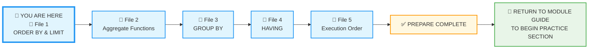
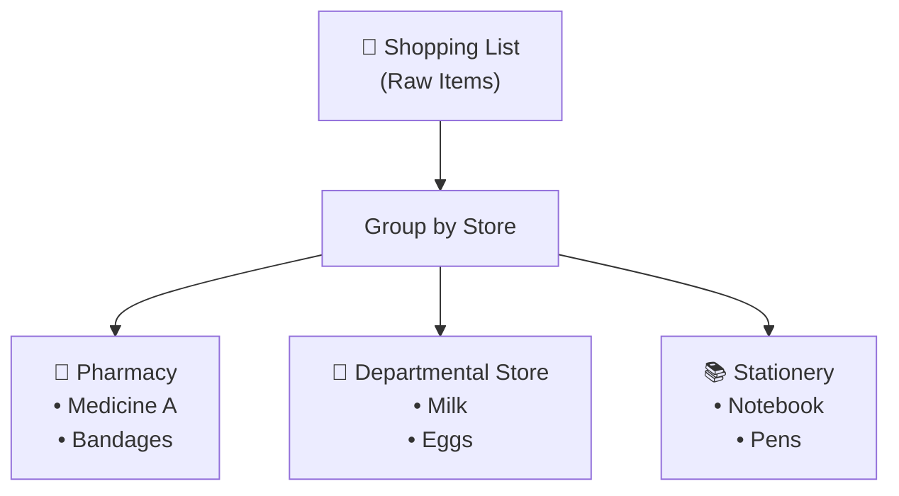
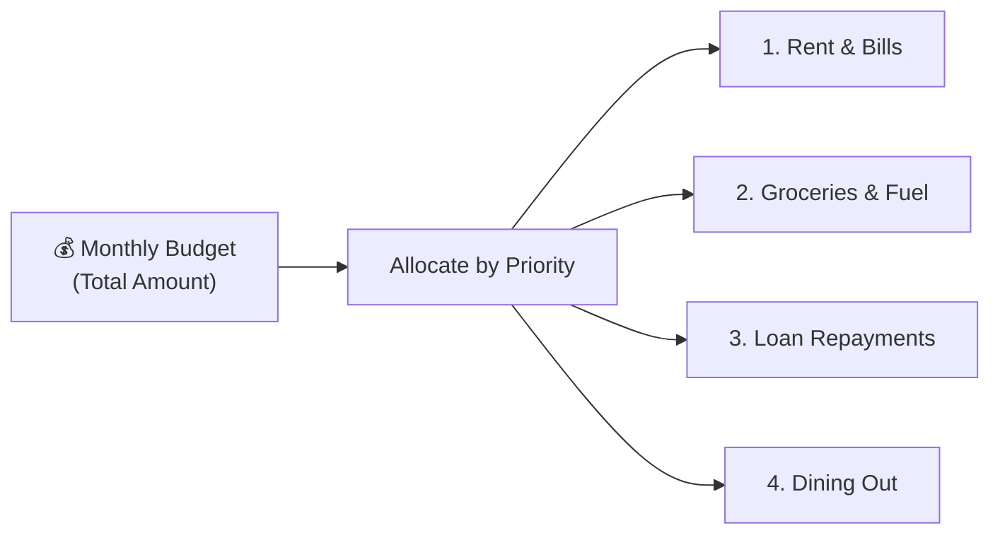
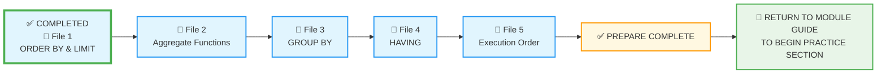

# 🗄️🤖 SQL & GenAI Course
**🎯 Quality Education for Anyone, Anywhere, Anytime — 💫 with Comfort, Convenience at no Cost**

---

## 📘 File 1: ORDER BY & LIMIT – Putting Things in Order


### 📍 Your Current Stage – PREPARE Journey



You're in **Stage 1: PREPARE**. This is the first concept file in Module 3. After completing all five files, you'll return to the Module Guide to begin the PRACTICE stage.

---

## 🔧 Enhanced Browser Office for PREPARE

**🚀 Kickstart: Any Computer, Any Browser, Anytime.**  
**🌍 Destination: Any country, Any city, Any Platform.**

| Tab | Purpose | What to Do |
| :--- | :--- | :--- |
| **1: The Map** | Read concept files | You're here – reading this file. Next up: `2-aggregate-functions.md`. |
| **2: The Factory** | Run queries | Keep **[`training_institution_sample.db`](../../../Resources/sample_databases/training_institution_sample.db)** loaded. Run every example query. |
| **3: The Consultant** | Conceptual Q&A | Ask about sorting, `ORDER BY` syntax, or why results appear in a certain order. **Configure AI with [Student Mode Prompt](../../../STUDENT_MODE_PROMPT_LEVEL1.md) which prevents code generation by default.** |
| **4: The Vault** | Save your work | Save successful queries in: `Learning/Level-1-beginner/Level1-1-ACQUIRE/Module3-Sort-Aggregate-Group/1-sqlCommands/` |

---

### 🛠️ Module 3 Toolkit

🚀 Foundation First, AI Next, Projects Last.  
💎 Gemstone by Gemstone, Skill by Skill.

| | | | |
|---|---|---|---|
| **Browser Office** | 🔧 [Troubleshooting Common Issues](../../../Setup/STEP1_COMMISSION_BROWSER_OFFICE.md) | 🔄 [Browser Office Workflow](../../../Setup/STEP2_ESTABLISH_LEARNING_RITUAL.md) | ⌨️ [Tab Operations & Shortcuts](../../../Setup/STEP3_MASTER_TAB_OPERATIONS.md) |
| **ACQUIRE Section** | 🗄️ [Database Ecosystem](../../Guides/Section1-ACQUIRE/2_Database_Ecosystem.md) | 📚 [Knowledge Base (Vault)](../../Guides/Section1-ACQUIRE/3_Knowledge_Base.md) | 🧠 [Mindset Tuning](../../Guides/Section1-ACQUIRE/4_Mindset.md) |

---

## 🎯 What You'll Learn

By the end of this file, you will be able to:

- Sort query results in ascending or descending order using `ORDER BY`
- Sort by multiple columns to create layered ordering
- Limit the number of rows returned with `LIMIT`
- Skip rows using `OFFSET` to implement pagination
- Combine `ORDER BY`, `LIMIT`, and `OFFSET` to create top‑N reports and paginated results

---

## 📊 Practice Table: `students`

We'll use the `students` table from the Training Institution database. Below are a few sample rows to give you a sense of the data. For the complete dataset, run `SELECT * FROM students;` in your Factory (Tab 2).

| student_id | first_name | last_name | email | enrollment_date | total_fees | fees_paid |
|------------|------------|-----------|-------|-----------------|------------|-----------|
| 101 | Sarah | Chen | sarah.chen@email.com | 2024-01-15 | 4500.00 | 3000.00 |
| 102 | Mike | Rodriguez | mike.rod@email.com | 2024-01-20 | 5200.00 | 5200.00 |
| 103 | Jessica | Park | jessica.park@email.com | 2024-02-01 | 4500.00 | 2000.00 |
| ... | ... | ... | ... | ... | ... | ... |

> 💡 **View the full dataset:** Run `SELECT * FROM students;` in your Factory to see all current records. In Module2 you already added some new students. Remember that as you progress through exercises, you may insert, update, or delete records – your Factory always shows the live state of your database. The exact number of rows will change as you practice, and that's perfectly normal. In fact, we'll be adding several new students in this very file using a **bulk insert** in the following section – so your dataset will grow as you learn!

 📌 **A Note on Sorting Order:** When you use `ORDER BY` on text columns, the sorting rules (called *collation*) can vary between database systems. In SQLite, sorting is based on binary values by default, which means uppercase letters come before lowercase (e.g., 'Z' comes before 'a'). This might surprise you if you expect a simple dictionary order. Don't worry – you can control this behavior with collation options, but for now, just be aware that text sorting may not always match your intuition. If you see unexpected order, this is often the reason.

---
## ✨ Bonus Skill: Advanced INSERT – Adding Multiple Rows

In Module 2, you learned to add a single row with `INSERT`. Now, let's add **many rows at once**. This is called a **bulk insert**, and it's much faster and cleaner than running many separate `INSERT` statements.

**Question:** Can we add six new students with just one command?

```sql
-- Add 6 new students in one go
INSERT INTO students (student_id, first_name, last_name, email, phone, enrollment_date, total_fees, fees_paid)
VALUES 
    (116, 'Liam', 'Nelson', 'liam.n@email.com', NULL, '2024-05-15', 5000.00, 2000.00),
    (117, 'Olivia', 'Martinez', 'olivia.m@email.com', '555-0117', '2024-05-18', 4500.00, 4500.00),
    (118, 'Noah', 'Garcia', 'noah.g@email.com', '555-0118', '2024-05-20', 5200.00, 3000.00),
    (119, 'Emma', 'Wilson', 'emma.w@email.com', NULL, '2024-05-22', 3800.00, 1000.00),
    (120, 'Sophia', 'Taylor', 'sophia.t@email.com', '555-0120', '2024-05-25', 4800.00, 4800.00),
    (121, 'Mason', 'Brown', 'mason.b@email.com', '555-0121', '2024-05-28', 5000.00, 0.00);
```

**Try it now in Tab 2.**  

**What you're seeing:** All six rows are inserted instantly. The database processes them as a single transaction – faster and more efficient.

**Why this matters:** In real‑world work, you'll often load thousands of rows from spreadsheets or log files. Bulk insert is your tool for that job.

> 💡 **Dynamic Data Reminder:** Your database is now even larger! But if you ever reload the original database file, these new rows will disappear. That's okay – your Factory always shows the live state. In production, inserts are permanent.

Now you have plenty of data to practice pagination with `LIMIT` and `OFFSET`. 

---

## 🏛️ Primary Key Reinforcement – The Uniqueness Guarantee

Remember the **Architect's Ledger**? You learned that every table has a **Primary Key** – a column (or set of columns) that uniquely identifies each row. In our `students` table, `student_id` is the Primary Key. This means the database **will never allow two rows with the same `student_id`**.

Let's test this rule. Try to insert a student with an ID that already exists:

```sql
-- Attempt to insert a duplicate student_id (101 already exists)
INSERT INTO students (student_id, first_name, last_name, email, enrollment_date, total_fees, fees_paid)
VALUES (101, 'Fake', 'Student', 'fake@email.com', '2024-06-01', 5000.00, 0.00);
```

**Try it now in Tab 2.**  

**Expected Result:** You'll see an error message similar to:
```
UNIQUE constraint failed: students.student_id
```

**What you're seeing:** The database is protecting you! It refuses to create a duplicate identity. This is the **First Sacred Law of Primary Keys** in action: **Uniqueness**.

**Reflect & Learn:**  
- Why did this happen? Because `student_id` is the Primary Key, and Primary Keys must be unique.
- How would you fix this? Either use a new, unused `student_id`, or if you meant to update an existing student, you'd use an `UPDATE` statement (coming in later modules).

> 💡 **The Artisan's Insight:** *"Every time the database rejects a duplicate, it's saving you from a data disaster. A duplicate identity would break every relationship, every report, every analysis. Thank the database for being strict."*

---


## 🤔 When Should You Use ORDER BY?

### ✅ Use ORDER BY When:
1. **Presenting results** – reports, dashboards, or any user‑facing output need a logical order.
2. **Finding extremes** – top 5 highest fees, earliest enrollments, etc.
3. **Comparing values** – ranking students by payment, courses by duration.
4. **Organizing data** – alphabetical lists, chronological timelines.

### ❌ Avoid ORDER BY When:
1. **Order doesn't matter** – if the consumer doesn't care, save the computation.
2. **You're just exploring** – `SELECT *` without order is fine for quick looks.
3. **Performance is critical on huge datasets** – sorting millions of rows can be expensive (but we'll learn indexing later).

**The Artisan's Rule:**  
> *"ORDER BY is your presentation layer. Use it when you need to tell a story, not when you're just gathering facts."*

---

## 🎨 The Artisan's Query Rhythm (Module 3 Edition)

Throughout this module, every query follows a pattern that respects the dynamic nature of your data:

| Step | What You Do | Why |
|------|-------------|-----|
| **1. The Question** | Read the business question carefully | Clarify what you're trying to find |
| **2. The Query** | Write your SQL code | Apply the concept |
| **3. Expected Result** | **Predict** what you should see based on your current dataset | Think before you run! |
| **4. Try it now in Tab 2** | Run the query in your Factory | Test your prediction |
| **5. What you're seeing** | Compare actual results with your expectation | Identify any mismatch |
| **6. Reflect & Learn** | ✅ **If match** – Congratulations! You've understood the business question accurately and predicted the output correctly.<br>❌ **If mismatch** – Discuss with your Socratic tutor (Tab 3) and find out what exactly has gone wrong | Close the learning loop |

---

  

### 🧠 **The Artisan's Truth**

  

> *"A correct result confirms your understanding. An incorrect result is a gift – it shows you exactly where your mental model needs refinement. Both are valuable. Both make you better."*

  

---

> 💡 **Pro Tip:** This rhythm isn't just for learning – it's how you'll debug queries, explain your work to colleagues, and think through data problems for the rest of your career. When you're stuck, walk through the steps aloud. The step you skip is usually where the bug hides.

---

## 🔍 Introducing ORDER BY

In Module 2, you learned to find specific data. But finding is only half the story. Once you have the data, you need to **organize** it. That's where `ORDER BY` comes in.

By default, databases return rows in whatever order is most efficient – often the order they were inserted. `ORDER BY` lets you take control.

### 📊 Basic Sorting

**Question:** Show me all students, sorted alphabetically by last name.

```sql
SELECT first_name, last_name, enrollment_date
FROM students
ORDER BY last_name;
```

**Expected Result:** Look at your dataset in Tab 2. Based on the actual last names present, write down the order you expect (e.g., Chen, Garcia, Johnson, Kumar, Park…).

**Try it now in Tab 2.**  

**What you're seeing:** Did the actual order match your prediction? `ORDER BY` sorts the results **after** they're retrieved, but before they're displayed. The default sort order is ascending (A to Z, smallest to largest).

**Reflect & Learn:**
- ✅ **If match** – Great! Your mental model of the data is accurate.
- ❌ **If mismatch** – Why? Were there names you missed? Did you forget about certain students? Head to Tab 3 and ask your Socratic tutor: *"I expected last names in order X, but got Y. What am I missing?"*

---

**Question:** What if I want the highest fees first?

```sql
SELECT first_name, last_name, total_fees
FROM students
ORDER BY total_fees DESC;
```

**Expected Result:** Look at your dataset. Which students have the highest fees? Write down the top 3 you expect.

**Try it now in Tab 2.**  

**What you're seeing:** `DESC` means descending (largest to smallest). Without it, `ASC` (ascending) is the default.

**Reflect & Learn:**
- ✅ **If match** – Excellent! You've identified the top fee payers.
- ❌ **If mismatch** – Did you overlook someone? Discuss with your Consultant.

---

### 🔢 Sorting by Multiple Columns

Sometimes one column isn't enough. You might want to sort by course track, then by course name within each track.

**Question:** Show all students, sorted first by total fees (highest first), then by last name (alphabetically).

```sql
SELECT first_name, last_name, total_fees
FROM students
ORDER BY total_fees DESC, last_name ASC;
```

**Expected Result:** Predict the order. For students with the same total fees, they should appear alphabetically by last name.

**Try it now in Tab 2.**  

**What you're seeing:** The database sorts by the first column, then within that, by the second column. Each column can have its own sort direction.

**Reflect & Learn:**
- ✅ **If match** – Perfect! You understand multi‑column sorting.
- ❌ **If mismatch** – What went wrong? Ask your Consultant: *"Why didn't my secondary sort work as expected?"*

---

### 🎯 LIMIT and OFFSET

Real‑world applications rarely show every single row. They show you a page at a time. `LIMIT` and `OFFSET` make this possible.

**Question:** Who are the top 5 students by total fees?

```sql
SELECT first_name, last_name, total_fees
FROM students
ORDER BY total_fees DESC
LIMIT 5;
```

**Expected Result:** Based on your dataset, write down the five students with the highest fees.

**Try it now in Tab 2.**  

**What you're seeing:** `LIMIT 5` tells the database to return only the first 5 rows after sorting.

**Reflect & Learn:** Compare your list with the actual result.

**Question:** How do I get the next 5 for page 2?

```sql
SELECT first_name, last_name, total_fees
FROM students
ORDER BY total_fees DESC
LIMIT 5 OFFSET 5;
```

**Expected Result:** Predict rows 6‑10 in the sorted list.

**Try it now in Tab 2.**  

**What you're seeing:** `OFFSET 5` skips the first 5 rows. Combined with `LIMIT`, this creates pagination.

**Reflect & Learn:** Did your prediction match? If not, why?

---

### 🏛️ The Artisan's Guardrail: ORDER BY Comes Last

Remember the execution order we introduced in Module 2? Even though you write `ORDER BY` near the end of your query, it actually executes **after** everything else – after `WHERE`, after `GROUP BY`, after `SELECT`. The only thing that runs after `ORDER BY` is `LIMIT`.

This is why you can use aliases in `ORDER BY` (unlike in `WHERE`). The alias is created in `SELECT`, which runs before `ORDER BY`.

```sql
-- This works!
SELECT first_name, total_fees - fees_paid AS balance
FROM students
WHERE total_fees - fees_paid > 0
ORDER BY balance DESC;
```

**Expected Result:** Predict which students will appear first (highest balance).

**Try it now in Tab 2.**  

**What you're seeing:** The `balance` alias is used in `ORDER BY` – this is allowed because `ORDER BY` runs after `SELECT`.

**Reflect & Learn:** Did your prediction match? This is a powerful pattern for clean queries.

---

## 🧪 Try It Now

1. **Alphabetical Students:** List all students sorted by first name. Predict the order, then run it. Reflect on the result.
2. **Highest Debt First:** Show students with outstanding balance (`total_fees - fees_paid`), sorted from highest to lowest. Predict the top 3. Run and reflect.
3. **Page 2 of Courses:** Using the `courses` table, sort by course name and display rows 6‑10 (assuming 5 per page). Predict which courses appear. Run and reflect.

---

## ⚠️ Common Mistakes

### Mistake 1: Forgetting `DESC` when you want descending
```sql
-- Wrong: gives lowest fees first
SELECT * FROM students ORDER BY total_fees;

-- Right: add DESC for highest first
SELECT * FROM students ORDER BY total_fees DESC;
```
> 🔧 **Fix:** Always ask yourself: "Do I want the biggest first or smallest first?" Add `DESC` when you need descending order.

### Mistake 2: Using `LIMIT` without `ORDER BY`
```sql
-- Which 5 rows will this return? It's unpredictable!
SELECT * FROM students LIMIT 5;

-- Always pair LIMIT with ORDER BY for meaningful results
SELECT * FROM students ORDER BY student_id LIMIT 5;
```
> 🔧 **Fix:** `LIMIT` without `ORDER BY` returns an arbitrary set. Always specify the order you want.

### Mistake 3: Confusing `OFFSET` and `LIMIT` order
```sql
-- Wrong syntax (in some databases):
SELECT * FROM students LIMIT 5, 5; -- MySQL style, not SQLite

-- SQLite correct:
SELECT * FROM students LIMIT 5 OFFSET 5;
```
> 🔧 **Fix:** In SQLite, use `LIMIT` then `OFFSET`. Remember: "Limit how many, Offset how many to skip."

---

## 🧪 Practice Challenges

**Challenge 1: Alphabetical by Last Name**  
List all students sorted by last name (A‑Z).  
*Save as:* `3-1-alphabetical-last.sql`  
**Expected Result:** Look at your dataset and write down the first three last names alphabetically.  
**After running, reflect:** Did it match? If not, why?

**Challenge 2: Highest Fees First**  
Show students with the highest total fees first. If fees are equal, show those who paid less first (ascending fees_paid).  
*Save as:* `3-2-fee-ranking.sql`  
**Expected Result:** Predict the top 3 students.  
**After running, reflect:** Was your prediction accurate?

**Challenge 3: Recent Enrollments**  
Find the 5 most recently enrolled students.  
*Save as:* `3-3-recent-enrollments.sql`  
**Expected Result:** Predict the five latest enrollment dates.  
**After running, reflect:** Compare with actual.

**Challenge 4: Paginated Directory**  
Create a paginated student directory. Show students 6‑10 when sorted by last name.  
*Save as:* `3-4-paginated-directory.sql`  
**Expected Result:** Predict which students appear on page 2.  
**After running, reflect:** Did you get the right set?

**Challenge 5: Top Debtors**  
Find the top 3 students with the highest outstanding balance (`total_fees - fees_paid`).  
*Save as:* `3-5-top-debtors.sql`  
**Expected Result:** Predict the three largest balances.  
**After running, reflect:** How close was your prediction?

---

### ✨ Bonus Skill: Adding New Data (INSERT Reminder)

You already mastered `INSERT` in Module 2. Let's add a new student to see where they appear in sorted lists.

```sql
-- Add a new student
INSERT INTO students (student_id, first_name, last_name, email, enrollment_date, total_fees, fees_paid)
VALUES (114, 'Olivia', 'Taylor', 'olivia.t@email.com', '2024-05-20', 5000.00, 2500.00);

-- Now run your sorted queries again. Where does Olivia appear? Predict, then check.
```

> 🎉 **Notice:** You're using the same `INSERT` skills from Module 2, File 6. This is second nature now!

---

## 📋 ORDER BY & LIMIT Quick Reference Card

### Basic Syntax

```sql
ORDER BY column1 [ASC|DESC], column2 [ASC|DESC], ...
LIMIT number [OFFSET number];
```

### Common Patterns

| You Want | Query |
|----------|-------|
| Alphabetical order | `ORDER BY last_name` |
| Highest first | `ORDER BY total_fees DESC` |
| Multiple columns | `ORDER BY track, course_name` |
| Top 5 | `ORDER BY score DESC LIMIT 5` |
| Page 2 (rows 6‑10) | `ORDER BY id LIMIT 5 OFFSET 5` |

### Critical Rules

| Rule | Wrong ❌ | Right ✅ |
|------|---------|---------|
| **DESC goes after column** | `ORDER BY DESC total_fees` | `ORDER BY total_fees DESC` |
| **OFFSET needs LIMIT** | `OFFSET 5` | `LIMIT 5 OFFSET 5` |
| **Aliases work here** | (they work!) | `ORDER BY balance` |

**Memory Aid:**  
> *"Sort then limit – first organize, then take what you need."*

**Save this reference in your Vault as:** `3-order-by-reference-card.md`

---

## ✅ Progress Check

After reading this and trying the examples, can you:

- [ ] Sort results in ascending and descending order?
- [ ] Sort by multiple columns with mixed directions?
- [ ] Use `LIMIT` to get only the first N rows?
- [ ] Implement pagination with `LIMIT` and `OFFSET`?
- [ ] Explain why aliases work in `ORDER BY` but not in `WHERE`?
- [ ] Save your working queries in your Vault?

**If yes → You're ready for File 2: Aggregate Functions!**

---

## 💎 DESIGNER'S PERIGON

<div style="border: 3px solid #9c27b0; border-radius: 10px; padding: 20px; margin: 25px 0; background: linear-gradient(135deg, #f3e5f5 0%, #e1bee7 100%);">

### *The Art of Order*


You've just learned to **order** your results – to arrange the chaos into something meaningful. But this skill extends far beyond SQL.

In our everyday tasks we practice ordering instinctively. When you write a shopping list you automatically group the items you want to purchase – Medicines, Groceries, Stationery items – so that when you visit the Pharmacy, Departmental Store or Stationery Store you can immediately grab the items by glancing at the list.



Similarly when you are planning your monthly budget, you allot your cash by grouping and categorizing your spend on different headings like Food, Fuel, Loan Repayments, Dining out etc.



Think about your day. When you check your email, do you want it sorted by sender or by date? When you shop online, do you want prices low‑to‑high or high‑to‑low? When you look at your photos, do you want them chronologically or grouped by event?

**Every decision to order is a decision to prioritize.**

`ORDER BY` isn't just syntax – it's a statement of what matters most. When you put the highest debt first, you're saying: "These are the students we need to reach out to urgently." When you sort by enrollment date descending, you're saying: "Our newest students need the most attention."

You're not just arranging data. You're **telling a story** with it.

---

### 🏛️ The Architect's Ledger Connection

Remember what you learned in **[The Architect's Ledger](../1-theArchitectsLedger/1-RDBMS-Core-concepts.md)**? Every table has a Primary Key – a unique identifier that gives each row its identity. In most databases, rows are physically stored in primary key order (the order they were inserted).  In our `students` table, that's `student_id`. 

In many databases (including SQLite), rows are physically stored in primary key order (the order they were inserted). That's why if you run:

```sql
SELECT * FROM students;
```

you'll likely see the rows sorted by `student_id` – 101, 102, 103, and so on. But here's the catch: **the SQL standard does not guarantee any default order**. The database is free to return rows in whatever order is most efficient, and that order can change as the table grows or is modified. 

> *"Relying on this default is like trusting a GPS that might reroute without telling you – you'll get somewhere, but you won't know where until you arrive."*

But `ORDER BY` liberates you from that uncertainty. You're no longer limited by how the data happens to be stored. You can view it from any angle, sorted by any column, in any order. In the students table, you can view the Result set sorted by last name, enrollment date, or any column you choose – and you can be certain the order is exactly what you asked for.

This is your first taste of **data independence** – the ability to separate *what* data is stored from *how* you view it.

> 💎 **Ledger Insight:** *"The Primary Key gives each row its identity. ORDER BY gives you the freedom to arrange those identities in any way that tells your story."*

---

### 🧠 The Artisan's Truth

> *"In the SQLVerse, data is a garden with all types of flowers. ORDER BY lets you choose the color scheme and what flowers you’d like to use. LIMIT arranges your flowers from the center out. Together, they assemble the flowers into a bouquet."*

> *"You've moved from finding data to arranging it. The collector is becoming an artisan, one sorted query at a time."*

> *"Onward to File 2, where you'll learn to measure – to count, sum, and average. The story continues."*

</div>

---

## 🧭 File Navigation



| Previous Step | Next Step |
|:---:|:---:|
| [← Back to Module 3 Guide](../MODULE3_GUIDE.md) | [Continue to File 2: Aggregate Functions →](./2-aggregate-functions.md) |

---

*Part of our mission for 🎯 Quality Education for Anyone, Anywhere, Anytime — 💫 with Comfort, Convenience at no Cost.*

**Level 1 | Module 3 | File 1: ORDER BY & LIMIT | Next: [Aggregate Functions](./2-aggregate-functions.md)**

