# 🗄️🤖 SQL & GenAI Course
**🎯 Quality Education for Anyone, Anywhere, Anytime — 💫 with Comfort, Convenience at no Cost**

---

## 🏛️ The Architect's Ledger: RDBMS Core Concepts

Welcome to **The Architect's Ledger** – your reference library for the foundational concepts that underpin everything you'll do in this module and beyond. Think of this as your **blueprint collection**. Every great structure begins with a solid blueprint, and every great query begins with understanding the system that powers it.

---

## 🌌 SQLVerse Check-In

**You've returned to Education Planet.** In Module 1, you learned what a database is. In Module 2, you learned to command it. Now, in Module 3, you'll understand **why** it works – by studying the **fundamental laws** that govern every world in the SQLVerse.

The RDBMS concepts you learn here aren't just theory. They're the **physics** that make relational databases work. Whether you're on Education Planet, E-Commerce Planet, or HR Planet, these laws remain constant.

The Architect's Ledger is where theory meets practice. These aren't just concepts; they're the **strategic insights** that explain why your queries work the way they do.

**The difference between a coder and an Artisan is discipline.**

---

### 📍 Your Current Stage

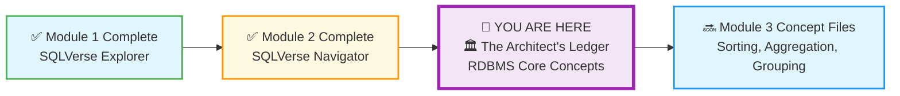

You've mastered the basics of SQL. Now you're ready to understand the **engine** itself. This file is your foundation.

---

## 🏛️ What is a Relational Database?

A **Relational Database** is a collection of data organized into **tables** (also called *relations*) that can be accessed or reassembled in different ways without reorganizing the tables themselves. The word "relational" comes from the mathematical concept of a *relation* – essentially, a table with rows and columns.

The magic of relational databases lies in how tables **relate** to one another. A `customers` table can be connected to an `orders` table through a shared identifier (like `customer_id`). This allows you to ask complex questions like: *"Show me all orders placed by customers who live in Chicago"* – without ever duplicating data.

> 💡 **Think of it this way:** A spreadsheet is a single sheet of paper. A relational database is a filing cabinet full of folders, where every folder knows how to find related information in other folders.

---

## 🔑 Key Features of RDBMS

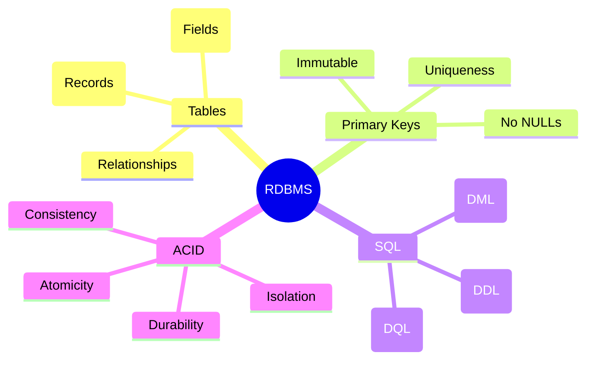

### 1. **Tables**
The fundamental building block. Data is organized into tables with rows and columns.

- **Rows (Records):** Each row represents a single entity (e.g., one customer, one order).
- **Columns (Fields):** Each column represents an attribute of that entity (e.g., name, email, date).
- **Relationships:** Tables connect to each other through keys, creating a web of meaning.

### 2. **Primary Keys**
Every table needs a way to uniquely identify each row. This is called a **Primary Key**.

- **Uniqueness:** No two rows can have the same primary key value.
- **No NULLs:** Every row must have a primary key.
- **Immutable:** Once assigned, it should never change.

### 3. **SQL (Structured Query Language)**
The language used to communicate with the database. SQL has several sublanguages:

| Sublanguage | Purpose | Example |
|-------------|---------|---------|
| **DDL** (Data Definition Language) | Create and modify structure | `CREATE TABLE`, `ALTER TABLE` |
| **DML** (Data Manipulation Language) | Add, update, delete data | `INSERT`, `UPDATE`, `DELETE` |
| **DQL** (Data Query Language) | Retrieve data | `SELECT` |

### 4. **ACID Compliance**
The four properties that ensure database transactions are processed reliably:

| Property | Meaning | Why It Matters |
|----------|---------|----------------|
| **Atomicity** | All or nothing – a transaction completes fully or not at all | Your bank transfer either finishes or doesn't – no middle state |
| **Consistency** | Data follows all rules and constraints | No orphan records, no invalid data |
| **Isolation** | Concurrent transactions don't interfere | Two people booking the last seat don't both succeed |
| **Durability** | Once committed, data persists forever | Even if the power fails, your data is safe |

### 💡 ACID in Action: The $100 Transfer

Understanding how **ACID** handles a power failure is like understanding how a bank vault stays secure even if the lights go out.

Imagine you are transferring **$100** from your **Savings** to your **Checking** account. This requires two steps:

1. **Subtract $100** from Savings.
2. **Add $100** to Checking.

If the power fails *after* step 1 but *before* step 2, that money disappears into the void. This is where **Atomicity** and **Durability** save the day.

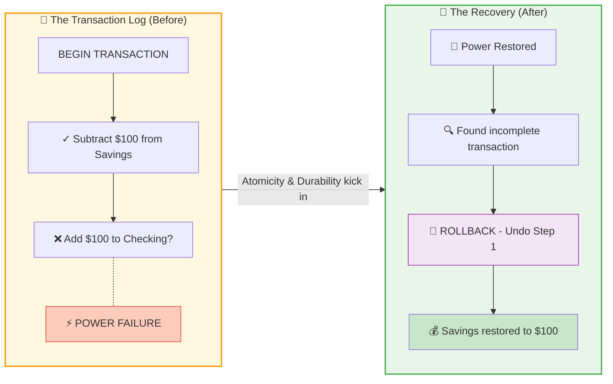

**What's happening:** The database writes every intention to a **Transaction Log** (like an Architect's notebook). When power fails, it checks the log on restart, sees an incomplete transaction, and **rolls back** – restoring your $100 as if nothing happened.

> 💎 **Artisan's Insight:** *"The Transaction Log is the database's memory. It remembers not just what happened, but what was ***supposed*** to happen. This is why your bank balance is never wrong – even when the lights go out."*

Now that you understand **how** transactions are protected, let's look at the **structure** that holds it all together.

---

## 🏗️ Components and Structure

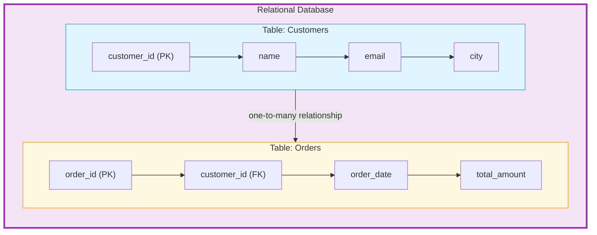

### The Building Blocks

| Component | Description | Example |
|-----------|-------------|---------|
| **Table** | A collection of related data | `customers`, `orders`, `products` |
| **Row** | A single record (tuple) | One customer's complete information |
| **Column** | A specific attribute (field) | `name`, `email`, `order_date` |
| **Primary Key (PK)** | Unique identifier for each row | `customer_id`, `order_id` |
| **Foreign Key (FK)** | A column that references another table's PK | `orders.customer_id` → `customers.customer_id` |
| **Relationship** | The logical connection between tables | One customer → many orders |

---

### 🔍 Deep Dive: The Anatomy of a Table

In the Ledger, you've learned that a table is a collection of rows and columns. But to an Artisan, a table isn't just a grid—it's a structured **Schema**.

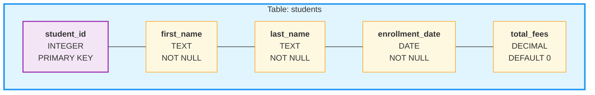

When you look at this diagram, notice that every column has a specific **Data Type** (like `INTEGER`, `TEXT`, or `DATE`). This is part of the **Consistency** property of ACID—you can't put a name in a `total_fees` column because the database's "physics" won't allow it. The database enforces these rules automatically, billions of times over, ensuring your data remains trustworthy.

> 💡 **Artisan's Insight:** *"A spreadsheet lets you put anything anywhere. A database is like a perfectly organized toolbox – every tool has its designated slot, and the box itself prevents you from putting a hammer in the screwdriver drawer."*

---

### 🤝 The "Relational" Magic: PK to FK

You've touched on **Primary Keys (PK)** and **Foreign Keys (FK)**. This is the most critical concept for Module 4 (Joining Tables), but it starts here – in the very foundation of how relational databases are built.

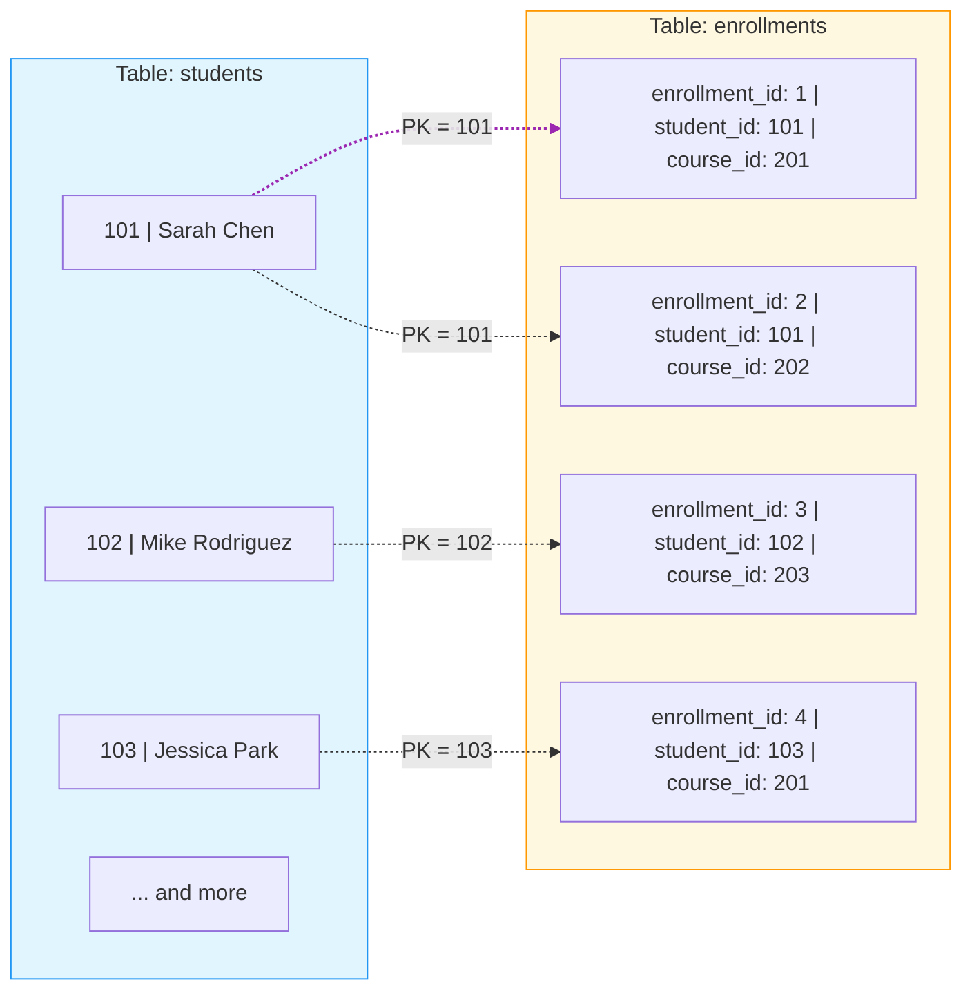

- **The Primary Key (PK):** The unique **"Passport Number"** of a row in its home table. In the `students` table, `student_id` is the PK – every student has one, and no two students share the same ID.

- **The Foreign Key (FK):** That same **"Passport Number"** appearing in a *different* table to create a link. In the `enrollments` table, `student_id` appears as a FK, showing which student enrolled in which course.

In your **Training Institution** database, the `student_id` is the **PK** in the `students` table, but it acts as a **FK** in the `enrollments` table. This link is how the database knows which student belongs to which class without having to type the student's name over and over again.

| Table | Column | Key Type | Purpose |
|-------|--------|----------|---------|
| `students` | `student_id` | Primary Key | Uniquely identifies each student |
| `enrollments` | `student_id` | Foreign Key | Links enrollment to a specific student |

---

### 👨‍🏫 **Real-World Example: Instructors and Courses**

In the **Training Institution** database, the most important relationship is between **Instructors** and **Courses**. It's the perfect example of how two "Nouns" connect to form a story.

### 🔗 The "One-to-Many" Story

1. **The Entities:** `Instructors` and `Courses`.
2. **The Relationship:** One Instructor can teach **many** different courses (e.g., an instructor might teach *SQL Basics*, *Advanced SQL*, and *Python*).
3. **The Connection:** 
   - The `Instructors` table has a Primary Key: `instructor_id`.
   - The `Courses` table has a Foreign Key: `instructor_id`.

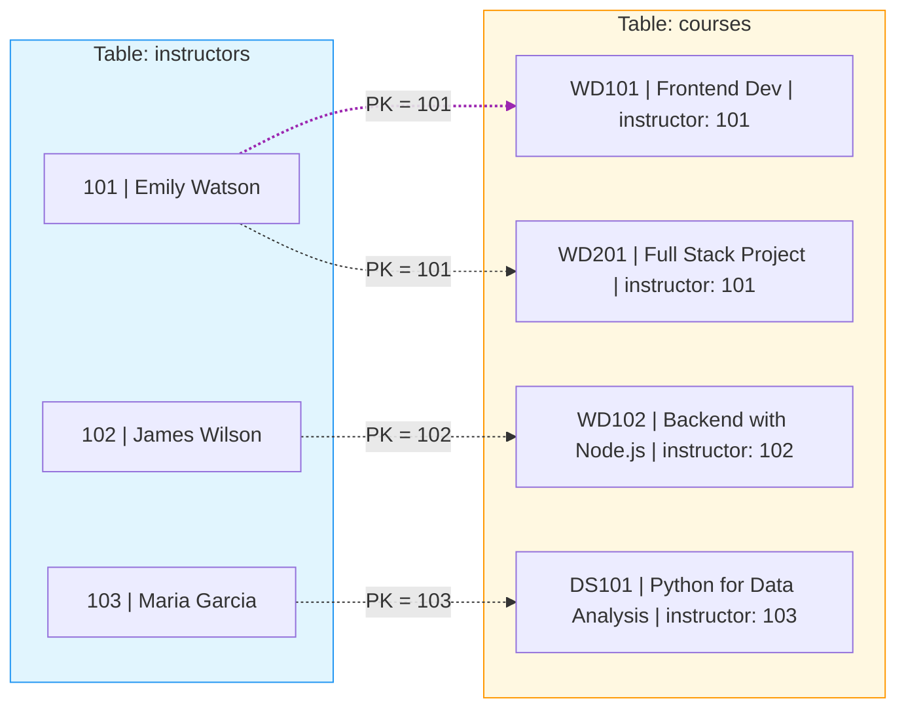

By looking at the `Courses` table, you can see the **"Passport Number"** of the teacher. This tells the database: *"This course belongs to that specific instructor."*

| Table | Column | Key Type | Purpose |
|-------|--------|----------|---------|
| `instructors` | `instructor_id` | Primary Key | Uniquely identifies each instructor |
| `courses` | `instructor_id` | Foreign Key | Links each course to its instructor |

---

### 💎 Why Foreign Keys? (The Artisan's Efficiency)

You've seen how Foreign Keys create links between tables. But why go through all this trouble? Why not just put the **Instructor's Name** directly in the `Courses` table?

| Bad Design (No FK) | Good Design (With FK) |
|-------------------|----------------------|
| `courses` table | `courses` table |
| course_id | course_id |
| course_name | course_name |
| **instructor_name** | **instructor_id (FK)** |
| instructor_email | |
| instructor_phone | |
| instructor_bio | |

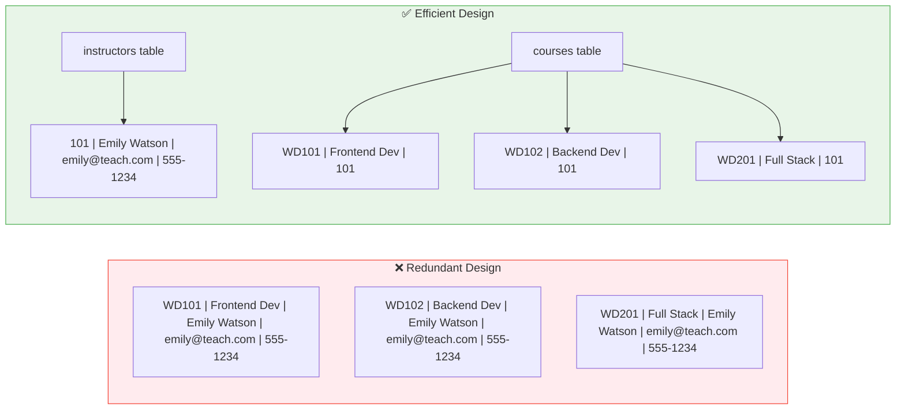

### 🔍 The Problem with Redundancy

| Issue | What Happens |
|-------|--------------|
| **Inconsistent Data** | If Emily Watson gets married and changes her name, you'd have to update **every course** she teaches. Miss one, and your data is corrupted. |
| **Multiple Points of Failure** | The same problem happens when Emily changes her **email** or **phone number**. Each change requires updating dozens of rows. |
| **Wasted Space** | Her email and phone number are repeated dozens of times across the database – a massive waste of storage at scale. |
| **Update Nightmare** | A simple name change becomes a complex, error-prone operation affecting multiple tables and hundreds of rows. |

### 💡 The Artisan's Solution: Normalization

**Normalization** is the art of storing each piece of information **exactly once**. The Instructor's details live in the `instructors` table. The `courses` table simply **references** them with a Foreign Key.

| Principle | Implementation |
|-----------|----------------|
| **Store Once** | Instructor details in one place |
| **Reference Everywhere** | Use Foreign Keys to point back |
| **Update Once, Update Everywhere** | Change the instructor's name, email, or phone once, and all courses automatically see the update |

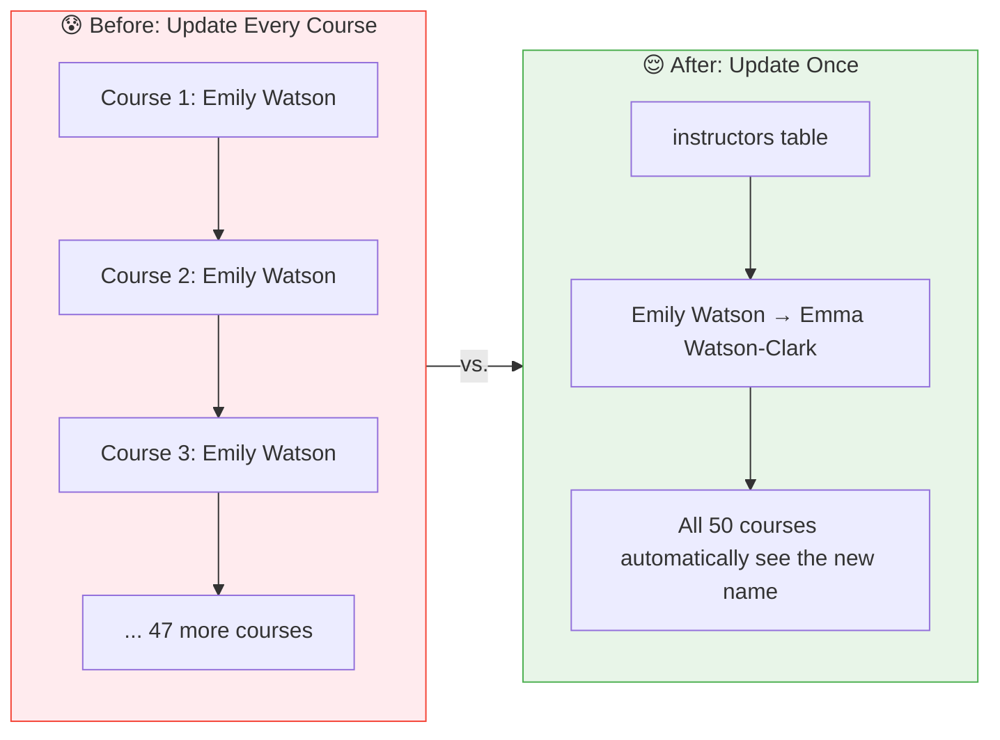

> 💎 **The Artisan's Efficiency Truth:** *"A master craftsman doesn't carry their entire toolbox to every job – they carry just the tools they need, and they know exactly where to find the rest. Foreign Keys are how databases achieve that same elegance. When Emily Watson becomes Emma Watson-Clark, you change it once, and the entire database stays in perfect harmony."*

---

> 💎 **The Artisan's Truth:** *"The Primary Key is a promise: 'This record is unique, and I will always find it.' The Foreign Key is a thread: 'This record belongs with that one over there.' Together, they weave the fabric of relational data."*

---

## 🎯 Why Use Relational Databases?

| Benefit | Explanation |
|---------|-------------|
| **Data Integrity** | Rules and constraints ensure accuracy. No orphan records, no invalid data. |
| **Flexibility** | Add, modify, and query data without restructuring the entire system. |
| **Consistency** | ACID compliance guarantees reliability even under concurrent access. |
| **Scalability** | Handle millions to billions of rows efficiently. |
| **Security** | Granular permissions, encryption, and audit trails protect your data. |
| **Reduced Redundancy** | Data is stored once and referenced everywhere – no duplication. |

---

## 🌍 Popular Examples of RDBMS

### Open Source
- **MySQL** – The world's most popular open-source database. Powers many web applications.
- **PostgreSQL** – Advanced, feature-rich, and highly extensible. The "gold standard" of open-source RDBMS.
- **MariaDB** – A community-developed fork of MySQL, designed to remain open-source.

### Proprietary / Enterprise
- **Oracle Database** – Industry leader for large-scale enterprise applications. Used by banks, governments, and Fortune 500 companies.
- **Microsoft SQL Server** – Deeply integrated with the Microsoft ecosystem. Popular in corporate environments.
- **IBM DB2** – Enterprise-grade database with strong support for AI and machine learning workloads.

### Cloud-Based
- **Amazon RDS** – Managed database service supporting multiple engines (MySQL, PostgreSQL, Oracle, etc.).
- **Google Cloud SQL** – Fully managed MySQL, PostgreSQL, and SQL Server on Google Cloud.
- **Azure SQL Database** – Microsoft's cloud-based SQL Server offering.

---

## 🏛️ The Artisan's Insight

> *"A relational database is not just a collection of tables. It's a carefully designed system where every piece of data knows its place, and every piece knows how to find its related pieces. The **relationships** are what turn a list into a story."*

> *"When you write a query, you're not just asking for data. You're tracing the threads that connect customer to order, order to product, product to category. The database returns not just facts, but **meaning**."*

---
Now that you've mastered the **theory**, let's put it to the test with a real-world audit.

### 🏛️ The Artisan's Challenge: The Ghost in the Machine

Since you've mastered the "physics" of the SQLVerse, it's time to see if you can spot violations before they corrupt your database. Here is a challenge designed to test your eye for **Data Integrity** and **ACID compliance**.

**The Scenario:** You are auditing a spreadsheet that a junior analyst wants to import into the **E-Commerce Planet** database. This is what the spreadsheet contains:

| order_id | customer_name | product | price | order_status |
|----------|---------------|---------|-------|--------------|
| 5001 | Sarah Chen | Laptop | 1200 | Shipped |
| 5002 | Mike Rodriguez | Mouse | 25 | Pending |
| **NULL** | Jessica Park | Keyboard | 45 | Processing |
| 5001 | Sarah Chen | Laptop | 1200 | Shipped |

> ⚠️ **Critical Note:** A real database would **never** allow this data to be imported. Your job is to identify why before it corrupts the system.

### 🛠️ Your Tasks:

1. **Spot the Primary Key Violation:** Two rows in this spreadsheet would break the most sacred law of Primary Keys if imported. Which rows are they, and **why** would the database reject them?
2. **Spot the "NULL" Danger:** One row has a `NULL` in the `order_id` column. Why would the database refuse to import this row?
3. **The ACID Test:** Imagine the import process works for 5001 and 5002, but crashes during 5003. The database subtracts the item from inventory but never creates the order record. Which specific property of **ACID** ensures that the inventory is "rolled back" so the item doesn't just disappear?

---

### 💡 Artisan's Hint

Remember, a **Relational Database** isn't a spreadsheet. It enforces rules automatically. The errors above would cause the entire import to fail – protecting your data from corruption.

---

## 🏛️ Audit Report: The Ghost in the Machine

### 1️⃣ The Primary Key Violation (Duplicate IDs)

**The Problem:** Row 1 and Row 4 both use `order_id: 5001`.

**The Violation:** Uniqueness.

**Why it matters:** In an RDBMS, the Primary Key is the "Source of Truth." If Sarah Chen calls to complain about Order 5001, the database won't know which row to update. You might ship the item twice or delete the wrong record. An RDBMS would throw an error the moment you tried to insert that second "5001."

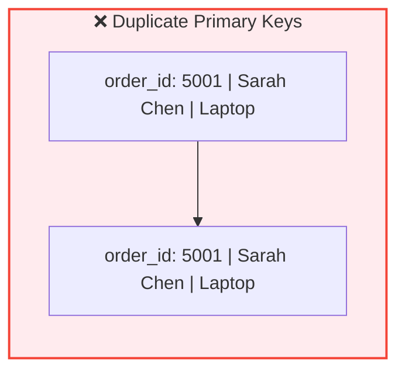

### 2️⃣ The "NULL" Danger

**The Problem:** Jessica Park's order has a `NULL` for an `order_id`.

**The Violation:** Entity Integrity (No NULLs in PKs).

**Why it matters:** A Primary Key is a **"Passport."** You cannot have a citizen without a passport number. Without an ID, this row is a **"Ghost Record"**—you can't link it to a payment, a shipment, or a customer record in another table because there is no identifier to "hook" onto.

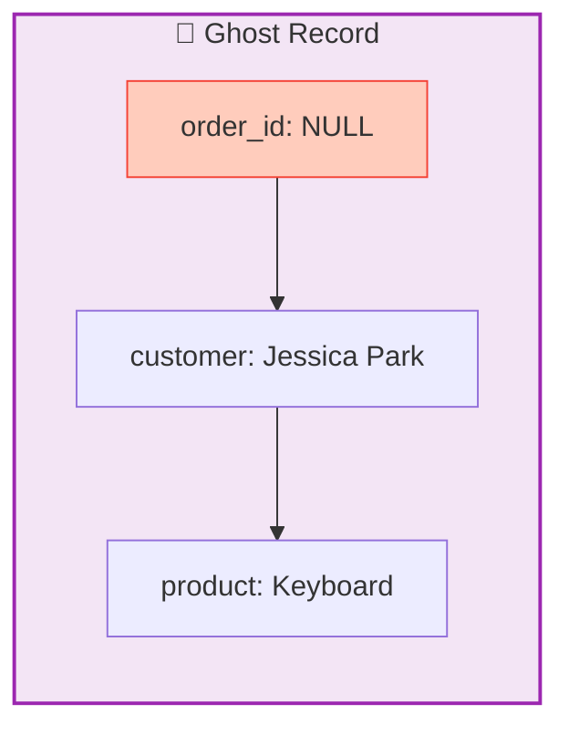

### 3️⃣ The ACID Test

**The Problem:** System crash during the transaction.

**The Solution:** **Atomicity.**

**Why it matters:** Atomicity is the **"All or Nothing"** rule. Because the transaction (Subtract Inventory + Create Order) didn't finish the final step, the database treats the whole thing as if it never happened. It **rolls back** the inventory count. Without Atomicity, your warehouse would think an item was sold when no order actually exists.

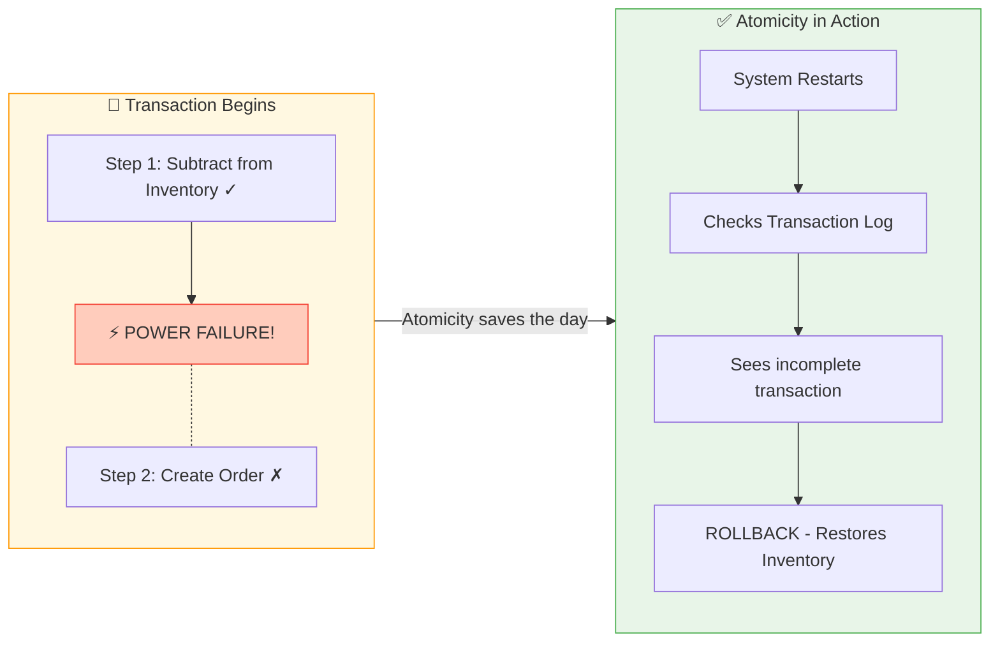

---

### 💎 The Artisan's Conclusion

> *"In a spreadsheet, rules are suggestions. In a Database, rules are **Constraints**. By enforcing these laws, the RDBMS ensures that every piece of data is unique, traceable, and reliable. The Ghost in the Machine has no place in the SQLVerse."*

**Case closed.** The Ghost has been exorcised from E-Commerce Planet.

---
### 🎭 **The Learner's Journey**

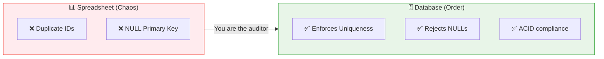

---

## ✅ What You've Learned

After reading this file, you should understand:

- [ ] What a relational database is and how it differs from a simple list
- [ ] The four key features: Tables, Primary Keys, SQL, and ACID
- [ ] The core components: rows, columns, tables, and relationships
- [ ] Why relational databases are preferred for enterprise applications
- [ ] Popular RDBMS options across open source, enterprise, and cloud

---

## 🚀 What's Next?

This was your foundation. When you move to File 2: Domains and Entities, you'll see how we define these "Nouns" (Entities) and their "Rules" (Domains—like making sure an email actually looks like an email).

Now proceed to the next file in The Architect's Ledger:

➡️ **[2-Domains-And-Entities.md](./2-Domains-And-Entities.md)** – Understand the building blocks of data modeling.

---

*Part of our mission for 🎯 Quality Education for Anyone, Anywhere, Anytime — 💫 with Comfort, Convenience at no Cost.*

**Level 1 | Module 3 | The Architect's Ledger | Next: [Domains & Entities](./2-Domains-And-Entities.md)**