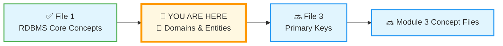
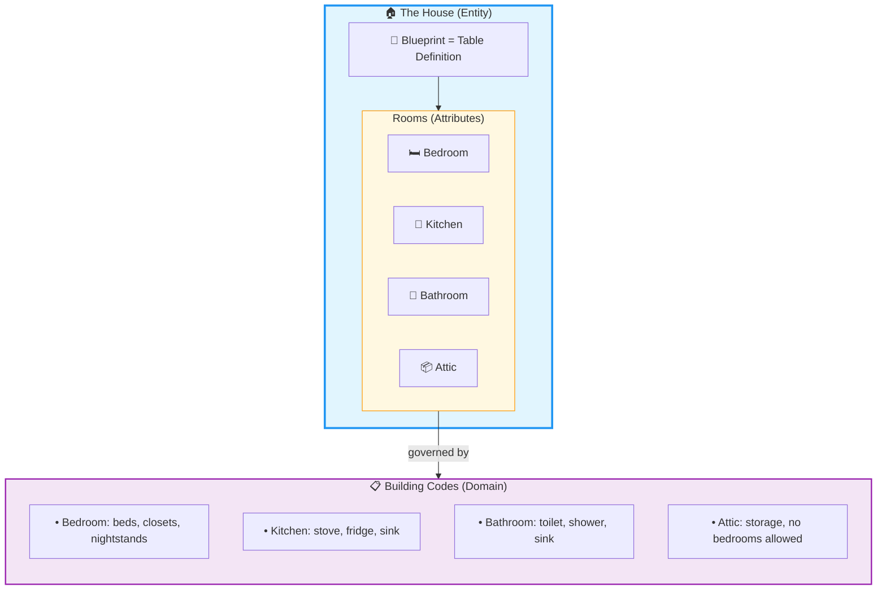
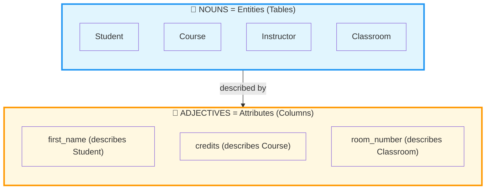
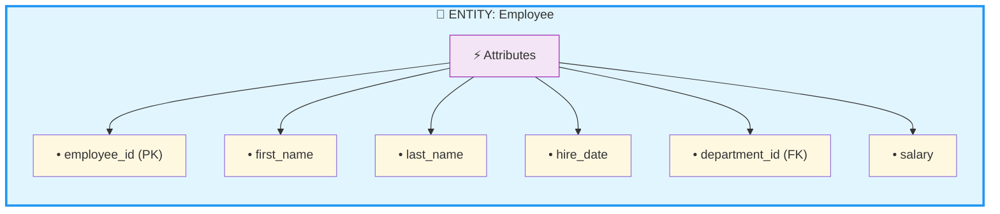
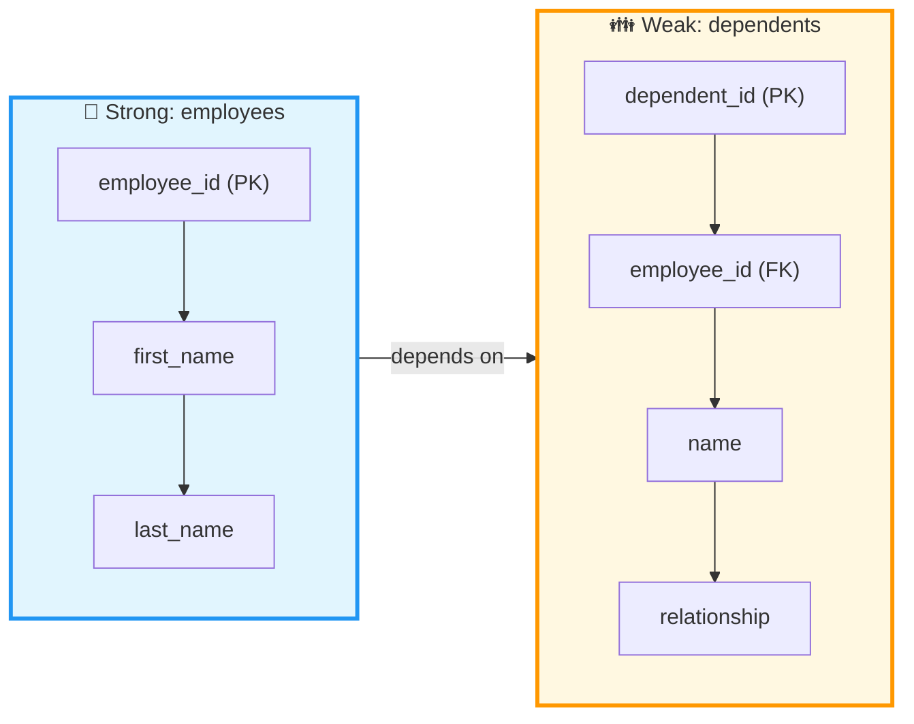
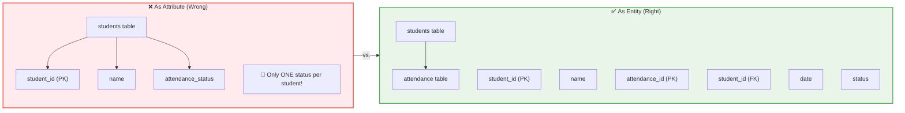

# 🗄️🤖 SQL & GenAI Course
**🎯 Quality Education for Anyone, Anywhere, Anytime — 💫 with Comfort, Convenience at no Cost**

---

## 🏛️ The Architect's Ledger: Domains and Entities

Welcome back to **The Architect's Ledger**. In the first file, you learned the core RDBMS concepts – the **physics** that govern every world in the SQLVerse. Now, we dive into the **building blocks** themselves: **Domains** and **Entities**.

If RDBMS concepts are the laws of physics, then Domains and Entities are the **matter** that those laws govern. Understanding them is like understanding the difference between a blueprint (the plan) and the actual bricks, windows, and doors (the physical components).

---

## 🌌 SQLVerse Check-In

<div style="border-left: 4px solid #9c27b0; background-color: #f3e5f5; padding: 15px; margin: 20px 0; border-radius: 0 8px 8px 0;">

**You're still on Education Planet, but now you're moving from physics to architecture.** In the last file, you learned *how* the SQLVerse works. Now, you'll learn *what* it's made of.

Domains and Entities are the fundamental building blocks of every database world. Master these, and you'll never look at an app the same way again.

**The difference between a coder and an Artisan is discipline.**

</div>

---

### 📍 Your Current Stage



You've completed the first file in The Architect's Ledger. Now you'll explore the building blocks of data modeling.

---

## 🧩 What is a Domain? (The Big Picture)

The word **"domain"** appears everywhere in technology – often with slightly different meanings. Let's clarify.

### 🌍 What is a Domain? (General)

In general usage, a **domain** is a sphere of knowledge, influence, or activity. Think of it as a **category of human endeavor**.

| Domain | Examples |
|--------|----------|
| **Healthcare** | Hospitals, patients, doctors, prescriptions |
| **Education** | Students, courses, enrollments, grades |
| **Finance** | Accounts, transactions, loans, interest rates |
| **Retail** | Customers, products, orders, inventory |

Every industry has its own domain, with its own vocabulary, rules, and data challenges.

### 💻 What is a Domain? (Software Engineering)

In software engineering, a **domain** is the subject area for which a software system is built. When we say "HR software," we mean software designed for the **HR domain** – it understands employees, departments, payroll, benefits, and the relationships between them.

> 💡 **The Artisan's Insight:** *"A domain expert knows the business. A software developer knows the code. A Data Artisan knows both – and builds systems that bridge the two."*

### 🗄️ What is a Domain? (RDBMS)

In relational databases, a **domain** is the set of allowable values for a column. It defines:

- The **data type** (integer, text, date, etc.)
- **Constraints** (NOT NULL, UNIQUE, CHECK)
- The **range** of acceptable values
- The **format** of the data

### 🏠 **The Architectural Analogy for Domain**

Think of the **Entity** as the blueprint for a house, the **Attributes** as the specific rooms, and the **Primary Key** as the unique street address. Without the address, you can't find the house. Without the blueprint, you don't know what's inside.

To keep this architectural analogy consistent, the **Domain** is the **Building Code** or the **Zoning Laws**.

If the **Entity** is the blueprint for the house and the **Attributes** are the rooms, the **Domain** defines the strict rules for what can actually go inside those rooms.



- **The Rule:** You can't put a full-sized swimming pool in the upstairs guest bedroom.
- **The Domain:** The "Bedroom Domain" only allows for things like beds, closets, and nightstands.
- **The SQL Reality:** If an attribute is `Age`, the **Domain** is "Positive Integers." You can't put the word "Blue" in the Age column any more than you can put a bathtub in the middle of a kitchen.

Let's break this down into a simple table to see how all the pieces fit together.

---
### 🔍 Breaking It Down

| Concept | Architectural Metaphor | SQL Reality |
|:---:|:---:|:---|
| **Entity** | The House Blueprint | The Table (`students`) |
| **Attribute** | A Specific Room | A Column (`birth_date`) |
| **Primary Key** | The Unique Street Address | The Unique ID (`student_id`) |
| **Domain** | **The Building Code** | **The Data Type & Constraints** (`DATE` format) |

---

### 🛠️ Why Domain Matters for the Artisan

Without a defined **Domain**, your database becomes a **"Hoarder's House."** You might find a lawnmower in the pantry or a stove in the shower.

**Domain Integrity** ensures that:

1. **Data is Valid:** You don't have a "Price" of -$50.
2. **Data is Consistent:** Dates are always `YYYY-MM-DD`, not a mix of text and numbers.
3. **Calculations Work:** You can't calculate the average of "Apple" and "Orange."

> 💎 **The Artisan's Truth:** *"The **Domain** is the invisible boundary that keeps your data pure. It is the promise that every piece of information in a column belongs there. As an Architect, you don't just build rooms; you define their purpose."*

Here's how domains look in real SQL on HR Planet:

**HR Planet Example:**
```sql
salary_amount DECIMAL(10,2) CHECK (salary_amount >= 0)
```
The domain for `salary_amount` is: positive decimal numbers with up to 10 total digits and 2 decimal places.

```sql
employee_status TEXT CHECK (employee_status IN ('Active', 'Probation', 'Terminated'))
```
The domain for `employee_status` is: exactly one of three specific text values.

---

## 🧩 What is an Entity?

An **entity** is a real-world object or concept that can be distinctly identified. In databases, entities become **tables**.

**HR Planet Examples:**
- `Employee` (a person who works for the company)
- `Department` (an organizational unit)
- `Salary` (a financial record)
- `Project` (a work assignment)

### Key Characteristics of an Entity

| Characteristic | Description | HR Example |
|----------------|-------------|------------|
| **Identifiable** | Has a unique identifier (Primary Key) | `employee_id` |
| **Relevant** | Matters to the business domain | Employees are central to HR |
| **Persistent** | Needs to be stored over time | Employee records last for years |
| **Describable** | Has attributes that define it | Name, hire date, department |

---

### 🏛️ The Artisan's Rule of Thumb

When you are looking at a business problem and trying to decide how to build your tables, use the **"Noun vs. Adjective"** test:

| Role | Part of Speech | Becomes | Example |
|------|----------------|---------|---------|
| **Entity** | **Nouns** | **Tables** | Student, Course, Instructor, Classroom |
| **Attribute** | **Adjectives/Details** | **Columns** | `first_name`, `credits`, `room_number` |

### 🧪 How to Apply the Test

**For Entities (Nouns):**
- Ask: *"Can I have a list of these?"*
- If yes, it's probably an Entity.
- *Examples:* A list of Students. A list of Courses. A list of Instructors.

**For Attributes (Adjectives):**
- Ask: *"Does this make sense on its own, or does it need to belong to a Noun?"*
- `first_name` makes no sense without a Student. It's an Attribute.
- `credits` only matters for a Course. It's an Attribute.
- `room_number` describes a Classroom. It's an Attribute.



---

### ⚠️ The Trap: When Attributes Become Entities

Sometimes a detail is so important it *graduates* to become its own Entity. This is a sign of a well-designed database.

| Scenario | Initial Thought | Better Design |
|----------|-----------------|---------------|
| **Address** | Start as attribute in `students` table | If students can have multiple addresses (home, mailing, emergency), `address` becomes its own table |
| **Phone Number** | Start as attribute in `customers` table | If customers can have multiple phones (mobile, work, home), `phone` becomes its own table |
| **Order Item** | Start as attribute in `orders` table | An order contains multiple products – `order_items` becomes its own entity |

```mermaid
flowchart LR
    subgraph BAD["❌ Bad Design"]
        direction TB
        B1["students"]
        B2["student_id (PK)"]
        B3["name"]
        B4["address_line1"]
        B5["address_line2"]
        B6["city"]
        B7["state"]
        B8["zip"]
        B9["mailing_address"]
    end
    
    subgraph GOOD["✅ Good Design"]
        direction TB
        G1["students"] 
        G2["student_id (PK)"]
        G3["name"]
        
        G4["addresses"]
        G5["address_id (PK)"]
        G6["student_id (FK)"]
        G7["address_type"]
        G8["line1"]
        G9["city"]
        G10["zip"]
    end
    
    BAD -->|"vs."| GOOD
    
    style BAD fill:#ffebee,stroke:#f44336,stroke-width:2px
    style GOOD fill:#e8f5e8,stroke:#4caf50,stroke-width:2px
    
    style B1 fill:#ffcdd2
    style B2 fill:#ffcdd2
    style B3 fill:#ffcdd2
    style B4 fill:#ffcdd2
    style B5 fill:#ffcdd2
    style B6 fill:#ffcdd2
    style B7 fill:#ffcdd2
    style B8 fill:#ffcdd2
    style B9 fill:#ffcdd2
    
    style G1 fill:#c8e6c9
    style G2 fill:#c8e6c9
    style G3 fill:#c8e6c9
    style G4 fill:#c8e6c9
    style G5 fill:#c8e6c9
    style G6 fill:#c8e6c9
    style G7 fill:#c8e6c9
    style G8 fill:#c8e6c9
    style G9 fill:#c8e6c9
    style G10 fill:#c8e6c9
```



> 💎 **The Artisan's Truth:** *"A detail is just a detail – until it becomes a collection. The moment you find yourself repeating an attribute, it's trying to tell you something. Listen to it. Let it become the entity it was meant to be."*

---

## 🏛️ Visualizing Entities and Their Attributes



An **entity** becomes a **table**. Its **attributes** become **columns**. Each specific instance (like "John Smith, employee #101") becomes a **row**.

---

## 🔍 Types of Entities

| Type | Description | HR Example |
|------|-------------|------------|
| **Strong Entity** | Exists independently | `employees` |
| **Weak Entity** | Depends on another entity | `employee_dependents` (can't exist without an employee) |
| **Tangible** | Physical object | `office_buildings` |
| **Intangible** | Conceptual | `job_positions`, `departments` |

### Strong vs. Weak Entities



A **weak entity** cannot exist without its **strong entity**. If an employee leaves, their dependents records should also be removed – they don't make sense on their own.

---

## 🔑 Entity vs. Entity Type vs. Entity Set

| Term | Meaning | HR Example |
|------|---------|------------|
| **Entity** | A single instance | "John Smith, Employee #101" |
| **Entity Type** | The category or template | `Employee` (the table definition) |
| **Entity Set** | Collection of all instances | All rows in `employees` table |

Think of it like baking cookies:
- **Entity Type** = The cookie cutter (the shape/definition)
- **Entity** = One cookie (a specific instance)
- **Entity Set** = The whole batch of cookies (all instances)

---

## 📊 Domains and Data Types

Every attribute of an entity has a **domain** – the set of values it can hold.

| Data Type | Domain Example | Entity Attribute |
|-----------|----------------|------------------|
| `INTEGER` | Whole numbers (1, 2, 3, ...) | `employee_id`, `department_id` |
| `TEXT` | Character strings | `first_name`, `last_name`, `email` |
| `DATE` | Calendar dates | `hire_date`, `birth_date` |
| `DECIMAL` | Precise numbers with decimals | `salary`, `bonus_amount` |
| `BOOLEAN` | True/False values | `is_active`, `certificate_issued` |

```sql
-- Creating a table with carefully defined domains
CREATE TABLE employees (
    employee_id INTEGER PRIMARY KEY,           -- Domain: positive integers
    first_name TEXT NOT NULL,                   -- Domain: text, cannot be empty
    last_name TEXT NOT NULL,                     -- Domain: text, cannot be empty
    email TEXT UNIQUE,                           -- Domain: text, must be unique
    hire_date DATE NOT NULL,                     -- Domain: valid dates
    salary DECIMAL(10,2) CHECK (salary >= 0),    -- Domain: positive decimals
    is_active BOOLEAN DEFAULT TRUE                -- Domain: true/false
);
```

---

## 🏛️ The Artisan's Insight

> *"Domains are the vocabulary of your data. Entities are the nouns. Attributes are the adjectives. Together, they form the language your database speaks."*

> *"When you design a database, you're not just organizing information – you're defining what can and cannot exist in your world. A well-defined domain prevents chaos. A clear entity model tells the story of your business."*

> *"In the SQLVerse, every planet has its own entities – students on Education Planet, customers on E-Commerce Planet, employees on HR Planet. But the principles of domain and entity design are universal."*

---

### 🏛️ The Artisan's Challenge

Before you move to the final file in the Ledger—**Primary Keys**—let's put your new "Noun vs. Adjective" and "Domain" skills to the test with a quick **Blueprint Challenge**.

Imagine you are designing a system for **Education Planet** to track **Student Attendance**.

**The Scenario:**
A teacher wants to mark whether a student was "Present," "Absent," or "Late" for a specific class on a specific date.

1. **Identify the Entity:** Is "Attendance" an Entity or an Attribute of the Student?
2. **Identify the Attributes:** What details do we need to store for one "Attendance" record?
3. **Define the Domain:** For the `status` attribute (Present/Absent/Late), what would be the most efficient **Domain** (Data Type and allowed values)?

---

### 🏛️ The Attendance Challenge: Solution

#### 1. Identify the Entity: Entity or Attribute?

**Answer: Entity.**

While "Present" sounds like an adjective (attribute), **Attendance** is a collection of unique events. If we made it an attribute of the `students` table, we could only store *one* status per student. To track attendance for many days across many classes, we need a separate "Noun" (Table). 

This scenario is a classic example of where an **"Attribute"** (the state of being present) **graduates** into a full **"Entity"** because it needs to track a collection of events over time.

🔑 **Key Insight:** *"Whenever you need to track a history of values over time, your attribute is trying to tell you something – it wants to become an entity."*



#### 2. Identify the Attributes

To make one attendance record meaningful, we need:

| Attribute | Purpose | Data Type |
|-----------|---------|-----------|
| `attendance_id` | The Primary Key (unique identifier) | INTEGER |
| `student_id` | Who was marked? (Foreign Key) | INTEGER |
| `class_id` | Which class? (Foreign Key) | INTEGER |
| `attendance_date` | When did this happen? | DATE |
| `status` | How did the student attend? | TEXT |

#### 3. Define the Domain for `status`

**Answer:** The domain for `status` is a **restricted set of text values**. It can only be one of three possibilities: `'Present'`, `'Absent'`, or `'Late'`.

In SQL, we would define this as:
```sql
status TEXT  -- The domain is: only 'Present', 'Absent', or 'Late'
```

> 💡 **Module 4 Preview:** In **Module 4: Joining Tables**, you'll learn to enforce this domain using **CHECK constraints** and explore how this `attendance` table connects to `students` and `classes` through **Foreign Keys**.

> 💎 **The Artisan's Insight:** *"By making Attendance an Entity, you've moved from a snapshot (the student is present today) to a history (the student's attendance record over the year). This is how data turns into insights."*

**Well done!** You've just designed your first entity – a crucial milestone on your journey from data user to data architect.

---

## 👁️ Preview: From Entities to ER Diagrams

In Module 4, you'll learn to convert these entities into full **Entity-Relationship (ER) Diagrams** and then into actual SQL tables with defined relationships. The foundation you're building here – understanding what entities are and how they relate – is what makes that possible.

For now, just practice looking at the world around you and identifying:
- What are the **entities**? (Nouns)
- What are their **attributes**? (Adjectives describing them)
- What are the **domains** of those attributes? (What values can they take?)

---

## ✅ What You've Learned

After reading this file, you should understand:

- [ ] What "domain" means in general, in software, and in RDBMS
- [ ] What an entity is and its key characteristics
- [ ] The difference between strong and weak entities
- [ ] How entities become tables and attributes become columns
- [ ] The distinction between entity, entity type, and entity set
- [ ] How domains define the allowable values for attributes
- [ ] Real HR Planet examples of entities and domains

---

## 🚀 What's Next?

You’ve defined the **House** and the **Rules**. Now, it’s time to assign the **Passport**. Without a Primary Key, a database is just a pile of data with no way to point at a specific row and say, *"That one. Not the one that looks like it—that exact one."* 

In **File 3: Primary Keys**, you will learn about the **immutability** and **uniqueness** that keep the SQLVerse from collapsing into a sea of duplicate data. This is the final piece of your architectural foundation before you start writing queries again.

➡️ **[3-Primary-Key.md](./3-Primary-Key.md)** – The passport of every row

---

*Part of our mission for 🎯 Quality Education for Anyone, Anywhere, Anytime — 💫 with Comfort, Convenience at no Cost.*

**Level 1 | Module 3 | The Architect's Ledger | Next: [Primary Keys](./3-Primary-Key.md)**