# 🗄️🤖 SQL & GenAI Course
**🎯 Quality Education for Anyone, Anywhere, Anytime — 💫 with Comfort, Convenience at no Cost**

---

## 🏛️ The Architect's Ledger: Primary Keys – The Passport of Every Row

Welcome to the final file in **The Architect's Ledger**. You've learned the **physics** of the SQLVerse (RDBMS Core Concepts). You've learned the **building blocks** (Domains and Entities). Now, you'll learn what makes each row **unique**: **Passport**—the **Primary Key**.

If RDBMS concepts are the laws of physics, and Entities are the matter, then Primary Keys are the **identity** of every particle. Without them, the SQLVerse would be a universe of look-alikes, where you could never be sure which Sarah Chen ordered which laptop.

Without a Primary Key, a database is just a heap of data. With it, every single row becomes a distinct individual that can be tracked, linked, and updated with surgical precision.

---

## 🌌 SQLVerse Check-In

<div style="border-left: 4px solid #9c27b0; background-color: #f3e5f5; padding: 15px; margin: 20px 0; border-radius: 0 8px 8px 0;">

**You are finishing your architectural training on Education Planet.** Now, you’re giving every **inhabitant** of your database a unique identity.

The Primary Key is the most fundamental constraint in all of data. It's the difference between a pile of **unlabeled photographs** and a perfectly organized **family album**.

A Primary Key isn't just a column; it's a **guarantee**. It is the promise that no matter how large the **SQLVerse** grows, you will always be able to find **exactly** what you’re looking for.

**The difference between a coder and an Artisan is discipline.**

</div>

---

### 📍 Your Current Stage

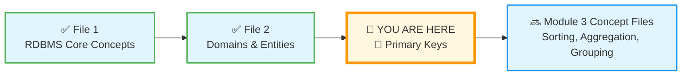

You've completed the first two files in The Architect's Ledger. Now you'll master the concept that makes relational databases truly "relational."

---

## 🔑 What is a Primary Key?

A **Primary Key** is a column (or set of columns) that uniquely identifies each row in a table. It's the database equivalent of a **passport** – no two rows can share the same primary key value, and every row must have one.

### 🏛️ Visualizing the Primary Key

Here's how a Primary Key looks in a table from your own **Education Planet** training:

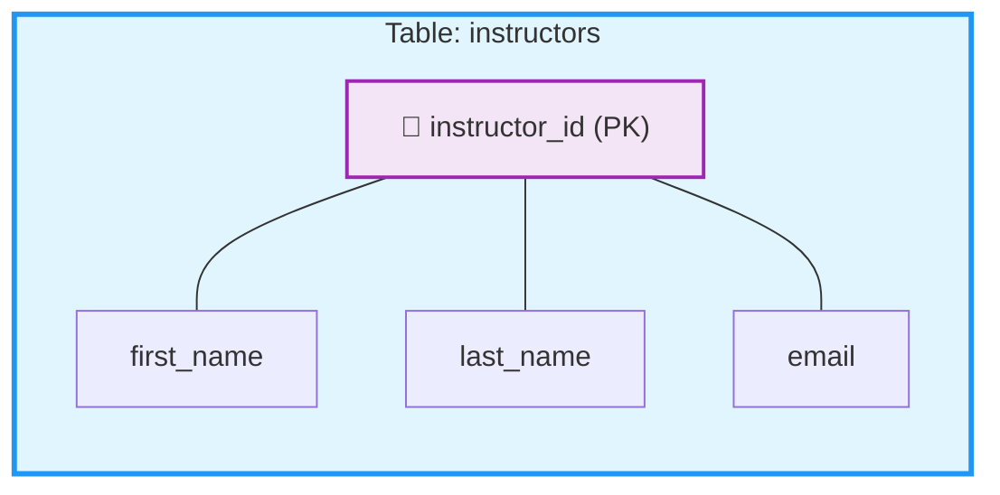

Every instructor in this table has a unique `instructor_id`. Emily Watson might be ID 101, James Wilson ID 102, and Maria Garcia ID 103. Even if two instructors share the same name, their IDs will always be different.

### 💼 A More Detailed Example

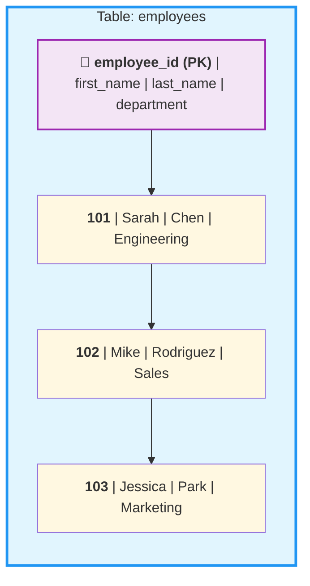

> 💡 **Think of it this way:** In a room full of people, many might share the same name. But only one person has your specific passport number. That's what a Primary Key does for your data.


---

### 📜 The Three Sacred Laws of the Primary Key

Every Primary Key, in every table, across the entire SQLVerse, must obey these three immutable laws:

### 1️⃣ **Uniqueness**
No two rows can ever share the same Primary Key value. In a table of 10,000 students, every single one must have a distinct identifier. This is how the database knows that Sarah Chen (ID: 101) is different from Sarah Chen (ID: 205).

### 2️⃣ **Non-Nullability**
A Primary Key can never be `NULL`. You cannot exist in the database without an identity. Every row – every student, every course, every order – must have a Primary Key. A row without a PK is a **ghost** – present but untouchable, unlinkable, and un-updateable.

### 3️⃣ **Immutability**
A Primary Key should never, ever change. If the identity of a row changes, the **"threads"** (Foreign Keys) connecting it to other tables will break. Imagine if your passport number changed every year – every visa, every border crossing, every hotel reservation linked to that number would be lost forever.

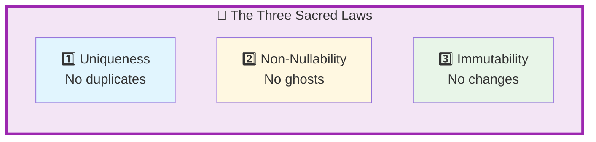

> 💎 **The Artisan's Truth:** *"These three laws aren't just rules – they're the constitution of your database. Violate them, and your data descends into chaos. Honor them, and your data will serve you faithfully for years."*

---

## 🏛️ The Passport Metaphor – Revisited

Remember the **passport metaphor** from Module 1? Let's bring it back and see how it maps perfectly to Primary Keys.

| Passport Element | Primary Key Equivalent |
|------------------|------------------------|
| **Passport Number** | The Primary Key value |
| **Your Photo** | The entire row of data |
| **Issuing Country** | The table it belongs to |
| **Never Reused** | Once a passport number is retired, it's never given to someone else |
| **Uniqueness** | No two citizens share the same passport number |

```mermaid
flowchart LR
    subgraph PASSPORT["🛂 Your Passport"]
        direction TB
        P1["Passport Number: <b>X123456</b>"]
        P2["Name: Sarah Chen"]
        P3["Nationality: SQLVerse"]
        P4["Issued: 2024-01-15"]
    end
    
    subgraph DATABASE["🗄️ Database Row"]
        direction TB
        D1["employee_id: <b>101</b>"]
        D2["first_name: Sarah"]
        D3["last_name: Chen"]
        D4["hire_date: 2024-01-15"]
    end
    
    PASSPORT -->|"Same Principle"| DATABASE
    
    style PASSPORT fill:#e1f5fe,stroke:#2196f3
    style DATABASE fill:#fff8e1,stroke:#ff9800
    style P1 fill:#f3e5f5,stroke:#9c27b0
    style D1 fill:#f3e5f5,stroke:#9c27b0
```

> 💎 **The Artisan's Truth:** *"Just as your passport proves who you are anywhere in the world, a Primary Key proves which row is which anywhere in the database. Lose the passport, and you lose your identity. Lose the Primary Key, and you lose your data."*

---

## 🏗️ Types of Primary Keys

### 1. **Natural Key**
Uses existing data that's naturally unique.

| Pros | Cons |
|------|------|
| No extra column needed | Can change (people change names, emails) |
| Makes sense to humans | May not be guaranteed unique |

**Example:**
```sql
-- Using Social Security Number as Natural Key
CREATE TABLE employees (
    ssn TEXT PRIMARY KEY,  -- Risky! SSNs can change, and they're sensitive
    first_name TEXT,
    last_name TEXT
);
```

### 2. **Surrogate Key**
An artificial, auto-generated ID with no business meaning. This is the **Artisan's choice** for most tables.

| Pros | Cons |
|------|------|
| Never changes | Has no meaning to humans |
| Always unique | Requires an extra column |
| Fast for searching | |
| Simple for relationships | |

**Example:**
```sql
-- Surrogate Key with AUTOINCREMENT (SQLite)
CREATE TABLE employees (
    employee_id INTEGER PRIMARY KEY AUTOINCREMENT,
    first_name TEXT,
    last_name TEXT,
    ssn TEXT UNIQUE  -- Natural key as an alternate
);
```

### 3. **Composite Key**
Sometimes, a single column isn't enough to guarantee uniqueness. In these cases, we use a **Composite Key**—a Primary Key made of two or more columns combined.

| Pros | Cons |
|------|------|
| ✅ No extra column needed | ❌ Can be cumbersome for relationships |
| ✅ Reflects real-world uniqueness | ❌ Slower for searching |
| | ❌ Harder for humans to reference |

### 🏫 **Example 1: Classroom Seating (The Intuitive Case)**

In a school, `seat_number: 5` isn't unique – every room has a seat 5. But the combination of `room_number` **AND** `seat_number` is unique.

| room_number | seat_number | student_id |
|:---:|:---:|:---:|
| 101 | 5 | 501 |
| 102 | 5 | 702 |

```sql
-- Composite Key in action
CREATE TABLE classroom_seating (
    room_number INTEGER,
    seat_number INTEGER,
    student_id INTEGER UNIQUE,
    PRIMARY KEY (room_number, seat_number)
);
```

Here, seat 5 exists in multiple rooms, but each **combination** of room and seat is unique.

### 💼 **Example 2: Employee Projects (The Relational Case)**

In a project tracking system, an employee can work on many projects, and a project can have many employees. The combination of `employee_id` and `project_id` tells us exactly which employee is assigned to which project.

| employee_id | project_id | hours_worked |
|:---:|:---:|:---:|
| 101 | 201 | 40 |
| 101 | 202 | 25 |
| 102 | 201 | 35 |

```sql
-- Composite Key for many-to-many relationships
CREATE TABLE employee_projects (
    employee_id INTEGER,
    project_id INTEGER,
    hours_worked DECIMAL(5,2),
    PRIMARY KEY (employee_id, project_id)
);
```

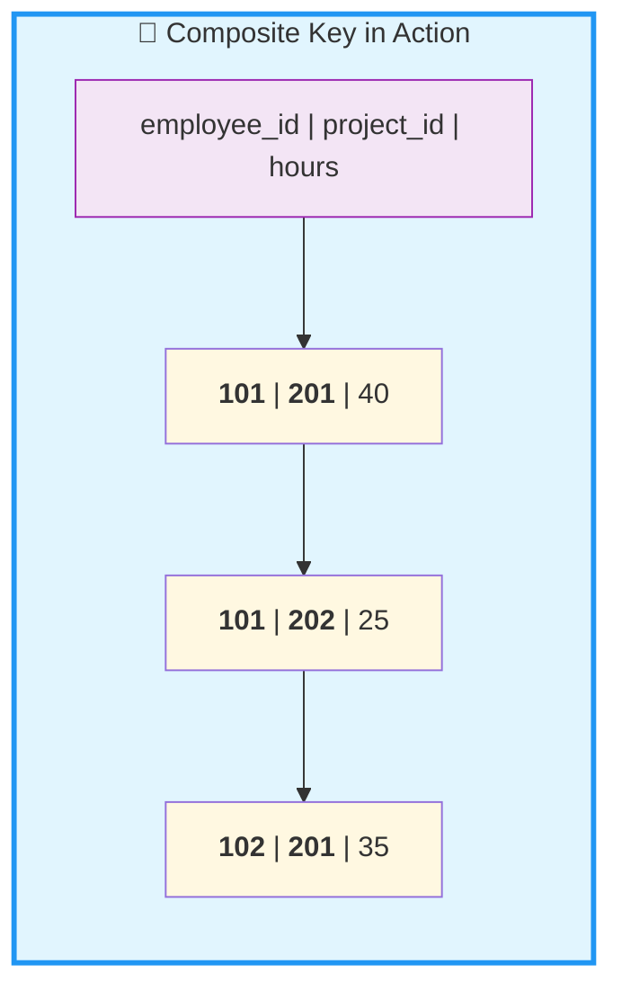

Here, the same employee can be on multiple projects, and the same project can have multiple employees – but each **combination** is unique.


---
## 🎭 Natural vs. Surrogate Keys

As an Architect, you must choose what type of **"Passport"** to issue to every row in your database. Two paths lie before you.

### 1. Natural Keys

A **Natural Key** is a piece of data that already exists in the real world and is naturally unique (e.g., an ISBN for a book, a Vehicle Identification Number for a car, or a Government ID for a person).

| Pros | Cons |
|------|------|
| ✅ Has real-world meaning | ❌ Real-world "uniqueness" is often a lie |
| ✅ No extra column needed | ❌ Names change, people get married |
| ✅ Intuitive to humans | ❌ Government IDs can have errors or be recycled |
| | ❌ Exposes sensitive data |

**Example of a Natural Key:**
```sql
CREATE TABLE books (
    isbn TEXT PRIMARY KEY,  -- ISBN-13 is naturally unique
    title TEXT,
    author TEXT,
    price DECIMAL
);
```

### 2. Surrogate Keys (The Artisan's Choice)

A **Surrogate Key** is a **"meaningless"** number generated by the database (e.g., `student_id: 101`, `customer_id: 45001`). It has no purpose other than to be a unique identifier.

| Pros | Cons |
|------|------|
| ✅ 100% under your control | ❌ No real-world meaning |
| ✅ Never needs to change | ❌ Requires an extra column |
| ✅ Reveals no sensitive information | |
| ✅ Fast for indexing and joins | |
| ✅ Works consistently across all tables | |

**Example of a Surrogate Key:**
```sql
CREATE TABLE students (
    student_id INTEGER PRIMARY KEY AUTOINCREMENT,  -- 101, 102, 103...
    first_name TEXT,
    last_name TEXT,
    email TEXT UNIQUE,
    government_id TEXT UNIQUE  -- Stored securely, NOT the key
);
```

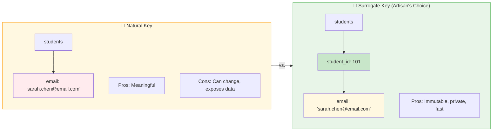

> 💎 **The Artisan's Insight:** *"In the SQLVerse, **meaning** is a liability for a Primary Key. By using a Surrogate Key, you decouple an entity's identity from its details. If a student changes their name, their ID stays the same, and your database remains in perfect harmony. The name is just an attribute; the ID is the true identity."*

---


### 🚫 The "Natural Key" Trap: Why Names and SSNs are Bad Keys

You might be tempted to use a person's **Full Name** or **Government ID (like SSN or Aadhaar)** as a Primary Key. After all, they are unique, right? **Wrong.**

```mermaid
flowchart LR
    subgraph BAD["❌ Bad Natural Key Choices"]
        direction TB
        B1["❌ Full Name"]
        B2["❌ Email Address"]
        B3["❌ Social Security Number"]
        B4["❌ Aadhaar Number"]
        B5["❌ Phone Number"]
        
        style BAD fill:#ffebee,stroke:#f44336,stroke-width:3px
    end
    
    subgraph WHY["⚠️ Why They Fail"]
        direction TB
        W1["Names change (marriage, misspelling)"]
        W2["Emails change (providers, preferences)"]
        W3["Government IDs are private & sensitive"]
        W4["IDs can be recycled over decades"]
        W5["Duplicate names exist everywhere"]
        
        style WHY fill:#fff8e1,stroke:#ff9800
    end
    
    BAD --> WHY
```

### 🔍 The Hidden Dangers

| Trap | What Happens | Why It's Disastrous |
|------|--------------|---------------------|
| **Names Change** | Sarah Chen gets married and becomes Sarah Chen-Watson | You'd have to update **every course, payment, and enrollment record** linked to her. Miss one, and your data is corrupted. |
| **IDs are Private** | Using SSN/Aadhaar as PK exposes sensitive data | Every foreign key in every table carries this private number – a massive security breach waiting to happen. |
| **IDs Get Recycled** | Government agencies sometimes reuse numbers | Imagine a new student getting an old student's ID – suddenly they inherit their grades, fees, and records! |
| **Uniqueness is a Lie** | Multiple "Rahul Sharma" or "John Smith" exist | The database can't tell them apart. You'll end up mixing records between different people with the same name. |

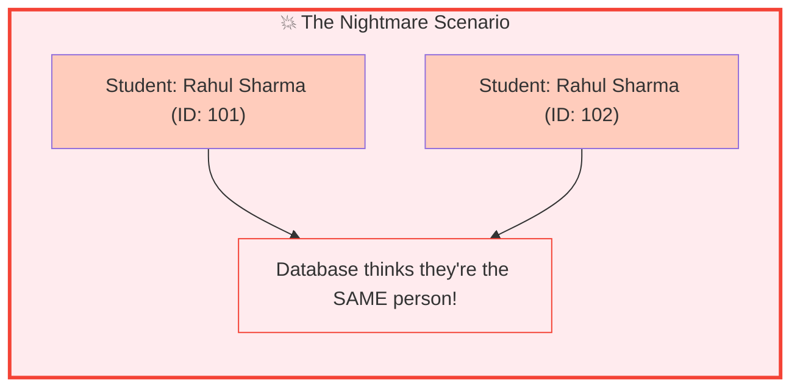

### 💡 The Artisan's Solution: The Surrogate Key

A **Surrogate Key** – a meaningless, auto-incrementing number (like `student_id: 101`) – solves all these problems:

| Problem | How Surrogate Key Solves It |
|---------|----------------------------|
| **Name changes** | The key never changes, even if the name does |
| **Privacy concerns** | The key reveals nothing about the person |
| **ID recycling** | The database generates new, unique numbers |
| **Duplicate names** | Different people get different keys |

```sql
-- The Artisan's Way: Surrogate Key
CREATE TABLE students (
    student_id INTEGER PRIMARY KEY AUTOINCREMENT,  -- 101, 102, 103...
    first_name TEXT,
    last_name TEXT,
    ssn TEXT UNIQUE,  -- Still unique, but NOT the primary key
    email TEXT UNIQUE
);
```

> 💎 **The Artisan's Truth:** *"A natural key is like using your face as your house key. It seems unique, but when you grow a beard or get a haircut, you're locked out. A surrogate key is like a metal key – it never changes, it reveals nothing about you, and it always opens the right door."*

---

## 🎯 Why Surrogate Keys Are the Artisan's Choice

| Reason | Explanation |
|--------|-------------|
| **Immutability** | A surrogate key never changes. Natural keys (like email, SSN, or username) can change – and when they do, every foreign key reference breaks. |
| **Simplicity** | A single integer is easy to index, fast to search, and simple to remember. |
| **Privacy** | Surrogate keys expose no business information. Your `customer_id=101` tells the world nothing; your `email=sarah.chen@email.com` tells them plenty. |
| **Consistency** | Every table follows the same pattern – `table_name_id` as the primary key. This makes joining tables intuitive. |

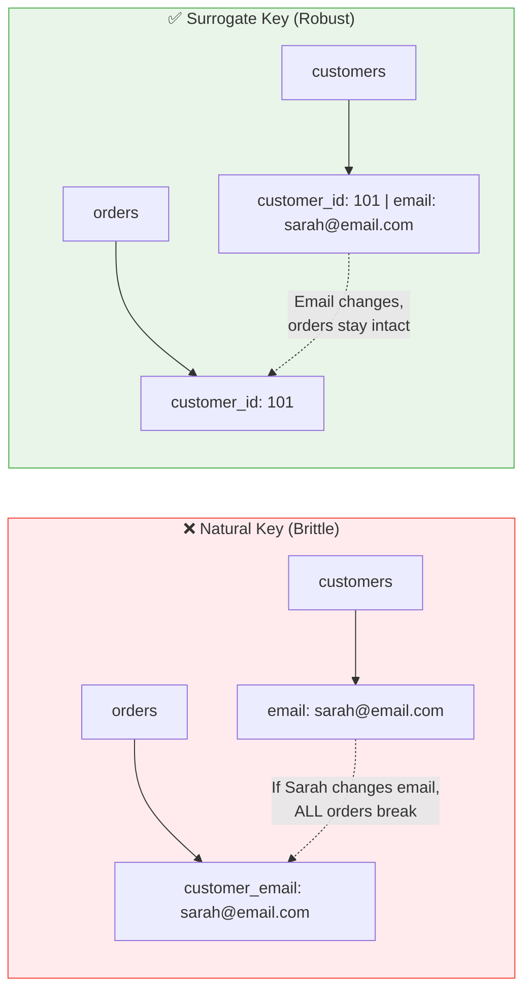

---

## 🔍 Natural Keys – When to Use Them

Despite their drawbacks, natural keys have their place:

| Scenario | Example | Why It Works |
|----------|---------|--------------|
| **Lookup Tables** | `us_states` with `state_code` as PK | `'CA'`, `'NY'`, `'TX'` – these never change |
| **Immutable Values** | `iso_currency_codes` | `'USD'`, `'EUR'`, `'GBP'` – standardized and permanent |
| **Small, Static Data** | `product_categories` | `'Electronics'`, `'Books'`, `'Clothing'` – rarely change |

```sql
-- Natural keys work perfectly here
CREATE TABLE us_states (
    state_code CHAR(2) PRIMARY KEY,  -- 'CA', 'NY', 'TX' – perfect!
    state_name TEXT NOT NULL
);

CREATE TABLE product_categories (
    category_name TEXT PRIMARY KEY,  -- 'Electronics', 'Books' – works fine
    description TEXT
);
```

> 💡 **The Artisan's Rule:** *"Use natural keys for lookup tables that never change. Use surrogate keys for everything else."*

---

## 🏛️ The Artisan's Insight

> *"A Primary Key is a promise: 'This record is unique, and I will always find it.' A Surrogate Key is a commitment: 'This record's identity is independent of its attributes.' Choose wisely, and your database will serve you for years. Choose poorly, and you'll be fixing broken relationships forever."*

> *"In the SQLVerse, every table needs its passport. Surrogate keys are the gold standard – they're immutable, simple, and reveal nothing about the data they protect. Natural keys have their place, but use them like a scalpel, not a sledgehammer."*

---

## 🏛️ The Artisan's Challenge: Design the Passport

Now it's your turn to apply what you've learned. For each scenario below, decide:
- What type of key would you use (Surrogate, Natural, or Composite)?
- What would you name the key column(s)?
- Why is this the right choice?

### Scenario 1: **Product Catalog**
You're designing a table for an e-commerce site. Products have:
- A unique SKU (Stock Keeping Unit) assigned by the warehouse
- A product name
- A price
- A category

**Your design:**
```
Key Type: _______________
Key Column(s): ___________
Why: ____________________
```

### Scenario 2: **Enrollment System**
You're tracking which students are enrolled in which courses. A student can take many courses. A course can have many students. Each enrollment has:
- A student ID
- A course ID
- An enrollment date
- A final grade

**Your design:**
```
Key Type: _______________
Key Column(s): ___________
Why: ____________________
```

### Scenario 3: **Country Codes**
You're building a reference table of all countries. Each country has:
- A two-letter ISO code (e.g., 'US', 'IN', 'GB')
- A three-letter ISO code (e.g., 'USA', 'IND', 'GBR')
- A numeric code (e.g., 840, 356, 826)
- The country name

**Your design:**
```
Key Type: _______________
Key Column(s): ___________
Why: ____________________
```

---

### 🏛️ The Challenge: Solution

#### Scenario 1: Product Catalog

**Key Type:** Natural Key (SKU)

**Key Column:** `sku`

**Why:** SKUs are designed to be unique identifiers. They're assigned by the warehouse and will never change for a given product. Using the SKU as the primary key eliminates the need for an extra surrogate column.

> 📝 **Artisan's Note:** Even with a strong Natural Key like SKU, many modern architects still prefer a **Surrogate Key** (`product_id`) while keeping the `sku` as a `UNIQUE` column. This future-proofs the system – if the warehouse ever changes their SKU format, your database relationships remain untouched. The Surrogate Key is the anchor; the SKU is just another attribute.

#### Scenario 2: Enrollment System

**Key Type:** Composite Key

**Key Columns:** `(student_id, course_id)`

**Why:** No single column is unique, but the combination of a specific student enrolling in a specific course happens only once. This composite key perfectly captures the relationship. (In real systems, you might also add an `enrollment_id` surrogate key, but the composite is the natural unique identifier.)

#### Scenario 3: Country Codes

**Key Type:** Natural Key (ISO code)

**Key Column:** `iso_code_2` (or `iso_code_3`)

**Why:** ISO country codes are internationally standardized and will never change. Using the two-letter code as the primary key makes the table self-documenting and easy to query (`WHERE country_code = 'IN'`).

---

> 💎 **The Artisan's Truth:** *"There's no single right answer in database design – only well-reasoned choices. The Artisan doesn't just pick a key; they understand the tradeoffs and choose accordingly."*

---

## 👁️ Preview: From Keys to Queries

You've now completed **The Architect's Ledger**. You understand:
- The **physics** of the SQLVerse (RDBMS)
- The **building blocks** (Domains and Entities)
- The **identity** of every row (Primary Keys)

Now you're ready to apply this knowledge in **Module 3 Concept Files**, where you'll learn to sort, group, and aggregate data – using the solid foundation you've built.

---

## 🏛️ The Artisan's Challenge: The Identity Crisis

**The Scenario:** You are building a table for a **Garment Company** to track their clothing items. A junior designer suggests using the **Product Name** as the Primary Key.

| product_name (PK?) | color | size | price |
|-------------------|-------|------|-------|
| Summer T-Shirt | Blue | L | 20 |
| Summer T-Shirt | Red | M | 20 |

### 🛠️ Your Tasks:

1. **Identify the Violation:** Why will the database reject the second row in the table above if `product_name` is the PK?
2. **Suggest a Solution:** Would you use a **Composite Key** (Name + Color + Size) or a **Surrogate Key** (`product_id`)? Why?
3. **The Immutability Test:** If the company decides to rename "Summer T-Shirt" to "Ocean Breeze Tee," which key type would make this update easier?

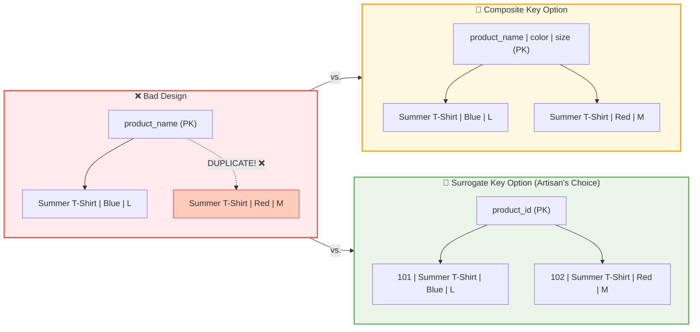

---

### 🏛️ The Identity Crisis: Solution

#### 1️⃣ The Violation

The database would reject the second row because **`product_name` is no longer unique**. Even though the color and size are different, the Primary Key (`product_name`) is a duplicate. This violates the **First Sacred Law: Uniqueness**.

> 💡 **The Rule:** A Primary Key must be unique for **every single row**. Two different products cannot share the same key, even if they differ in other columns.

#### 2️⃣ The Solution: Surrogate Key

| Option | Pros | Cons | Verdict |
|--------|------|------|---------|
| **Composite Key** (Name+Color+Size) | • No extra column<br>• Uniqueness guaranteed | • Clunky for relationships<br>• Slow for searching<br>• Hard to reference | ⚠️ Works, but awkward |
| **Surrogate Key** (`product_id`) | • Clean and simple<br>• Fast for joins<br>• Never changes | • Needs an extra column | ✅ **Artisan's Choice** |

While a Composite Key (Name+Color+Size) would technically work, it's **clunky**. Every time you want to link a sale to this item, you'd have to copy all three columns into the `order_items` table. A **Surrogate Key** (e.g., `product_id: 101`) is cleaner, faster, and much easier to manage.

```sql
-- The Artisan's Choice: Surrogate Key
CREATE TABLE products (
    product_id INTEGER PRIMARY KEY AUTOINCREMENT,
    product_name TEXT,
    color TEXT,
    size TEXT,
    price DECIMAL,
    UNIQUE(product_name, color, size)  -- Still enforce uniqueness naturally
);
```

#### 3️⃣ The Immutability Test

The **Surrogate Key** wins decisively.

| Scenario | With Natural Key (product_name) | With Surrogate Key (product_id) |
|----------|---------------------------------|---------------------------------|
| **Rename product** | Must update EVERY row in `products`, plus ALL related tables (`inventory`, `sales`, `returns`) | Update ONE row in `products`. All related tables still point to the same ID |

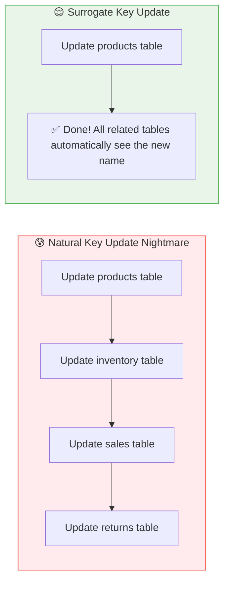

> 💎 **The Artisan's Truth:** *"A product's name may change with the seasons, but its identity is forever. By using a Surrogate Key, you let the name be just a name – free to change without breaking the bonds that tie your database together."*

---

## ✅ What You've Learned

After reading this file, you should understand:

- [ ] What a Primary Key is and why every table needs one
- [ ] The four key rules: Uniqueness, No NULLs, One per table, Immutability
- [ ] The passport metaphor and how it applies to Primary Keys
- [ ] The three types of Primary Keys: Natural, Surrogate, and Composite
- [ ] Why surrogate keys are the Artisan's choice for most tables
- [ ] When natural keys are appropriate (lookup tables, static data)
- [ ] How to choose the right key for different scenarios

---
## 🏛️ Architect's Summary Table

Keep this quick reference handy as you move forward:

| Key Type | Best For... | One Word to Remember |
|----------|-------------|----------------------|
| **Surrogate** | Almost every table | **Stability** |
| **Natural** | Lookup/Static data (ISO codes, states) | **Real-world** |
| **Composite** | Linking Tables (Many-to-Many) | **Combination** |

> 💎 **The Artisan's Rule of Thumb:** *"When in doubt, use a Surrogate Key. Let Natural Keys be constraints, not identities. Let Composite Keys solve specific relationship puzzles."*
---

## 🚀  Your Architectural Foundation is Complete

Congratulations, **Architect**. You have finished the three foundational files of **The Architect's Ledger**. You now understand the **physics**, the **matter**, and the **identity** of the SQLVerse.

You've now **mastered** the core concepts of The Architect's Ledger:

| File | What You've Learned |
|------|---------------------|
| **File 1** | The physics of the SQLVerse – RDBMS Core Concepts |
| **File 2** | The building blocks – Domains and Entities |
| **File 3** | The identity – Primary Keys |

🧠 **The Identity Shift** — *From Syntax to Systems*

You are no longer just writing queries; you are **building systems**. Your foundation is solid. You're ready to apply this knowledge in Module 3.

---

### 🧭 **Continue Your Journey**

[← Back to Module 3 Guide](./MODULE3_GUIDE.md)

*Return to the Guide to begin the PREPARE stage and start writing queries.*

---

*Part of our mission for 🎯 Quality Education for Anyone, Anywhere, Anytime — 💫 with Comfort, Convenience at no Cost.*

**Level 1 | Module 3 | The Architect's Ledger | Next: [Module 3 Guide](./MODULE3_GUIDE.md)**