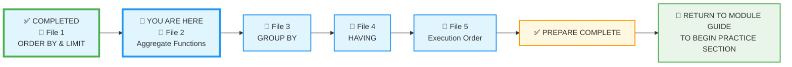
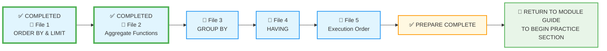

# 🗄️🤖 SQL & GenAI Course
**🎯 Quality Education for Anyone, Anywhere, Anytime — 💫 with Comfort, Convenience at no Cost**

---
## 📘 File 2: Aggregate Functions – The Art of Measuring Data

### 📍 Your Current Stage – PREPARE Journey



You're in **Stage 1: PREPARE**. You've completed File 1 and are now moving to File 2. After completing all five files, you'll return to the Module Guide to begin the PRACTICE stage.

---

## 🔧 Enhanced Browser Office for PREPARE

**🚀 Kickstart: Any Computer, Any Browser, Anytime.**  
**🌍 Destination: Any country, Any city, Any Platform.**

| Tab | Purpose | What to Do |
| :--- | :--- | :--- |
| **1: The Map** | Read concept files | You're here – reading this file. Next up: `3-group-by.md`. |
| **2: The Factory** | Run queries | Keep **[`training_institution_sample.db`](../../../Resources/sample_databases/training_institution_sample.db)** loaded. Run every example query. |
| **3: The Consultant** | Conceptual Q&A | Ask about aggregate functions, how they work, or why `COUNT(*)` differs from `COUNT(column)`. **Configure AI with [Student Mode Prompt](../../../STUDENT_MODE_PROMPT_LEVEL1.md) which prevents code generation by default.** |
| **4: The Vault** | Save your work | Save successful queries in: `Learning/Level-1-beginner/Level1-1-ACQUIRE/Module3-Sort-Aggregate-Group/1-sqlCommands/` |

---

### 🛠️ Module 3 Toolkit

🚀 Foundation First, AI Next, Projects Last.  
💎 Gemstone by Gemstone, Skill by Skill.

| | | | |
|---|---|---|---|
| **Browser Office** | 🔧 [Troubleshooting Common Issues](../../../Setup/STEP1_COMMISSION_BROWSER_OFFICE.md) | 🔄 [Browser Office Workflow](../../../Setup/STEP2_ESTABLISH_LEARNING_RITUAL.md) | ⌨️ [Tab Operations & Shortcuts](../../../Setup/STEP3_MASTER_TAB_OPERATIONS.md) |
| **ACQUIRE Section** | 🗄️ [Database Ecosystem](../../Guides/Section1-ACQUIRE/2_Database_Ecosystem.md) | 📚 [Knowledge Base (Vault)](../../Guides/Section1-ACQUIRE/3_Knowledge_Base.md) | 🧠 [Mindset Tuning](../../Guides/Section1-ACQUIRE/4_Mindset.md) |

---

## 🎯 What You'll Learn

By the end of this file, you will be able to:

- Count rows in a table using `COUNT()`
- Calculate totals with `SUM()`
- Find averages with `AVG()`
- Identify minimum and maximum values with `MIN()` and `MAX()`
- Understand the difference between `COUNT(*)` and `COUNT(column)`
- Apply aggregate functions to answer business questions

---
## 🔍 What is an "Aggregate"?

Imagine you have a jar full of coins.

- **Module 1 & 2** were about picking up one coin and looking at its date – examining individual rows.
- **Module 3 (Aggregate)** is about weighing the whole jar, counting the total coins, or finding the average value of all coins inside – summarizing many rows into a single meaningful number.

An **Aggregate Function** takes many rows of data and "squashes" them into a single result. It's the difference between seeing the trees (individual records) and seeing the forest (the big picture).

---

## 📊 Practice Table: `students`

We'll use the `students` table from the Training Institution database. Below are a few sample rows to give you a sense of the data. For the complete dataset, run `SELECT * FROM students;` in your Factory (Tab 2).

| student_id | first_name | last_name | email | enrollment_date | total_fees | fees_paid |
|------------|------------|-----------|-------|-----------------|------------|-----------|
| 101 | Sarah | Chen | sarah.chen@email.com | 2024-01-15 | 4500.00 | 3000.00 |
| 102 | Mike | Rodriguez | mike.rod@email.com | 2024-01-20 | 5200.00 | 5200.00 |
| 103 | Jessica | Park | jessica.park@email.com | 2024-02-01 | 4500.00 | 2000.00 |
| ... | ... | ... | ... | ... | ... | ... |

> 💡 **View the full dataset:** Run `SELECT * FROM students;` in your Factory to see all current records. In Module 2 you already added some new students, and in File 1 you added several more using a **bulk insert**. Remember that as you progress through exercises, you may insert, update, or delete records – your Factory always shows the live state of your database. The exact number of rows will change as you practice, and that's perfectly normal.
---

## 🤔 When Should You Use Aggregate Functions?

### ✅ Use Aggregate Functions When:
1. **Answering "how many?"** – total students, number of courses, etc.
2. **Answering "how much?"** – total revenue, average fee, etc.
3. **Answering "what's the range?"** – highest fee, lowest fee, earliest enrollment.
4. **Creating summary reports** – dashboards, executive summaries, KPIs.

### ❌ Avoid Aggregate Functions When:
1. **You need individual row details** – aggregates collapse rows; use regular `SELECT` for details.
2. **You haven't considered NULLs** – some aggregates ignore NULLs, which can skew results.
3. **You need to group data** – that's `GROUP BY` (coming in File 3). Aggregates alone give one number for the whole table.

**The Artisan's Rule:**  
> *"Aggregate functions turn a pile of data into a single number that matters. Use them to measure, not to explore."*

---

## 🎨 The Artisan's Query Rhythm (Module 3 Edition)

Remember the rhythm from File 1? Every query you write should follow this disciplined approach:

| Step | What You Do | Why |
|------|-------------|-----|
| **1. The Question** | Read the business question carefully | Clarify what you're trying to find |
| **2. The Query** | Write your SQL code | Apply the concept |
| **3. Expected Result** | **Predict** what you should see based on your current dataset | Think before you run! |
| **4. Try it now in Tab 2** | Run the query in your Factory | Test your prediction |
| **5. What you're seeing** | Compare actual results with your expectation | Identify any mismatch |
| **6. Reflect & Learn** | ✅ **If match** – Congratulations! You've understood.<br>❌ **If mismatch** – Discuss with your Socratic tutor (Tab 3) | Close the learning loop |

We'll apply this rhythm throughout the file.

---

## 🔍 Introducing Aggregate Functions

So far, every query you've written returned individual rows. But what if you want to know **how many** students are enrolled, **what's the average fee**, or **who paid the most**? That's where **aggregate functions** come in. They take many rows and produce a single summary value.

Think of them as your data's measuring tape:
- `COUNT()` tells you the size
- `SUM()` tells you the total
- `AVG()` tells you the typical value
- `MIN()` and `MAX()` tell you the extremes

Let's explore each one.

---

### 🔢 COUNT() – The Census Taker (How Many?)

**Question:** How many students are in our database?

```sql
SELECT COUNT(*) AS total_students
FROM students;
```

**Expected Result:** A single number – the total row count of the `students` table. Predict that number based on your current dataset.

**Try it now in Tab 2.**  

**What you're seeing:** One row with one column: the count. `COUNT(*)` counts every row, regardless of NULLs.

**Reflect & Learn:** Does the number match your expectation? If not, why? Did you forget about the bulk insert? That's fine – your dataset is dynamic.

**Question:** How many students have provided a phone number?

```sql
SELECT COUNT(phone) AS students_with_phone
FROM students;
```

**Expected Result:** A number smaller than the total count (because some students have NULL phones).

**Try it now in Tab 2.**  

**What you're seeing:** `COUNT(phone)` counts only rows where `phone` is NOT NULL. It ignores NULLs.

**Reflect & Learn:** The difference between `COUNT(*)` and `COUNT(column)` is crucial. `COUNT(*)` counts rows; `COUNT(column)` counts non‑NULL values.

---

### 💰 SUM() – The Treasurer (What's the Total?)

**Question:** What's the total amount of fees paid by all students?

```sql
SELECT SUM(fees_paid) AS total_revenue
FROM students;
```

**Expected Result:** A single number – the sum of all `fees_paid` values.

**Try it now in Tab 2.**  

**What you're seeing:** The database adds up every non‑NULL `fees_paid` and returns the total. NULLs are ignored (treated as zero in the sum).

**Reflect & Learn:** If any student had NULL `fees_paid`, they'd be ignored. But in our table, `fees_paid` is never NULL – it's either a positive number or zero. That's good data quality.

---

### 📊  AVG() – The Analyst (What's the Average?)

**Question:** What's the average total fee charged per student?

```sql
SELECT AVG(total_fees) AS average_fee
FROM students;
```

**Expected Result:** A single number – the mean of all `total_fees`.

**Try it now in Tab 2.**  

**What you're seeing:** The database adds all `total_fees` and divides by the count of non‑NULL values. NULLs are ignored.

**Reflect & Learn:** Is the average fee what you expected? Does it seem reasonable given the fee tiers (3800, 4500, 4800, 5000, 5200)?

---

### 📈 MIN() and MAX() – The Boundary Finders (What's the Range?)

**Question:** What are the smallest and largest total fees charged?

```sql
SELECT 
    MIN(total_fees) AS minimum_fee,
    MAX(total_fees) AS maximum_fee
FROM students;
```

**Expected Result:** Two numbers – the lowest and highest fee.

**Try it now in Tab 2.**  

**What you're seeing:** `MIN()` finds the smallest value; `MAX()` finds the largest. They work on any data type – numbers, dates, even text (alphabetically).

**Reflect & Learn:** This tells you the spread of your pricing. If you had added students with fees outside the original range, they'd appear here.

---

## 🧪 Try It Now – Quick Practice

1. **Total students:** Count all students. Predict, then run.
2. **Students with NULL phone:** Count how many have no phone. (Hint: use `COUNT(*)` with `WHERE phone IS NULL`? But aggregates alone don't filter – you'll need to combine with `WHERE` later. For now, just think about it.)
3. **Total fees paid:** Sum all `fees_paid`. Compare with your expectation.
4. **Average fees paid:** Compute the average. Is it close to the average fee?
5. **Earliest and latest enrollment:** Use `MIN()` and `MAX()` on `enrollment_date`.

---

## 🏛️ The Artisan's Guardrail: NULLs in Aggregates

Aggregate functions handle NULLs in specific ways:

| Function | NULL Handling |
|----------|---------------|
| `COUNT(*)` | Counts all rows, ignoring NULLs in any column |
| `COUNT(column)` | Counts only rows where `column` is NOT NULL |
| `SUM(column)` | Ignores NULLs (adds only non‑NULL values) |
| `AVG(column)` | Ignores NULLs (sum divided by count of non‑NULL) |
| `MIN(column)` | Ignores NULLs |
| `MAX(column)` | Ignores NULLs |

This means if your column has NULLs, the aggregate may not represent all rows. Always ask: "Do I want to include NULLs, or do I need to handle them separately?"

> 💡 **The Artisan's Insight:** *"NULLs are silent. They don't participate in aggregates unless you explicitly include them with functions like COALESCE."*

---

## ⚠️ Common Mistakes

### Mistake 1: Forgetting that `COUNT(*)` includes NULLs, but `COUNT(column)` excludes them
```sql
-- This counts all rows, even if phone is NULL
SELECT COUNT(*) FROM students;

-- This counts only rows with non‑NULL phone
SELECT COUNT(phone) FROM students;
```

### Mistake 2: Using aggregate functions without considering NULLs in calculations
If `fees_paid` could be NULL, `SUM(fees_paid)` would ignore those rows. To treat NULL as 0, use `SUM(COALESCE(fees_paid, 0))` (preview of a future skill).

### Mistake 3: Trying to mix aggregates with individual columns without `GROUP BY`
```sql
-- This will cause an error in most databases:
SELECT first_name, SUM(fees_paid) FROM students;
```
You'll learn to fix this in File 3 with `GROUP BY`.

### Mistake 4: Assuming `AVG` of integers returns a decimal
In some databases, integer division can truncate. SQLite handles it well, but be aware.

---

## 🧪 Practice Challenges

**Challenge 1: Student Count**  
Count all students in the database.  
*Save as:* `3-2-1-student-count.sql`  
**Expected Result:** A single number.  
**What this teaches:** Basic `COUNT(*)`.

**Challenge 2: Total Revenue**  
Calculate the total amount of fees paid.  
*Save as:* `3-2-2-total-revenue.sql`  
**Expected Result:** Sum of all `fees_paid`.  
**What this teaches:** `SUM()`.

**Challenge 3: Average Fee**  
Find the average total fee charged.  
*Save as:* `3-2-3-average-fee.sql`  
**Expected Result:** A single decimal.  
**What this teaches:** `AVG()`.

**Challenge 4: Fee Range**  
Find the minimum and maximum total fees.  
*Save as:* `3-2-4-fee-range.sql`  
**Expected Result:** Two numbers.  
**What this teaches:** `MIN()` and `MAX()`.

**Challenge 5: Students with Phone**  
Count how many students have provided a phone number.  
*Save as:* `3-2-5-students-with-phone.sql`  
**Expected Result:** A number less than total students (if you have NULLs).  
**What this teaches:** `COUNT(column)` vs `COUNT(*)`.

**Challenge 6: Earliest and Latest Enrollment**  
Find the earliest and latest enrollment dates.  
*Save as:* `3-2-6-enrollment-range.sql`  
**Expected Result:** Two dates.  
**What this teaches:** Aggregates work on dates too.

**Challenge 7: Total Unpaid Balance**  
Calculate the total amount still owed (sum of `total_fees - fees_paid`).  
*Save as:* `3-2-7-total-unpaid.sql`  
**Hint:** You can do arithmetic inside aggregate functions: `SUM(total_fees - fees_paid)`.  
**What this teaches:** Combining arithmetic with aggregates.

---

## 📋 Aggregate Functions Quick Reference Card

| Function | What It Does | Example | NULL Handling |
|----------|--------------|---------|---------------|
| `COUNT(*)` | Counts all rows | `COUNT(*)` | Includes NULLs |
| `COUNT(column)` | Counts non‑NULL values | `COUNT(phone)` | Excludes NULLs |
| `SUM(column)` | Total of values | `SUM(fees_paid)` | Ignores NULLs |
| `AVG(column)` | Average of values | `AVG(total_fees)` | Ignores NULLs |
| `MIN(column)` | Smallest value | `MIN(enrollment_date)` | Ignores NULLs |
| `MAX(column)` | Largest value | `MAX(total_fees)` | Ignores NULLs |

**Memory Aid:**  
> *"COUNT star counts all; COUNT column counts what's there. SUM and AVG ignore the NULLs; MIN and MAX do the same."*

**Save this reference in your Vault as:** `3-aggregate-functions-refcard.md`

---

## ✅ Progress Check

After reading this and trying the examples, can you:

- [ ] Use `COUNT(*)` to count all rows?
- [ ] Use `COUNT(column)` to count non‑NULL values?
- [ ] Calculate totals with `SUM()`?
- [ ] Find averages with `AVG()`?
- [ ] Identify extremes with `MIN()` and `MAX()`?
- [ ] Explain how NULLs affect each aggregate function?
- [ ] Save your working queries in your Vault?

**If yes → You're ready for File 3: GROUP BY!**

---

## 💎 DESIGNER'S PERIGON

<div style="border: 3px solid #9c27b0; border-radius: 10px; padding: 20px; margin: 25px 0; background: linear-gradient(135deg, #f3e5f5 0%, #e1bee7 100%);">

### *The Art of Measurement*

You've just learned to measure your data – to count, sum, and average. This is where raw data starts to become **intelligence**.

Think of a classroom. Individual test scores are just numbers. But the **average** tells you how the class is doing overall. The **highest score** shows what's possible. The **lowest** flags who needs help. Aggregates turn a pile of papers into actionable insights.

In the **SQLVerse**, each planet has its own metrics. On **Education Planet**, you measure enrollment and fees. On **E‑Commerce Planet**, you'll measure sales and inventory. On **HR Planet**, you'll measure salaries and headcount. The tools are the same; the stories are different.

---

### 🌍 Aggregate Functions in the Wild

Aggregate functions aren't just for classroom exercises—they power the world's most important analyses. Every time you see a headline like "Country X tops the medal table" or "Global GDP hits record high," you're looking at the result of `COUNT`, `SUM`, `AVG`, `MIN`, and `MAX` working behind the scenes.

#### 🏅 The Olympic Games
Every four years, the world tunes in to the Olympics. Behind the scenes, data analysts use aggregate functions to answer burning questions:

| Question | SQL Concept |
|----------|-------------|
| 🏆 **Which country has topped the medal table?** | `GROUP BY country` + `COUNT(*)` (or `SUM(medals)`) + `ORDER BY` + `LIMIT 1` |
| 🥇 **Which countries are the top 5 finishers?** | `GROUP BY country` + `COUNT(*)` + `ORDER BY` + `LIMIT 5` |
| 📊 **How many world records were broken?** | `COUNT(*) WHERE record_broken = TRUE` |
| 🏟️ **Has the host nation finished in the top 5?** | Filter by host country, then check its rank in the sorted list |
| 🥇🥈🥉 **Who are the top 3 individual medalists?** | `GROUP BY athlete` + `COUNT(*)` + `ORDER BY` + `LIMIT 3` |
| 🎉 **Which countries have won their first‑ever gold?** | `MIN(year)` per country (with gold count > 0) and filter for first appearance |

These aren't just numbers—they're stories of triumph, history, and national pride, all distilled by aggregate functions.

#### 📈 Global GDP and Economic Health
Economists track the world's economic output using `SUM(GDP)` across countries. When you hear "global GDP grew by 3%," that's an aggregate—the sum of all nations' production, compared year over year. `AVG(GDP per capita)` tells us about average living standards, while `MAX(GDP growth)` highlights the fastest‑growing economies.

#### 💸 International Capital Flows
Billions of dollars cross borders every day for investment and trade. Analysts use `SUM(capital_inflow)` and `SUM(capital_outflow)` to understand which countries are attracting investment and which are sending money abroad. `NET_FLOW = SUM(inflow) - SUM(outflow)` reveals whether a nation is a net borrower or lender in the global market.

---

### 🏛️ The Architect's Ledger Connection


Remember the **Primary Key**? It gives each row its unique identity. But aggregates ignore identity – they care only about the values. A `SUM(fees_paid)` doesn't care which student paid what; it just wants the total. This is a different way of thinking: from individuals to the collective.

When you combine aggregates with the keys you learned in the Ledger, you'll unlock even more power – like summing fees per course track. That's coming in File 3.

**Remember the `CONSISTENCY` property of ACID in [1-RDBMS-Core-concepts.md](../1-theArchitectsLedger/1-RDBMS-Core-concepts.md) in the Architect's Ledger?**

The `CONSISTENCY` property of ACID ensures that the `fees_paid` column of the `students` table on **Education Planet**, the `advance_paid` column of the `customers` table on **E‑Commerce Planet**, and the `medal_count` column in an **Olympics** database contain only numeric data – not text or dates. This guarantee is what allows aggregate functions like `SUM()` and `AVG()` to work reliably. Without it, your totals could be corrupted by stray text or invalid values.

> 💎 **Ledger Insight:** *"Primary Keys identify each row. Aggregates summarize across rows. Together, they let you see both the trees and the forest. And thanks to ACID Consistency, the numbers you're summing are guaranteed to be numbers."*

---

### 🧠 The Artisan's Truth

> *"A single number can hold the story of thousands. COUNT tells you the size; SUM tells you the weight; AVG tells you the center. Learn to read these numbers, and you'll never see data the same way again."*

> *"You've moved from organizing to measuring. The analyst is becoming a statistician, one aggregate at a time."*

> *"Onward to File 3, where you'll learn to group your measures and see patterns emerge."*

</div>

---

## 🧭 File Navigation



| Previous Step | Next Step |
|:---:|:---:|
| [← Back to File 1: ORDER BY & LIMIT](./1-order-by.md) | [Continue to File 3: GROUP BY →](./3-group-by.md) |

---

*Part of our mission for 🎯 Quality Education for Anyone, Anywhere, Anytime — 💫 with Comfort, Convenience at no Cost.*

**Level 1 | Module 3 | File 2: Aggregate Functions | Next: [GROUP BY](./3-group-by.md)**
