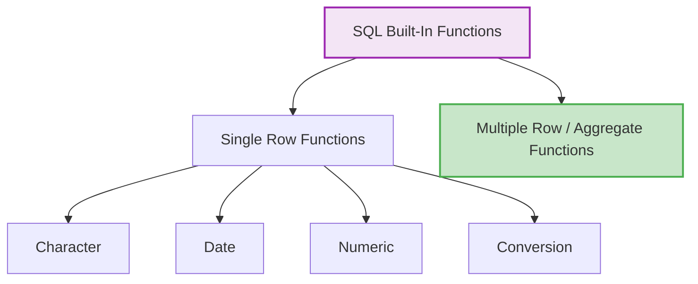
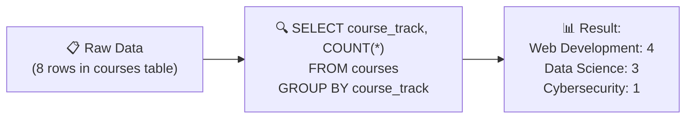
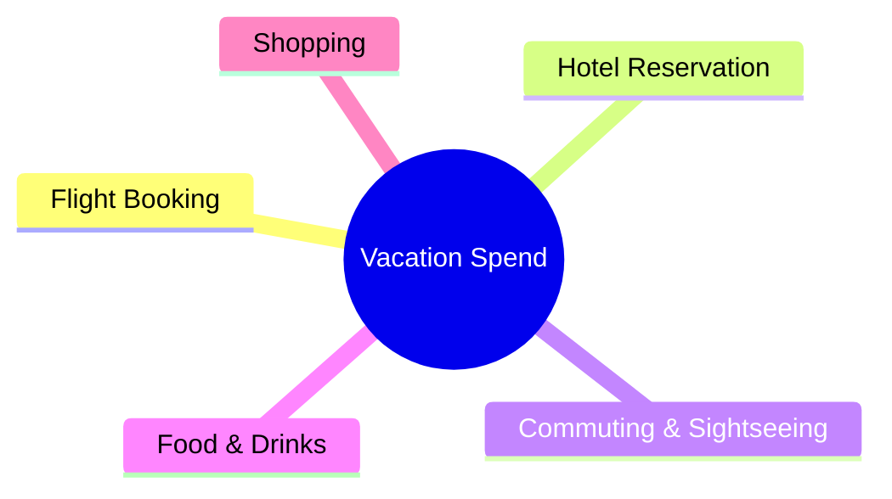

# 🗄️🤖 SQL & GenAI Course
**🎯 Quality Education for Anyone, Anywhere, Anytime — 💫 with Comfort, Convenience at no Cost**

## 📘 File 3: GROUP BY – The Art of Bucketing

### 📍 Your Current Stage – PREPARE Journey


You're in **Stage 1: PREPARE**. You've mastered `ORDER BY` and aggregate functions. Now you'll learn to **group** data into meaningful categories. After completing all five files, you'll return to the Module Guide to begin the PRACTICE stage.

---

## 🔧 Enhanced Browser Office for PREPARE

**🚀 Kickstart: Any Computer, Any Browser, Anytime.**  
**🌍 Destination: Any country, Any city, Any Platform.**

| Tab | Purpose | What to Do |
| :--- | :--- | :--- |
| **1: The Map** | Read concept files | You're here – reading this file. Next up: `4-having.md`. |
| **2: The Factory** | Run queries | Keep **[`training_institution_sample.db`](../../../Resources/sample_databases/training_institution_sample.db)** loaded. Run every example query. |
| **3: The Consultant** | Conceptual Q&A | Ask about `GROUP BY`, how it works with aggregates, or why certain columns cause errors. **Configure AI with [Student Mode Prompt](../../../STUDENT_MODE_PROMPT_LEVEL1.md) which prevents code generation by default.** |
| **4: The Vault** | Save your work | Save successful queries in: `Learning/Level-1-beginner/Level1-1-ACQUIRE/Module3-Sort-Aggregate-Group/1-sqlCommands/` |

---

### 🛠️ Module 3 Toolkit

🚀 Foundation First, AI Next, Projects Last.  
💎 Gemstone by Gemstone, Skill by Skill.

| | | | |
|---|---|---|---|
| **Browser Office** | 🔧 [Troubleshooting Common Issues](../../../Setup/STEP1_COMMISSION_BROWSER_OFFICE.md) | 🔄 [Browser Office Workflow](../../../Setup/STEP2_ESTABLISH_LEARNING_RITUAL.md) | ⌨️ [Tab Operations & Shortcuts](../../../Setup/STEP3_MASTER_TAB_OPERATIONS.md) |
| **ACQUIRE Section** | 🗄️ [Database Ecosystem](../../Guides/Section1-ACQUIRE/2_Database_Ecosystem.md) | 📚 [Knowledge Base (Vault)](../../Guides/Section1-ACQUIRE/3_Knowledge_Base.md) | 🧠 [Mindset Tuning](../../Guides/Section1-ACQUIRE/4_Mindset.md) |

---

## 🎯 What You'll Learn

By the end of this file, you will be able to:

- Understand what grouping means and why it's useful
- Use `GROUP BY` to divide data into categories
- Combine `GROUP BY` with aggregate functions to summarize each group
- Group by single columns and group by multiple columns for deeper **sub‑segment** analysis
- Recognize the common mistake of mixing grouped and ungrouped columns

---

## 🎁 Bonus Skill: Built‑In Functions – Your SQL Toolkit

SQL isn't just about retrieving data—it's also about transforming it. **Built‑in functions** are like power tools that let you manipulate text, perform calculations, work with dates, and much more.

Functions play a vital role in data processing and reporting needs of an organization. The built‑in functions can be categorized into two broad categories: **Single Row Functions** and **Multiple Row Functions** (also called **Aggregate Functions**).

The functions you learned in File 2 – `AVG()`, `COUNT()`, `SUM()`, `MIN()`, and `MAX()` – are built‑in functions **available in all databases.** They belong to the **Multiple Row / Aggregate** category.

### 📊 Function Classification


> 💡 **Note on Terminology:** Different databases use different names for similar concepts. What SQLite calls "TEXT" functions, other databases might call "CHARACTER" or "STRING" functions. The names vary, but the ideas are the same.


### 🔍 Single Row Functions

**Single Row Functions** act on individual rows of data. For each row returned by the `SELECT` statement, the function operates on the column value for that specific row and returns a single result per row. They can be used in `SELECT`, `WHERE`, and `ORDER BY` clauses.

**Examples:** Character functions (`UPPER`, `LOWER`, `SUBSTR`), date functions (`strftime`, `date`), numeric functions (`ROUND`, `ABS`), and conversion functions (like casting data types).

### 📊 Multiple Row (Aggregate) Functions

**Multiple Row Functions** (also called **Group Functions** or **Aggregate Functions**) act on a **set of rows** and return a single result for the entire group. You've already mastered these in File 2: `COUNT()`, `SUM()`, `AVG()`, `MIN()`, `MAX()`. They are often used with `GROUP BY` to produce summaries per category.

<div style="border-left: 4px solid #2196f3; background-color: #e3f2fd; padding: 12px 15px; margin: 20px 0; border-radius: 0 8px 8px 0;">

### 📌 Important: Function Portability

- **Aggregate functions** (`AVG`, `COUNT`, `SUM`, `MIN`, `MAX`) are **universally supported** across all major databases (SQLite, PostgreSQL, MySQL, SQL Server, Oracle, etc.). They work the same everywhere.
- **Single‑row functions** (like `UPPER`, `LENGTH`, `strftime`, `ROUND`) are often **database‑specific** – their names, syntax, and behavior may vary. Always consult your database's documentation when using them.

</div>

Now let's see some **Single Row Functions** in action using the `students` table:

### 📝 Text Functions

```sql
-- Convert names to uppercase
SELECT first_name, UPPER(last_name) AS last_name_upper
FROM students;

-- Get the length of an email address
SELECT email, LENGTH(email) AS email_length
FROM students;

-- Extract the domain part of an email
SELECT email, SUBSTR(email, INSTR(email, '@') + 1) AS domain
FROM students;
```
### 🔢 Numeric Functions

```sql
-- Round fees to nearest hundred (just for illustration)
SELECT total_fees, ROUND(total_fees, -2) AS rounded_fees
FROM students;
```

### 📅 Date Functions

We'll soon use `strftime` to extract parts of a date:

```sql
-- Extract the month from enrollment_date
SELECT enrollment_date, strftime('%Y-%m', enrollment_date) AS month
FROM students;
```

### 🔀 Conditional Logic with `CASE`

`CASE` is like an `if‑then‑else` for your queries. We'll use it to create categories:

```sql
SELECT first_name, total_fees,
    CASE 
        WHEN total_fees < 4000 THEN 'Low'
        WHEN total_fees BETWEEN 4000 AND 5000 THEN 'Medium'
        ELSE 'High'
    END AS fee_category
FROM students;
```

> 💡 **Note:** Functions are often **database‑specific**. The examples above (`UPPER`, `LENGTH`, `SUBSTR`, `INSTR`, `strftime`, `CASE`) work in SQLite, but other databases (like PostgreSQL, MySQL, SQL Server) have their own versions. For instance, SQL Server uses `GETDATE()` while SQLite uses `date('now')`. Always check the documentation for your database. The concepts, however, remain universal.

---

## 📊 Practice Tables: `students` and `courses`

We'll use two tables from the Training Institution database.

### `students` Table
Below are a few sample rows. For the complete dataset, run `SELECT * FROM students;` in your Factory (Tab 2).

| student_id | first_name | last_name | email | enrollment_date | total_fees | fees_paid |
|------------|------------|-----------|-------|-----------------|------------|-----------|
| 101 | Sarah | Chen | sarah.chen@email.com | 2024-01-15 | 4500.00 | 3000.00 |
| 102 | Mike | Rodriguez | mike.rod@email.com | 2024-01-20 | 5200.00 | 5200.00 |
| 103 | Jessica | Park | jessica.park@email.com | 2024-02-01 | 4500.00 | 2000.00 |
| ... | ... | ... | ... | ... | ... | ... |

### `courses` Table (New!)
This table stores course information. Since it contains natural categories like `course_track` and `instructor_id`, it's perfect for practicing `GROUP BY`. Here are all current rows:

| course_id | course_code | course_name | course_track | duration_weeks | instructor_id | course_fee | max_seats |
|-----------|--------------|-------------|--------------|----------------|---------------|------------|-----------|
| 201 | WD101 | Frontend Development | Web Development | 8 | 501 | 1500.00 | 15 |
| 202 | WD102 | Backend with Node.js | Web Development | 10 | 502 | 1800.00 | 12 |
| 203 | DS101 | Python for Data Analysis | Data Science | 12 | 503 | 2000.00 | 10 |
| 204 | CS101 | Network Security Fundamentals | Cybersecurity | 10 | 504 | 1600.00 | 12 |
| 205 | WD201 | Full Stack Project | Web Development | 6 | 501 | 1200.00 | 8 |
| 206 | DS201 | Machine Learning Basics | Data Science | 14 | 505 | 2200.00 | 8 |
| 207 | DS102 | Data Analysis for Beginners | Data Science | 4 | 503 | 800.00 | 20 |
| 208 | WD103 | SQL Basics | Web Development | 4 | 502 | 600.00 | 25 |

> 💡 **View the full datasets:** Run `SELECT * FROM students;` and `SELECT * FROM courses;` in your Factory. The `courses` table gives us a rich set of categories to explore.

---

## 🤔 When Should You Use GROUP BY?

### ✅ Use GROUP BY When:
1. **Summarizing by category** – total fees per course track, average age per city.
2. **Creating reports** – sales by region, headcount by department.
3. **Finding patterns** – which categories have the highest averages, which groups are largest.
4. **Preparing data for visualization** – bar charts, pie charts need grouped data.

### ❌ Avoid GROUP BY When:
1. **You need individual rows** – use a simple `SELECT` with `WHERE`.
2. **You haven't included an aggregate** – `GROUP BY` without aggregates just sorts duplicates (like `DISTINCT`).
3. **You're grouping by too many columns** – the result becomes too granular to be useful.

**The Artisan's Rule:**  
> *"GROUP BY is your sorting hat – it places data into houses. Then aggregates count the points for each house."*

---

## 🎨 The Artisan's Query Rhythm (Module 3 Edition)

Remember the rhythm:

| Step | What You Do | Why |
|------|-------------|-----|
| **1. The Question** | Read the business question carefully | Clarify what you're trying to find |
| **2. The Query** | Write your SQL code | Apply the concept |
| **3. Expected Result** | **Predict** what you should see based on your current dataset | Think before you run! |
| **4. Try it now in Tab 2** | Run the query in your Factory | Test your prediction |
| **5. What you're seeing** | Compare actual results with your expectation | Identify any mismatch |
| **6. Reflect & Learn** | ✅ **If match** – Congratulations!<br>❌ **If mismatch** – Discuss with your Socratic tutor (Tab 3) | Close the learning loop |

---

## 🔍 Introducing GROUP BY

In File 2, you used aggregate functions on the **entire table**. But what if you want totals **per category**? That's where `GROUP BY` shines.

In File 2, you learned that aggregate functions "squash" all rows into **one** result. `GROUP BY` allows you to squash rows into **multiple buckets** based on a shared characteristic. If `SUM(fees_paid)` is the total revenue of the whole school, `GROUP BY city` gives you the total revenue **for each city**. It is the SQL equivalent of a **Pivot Table** in Excel or Google Sheets.

Before we dive into `GROUP BY`, let's remind ourselves of a simple truth about grouping: when you group by a column, all rows with the same value in that column are placed in one bucket. Then you can count, sum, or average within each bucket.

We'll work through examples using both the `courses` table (with ready‑made categories) and the `students` table (where we'll create categories using date functions and `CASE`). Now let us look at how exactly **Group By** functions with the technicalities we discussed above.

Let's look at the raw data from our `courses` table. This is the data we'll group:

<div style="border: 3px solid #4caf50; border-radius: 8px; padding: 15px; margin: 20px 0; background: #f9f9f9;">

| course_id | course_name | course_track | max_seats |
|-----------|-------------|--------------|-----------|
| 201 | Frontend Development | Web Development | 15 |
| 202 | Backend with Node.js | Web Development | 12 |
| 203 | Python for Data Analysis | Data Science | 10 |
| 204 | Network Security Fundamentals | Cybersecurity | 12 |
| 205 | Full Stack Project | Web Development | 8 |
| 206 | Machine Learning Basics | Data Science | 8 |
| 207 | Data Analysis for Beginners | Data Science | 20 |
| 208 | SQL Basics | Web Development | 25 |

</div>

When we apply a `GROUP BY` query to count courses per track, the data flows through a transformation:



> All rows with the same **`course_track`** are placed into **buckets.** When we use `COUNT(*)`, we count how many **rows** landed in each bucket – that is, the **number of courses** per track. The diagram above illustrates this process. Now let's write that query and see the result.


---

**Question 1:** How many courses are offered in each track?

```sql
SELECT course_track, COUNT(*) AS number_of_courses
FROM courses
GROUP BY course_track;
```

**Expected Result:**  

| course_track | number_of_courses |
|--------------|-------------------|
| Web Development | 4 |
| Data Science | 3 |
| Cybersecurity | 1 |

**Try it now in Tab 2.**  
**What you're seeing:** Each track becomes a bucket; `COUNT(*)` counts rows in each bucket.  
**Reflect & Learn:**  
- ✅ **If match** – Great! You understand basic grouping.  
- ❌ **If mismatch** – Ask your Consultant: *"Why are the counts different from what I expected?"*

---


### 👨‍🏫 Examples Using the `courses` Table

**Question 1:** How many courses are offered in each track?

```sql
SELECT course_track, COUNT(*) AS number_of_courses
FROM courses
GROUP BY course_track;
```

**Expected Result:** A list of tracks with counts (e.g., Web Development: 4, Data Science: 3, Cybersecurity: 1).

**Try it now in Tab 2.**  
**What you're seeing:** Each track becomes a bucket; `COUNT(*)` counts rows in each bucket.  
**Reflect & Learn:**  
- ✅ **If match** – Great! You understand basic grouping.  
- ❌ **If mismatch** – Ask your Consultant: *"Why are the counts different from what I expected?"*

---

**Question 2:** What's the average course fee per track?

```sql
SELECT course_track, AVG(course_fee) AS average_fee
FROM courses
GROUP BY course_track;
```

**Expected Result:** Tracks with their average fee (e.g., Web Development ~1275, Data Science ~1667).

**Try it now in Tab 2.**  
**What you're seeing:** `AVG` calculates the mean for each group.  
**Reflect & Learn:**  
- ✅ **If match** – Excellent!  
- ❌ **If mismatch** – Ask: *"Why is the average for [track] different from my mental calculation?"*

---

**Question 3:** How many courses does each instructor teach? (Group by `instructor_id`)

```sql
SELECT instructor_id, COUNT(*) AS courses_taught
FROM courses
GROUP BY instructor_id;
```

**Expected Result:** Instructor IDs with counts (e.g., 501: 2, 502: 2, 503: 2, 504: 1, 505: 1).

**Try it now in Tab 2.**  
**What you're seeing:** Grouping by a foreign key reveals instructor workloads.  
**Reflect & Learn:**  
- ✅ **If match** – Perfect!  
- ❌ **If mismatch** – Ask: *"Why does instructor 501 have 2 courses?"*

> 🔍 **Looking Ahead:** In **Module 4 (Joining Tables)**, you'll learn to connect this `instructor_id` to the `instructors` table to see actual names – transforming "501" into "Emily Watson" and "502" into "James Wilson". The numbers will finally have faces!
---

### 🔢 Grouping by Multiple Columns

You can group by more than one column to create finer buckets. This creates **sub‑segments** within your data – for example, courses per instructor *within* each track.

**Question 4:** How many courses does each instructor teach, per track?

```sql
SELECT course_track, instructor_id, COUNT(*) AS courses_taught
FROM courses
GROUP BY course_track, instructor_id;
```

**Expected Result:** Each track‑instructor combination with count (e.g., Web Dev, 501: 2; Web Dev, 502: 2; Data Science, 503: 2; Data Science, 505: 1; Cybersecurity, 504: 1).

**Try it now in Tab 2.**  
**What you're seeing:** Finer buckets – first grouped by track, then by instructor within each track.  
**Reflect & Learn:**  
- ✅ **If match** – You've mastered sub‑segment grouping!  
- ❌ **If mismatch** – Ask: *"Why are there two rows for Web Development?"*

---

### 👩‍🎓 Examples Using the `students` Table

Now let's apply `GROUP BY` to the `students` table. Because `students` doesn't have natural categories like tracks, we'll create them using date functions and `CASE`.

#### Step 1: A simple date grouping

Before we extract months, see what happens when you group by the full date:

```sql
SELECT enrollment_date, COUNT(*) AS students_enrolled
FROM students
GROUP BY enrollment_date;
```

**Expected Result:** Each date with a count (probably one per day, unless multiple students enrolled on the same day).  
**Try it now in Tab 2.**  
**What you're seeing:** Each distinct enrollment date becomes its own group.  
**Reflect & Learn:** This is the foundation – now we can "roll up" dates to months.

---

**Question 5:** How many students enrolled in each month? (Using `strftime` to extract month)

```sql
SELECT strftime('%Y-%m', enrollment_date) AS month, COUNT(*) AS students_enrolled
FROM students
GROUP BY month;
```

**Expected Result:** Monthly enrollment counts (e.g., 2024-01: 2, 2024-02: 3, etc.).

**Try it now in Tab 2.**  
**What you're seeing:** `strftime` converts dates to year‑month strings, then groups by that derived column.  
**Reflect & Learn:**  
- ✅ **If match** – Great!  
- ❌ **If mismatch** – Ask: *"Why does the query use `strftime`? What happens without it?"*

---

**Question 6:** Total fees paid per enrollment month.

```sql
SELECT strftime('%Y-%m', enrollment_date) AS month, SUM(fees_paid) AS total_paid
FROM students
GROUP BY month;
```

**Expected Result:** Monthly revenue totals.  
**Try it now in Tab 2.**  
**What you're seeing:** Aggregates combined with date grouping.  
**Reflect & Learn:**  
- ✅ **If match** – Excellent!  
- ❌ **If mismatch** – Ask: *"Why might some months have higher totals?"*

---

**Question 7:** Group students by fee range (using `CASE` to create categories).

```sql
SELECT 
    CASE 
        WHEN total_fees < 4000 THEN 'Low'
        WHEN total_fees BETWEEN 4000 AND 5000 THEN 'Medium'
        ELSE 'High'
    END AS fee_category,
    COUNT(*) AS student_count
FROM students
GROUP BY fee_category;
```

**Expected Result:** Three rows with counts for Low, Medium, High fee tiers.  
**Try it now in Tab 2.**  
**What you're seeing:** `CASE` creates a new column, then `GROUP BY` uses that expression.  
**Reflect & Learn:**  
- ✅ **If match** – You're thinking like an analyst!  
- ❌ **If mismatch** – Ask: *"How does `CASE` work in SQL?"*

---

**Question 8:** Sub‑segment analysis – enrollment month and fee category together.

```sql
SELECT 
    strftime('%Y-%m', enrollment_date) AS month,
    CASE 
        WHEN total_fees < 4000 THEN 'Low'
        WHEN total_fees BETWEEN 4000 AND 5000 THEN 'Medium'
        ELSE 'High'
    END AS fee_category,
    COUNT(*) AS student_count
FROM students
GROUP BY month, fee_category
ORDER BY month, fee_category;
```

**Expected Result:** A multi‑row table showing distribution of fee categories over time.  
**Try it now in Tab 2.**  
**What you're seeing:** Grouping by two derived columns reveals deeper patterns.  
**Reflect & Learn:**  
- ✅ **If match** – Masterful!  
- ❌ **If mismatch** – Ask: *"Why do we need `ORDER BY` to make this readable?"*

---
## 🏛️ The Artisan's Guardrail: The Golden Rule

This is the most important rule you will learn in Module 3. Read it twice:

> **The Golden Rule:** Every column in your `SELECT` clause must either be **wrapped in an aggregate function** (like `SUM` or `COUNT`) OR be **listed in the `GROUP BY` clause**.

If you try to select a column that isn't grouped or aggregated, the database won't know which specific row's value to show you, and it will likely throw an error (or worse, show you random data).

### Why This Rule Exists

Imagine you group courses by `course_track`. The "Web Development" bucket contains four courses, each with a different `course_name`. When you write:

```sql
SELECT course_track, course_name, COUNT(*)
FROM courses
GROUP BY course_track;
```

The database asks: *"You want one row per track, but there are four different course names in Web Development – which one should I show?"* It cannot guess, so it refuses.

### The Exception That Proves the Rule

If the column you're grouping by is **functionally dependent** on the grouped column – meaning there is only one possible value for that column within each group – some databases allow it. For example, if you group by `course_id` (which is unique), you could safely select `course_name` because each `course_id` has exactly one `course_name`. However, relying on this can be risky across different database systems. **The safest path:** always follow the Golden Rule explicitly.

### What About NULLs?

If the column you're grouping by contains NULLs, all NULLs form their own group. This can be useful for finding missing data, but remember that NULL = NULL is not true in SQL – yet the database still groups them together. So a group of NULLs represents rows where that column has no value.

**The Golden Rule is your compass.** Follow it, and your `GROUP BY` queries will always be valid and understandable.

---

## 🧪 Try It Now – Quick Practice

1. From `courses`: Count courses per track.
2. From `courses`: Average fee per instructor.
3. From `students`: Count students per enrollment month (use `strftime`).
4. From `students`: Total fees paid per month.
5. From `students`: Group by fee category (Low/Medium/High) and count.

---

## ⚠️ Common Mistakes


### Mistake 1: Forgetting to include non‑aggregated columns in GROUP BY
```sql
-- Wrong:
SELECT course_track, instructor_id, COUNT(*)
FROM courses
GROUP BY course_track;
-- Error: instructor_id is not in GROUP BY and not an aggregate

-- Right:
SELECT course_track, instructor_id, COUNT(*)
FROM courses
GROUP BY course_track, instructor_id;
```

**Why does this error happen?**  
Imagine you group by `course_track`. The "Web Development" bucket contains 4 courses, each with a different `instructor_id` (501, 502, 501, 502). When you ask for `instructor_id` in the `SELECT` without grouping by it, the database faces an impossible question: *"There are four different instructor IDs in this bucket – which one should I show in the single summary row?"* It can't guess, so it throws an error. By adding `instructor_id` to the `GROUP BY`, you're telling the database to create sub‑buckets for each instructor within each track.

### Mistake 2: Using `WHERE` to filter groups (use `HAVING` instead)
```sql
-- Wrong: tries to filter groups with WHERE
SELECT course_track, AVG(course_fee) AS avg_fee
FROM courses
WHERE AVG(course_fee) > 1800
GROUP BY course_track;

-- WHERE runs before grouping, so it can't see aggregates.
-- You'll learn HAVING in File 4.
```

### Mistake 3: Grouping by too many columns
If you group by many columns, you might get too many groups, making the summary less useful.

### Mistake 4: Assuming GROUP BY sorts results
`GROUP BY` does group rows, but it doesn't guarantee order. Use `ORDER BY` if you need sorted output.

### Mistake 5: Forgetting that NULLs form their own group
If your grouping column contains NULLs, they will all be placed in a single group. This can be surprising if you forget to handle them.

---

## 🧪 Practice Challenges

| Challenge | Table | Description |
|-----------|-------|-------------|
| 1 | `courses` | Count courses per track |
| 2 | `courses` | Average fee per instructor |
| 3 | `courses` | Total duration weeks per track |
| 4 | `courses` | Courses per track and instructor (sub‑segment) |
| 5 | `students` | Students per enrollment month |
| 6 | `students` | Total fees paid per month |
| 7 | `students` | Average balance due (`total_fees - fees_paid`) per month |
| 8 | `students` | Student count per fee category (Low/Medium/High) |
| 9 | `students` | Fee category distribution per month (sub‑segment) |
| 10 | `students` | Count of students with balance > 0 per month (use `WHERE` then `GROUP BY`) |

Save each query in your Vault with appropriate filenames (e.g., `3-3-1-courses-by-track.sql`).

---

## 📋 GROUP BY Quick Reference Card

### Basic Syntax

```sql
SELECT column1, aggregate_function(column2)
FROM table
WHERE condition
GROUP BY column1, column2;
```

### Rules

| Rule | Explanation |
|------|-------------|
| Every non‑aggregate in SELECT must be in GROUP BY | Otherwise the database doesn't know which value to show |
| WHERE filters rows **before** grouping | Use HAVING (File 4) to filter groups |
| GROUP BY can use column names, expressions, or aliases? | Aliases not available yet (execution order), but expressions are allowed |
| You can group by multiple columns | Creates sub‑segments |
| NULLs in grouping column form their own group | Useful for finding missing data |

**Memory Aid:**  
> *"Group by the columns you see, aggregate the ones you measure."*

**Save this reference in your Vault as:** `3-group-by-refcard.md`

---

## ✅ Progress Check

After reading this and trying the examples, can you:

- [ ] Explain what `GROUP BY` does with a real‑world analogy?
- [ ] Write a query that groups by a single column and uses an aggregate?
- [ ] Group by multiple columns to create sub‑segments?
- [ ] Avoid the common mistake of missing columns in `GROUP BY`?
- [ ] Use `strftime` to group dates by month?
- [ ] Use `CASE` to create custom categories for grouping?
- [ ] Save your working queries in your Vault?

**If yes → You're ready for File 4: HAVING!**

---

## 💎 DESIGNER'S PERIGON

<div style="border: 3px solid #9c27b0; border-radius: 10px; padding: 20px; margin: 25px 0; background: linear-gradient(135deg, #f3e5f5 0%, #e1bee7 100%);">

### *The Art of Pattern Seeking : Chaos → Categories*

`GROUP BY` is where you stop being a "Data Collector" and start being a "**Pattern Seeker**."

You've just learned to **bucket** your data – to sort the chaos into categories. This is where **patterns** emerge.

Think of a library. Without grouping, you have a million books in random order. Group them by genre, and suddenly you see: "Ah, we have 500 mystery novels, 300 biographies, and 200 sci‑fi." **Group by** author, and you discover who the most prolific writers are.

In our everyday life, grouping and categorizing comes spontaneously in all our routine tasks – from creating separate **WhatsApp** groups for Colleagues, Friends and Family to Budgeting and analyzing our spends.

Imagine we are back from our trip abroad for Vacation and want to arrive at the total Cost for the trip. We **categorize** our spends into the following:

- Flight Booking
- Hotel Reservation
- Commuting and Sightseeing
- Food and Drinks
- Shopping



> *"Notice how you just performed a `GROUP BY` in your head – naturally, without thinking. That's because grouping is how humans make sense of the world. SQL just gives you the language to do it with data."*


In the **SQLVerse**, each planet has its own categories. On **Education Planet**, you group by course track. On **E‑Commerce Planet**, you'll group by product category, customer region, or sales month. On **HR Planet**, you'll group by department, job title, or salary band.

**`GROUP BY` is your lens** – it lets you see the data from different angles. Without it, you only see the forest. With it, you can count the trees by type.

---

### 🏛️ The Architect's Ledger Connection

Remember the **Foreign Keys** from the Ledger? They create relationships between tables. When you group by a column that is a foreign key, you're essentially counting how many rows in this table belong to each parent.

In the **Architect's Ledger**, we talked about **Data Integrity**. Here, we use that integrity to find truth. If your data is consistent, your groups are accurate.


For example, in a real database, you might group orders by `customer_id` to see how many orders each customer placed. That `customer_id` is a foreign key linking back to the `customers` table. The grouping gives you insight into customer behavior.

- 💎 **Ledger Insight:** *"Primary Keys give identity. Foreign Keys create relationships. GROUP BY reveals the strength of those relationships."*
- 💎 **Ledger Insight:** *"Aggregation without grouping gives you a single truth. Aggregation WITH grouping gives you the context behind the truth."*

---

### 🧠 The Artisan's Truth

> *"GROUP BY is where data starts to tell stories. The raw numbers become narratives: 'The Web Development track is our most popular,' or 'Instructor Maria Garcia teaches the most courses.'"*

> *"You've moved from measuring to categorizing. The analyst is becoming a storyteller, one group at a time."*

> *"Onward to File 4, where you'll learn to filter those groups and focus on the ones that matter most."*

</div>

---

## 🧭 File Navigation


| Previous Step | Next Step |
|:---:|:---:|
| [← Back to File 2: Aggregate Functions](./2-aggregate-functions.md) | [Continue to File 4: HAVING →](./4-having.md) |

---

*Part of our mission for 🎯 Quality Education for Anyone, Anywhere, Anytime — 💫 with Comfort, Convenience at no Cost.*

**Level 1 | Module 3 | File 3: GROUP BY | Next: [HAVING](./4-having.md)**