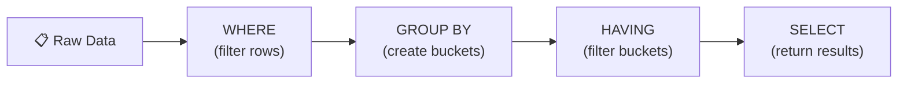
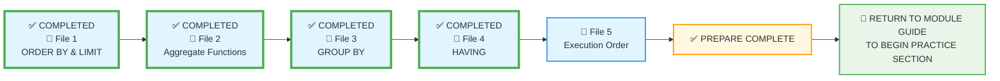

# 🗄️🤖 SQL & GenAI Course
**🎯 Quality Education for Anyone, Anywhere, Anytime — 💫 with Comfort, Convenience at no Cost**

## 📘 File 4: HAVING – Filtering the Buckets

### 📍 Your Current Stage – PREPARE Journey

```mermaid
flowchart LR
    A["✅ COMPLETED<br/>📘 File 1<br/>ORDER BY & LIMIT"] --> B
    B["✅ COMPLETED<br/>📘 File 2<br/>Aggregate Functions"] --> C
    C["✅ COMPLETED<br/>📘 File 3<br/>GROUP BY"] --> D
    D["📍 YOU ARE HERE<br/>📘 File 4<br/>HAVING"] --> E
    E["📘 File 5<br/>Execution Order"] --> F
    F["✅ PREPARE COMPLETE"] --> G
    G["🔄 RETURN TO MODULE GUIDE<br/>TO BEGIN PRACTICE SECTION"]
    
    style A fill:#e1f5fe,stroke:#4caf50,stroke-width:4px
    style B fill:#e1f5fe,stroke:#4caf50,stroke-width:4px
    style C fill:#e1f5fe,stroke:#4caf50,stroke-width:4px
    style D fill:#e1f5fe,stroke:#2196f3,stroke-width:4px
    style E fill:#e1f5fe,stroke:#2196f3,stroke-width:2px
    style F fill:#fff8e1,stroke:#ff9800,stroke-width:2px
    style G fill:#e8f5e8,stroke:#4caf50,stroke-width:2px
```



You're in **Stage 1: PREPARE**. You've mastered `ORDER BY`, aggregate functions, and `GROUP BY`. Now you'll learn to **filter the buckets** themselves – not the raw rows, but the groups they form. After completing all five files, you'll return to the Module Guide to begin the PRACTICE stage.

---

## 🔧 Enhanced Browser Office for PREPARE

**🚀 Kickstart: Any Computer, Any Browser, Anytime.**  
**🌍 Destination: Any country, Any city, Any Platform.**

| Tab | Purpose | What to Do |
| :--- | :--- | :--- |
| **1: The Map** | Read concept files | You're here – reading this file. Next up: `5-execution-order.md`. |
| **2: The Factory** | Run queries | Keep **[`training_institution_sample.db`](../../../Resources/sample_databases/training_institution_sample.db)** loaded. Run every example query. |
| **3: The Consultant** | Conceptual Q&A | Ask about `HAVING`, the difference from `WHERE`, or why a group filter isn't working. **Configure AI with [Student Mode Prompt](../../../STUDENT_MODE_PROMPT_LEVEL1.md) which prevents code generation by default.** |
| **4: The Vault** | Save your work | Save successful queries in: `Learning/Level-1-beginner/Level1-1-ACQUIRE/Module3-Sort-Aggregate-Group/1-sqlCommands/` |

---

### 🛠️ Module 3 Toolkit

🚀 Foundation First, AI Next, Projects Last.  
💎 Gemstone by Gemstone, Skill by Skill.

| | | | |
|---|---|---|---|
| **Browser Office** | 🔧 [Troubleshooting Common Issues](../../../Setup/STEP1_COMMISSION_BROWSER_OFFICE.md) | 🔄 [Browser Office Workflow](../../../Setup/STEP2_ESTABLISH_LEARNING_RITUAL.md) | ⌨️ [Tab Operations & Shortcuts](../../../Setup/STEP3_MASTER_TAB_OPERATIONS.md) |
| **ACQUIRE Section** | 🗄️ [Database Ecosystem](../../Guides/Section1-ACQUIRE/2_Database_Ecosystem.md) | 📚 [Knowledge Base (Vault)](../../Guides/Section1-ACQUIRE/3_Knowledge_Base.md) | 🧠 [Mindset Tuning](../../Guides/Section1-ACQUIRE/4_Mindset.md) |

---

## 🎯 What You'll Learn

By the end of this file, you will be able to:

- Understand the difference between **filtering rows** (`WHERE`) and **filtering groups** (`HAVING`).
-  **Understand why `WHERE` cannot filter aggregated data** – it runs before aggregation, so group‑level conditions are invisible to it.
- **Master the "Logical Sequence" of filtering:** Row‑level filtering (`WHERE`) happens first, then grouping, then group‑level filtering (`HAVING`).
- Use the `HAVING` clause to **filter** grouped results based on **summary totals**.
- **Combine** `WHERE` and `HAVING` in the same query for **precise control**.
- **Recognize** common mistakes like using `HAVING` without `GROUP BY` or using column aliases incorrectly.
- **Use the `UPDATE` command to modify existing data (✨ bonus skill).**

---
## ✨ Bonus Skill: UPDATE – Modifying Existing Data

So far, you've learned to **add** new data with `INSERT` and **retrieve** data with `SELECT`. But what if you need to **change** existing data? That's where the `UPDATE` command comes in.

**⚠️ WARNING:** `UPDATE` without a `WHERE` clause updates **every row** in the table. Always double‑check your `WHERE` condition before running an update!

### 🔧 Basic UPDATE Syntax

```sql
UPDATE table_name
SET column1 = new_value1, column2 = new_value2
WHERE condition;
```

### 📝 Examples Using the `students` Table

**Example 1:** A student changed their phone number.

```sql
-- Sarah Chen got a new phone
UPDATE students
SET phone = '555-9999'
WHERE student_id = 101;
```

**Try it now in Tab 2.** Then verify:
```sql
SELECT first_name, last_name, phone FROM students WHERE student_id = 101;
```

**What you're seeing:** Sarah's phone number is updated. The rest of her record remains unchanged.

---

**Example 2:** A student paid part of their outstanding fees.

```sql
-- James Wilson (student_id 108) paid $500
UPDATE students
SET fees_paid = fees_paid + 500
WHERE student_id = 108;
```

**Try it now in Tab 2.**  
**What you're seeing:** You can use arithmetic in `SET` – here we add 500 to the existing `fees_paid`.

---


**Example 3:** Fix a typo in an email address for multiple students.

```sql
-- Correct email domain from '@email.com' to '@gmail.com' for a set of students
UPDATE students
SET email = REPLACE(email, '@email.com', '@gmail.com')
WHERE email LIKE '%@email.com'
  AND student_id IN (104, 105, 106);
```

**Try it now in Tab 2.** Then verify:
```sql
SELECT student_id, first_name, last_name, email 
FROM students 
WHERE student_id IN (104, 105, 106);
```

**What you're seeing:** Only students 104, 105, and 106 have their email domain changed. The rest remain untouched. This demonstrates how to combine multiple conditions in `WHERE` to precisely target the rows you want to update.---


**Example 4:** Mark missing phone numbers as 'PENDING'.

```sql
UPDATE students
SET phone = 'PENDING'
WHERE phone IS NULL;
```

**Try it now in Tab 2.**  
**What you're seeing:** All NULL phones become 'PENDING' – a common data‑cleaning technique.


---

### 🧪 Practice Challenges (Bonus)

| Challenge | Description |
|-----------|-------------|
| 1 | Update the phone number of student with ID 110 to '555-1234'. |
| 2 | Increase `fees_paid` by $100 for all students who have paid less than $2000. |
| 3 | Change the email domain from '@email.com' to '@alumni.institution.com' for students who enrolled before 2024-03-01. |
| 4 |Some students have earned excellent project scores, and management has decided to waive their remaining fee balance. Update the records for students with IDs 106, 109, and 111 so that they owe nothing. <br><br> *Hint: You need to set `fees_paid` to the same value as `total_fees` for those specific students. Which `WHERE` condition will target exactly those three IDs?* |

Save each as `4-bonus-update-1.sql`, etc. **Remember:** You can always revert changes by re‑inserting original data from the backup script, but in real life, use transactions or backups!

---

### 📌 UPDATE Quick Tips

| Rule | Explanation |
|------|-------------|
| Always use a `WHERE` clause | Unless you truly want to update every row (rare). |
| Test with `SELECT` first | Run a `SELECT` with the same `WHERE` to see which rows will be affected. |
| Use transactions when available | In databases that support them, `BEGIN TRANSACTION` lets you roll back mistakes. |
| Be careful with arithmetic | `SET column = column + 1` works; `SET column = 1` overwrites. |

---

## 📊 Practice Tables: `students` and `courses`

We'll continue using the same tables. 

### `students` Table (reminder)

Below are the first three rows. For the complete dataset, run `SELECT * FROM students;` in your Factory.

| student_id | first_name | last_name | email | enrollment_date | total_fees | fees_paid |
|------------|------------|-----------|-------|-----------------|------------|-----------|
| 101 | Sarah | Chen | sarah.chen@email.com | 2024-01-15 | 4500.00 | 3000.00 |
| 102 | Mike | Rodriguez | mike.rod@email.com | 2024-01-20 | 5200.00 | 5200.00 |
| 103 | Jessica | Park | jessica.park@email.com | 2024-02-01 | 4500.00 | 2000.00 |
| ... | ... | ... | ... | ... | ... | ... |

### `courses` Table (reminder)

Below are the first three rows. For the complete dataset, run `SELECT * FROM courses;` in your Factory.

| course_id | course_code | course_name | course_track | duration_weeks | instructor_id | course_fee | max_seats |
|-----------|--------------|-------------|--------------|----------------|---------------|------------|-----------|
| 201 | WD101 | Frontend Development | Web Development | 8 | 501 | 1500.00 | 15 |
| 202 | WD102 | Backend with Node.js | Web Development | 10 | 502 | 1800.00 | 12 |
| 203 | DS101 | Python for Data Analysis | Data Science | 12 | 503 | 2000.00 | 10 |
| ... | ... | ... | ... | ... | ... | ... | ... |

> 💡 Your dataset may have grown with inserts from previous files. That's great – more data for meaningful groups!

---

## 🤔 When Should You Use HAVING?

### ✅ Use HAVING When:
1. **Filtering groups after aggregation** – e.g., show only tracks with more than 3 courses.
2. **Finding outliers among groups** – e.g., months where total fees paid exceeded $10,000.
3. **Applying conditions on aggregate results** – e.g., instructors teaching fewer than 2 courses.
4. **Narrowing down summary reports** – e.g., only departments with average salary > 70k.

### ❌ Avoid HAVING When:
1. **You need to filter individual rows** – use `WHERE` instead.
2. **You haven't used `GROUP BY`** – `HAVING` without `GROUP BY` treats the whole table as one group; rarely what you want.
3. **You're tempted to filter on non‑aggregated columns** – those belong in `WHERE`.

**The Artisan's Rule:**  
> *"WHERE filters rows before the party. HAVING filters groups after the party."*

---
## 🔍 The "Why" Behind HAVING

Imagine you are the Manager of the Training Institution. You've grouped your courses by track (File 3), but now you have a specific business problem:

> *"Show me only the Course Tracks that have **more than 3 courses**. I want to focus on our largest departments."*

If you try to use `WHERE COUNT(*) > 3`, the database will stop you. Why? Because `WHERE` looks at individual rows **before** the buckets are even created. It doesn't know the "total" yet.

**`HAVING` is the filter that waits until the buckets are full before it starts throwing them out.**

---

## 🎨 The Artisan's Query Rhythm

| Step | What You Do | Why |
|------|-------------|-----|
| **1. The Question** | Read the business question carefully | Clarify what you're trying to find |
| **2. The Query** | Write your SQL code | Apply the concept |
| **3. Expected Result** | **Predict** what you should see based on your current dataset | Think before you run! |
| **4. Try it now in Tab 2** | Run the query in your Factory | Test your prediction |
| **5. What you're seeing** | Compare actual results with your expectation | Identify any mismatch |
| **6. Reflect & Learn** | ✅ **If match** – Congratulations!<br>❌ **If mismatch** – Discuss with your Socratic tutor | Close the learning loop |

---

## 🔍 Introducing HAVING

In File 3, you learned to create buckets with `GROUP BY`. But what if you want to look only at certain buckets – for example, only course tracks that have **more than two courses**, or only months where **total fees paid exceeded $5,000**?

You can't use `WHERE` for this, because `WHERE` filters rows **before** they are grouped. The aggregates haven't been calculated yet. That's where `HAVING` comes in – it filters **after** grouping.



Let's see it in action.

---

### 👨‍🏫 Examples Using the `courses` Table

**Question 1:** Which course tracks have more than 2 courses?

```sql
SELECT course_track, COUNT(*) AS number_of_courses
FROM courses
GROUP BY course_track
HAVING COUNT(*) > 2;
```

**Expected Result:**  

| course_track | number_of_courses |
|--------------|-------------------|
| Web Development | 4 |
| Data Science | 3 |

**Try it now in Tab 2.**  
**What you're seeing:** The `HAVING` clause keeps only groups where the count is greater than 2. Cybersecurity (with only 1 course) is filtered out.

**Reflect & Learn:**  
- ✅ **If match** – Great! You understand basic group filtering.  
- ❌ **If mismatch** – Ask your Consultant: *"Why didn't Cybersecurity appear?"*

---

**Question 2:** Which instructors teach more than 1 course?

```sql
SELECT instructor_id, COUNT(*) AS courses_taught
FROM courses
GROUP BY instructor_id
HAVING COUNT(*) > 1;
```

**Expected Result:**  

| instructor_id | courses_taught |
|---------------|----------------|
| 501 | 2 |
| 502 | 2 |
| 503 | 2 |

**Try it now in Tab 2.**  
**What you're seeing:** Instructors with only one course (504, 505) are excluded.  
**Reflect & Learn:**  
- ✅ **If match** – Perfect!  
- ❌ **If mismatch** – Ask: *"Why are 504 and 505 missing?"*

---

**Question 3:** Which tracks have an average course fee greater than $1500?

```sql
SELECT course_track, AVG(course_fee) AS avg_fee
FROM courses
GROUP BY course_track
HAVING AVG(course_fee) > 1500;
```

**Expected Result:**  

| course_track | avg_fee |
|--------------|---------|
| Data Science | 1666.67 |
| Cybersecurity | 1600.00 |

**Try it now in Tab 2.**  
**What you're seeing:** Web Development (avg ~1275) is filtered out.  
**Reflect & Learn:**  
- ✅ **If match** – Excellent!  
- ❌ **If mismatch** – Check your arithmetic.

---

### 👩‍🎓 Examples Using the `students` Table

Now let's apply `HAVING` to student data.

**Question 4:** Which enrollment months have more than 2 students?

```sql
SELECT strftime('%Y-%m', enrollment_date) AS month, COUNT(*) AS student_count
FROM students
GROUP BY month
HAVING COUNT(*) > 2;
```

**Expected Result:** Depends on your data; likely months like 2024-02, 2024-03 etc.  
**Try it now in Tab 2.**  
**What you're seeing:** Only months where student count exceeds 2 are shown.  
**Reflect & Learn:**  
- ✅ **If match** – Great!  
- ❌ **If mismatch** – Ask: *"Why are some months missing?"*

---

**Question 5:** Which months had total fees paid exceeding $5,000?

```sql
SELECT strftime('%Y-%m', enrollment_date) AS month, SUM(fees_paid) AS total_paid
FROM students
GROUP BY month
HAVING SUM(fees_paid) > 5000;
```

**Expected Result:** Months with high revenue.  
**Try it now in Tab 2.**  
**What you're seeing:** `HAVING` filters groups based on the aggregate sum.  
**Reflect & Learn:**  
- ✅ **If match** – Perfect!  
- ❌ **If mismatch** – Check your data.

---

**Question 6:** Which fee categories (Low/Medium/High) have an average balance greater than $500?

```sql
SELECT 
    CASE 
        WHEN total_fees < 4000 THEN 'Low'
        WHEN total_fees BETWEEN 4000 AND 5000 THEN 'Medium'
        ELSE 'High'
    END AS fee_category,
    AVG(total_fees - fees_paid) AS avg_balance
FROM students
GROUP BY fee_category
HAVING AVG(total_fees - fees_paid) > 500;
```

**Expected Result:** Likely the Medium and High categories.  
**Try it now in Tab 2.**  
**What you're seeing:** `HAVING` works on derived columns and complex expressions.  
**Reflect & Learn:**  
- ✅ **If match** – You're a pro!  
- ❌ **If mismatch** – Ask: *"Why is Low category excluded?"*

---

### 🔍 Advanced HAVING Scenarios

Now that you've mastered the basics, let's explore more powerful ways to use `HAVING` with multiple conditions, derived categories, and arithmetic.

---
**Example 7 (Multiple Conditions):** Which course tracks have more than 2 courses **and** a total seating capacity exceeding 30?

```sql
SELECT course_track, 
       COUNT(*) AS number_of_courses,
       SUM(max_seats) AS total_seats
FROM courses
GROUP BY course_track
HAVING COUNT(*) > 2 
   AND SUM(max_seats) > 30;
```

**Expected Result:** Only tracks meeting both conditions (e.g., Web Development: 4 courses, total seats 60).  
**What you're seeing:** `HAVING` can combine multiple aggregate conditions with `AND`/`OR`, just like `WHERE` does for rows.

**Reflect & Learn:** Why would both conditions be important for a manager planning classroom space?

---

**Example 8 (CASE + HAVING on Count):** Which fee categories (Low/Medium/High) have more than 3 students?

```sql
SELECT 
    CASE 
        WHEN total_fees < 4000 THEN 'Low'
        WHEN total_fees BETWEEN 4000 AND 5000 THEN 'Medium'
        ELSE 'High'
    END AS fee_category,
    COUNT(*) AS student_count
FROM students
GROUP BY fee_category
HAVING COUNT(*) > 3;
```

**Expected Result:** Categories with at least 4 students.  
**What you're seeing:** You can group by a `CASE` expression and then filter the groups based on the count of students in each category.

**Reflect & Learn:** How could this help the admissions team understand fee tier popularity?

---

**Example 9 (Arithmetic in HAVING – High‑Debt Months):** Which months have a total outstanding balance (total_fees – fees_paid) greater than $5000?

```sql
SELECT 
    strftime('%Y-%m', enrollment_date) AS month,
    SUM(total_fees - fees_paid) AS total_debt
FROM students
GROUP BY month
HAVING SUM(total_fees - fees_paid) > 5000;
```

**Expected Result:** Months where unpaid fees exceed $5000.  
**What you're seeing:** You can perform arithmetic inside aggregate functions and then use the result in `HAVING`.

**Reflect & Learn:** This kind of query helps management identify months with high financial risk.

---

## 🏛️ The Artisan's Guardrail: WHERE vs HAVING

It's easy to confuse `WHERE` and `HAVING`. Remember:

| Clause | When It Runs | What It Filters | Can Use Aggregate Functions? |
|--------|--------------|-----------------|------------------------------|
| `WHERE` | Before `GROUP BY` | Individual rows | ❌ No |
| `HAVING` | After `GROUP BY` | Groups (buckets) | ✅ Yes |

```sql
-- Correct: filter rows first, then groups
SELECT course_track, COUNT(*) AS cnt
FROM courses
WHERE course_fee > 1000       -- rows with fee > 1000
GROUP BY course_track
HAVING COUNT(*) > 1;          -- groups with more than 1 course

-- Wrong: trying to use aggregate in WHERE
SELECT course_track, COUNT(*)
FROM courses
WHERE COUNT(*) > 1            -- ERROR! WHERE can't see aggregates
GROUP BY course_track;
```

This is the "Artisan's Secret." You must know which tool to pick for which job.

| Feature | `WHERE` | `HAVING` |
| :--- | :--- | :--- |
| **Timing** | Filters **Rows** (Before grouping) | Filters **Groups** (After grouping) |
| **Toolbox** | Cannot use Aggregate Functions | **Must** use Aggregate Functions (usually) |
| **Example** | `WHERE course_fee > 1000` | `HAVING AVG(course_fee) > 1000` |
| **Analogy** | Checking IDs at the club door. | Kicking out a whole table if they're too loud. |


### 🛠️ Using Both Together
You can use both in the same query!
**Question:** For courses that are **Active**, show me the tracks where the total potential revenue is over $4,000.

```sql
SELECT course_track, SUM(course_fee) AS total_revenue
FROM courses
WHERE is_active = 1           -- Step 1: Filter out inactive rows
GROUP BY course_track         -- Step 2: Create buckets
HAVING SUM(course_fee) > 4000; -- Step 3: Filter the buckets
```
> 💡 **Tip:**  `WHERE` removes unwanted rows **before** grouping, making groups smaller and faster. Then `HAVING` filters the resulting groups.

---

## ⚠️ Common Mistakes

### Mistake 1: Using HAVING without GROUP BY
```sql
-- This treats the whole table as one group
SELECT AVG(course_fee) FROM courses
HAVING AVG(course_fee) > 1500;  -- works but rarely useful
```
It's valid SQL but often not what you intend. Always pair `HAVING` with `GROUP BY`.

### Mistake 2: Using column aliases in HAVING (in some databases)
Some databases allow it, some don't. It's safer to repeat the expression.
```sql
-- May work in SQLite, but not in all databases:
SELECT course_track, AVG(course_fee) AS avg_fee
FROM courses
GROUP BY course_track
HAVING avg_fee > 1500;   -- risky

-- Safer:
HAVING AVG(course_fee) > 1500;
```

### Mistake 3: Filtering on non‑aggregated columns in HAVING
```sql
-- Wrong: instructor_id should be in WHERE, not HAVING
SELECT instructor_id, COUNT(*)
FROM courses
GROUP BY instructor_id
HAVING instructor_id > 500;   -- pointless; use WHERE

-- Correct:
WHERE instructor_id > 500
GROUP BY instructor_id;
```

### Mistake 4: Forgetting that NULLs form a group
If your grouping column contains NULLs, they become a group. `HAVING` can filter that group just like any other.

---

## 🧪 Practice Challenges

| Challenge | Table | Description |
|-----------|-------|-------------|
| 1 | `courses` | Tracks with average fee > 1600 |
| 2 | `courses` | Instructors teaching exactly 2 courses |
| 3 | `courses` | Tracks with total duration weeks > 20 |
| 4 | `students` | Months with at least 3 enrollments |
| 5 | `students` | Months with total fees paid < 2000 |
| 6 | `students` | Fee categories where average balance > 1000 |
| 7 | `students` | Months where the number of students with balance > 0 is more than 2 |
| 8 | `students` | (Challenge) Combine `WHERE` and `HAVING`: find months with >2 students who enrolled after 2024-03-01 |

Save each query in your Vault with filenames like `4-1-tracks-avg-fee.sql`.

---

## 📋 HAVING Quick Reference Card

### Basic Syntax

```sql
SELECT column1, aggregate_function(column2)
FROM table
WHERE condition               -- optional, filters rows
GROUP BY column1
HAVING aggregate_condition;   -- filters groups
```

### Key Differences

| WHERE | HAVING |
|-------|--------|
| Filters rows | Filters groups |
| Cannot use aggregates | Can use aggregates |
| Runs before GROUP BY | Runs after GROUP BY |

**Memory Aid:**  
> *"WHERE weeds the garden before planting. HAVING picks the best baskets after harvest."*

**Save this reference in your Vault as:** `4-having-refcard.md`

---

## ✅ Progress Check

After reading this and trying the examples, can you:

- [ ] Explain the difference between `WHERE` and `HAVING`?
- [ ] Write a query that filters groups using an aggregate condition?
- [ ] Combine `WHERE` and `HAVING` in a single query?
- [ ] Avoid common mistakes like using `HAVING` without `GROUP BY`?
- [ ] Save your working queries in your Vault?

**If yes → You're ready for File 5: Execution Order!**

---

## 💎 DESIGNER'S PERIGON

<div style="border: 3px solid #9c27b0; border-radius: 10px; padding: 20px; margin: 25px 0; background: linear-gradient(135deg, #f3e5f5 0%, #e1bee7 100%);">

### *The Art of Focus : Buckets full of noise → Curated insights*

`HAVING` is where you stop looking at **all** buckets and start focusing on the **ones that matter**.

Think of a fruit seller at a market. They don't examine every single apple – they look at the baskets. Which baskets are selling fast? Which baskets have spoiled fruit? The seller uses that information to decide: discount the bruised ones, restock the popular ones.

In **Education planet** you've learned to create baskets with `GROUP BY`. Now `HAVING` lets you ask questions *about the baskets themselves*:

- Which tracks have enough courses to justify a new instructor?
- Which months brought in enough revenue to cover marketing costs?
- Which fee categories have the most outstanding debt?

In our **everyday life**, we instinctively filter out the **noise** and **anchor** our mind to focus on the buckets that really count as follows:

 - Which expense category has exceeded the actual budget this month?
 - Which insurance payments qualify for tax deduction?
 - How much should I contribute to my Pension fund after promotion to reduce tax liability?
 - Can I pay this month's Car EMI with the Dividend income from my portfolio?
    
In the **SQLVerse**, `HAVING` is your lens for focusing on significant patterns. On **E‑Commerce Planet**, you look at fast‑moving items, slow‑moving items, and non‑moving items through that lens. On **HR Planet**, you examine best and worst performers, highest and lowest pay packages through the same lens. Without it, you see all groups. With it, you see only the **groups** that tell an important **story**.

---

### 🏛️ The Architect's Ledger Connection : The Integrity of Filtering

Remember **Data Integrity** and the **ACID Compliance** in Architect's Ledger? **Precision** is the cardinal truth in any planet in **SQLVerse**.  If your data is clean and consistent, the stories `HAVING` tells are reliable. 

When you use `WHERE`, you are ensuring the **raw data** is correct. 
When you use `HAVING`, you are ensuring the **summary** is significant. 

**WHERE** filters the ingredients; **HAVING** filters the soup.

If your ledger is messy (duplicate entries), your `HAVING` counts will be wrong. This is why we spent so much time on **Unique Constraints** and **Primary Keys** earlier—they ensure that when you say `HAVING COUNT(*) > 3`, that number is a "True Truth," not a "Duplicate Lie."

> 💎 **Ledger Insight:** *"WHERE filters the noise. HAVING filters the meaning."*

---

### 🧠 The Artisan's Truth

> *"GROUP BY creates the stage. HAVING chooses which actors get a spotlight."*

> *"If you can't see the pattern with WHERE, let the data aggregate, then use HAVING to reveal the peaks and valleys.You've moved from counting everything to counting only what counts."*

> *"You have mastered all the individual components of a complex query. Onward to File 5, where you'll finally see the full execution order – the choreography behind every query you've written."*

</div>

---

## 🧭 File Navigation



| Previous Step | Next Step |
|:---:|:---:|
| [← Back to File 3: GROUP BY](./3-group-by.md) | [Continue to File 5: Execution Order →](./5-execution-order.md) |

---

*Part of our mission for 🎯 Quality Education for Anyone, Anywhere, Anytime — 💫 with Comfort, Convenience at no Cost.*

**Level 1 | Module 3 | File 4: HAVING | Next: [Execution Order](./5-execution-order.md)**