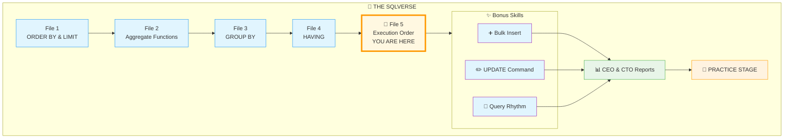
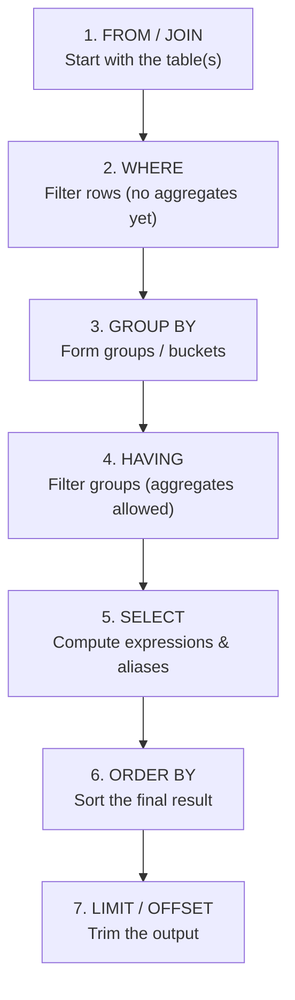

# 🗄️🤖 SQL & GenAI Course
**🎯 Quality Education for Anyone, Anywhere, Anytime — 💫 with Comfort, Convenience at no Cost**

## 📘 File 5: SELECT Execution Order – The Hidden Choreography

You've reached the final gate of the **PREPARE** stage. You know how to write the words, but now you must understand the **sequence**. In SQL, the way you write a query is **not** the way the computer reads it. Understanding this "**Hidden Choreography"** is what separates a beginner from a master.

---

### 📍 Your Current Stage – PREPARE Journey

```mermaid
flowchart LR
    A["✅ COMPLETED<br/>📘 File 1<br/>ORDER BY & LIMIT"] --> B
    B["✅ COMPLETED<br/>📘 File 2<br/>Aggregate Functions"] --> C
    C["✅ COMPLETED<br/>📘 File 3<br/>GROUP BY"] --> D
    D["✅ COMPLETED<br/>📘 File 4<br/>HAVING"] --> E
    E["📍 YOU ARE HERE<br/>📘 File 5<br/>Execution Order"] --> F
    F["✅ PREPARE COMPLETE"] --> G
    G["🔄 RETURN TO MODULE GUIDE<br/>TO BEGIN PRACTICE SECTION"]
    
    style A fill:#e1f5fe,stroke:#4caf50,stroke-width:4px
    style B fill:#e1f5fe,stroke:#4caf50,stroke-width:4px
    style C fill:#e1f5fe,stroke:#4caf50,stroke-width:4px
    style D fill:#e1f5fe,stroke:#4caf50,stroke-width:4px
    style E fill:#e1f5fe,stroke:#2196f3,stroke-width:4px
    style F fill:#fff8e1,stroke:#ff9800,stroke-width:2px
    style G fill:#e8f5e8,stroke:#4caf50,stroke-width:2px
```



You're in **Stage 1: PREPARE**. This is the final concept file in Module 3. After completing it, you'll return to the Module Guide to begin the PRACTICE stage.

---
## 🌌 The SQLVerse Journey – Your Destination

You're about to complete your journey across the SQLVerse through Education Planet. Here's the path you've walked:



**This is where you're headed.** The path ahead is clear – bonus skills, portfolio piece, and the PRACTICE stage beyond. It's time to prove your mastery. Let's take the final steps together. 🚀

---
## 🔧 Enhanced Browser Office for PREPARE

**🚀 Kickstart: Any Computer, Any Browser, Anytime.**  
**🌍 Destination: Any country, Any city, Any Platform.**

| Tab | Purpose | What to Do |
| :--- | :--- | :--- |
| **1: The Map** | Read concept files | You're here – reading this file. This is the last one. |
| **2: The Factory** | Run queries | Keep **[`training_institution_sample.db`](../../../Resources/sample_databases/training_institution_sample.db)** loaded. Run every example query. |
| **3: The Consultant** | Conceptual Q&A | Ask about execution order, why aliases work where they do, or how the database thinks. **Configure AI with [Student Mode Prompt](../../../STUDENT_MODE_PROMPT_LEVEL1.md) which prevents code generation by default.** |
| **4: The Vault** | Save your work | Save successful queries in: `Learning/Level-1-beginner/Level1-1-ACQUIRE/Module3-Sort-Aggregate-Group/1-sqlCommands/` |

---

### 🛠️ Module 3 Toolkit

🚀 Foundation First, AI Next, Projects Last.  
💎 Gemstone by Gemstone, Skill by Skill.

| | | | |
|---|---|---|---|
| **Browser Office** | 🔧 [Troubleshooting Common Issues](../../../Setup/STEP1_COMMISSION_BROWSER_OFFICE.md) | 🔄 [Browser Office Workflow](../../../Setup/STEP2_ESTABLISH_LEARNING_RITUAL.md) | ⌨️ [Tab Operations & Shortcuts](../../../Setup/STEP3_MASTER_TAB_OPERATIONS.md) |
| **ACQUIRE Section** | 🗄️ [Database Ecosystem](../../Guides/Section1-ACQUIRE/2_Database_Ecosystem.md) | 📚 [Knowledge Base (Vault)](../../Guides/Section1-ACQUIRE/3_Knowledge_Base.md) | 🧠 [Mindset Tuning](../../Guides/Section1-ACQUIRE/4_Mindset.md) |

---

## 🎯 What You'll Learn

By the end of this file, you will be able to:

- Understand the difference between **written order** and **execution order** of SQL clauses.
- Name the exact sequence: `FROM` → `WHERE` → `GROUP BY` → `HAVING` → `SELECT` → `ORDER BY` → `LIMIT`.
- Explain why column aliases work in `ORDER BY` but not in `WHERE`.
- Predict how each clause transforms the data step by step.
- Debug queries by mentally walking through the execution order.
- Understand the complete "Life Cycle" of a query from the `FROM` clause to `LIMIT`.
- Prepare for the **PRACTICE** stage with a solid mental framework.

---

## 🔍 The Hidden Life of a Query

When you write a SQL query, you arrange clauses in a specific order that feels natural to humans:

```sql
SELECT   ...   -- 1. What to show
FROM     ...   -- 2. Where to get it
WHERE    ...   -- 3. Which rows to keep
GROUP BY ...   -- 4. How to group
HAVING   ...   -- 5. Which groups to keep
ORDER BY ...   -- 6. How to sort
LIMIT    ...   -- 7. How many to show
```

However, the database follows a **logical execution order** that is quite different.  – like a choreographer planning the dancers' moves behind the scenes. Understanding this hidden **choreography** is the key to writing correct, efficient queries and debugging them when things go wrong.

---
## 🎭 The Great SQL Illusion

When we write a query, we usually start with `SELECT`. It feels like the first step. But for the Database Engine, `SELECT` is actually one of the **last** things it does.

Think of it like a **Professional Kitchen**:

1.  **FROM:** You pick the **Kitchen** (Identify the **table**).
2.  **WHERE:** You filter out **Spoiled Ingredients** (Filter individual **rows**).
3.  **GROUP BY:** You **Chop and Group** ingredients into bowls (Create **buckets**).
4.  **HAVING:** You **Taste-test** the final pots (**Filter** the **buckets**).
5.  **SELECT:** You finally **Plate the Dish** (Pick columns & name **Aliases**).
6.  **ORDER BY:** You **Arrange** the plates on the tray (**Sort** the results).
7.  **LIMIT:** You only deliver the **First 3 Plates** (**Trim** the final **output**).


The customer (you) sees only the **final** plated dish. But the **kitchen** (database) followed a very different sequence to get there.

---

## 📊 True Execution Order

The database processes your query in this sequence:


Here is the "Internal Roadmap" the database follows every time you hit 'Run':

| Order | Clause | Role | Why it matters |
| :--- | :--- | :--- | :--- |
| **1** | `FROM` | **Identify Table** | The database must open the "ledger" before it can see any data. |
| **2** | `WHERE` | **Filter Rows** | It removes individual rows **before** any math or grouping happens. |
| **3** | `GROUP BY` | **Create Buckets** | Rows are sorted into categories based on your criteria. |
| **4** | `HAVING` | **Filter Groups** | It removes entire buckets based on summary totals (Aggregates). |
| **5** | `SELECT` | **Pick Columns** | **Now** it calculates your Aliases and decides which columns to show. |
| **6** | `ORDER BY` | **Sort Results** | The final result set is sorted for the user. |
| **7** | `LIMIT` | **Windowing** | Only the requested number of rows are kept; the rest are discarded. |

> 💡 **The Artisan's Secret:** `SELECT` runs **fifth**, not first. This is why a "Column Alias" created in `SELECT` cannot be used in `WHERE`—it hasn't been born yet!

---

## 👣 Step‑by‑Step Breakdown - The "Final Boss" Query Trace

Let's look at a query that uses **everything** you've learned in Module 3. We will follow and analyze the query through each stage. 

We'll use the `courses` table and this example. Look at this query and trace its path through the factory:

```sql
SELECT course_track, AVG(course_fee) AS avg_fee
FROM courses
WHERE course_fee > 1000
GROUP BY course_track
HAVING AVG(course_fee) > 1500
ORDER BY avg_fee DESC
LIMIT 2;
```

### Step 1: FROM
The database starts with the `courses` table. It holds all rows.

| course_id | course_code | course_name | course_track | course_fee |
|-----------|--------------|-------------|--------------|------------|
| 201 | WD101 | Frontend Development | Web Development | 1500 |
| 202 | WD102 | Backend with Node.js | Web Development | 1800 |
| 203 | DS101 | Python for Data Analysis | Data Science | 2000 |
| 204 | CS101 | Network Security Fundamentals | Cybersecurity | 1600 |
| 205 | WD201 | Full Stack Project | Web Development | 1200 |
| 206 | DS201 | Machine Learning Basics | Data Science | 2200 |
| 207 | DS102 | Data Analysis for Beginners | Data Science | 800 |
| 208 | WD103 | SQL Basics | Web Development | 600 |

### Step 2: WHERE
`WHERE course_fee > 1000` filters out rows with fee ≤ 1000. Rows 207 (800) and 208 (600) are removed. The remaining rows:

| course_id | course_code | course_name | course_track | course_fee |
|-----------|--------------|-------------|--------------|------------|
| 201 | WD101 | Frontend Development | Web Development | 1500 |
| 202 | WD102 | Backend with Node.js | Web Development | 1800 |
| 203 | DS101 | Python for Data Analysis | Data Science | 2000 |
| 204 | CS101 | Network Security Fundamentals | Cybersecurity | 1600 |
| 205 | WD201 | Full Stack Project | Web Development | 1200 |
| 206 | DS201 | Machine Learning Basics | Data Science | 2200 |

### Step 3: GROUP BY
Rows are grouped by `course_track`. We now have three groups:

- **Web Development**: rows 201, 202, 205 (3 rows)
- **Data Science**: rows 203, 206 (2 rows)
- **Cybersecurity**: row 204 (1 row)

### Step 4: HAVING
`HAVING AVG(course_fee) > 1500` computes the average fee per group and keeps only groups where that average exceeds 1500.

- Web Development avg = (1500+1800+1200)/3 = 1500 → **not >1500**, group excluded.
- Data Science avg = (2000+2200)/2 = 2100 → kept.
- Cybersecurity avg = 1600 → kept.

Resulting groups: **Data Science** and **Cybersecurity**.

### Step 5: SELECT
Now the database computes the expressions in the `SELECT` clause. For each surviving group, it produces one row with the group column and the aggregate result. The alias `avg_fee` is assigned here.

| course_track | avg_fee |
|--------------|---------|
| Data Science | 2100 |
| Cybersecurity | 1600 |

### Step 6: ORDER BY
`ORDER BY avg_fee DESC` sorts the rows by the alias (which now exists). The order becomes:

| course_track | avg_fee |
|--------------|---------|
| Data Science | 2100 |
| Cybersecurity | 1600 |

### Step 7: LIMIT
`LIMIT 2` keeps only the first two rows. We have exactly two, so both are returned.

Final result:

| course_track | avg_fee |
|--------------|---------|
| Data Science | 2100 |
| Cybersecurity | 1600 |

**The Execution Flow:**
1.  **FROM:** Open `courses`.
2.  **WHERE:** Throw away any course costing $1000 or less.
3.  **GROUP BY:** Group remaining courses by track.
4.  **HAVING:** Check the buckets. Keep only tracks with an average fee > $1500.
5.  **SELECT:** Finally "label" the columns and calculate the `avg_fee` alias.
6.  **ORDER BY:** Sort so the highest-value track appears first.
7.  **LIMIT:** Show only the top 2 results.

### 🏛️ The Architect's Ledger: The Blueprint of Logic

In the **Architect's Ledger**, we know that you cannot build the roof before you've laid the bricks. Understanding this sequence transforms you from someone who "guesses code" into a **Data Strategist**. If your data is clean and your choreography is correct, your insights will be "**True Truths."**

---

## 🏛️ The Artisan’s Guardrail: Alias Visibility 

Have you ever tried this and gotten an error?
```sql
SELECT total_fees - fees_paid AS balance
FROM students
WHERE balance > 1000; -- ❌ ERROR: "no such column: balance"
```
The database complains because `WHERE` (Step 2) happens **long before** `SELECT` (Step 5). 

However, this works perfectly:
```sql
SELECT total_fees - fees_paid AS balance
FROM students
ORDER BY balance DESC; -- ✅ WORKS!
```
###  The “Aha!” Moment
Because `ORDER BY` (Step 6) happens **after** `SELECT`. By then, the database knows exactly what `balance` means.

-----

### ⚠️ Common Mistakes with WHERE  and AGGREGATES

  * **Mistake 1: Aliases in WHERE.** You cannot filter by a nickname you haven't given yet.
  * **Mistake 2: Aggregates in WHERE.** `WHERE` doesn't know the "total" of a group because groups haven't been formed yet (Step 2 vs Step 3).
  * **Mistake 3: Logic Blindness.** If you filter out rows in `WHERE`, they are gone forever. They won't be included in your `SUM` or `AVG` in later steps.

---

## ⚠️ Common Mistakes

### Mistake 1: Using a column alias in WHERE
```sql
-- Wrong:
SELECT course_track, AVG(course_fee) AS avg_fee
FROM courses
WHERE avg_fee > 1500
GROUP BY course_track;

-- Right: use the aggregate in HAVING (or raw column in WHERE)
```

### Mistake 2: Thinking ORDER BY runs before SELECT
It runs after, which is why aliases work.

### Mistake 3: Forgetting that GROUP BY runs before SELECT
You cannot group by an alias because the alias doesn't exist yet when grouping happens.

```sql
-- Wrong:
SELECT course_track, AVG(course_fee) AS avg_fee
FROM courses
GROUP BY avg_fee;   -- ERROR! avg_fee not known

-- Right: GROUP BY course_track
```

### Mistake 4: Mixing up WHERE and HAVING
Remember: `WHERE` filters rows (before grouping), `HAVING` filters groups (after grouping). Use the flowchart!

---

## 🧪 Practice Challenges

1. **Predict the order**: Given a query with all clauses, list the execution order.
2. **Alias detective**: Fix a query that mistakenly uses an alias in WHERE.
3. **Step‑by‑step simulation**: Write down the intermediate results after each step for a query on the `students` table.
4. **Debug this**: Why does this query fail? `SELECT student_id, SUM(fees_paid) AS total FROM students GROUP BY student_id HAVING total > 5000;` (Answer: alias in HAVING – not allowed in some databases; better to repeat expression.)
5. **Write your own**: Craft a query that uses all clauses and walk through its execution.

---

## 📋 Execution Order Quick Reference Card

**Memory Aid:**  
> *“From Where Group Having Select Order Limit”*  
> (Artisans often remember: **F**red **W**ants **G**reat **H**alibut, **S**o **O**rder **L**unch!)


| Step | Clause | What It Does | Can Use Aliases? |
|------|--------|--------------|-------------------|
| 1 | `FROM` / `JOIN` | Identifies source tables | No |
| 2 | `WHERE` | Filters individual rows | No |
| 3 | `GROUP BY` | Forms groups | No |
| 4 | `HAVING` | Filters groups | No (aggregates only) |
| 5 | `SELECT` | Computes expressions, assigns aliases | No (creates them) |
| 6 | `ORDER BY` | Sorts final result | ✅ Yes |
| 7 | `LIMIT` / `OFFSET` | Limits number of rows & Trims output | No |


**Save this reference in your Vault as:** `5-execution-order-refcard.md`

---
## 🎯 Final Challenge: Two Portfolio Reports

Now that you understand the hidden choreography of SQL, it's time to apply everything you've learned to build **two professional portfolio pieces**. Each speaks to a different audience and showcases a different facet of your skills.

### 📊 CEO Report: E‑Commerce Analytics Dashboard

**Audience:** Chief Executive Officer of the **E‑Store**  
**Focus:** Business insights from sales, customers, and products  
**Skills Demonstrated:** All Module 3 concepts applied to real business questions

Your mission is to use the **E‑Store database** (`level1_estore_basic.db`) to answer questions that help the CEO understand the business. You'll create a report with clear insights, not just numbers.

> 🧭 **Detailed instructions, queries, and submission guidelines are in your `2-practiceExercises` folder.**  
> **File name:** `MODULE3-CEO-REPORT.md`

---

### 💻 CTO Report: Methodology & Discipline

**Audience:** Chief Technology Officer  
**Focus:** Your learning journey, disciplined approach, and understanding of SQL execution  
**Skills Demonstrated:** All Module 3 concepts, bonus skills (bulk insert, UPDATE, Query Rhythm), and meta‑cognition about your process

This report is about **how you work**. It should demonstrate that you don't just write queries – you think about them systematically.

> 🧭 **Detailed instructions, evidence requirements, and submission guidelines are in your `2-practiceExercises` folder.**  
> **File name:** `MODULE3-CTO-REPORT.md`

---
### 🌸 The  SQLVerse Artisan's Garden

In the **SQLVerse**, data is a garden with all types of flowers.

- **ORDER BY** lets you choose the color scheme and which flowers to feature.
- **Aggregate functions** count the blooms, measure their height, and find the brightest petals.
- **GROUP BY** trims the stems, gathering similar flowers into elegant bundles.
- **HAVING** removes the leaves and thorns – the distractions that don't belong.
- **LIMIT** arranges your flowers from the center out and secures them with floral tape and wrapping.

Now you are ready to create **two bouquets** – one for the CEO and one for the CTO – and showcase them in your professional dashboard. Each bouquet tells a different story, but both are crafted with the same Artisan's care.

---

### 🧠 The Artisan's Truth

> *"The CEO Report shows **what you can do**. The CTO Report shows **how you think**. One proves you can answer questions. The other proves you're ready for production. Both together? That's a portfolio that opens doors."*

---


## ✅ Progress Check

After reading this and trying the examples, can you:


- [ ] Recite the true execution order (`FROM` → `WHERE` → `GROUP BY` → `HAVING` → `SELECT` → `ORDER BY` → `LIMIT`) from memory?
- [ ] Explain why column aliases can't be used in `WHERE` or `HAVING` but work in `ORDER BY`?
- [ ] Identify which steps occur **before** `SELECT` and how they affect the final result?
- [ ] Walk through a multi‑clause query step by step and accurately predict its output?
- [ ] Debug a query that misuses execution order or incorrectly mixes `WHERE` and `HAVING`?
- [ ] Use the bonus skills confidently – perform a bulk insert and a targeted `UPDATE`?
- [ ] Save your Execution Order Quick Reference Card in your Vault for future reference?

**If yes → You've mastered the hidden choreography of SQL and are ready to tackle the capstone reports!**

---

## 💎 DESIGNER'S PERIGON

<div style="border: 3px solid #9c27b0; border-radius: 10px; padding: 20px; margin: 25px 0; background: linear-gradient(135deg, #f3e5f5 0%, #e1bee7 100%);">

### *The Art of Choreography*

You've just learned the secret dance that every query performs behind the scenes. What you write is the script; what the database executes is the performance.

Think of a symphony. The musicians read the score from left to right, but the sound they produce is a harmonious blend that follows its own logic – the strings play first, then the winds join, finally the percussion. The audience hears only the final masterpiece, unaware of the intricate timing that made it possible.

In the **SQLVerse**, execution order is the conductor's baton. It ensures that every clause plays its part at exactly the right moment.

- **FROM** brings the orchestra on stage.
- **WHERE** silences the instruments that shouldn't play.
- **GROUP BY** organizes them into sections.
- **HAVING** decides which sections are worthy of a solo.
- **SELECT** lets them play their notes.
- **ORDER BY** arranges them for the final bow.
- **LIMIT** brings down the curtain after the perfect moment.

Without understanding this **choreography**, you're just guessing why your query returned what it did. With it, you become the conductor – in complete control of every note. 

Understanding this **choreography** makes the difference between **knowing SQL** and **owning SQL**. The Artisans of  the **SQLVerse** do not just know SQL – they own it, and make any database in any planet **dance** to their **choreography**.

---

### 🏛️ The Architect's Ledger Connection

Remember **ACID** and **Data Integrity**? Execution order is where those principles come alive. The database follows this order rigidly, consistently, and reliably – every single time. That's the **Consistency** and **Durability** you learned about, applied to query processing.

> 💎 **Ledger Insight:** *"Written order is what you think; execution order is what the database does. Master the gap between them, and you master SQL."*

---

### 🧠 The Artisan's Truth


> *"A query is a conversation with the database. Execution order is the grammar that makes it understandable."*

> *"You've moved from writing queries to conducting them. The orchestra awaits your baton."*

> *"The way you write is for humans. The way it runs is for the machine. To be an Artisan, you must speak to both."*

> *"Once you master the sequence, the 'Logic Errors' vanish, leaving only the **clarity** of the data."*

> *"The PREPARE stage is now complete. The PRACTICE stage awaits – where you'll apply everything you've learned to real problems across the SQLVerse."*

</div>

---
## 🌌 The SQLVerse Journey – Complete

You've traveled across the SQLVerse, mastering each planet's unique challenges. Look how far you've come:

```mermaid
flowchart LR
    subgraph SQLVERSE["🌌 THE SQLVERSE"]
        direction LR
        F1["File 1<br/>ORDER BY & LIMIT"] --> F2
        F2["File 2<br/>Aggregate Functions"] --> F3
        F3["File 3<br/>GROUP BY"] --> F4
        F4["File 4<br/>HAVING"] --> F5
        F5["File 5<br/>Execution Order"] --> Reports["🎯 CEO & CTO Reports"]
        Reports --> PrepComplete["✅ MODULE 3<br/>PREPARE COMPLETE"]
        PrepComplete --> Practice["🔄 PRACTICE STAGE<br/>🛒 E‑Commerce Planet"]
        Practice --> Evaluate["📝 EVALUATE STAGE"]
        Evaluate --> Reflection["📖 Module 3 Guide<br/>for Reflection"]
        Reflection --> NextModule["📂 Module 4<br/>🔗 Joining Tables<br/>Education Planet Returns"]
    end
    
    style F1 fill:#e1f5fe,stroke:#4caf50
    style F2 fill:#e1f5fe,stroke:#4caf50
    style F3 fill:#e1f5fe,stroke:#4caf50
    style F4 fill:#e1f5fe,stroke:#4caf50
    style F5 fill:#e1f5fe,stroke:#4caf50
    style Reports fill:#fff8e1,stroke:#ff9800
    style PrepComplete fill:#c8e6c9,stroke:#2e7d32
    style Practice fill:#e8f5e8,stroke:#4caf50
    style Evaluate fill:#fff8e1,stroke:#ff9800
    style Reflection fill:#fff8e1,stroke:#ff9800
    style NextModule fill:#e1f5fe,stroke:#2196f3
```



From your first `ORDER BY` to mastering execution order, every concept has led you here. The laws of the SQLVerse are now yours.

---
## ✨ Your Journey at a Glance

| File | What You Mastered |
|------|-------------------|
| **File 1** | Sorting with `ORDER BY`, limiting with `LIMIT` and `OFFSET` |
| **File 2** | Aggregate functions: `COUNT`, `SUM`, `AVG`, `MIN`, `MAX` |
| **File 3** | Grouping data with `GROUP BY` – creating sub‑segments |
| **File 4** | Filtering groups with `HAVING` |
| **File 5** | Understanding the hidden choreography – execution order |
| **✨ Bonus Skill 1** | **➕ Bulk Insert** – adding multiple rows efficiently |
| **✨ Bonus Skill 2** | **✏️ UPDATE Command** – modifying existing data with precision |
| **✨ Bonus Skill 3** | **🎵 Enhanced Artisan's Query Rhythm** – a disciplined approach to query writing and debugging |
| **📊 Capstone Report 1** | **CEO Report** – E‑Commerce Analytics Dashboard (business insights for leadership) |
| **💻 Capstone Report 2** | **CTO Report** – Methodology & Discipline (your workflow, safety protocols, and documented process) |

---

## 🎯 What Sets This Course Apart

| Other Courses Teach You... | This Course Taught You... |
|---------------------------|---------------------------|
| `ORDER BY` syntax | **Prioritization** – what matters most in your data |
| `GROUP BY` syntax | **Pattern seeking** – finding categories and sub‑segments |
| `HAVING` syntax | **Focus** – filtering out the noise to see what counts |
| Execution order as trivia | **Choreography** – the hidden dance behind every query |
| Just query writing | **Methodology** – the Artisan's Query Rhythm for life |
| Bonus skills as afterthoughts | **Real‑world tools** – bulk insert, update, and disciplined workflow |
| Theory and syntax in isolation | **Portfolio‑Ready Mastery** – two executive‑level reports (CEO & CTO) that prove your skills to leadership |

**The Difference:** You're not just learning SQL – you're becoming an **Artisan** who thinks, plans, and executes with precision.

---


## ✅ Module 3: PREPARE - COMPLETE!

**Congratulations!** You have finished the "Knowledge Acquisition" phase of Module 3.

- [x] You can **Sort** results with `ORDER BY` (ascending/descending, multiple columns).
- [x] You can **Slice** result sets with `LIMIT` and `OFFSET` for pagination.
- [x] You can **Calculate** totals, averages, and counts with `SUM`, `AVG`, `COUNT`, `MIN`, `MAX`.
- [x] You can **Bucket** data into meaningful categories with `GROUP BY`.
- [x] You can create **sub‑segments** by grouping multiple columns.
- [x] You can **Filter Groups** with `HAVING` to focus on what matters.
- [x] You understand the hidden **Choreography** – the complete SQL execution order.
- [x] You've mastered **➕ Bulk Insert** – adding multiple rows efficiently.
- [x] You've mastered **✏️ UPDATE** – modifying existing data with precision.
- [x] You've internalized the **🎵 Enhanced Artisan's Query Rhythm** – a disciplined approach to writing and debugging queries.

### 🔄 What's Next?

It is time to leave the "Map" behind and enter **The Factory**. Return to your **Module 3 Guide** and navigate to the **PRACTICE** section. There, you'll find the detailed instructions for your **CEO Report** (E‑Commerce Analytics) and **CTO Report** (Methodology & Discipline).

Build, break, and master these skills through real-world business cases. Your portfolio awaits! 🚀

What a journey we had in **Module 3**: Choreography, Artisan's Rhythm, Symphony, and **The Artisan's Garden**. It feels like we celebrated with music in a beautiful garden. In **Module 4**, we'll look at designing the **Landscape for our Data Garden**.

---
## 🧭 File Navigation

```mermaid
flowchart LR
    A["✅ COMPLETED<br/>📘 File 1<br/>ORDER BY & LIMIT"] --> B
    B["✅ COMPLETED<br/>📘 File 2<br/>Aggregate Functions"] --> C
    C["✅ COMPLETED<br/>📘 File 3<br/>GROUP BY"] --> D
    D["✅ COMPLETED<br/>📘 File 4<br/>HAVING"] --> E
    E["✅ COMPLETED<br/>📘 File 5<br/>Execution Order"] --> F
    F["✅ PREPARE COMPLETE"] --> G
    G["🔄 RETURN TO MODULE GUIDE<br/>TO BEGIN PRACTICE SECTION"]
    
    style A fill:#e1f5fe,stroke:#4caf50,stroke-width:4px
    style B fill:#e1f5fe,stroke:#4caf50,stroke-width:4px
    style C fill:#e1f5fe,stroke:#4caf50,stroke-width:4px
    style D fill:#e1f5fe,stroke:#4caf50,stroke-width:4px
    style E fill:#e1f5fe,stroke:#4caf50,stroke-width:4px
    style F fill:#fff8e1,stroke:#ff9800,stroke-width:2px
    style G fill:#e8f5e8,stroke:#4caf50,stroke-width:2px
```



| Previous Step | Next Step |
|:---:|:---:|
| [← Back to File 4: HAVING](./4-having.md) | [Return to Module 3 Guide →](../MODULE3_GUIDE.md) to begin PRACTICE |

---
*This course is licensed under the **MIT License**. Share, modify, and build freely.*

*Part of our mission for 🎯 Quality Education for Anyone, Anywhere, Anytime — 💫 with Comfort, Convenience at no Cost.*

**Level 1 | Module 3 | File 5: Execution Order | Next: Return to Module Guide**


