# 🗄️🤖 SQL & GenAI Course
**🎯 Quality Education for Anyone, Anywhere, Anytime — 💫 with Comfort, Convenience at no Cost**

## 🧠 Exercise 1: Sorting Basics – ORDER BY, LIMIT, OFFSET

You've learned how to sort results and control the number of rows returned. Now it's time to practice these skills on the **E‑Store database** – the same one you'll use for the CEO Report. You'll sort customers by name, products by price, and even implement pagination – just like a real report builder.

---

## 🌌 SQLVerse Check-In

<div style="border-left: 4px solid #9c27b0; background-color: #f3e5f5; padding: 15px; margin: 20px 0; border-radius: 0 8px 8px 0;">

**You are now on E‑Commerce Planet.** The laws of sorting and limiting are universal. Whether you're sorting customers alphabetically or products by price, the logic is the same – only the data changes.

### 🔍 SQLVerse Artisan's Objective

In this exercise, you will move beyond simple "ascending" sorts. You will learn to prioritize data using **Multi-Column Sorting** and the **Top-N Pattern**. These are the primary tools used to create "Leaderboards" and "Recent Activity" feeds in real apps.

**The difference between a coder and an Artisan is discipline.**
</div>

---

### 📍 Your Current Stage – PRACTICE Journey

```mermaid
flowchart LR
    A["✅ PREPARE Complete<br/>📘 Files 1-5"] --> B
    B["✅ CEO Report"] --> C
    C["✅ CTO Report"] --> D
    D["📍 YOU ARE HERE<br/>🧠 Practice Exercise 1<br/>Sorting Basics"] --> E
    E["⏳ Practice Exercise 2<br/>Aggregate Basics"] --> F
    F["⏳ Practice Exercise 3<br/>GROUP BY Practice"] --> G
    G["⏳ Practice Exercise 4<br/>HAVING Practice"] --> H
    H["⏳ Practice Exercise 5<br/>Mixed Practice"] --> I
    I["✅ PRACTICE COMPLETE<br/>Ready for Quiz"]
    
    style A fill:#e1f5fe,stroke:#4caf50,stroke-width:2px
    style B fill:#c8e6c9,stroke:#4caf50,stroke-width:2px
    style C fill:#c8e6c9,stroke:#4caf50,stroke-width:2px
    style D fill:#fff8e1,stroke:#ff9800,stroke-width:4px
    style E fill:#fff8e1,stroke:#ff9800,stroke-width:2px
    style F fill:#fff8e1,stroke:#ff9800,stroke-width:2px
    style G fill:#fff8e1,stroke:#ff9800,stroke-width:2px
    style H fill:#fff8e1,stroke:#ff9800,stroke-width:2px
    style I fill:#a5d6a7,stroke:#2e7d32,stroke-width:2px
```



You've completed the two capstone reports. Now it's time to sharpen your skills with focused practice exercises. This first exercise covers `ORDER BY`, `LIMIT`, and `OFFSET`.

---

## 🔧 Enhanced Browser Office for PRACTICE

**🚀 Kickstart: Any Computer, Any Browser, Anytime.**  
**🌍 Destination: Any country, Any city, Any Platform.**

| Tab | Purpose | What to Do |
| :--- | :--- | :--- |
| **1: The Map** | Reference materials | • Keep your **[Module 3 Reference Guide](./module3-reference.md)** handy.<br>• Complete the challenges below. |
| **2: The Factory** | Run queries | Switch to the **E‑Store database**: **[`level1_estore_basic.db`](../../../Resources/sample_databases/level1_estore_basic.db)**. Run every query. |
| **3: The Consultant** | Conceptual Q&A | If stuck, follow the **3‑Attempt Rule**. Ask for conceptual hints, not code. Configure with **[Student Mode Prompt](../../../STUDENT_MODE_PROMPT_LEVEL1.md)**. |
| **4: The Vault** | Save your work | Save each successful query in your Vault at: `Learning/Level-1-beginner/Level1-1-ACQUIRE/Module3-Sort-Aggregate-Group/2-practiceExercises/` |

---

### 🛠️ Module 3 Toolkit

🚀 Foundation First, AI Next, Projects Last.  
💎 Gemstone by Gemstone, Skill by Skill.

| | | | |
|---|---|---|---|
| **Browser Office** | 🔧 [Troubleshooting Common Issues](../../../Setup/STEP1_COMMISSION_BROWSER_OFFICE.md) | 🔄 [Browser Office Workflow](../../../Setup/STEP2_ESTABLISH_LEARNING_RITUAL.md) | ⌨️ [Tab Operations & Shortcuts](../../../Setup/STEP3_MASTER_TAB_OPERATIONS.md) |
| **ACQUIRE Section** | 🗄️ [Database Ecosystem](../../Guides/Section1-ACQUIRE/2_Database_Ecosystem.md) | 📚 [Knowledge Base (Vault)](../../Guides/Section1-ACQUIRE/3_Knowledge_Base.md) | 🧠 [Mindset Tuning](../../Guides/Section1-ACQUIRE/4_Mindset.md) |

---

## 🏛️ Your Data Playground – E‑Store Database

You'll work with the `customers`, `products`, and `orders` tables. Here are reminders of their key columns.

### `customers` Table (first 3 rows for context)
| customer_id | name | email | city |
|-------------|------|-------|------|
| 1 | Alice Smith | alice@email.com | New York |
| 2 | Bob Johnson | bob@email.com | Chicago |
| 3 | Charlie Lee | charlie@email.com | New York |

### `products` Table (first 3 rows for context)
| product_id | product_name | category | price |
|------------|--------------|----------|-------|
| 1 | Laptop | Electronics | 1200.00 |
| 2 | Coffee Maker | Appliances | 80.00 |
| 3 | SQL Essentials Book | Books | 45.00 |

### `orders` Table (first 3 rows for context)
| order_id | customer_id | order_date |
|----------|-------------|------------|
| 1 | 1 | 2025-10-01 |
| 2 | 2 | 2025-10-01 |
| 3 | 1 | 2025-10-03 |

> 💡 **View the full datasets:** Run `SELECT * FROM customers;`, `SELECT * FROM products;`, and `SELECT * FROM orders;` in your Factory to see all rows.

---

## 💡 Artisan's Pro‑Tips for Sorting

1. **Always use `ORDER BY` with `LIMIT`** when you want a meaningful "top N" list; otherwise, the rows are arbitrary.
2. **`ORDER BY` without `DESC` defaults to ascending** (A‑Z, smallest to largest).
3. **Multiple columns:** The order you list them determines priority. For example, `ORDER BY category, price` sorts by category first, then by price within each category.
4. **`OFFSET` is for pagination.** Always pair it with `ORDER BY` so the pages are consistent.
5. **Aliases work in `ORDER BY`.** You can write `ORDER BY balance` after `SELECT ... AS balance` (execution order allows it).

---

## 🧪 Challenges

For each challenge, use the **Artisan's Query Rhythm**:
- **The Question** – read the business request.
- **The Query** – write your SQL.
- **Expected Result** – predict what you should see.
- **Try it now** – run it in Tab 2.
- **Reflect & Learn** – compare actual with expectation.

---

### Challenge 1: Alphabetical Customers
**Question:** List all customers sorted by name (A‑Z). Show `name`, `email`, and `city`.

```sql
-- Your query here
-- Save as: 1-1-alphabetical-customers.sql
```

**Expected Result:** All 5 customers sorted by name.  
**What this teaches:** Basic `ORDER BY` ascending.

---

### Challenge 2: Newest Orders First
**Question:** Show the 3 most recent orders. Display `order_id`, `customer_id`, and `order_date`.

```sql
-- Your query here
-- Save as: 1-2-newest-orders.sql
```

**Expected Result:** 3 rows with the latest order dates.  
**What this teaches:** `ORDER BY` with `DESC` and `LIMIT`.

---

### Challenge 3: Top 3 Most Expensive Products
**Question:** Which are the three most expensive products? Show `product_name` and `price`.

```sql
-- Your query here
-- Save as: 1-3-expensive-products.sql
```

**Expected Result:** The three highest prices (Laptop, Headphones, Coffee Maker? Actually Headphones are 150, Coffee Maker 80, etc. – but the order will be determined by the data).  
**What this teaches:** `ORDER BY ... DESC LIMIT n`.

---

### Challenge 4: Pagination – Second Page of Customers
**Question:** Assume you want to show customers 2 per page sorted by `customer_id`. Write a query to get the second page (rows 3‑4).

```sql
-- Your query here
-- Hint: Use ORDER BY customer_id, LIMIT 2 OFFSET 2
-- Save as: 1-4-pagination.sql
```

**Expected Result:** Two rows with customer_id 3 and 4.  
**What this teaches:** `OFFSET` for pagination.

---

### Challenge 5: Sort by Multiple Columns
**Question:** Show all products sorted first by `category` (alphabetically), and within the same category, by `price` descending (highest first).

```sql
-- Your query here
-- Save as: 1-5-multi-sort.sql
```

**Expected Result:** All products; Appliances appear before Books, etc., and within each category, prices from high to low.  
**What this teaches:** Multi‑column sorting with mixed directions.

---


### Challenge 6: Sorting with an Alias
**Question:** Show the customer `name` and `city`. Give the `name` column the alias `customer_name`, then sort the results by the alias in descending order (Z‑A).

```sql
-- Your query here
-- Hint: SELECT name AS customer_name, city FROM customers ORDER BY customer_name DESC
-- Save as: 1-6-alias-sort.sql
```

**Expected Result:** Customers sorted by name Z‑A.  
**What this teaches:** Using column aliases in `ORDER BY`.

---

### Challenge 7: Oldest Orders (Optional)
**Question:** Show the 2 oldest orders (earliest date). Display `order_id`, `customer_id`, and `order_date`. If there are ties, show the one with the smaller `order_id` first.

```sql
-- Your query here
-- Save as: 1-7-oldest-orders.sql
```

**Expected Result:** Two rows with the earliest order_date, and if multiple orders on the same day, sorted by order_id ascending.  
**What this teaches:** Multi‑column sorting with different directions (ASC for both here).

---

## 🎯 Your Progress Tracker

| Challenge | Status (✅/⏳) | Confidence (1‑5) |
|-----------|---------------|------------------|
| 1: Alphabetical Customers | | |
| 2: Newest Orders | | |
| 3: Most Expensive Products | | |
| 4: Pagination | | |
| 5: Multi‑Column Sort | | |
| 6: Alias Sort | | |
| 7: Oldest Orders (Optional) | | |

---
## 🌍 Real‑World Application: What You Just Built

The sorting and limiting skills you just practiced are the engine behind many business features you interact with every day.

---

### 🏋️ The Luxury Inventory Report

Your `ORDER BY price DESC` query is exactly what a warehouse manager uses to prioritize security on high‑value items. The most expensive products get the most attention.

> **Task:** Select all columns from the `products` table.  
> **Requirement:** Sort by `price` from highest to lowest.  
> **Artisan's Goal:** Identify the single most expensive item in the store.

---

### 🏋️ The Categorized Catalog

The multi‑column sort (`ORDER BY category, price`) powers the browse pages of every e‑commerce site. It organizes products by department (category), and within each department, shows the cheapest options first.

> **Task:** Select `product_name`, `category`, and `price`.  
> **Requirement:** Sort first by `category` (Ascending), then by `price` (Ascending).  
> **Artisan's Goal:** Notice how the price "resets" its sort order every time the category name changes.

---

### 🏋️ The "Wall of Fame" (Top‑N Pattern)

`ORDER BY stock_quantity DESC LIMIT 5` is how marketing identifies the most‑stocked items for homepage promotions. The `LIMIT` keeps the report focused on what matters.

> **Task:** Select `product_name` and `price`.  
> **Requirement:** Sort by `price` (Descending) and show **only the first 5** results.  
> **Artisan's Goal:** Master the use of `LIMIT` to keep your reports concise and focused.

---

The queries you wrote are not just syntax exercises – they are the logic behind real business decisions. Whether you're building a leaderboard, a product catalog, or a recent activity feed, you now know how to **prioritize** and **present** data like a professional.

---

## ✅ When You're Done

- [ ] I successfully ran all 7 queries (or made a solid attempt at each).
- [ ] I saved each query in my Vault with the correct filename.
- [ ] I can explain the difference between `ORDER BY` with and without `DESC`.
- [ ] I can use `LIMIT` and `OFFSET` to implement pagination.
- [ ] I understand why aliases work in `ORDER BY` but not in `WHERE` (execution order).
- [ ] I feel ready for Exercise 2: Aggregate Basics.

---

## 🧭 Practice Navigation

```mermaid
flowchart LR
    A["✅ PREPARE Complete<br/>📘 Files 1-5"] --> B
    B["✅ CEO Report"] --> C
    C["✅ CTO Report"] --> D
    D["✅ Exercise 1<br/>Sorting Basics"] --> E
    E["⏳ Exercise 2<br/>Aggregate Basics"] --> F
    F["⏳ Exercise 3<br/>GROUP BY Practice"] --> G
    G["⏳ Exercise 4<br/>HAVING Practice"] --> H
    H["⏳ Exercise 5<br/>Mixed Practice"] --> I
    I["✅ PRACTICE COMPLETE<br/>Ready for Quiz"]
    
    style A fill:#e1f5fe,stroke:#4caf50,stroke-width:2px
    style B fill:#c8e6c9,stroke:#4caf50,stroke-width:2px
    style C fill:#c8e6c9,stroke:#4caf50,stroke-width:2px
    style D fill:#c8e6c9,stroke:#4caf50,stroke-width:2px
    style E fill:#fff8e1,stroke:#ff9800,stroke-width:4px
    style F fill:#fff8e1,stroke:#ff9800,stroke-width:2px
    style G fill:#fff8e1,stroke:#ff9800,stroke-width:2px
    style H fill:#fff8e1,stroke:#ff9800,stroke-width:2px
    style I fill:#a5d6a7,stroke:#2e7d32,stroke-width:2px
```



| Previous Step | Next Step |
|:---:|:---:|
| [← Back to CTO Report](./MODULE3-CTO-REPORT.md) | [Continue to Exercise 2: Aggregate Basics →](./2-aggregate-basics.md) |

---

*Part of our mission for 🎯 Quality Education for Anyone, Anywhere, Anytime — 💫 with Comfort, Convenience at no Cost.*

**Level 1 | Module 3 | Practice Exercise 1 | Next: [Aggregate Basics](./2-aggregate-basics.md)**