# 🗄️🤖 SQL & GenAI Course
**🎯 Quality Education for Anyone, Anywhere, Anytime — 💫 with Comfort, Convenience at no Cost**

## 🧠 Exercise 2: Aggregate Basics – Counting, Summing, Averaging

You've learned how to sort and limit results. Now it's time to **measure** your data – to count rows, calculate totals, and find averages, minimums, and maximums. These aggregate functions turn raw data into meaningful numbers that drive business decisions.

---

## 🌌 SQLVerse Check-In

<div style="border-left: 4px solid #9c27b0; background-color: #f3e5f5; padding: 15px; margin: 20px 0; border-radius: 0 8px 8px 0;">


**You are now on E‑Commerce Planet.** The CEO doesn't just want lists – they want answers: *"How many customers do we have?"* *"What's our total revenue?"* *"What's the average order value?"* Aggregates give you these answers in seconds.

Welcome back to the Factory! You’ve built the **CEO Dashboard** and the **CTO Methodology**—now it’s time to master the **CFO’s favorite tools**: the **Big 5 Aggregates**.

### 🔍 SQLVerse Artisan's Objective

In this exercise, you will learn to **measure** your data using aggregate functions. You'll count customers, sum revenues, find average prices, and identify the most **expensive** and **cheapest** products. These are the building blocks of every business report. We move from looking at individual rows to calculating the **"Vital Signs"** of the entire E-Store.

**The difference between a coder and an Artisan is discipline.**
</div>

---

### 📍 Your Current Stage – PRACTICE Journey


You've completed Exercise 1. Now it's time to practice aggregate functions.

---

## 🔧 Enhanced Browser Office for PRACTICE

**🚀 Kickstart: Any Computer, Any Browser, Anytime.**  
**🌍 Destination: Any country, Any city, Any Platform.**

| Tab | Purpose | What to Do |
| :--- | :--- | :--- |
| **1: The Map** | Reference materials | • Keep your **[Module 3 Reference Guide](./module3-reference.md)** handy.<br>• Complete the challenges below. |
| **2: The Factory** | Run queries | Switch to the **E‑Store database**: **[`level1_estore_basic.db`](../../../Resources/sample_databases/level1_estore_basic.db)**. Run every query. |
| **3: The Consultant** | Conceptual Q&A | If stuck, follow the **3‑Attempt Rule**. Ask for conceptual hints, not code. Configure with **[Student Mode Prompt](../../../STUDENT_MODE_PROMPT_LEVEL1.md)**. |
| **4: The Vault** | Save your work | Save each successful query in your Vault at: `Learning/Level-1-beginner/Level1-1-ACQUIRE/Module3-Sort-Aggregate-Group/2-practiceExercises/` |

---

### 🛠️ Module 3 Toolkit

🚀 Foundation First, AI Next, Projects Last.  
💎 Gemstone by Gemstone, Skill by Skill.

| | | | |
|---|---|---|---|
| **Browser Office** | 🔧 [Troubleshooting Common Issues](../../../Setup/STEP1_COMMISSION_BROWSER_OFFICE.md) | 🔄 [Browser Office Workflow](../../../Setup/STEP2_ESTABLISH_LEARNING_RITUAL.md) | ⌨️ [Tab Operations & Shortcuts](../../../Setup/STEP3_MASTER_TAB_OPERATIONS.md) |
| **ACQUIRE Section** | 🗄️ [Database Ecosystem](../../Guides/Section1-ACQUIRE/2_Database_Ecosystem.md) | 📚 [Knowledge Base (Vault)](../../Guides/Section1-ACQUIRE/3_Knowledge_Base.md) | 🧠 [Mindset Tuning](../../Guides/Section1-ACQUIRE/4_Mindset.md) |

---

## 🏛️ Your Data Playground – E‑Store Database

You'll work with the same tables as before. Here are quick reminders.

### `customers` Table (first 3 rows)
| customer_id | name | email | city |
|-------------|------|-------|------|
| 1 | Alice Smith | alice@email.com | New York |
| 2 | Bob Johnson | bob@email.com | Chicago |
| 3 | Charlie Lee | charlie@email.com | New York |

### `products` Table (first 3 rows)
| product_id | product_name | category | price |
|------------|--------------|----------|-------|
| 1 | Laptop | Electronics | 1200.00 |
| 2 | Coffee Maker | Appliances | 80.00 |
| 3 | SQL Essentials Book | Books | 45.00 |

### `orders` Table (first 3 rows)
| order_id | customer_id | order_date |
|----------|-------------|------------|
| 1 | 1 | 2025-10-01 |
| 2 | 2 | 2025-10-01 |
| 3 | 1 | 2025-10-03 |

### `order_items` Table (first 3 rows)
| order_item_id | order_id | product_id | quantity |
|---------------|----------|------------|----------|
| 1 | 1 | 1 | 1 |
| 2 | 1 | 3 | 1 |
| 3 | 2 | 2 | 1 |

> 💡 **View the full datasets:** Run `SELECT * FROM customers;`, `SELECT * FROM products;`, `SELECT * FROM orders;`, `SELECT * FROM order_items;` in your Factory to see all rows.

---

## 💡 Artisan's Pro‑Tips for Aggregates

1. **`COUNT(*)` counts all rows**, including those with NULLs. **`COUNT(column)` counts only non‑NULL values**. Use the right one for the job.
2. **`SUM` and `AVG` ignore NULLs** – they won't add or average what they can't see. If NULLs matter, use `COALESCE` (preview of advanced).
3. **Aliases** are your friend: `COUNT(*) AS total_customers` makes output readable.
4. **You can combine aggregates** in one query: `SELECT COUNT(*), AVG(price), MIN(price), MAX(price) FROM products;`.
5. **Aggregates work with `WHERE`** – you can filter rows before counting or summing.

---


## 🧪 Challenges

For each challenge, use the **Artisan's Query Rhythm**:
- **The Question** – read the business request.
- **The Query** – write your SQL.
- **Expected Result** – predict what you should see.
- **Try it now** – run it in Tab 2.
- **Reflect & Learn** – compare actual with expectation.

---

### 📦 Group A: The Inventory Pulse
*The Warehouse Manager needs a quick snapshot of our product catalog.*

**Challenge 1:** How many total products do we carry in the `products` table?

```sql
-- Your query here
-- Save as: 2-1-total-products.sql
```

**Expected Result:** [Write your prediction here before running the query]  
**What this teaches:** Basic `COUNT(*)`.

---

**Challenge 2:** What is the price of our cheapest product and our most expensive product?

```sql
-- Your query here
-- Save as: 2-2-price-range.sql
```

**Expected Result:** [Write your prediction here before running the query]  
**What this teaches:** `MIN` and `MAX`.

---

**Challenge 3:** What is the average price of all products in the store?

```sql
-- Your query here
-- Save as: 2-3-avg-price.sql
```

**Expected Result:** [Write your prediction here before running the query]  
**What this teaches:** `AVG`.

---

### 📈 Group B: Revenue & Volume
*Now look at the `order_items` table. This table records every single item sold.*

**Challenge 4:** What is the total quantity of all items ever sold?

```sql
-- Your query here
-- Save as: 2-4-total-units.sql
```

**Expected Result:** [Write your prediction here before running the query]  
**What this teaches:** `SUM` on a column.

---

> **Preview Note:** In Module 4, you'll learn how to join tables to calculate average selling price and total revenue. For now, focus on mastering single‑table aggregates.

---

### 🎯 Group C: The Precision Round (Filtering Aggregates)
*Aggregates follow the Hidden Choreography. Remember: `WHERE` happens before the math.*

**Challenge 5:** What is the average price of products only in the **'Electronics'** category?

```sql
-- Your query here
-- Save as: 2-5-electronics-avg.sql
```

**Expected Result:** [Write your prediction here before running the query]  
**What this teaches:** Aggregates with `WHERE`.

---

**Challenge 6:** What is the total quantity sold for `product_id = 1` (the Laptop)?

```sql
-- Your query here
-- Save as: 2-6-product1-quantity.sql
```

**Expected Result:** [Write your prediction here before running the query]  
**What this teaches:** `SUM` with a filter.

---

### 👥 Group D: Customer Pulse
*The CEO wants to know who our customers are and where they come from.*

**Challenge 7:** How many customers are in our database?

```sql
-- Your query here
-- Save as: 2-7-total-customers.sql
```

**Expected Result:** [Write your prediction here before running the query]  
**What this teaches:** `COUNT(*)` on a table.

---

**Challenge 8:** How many customers are from **New York**?

```sql
-- Your query here
-- Save as: 2-8-ny-customers.sql
```

**Expected Result:** [Write your prediction here before running the query]  
**What this teaches:** Aggregates with `WHERE`.

---

### 📊 Group E: Order Overview
*The CFO wants a high‑level view of business activity.*

**Challenge 9:** How many orders have been placed?

```sql
-- Your query here
-- Save as: 2-9-order-count.sql
```

**Expected Result:** [Write your prediction here before running the query]  
**What this teaches:** Counting rows in another table.

---

**Challenge 10:** How many individual line items are in the `order_items` table? (Count rows.)

```sql
-- Your query here
-- Save as: 2-10-order-items-count.sql
```

**Expected Result:** [Write your prediction here before running the query]  
**What this teaches:** `COUNT(*)` on a different table.


---

## 🎯 Your Progress Tracker

| Challenge | Status (✅/⏳) | Confidence (1‑5) |
|-----------|---------------|------------------|
| A1: Total Products | | |
| A2: Price Range | | |
| A3: Average Price | | |
| B4: Total Units Sold | | |
| C5: Electronics Average | | |
| C6: Product 1 Quantity | | |
| D7: Total Customers | | |
| D8: NY Customers | | |
| E9: Total Orders | | |
| E10: Total Order Items | | |

---

## 🌍 Real‑World Application: What You Just Built

You've just practiced the exact aggregate functions that power every business dashboard:

- **Inventory Pulse** – `COUNT`, `MIN`, `MAX`, `AVG` help managers understand their product catalog.
- **Revenue & Volume** – `SUM` reveals total sales (and in Module 4 you’ll add revenue).
- **Precision Round** – `WHERE` before aggregates gives you focused insights (e.g., Electronics only).
- **Customer Pulse** – Basic counts tell you the size of your customer base.
- **Order Overview** – Total orders and order items are key metrics for any business.

Every number you produced is a "vital sign" of the E‑Store. In the real world, these numbers appear on executive dashboards and drive strategic decisions.

---

## ✅ When You're Done

- [ ] I successfully ran all 10 queries (or made a solid attempt).
- [ ] I saved each query in my Vault with the correct filename.
- [ ] I understand the difference between `COUNT(*)` and `COUNT(column)`.
- [ ] I know that `SUM` and `AVG` ignore NULLs.
- [ ] I can use `MIN` and `MAX` to find extremes.
- [ ] I feel ready for Exercise 3: GROUP BY Practice.

---
<div style="border-left: 4px solid #ff9800; background-color: #fff8e1; padding: 15px; margin: 20px 0; border-radius: 0 8px 8px 0;">

## 🔮 A Look Ahead: From Single Numbers to Categories

In this exercise, you produced **single‑row results** – one big number for the whole table. It’s powerful, but it’s limited.

**The Leap to Exercise 3:**  
Imagine the CEO asks: *“I don’t want the total quantity for the whole store; I want the total quantity **for each category separately**.”* Right now, you’d have to write 5 different queries with 5 different `WHERE` clauses. That is **Manual Labor**. Wait! No need for the Manual Labor; You have the **Multi-Dimensional** GROUP BY in your toolbox.


In the next exercise, you'll apply **GROUP BY** – the tool that lets you write **one query** to:

1. **Slice** the data into buckets (Categories).
2. **Calculate** the math for each bucket.
3. **Display** a list of results.

You are moving from being a **Calculator** to being a **Generator**.

---

### 🧠 The Artisan's Truth

> *“Aggregation is the art of condensing complexity into clarity. A million rows of sales data is noise; a single `SUM(total_revenue)` is a signal.”*

> *“Respect the Choreography: Filter first (`WHERE`), then calculate. You cannot measure what you have already discarded.”*

</div>
---

## 🧭 Practice Navigation

```mermaid
flowchart LR
    A["✅ PREPARE Complete<br/>📘 Files 1-5"] --> B
    B["✅ CEO Report"] --> C
    C["✅ CTO Report"] --> D
    D["✅ Exercise 1<br/>Sorting Basics"] --> E
    E["✅ Exercise 2<br/>Aggregate Basics"] --> F
    F["⏳ Exercise 3<br/>GROUP BY Practice"] --> G
    G["⏳ Exercise 4<br/>HAVING Practice"] --> H
    H["⏳ Exercise 5<br/>Mixed Practice"] --> I
    I["✅ PRACTICE COMPLETE<br/>Ready for Quiz"]
    
    style A fill:#e1f5fe,stroke:#4caf50,stroke-width:2px
    style B fill:#c8e6c9,stroke:#4caf50,stroke-width:2px
    style C fill:#c8e6c9,stroke:#4caf50,stroke-width:2px
    style D fill:#c8e6c9,stroke:#4caf50,stroke-width:2px
    style E fill:#c8e6c9,stroke:#4caf50,stroke-width:2px
    style F fill:#c8e6c9,stroke:#4caf50,stroke-width:2px
    style G fill:#fff8e1,stroke:#ff9800,stroke-width:4px
    style H fill:#fff8e1,stroke:#ff9800,stroke-width:2px
    style I fill:#a5d6a7,stroke:#2e7d32,stroke-width:2px
```



| Previous Step | Next Step |
|:---:|:---:|
| [← Back to Exercise 1: Sorting Basics](./1-sorting-basics.md) | [Continue to Exercise 3: GROUP BY Practice →](./3-group-by-practice.md) |

---

*Part of our mission for 🎯 Quality Education for Anyone, Anywhere, Anytime — 💫 with Comfort, Convenience at no Cost.*

**Level 1 | Module 3 | Practice Exercise 2 | Next: [GROUP BY Practice](./3-group-by-practice.md)**