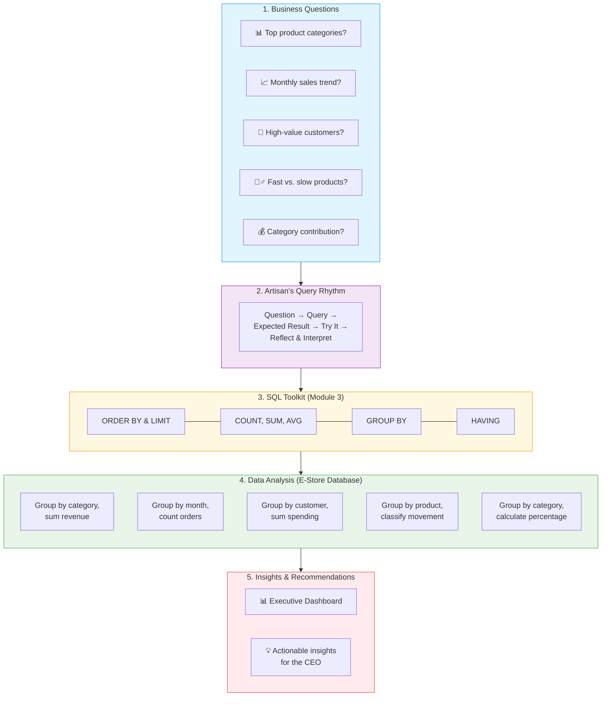

# 🗄️🤖 SQL & GenAI Course
**🎯 Quality Education for Anyone, Anywhere, Anytime — 💫 with Comfort, Convenience at no Cost**

---
## 📊 Module 3: CEO Report – E‑Commerce Analytics Dashboard 


### 🎯 Your Mission

You have mastered the art of **sorting, aggregating, grouping, and filtering groups**. Now it's time to prove your skills to a **CEO** – the leader of the **E‑Store** (our practice database). Your task is to build an analytics dashboard that answers the most pressing business questions using only the tools you've learned in Module 3.

This report is your **second professional portfolio piece**. It demonstrates that you can turn raw data into actionable insights using `ORDER BY`, `LIMIT`, `COUNT`, `SUM`, `AVG`, `GROUP BY`, and `HAVING` – all without needing to join tables (that's Module 4). You'll work within the capabilities of a single table at a time, using manual correlation where necessary.

> 📊 **Behind Every Dashboard, There's SQL**  
> The charts, tables, and insights in a CEO dashboard don't magically appear – they are powered by the queries you write. Every `SUM`, `GROUP BY`, and `ORDER BY` is the engine that drives real‑world business decisions. This report shows you how to build that engine.

---

## 🌌 SQLVerse Check-In

<div style="border-left: 4px solid #ff9800; background-color: #fff8e1; padding: 15px; margin: 20px 0; border-radius: 0 8px 8px 0;">

**You are now on E‑Commerce Planet.** The CEO doesn't care about your SQL syntax – they care about answers. Your job is to turn questions like *"Which products are selling fastest?"* and *"What's our order trend?"* into clear, compelling insights.

Use the **E‑Store database** (`level1_estore_basic.db`) as your source of truth. All the tools you need are in your hands.

**The difference between a coder and an Artisan is discipline.** Show the CEO that you are an Artisan.

</div>

---

### 📍 Your Current Stage – PRACTICE Journey


You've completed all five concept files. Now it's time to enter the **PRACTICE stage** of Module 3. Your first challenge: create a professional CEO Report.

---

## 🔧 Enhanced Browser Office for PRACTICE

**🚀 Kickstart: Any Computer, Any Browser, Anytime.**  
**🌍 Destination: Any country, Any city, Any Platform.**

| Tab | Purpose | What to Do |
| :--- | :--- | :--- |
| **1: The Map** | Reference materials | • Keep your **[Module 3 Reference Guide](./module3-reference.md)** handy.<br>• Complete the report challenges below. |
| **2: The Factory** | Run queries | Switch to the **E‑Store database**: **[`level1_estore_basic.db`](../../../Resources/sample_databases/level1_estore_basic.db)**. Run every query. |
| **3: The Consultant** | Conceptual Q&A | If stuck, follow the **3‑Attempt Rule**. Ask for conceptual hints, not code. Configure with **[Student Mode Prompt](../../../STUDENT_MODE_PROMPT_LEVEL1.md)**. |
| **4: The Vault** | Save your work | Save each successful query in your Vault at: `Learning/Level-1-beginner/Level1-1-ACQUIRE/Module3-Sort-Aggregate-Group/2-practiceExercises/` (and the report in `Projects/Level-1-beginner/CEO SUITE/MODULE3/`). |

---

### 🛠️ Module 3 Toolkit

🚀 Foundation First, AI Next, Projects Last.  
💎 Gemstone by Gemstone, Skill by Skill.

| | | | |
|---|---|---|---|
| **Browser Office** | 🔧 [Troubleshooting Common Issues](../../../Setup/STEP1_COMMISSION_BROWSER_OFFICE.md) | 🔄 [Browser Office Workflow](../../../Setup/STEP2_ESTABLISH_LEARNING_RITUAL.md) | ⌨️ [Tab Operations & Shortcuts](../../../Setup/STEP3_MASTER_TAB_OPERATIONS.md) |
| **ACQUIRE Section** | 🗄️ [Database Ecosystem](../../Guides/Section1-ACQUIRE/2_Database_Ecosystem.md) | 📚 [Knowledge Base (Vault)](../../Guides/Section1-ACQUIRE/3_Knowledge_Base.md) | 🧠 [Mindset Tuning](../../Guides/Section1-ACQUIRE/4_Mindset.md) |

---

## 📋 Report Structure

Your report will be a markdown file (`.md`) saved in your **CEO SUITE** folder under `Projects/Level-1-beginner/CEO SUITE/MODULE3/`. Use the filename `ecommerce-analytics-report.md`. You will also save each individual query as a `.sql` file in the `queries/` subfolder.

### Recommended Folder Layout
```
Projects/Level-1-beginner/CEO SUITE/
└── MODULE3/
    ├── ecommerce-analytics-report.md   # Your full report with insights
    └── queries/                         # Individual SQL files
        ├── 1-order-trend.sql
        ├── 2-top-products.sql
        ├── 3-category-summary.sql
        ├── 4-price-distribution.sql
        └── 5-high-volume-orders.sql
```

---

## 🧠 Business Questions to Answer

The CEO has asked for insights on five key areas. For each, you must:
1. Write the SQL query.
2. Run it in your Factory (Tab 2) using the E‑Store database.
3. Document the result and, most importantly, **interpret** what it means for the business.

Use the **Artisan's Query Rhythm** throughout:
- **The Question** – what are we trying to find?
- **The Query** – your SQL code.
- **The Result** – paste the output.
- **The Interpretation** – what does this tell the CEO?

---

---

### 1. 📈 Order Trend by Month

The CEO wants to understand how the number of orders has changed over time. Use the `orders` table to count orders per month (using `strftime('%Y-%m', order_date)`) and sort chronologically.

**Deliverable:**
- Query showing month and order count, sorted by month.
- A short interpretation: Are orders increasing? Which month had the most orders?

**Save query as:** `queries/1-order-trend.sql`

---

### 2. 🏆 Top Products by Quantity Sold

The CEO wants to know which products are most popular. Use the `order_items` table to sum the quantity sold for each `product_id`. Then find the top 3 product IDs by total quantity.

*Since product names are in a separate table, you can list the product IDs and later look up the names in the `products` table (manually).*

**Deliverable:**
- Query showing `product_id` and total quantity sold, sorted descending, limited to top 3.
- A short interpretation: Which product IDs are the best sellers? (After running the query, look at the `products` table to find the product names for those IDs.)

**Save query as:** `queries/2-top-products.sql`

---

### 3. 📦 Category Summary

The CEO wants a quick reference of product categories and how many products each category contains. Use the `products` table to count products per category.

**Deliverable:**
- Query showing category and product count, sorted by count descending.
- A short interpretation: Which category has the most products? Does that match what you'd expect?

**Save query as:** `queries/3-category-summary.sql`

---

### 4. 💰 Price Distribution

The CEO wants to understand pricing: what is the average, minimum, and maximum price of products in each category? Use the `products` table and aggregate functions with `GROUP BY`.

**Deliverable:**
- Query showing category, average price, minimum price, maximum price.
- A short interpretation: Which category has the highest average price? Are there any outliers?

**Save query as:** `queries/4-price-distribution.sql`

---

### 5. 🛒 High‑Volume Orders

The CEO wants to know which orders had the highest total quantity of items. Use the `order_items` table to sum the quantity per `order_id`, then find the top 3 orders by total quantity.

**Deliverable:**
- Query showing `order_id` and total quantity, sorted descending, limited to top 3.
- A short interpretation: Which orders were the largest? (You can later cross‑reference with the `orders` table to see who placed them.)

**Save query as:** `queries/5-high-volume-orders.sql`

---

## 📝 Writing Your Report

In `ecommerce-analytics-report.md`, structure your report like this:

```markdown
# E‑Store Analytics Dashboard – CEO Report (Module 3)

## Executive Summary
[One paragraph summarizing key findings]

## 1. Order Trend by Month
**Question:** ...
**Query:** 
```sql
...
```
**Result:**
| Month | Order Count |
|-------|-------------|
| ...   | ...         |
**Interpretation:** ...

[Repeat for each of the 5 questions]

## Conclusion
Summarize the key insights from each section and provide actionable recommendations for the CEO. For example:

- **Order trend:** Orders peaked in October; consider running a promotion during slower months.
- **Top products:** Product IDs 1 and 4 are best sellers; ensure adequate stock.
- **Category summary:** Electronics has the most products, but also the highest average price.
- **High‑volume orders:** Order IDs X and Y are largest; maybe these are business accounts worth nurturing.

[Add your own insights based on your query results.]
```

Use clear language. Remember, the CEO may not be technical – explain what the numbers mean for the business.

---

## 🚀 Submitting Your Work

1. Create the folder structure under your `Projects/Level-1-beginner/CEO SUITE/MODULE3/` as shown.
2. Save the markdown report and all query files.
3. Commit and push to your Vault (GitHub).
4. **Celebrate!** You have just produced a professional‑grade analytics report that a CEO would actually read.

```
---
## 💎 DESIGNER'S PERIGON

<div style="border: 3px solid #9c27b0; border-radius: 10px; padding: 20px; margin: 25px 0; background: linear-gradient(135deg, #f3e5f5 0%, #e1bee7 100%);">

### 🔮 A Look Ahead: Module 4 – From Manual to Production

In this report, you performed manual correlation: you looked up product names from the `products` table after getting product IDs, and you **mentally matched** categories. This is how analysts often start—but it's not **scalable**. 

Since we have just a handful of products, this approach is fine. But in the real world, you'll encounter **thousands** of products and categories, and **handling them manually becomes impossible**. This exercise is designed to give you a taste of **Analytics** and help you understand how analytics works under the hood—so you'll truly appreciate the **power of joins** when we automate it in Module 4.

In **Module 4**, you'll learn **JOINs** and **Normalization**. You'll redesign the database with a proper `categories` table and write queries that automatically connect `orders`, `order_items`, `products`, and `categories` in a single step. **No more manual lookups.** That's the power of a properly normalized relational database.

You'll revisit this same E‑Store case study with **production‑level SQL**—and see how much easier and more powerful your queries become.

---

## 🧠 The Artisan's Truth

> *"The CEO Report shows what you can do. It proves you can answer business questions with data. But the real magic is in the **interpretation** – turning numbers into stories that drive action."*

> *"Every query you wrote here is a conversation with the business. Now go and make the CEO proud."*

</div>
---

## 🧭 Practice Navigation


| Previous Step | Next Step |
|:---:|:---:|
| [← Back to File 5: Execution Order](../1-sqlCommands/5-execution-order.md) | [Continue to CTO Report →](./MODULE3-CTO-REPORT.md) |

---

*Part of our mission for 🎯 Quality Education for Anyone, Anywhere, Anytime — 💫 with Comfort, Convenience at no Cost.*

**Level 1 | Module 3 | CEO Report | Next: [CTO Report](./MODULE3-CTO-REPORT.md)**