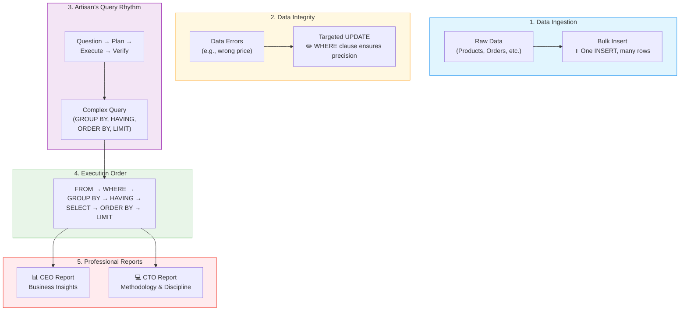

# 🗄️🤖 SQL & GenAI Course
**🎯 Quality Education for Anyone, Anywhere, Anytime — 💫 with Comfort, Convenience at no Cost**

## 💻 Module 3: CTO Report – Methodology & Discipline


### 🎯 Your Mission

You have mastered the technical skills of sorting, aggregation, grouping, and filtering groups. Now it's time to demonstrate your **methodology** – the disciplined process behind your work. This report is addressed to a **Chief Technology Officer (CTO)** who wants to know not just what you built, but **how you think**, how you approach problems, and how you ensure your work is reliable, repeatable, and production‑ready.

The **CTO Report** is the ultimate proof of **"Technical Hygiene."** While the CEO wants the answers, the CTO wants to know if the "Code Factory" is safe, efficient, and disciplined. Your task is to document your technical workflow, prove your mastery of data modification (Bulk Inserts & Updates), and demonstrate your understanding of the **Hidden Choreography** (Execution Order).

This is your third professional portfolio piece (after Module 2's CEO Report and Module 3's CEO Report). It proves that you are not just a coder, but a **Data Artisan** who follows a disciplined, reflective process.

---

## 🌌 SQLVerse Check-In

<div style="border-left: 4px solid #9c27b0; background-color: #f3e5f5; padding: 15px; margin: 20px 0; border-radius: 0 8px 8px 0;">

**You are now documenting your journey across the SQLVerse.** The CTO values clarity, safety, and repeatability. Your report will show that you understand the hidden choreography of SQL, that you can handle real‑world data modifications safely, and that you learn from every struggle.

**The difference between a coder and an Artisan is discipline.** Show the CTO that you are an Artisan.

</div>

---

### 📍 Your Current Stage – PRACTICE Journey


You've completed the CEO Report. Now it's time to reflect on your process and document your disciplined approach.

---

## 🔧 Enhanced Browser Office for PRACTICE

**🚀 Kickstart: Any Computer, Any Browser, Anytime.**  
**🌍 Destination: Any country, Any city, Any Platform.**

| Tab | Purpose | What to Do |
| :--- | :--- | :--- |
| **1: The Map** | Reference materials | • Keep your **[Module 3 Reference Guide](./module3-reference.md)** handy.<br>• Complete the report sections below. |
| **2: The Factory** | Run queries | Keep the E‑Store database (`level1_estore_basic.db`) loaded if needed for examples. |
| **3: The Consultant** | Conceptual Q&A | If stuck, follow the **3‑Attempt Rule**. Ask for conceptual hints, not code. Configure with **[Student Mode Prompt](../../../STUDENT_MODE_PROMPT_LEVEL1.md)**. |
| **4: The Vault** | Save your work | Save your report and evidence files in `Projects/Level-1-beginner/CTO SUITE/MODULE3/`. |

---

### 🛠️ Module 3 Toolkit

🚀 Foundation First, AI Next, Projects Last.  
💎 Gemstone by Gemstone, Skill by Skill.

| | | | |
|---|---|---|---|
| **Browser Office** | 🔧 [Troubleshooting Common Issues](../../../Setup/STEP1_COMMISSION_BROWSER_OFFICE.md) | 🔄 [Browser Office Workflow](../../../Setup/STEP2_ESTABLISH_LEARNING_RITUAL.md) | ⌨️ [Tab Operations & Shortcuts](../../../Setup/STEP3_MASTER_TAB_OPERATIONS.md) |
| **ACQUIRE Section** | 🗄️ [Database Ecosystem](../../Guides/Section1-ACQUIRE/2_Database_Ecosystem.md) | 📚 [Knowledge Base (Vault)](../../Guides/Section1-ACQUIRE/3_Knowledge_Base.md) | 🧠 [Mindset Tuning](../../Guides/Section1-ACQUIRE/4_Mindset.md) |

---

## 🔧 The CTO's Evaluation Criteria

In the **Architect's Ledger**, we measure a developer by three pillars:

1. **Precision:** Can you update data without breaking the whole table?
2. **Efficiency:** Can you insert data in bulk rather than one‑by‑one?
3. **Methodology:** Do you follow a rhythm, or do you work in chaos?

Your report will provide evidence for each of these pillars through three specific technical challenges.



---

## 📋 Report Structure

Your report will be a markdown file saved in your **CTO SUITE** folder under `Projects/Level-1-beginner/CTO SUITE/MODULE3/`. Use the filename **`cto-methodology-report.md`**. You will also create an `evidence/` subfolder to store supporting SQL files and notes.

### Recommended Folder Layout
```
Projects/Level-1-beginner/CTO SUITE/
└── MODULE3/
    ├── cto-methodology-report.md          # Your full report with reflections
    └── evidence/                          # Supporting artifacts
        ├── bulk-insert-example.sql        # Your bulk insert query
        ├── update-example.sql             # Your UPDATE query (with WHERE)
        └── query-trace.md                 # Step‑by‑step execution order trace
```

---

## 🧠 Technical Challenges to Document

For your report, you must provide evidence for the following three technical milestones.

---

### 1. ➕ The Efficiency Proof: Bulk Insert

The CTO noticed we have three new products arriving at the E‑Store. Instead of three separate commands, show a bulk insert query.

- **Task:** Add a Laptop, a Smartphone, and a Tablet in a single `INSERT` statement.
- **Evidence:** The query and a screenshot or copy of the output showing the “rows affected” message.

Save this as `evidence/bulk-insert-example.sql`.

---

### 2. ✏️ The Precision Proof: Targeted UPDATE

We had a pricing error! The “Headphones” price needs to be updated from $50 to $55.

- **Task:** Write a precision `UPDATE` command using a `WHERE` clause to ensure *only* the headphones are changed.
- **Risk Check:** Explain what would happen if you forgot the `WHERE` clause (the “Database Nightmare” scenario).

Save this as `evidence/update-example.sql`.

---

### 3. 🎵 The Rhythm Proof: Query Trace

Pick your most complex query from the **CEO Report**. Walk the CTO through its **Execution Order**.

- **Task:** List which clause the database ran 1st, 2nd, 3rd, etc.
- **Insight:** Explain why you chose a specific order for your `GROUP BY` and `HAVING` clauses based on the **Hidden Choreography**.

Save this as `evidence/query-trace.md`.

---

## 📝 Report Template

Use the following template to structure your `cto-methodology-report.md` file. Fill in your own details and remove the placeholder text.

```markdown
# E‑Store Technical Report – CTO Submission

## 🛡️ Artisan’s Statement of Discipline
"I do not just write queries; I conduct them. Every command follows the Artisan's Query Rhythm: Question, Plan, Execute, Verify."

```
---

## 1. Data Ingestion (Bulk Insert)
**Scenario:** Adding new inventory.
**Query:**
```sql
-- Your Bulk Insert Query here
```
**Verification:** [Paste the output showing rows affected]

---

## 2. Data Integrity (Targeted Update)
**Scenario:** Correcting pricing errors.
**Query:**
```sql
-- Your Update Query here
```
**Architect's Note:** I used the [Column Name] in the WHERE clause to prevent “Global Overwrite,” ensuring 100% data integrity.

---

## 3. Logic Trace (Execution Order)
**Query Analyzed:** [Paste your chosen query]

**The Choreography:**
1. **FROM:** [Explain]
2. **WHERE:** [Explain]
3. **GROUP BY:** [Explain]
4. **HAVING:** [Explain]
5. **SELECT:** [Explain]
6. **ORDER BY:** [Explain]
7. **LIMIT:** [Explain]

**Insight:** [Why did you structure your GROUP BY and HAVING the way you did? How did understanding execution order help?]

---
```
## 🚀 Submitting Your Work

1. Create the folder structure under `Projects/Level-1-beginner/CTO SUITE/MODULE3/` as shown.
2. Save `cto-methodology-report.md` and all evidence files.
3. Commit and push to your Vault (GitHub).
4. **Celebrate!** You have just produced a professional‑grade methodology report that proves your disciplined approach.

```
---
## 💎 DESIGNER'S PERIGON

<div style="border: 3px solid #9c27b0; border-radius: 10px; padding: 20px; margin: 25px 0; background: linear-gradient(135deg, #f3e5f5 0%, #e1bee7 100%);">

### 🔮 Key Takeaways & Future Application

Reflect on what you've accomplished and how it prepares you for what's next:

- **Bulk Insert** taught you that one efficient command beats many repetitive ones – a principle you'll use throughout your career.
- **Targeted UPDATE** showed that precision is protection; forgetting a `WHERE` clause is a lesson you'll never forget.
- **Query Tracing** revealed that writing SQL is like choreography – understanding the order of execution gives you complete control.

**In Module 4**, you'll apply this discipline to Joining Tables, where you'll combine data from multiple sources. The same rhythm – Question, Plan, Execute, Verify – will guide you. The same care for precision will protect your data. The same curiosity about execution order will help you debug complex queries.

You're not just learning syntax. You're building a **professional mindset** that scales with every new concept.

**The SQLVerse expands. Your skills expand with it.**

### 🔮 A Look Ahead: From "One‑Off" to "Production‑Ready"

In this CTO Report, you practiced **Technical Hygiene** – bulk inserts, targeted updates, and tracing the Hidden Choreography of SQL. This is the foundation of **Database Administration (DBA)** and **Data Engineering**.

Currently, you are the safety net: you run commands manually in the Factory, double‑checking every `WHERE` clause. As you move into Module 4 and beyond, you'll learn to build that safety into the database itself with **Scalable Integrity**:

1. **Transactions** – Wrap updates so that if one step fails, the entire operation rolls back, preventing half‑broken data.
2. **Constraints** – Teach the database to reject invalid changes (e.g., a price less than zero) automatically.
3. **Automation** – Embed your precise logic into applications that run 24/7, no human watching the screen.

These concepts turn your manual discipline into automated trust. The art of writing precise, safe SQL becomes the art of building systems that enforce those rules at scale.

<div style="border-left: 4px solid #9c27b0; background-color: #f3e5f5; padding: 15px; margin: 20px 0; border-radius: 0 8px 8px 0;">

### 🎨 Visualizing the Engineering Mindset

Think of the database as a **high‑speed train**.

- **The CEO** wants to know: *“Did the train arrive on time?”*  
  *(Did we get the answers? Did revenue meet targets?)*

- **The CTO** wants to know: *“Were the tracks inspected? Were the brakes tested before every single trip?”*  
  *(Was the data modified safely? Did we follow the right order of operations? Is the system reliable for the long haul?)*

- **The CFO** wants to know: *“What did the track inspection and brake testing cost? Could we have prevented a derailment more cheaply?”*  
  *(Are we building efficient queries? Did we avoid expensive mistakes that waste resources? Is our discipline saving money in the long run?)*

As an Artisan, you must satisfy **all three**. The CEO pays for results. The CTO pays for reliability. The CFO pays for efficiency and risk prevention.  In this report, we focused on the CTO's perspective – reliability. In Module 4, you'll learn how to satisfy the CFO by building cost‑effective, scalable systems.

</div>
---


## 🧠 The Artisan's Truth

> *"The CTO Report shows **how you think**. It proves that you don't just write queries – you design systems, you follow discipline, and you learn from every mistake."*

> *"The CEO pays for the **Results**. The CTO pays for **Reliability**. The CFO pays for **Efficiency**. Anyone can write a query that works once. An Artisan writes a reliable query that works forever, safely, even when they aren't in the room."*

> *"To be a master of the **SQLVerse**, you must satisfy all three. This report is your testament to reliability. In Module 4, you'll learn to add efficiency to your craft."*

> *"Your Logic Trace isn't just a homework assignment; it's a **flight manual** for your data. Understand the choreography, and you own the stage."*

> *"A sloppy insert is a future bug. A disciplined update is a signature of quality."*

</div>
---
## 🎉 Milestone Achieved!

**Congratulations!** You've now completed **both** professional‑grade reports – the CEO Report (business insights) and the CTO Report (methodology & discipline). This is a major milestone in your SQLVerse journey.

- ✅ You translated business questions into data insights.
- ✅ You demonstrated disciplined methodology and technical hygiene.
- ✅ You added two powerful artifacts to your GitHub portfolio.

These reports aren't just practice – they're **portfolio gold**. Take a moment to appreciate how far you've come. Then, with fresh energy, step into the **Practice Exercises** to sharpen your skills for the final quiz.

**The SQLVerse is yours to shape. Keep going! 🚀**

---

## 🧭 Practice Navigation


| Previous Step | Next Step |
|:---:|:---:|
| [← Back to CEO Report](./MODULE3-CEO-REPORT.md) | [Continue to Practice Exercise 1 →](./1-sorting-basics.md) |

---

*Part of our mission for 🎯 Quality Education for Anyone, Anywhere, Anytime — 💫 with Comfort, Convenience at no Cost.*

**Level 1 | Module 3 | CTO Report | Next: [Practice Exercises](./1-sorting-basics.md)**