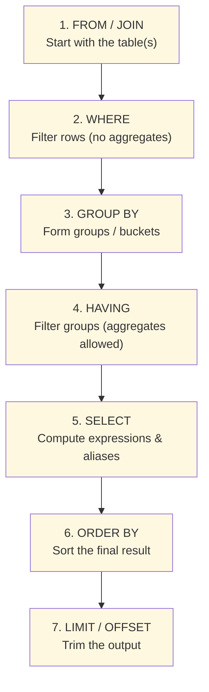
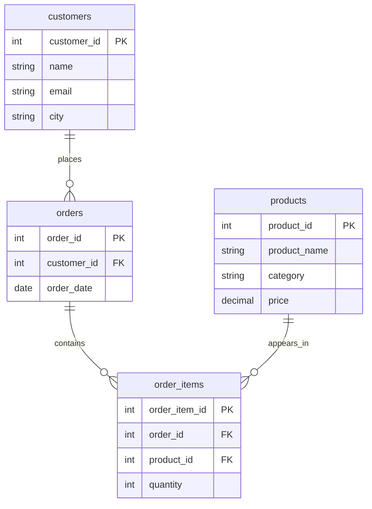

# 🗄️🤖 SQL & GenAI Course
**🎯 Quality Education for Anyone, Anywhere, Anytime — 💫 with Comfort, Convenience at no Cost**

## 📘 Module 3: SQL Reference for Practice – Sorting, Aggregation, Grouping

### Your Module 3 Mastery Report

This document is the **distilled essence** of everything you've mastered in the **PREPARE** stage of Module 3. It's your official Data Artisan's reference – a tool you'll return to again and again during practice, whether you're building CEO dashboards or documenting your disciplined process.

---
## 🌌 SQLVerse Check-In

<div style="border-left: 4px solid #9c27b0; background-color: #f3e5f5; padding: 15px; margin: 20px 0; border-radius: 0 8px 8px 0;">

**The laws of the SQLVerse are no longer mysteries to you. You have the keys.** You've journeyed across Education Planet, tested your skills on E‑Commerce Planet, and glimpsed the human stories on HR Planet. Now you're ready to organize, summarize, and uncover patterns that drive business decisions.

This reference guide is your **field manual** – the collected wisdom of sorting, measuring, bucketing, and choreographing data. Keep it close as you venture into the PRACTICE stage and beyond.

**The difference between a coder and an Artisan is discipline.**

</div>

---

## 🧭 Your Journey from Files 1–5

```mermaid
flowchart LR
    subgraph PREPARE ["PREPARE Stage (Files 1-5)"]
        direction LR
        F1["📘 File 1<br/>ORDER BY & LIMIT"] --> F2
        F2["📘 File 2<br/>Aggregate Functions"] --> F3
        F3["📘 File 3<br/>GROUP BY"] --> F4
        F4["📘 File 4<br/>HAVING"] --> F5
        F5["📘 File 5<br/>Execution Order"]
    end
    
    PREPARE --> BONUS["✨ Bonus Skills<br/>Bulk Insert, UPDATE, Query Rhythm"]
    BONUS --> REPORTS["📊 CEO & CTO Reports"]
    REPORTS --> MASTERY["🎓 MODULE 3 MASTERY"]
    
    style F1 fill:#e1f5fe
    style F2 fill:#e1f5fe
    style F3 fill:#e1f5fe
    style F4 fill:#e1f5fe
    style F5 fill:#e1f5fe
    style BONUS fill:#fff8e1
    style REPORTS fill:#c8e6c9
    style MASTERY fill:#a5d6a7,stroke:#2e7d32,stroke-width:3px
```



---

## 🧠 True Execution Order – How SQL Really Thinks



**💡 Artisan's Insight:** You write `SELECT` first, but the database thinks in this order. This explains why you can't use aliases in `WHERE` or `HAVING` – they don't exist yet! Aliases are only created in the `SELECT` step, which is why they work in `ORDER BY`.

---

## 🏛️ The E‑Store Schema – Your Practice World

### Tables at a Glance *(2 sample rows shown per table)*

---

#### **`customers`** – Who shops with us
| customer_id | name | email | city |
|-------------|------|-------|------|
| 1 | Alice Smith | alice@email.com | New York |
| 2 | Bob Johnson | bob@email.com | Chicago |

*(The full table contains 5 customers.)*

---

#### **`products`** – What we sell
| product_id | product_name | category | price |
|------------|--------------|----------|-------|
| 1 | Laptop | Electronics | 1200.00 |
| 2 | Coffee Maker | Appliances | 80.00 |

*(The full table contains 5 products.)*

---

#### **`orders`** – When they bought
| order_id | customer_id | order_date |
|----------|-------------|------------|
| 1 | 1 | 2025-10-01 |
| 2 | 2 | 2025-10-01 |

*(The full table contains 5 orders.)*

---

#### **`order_items`** – What they bought, how many
| order_item_id | order_id | product_id | quantity |
|---------------|----------|------------|----------|
| 1 | 1 | 1 | 1 |
| 2 | 1 | 3 | 1 |

*(The full table contains 6 order items.)*

---

### 🔗 Entity Relationship Diagram



**Relationships Explained:**
- A customer can place **many orders** (one‑to‑many)
- An order can contain **many products** (many‑to‑many via `order_items`)
- A product can appear in **many orders** (many‑to‑many via `order_items`)

---

## 📑 **Module 3 Quick Reference**

### **1. Sorting & Limiting: ORDER BY & LIMIT**

*Organizing results and controlling the number of rows.*

| Clause | Purpose | Example |
|--------|---------|---------|
| `ORDER BY column ASC` | Sorts ascending (A–Z, smallest to largest) | `ORDER BY name` |
| `ORDER BY column DESC` | Sorts descending (Z–A, largest to smallest) | `ORDER BY price DESC` |
| `ORDER BY col1, col2` | Sorts by multiple columns | `ORDER BY category, price` |
| `LIMIT n` | Returns only the first n rows | `LIMIT 5` |
| `LIMIT n OFFSET m` | Skips m rows, then returns n rows | `LIMIT 5 OFFSET 5` (page 2) |

**💡 Artisan's Insight:** Always pair `LIMIT` with `ORDER BY` for meaningful "top‑N" reports.

---

### **2. Aggregate Functions: Measuring the Data**

| Function | Purpose | Example |
|----------|---------|---------|
| `COUNT(*)` | Number of rows | `COUNT(*)` |
| `COUNT(column)` | Number of non‑NULL values | `COUNT(city)` |
| `SUM(column)` | Total of values | `SUM(price)` |
| `AVG(column)` | Average of values | `AVG(price)` |
| `MIN(column)` | Smallest value | `MIN(price)` |
| `MAX(column)` | Largest value | `MAX(price)` |

**NULL handling:** All aggregates except `COUNT(*)` ignore NULLs.

---

### **3. Grouping: GROUP BY**

*Creating buckets for summary analysis.*

```sql
SELECT category, COUNT(*) AS number_of_products
FROM products
GROUP BY category;
```

**Rules:**
- Every column in `SELECT` that is **not** an aggregate must appear in `GROUP BY`.
- You can group by multiple columns for **sub‑segment** analysis:
  ```sql
  SELECT category, product_name, COUNT(*)
  FROM order_items
  JOIN products ON order_items.product_id = products.product_id
  GROUP BY category, product_name;
  ```

**Expressions in GROUP BY:** You can group by functions (e.g., `strftime('%Y-%m', order_date)`) or `CASE` statements.

---

### **4. Filtering Groups: HAVING**

*Filtering after aggregation – the "WHERE for groups".*

```sql
SELECT category, AVG(price) AS avg_price
FROM products
GROUP BY category
HAVING AVG(price) > 100;
```

| Clause | When It Runs | What It Filters | Can Use Aggregates? |
|--------|--------------|-----------------|---------------------|
| `WHERE` | Before grouping | Individual rows | ❌ No |
| `HAVING` | After grouping | Groups (buckets) | ✅ Yes |

**💡 Artisan's Insight:** `WHERE` removes unwanted rows *before* grouping; `HAVING` removes unwanted groups *after* grouping. Use both together for precision.

---

### **5. Execution Order: The Hidden Choreography**

The database processes your query in this order:

1. **FROM** – source tables
2. **WHERE** – filter rows
3. **GROUP BY** – create groups
4. **HAVING** – filter groups
5. **SELECT** – compute columns and aliases
6. **ORDER BY** – sort final result
7. **LIMIT** – limit output

**Alias Visibility:** Because `SELECT` runs late, aliases are not available in `WHERE` or `HAVING`, but they are available in `ORDER BY`.

---

### **✨ Bonus Skills**

| Skill | Purpose | Key Takeaway |
|-------|---------|--------------|
| **Bulk Insert** | Add multiple rows in one `INSERT` | `INSERT INTO table VALUES (row1), (row2), ...` |
| **UPDATE** | Modify existing data | Always use `WHERE`; test with `SELECT` first. |
| **Artisan's Query Rhythm** | Disciplined practice | Question → Query → Expected Result → Try It → Reflect & Learn |

---

## 🛡️ Guardrail Summary: Common Module 3 Pitfalls

| Rule | Reminder |
|------|----------|
| **The Golden Rule** | Every column in `SELECT` must be either aggregated or in `GROUP BY`. |
| **WHERE vs HAVING** | Use `WHERE` for rows, `HAVING` for groups. |
| **Alias Visibility** | Aliases are created in `SELECT`, so they cannot be used in `WHERE` or `HAVING`. |
| **Order of Execution** | Write `SELECT` first, but the database thinks differently. Trace your query step by step. |
| **NULLs in Aggregates** | Aggregates (except `COUNT(*)`) ignore NULLs – be mindful of missing data. |

---


## 🚀 Transition to PRACTICE

The **PREPARE** stage gave you the tools: sorting, measuring, grouping, filtering groups, and understanding the choreography. Now, you step into the **PRACTICE** stage, where you'll apply these tools to real business problems.

**But this time, there’s a twist.**  
Unlike Modules 1 and 2, your PRACTICE journey in Module 3 has two distinct parts:

1. **Standard Exercises** – Sharpen your skills with targeted drills (the same style you've mastered before).
2. **🎯 Capstone Reports** – Create two professional portfolio pieces:
   - **📊 CEO Report (E‑Commerce Analytics)** – Turn business questions into actionable insights for leadership.
   - **💻 CTO Report (Methodology & Discipline)** – Document your disciplined workflow, bonus skills, and execution order mastery.

These reports aren't just exercises – they are **evidence of your growth**. They show that you can not only execute SQL but also communicate insights and reflect on your own process.

---

<div style="border: 2px solid #ff9800; border-radius: 10px; padding: 15px; margin: 20px 0; background: #fff8e1;">

### 🎯 Your Mission in PRACTICE

| Component | What You'll Do | Why It Matters |
|-----------|----------------|----------------|
| **Standard Exercises** | Complete hands‑on drills on sorting, aggregation, grouping, and `HAVING`. | Builds muscle memory and reinforces every concept. |
| **CEO Report** | Analyze the E‑Store database to answer executive‑level business questions. | Proves you can translate business needs into data insights – a core skill for any analyst. |
| **CTO Report** | Document your learning journey, bonus skills, and your understanding of execution order. | Demonstrates your disciplined approach, making you ready for production environments. |

</div>

Before you dive in, review this reference guide. It's your compass as you navigate the PRACTICE stage, tackle the exercises, and craft your capstone reports.

Your portfolio awaits. 🚀

---

## 💎 DESIGNER'S PERIGON

<div style="border: 3px solid #9c27b0; border-radius: 10px; padding: 20px; margin: 25px 0; background: linear-gradient(135deg, #f3e5f5 0%, #e1bee7 100%);">

### *The Art of Organizing, Measuring, and Telling Stories*

You've moved from finding data to arranging it. The collector is becoming an artisan, one sorted query at a time.

In the **SQLVerse**, data is a garden with all types of flowers.  
- **ORDER BY** lets you choose the color scheme and which flowers to feature.  
- **Aggregate functions** count the blooms, measure their height, and find the brightest petals.  
- **GROUP BY** trims the stems, gathering similar flowers into elegant bundles.  
- **HAVING** removes the leaves and thorns – the distractions that don't belong.  
- **LIMIT** arranges your flowers from the center out and secures them with floral tape and wrapping.  
- **Execution order** is the choreography that makes the arrangement possible.

You are now ready to create **two bouquets** – one for the CEO (business insights) and one for the CTO (your disciplined process). Each tells a different story, but both are crafted with the same Artisan's care.

---

### 🏆 Your Module 3 Mastery Report

This document is **your official certification** that you have mastered the skills of sorting, aggregation, grouping, group filtering, and execution order. These concepts are not just academic exercises – they are the tools used daily by data professionals to:

- 📊 **Create executive dashboards** that reveal revenue trends and top performers
- 🏭 **Optimize operations** by identifying slow‑moving products and high‑demand categories
- 🧠 **Drive strategy** with data‑backed insights that separate signal from noise
- 🎯 **Design analytics workflows** that are disciplined, reproducible, and trustworthy

You have progressed from a learner to a **Data Artisan**. The queries you can now write are the same ones used by analysts, data scientists, and database administrators in corporations worldwide to answer the hardest business questions.

**This is your Module 3 Mastery Report – a document of professional caliber, certifying that you command the language of data with precision, clarity, and purpose.**

---

### 🧠 The Artisan's Truth

> *"A single number can hold the story of thousands. COUNT tells you the size; SUM tells you the weight; AVG tells you the center. Learn to read these numbers, and you'll never see data the same way again."*

> *"GROUP BY creates the stage. HAVING chooses which actors get a spotlight. Execution order is the choreography that makes the performance seamless."*

> *"The SQLVerse is vast, but you now carry its map. Education, E‑Commerce, HR, Fintech – every planet follows the same laws. Go forth and explore."*

</div>

---

*Part of our mission for 🎯 Quality Education for Anyone, Anywhere, Anytime — 💫 with Comfort, Convenience at no Cost.*

**Level 1 | Module 3 | Reference Guide**