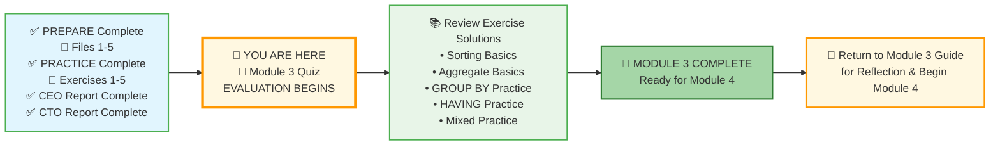

# 🗄️🤖 SQL & GenAI Course
**🎯 Quality Education for Anyone, Anywhere, Anytime — 💫 with Comfort, Convenience at no Cost**

## 📝 Module 3 Quiz: Sorting, Aggregation, Grouping, and Group Filtering

Welcome to the **EVALUATE** stage! This quiz will help you confirm that you've mastered all the SQL concepts from Module 3. Take your time – it's not timed, and there's no pressure. The goal is to identify any areas you might want to review before moving on to Module 4.

---

### 📍 Your Current Stage



### 📋 Complete Journey at a Glance

| Stage | Status | What's Included |
|-------|--------|-----------------|
| **Start** | ✅ Complete | PREPARE (Files 1-5) + PRACTICE (Exercises 1-5) |
| **A** | 🔄 Current | Module 3 Quiz – EVALUATION begins |
| **B** | ⏳ Next | Review all 5 exercise solutions |
| **C** | 🎉 Goal | Module 3 Complete – Ready for Module 4 |
| **D** | 🔙 Final | Return to Guide for reflection |

You've completed all preparation and practice. Now you begin the **EVALUATE** stage. After the quiz, you'll check your answers, review exercise solutions, and celebrate your Module 3 completion.

---

## 🌌 SQLVerse Check-In

<div style="border-left: 4px solid #9c27b0; background-color: #f3e5f5; padding: 15px; margin: 20px 0; border-radius: 0 8px 8px 0;">

**You've journeyed across E‑Commerce Planet, mastered sorting, measuring, bucketing, and filtering groups, and built your second portfolio piece.** This quiz isn't a test – it's a celebration of how far you've come.

The SQLVerse is waiting. Your portfolio is calling.

**The difference between a coder and an Artisan is discipline.**

</div>

---

### 🧭 Your Evaluation Path


### 📋 Evaluation Steps Explained

| Step | Action | Purpose |
|------|--------|---------|
| **1** | Take the Module 3 Quiz | Test your understanding of all concepts |
| **2** | Review Exercise Solutions | Compare your practice work with expert solutions |
| **3** | Check Quiz Answers | Verify your quiz responses and learn from explanations |
| **4** | Module 3 Complete | Celebrate your achievement! |
| **5** | Return to Guide | Reflect and prepare for Module 4 |

---

## 📋 Part 1: Multiple Choice (10 Questions)

*Choose the best answer for each question.*

---

**1. Which clause is used to sort the result set?**  
a) `GROUP BY`  
b) `ORDER BY`  
c) `SORT BY`  
d) `HAVING`

---

**2. What does `LIMIT 5 OFFSET 10` do?**  
a) Returns rows 1–5  
b) Returns rows 6–10  
c) Returns rows 11–15  
d) Returns rows 1–10

---

**3. Which of the following aggregate functions ignores NULL values?**  
a) `COUNT(*)`  
b) `COUNT(column)`  
c) `SUM(column)`  
d) Both b and c

---

**4. You want to filter groups based on an aggregate condition. Which clause should you use?**  
a) `WHERE`  
b) `GROUP BY`  
c) `HAVING`  
d) `ORDER BY`

---

**5. What is the correct logical execution order of the following clauses?**  
a) `FROM → WHERE → GROUP BY → HAVING → SELECT → ORDER BY → LIMIT`  
b) `SELECT → FROM → WHERE → GROUP BY → HAVING → ORDER BY → LIMIT`  
c) `FROM → WHERE → GROUP BY → HAVING → ORDER BY → SELECT → LIMIT`  
d) `FROM → GROUP BY → WHERE → HAVING → SELECT → ORDER BY → LIMIT`

---

**6. Which of the following is a valid use of a column alias?**  
a) `WHERE balance > 100` after `SELECT ... AS balance`  
b) `ORDER BY balance` after `SELECT ... AS balance`  
c) `GROUP BY balance` after `SELECT ... AS balance`  
d) `HAVING balance > 100` after `SELECT ... AS balance`

---

**7. What will `SELECT category, COUNT(*) FROM products GROUP BY category;` return?**  
a) One row per category with the number of products in that category  
b) One row with the total number of products  
c) An error because category is not aggregated  
d) The list of categories with no counts

---

**8. If you want to find the average price of products only in the 'Electronics' category, which clause should you use to filter?**  
a) `HAVING`  
b) `WHERE`  
c) `GROUP BY`  
d) `ORDER BY`

---

**9. In SQLite, which function would you use to extract the year from a date?**  
a) `EXTRACT(YEAR FROM order_date)`  
b) `YEAR(order_date)`  
c) `strftime('%Y', order_date)`  
d) `DATE_PART('year', order_date)`

---

**10. What does the following query return?**  
`SELECT category, AVG(price) FROM products GROUP BY category HAVING AVG(price) > 100;`  
a) All categories with an average price greater than 100  
b) All categories with a price greater than 100  
c) All products with price greater than 100, grouped by category  
d) An error because `HAVING` cannot use aggregates

---

## 📝 Part 2: Write the Query (5 Questions)

*Write a SQL query to answer each business question using the E‑Store database.*

---

**11. Question:** Find the **total number of products** in the `products` table. Alias the result as `total_products`.

```sql
-- Your query here
```

---

**12. Question:** List the **top 3 most expensive products**. Show `product_name` and `price`, sorted from highest to lowest.

```sql
-- Your query here
```

---

**13. Question:** For each product category, show the **average price**. Alias the average as `avg_price`.

```sql
-- Your query here
```

---

**14. Question:** Which product categories have **more than 2 products**? Show `category` and the number of products.

```sql
-- Your query here
```

---

**15. Question:** Find the **most expensive product** in each category. Show `category`, `product_name`, and `price`.  
*Hint: You'll need to use a subquery or a join. This is a preview of Module 4. Do your best!*

```sql
-- Your query here
```

---

## 🧠 Part 3: Conceptual Questions (5 Questions)

*Answer in 2–3 sentences.*

---

**16. Explain the difference between `WHERE` and `HAVING`. Give an example of when you would use each.**

---

**17. Why can't you use a column alias (e.g., `AS balance`) in the `WHERE` clause, but you can use it in `ORDER BY`? Refer to execution order.**

---

**18. What is the purpose of `GROUP BY`? Provide a real‑world business question that would require `GROUP BY`.**

---

**19. Describe the logical execution order of a SQL query. Why does understanding this order matter?**

---

**20. What does it mean to be a Data Artisan rather than just a coder? How has this mindset shaped your learning in Module 3?**

---

## ✅ When You're Done

1. Write your answers in a new file `module3-quiz-answers.md` inside your Vault at:
   ```
   Learning/Level-1-beginner/Level1-1-ACQUIRE/Module3-Sort-Aggregate-Group/3-quizCheckpoint/
   ```
2. Check your answers against the detailed solutions in the **[module3-quiz-answers.md](../4-exerciseAndQuizSolutions/module3-quiz-answers.md)** file (located in the `4-exerciseAndQuizSolutions` folder). This file contains explanations for all quiz questions as well as sample answers for the exercises.
3. For any questions you missed, review the relevant concept file or practice exercise.
4. Once you're confident, celebrate – you've completed Module 3!

---

## 🧭 Evaluation Navigation


| Previous Step | Next Step |
|:---:|:---:|
| [← Back to Module 3 Guide](../MODULE3_GUIDE.md) | [Continue to Exercise 1 Solutions →](../../4-exerciseAndQuizSolutions/1-sorting-basics-solutions.md) |

---

*Part of our mission for 🎯 Quality Education for Anyone, Anywhere, Anytime — 💫 with Comfort, Convenience at no Cost.*

**Level 1 | Module 3 | SQL Quiz | Next: [Exercise 1 Solutions](../../4-exerciseAndQuizSolutions/1-sorting-basics-solutions.md)**