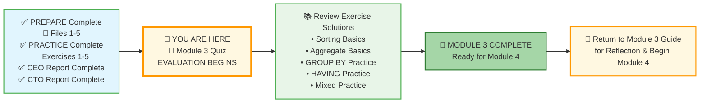
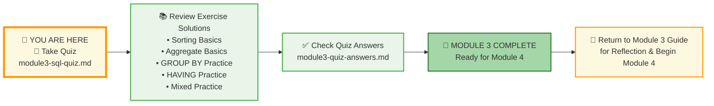

# 🗄️🤖 SQL & GenAI Course
**🎯 Quality Education for Anyone, Anywhere, Anytime — 💫 with Comfort, Convenience at no Cost**

## 📝 Module 3 Quiz: Sorting, Aggregation, Grouping, and Group Filtering

Welcome to the **EVALUATE** stage! This quiz will help you confirm that you've mastered all the SQL concepts from Module 3. Take your time – it's not timed, and there's no pressure. The goal is to identify any areas you might want to review before moving on to Module 4.

---

### 📍 Your Current Stage



### 📋 Complete Journey at a Glance

| Stage | Status | What's Included |
|-------|--------|-----------------|
| **Start** | ✅ Complete | PREPARE (Files 1-5) + PRACTICE (Exercises 1-5) + CEO & CTO Reports |
| **A** | 🔄 Current | Module 3 Quiz – EVALUATION begins |
| **B** | ⏳ Next | Review all 5 exercise solutions |
| **C** | 🎉 Goal | Module 3 Complete – Ready for Module 4 |
| **D** | 🔙 Final | Return to Guide for reflection |

You've completed all preparation and practice, and you've built two portfolio‑worthy reports. Now you begin the **EVALUATE** stage. After the quiz, you'll check your answers, review exercise solutions, and celebrate your Module 3 completion.

---

## 🌌 SQLVerse Check-In

<div style="border-left: 4px solid #9c27b0; background-color: #f3e5f5; padding: 15px; margin: 20px 0; border-radius: 0 8px 8px 0;">

**You've journeyed across E‑Commerce Planet, mastered sorting, measuring, bucketing, and filtering groups, and built your second portfolio piece.** This quiz isn't a test – it's a celebration of how far you've come.

The quiz focuses on the **Choreography of SQL**—knowing which tool to use and in what order – **The Data Analyst Checkpoint**.

The SQLVerse is waiting. Your portfolio is calling.

**The difference between a coder and an Artisan is discipline.**

</div>

---

### 🧭 Your Evaluation Path



### 📋 Evaluation Steps Explained

| Step | Action | Purpose |
|------|--------|---------|
| **1** | Take the Module 3 Quiz | Test your understanding of all concepts |
| **2** | Review Exercise Solutions | Compare your practice work with expert solutions |
| **3** | Check Quiz Answers | Verify your quiz responses and learn from explanations |
| **4** | Module 3 Complete | Celebrate your achievement! |
| **5** | Return to Guide | Reflect and prepare for Module 4 |

---

## 📋 Quiz

### Section 1: The Logical Flow (Conceptual)

**Q1. The Sequence of Power**  
In what order does a database actually process these clauses?  
- A) `SELECT` → `FROM` → `WHERE` → `GROUP BY`  
- B) `FROM` → `WHERE` → `GROUP BY` → `HAVING` → `SELECT`  
- C) `SELECT` → `GROUP BY` → `HAVING` → `WHERE`

---

**Q2. The "Where vs. Having" Trap**  
You want to see only the cities that have more than 5 customers. Which clause is responsible for this filter?  
- A) `WHERE`  
- B) `FILTER BY`  
- C) `HAVING`

---

### Section 2: Syntax & Troubleshooting (Technical)

**Q3. Spot the Error**  
Why will the following query fail?

```sql
SELECT city, COUNT(*) 
FROM customers 
WHERE COUNT(*) > 2 
GROUP BY city;
```
- A) You cannot use `COUNT(*)` in the `SELECT` clause.  
- B) You cannot use an aggregate function like `COUNT(*)` in the `WHERE` clause.  
- C) The `GROUP BY` must come before the `WHERE`.

---

**Q4. The Non‑Aggregated Column Rule**  
If your query is `SELECT category, AVG(price), status FROM products GROUP BY category`, what is wrong with it?  
- A) `AVG(price)` cannot be used with `category`.  
- B) `status` is not inside an aggregate function and is missing from the `GROUP BY` clause.  
- C) You cannot group by `category`.

---

### Section 3: The Artisan’s Challenge (Applied)

**Q5. Translate the Business Request**  
"Find the top 3 product categories by average price, but only for categories that have at least 5 products."  
Which query correctly answers this?  

- A) `SELECT category, AVG(price) FROM products HAVING COUNT(*) >= 5 ORDER BY AVG(price) DESC LIMIT 3;`  
- B) `SELECT category, AVG(price) FROM products GROUP BY category HAVING COUNT(*) >= 5 ORDER BY AVG(price) DESC LIMIT 3;`  
- C) `SELECT category, AVG(price) FROM products WHERE COUNT(*) >= 5 GROUP BY category LIMIT 3;`

---

### Section 4: Write the Query (5 Questions)

*Write a SQL query to answer each business question using the E‑Store database.*

---

**Q6. Total Products**  
Find the **total number of products** in the `products` table. Alias the result as `total_products`.

```sql
-- Your query here
```

---

**Q7. Top 3 Most Expensive Products**  
List the **top 3 most expensive products**. Show `product_name` and `price`, sorted from highest to lowest.

```sql
-- Your query here
```

---

**Q8. Average Price per Category**  
For each product category, show the **average price**. Alias the average as `avg_price`.

```sql
-- Your query here
```

---

**Q9. Categories with More Than 2 Products**  
Which product categories have **more than 2 products**? Show `category` and the number of products.

```sql
-- Your query here
```

---

**Q10. Most Expensive Product per Category (Preview)**  
Find the **most expensive product** in each category. Show `category`, `product_name`, and `price`.  
*Hint: You'll need to use a subquery or a join. This is a preview of Module 4. Do your best!*

```sql
-- Your query here
```

---

### Section 5: Conceptual Questions (5 Questions)

*Answer in 2–3 sentences.*

---

**Q11.** Explain the difference between `WHERE` and `HAVING`. Give an example of when you would use each.

---

**Q12.** Why can't you use a column alias (e.g., `AS balance`) in the `WHERE` clause, but you can use it in `ORDER BY`? Refer to execution order.

---

**Q13.** What is the purpose of `GROUP BY`? Provide a real‑world business question that would require `GROUP BY`.

---

**Q14.** Describe the logical execution order of a SQL query. Why does understanding this order matter?

---

**Q15.** What does it mean to be a Data Artisan rather than just a coder? How has this mindset shaped your learning in Module 3?

---

## ✅ When You're Done

1. Write your answers in a new file `module3-quiz-answers.md` inside your Vault at:
   ```
   Learning/Level-1-beginner/Level1-1-ACQUIRE/Module3-Sort-Aggregate-Group/3-quizCheckpoint/
   ```
2. Check your answers against the detailed solutions in the **[module3-quiz-answers.md](../4-exerciseAndQuizSolutions/module3-quiz-answers.md)** file (located in the `4-exerciseAndQuizSolutions` folder). This file contains explanations for all quiz questions as well as sample answers for the exercises.
3. For any questions you missed, review the relevant concept file or practice exercise.
4. Once you're confident, celebrate – you've completed Module 3!

---

## 🧭 Evaluation Navigation


| Previous Step | Next Step |
|:---:|:---:|
| [← Back to Module 3 Guide](../MODULE3_GUIDE.md) | [Continue to Exercise 1 Solutions →](../../4-exerciseAndQuizSolutions/1-sorting-basics-solutions.md) |

---

*Part of our mission for 🎯 Quality Education for Anyone, Anywhere, Anytime — 💫 with Comfort, Convenience at no Cost.*

**Level 1 | Module 3 | SQL Quiz | Next: [Exercise 1 Solutions](../../4-exerciseAndQuizSolutions/1-sorting-basics-solutions.md)**


