# 🗄️🤖 SQL & GenAI Course
**🎯 Quality Education for Anyone, Anywhere, Anytime — 💫 with Comfort, Convenience at no Cost**

## 🧠 Exercise 1: Sorting Basics – Solutions
This document contains the solutions for all challenges in **Exercise 1: Sorting Basics**. Use it to check your work, understand alternative approaches, and reinforce your learning.

---

## 🌌 SQLVerse Check-In

<div style="border-left: 4px solid #9c27b0; background-color: #f3e5f5; padding: 15px; margin: 20px 0; border-radius: 0 8px 8px 0;">

**The laws of the SQLVerse are no longer mysteries to you. You have the keys.** You've mastered sorting and limiting on E‑Commerce Planet. Now check your solutions and see the Artisan's approach.

**The difference between a coder and an Artisan is discipline.**

</div>

---

### 📍 Your Current Stage

```mermaid
flowchart LR
    Quiz["✅ Quiz Complete<br/>📝 Module 3 Quiz"] --> Ex1
    Ex1["📍 YOU ARE HERE<br/>📖 Exercise 1 Solutions<br/>Sorting Basics"] --> Ex2
    Ex2["⏳ Exercise 2 Solutions<br/>Aggregate Basics"] --> Ex3
    Ex3["⏳ Exercise 3 Solutions<br/>GROUP BY Practice"] --> Ex4
    Ex4["⏳ Exercise 4 Solutions<br/>HAVING Practice"] --> Ex5
    Ex5["⏳ Exercise 5 Solutions<br/>Mixed Practice"] --> QuizAns
    QuizAns["⏳ Quiz Answers<br/>module3-quiz-answers.md"] --> Complete
    Complete["🎉 MODULE 3 COMPLETE<br/>Ready for Module 4"] --> Guide
    Guide["🔄 Return to Module 3 Guide<br/>for Reflection & Begin Module 4"]
    
    style Quiz fill:#e1f5fe,stroke:#4caf50,stroke-width:2px
    style Ex1 fill:#fff8e1,stroke:#ff9800,stroke-width:4px
    style Ex2 fill:#fff8e1,stroke:#ff9800,stroke-width:2px
    style Ex3 fill:#fff8e1,stroke:#ff9800,stroke-width:2px
    style Ex4 fill:#fff8e1,stroke:#ff9800,stroke-width:2px
    style Ex5 fill:#fff8e1,stroke:#ff9800,stroke-width:2px
    style QuizAns fill:#fff8e1,stroke:#ff9800,stroke-width:2px
    style Complete fill:#a5d6a7,stroke:#2e7d32,stroke-width:2px
    style Guide fill:#fff8e1,stroke:#ff9800,stroke-width:2px
```



---


### Challenge 1: Alphabetical Customers
```sql
SELECT name, email, city
FROM customers
ORDER BY name;
```
**Explanation:** Sorts customers by name in ascending order (A–Z). No `DESC` means ascending.

---

### Challenge 2: Newest Orders First
```sql
SELECT order_id, customer_id, order_date
FROM orders
ORDER BY order_date DESC
LIMIT 3;
```
**Explanation:** `ORDER BY order_date DESC` puts the most recent dates first; `LIMIT 3` keeps only the top three.

---

### Challenge 3: Top 3 Most Expensive Products
```sql
SELECT product_name, price
FROM products
ORDER BY price DESC
LIMIT 3;
```
**Explanation:** Sorts by price descending, then keeps the first three rows.

---

### Challenge 4: Pagination – Second Page of Customers
```sql
SELECT customer_id, name
FROM customers
ORDER BY customer_id
LIMIT 2 OFFSET 2;
```
**Explanation:** `ORDER BY customer_id` ensures a consistent order. `LIMIT 2 OFFSET 2` skips the first two rows (page 1) and returns the next two (page 2).

---

### Challenge 5: Sort by Multiple Columns
```sql
SELECT product_name, category, price
FROM products
ORDER BY category ASC, price DESC;
```
**Explanation:** First sorts by `category` alphabetically, then within each category sorts by `price` descending.

---

### Challenge 6: Sorting with an Alias
```sql
SELECT name AS customer_name, city
FROM customers
ORDER BY customer_name DESC;
```
**Explanation:** The alias `customer_name` is created in `SELECT` and then used in `ORDER BY`. This works because `ORDER BY` runs after `SELECT`.

---

### Challenge 7: Oldest Orders (Optional)
```sql
SELECT order_id, customer_id, order_date
FROM orders
ORDER BY order_date ASC, order_id ASC
LIMIT 2;
```
**Explanation:** Sorts by order date ascending (oldest first). If two orders share the same date, the one with the smaller `order_id` appears first. `LIMIT 2` returns the two oldest.


---
### 🧭 EVALUATE Navigation

```mermaid
flowchart LR
    Quiz["✅ Quiz Complete<br/>📝 Module 3 Quiz"] --> Ex1
    Ex1["✅ COMPLETED<br/>📖 Exercise 1 Solutions<br/>Sorting Basics"] --> Ex2
    Ex2["⏳ Exercise 2 Solutions<br/>Aggregate Basics"] --> Ex3
    Ex3["⏳ Exercise 3 Solutions<br/>GROUP BY Practice"] --> Ex4
    Ex4["⏳ Exercise 4 Solutions<br/>HAVING Practice"] --> Ex5
    Ex5["⏳ Exercise 5 Solutions<br/>Mixed Practice"] --> QuizAns
    QuizAns["⏳ Quiz Answers<br/>module3-quiz-answers.md"] --> Complete
    Complete["🎉 MODULE 3 COMPLETE<br/>Ready for Module 4"] --> Guide
    Guide["🔄 Return to Module 3 Guide<br/>for Reflection & Begin Module 4"]
    
    style Quiz fill:#e1f5fe,stroke:#4caf50,stroke-width:2px
    style Ex1 fill:#e1f5fe,stroke:#4caf50,stroke-width:4px
    style Ex2 fill:#fff8e1,stroke:#ff9800,stroke-width:2px
    style Ex3 fill:#fff8e1,stroke:#ff9800,stroke-width:2px
    style Ex4 fill:#fff8e1,stroke:#ff9800,stroke-width:2px
    style Ex5 fill:#fff8e1,stroke:#ff9800,stroke-width:2px
    style QuizAns fill:#fff8e1,stroke:#ff9800,stroke-width:2px
    style Complete fill:#a5d6a7,stroke:#2e7d32,stroke-width:2px
    style Guide fill:#fff8e1,stroke:#ff9800,stroke-width:2px
```



| Previous Step | Next Step |
|:---:|:---:|
| [← Back to Module 3 Guide](../MODULE3_GUIDE.md) | [Continue to Exercise 2 Solutions →](./2-aggregate-basics-solutions.md) |

