# 🗄️🤖 SQL & GenAI Course
**🎯 Quality Education for Anyone, Anywhere, Anytime — 💫 with Comfort, Convenience at no Cost**

## 🧠 Exercise 2: Aggregate Basics – Solutions
This document contains the solutions for all challenges in **Exercise 2: Aggregate Basics**. Use it to check your work, understand alternative approaches, and reinforce your learning.

---

## 🌌 SQLVerse Check-In

<div style="border-left: 4px solid #9c27b0; background-color: #f3e5f5; padding: 15px; margin: 20px 0; border-radius: 0 8px 8px 0;">

**The laws of the SQLVerse are no longer mysteries to you. You have the keys.** You've mastered aggregate functions on E‑Commerce Planet. Now check your solutions and see the Artisan's approach.

**The difference between a coder and an Artisan is discipline.**

</div>

---

### 📍 Your Current Stage

```mermaid
flowchart LR
    Quiz["✅ Quiz Complete<br/>📝 Module 3 Quiz"] --> Ex1
    Ex1["✅ Exercise 1 Solutions<br/>Sorting Basics"] --> Ex2
    Ex2["📍 YOU ARE HERE<br/>📖 Exercise 2 Solutions<br/>Aggregate Basics"] --> Ex3
    Ex3["⏳ Exercise 3 Solutions<br/>GROUP BY Practice"] --> Ex4
    Ex4["⏳ Exercise 4 Solutions<br/>HAVING Practice"] --> Ex5
    Ex5["⏳ Exercise 5 Solutions<br/>Mixed Practice"] --> QuizAns
    QuizAns["⏳ Quiz Answers<br/>module3-quiz-answers.md"] --> Complete
    Complete["🎉 MODULE 3 COMPLETE<br/>Ready for Module 4"] --> Guide
    Guide["🔄 Return to Module 3 Guide<br/>for Reflection & Begin Module 4"]
    
    style Quiz fill:#e1f5fe,stroke:#4caf50,stroke-width:2px
    style Ex1 fill:#e1f5fe,stroke:#4caf50,stroke-width:4px
    style Ex2 fill:#fff8e1,stroke:#ff9800,stroke-width:4px
    style Ex3 fill:#fff8e1,stroke:#ff9800,stroke-width:2px
    style Ex4 fill:#fff8e1,stroke:#ff9800,stroke-width:2px
    style Ex5 fill:#fff8e1,stroke:#ff9800,stroke-width:2px
    style QuizAns fill:#fff8e1,stroke:#ff9800,stroke-width:2px
    style Complete fill:#a5d6a7,stroke:#2e7d32,stroke-width:2px
    style Guide fill:#fff8e1,stroke:#ff9800,stroke-width:2px
```


---

### A1: Total Products
```sql
SELECT COUNT(*) AS total_products
FROM products;
```
**Explanation:** `COUNT(*)` counts all rows in the `products` table.

---

### A2: Price Range
```sql
SELECT MIN(price) AS cheapest, MAX(price) AS most_expensive
FROM products;
```
**Explanation:** `MIN` returns the lowest price; `MAX` returns the highest.

---

### A3: Average Price
```sql
SELECT AVG(price) AS avg_price
FROM products;
```
**Explanation:** `AVG` calculates the mean of the `price` column.

---

### B4: Total Units Sold
```sql
SELECT SUM(quantity) AS total_units
FROM order_items;
```
**Explanation:** `SUM` adds up all `quantity` values in the `order_items` table.

---

### C5: Electronics Average
```sql
SELECT AVG(price)
FROM products
WHERE category = 'Electronics';
```
**Explanation:** `WHERE` filters rows before the aggregate, so `AVG` only applies to products in the 'Electronics' category.

---

### C6: Product 1 Quantity
```sql
SELECT SUM(quantity)
FROM order_items
WHERE product_id = 1;
```
**Explanation:** Sums the quantities for product ID 1.

---

### D7: Total Customers
```sql
SELECT COUNT(*) AS total_customers
FROM customers;
```
**Explanation:** Counts all rows in the `customers` table.

---

### D8: NY Customers
```sql
SELECT COUNT(*)
FROM customers
WHERE city = 'New York';
```
**Explanation:** Counts only customers whose city is 'New York'.

---

### E9: Total Orders
```sql
SELECT COUNT(*) AS total_orders
FROM orders;
```
**Explanation:** Counts all rows in the `orders` table.

---

### E10: Total Order Items
```sql
SELECT COUNT(*) AS total_order_items
FROM order_items;
```
**Explanation:** Counts all rows in the `order_items` table.

---
### 🧭 EVALUATE Navigation

```mermaid
flowchart LR
    Quiz["✅ Quiz Complete<br/>📝 Module 3 Quiz"] --> Ex1
    Ex1["✅ COMPLETED<br/>📖 Exercise 1 Solutions<br/>Sorting Basics"] --> Ex2
    Ex2["✅ COMPLETED<br/>📖 Exercise 2 Solutions<br/>Aggregate Basics"] --> Ex3
    Ex3["⏳ Exercise 3 Solutions<br/>GROUP BY Practice"] --> Ex4
    Ex4["⏳ Exercise 4 Solutions<br/>HAVING Practice"] --> Ex5
    Ex5["⏳ Exercise 5 Solutions<br/>Mixed Practice"] --> QuizAns
    QuizAns["⏳ Quiz Answers<br/>module3-quiz-answers.md"] --> Complete
    Complete["🎉 MODULE 3 COMPLETE<br/>Ready for Module 4"] --> Guide
    Guide["🔄 Return to Module 3 Guide<br/>for Reflection & Begin Module 4"]
    
    style Quiz fill:#e1f5fe,stroke:#4caf50,stroke-width:2px
    style Ex1 fill:#e1f5fe,stroke:#4caf50,stroke-width:4px
    style Ex2 fill:#e1f5fe,stroke:#4caf50,stroke-width:4px
    style Ex3 fill:#fff8e1,stroke:#ff9800,stroke-width:2px
    style Ex4 fill:#fff8e1,stroke:#ff9800,stroke-width:2px
    style Ex5 fill:#fff8e1,stroke:#ff9800,stroke-width:2px
    style QuizAns fill:#fff8e1,stroke:#ff9800,stroke-width:2px
    style Complete fill:#a5d6a7,stroke:#2e7d32,stroke-width:2px
    style Guide fill:#fff8e1,stroke:#ff9800,stroke-width:2px
```



| Previous Step | Next Step |
|:---:|:---:|
| [← Back to Exercise 1 Solutions](./1-sorting-basics-solutions.md) | [Continue to Exercise 3 Solutions →](./3-group-by-practice-solutions.md) |