# 🗄️🤖 SQL & GenAI Course
**🎯 Quality Education for Anyone, Anywhere, Anytime — 💫 with Comfort, Convenience at no Cost**

## 🧠 Exercise 4: HAVING Practice – Solutions
This document contains the solutions for all challenges in **Exercise 4: HAVING Practice**. Use it to check your work, understand alternative approaches, and reinforce your learning.

---

## 🌌 SQLVerse Check-In

<div style="border-left: 4px solid #9c27b0; background-color: #f3e5f5; padding: 15px; margin: 20px 0; border-radius: 0 8px 8px 0;">

**The laws of the SQLVerse are no longer mysteries to you. You have the keys.** You've mastered filtering groups on E‑Commerce Planet. Now check your solutions and see the Artisan's approach.

**The difference between a coder and an Artisan is discipline.**

</div>

---

### 📍 Your Current Stage

```mermaid
flowchart LR
    Quiz["✅ Quiz Complete<br/>📝 Module 3 Quiz"] --> Ex1
    Ex1["✅ Exercise 1 Solutions<br/>Sorting Basics"] --> Ex2
    Ex2["✅ Exercise 2 Solutions<br/>Aggregate Basics"] --> Ex3
    Ex3["✅ Exercise 3 Solutions<br/>GROUP BY Practice"] --> Ex4
    Ex4["📍 YOU ARE HERE<br/>📖 Exercise 4 Solutions<br/>HAVING Practice"] --> Ex5
    Ex5["⏳ Exercise 5 Solutions<br/>Mixed Practice"] --> QuizAns
    QuizAns["⏳ Quiz Answers<br/>module3-quiz-answers.md"] --> Complete
    Complete["🎉 MODULE 3 COMPLETE<br/>Ready for Module 4"] --> Guide
    Guide["🔄 Return to Module 3 Guide<br/>for Reflection & Begin Module 4"]
    
    style Quiz fill:#e1f5fe,stroke:#4caf50,stroke-width:2px
    style Ex1 fill:#e1f5fe,stroke:#4caf50,stroke-width:4px
    style Ex2 fill:#e1f5fe,stroke:#4caf50,stroke-width:4px
    style Ex3 fill:#e1f5fe,stroke:#4caf50,stroke-width:4px
    style Ex4 fill:#fff8e1,stroke:#ff9800,stroke-width:4px
    style Ex5 fill:#fff8e1,stroke:#ff9800,stroke-width:2px
    style QuizAns fill:#fff8e1,stroke:#ff9800,stroke-width:2px
    style Complete fill:#a5d6a7,stroke:#2e7d32,stroke-width:2px
    style Guide fill:#fff8e1,stroke:#ff9800,stroke-width:2px
```



---

### A1: Categories > 2 Products
```sql
SELECT category, COUNT(*) AS product_count
FROM products
GROUP BY category
HAVING COUNT(*) > 2;
```
**Explanation:** Groups by category, counts products, then keeps only groups with more than 2.

---

### A2: Categories Avg Price > 100
```sql
SELECT category, AVG(price) AS avg_price
FROM products
GROUP BY category
HAVING AVG(price) > 100;
```
**Explanation:** Groups by category, calculates average price, then filters for groups where the average exceeds 100.

---

### B3: Customers > 1 Order
```sql
SELECT customer_id, COUNT(*) AS order_count
FROM orders
GROUP BY customer_id
HAVING COUNT(*) > 1;
```
**Explanation:** Counts orders per customer, then keeps customers with more than one order.

---

### B4: Cities with Exactly 1 Customer
```sql
SELECT city, COUNT(*) AS customer_count
FROM customers
GROUP BY city
HAVING COUNT(*) = 1;
```
**Explanation:** Counts customers per city, keeps those with exactly one.

---

### C5: Products Sold > 5 Quantity
```sql
SELECT product_id, SUM(quantity) AS total_quantity
FROM order_items
GROUP BY product_id
HAVING SUM(quantity) > 5;
```
**Explanation:** Sums quantity per product, keeps products with total > 5.

---

### C6: Products Avg Quantity > 1
```sql
SELECT product_id, AVG(quantity) AS avg_quantity
FROM order_items
GROUP BY product_id
HAVING AVG(quantity) > 1;
```
**Explanation:** Averages quantity per order item for each product, keeps products where average > 1.

---

### D7: Categories Multi‑Condition
```sql
SELECT category, COUNT(*) AS product_count, AVG(price) AS avg_price
FROM products
GROUP BY category
HAVING COUNT(*) > 2 AND AVG(price) > 100;
```
**Explanation:** Groups by category, then applies both conditions on the groups.

---

### E8: NY Cities with Crowd
```sql
SELECT city, COUNT(*) AS customer_count
FROM customers
WHERE city LIKE 'N%'
GROUP BY city
HAVING COUNT(*) >= 2;
```
**Explanation:** First filters cities starting with 'N' (`WHERE`), then groups, then keeps those with at least 2 customers (`HAVING`). This combines row‑level and group‑level filters.

---

### E9: Orders with Quantity > 2
```sql
SELECT order_id, SUM(quantity) AS total_quantity
FROM order_items
GROUP BY order_id
HAVING SUM(quantity) > 2;
```
**Explanation:** Sums quantity per order, keeps orders with total > 2.


---
### 🧭 EVALUATE Navigation

```mermaid
flowchart LR
    Quiz["✅ Quiz Complete<br/>📝 Module 3 Quiz"] --> Ex1
    Ex1["✅ COMPLETED<br/>📖 Exercise 1 Solutions<br/>Sorting Basics"] --> Ex2
    Ex2["✅ COMPLETED<br/>📖 Exercise 2 Solutions<br/>Aggregate Basics"] --> Ex3
    Ex3["✅ COMPLETED<br/>📖 Exercise 3 Solutions<br/>GROUP BY Practice"] --> Ex4
    Ex4["✅ COMPLETED<br/>📖 Exercise 4 Solutions<br/>HAVING Practice"] --> Ex5
    Ex5["⏳ Exercise 5 Solutions<br/>Mixed Practice"] --> QuizAns
    QuizAns["⏳ Quiz Answers<br/>module3-quiz-answers.md"] --> Complete
    Complete["🎉 MODULE 3 COMPLETE<br/>Ready for Module 4"] --> Guide
    Guide["🔄 Return to Module 3 Guide<br/>for Reflection & Begin Module 4"]
    
    style Quiz fill:#e1f5fe,stroke:#4caf50,stroke-width:2px
    style Ex1 fill:#e1f5fe,stroke:#4caf50,stroke-width:4px
    style Ex2 fill:#e1f5fe,stroke:#4caf50,stroke-width:4px
    style Ex3 fill:#e1f5fe,stroke:#4caf50,stroke-width:4px
    style Ex4 fill:#e1f5fe,stroke:#4caf50,stroke-width:4px
    style Ex5 fill:#fff8e1,stroke:#ff9800,stroke-width:2px
    style QuizAns fill:#fff8e1,stroke:#ff9800,stroke-width:2px
    style Complete fill:#a5d6a7,stroke:#2e7d32,stroke-width:2px
    style Guide fill:#fff8e1,stroke:#ff9800,stroke-width:2px
```



| Previous Step | Next Step |
|:---:|:---:|
| [← Back to Exercise 3 Solutions](./3-group-by-practice-solutions.md) | [Continue to Exercise 5 Solutions →](./5-mixed-practice-solutions.md) |


