# 🗄️🤖 SQL & GenAI Course
**🎯 Quality Education for Anyone, Anywhere, Anytime — 💫 with Comfort, Convenience at no Cost**

## 🧠 Exercise 5: Mixed Practice – Solutions

This document contains the solutions for all challenges in **Exercise 5: Mixed Practice**. Use it to check your work, understand alternative approaches, and reinforce your learning.

---

## 🌌 SQLVerse Check-In

<div style="border-left: 4px solid #9c27b0; background-color: #f3e5f5; padding: 15px; margin: 20px 0; border-radius: 0 8px 8px 0;">

**The laws of the SQLVerse are no longer mysteries to you. You have the keys.** You've mastered mixed queries on E‑Commerce Planet. Now check your solutions and see the Artisan's approach.

**The difference between a coder and an Artisan is discipline.**

</div>

---

### 📍 Your Current Stage

```mermaid
flowchart LR
    Quiz["✅ Quiz Complete<br/>📝 Module 3 Quiz"] --> Ex1
    Ex1["✅ Exercise 1 Solutions<br/>Sorting Basics"] --> Ex2
    Ex2["✅ Exercise 2 Solutions<br/>Aggregate Basics"] --> Ex3
    Ex3["✅ Exercise 3 Solutions<br/>GROUP BY Practice"] --> Ex4
    Ex4["✅ Exercise 4 Solutions<br/>HAVING Practice"] --> Ex5
    Ex5["📍 YOU ARE HERE<br/>📖 Exercise 5 Solutions<br/>Mixed Practice"] --> QuizAns
    QuizAns["⏳ Quiz Answers<br/>module3-quiz-answers.md"] --> Complete
    Complete["🎉 MODULE 3 COMPLETE<br/>Ready for Module 4"] --> Guide
    Guide["🔄 Return to Module 3 Guide<br/>for Reflection & Begin Module 4"]
    
    style Quiz fill:#e1f5fe,stroke:#4caf50,stroke-width:2px
    style Ex1 fill:#e1f5fe,stroke:#4caf50,stroke-width:4px
    style Ex2 fill:#e1f5fe,stroke:#4caf50,stroke-width:4px
    style Ex3 fill:#e1f5fe,stroke:#4caf50,stroke-width:4px
    style Ex4 fill:#e1f5fe,stroke:#4caf50,stroke-width:4px
    style Ex5 fill:#fff8e1,stroke:#ff9800,stroke-width:4px
    style QuizAns fill:#fff8e1,stroke:#ff9800,stroke-width:2px
    style Complete fill:#a5d6a7,stroke:#2e7d32,stroke-width:2px
    style Guide fill:#fff8e1,stroke:#ff9800,stroke-width:2px
```


---

### 🥇 Challenge 1: The “High‑Velocity” Report
```sql
SELECT city, COUNT(*) AS customer_count
FROM customers
GROUP BY city
HAVING COUNT(*) >= 2
ORDER BY customer_count DESC
LIMIT 3;
```
**Explanation:** Groups by city, keeps cities with at least 2 customers, sorts descending, limits to top 3.

---

### 🥈 Challenge 2: The “Inventory Audit”
```sql
SELECT category, MAX(price) AS most_expensive
FROM products
GROUP BY category
HAVING MAX(price) > 500
ORDER BY category ASC;
```
**Explanation:** Groups by category, keeps those with max price > 500, then sorts alphabetically by category.

---

### 🥉 Challenge 3: The “Sales Performance” Snapshot
```sql
SELECT product_id, SUM(quantity) AS total_quantity
FROM order_items
GROUP BY product_id
HAVING SUM(quantity) > 3;
```
**Explanation:** Sums quantity per product, keeps products with total > 3.

---

### 📦 Challenge 4: The “Premium Shelf” Analysis
```sql
SELECT category, AVG(price) AS avg_price, COUNT(*) AS product_count
FROM products
GROUP BY category
HAVING AVG(price) > 100 AND COUNT(*) >= 2;
```
**Explanation:** Groups by category, then applies both conditions on the groups.

---

### 🧾 Challenge 5: The “Loyalty” Report (Customer‑ID Edition)
```sql
SELECT customer_id, COUNT(*) AS order_count
FROM orders
GROUP BY customer_id
HAVING COUNT(*) > 1
ORDER BY order_count DESC;
```
**Explanation:** Counts orders per customer, keeps those with >1, sorts descending.

---

### 🏙️ Challenge 6: The “Regional Density” Scorecard
```sql
SELECT city, COUNT(*) AS customer_count
FROM customers
GROUP BY city
HAVING COUNT(*) >= 2
ORDER BY customer_count DESC;
```
**Explanation:** Groups by city, keeps cities with at least 2 customers, sorts descending.

---

### 🗓️ Challenge 7: The “Peak Season” Analysis
```sql
SELECT strftime('%Y-%m', order_date) AS month, COUNT(*) AS order_count
FROM orders
GROUP BY month
ORDER BY order_count DESC
LIMIT 1;
```
**Explanation:** Extracts year‑month from order date, groups by month, counts orders, sorts descending, takes the top.

---

### 🛒 Challenge 8: The “Top Seller” Dashboard (Product Edition)
```sql
SELECT product_id, SUM(quantity) AS total_quantity
FROM order_items
GROUP BY product_id
ORDER BY total_quantity DESC
LIMIT 1;
```
**Explanation:** Sums quantity per product, sorts descending, takes the top product.

---

### 👑 Challenge 9: The “VIP” Leaderboard (Customer‑ID Edition)
```sql
SELECT customer_id, COUNT(*) AS order_count
FROM orders
GROUP BY customer_id
ORDER BY order_count DESC
LIMIT 1;
```
**Explanation:** Counts orders per customer, sorts descending, takes the top customer.

---

### 🏆 Challenge 10: The “Category Leaderboard”
```sql
SELECT category, COUNT(*) AS product_count
FROM products
GROUP BY category
ORDER BY product_count DESC
LIMIT 3;
```
**Explanation:** Counts products per category, sorts descending, takes top 3 categories.

---
### 🧭 EVALUATE Navigation

```mermaid
flowchart LR
    Quiz["✅ Quiz Complete<br/>📝 Module 3 Quiz"] --> Ex1
    Ex1["✅ COMPLETED<br/>📖 Exercise 1 Solutions<br/>Sorting Basics"] --> Ex2
    Ex2["✅ COMPLETED<br/>📖 Exercise 2 Solutions<br/>Aggregate Basics"] --> Ex3
    Ex3["✅ COMPLETED<br/>📖 Exercise 3 Solutions<br/>GROUP BY Practice"] --> Ex4
    Ex4["✅ COMPLETED<br/>📖 Exercise 4 Solutions<br/>HAVING Practice"] --> Ex5
    Ex5["✅ COMPLETED<br/>📖 Exercise 5 Solutions<br/>Mixed Practice"] --> QuizAns
    QuizAns["⏳ Quiz Answers<br/>module3-quiz-answers.md"] --> Complete
    Complete["🎉 MODULE 3 COMPLETE<br/>Ready for Module 4"] --> Guide
    Guide["🔄 Return to Module 3 Guide<br/>for Reflection & Begin Module 4"]
    
    style Quiz fill:#e1f5fe,stroke:#4caf50,stroke-width:2px
    style Ex1 fill:#e1f5fe,stroke:#4caf50,stroke-width:4px
    style Ex2 fill:#e1f5fe,stroke:#4caf50,stroke-width:4px
    style Ex3 fill:#e1f5fe,stroke:#4caf50,stroke-width:4px
    style Ex4 fill:#e1f5fe,stroke:#4caf50,stroke-width:4px
    style Ex5 fill:#e1f5fe,stroke:#4caf50,stroke-width:4px
    style QuizAns fill:#fff8e1,stroke:#ff9800,stroke-width:2px
    style Complete fill:#a5d6a7,stroke:#2e7d32,stroke-width:2px
    style Guide fill:#fff8e1,stroke:#ff9800,stroke-width:2px
```



| Previous Step | Next Step |
|:---:|:---:|
| [← Back to Exercise 4 Solutions](./4-having-practice-solutions.md) | [Continue to Quiz Answers →](./module3-quiz-answers.md) |

