# 🗄️🤖 SQL & GenAI Course
**🎯 Quality Education for Anyone, Anywhere, Anytime — 💫 with Comfort, Convenience at no Cost**

## 📘 Module 3 Quiz – Answers & Explanations

Welcome to the answer key for the Module 3 quiz. Use this to check your work and deepen your understanding. For each question, we provide the correct answer and a brief explanation.

---

## 🌌 SQLVerse Check-In

<div style="border-left: 4px solid #9c27b0; background-color: #f3e5f5; padding: 15px; margin: 20px 0; border-radius: 0 8px 8px 0;">

**The laws of the SQLVerse are no longer mysteries to you. You have the keys.** You've completed the quiz – now check your answers and see the Artisan's reasoning.

**The difference between a coder and an Artisan is discipline.**

</div>

---

### 📍 Your Current Stage


---

## Section 1: The Logical Flow (Conceptual)

### Q1. The Sequence of Power  
**Answer:** B) `FROM` → `WHERE` → `GROUP BY` → `HAVING` → `SELECT`

**Explanation:** This is the logical execution order. The database first identifies the table (`FROM`), then filters rows (`WHERE`), then forms groups (`GROUP BY`), then filters groups (`HAVING`), and finally selects the columns and computes expressions (`SELECT`). `ORDER BY` and `LIMIT` run after `SELECT`.

---

### Q2. The "Where vs. Having" Trap  
**Answer:** C) `HAVING`

**Explanation:** `HAVING` filters groups based on aggregate conditions (like `COUNT(*) > 5`). `WHERE` filters individual rows before grouping and cannot use aggregate functions.

---

## Section 2: Syntax & Troubleshooting (Technical)

### Q3. Spot the Error  
**Answer:** B) You cannot use an aggregate function like `COUNT(*)` in the `WHERE` clause.

**Explanation:** `WHERE` executes before grouping, so aggregates like `COUNT(*)` are not yet available. Aggregate conditions belong in `HAVING`.

---

### Q4. The Non‑Aggregated Column Rule  
**Answer:** B) `status` is not inside an aggregate function and is missing from the `GROUP BY` clause.

**Explanation:** In a `GROUP BY` query, every column in the `SELECT` list must either be part of the `GROUP BY` or be wrapped in an aggregate function. `status` violates this rule.

---

## Section 3: The Artisan’s Challenge (Applied)

### Q5. Translate the Business Request  
**Answer:** B) `SELECT category, AVG(price) FROM products GROUP BY category HAVING COUNT(*) >= 5 ORDER BY AVG(price) DESC LIMIT 3;`

**Explanation:** This query correctly groups by category, filters groups with `HAVING` to keep only those with at least 5 products, orders by average price descending, and limits to the top 3. Option A lacks `GROUP BY`, and Option C incorrectly uses `WHERE` with an aggregate.

---

## Section 4: Write the Query (5 Questions)

### Q6. Total Products  
**Answer:**
```sql
SELECT COUNT(*) AS total_products
FROM products;
```
**Explanation:** `COUNT(*)` counts all rows in the `products` table. The alias makes the output column clear.

---

### Q7. Top 3 Most Expensive Products  
**Answer:**
```sql
SELECT product_name, price
FROM products
ORDER BY price DESC
LIMIT 3;
```
**Explanation:** Sorts by price descending, then takes the first three rows.

---

### Q8. Average Price per Category  
**Answer:**
```sql
SELECT category, AVG(price) AS avg_price
FROM products
GROUP BY category;
```
**Explanation:** Groups by category and computes the average price for each group.

---

### Q9. Categories with More Than 2 Products  
**Answer:**
```sql
SELECT category, COUNT(*) AS product_count
FROM products
GROUP BY category
HAVING COUNT(*) > 2;
```
**Explanation:** Groups by category, counts products, then filters groups with `HAVING` to keep only those with more than 2.

---

### Q10. Most Expensive Product per Category (Preview)  
**Answer:** (Two approaches – a subquery or a self‑join. We show a subquery for preview.)

```sql
SELECT category, product_name, price
FROM products p1
WHERE price = (
    SELECT MAX(price)
    FROM products p2
    WHERE p2.category = p1.category
);
```
**Explanation:** For each product, the subquery finds the maximum price in its category. The outer query keeps only those products whose price equals that maximum. This is a preview of more advanced SQL (subqueries) that you'll learn in Module 4.

---

## Section 5: Conceptual Questions (5 Questions)

### Q11. Difference between `WHERE` and `HAVING`
**Answer:** `WHERE` filters individual rows **before** grouping; `HAVING` filters groups **after** grouping (using aggregate conditions).  
*Example:* Use `WHERE` to filter products with price > 100. Use `HAVING` to find categories with an average price > 100.

---

### Q12. Why aliases work in `ORDER BY` but not in `WHERE`
**Answer:** The logical execution order is `FROM` → `WHERE` → `GROUP BY` → `HAVING` → `SELECT` → `ORDER BY`. Aliases are created in the `SELECT` step, so they are not available to `WHERE` (which runs earlier) but are available to `ORDER BY` (which runs later).

---

### Q13. Purpose of `GROUP BY` and a real‑world example
**Answer:** `GROUP BY` organizes rows into buckets based on the values in one or more columns, allowing you to apply aggregate functions to each bucket.  
*Example:* “Show total sales per region” – group orders by region, then sum revenue.

---

### Q14. Logical execution order and why it matters
**Answer:** The order is: `FROM` → `WHERE` → `GROUP BY` → `HAVING` → `SELECT` → `ORDER BY` → `LIMIT`. Understanding this order helps you debug queries, know where you can use aliases, and decide whether to place a condition in `WHERE` or `HAVING`. It prevents errors and makes your queries more efficient.

---

### Q15. What it means to be a Data Artisan
**Answer:** A Data Artisan doesn’t just write syntax that works; they understand the *why* behind each clause, follow disciplined practices (like the Artisan’s Query Rhythm), and think about the business impact of their queries. This mindset turns code into insights and builds a professional portfolio, not just completed exercises.

---

## ✅ Next Steps

- Review any answers you missed and revisit the relevant concept files or practice exercises.
- Once confident, you are ready to move to **Module 4: Joining Tables**.

## 🎉 Congratulations!

You've completed the **EVALUATE** stage for Module 3. Your portfolio now includes:

- ✅ **CEO Report** – E‑Commerce Analytics Dashboard
- ✅ **CTO Report** – Methodology & Discipline
- ✅ All **practice exercises** and **quiz** with verified solutions

You are now ready to move on to **Module 4: Joining Tables**. The SQLVerse expands – go build the next layer of your skills!

Take a moment to celebrate for successfully completing Module 3! 🎉

---

### 🧭 EVALUATE Navigation

```mermaid
flowchart LR
    Quiz["✅ Quiz Complete<br/>📝 Module 3 Quiz"] --> Ex1
    Ex1["✅ COMPLETED<br/>📖 Exercise 1 Solutions<br/>Sorting Basics"] --> Ex2
    Ex2["✅ COMPLETED<br/>📖 Exercise 2 Solutions<br/>Aggregate Basics"] --> Ex3
    Ex3["✅ COMPLETED<br/>📖 Exercise 3 Solutions<br/>GROUP BY Practice"] --> Ex4
    Ex4["✅ COMPLETED<br/>📖 Exercise 4 Solutions<br/>HAVING Practice"] --> Ex5
    Ex5["✅ COMPLETED<br/>📖 Exercise 5 Solutions<br/>Mixed Practice"] --> QuizAns
    QuizAns["✅ COMPLETED<br/>📖 Quiz Answers<br/>module3-quiz-answers.md"] --> Complete
    Complete["🎉 MODULE 3 COMPLETE<br/>Ready for Module 4"] --> Guide
    Guide["🔄 Return to Module 3 Guide<br/>for Reflection & Begin Module 4"]
    
    style Quiz fill:#e1f5fe,stroke:#4caf50,stroke-width:2px
    style Ex1 fill:#e1f5fe,stroke:#4caf50,stroke-width:4px
    style Ex2 fill:#e1f5fe,stroke:#4caf50,stroke-width:4px
    style Ex3 fill:#e1f5fe,stroke:#4caf50,stroke-width:4px
    style Ex4 fill:#e1f5fe,stroke:#4caf50,stroke-width:4px
    style Ex5 fill:#e1f5fe,stroke:#4caf50,stroke-width:4px
    style QuizAns fill:#e1f5fe,stroke:#4caf50,stroke-width:4px
    style Complete fill:#a5d6a7,stroke:#2e7d32,stroke-width:2px
    style Guide fill:#fff8e1,stroke:#ff9800,stroke-width:2px
```



| Previous Step | Next Step |
|:---:|:---:|
| [← Back to Exercise 5 Solutions](./5-mixed-practice-solutions.md) | [Return to Module 3 Guide →](../MODULE3_GUIDE.md) |

*Part of our mission for 🎯 Quality Education for Anyone, Anywhere, Anytime — 💫 with Comfort, Convenience at no Cost.*

**Level 1 | Module 3 | Quiz Answers**