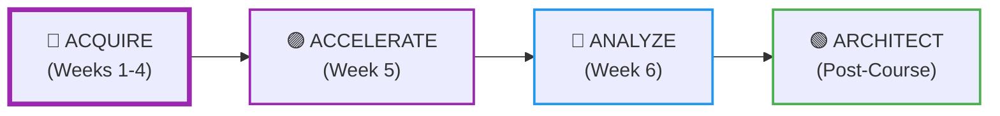
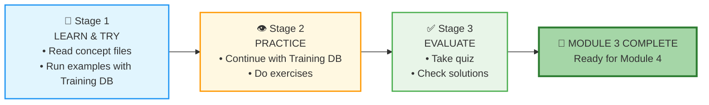
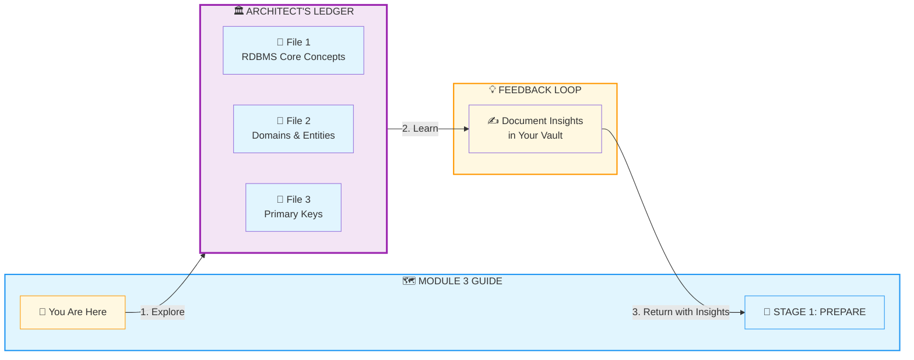
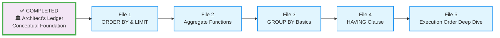
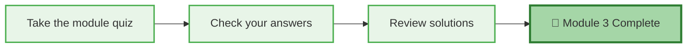
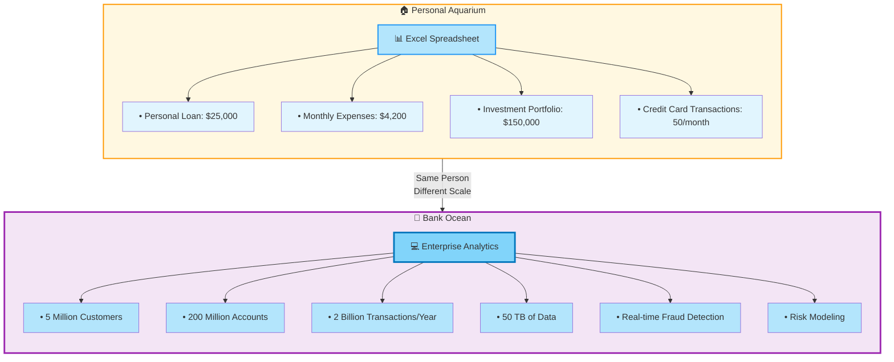

# 🗄️🤖 SQL & GenAI Course
**🎯 Quality Education for Anyone, Anywhere, Anytime — 💫 with Comfort, Convenience at no Cost**

## 🗺️ Module 3 Guide: Sorting, Aggregation & Grouping – The Comparator

Welcome to Module 3! You've mastered the art of retrieving and filtering data. Now it's time to organize, summarize, and discover patterns. In this guide, you'll follow the **PREPARE → PRACTICE → EVALUATE** rhythm to master sorting, aggregation, and grouping. By the end, you'll transform raw data into meaningful insights.

---

<div align="center" style="border: 2px solid #9c27b0; border-radius: 8px; padding: 15px; margin: 20px 0; background: #f3e5f5;">

### 📍 Your Position in the 4 A's Journey

| Phase | Current Module | AI Role |
|-------|----------------|---------|
| **🔴 ACQUIRE** (Weeks 1-4) | **Module 3: Sorting, Aggregation & Grouping** | **Conceptual Guide Only** |



**📍 You are here:** Module 3 of ACQUIRE – organizing and summarizing data.

</div>

---

## 🏢 **The Browser Office: Your Universal Launchpad**

**🚀 Kickstart: Any Computer, Any Browser, Anytime.**  
**🌍 Destination: Any country, Any city, Any Platform.**

### **📋 The Standard Four-Tab Setup (Levels 1 & 2)**
The Browser Office transforms any computer with a browser into a complete learning environment.

| Tab | Purpose | Tools & Examples | Description |
| :--- | :--- | :--- | :--- |
| **1: The Map** | Learning content & navigation | Course Repository (GitHub) | Your central hub for all course materials, module guides, and resources. |
| **2: The Factory** | Hands-on practice | SQLite Online | An online SQL environment where you'll run queries and experiment with databases. |
| **3: The Consultant** | AI assistance & explanations | ChatGPT, Claude, Gemini | Your AI learning partner, configured to provide conceptual guidance without writing code for you. |
| **4: The Vault** | Progress tracking & portfolio | GitHub Web, notes | Your personal GitHub repository where you'll store all your work, reflections, and completed exercises. |

> **Keyboard Shortcuts:** `Ctrl+1` / `Cmd+1` for Tab 1, `Ctrl+2` / `Cmd+2` for Tab 2, `Ctrl+3` / `Cmd+3` for Tab 3, `Ctrl+4` / `Cmd+4` for Tab 4.

---

### 🔧 **Need Help?**

| 🔧 Troubleshooting | 🔄 Workflow | ⌨️ Tab Operations |
| :---: | :---: | :---: |
| [Troubleshooting Common Issues](../../../Setup/STEP1_COMMISSION_BROWSER_OFFICE.md) | [Browser Office Workflow](../../../Setup/STEP2_ESTABLISH_LEARNING_RITUAL.md) | [Tab Operations & Shortcuts](../../../Setup/STEP3_MASTER_TAB_OPERATIONS.md) |

---

## 🏢 **Your Browser Office for Module 3 (Analytics Mode)**

🚀 Foundation First, AI Next, Projects Last.  
💎 Gemstone by Gemstone, Skill by Skill.

For this module, here's exactly how to use each tab:

| Tab | Purpose | What to Do |
| :--- | :--- | :--- |
| **1: The Map** | Read concept files | Work through `1-sqlCommands/` in order. |
| **2: The Factory** | Run queries | Keep **`training_institution_sample.db`** loaded throughout the module (learning and practice). |
| **3: The Consultant** | Conceptual Q&A only | Ask about sorting, aggregation, grouping, or why a query returns unexpected results. ❌ Never ask for full code. |
| **4: The Vault** | Save your queries | Save every successful query in the appropriate folder: `.../Module3/2-practiceExercises/` (or keep notes in `1-sqlCommands/`). |

---

<div style="border: 2px solid #f44336; border-radius: 10px; padding: 15px; margin: 20px 0; background: #ffebee;">

### 🔴 **Your ACQUIRE Foundation**

| 🗄️ Database Ecosystem | 📚 Knowledge Base | 🧠 Mindset Tuning |
| :---: | :---: | :---: |
| [Database Ecosystem](../../Guides/Section1-ACQUIRE/2_Database_Ecosystem.md) | [Knowledge Base (Vault)](../../Guides/Section1-ACQUIRE/3_Knowledge_Base.md) | [Mindset Tuning](../../Guides/Section1-ACQUIRE/4_Mindset.md) |

</div>

---

## 📚 **Deep Philosophy: From Collector to Analyst**

In Module 2, you learned to collect specific data points – like a detective gathering evidence. Now you'll learn to step back and see the bigger picture.

- **`ORDER BY`** lets you arrange evidence chronologically or by importance.
- **`COUNT`**, **`SUM`**, **`AVG`** let you measure the scene.
- **`GROUP BY`** is your **bucketing tool** – it takes scattered items and groups them into meaningful categories. Imagine sorting a giant pile of marbles by color. Without buckets, you just see a mess. With buckets, you instantly know: 24 red, 18 blue, 31 green.
- **`HAVING`** lets you focus on the buckets that matter most – like saying, "Show me only the color buckets with more than 20 marbles."

Your AI Consultant is your patient tutor, but **you** are the one doing the work.

---

## 📈 The PREPARE → PRACTICE → EVALUATE Rhythm



| Stage | Folder | Purpose |
|-------|--------|---------|
| **📘 LEARN & TRY** | `1-sqlCommands/` | Read concept files and run examples with the Training DB. |
| **👁️ PRACTICE** | `2-practiceExercises/` | Write your own queries using the same Training DB. |
| **✅ EVALUATE** | `3-quizCheckpoint/` + `4-exerciseAndQuizSolutions/` | Test your skills and review solutions. |

---

## 🏛️ **The Architect's Ledger – Your Conceptual Foundation**

**Before** diving into the technicalities behind the sorting and grouping **sql commands**, take a moment to explore **The Architect's Ledger** – a dedicated space for the **fundamental concepts** that underpin everything you'll do in this module and beyond.

<div style="border-left: 4px solid #9c27b0; background-color: #f3e5f5; padding: 15px; margin: 20px 0; border-radius: 0 8px 8px 0;">

### 🏗️ **The Architect's Foundation**

Located in `1-sqlCommands/1-theArchitectsLedger/`, this folder contains three essential reference files:

| File | What You'll Discover |
|------|----------------------|
| **`1-RDBMS-Core-concepts.md`** | What makes a database "relational" – tables, keys, ACID, and the RDBMS landscape. |
| **`2-Domains-And-Entities.md`** | The building blocks of data modeling: entities, attributes, and the domains that define them. |
| **`3-Primary-Key.md`** | The passport of every row – why uniqueness matters and how to choose the right key. |

These aren't just theory – they're the **strategic insights** that explain ***why*** your queries work the way they do. Think of this folder as your **reference library**. Return to it whenever you need to strengthen your understanding of the fundamentals.

> 💡 **Artisan's Tip:** Don't rush through these. A few minutes with the Ledger will save you hours of confusion later.

</div>

### 🔄 **The Architect's Ledger Roundtrip**



**Your Journey Through the Ledger:**

| Step | Action | Purpose |
|------|--------|---------|
| **1️⃣ Explore** | Click into The Architect's Ledger files | Build your conceptual foundation |
| **2️⃣ Learn** | Study each file at your own pace | Understand the "why" behind the queries |
| **3️⃣ Return** | Come back to this Guide with insights | Document your learnings in the reflection box below |
| **4️⃣ Begin PREPARE** | Start Stage 1 with a solid foundation | Write queries with true understanding |

➡️ **[Explore The Architect's Ledger Now](./1-sqlCommands/1-theArchitectsLedger/1-RDBMS-Core-concepts.md)** – *Your foundation awaits.*

---

### 🧠 **LEDGER REFLECTION**

<div align="center" style="border: 1px solid #9c27b0; padding: 20px; margin: 30px 0; background: #f3e5f5; border-radius: 8px;">

### 📝 **Before You Begin Stage 1**

After exploring The Architect's Ledger, come back here and document your key takeaways:

**What was the most powerful insight you gained from the Ledger?**

_______________________________________________________
_______________________________________________________

**Which concept do you think will be most valuable when sorting and grouping data?**

_______________________________________________________

*These insights are your foundation. Keep them in your Vault.*

</div>

---

# 📘 STAGE 1: PREPARE (The Knowledge)



Start with **The Architect's Ledger** to build your conceptual foundation, then work through the concept files **in order**. Keep the **Training Institution database** (`training_institution_sample.db`) open in Tab 2 and run every example query you see.

| File | What You'll Learn | Outcome |
|------|-------------------|---------|
| **🏛️ Architect's Ledger** | Core concepts: Relational databases, entities, domains, primary keys. | You understand the blueprint behind the data. |
| **File 1** | Sorting with `ORDER BY` (ASC, DESC, multiple columns). Limiting with `LIMIT` and `OFFSET`. | You can organize results and create top‑N reports. |
| **File 2** | Aggregate functions: `COUNT`, `SUM`, `AVG`, `MIN`, `MAX`. | You can calculate meaningful summaries from raw data. |
| **File 3** | Grouping with `GROUP BY` – the art of bucketing. | You can categorize data and see patterns emerge. |
| **File 4** | Filtering groups with `HAVING` (the `WHERE` for aggregates). | You can focus on the buckets that matter most. |
| **File 5** | Complete SQL execution order – how the database really thinks. | You can debug complex queries with confidence. |

---

### 🚀 Kickstart Your Journey

➡️ **[Begin Stage1 with File1](./1-sqlCommands/1-order-by.md)**  
*Build your foundation before you build your queries.*

---

### ✅ STAGE 1 COMPLETE – READY FOR NEXT STAGE

**🎉 Great!** You've learned the concepts. Now it's time to apply them with hands-on exercises.

**Proceed to Next Stage:**
➡️ **📖 Next Step:** Read the **STAGE 2** section below  
   **🎯 Action:** Stay in the Training DB and start the exercises.

<div align="center" style="border: 1px solid #2196f3; padding: 15px; margin: 20px 0; background: #e3f2fd; border-radius: 8px;">

### ✅ **BEFORE YOU BEGIN STAGE 2**

**What are the 3 most important insights you gained from The Architect's Ledger?**

1. _________________________________________
2. _________________________________________
3. _________________________________________

**Document these insights in your Vault.**

*This step marks your official completion of STAGE 1.*

**Ready for the next stage? Proceed to STAGE 2 below.**  

</div>

---

# 👁️ STAGE 2: PRACTICE – The Hands-on: Write Your Own Queries

Continue using the **Training Institution database** (`training_institution_sample.db`) in your Factory (Tab 2). Work through the exercises in `2-practiceExercises/`. They are designed to build confidence step by step.

| Exercise | What You'll Practice | Outcome |
|----------|----------------------|---------|
| **Exercise 1** | Sorting basics with `ORDER BY` and `LIMIT`. | You can create sorted reports and top‑N lists. |
| **Exercise 2** | Aggregate functions on student fees and payments. | You can calculate totals, averages, and counts. |
| **Exercise 3** | Grouping data by course track, department, etc. | You can see patterns across categories. |
| **Exercise 4** | Using `HAVING` to filter groups. | You can focus on meaningful segments. |
| **Exercise 5** | Mixed practice – combining all concepts. | You're ready for the quiz. |

For each exercise, use **Tab 3 (The Consultant)** if you need a hint – but only after your own attempts. Save every working query in your Vault.

---

### 🚀 Continue Your Journey

➡️ **[Begin Stage 2: Sorting Basics Practice](./2-practiceExercises/1-sorting-basics.md)**  
*Practice transforms concepts into skill.*

---

### ✅ STAGE 2 COMPLETE – READY FOR FINAL STAGE

**🎉 Excellent!** You've written queries that sort, aggregate, and group data. Now let's check your understanding.

**Proceed to Next Stage:**
➡️ **📖 Next Step:** Read the **STAGE 3** section below  
   **🎯 Action:** Take the quiz and review solutions.

<div align="center" style="border: 1px solid #ff9800; padding: 15px; margin: 20px 0; background: #fff8e1; border-radius: 8px;">

### ✅ **BEFORE YOU BEGIN STAGE 3**

**What was the most powerful insight you gained from grouping data?**

_______________________________________________________

**Document this insight in your Vault.**

*This step marks your official completion of STAGE 2.*

**Ready for the final stage? Proceed to STAGE 3 below.**  

</div>

---

# ✅ STAGE 3: EVALUATE – The Assessment



### ✅ Your Evaluation Tasks

1. **Take the quiz:** Go to `3-quizCheckpoint/module3-sql-quiz.md`.
   - Answer the questions – some may ask you to write queries.
   - Write your answers in a new file `quiz_answers.sql` (or `.md`) inside your Vault at:
     ```
     Learning/Level-1-beginner/Level1-1-ACQUIRE/Module3-Sort-Aggregate-Group/3-quizCheckpoint/
     ```

2. **Check your answers:** Open the solutions in `4-exerciseAndQuizSolutions/module3-quiz-answers.md`.
   - Compare your queries and reasoning.

3. **Review exercise solutions** if you want to see alternative approaches.

---

### 🚀 Complete Your Journey

➡️ **[Begin Stage 3: Take the Quiz](./3-quizCheckpoint/module3-sql-quiz.md)**  
*Evaluation turns practice into mastery.*

---

### ✅ STAGE 3 COMPLETE – MODULE 3 FINISHED

**🎉 Outstanding!** You've mastered sorting, aggregation, and grouping. You can now transform raw data into meaningful insights.

<div align="center" style="border: 1px solid #4caf50; padding: 15px; margin: 20px 0; background: #e8f5e8; border-radius: 8px;">

### ✅ **REFLECT BEFORE MOVING ON**

**What was the most satisfying query you wrote in this module? What patterns did it reveal?**

_______________________________________________________

**Document this reflection in your Vault.**

*This step marks your official completion of Module 3.*

</div>

---

## 💎 DESIGNER'S PERIGON

<div style="border: 3px solid #9c27b0; border-radius: 10px; padding: 20px; margin: 25px 0; background: linear-gradient(135deg, #f3e5f5 0%, #e1bee7 100%);">


### *Beyond Syntax – The Art of Seeing*


Throughout Module 3, you've learned aggregation and sorting in **Education Planet** and applied the concepts in **E-Commerce Planet** – developing a deeper understanding of how these concepts are **universally applicable** across different planets in the **SQLVerse**.


Module 3 has given you a new perspective. You have learned to **see** the bigger picture with an **analytical mind**:

- **`ORDER BY`** showed you the ranking – who owes the most, which courses are longest.
- **`COUNT`** revealed the size of things – how many students, how many courses per track.
- **`SUM`** and **`AVG`** uncovered the financial story – total revenue, average course fee.
- **`GROUP BY`** – your bucketing tool – organized chaos into categories, revealing patterns invisible in the raw data.
- **`HAVING`** let you focus on the buckets that tell the most important stories.

You've evolved from a **data collector** to a **data analyst**. The raw facts are still there, but now you see the patterns they form.

### 🧠 **Demystifying Analytics**

You've just experienced the technical side of **analytics** – sorting, counting, grouping. But let's step back and look at what this really means in the **everyday** world.


While Module 2 focused on query fundamentals and filtering, Module 3 is about **analytics**. And here's the beautiful truth: **concepts transcend planets**. Whether you're analyzing student data on Education Planet or customer behavior on E-Commerce Planet, the same analytical principles apply.

The very term **Analytics** often carries a **mystical aura**. People think it's reserved for large corporations with billion-row datasets. This isn't true. Analytics is part of everyday **decision making** – from a homemaker tracking expenses to a barista analyzing monthly sales.

A **homemaker** uses a spreadsheet to track monthly expenses and spot overspending patterns.

A **coffee shop owner** uses the same tool to analyze which products sell best each season.

A **student** uses a spreadsheet to compare semester grades and identify areas for improvement.


### 🏦 **The Bank Manager – From Aquarium to Ocean**

Remember back in **[Module 1](../../Module1-Introduction-Database-AICo-pilot/1-sqlCommands/1-what-is-a-database.md)** when we first introduced the **aquarium vs. ocean** metaphor?


- An **aquarium** is what you have at home – you control it, you feed it, you maintain it. One person, one tank, simple life.
- An **ocean** is vast, dynamic, with its own ecosystem, supporting countless forms of life simultaneously.

Now see how that metaphor comes alive in the real world:




A **bank manager** uses Excel to track **loan repayment trends** and plan personal investments – a tidy **aquarium** of personal data, perfectly manageable with a spreadsheet.

***The same bank manager** relies on sophisticated analytical tools developed by Infosys or Accenture to analyze the bank's annual performance across millions of customers. This is the **ocean** – vast, dynamic, requiring enterprise-grade systems to navigate.*

| Scale | Personal (Aquarium) | Enterprise (Ocean) |
|-------|---------------------|---------------------|
| **Customers** | 1 (themselves) | 5 Million |
| **Transactions** | 50 per month | 2 Billion per year |
| **Data Volume** | A few MB | 50+ Terabytes |
| **Tool** | Excel | Infosys/Accenture Analytics |
| **Complexity** | Track spending | Real-time fraud detection, risk modeling |

The scale changed. The tools evolved. But the **analytical mindset** – the ability to ask "What patterns exist? What story does this data tell?" – remained constant.

You started this journey in Module 1 learning to distinguish the aquarium from the ocean. Now, in Module 3, you're not just observing the ocean – **you're learning to swim in it**.

---

### 🏛️ **The Architect's Ledger – Your Blueprint for Understanding**

The concepts in the Ledger – **entities**, **domains**, **primary keys** – aren't just abstract theory. They're the reason your queries work. Every time you grouped by `course_track`, you were using an **entity's attribute**. Every join you'll write in Module 4 will rely on the **primary keys** you studied here.

> 💎 **The Artisan's Truth:** *"A master craftsman doesn't just use tools – they understand the materials. The Ledger gave you the blueprint. Now you're building with purpose."*

---

### 🌌 **The Artisan's Truth**

> *"Individual data points are notes. Aggregates are the symphony. You've learned to hear the music behind the numbers."*

> *"In the SQLVerse, you've evolved from Navigator to Analyst. Education Planet welcomed you back, and you saw it differently – because you are different. The patterns were always there. Now you have the eyes to see them."*

> *"The scale may change – from a homemaker's spreadsheet to a bank's enterprise system, from an **aquarium to an ocean** – but the analytical mind you've built travels everywhere. Carry it with pride."*

</div>

---

## 🎉 MODULE 3 COMPLETE

<div align="center" style="border: 3px solid #4caf50; border-radius: 10px; padding: 25px; margin: 30px 0; background: linear-gradient(135deg, #e8f5e8, #c8e6c9);">


### ✅ Congratulations, You've Mastered Data Organization!

**You have successfully:**
- Sorted results with `ORDER BY`
- Limited results with `LIMIT` and `OFFSET`
- Calculated aggregates: `COUNT`, `SUM`, `AVG`, `MIN`, `MAX`
- Grouped data with `GROUP BY` (the art of bucketing)
- Filtered groups with `HAVING`
- Understood the complete SQL execution order
- Built a conceptual foundation with The Architect's Ledger


### 🎓 **Your Achievement Awaits**

You've successfully completed Module 3! Your analytical mind has evolved from collecting data to discovering patterns.

**View your official certificate here:**  
[📜 **MODULE 3 CERTIFICATE →**](./MODULE3_GRADUATION.md)

*Print it, share it, celebrate it. Then return here to continue your journey.*

---
<div align="center" style="border: 1px solid #9c27b0; padding: 20px; margin: 30px 0; background: #f3e5f5; border-radius: 8px;">

### 💎 **REFLECT BEFORE YOU PROCEED**

**What was the most powerful pattern you discovered using `GROUP BY`? How has your ability to "see" data changed?**

_______________________________________________________
_______________________________________________________

**What's one concept from The Architect's Ledger that you know will be essential in Module 4?**

_______________________________________________________

*Document these reflections in your Vault. They're the evidence of your evolution from Navigator to Analyst.*

</div>

---

### 🚀 Ready for the Next Adventure?

**You are now ready for Module 4, where you'll connect tables and unlock the full power of relational databases!**

# [▶️ **PROCEED TO MODULE 4: JOINING TABLES**](../../Module4-JoiningTables/README.md)

</div>

---

*Part of our mission for 🎯 Quality Education for Anyone, Anywhere, Anytime — 💫 with Comfort, Convenience at no Cost.*

**Level 1 | Module 3 Guide | Next: Module 4 – Joining Tables**


