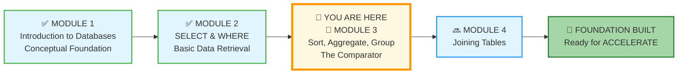
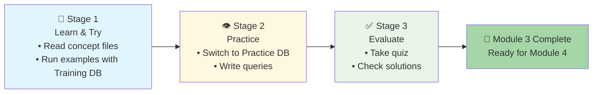

# 🗄️🤖 SQL & GenAI Course
**🎯 Quality Education for Anyone, Anywhere, Anytime — 💫 with Comfort, Convenience at no Cost**

## 📖 Module 3: Sorting, Aggregation & Grouping – The Comparator

Welcome to Module 3! You've mastered the art of retrieving and filtering data. Now it's time to organize, summarize, and discover patterns. In this module, you'll learn to sort your results, calculate aggregates, and group data to answer higher-level business questions. By the end, you'll transform raw data into meaningful insights.

💎 **The Artisan's Insight:** *"Individual data points are notes. Aggregates are the symphony. Learning to group and summarize is learning to hear the music behind the numbers."*

---

## 📊 **Your ACQUIRE Journey – Where You Are Now**

### 📍 You Are Here
- **Phase:** 🔴 ACQUIRE (Weeks 1‑4)
- **Module:** 3 of 4 – Sorting, Aggregation & Grouping
- **Mode:** Hands‑on SQL with a new perspective

---

## 🎯 Quick Overview

| Goal | Master the art of organizing and summarizing data. Learn to sort results, calculate aggregates, and group related records to uncover patterns and insights. |
|------|----------------------------------------------------------------------------------------|
| Time | 4‑5 hours (learn + practice) |
| Structure | **Learn & Try → Practice → Evaluate** (the proven rhythm) |

---

## 🧭 **Your Learning Compass for This Module**

**Journey Stage:** Foundation Building – **Advanced Single-Table Operations**  
**AI Co-pilot Role:** Conceptual Explainer only (no code generation)  
**Primary Goal:** Write queries that sort, calculate, and group data from a single table, building toward multi-table analysis.

**What This Means for You:**
- **🧠 Mindset Focus:** Data without organization is just noise. You're learning to find signal – to see the forest, not just the trees.
- **🤖 AI Guidelines:** Your Consultant (Tab 3) can explain concepts, clarify syntax, and help you understand error messages, but **will never write the query for you**. This discipline builds genuine mastery.
- **🎯 Success Metric:** By module's end, you can confidently write queries using `ORDER BY`, aggregate functions (`COUNT`, `SUM`, `AVG`, `MIN`, `MAX`), and `GROUP BY` with `HAVING`.

> **Philosophical Anchor:** *"The Artisan doesn't just collect data – they organize it. They don't just see numbers – they see stories."*

---

## 🎯 **Learning Objectives**

By completing this module, you will be able to:

1. **Sort** query results with `ORDER BY` (ascending, descending, multiple columns).
2. **Limit** results with `LIMIT` and `OFFSET` for pagination and top‑N analysis.
3. **Calculate** aggregates: `COUNT`, `SUM`, `AVG`, `MIN`, `MAX`.
4. **Group** data with `GROUP BY` to create summary statistics.
5. **Filter groups** with `HAVING` (the `WHERE` for aggregated data).
6. **Understand** the complete SQL execution order: `FROM` → `WHERE` → `GROUP BY` → `HAVING` → `SELECT` → `ORDER BY` → `LIMIT`.
7. **Apply** all concepts to create comprehensive reports on the Training Institution database.

#### 🏗️ **The Architect's Foundation**

Before diving into sorting and grouping, you'll step into the **"Architect's Ledger"** – a dedicated space where we explore the fundamental building blocks of relational databases: **Entities**, **Domains**, and the **Primary Key**. You'll discover how the skeleton of the database supports the weight of your analysis, giving you a deeper understanding of the structures you're querying.

> 💡 **Located in:** `1-sqlCommands/1-theArchitectsLedger/` – your reference for these core concepts throughout the module and beyond.

---

#### 📦 **The Art of Bucketing**

Think of `GROUP BY` as sorting LEGO bricks into buckets by color. Instead of looking at scattered piles, you instantly see: "Ah, I have 47 red bricks, 32 blue, and 53 yellow." This is the essence of aggregation – grouping similar items to reveal the bigger picture.

---

## 🏢 **The Browser Office: Your Universal Launchpad**

**🚀 Kickstart: Any Computer, Any Browser, Anytime.**  
**🌍 Destination: Any country, Any city, Any Platform.**

### **📋 The Standard Four-Tab Setup (Levels 1 & 2)**
The Browser Office transforms any computer with a browser into a complete learning environment.

| Tab | Purpose | Tools & Examples | Keyboard Shortcut |
| :--- | :--- | :--- | :--- |
| **1: The Map** | Learning content & navigation | Course Repository (GitHub) | `Ctrl+1` / `Cmd+1` |
| **2: The Factory** | Hands-on practice | SQLite Online | `Ctrl+2` / `Cmd+2` |
| **3: The Consultant** | AI assistance & explanations | ChatGPT, Claude, Gemini | `Ctrl+3` / `Cmd+3` |
| **4: The Vault** | Progress tracking & portfolio | GitHub Web, notes | `Ctrl+4` / `Cmd+4` |

---

## 📋 **Prerequisites**

Before beginning Module 3, ensure you have:

- [ ] **Module 2 Complete:** You've finished all concept files, exercises, and the quiz.
- [ ] **Browser Office Open:** All four tabs configured and accessible.
- [ ] **Training Database Loaded:** `training_institution_sample.db` open in Tab 2 (for learning).
- [ ] **Student Mode Active:** Your Consultant (Tab 3) configured with the Student Mode prompt.
- [ ] **Vault Ready:** Your GitHub repository structure matches Pillar 3 requirements.

> 💡 **Note:** For Module 3, we return to the **Training Institution database** (`students`, `courses`, `enrollments`, `payments`). The E‑Store database served its purpose in Module 2 – now we apply these new concepts to familiar education data.

---

## 🏛️ **The Training Institution Database – Your Familiar World**

### Tables You'll Use in Module 3

| Table | What It Stores | Key Columns for This Module |
|-------|----------------|-----------------------------|
| **`students`** | Student information | `student_id`, `first_name`, `last_name`, `total_fees`, `fees_paid` |
| **`courses`** | Course catalog | `course_id`, `course_name`, `course_track`, `duration_weeks`, `course_fee` |
| **`enrollments`** | Student enrollments | `enrollment_id`, `student_id`, `course_id`, `completion_status`, `test_scores` |
| **`payments`** | Payment records | `payment_id`, `student_id`, `amount`, `payment_date` |

You've worked with this database before. Now you'll see it in a whole new light – through the lens of organization and summarization.

---

## 🧠 **Mindset: From Collector to Analyst**

In Module 2, you learned to collect specific data points – like a detective gathering evidence. Now you'll learn to step back and see the bigger picture.

- **`ORDER BY`** lets you arrange evidence chronologically or by importance.
- **`COUNT`**, **`SUM`**, **`AVG`** let you measure the scene.
- **`GROUP BY`** is your **bucketing tool** – it takes scattered items and groups them into meaningful categories. Imagine sorting a giant pile of marbles by color. Without buckets, you just see a mess. With buckets, you instantly know: 24 red, 18 blue, 31 green.
- **`HAVING`** lets you focus on the buckets that matter most – like saying, "Show me only the color buckets with more than 20 marbles."

> 💡 **Visualizing the Bucket:** Every time you use `GROUP BY`, picture yourself standing over a pile of data with a set of labeled buckets. The `GROUP BY` clause tells you which buckets to use. The aggregate functions (`COUNT`, `SUM`, `AVG`) tell you what to count once everything's sorted.

**Remember the 3‑Attempt Rule:**  
1. Write the query from memory/intuition.  
2. If it fails, check the syntax in the concept file.  
3. Still stuck? Ask the Consultant (Tab 3) for a conceptual hint – never for the full code.

---

## 📈 Your Three‑Stage Journey

**📘 Stage 1: Learn & Try** – Read the concept files in `1-sqlCommands/`. As you read, open the **Training Institution database** in Tab 2 and run every example query yourself. This builds muscle memory and confidence.

**👁️ Stage 2: Practice** – Switch to the **Practice DB** and work through the exercises in `2-practiceExercises/`. Apply what you've learned to a fresh dataset. Struggle, succeed, and grow.

**✅ Stage 3: Evaluate** – Test your knowledge with the quiz in `3-quizCheckpoint/`. Then check your answers and review the solutions in `4-exerciseAndQuizSolutions/`.

---

## 🚀 **Ready to Begin?**

The data is waiting to be organized, summarized, and understood.

**Your journey from collector to analyst begins now.**

# [▶️ **GO TO MODULE 3 GUIDE**](./MODULE3_GUIDE.md)

---

*Part of our mission for 🎯 Quality Education for Anyone, Anywhere, Anytime — 💫 with Comfort, Convenience at no Cost.*

**Level 1 | Module 3: Sorting, Aggregation & Grouping | Next: [Module 3 Guide](./MODULE3_GUIDE.md)**

