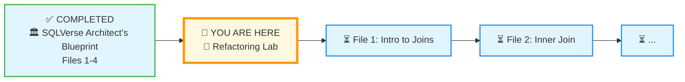
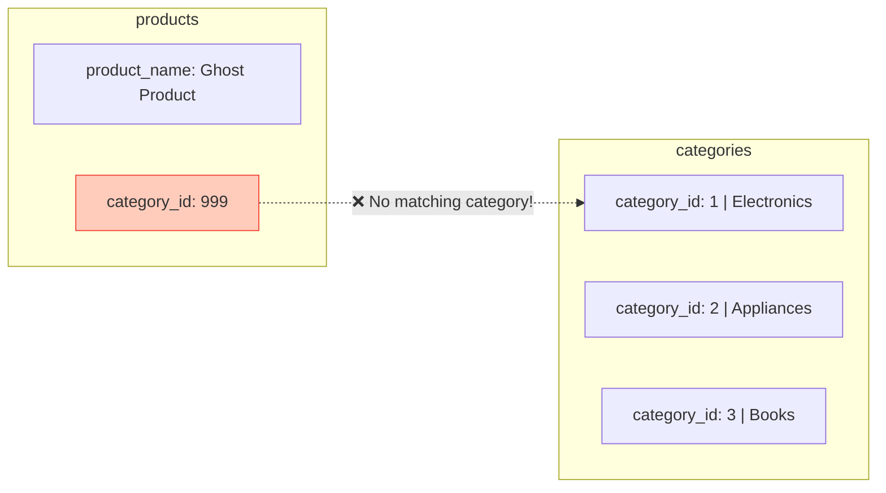
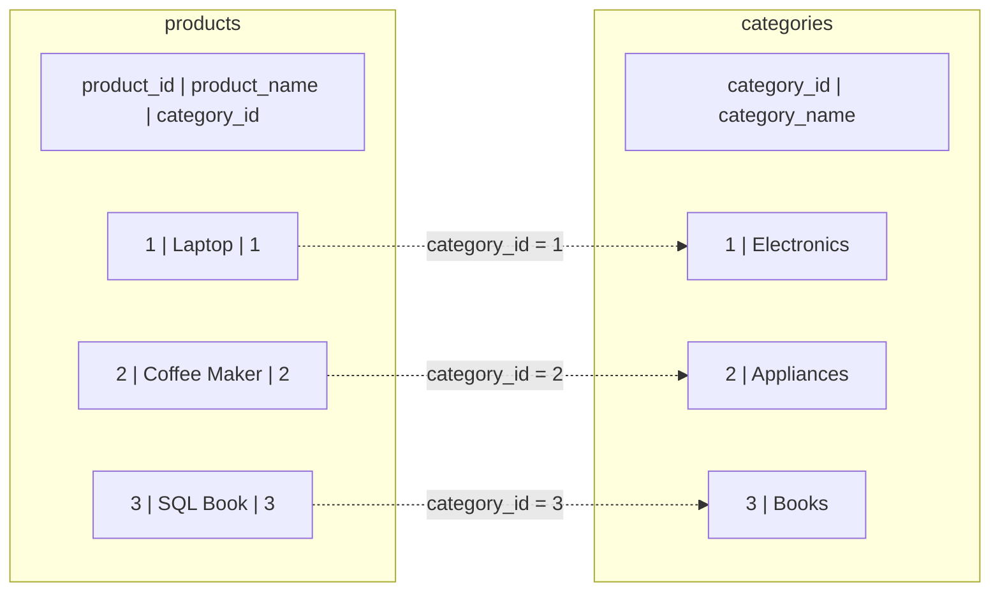
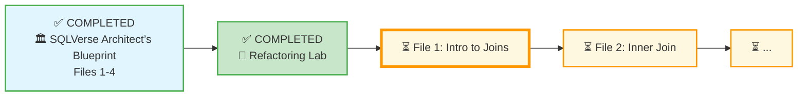

# 🗄️🤖 SQL & GenAI Course
**🎯 Quality Education for Anyone, Anywhere, Anytime — 💫 with Comfort, Convenience at no Cost**

## 🧪 Refactoring Lab: "The Evolution of the E‑Store"

Welcome to the **Refactoring Lab** – the hands‑on culmination of the SQLVerse Architect’s Blueprint. In the previous files, you learned why flat tables are dangerous, how foreign keys enforce referential integrity, the three relationship types, and the three normal forms. Now you’ll apply all of that to transform the E‑Store’s flat `products` table into a clean, normalized schema.

**By the end of this lab, you will have:**
- Created a `categories` table.
- Populated it with distinct category names.
- Added a `category_id` column to `products`.
- Updated the products with the correct category IDs.
- Performed your first `JOIN` to reunite the data.
- Understood the power of normalization.

---

## 🌌 SQLVerse Check-In

<div style="border-left: 4px solid #9c27b0; background-color: #f3e5f5; padding: 15px; margin: 20px 0; border-radius: 0 8px 8px 0;">

**You are now the Architect.** The flat `products` table you used in Module 3 was perfect for learning aggregates. But now the CTO demands data integrity. You’re going to tear down the old structure and rebuild it – a true Artisan’s move.

**The difference between a coder and an Artisan is discipline.**

</div>

---

### 📍 Your Current Stage – PREPARE Journey



You’ve completed the four conceptual blueprint files. Now you’ll put theory into practice by refactoring the E‑Store.

---

## 🔧 Enhanced Browser Office for REFACTORING

**🚀 Kickstart: Any Computer, Any Browser, Anytime.**  
**🌍 Destination: Any country, Any city, Any Platform.**

Unlike previous modules where you only queried data, **this lab changes the structure of the database itself**. You will use **DDL (Data Definition Language)** commands like `CREATE TABLE`, `ALTER TABLE`, and `DROP COLUMN`. These changes are permanent – but don’t worry, you can always re‑download the original `level1_estore_basic.db` file if needed.

| Tab | Purpose | What to Do |
| :--- | :--- | :--- |
| **1: The Map** | Read concept files | You’re here – reading this lab file. |
| **2: The Factory** | Run DDL/DML commands | Keep **`level1_estore_basic.db`** loaded. Run every SQL command in this lab. |
| **3: The Consultant** | Conceptual Q&A | Ask about normalization, foreign keys, or why an error occurs. Configure with Student Mode Prompt. |
| **4: The Vault** | Save your work | Save the final queries as `refactoring-lab.sql` in your Module 4 folder. |

> ⚠️ **Artisan’s Warning:** `CREATE TABLE`, `ALTER TABLE`, and `DROP` are irreversible. Always double‑check your commands. If you make a mistake, re‑download the original database from the Resources folder.

---

### 🛠️ Module 4 Toolkit

🚀 Foundation First, AI Next, Projects Last.  
💎 Gemstone by Gemstone, Skill by Skill.

| | | | |
|---|---|---|---|
| **Browser Office** | 🔧 [Troubleshooting Common Issues](../../../Setup/STEP1_COMMISSION_BROWSER_OFFICE.md) | 🔄 [Browser Office Workflow](../../../Setup/STEP2_ESTABLISH_LEARNING_RITUAL.md) | ⌨️ [Tab Operations & Shortcuts](../../../Setup/STEP3_MASTER_TAB_OPERATIONS.md) |
| **ACQUIRE Section** | 🗄️ [Database Ecosystem](../../Guides/Section1-ACQUIRE/2_Database_Ecosystem.md) | 📚 [Knowledge Base (Vault)](../../Guides/Section1-ACQUIRE/3_Knowledge_Base.md) | 🧠 [Mindset Tuning](../../Guides/Section1-ACQUIRE/4_Mindset.md) |

---

## 🎯 What You'll Learn

By the end of this lab, you will be able to:

- Distinguish between DDL, DML, and DQL commands.
- Write `CREATE TABLE` statements with appropriate data types and constraints.
- Use `ALTER TABLE` to add a new column.
- Populate a new table with distinct values from an existing table.
- Write an `UPDATE` with a subquery to map foreign keys.
- Understand why we refactor flat tables into normalized schemas.
- Write a `JOIN` to reunite normalized data.

---
## 🍽️ The Appetisers: Three Bonus Skills

Before we tear down the E‑Store, let’s learn the tools we’ll be using.

### 🧠 SQL Command Categories

SQL commands are grouped into three main categories:

- **DDL (Data Definition Language):** Commands that define the database structure. Examples: `CREATE`, `ALTER`, `DROP`.
- **DML (Data Manipulation Language):** Commands that manage data within tables. Examples: `INSERT`, `UPDATE`, `DELETE`.
- **DQL (Data Query Language):** Commands that retrieve data. Example: `SELECT`.

In this lab, you’ll use **DDL** (`CREATE TABLE`, `ALTER TABLE`, `DROP TABLE`) and **DML** (`INSERT`, `UPDATE`) to refactor our E-store database.

---

### ✨ Bonus Skill 1: CREATE TABLE (DDL)

The `CREATE TABLE` statement defines a new table and its columns. Each column has a **data type** (e.g., `INTEGER`, `TEXT`, `REAL`, `DATE`) and may have **constraints** like `PRIMARY KEY`, `NOT NULL`, or `UNIQUE`.

```sql
CREATE TABLE table_name (
    column1 datatype constraint,
    column2 datatype constraint,
    ...
);
```

**Example:** Create a `test` table.

```sql
CREATE TABLE test (
    id INTEGER PRIMARY KEY,
    name TEXT NOT NULL
);
```

**Try it now in Tab 2.**

> 💡 **Artisan’s Insight:** `CREATE TABLE` is the foundation of database design. Every normalized schema starts with well‑defined tables.

---

### ✨ Bonus Skill 2: ALTER TABLE (DDL)

The `ALTER TABLE` command modifies an existing table. In SQLite, you can **add new columns** (but you cannot easily drop or rename columns without recreating the table – we’ll note that limitation).

```sql
ALTER TABLE table_name ADD COLUMN column_name datatype constraint;
```

**Example:** Add a column to the `test` table you just created.

```sql
ALTER TABLE test ADD COLUMN description TEXT;
```

**Try it now.** Then run `SELECT * FROM test;` to see the new column (it will be NULL for existing rows).

> ⚠️ **SQLite Limitation:** Dropping a column is not straightforward. In this lab, we will **ignore** the old text column rather than deleting it.

---

### ✨ Bonus Skill 3: DROP TABLE (DDL)

The `DROP TABLE` command removes an entire table and all its data. **This action is irreversible.**

```sql
DROP TABLE table_name;
```

**Example:** Remove the `test` table.

```sql
DROP TABLE test;
```

**Try it now in Tab 2.** Then verify it’s gone: `.tables` (or run `SELECT * FROM test;` – it should give an error).

> ⚠️ **Artisan’s Warning:** `DROP TABLE` deletes everything. Always double‑check the table name. In production, you rarely drop tables – but it’s useful for cleaning up temporary objects.

Now you have the tools. Let’s sharpen the tools in Miniature Lab.

---

## 🧪 Miniature Lab: Mastering DDL Commands

In this miniature lab, you’ll use **DDL** (`CREATE TABLE`, `ALTER TABLE`, `DROP TABLE`) and **DML** (`INSERT`, `UPDATE`, `INSERT FROM SELECT`). The goal is to get comfortable with these commands before applying them to the real E‑Store.

---

### Step 1: Create the Source Table (Flat)

We’ll create a table that lists the learning objectives of Module 4, including both core skills and bonus skills.

```sql
CREATE TABLE Module4Skills (
    id INTEGER PRIMARY KEY,
    module_name TEXT,
    skill_name TEXT,
    skill_type TEXT
);
```

**Try it now in Tab 2.**  
**What you're seeing:** An empty table with four columns.

---

### Step 2: Populate with Data (DML Practice)

Insert the skills you’ll master in Module 4. Notice that `module_name` repeats .

```sql
INSERT INTO Module4Skills (module_name, skill_name, skill_type) VALUES
('Module 4: Joining Tables', 'INNER JOIN', 'Learning Skill'),
('Module 4: Joining Tables', 'LEFT JOIN', 'Learning Skill'),
('Module 4: Joining Tables', 'JOIN with multiple tables', 'Learning Skill'),
('Module 4: Joining Tables', 'Self JOIN', 'Learning Skill'),
('Module 4: Joining Tables', 'Advanced JOIN conditions', 'Learning Skill'),
('Module 4: Bonus', 'CREATE TABLE', 'Bonus Skill'),
('Module 4: Bonus', 'ALTER TABLE', 'Bonus Skill'),
('Module 4: Bonus', 'DROP TABLE', 'Bonus Skill');
```

**Try it now.**  
**What you're seeing:** Eight rows are inserted.  
**Verify:** `SELECT * FROM Module4Skills;`

---

### Step 3: Create the Lookup Table

We will now extract the distinct `skill_type` values into a separate table.

```sql
CREATE TABLE SkillCategories (
    category_id INTEGER PRIMARY KEY,
    category_name TEXT UNIQUE
);
```

**Try it now.**  
**What you're seeing:** A new, empty table.

---

### Step 4: Data Migration INSERT (Populate Lookup Table)

This is a key pattern: inserting data from one table into another using `INSERT INTO ... SELECT`. We call this **Data Migration INSERT**.

```sql
INSERT INTO SkillCategories (category_name)
SELECT DISTINCT skill_type FROM Module4Skills;
```

**Try it now.**  
**What you're seeing:** Two rows inserted ('Learning Skill', 'Bonus Skill').  
**Verify:** `SELECT * FROM SkillCategories;`

---

### Step 5: Add Foreign Key Column to Source Table

Just like adding `category_id` to `products`, we now add a column to link `Module4Skills` to `SkillCategories`.

```sql
ALTER TABLE Module4Skills ADD COLUMN category_id INTEGER;
```

**Try it now.**  
**What you're seeing:** A new column appears (all NULL initially).

---

### Step 6: Map the IDs (UPDATE Using CASE)


Because the `skill_type` column contains only two known values (`'Learning Skill'` and `'Bonus Skill'`), we can use a simple `CASE` expression to set the `category_id`. (In the real E‑Store refactoring you’ll use a subquery – that’s a preview of later skills.)

```sql
UPDATE Module4Skills
SET category_id = CASE
    WHEN skill_type = 'Learning Skill' THEN 1
    WHEN skill_type = 'Bonus Skill' THEN 2
END;
```

**Try it now.**  
**What you're seeing:** The `category_id` column is now populated (1 for 'Learning Skill', 2 for 'Bonus Skill').

---

### Step 7: Verify with a JOIN

Now we can reunite the data using a `JOIN` – exactly what you’ll do with the E‑Store.

```sql
SELECT ms.skill_name, sc.category_name
FROM Module4Skills ms
JOIN SkillCategories sc ON ms.category_id = sc.category_id;
```

**Try it now.**  
**What you're seeing:** A clean list of skills and their categories.

---

### Step 8: Clean Up (DROP TABLE)

Finally, practice removing tables you no longer need.

```sql
DROP TABLE Module4Skills;
DROP TABLE SkillCategories;
```

**Try it now.**  
**What you're seeing:** Both tables disappear.  
**Reflect:** This pattern – create, populate, alter, update, join, drop – is exactly what you’ll do in the main refactoring (except you won’t drop the final tables; you’ll keep them for the rest of the module).

> 💡 **Artisan’s Insight:** You just performed a complete refactoring rehearsal using Module 4’s own curriculum. The steps you practiced – `CREATE TABLE`, `INSERT FROM SELECT`, `ALTER TABLE`, `UPDATE` with a subquery, and `JOIN` – are the exact steps you will now apply to the E‑Store.

---
## ⚓ The Tethers of the SQLVerse

If we shatter our data into different tables, how do we make sure they stay connected? We use **Foreign Keys**.

### ⚓ The Anchor: Primary Key (PK)
A Primary Key (like `category_id`) is the **unique ID** in the home table. It is the “Source of Truth.”

### 🔗 The Tether: Foreign Key (FK)
A Foreign Key is that same ID “visiting” another table.  
- In the `categories` table, `category_id` is the **Primary Key**.  
- In the `products` table, `category_id` is a **Foreign Key**.

### 🛡️ Referential Integrity: The Safety Net
This is a set of rules the database enforces to prevent “Orphaned Data.”
- **The Rule:** You cannot add a product with `category_id = 99` if category 99 doesn’t exist in the Categories table.
- **The Guardrail:** You cannot delete a category if there are still products linked to it.

**This ensures the bridges (Joins) you build in Module 4 will never lead to a “404 Not Found” destination.**

---

## 🏗️ REFACTORING AND TRANSFORMING THE E‑STORE

Now you will apply the same pattern you practiced in the Miniature Lab to transform the E‑Store’s flat `products` table into a professional relational schema.

## 📊 Practice Table: The Flat `products` Table

We’ll start with the flat `products` table from the E‑Store database. Below are all current rows:

| product_id | product_name      | category    | price |
|------------|-------------------|-------------|-------|
| 1          | Laptop            | Electronics | 1200.00 |
| 2          | Coffee Maker      | Appliances  | 80.00  |
| 3          | SQL Essentials Book | Books    | 45.00  |
| 4          | Headphones        | Electronics | 150.00 |
| 5          | Blender           | Appliances  | 60.00  |

> 💡 **View the full dataset:** Run `SELECT * FROM products;` in your Factory.

---

## 🏛️ Phase 1: The Architect’s Observation

Look at the `category` column. Notice the **redundancy**:

- “Electronics” appears twice (for Laptop and Headphones).
- “Appliances” appears twice (Coffee Maker, Blender).

**The Risk:** If you accidentally type “Electonrics” (typo) in one row, your Module 3 reports that used `GROUP BY category` would suddenly show two separate categories: “Electronics” and “Electonrics”. Your analysis would be wrong.

**Other problems:**
- **Update anomaly:** Renaming “Electronics” to “Tech & Gadgets” would require updating two rows. Miss one, and data becomes inconsistent.
- **Insertion anomaly:** You cannot add a new category (“Toys”) without creating a product.
- **Deletion anomaly:** Deleting the last product in a category (e.g., the only “Books” product) would erase the category name entirely.

We will fix all of these by normalizing.

---

## 🔨 Phase 2: Deconstruction (The Split)

We will create a dedicated `categories` table and move the unique category names there.

### Step 1: Create the Category Vault

```sql
CREATE TABLE categories (
    category_id INTEGER PRIMARY KEY AUTOINCREMENT,
    category_name TEXT NOT NULL UNIQUE
);
```

**Expected Result:** An empty table with two columns.  
**Try it now in Tab 2.**  
**What you're seeing:** The `categories` table is created.  
**Reflect:** Why do we use `UNIQUE` on `category_name`? (To prevent duplicate names.)

---

### Step 2: Migrate the Data (The Seed)

We pull the unique category names from the old `products` table into the new `categories` table.

```sql
INSERT INTO categories (category_name)
SELECT DISTINCT category FROM products;
```

**Expected Result:** Three rows inserted (Electronics, Appliances, Books).  
**Try it now.**  
**What you're seeing:** The `categories` table now holds each unique category name once.  
**Reflect:** How does this eliminate redundancy? (Each category name is stored only once.)

---

## 🔗 Phase 3: The Connection (The Foreign Key)

Now we must prepare the `products` table to “talk” to the new `categories` table.

### Step 3: Add the Link Column

```sql
ALTER TABLE products ADD COLUMN category_id INTEGER;
```

**Expected Result:** A new, empty column appears in `products`.  
**Try it now.**  
**What you're seeing:** The column is added; currently all values are NULL.  
**Reflect:** Why do we add the column before dropping the old one? (To preserve data while we map.)

---

### Step 4: The Mapping (The “Brain” Work)


Now we link each product to its correct category. Since we have only three categories, we can write one `UPDATE` statement per category.

```sql
UPDATE products SET category_id = 1 WHERE category = 'Electronics';
UPDATE products SET category_id = 2 WHERE category = 'Appliances';
UPDATE products SET category_id = 3 WHERE category = 'Books';
```

**Expected Result:** Each product gets the correct `category_id`.  
**Try it now.**  
**What you're seeing:** The `category_id` column is now populated with numbers (1,2,3).

> 🔮 **Preview for Level 2:** In a larger database, you would use a subquery to automate this mapping. A subquery would look like:
> ```sql
> UPDATE products
> SET category_id = (
>     SELECT category_id
>     FROM categories
>     WHERE categories.category_name = products.category
> );
> ```
> Subqueries are powerful but are covered in **Level 2**. For now, the manual method works perfectly for our small dataset.

---

###  Step 5: Add the Foreign Key Constraint

```sql
ALTER TABLE products ADD FOREIGN KEY (category_id) REFERENCES categories(category_id);
```

This command tells the database: “Every `category_id` in `products` must have a matching `category_id` in `categories`.” Now the database will enforce referential integrity.

### 🧪 What If We Break the Rules?

Let’s see what happens when we try to insert a product with a `category_id` that doesn’t exist in `categories`.

```sql
PRAGMA foreign_keys = ON;
INSERT INTO products (product_name, price, category_id)
VALUES ('Ghost Product', 99.99, 999);
```
*"SQLite disables foreign key enforcement by default for compatibility. The PRAGMA foreign_keys = ON; command turns it on so you can see the constraint in action."*

**Run this in Tab 2.**  
You should see an error similar to:
```
FOREIGN KEY constraint failed
```

**What’s happening?** The database refuses to create an **orphaned record** – a product that points to a non‑existent category. This is referential integrity in action.



Without the foreign key, you could insert such a row, and later joins would silently miss it, causing data corruption.

> 💡 **Artisan’s Insight:** *“The database just saved you from a silent bug. Every foreign key is a guardrail that keeps your data trustworthy.”*

---

## 🧹 Phase 4: Removing the Scaffolding

In a professional environment, we would now **drop** the old `category` text column from the `products` table because it is redundant. However, SQLite has limited support for `DROP COLUMN`. For this lab, we will simply **ignore** the old column and use `category_id` for all future queries.

> 💡 **Artisan’s Note:** In production databases like PostgreSQL, you can run `ALTER TABLE products DROP COLUMN category;`. For SQLite, the safest way is to recreate the table, but we’ll skip that for brevity.

Now the data is normalized! The `products` table has `product_id`, `product_name`, `price`, and `category_id`. The `categories` table holds the unique category names.



---

## 🔍 The Big Reveal: Your First JOIN

**Business Question:** “Show me all product names and their category names.”

Because the text name is no longer in the `products` table (conceptually), we must **BRIDGE** the two tables using a `JOIN`.

```sql
SELECT p.product_name, c.category_name
FROM products p
JOIN categories c ON p.category_id = c.category_id;
```

**Expected Result:** The original flat table’s data, but now derived from the normalized structure.

| product_name      | category_name |
|-------------------|---------------|
| Laptop            | Electronics   |
| Coffee Maker      | Appliances    |
| SQL Essentials Book | Books       |
| Headphones        | Electronics   |
| Blender           | Appliances    |

**Try it now in Tab 2.**  
**What you're seeing:** The result matches the original flat table, but the data is now clean and scalable.  
**Reflect:** Why is this better? (No redundancy; you can add a `description` column to `categories` without bloating `products`.)

> 🎉 **Congratulations!** You’ve just performed your first `JOIN` on a normalized database. This is the foundation of Module 4.

---

## ⚠️ Common Mistakes

| Mistake | Fix |
|---------|-----|
| Forgetting `DISTINCT` when populating `categories` | Use `SELECT DISTINCT` to avoid duplicate category names. |
| Running the `UPDATE` before adding the `category_id` column | Always `ALTER TABLE` first. |
| Using the wrong column names in the subquery | Ensure `categories.category_name` matches the old `products.category`. |
| Trying to drop the old column in SQLite | SQLite doesn’t support `DROP COLUMN` easily; just ignore the column. |

---

## 🧪 Practice Challenges

**Challenge 1:** Add a new category “Toys” to the `categories` table. Then add a new product “Rubber Duck” priced at 5.99 belonging to that category.  
*Save as:* `refactoring-add-category.sql`

**Challenge 2:** Write a query that shows the product name and category name for all products, but only for categories that start with the letter ‘E’.  
*Save as:* `refactoring-filtered-join.sql`

**Challenge 3:** Try to insert a product with `category_id = 999`. What happens? Why? (Note: we haven’t added a foreign key constraint, so it may succeed – that’s why constraints are important!)  
*Save as:* (no file, just observe)

---

## 📋 Refactoring Quick Reference Card

| Phase | Action | SQL |
|-------|--------|-----|
| 1 | Create categories table | `CREATE TABLE categories(...)` |
| 2 | Insert distinct categories | `INSERT INTO categories SELECT DISTINCT ...` |
| 3 | Add foreign key column | `ALTER TABLE products ADD COLUMN category_id INTEGER` |
| 4 | Map IDs | `UPDATE products SET category_id = (SELECT ...)` |
| 5 | (Optional) Drop old column | Not supported in SQLite – ignore |
| 6 | Join to see the result | `SELECT ... FROM products JOIN categories ON ...` |

**Memory Aid:** *“Create, Insert, Alter, Update, Join.”*

**Save this reference in your Vault as:** `refactoring-refcard.md`

---

## ✅ Progress Check

After reading this and trying the commands, can you:

- [ ] Explain the difference between DDL, DML, and DQL?
- [ ] Write a `CREATE TABLE` statement with appropriate data types?
- [ ] Use `ALTER TABLE` to add a column?
- [ ] Populate a table with distinct values from another table?
- [ ] Write an `UPDATE` with a subquery to map foreign keys?
- [ ] Write a `JOIN` to reunite normalized data?
- [ ] Explain why normalization eliminates redundancy?

**If yes → You’re ready for the join concept files!**

---

## 💎 DESIGNER'S PERIGON

<div style="border: 3px solid #9c27b0; border-radius: 10px; padding: 20px; margin: 25px 0; background: linear-gradient(135deg, #f3e5f5 0%, #e1bee7 100%);">

### *The Art of Refactoring*

You just performed a real‑world database refactoring – the kind of task that separates a data entry clerk from a data engineer. You didn’t just write queries; you redesigned a schema to be clean, scalable, and trustworthy.

Every time you see a spreadsheet with repeated values, you’ll now think: “I can normalize that.” That’s the Artisan’s eye. You have just transitioned from a **spreadsheet user** to a **Database Architect**. You are no longer just storing text; you are managing **relationships**.

> *“A well‑normalized database is invisible. When it’s built correctly, users never see the corruption, the errors, or the maintenance headaches—they only see a system that works, every single time.”*

Now go forth and join those tables. The SQLVerse awaits.

</div>

---

## 🧭 File Navigation



| Previous Step | Next Step |
|:---:|:---:|
| [← Back to Module 4 Guide](../MODULE4_GUIDE.md) | [Continue to File 1: Intro to Joins →](./1-IntroToJoins.md) |

---

*Part of our mission for 🎯 Quality Education for Anyone, Anywhere, Anytime — 💫 with Comfort, Convenience at no Cost.*

**Level 1 | Module 4 | Refactoring Lab | Next: [Intro to Joins](./1-IntroToJoins.md)**


