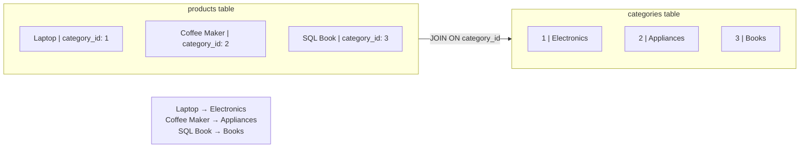
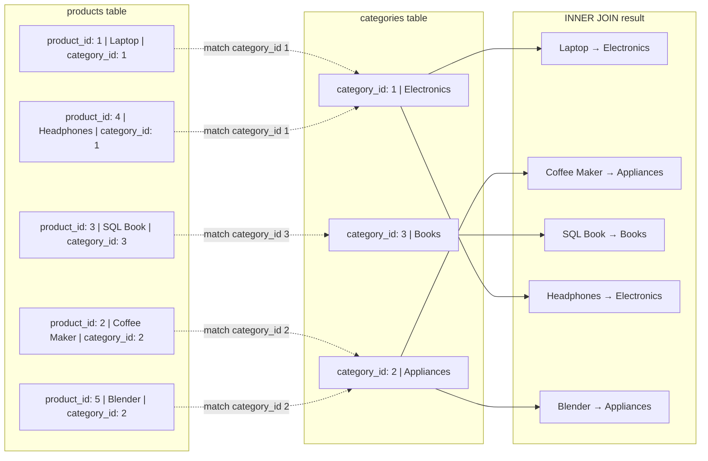
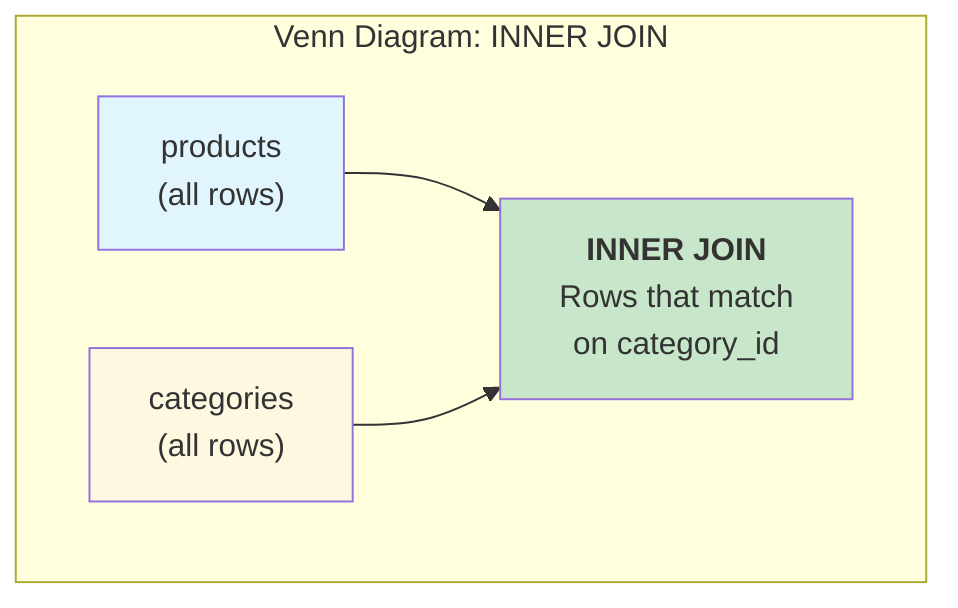

# 🗄️🤖 SQL & GenAI Course
**🎯 Quality Education for Anyone, Anywhere, Anytime — 💫 with Comfort, Convenience at no Cost**

## 📘 File 1: Intro to Joins – Why We Need Connections


Welcome to Module 4! You've mastered single‑table queries – filtering, sorting, grouping, and aggregating. But the real world doesn't fit neatly into one table. A customer's orders live in one table; the product details live in another. To answer questions like *“Which customers bought the most expensive product?”* or *“What are the top‑selling categories?”*, you need to **combine** data from multiple tables. That's what **joins** do.

Welcome to the most transformative skill in the SQLVerse. In the **Refactoring Lab**, you shattered a flat, redundant table into clean, specialized pieces. You acted as the **Architect**. Now, you must act as the **Navigator.**

---

## 🧠 SQLVerse Architect's Truth

**Why do we Join?** In a normalized world, data is **"distributed."** The `products` table knows the price, but only the `categories` table knows the name of the category. To answer the CEO's question—*“What are our top‑selling Electronics?”*—you must cross the bridge between these two worlds.

A `JOIN` is the mechanism that allows you to query **multiple tables** as if they were one, **without** the mess of **redundancy**. The `JOIN` is the **glue** of the relational database.

---

### 📍 Your Current Stage – PREPARE Journey

```mermaid
flowchart LR
    A["✅ COMPLETED<br/>🏛️ SQLVerse Architect’s Blueprint<br/>Files 1-4"] --> B
    B["✅ COMPLETED<br/>🧪 Refactoring Lab"] --> C
    C["📍 YOU ARE HERE<br/>📘 File 1<br/>Intro to Joins"] --> D
    D["⏳ File 2<br/>Inner Join"] --> E
    E["⏳ File 3<br/>Left Join"] --> F
    F["⏳ File 4<br/>Joining Multiple Tables"] --> G
    G["⏳ File 5<br/>Self Join"] --> H
    H["⏳ File 6<br/>Join Conditions"] --> I
    I["✅ PREPARE COMPLETE"] --> J
    J["🔄 RETURN TO MODULE GUIDE<br/>TO BEGIN PRACTICE SECTION"]
    
    style A fill:#e1f5fe,stroke:#4caf50,stroke-width:2px
    style B fill:#c8e6c9,stroke:#4caf50,stroke-width:2px
    style C fill:#fff8e1,stroke:#ff9800,stroke-width:4px
    style D fill:#e1f5fe,stroke:#2196f3,stroke-width:2px
    style E fill:#e1f5fe,stroke:#2196f3,stroke-width:2px
    style F fill:#e1f5fe,stroke:#2196f3,stroke-width:2px
    style G fill:#e1f5fe,stroke:#2196f3,stroke-width:2px
    style H fill:#e1f5fe,stroke:#2196f3,stroke-width:2px
    style I fill:#fff8e1,stroke:#ff9800,stroke-width:2px
    style J fill:#e8f5e8,stroke:#4caf50,stroke-width:2px
```



You've completed the SQLVerse Architect’s Blueprint and the Refactoring Lab. Now you'll learn how to **reconnect** the normalized tables using joins.

---

## 🔧 Enhanced Browser Office for PREPARE

### 🔄 The Big Reveal – Database Swap

In Module 4, the roles of the two databases have reversed:

In Module 4, the roles of the two databases have reversed:

- **Normalized E‑Store** (`level1_estore_normalized_MODULE4.db`) → becomes the **demonstration database** (used for all concept file examples).  
  *(This database is located in the `1-sqlCommands/SQLVerse-Architects-Blueprint/` folder.)*
- **Training Institution** (`training_institution_sample.db`) → becomes the **practice database** (used for exercises in `2-practiceExercises/`).

This reversal reinforces the plot twist: you normalized the E‑Store in the Refactoring Lab, and now you'll use it to learn joins.

---

**🚀 Kickstart: Any Computer, Any Browser, Anytime.**  
**🌍 Destination: Any country, Any city, Any Platform.**

| Tab | Purpose | What to Do |
| :--- | :--- | :--- |
| **1: The Map** | Read concept files | You're here – reading this file. Next up: `2-InnerJoin.md`. |
| **2: The Factory** | Run queries | Keep the **Normalized E‑Store database** ([`level1_estore_normalized_MODULE4.db`](./SQLVerse-Architects-Blueprint/level1_estore_normalized_MODULE4.db)) loaded. Run every example query. |
| **3: The Consultant** | Conceptual Q&A | Ask about join syntax, why we join, or how to think about relationships. Configure AI with Student Mode Prompt. |
| **4: The Vault** | Save your work | Save successful queries in: `Learning/Level-1-beginner/Level1-1-ACQUIRE/Module4-JoiningTables/1-sqlCommands/` |

---

### 🛠️ Module 4 Toolkit

🚀 Foundation First, AI Next, Projects Last.  
💎 Gemstone by Gemstone, Skill by Skill.

| | | | |
|---|---|---|---|
| **Browser Office** | 🔧 [Troubleshooting Common Issues](../../../Setup/STEP1_COMMISSION_BROWSER_OFFICE.md) | 🔄 [Browser Office Workflow](../../../Setup/STEP2_ESTABLISH_LEARNING_RITUAL.md) | ⌨️ [Tab Operations & Shortcuts](../../../Setup/STEP3_MASTER_TAB_OPERATIONS.md) |
| **ACQUIRE Section** | 🗄️ [Database Ecosystem](../../Guides/Section1-ACQUIRE/2_Database_Ecosystem.md) | 📚 [Knowledge Base (Vault)](../../Guides/Section1-ACQUIRE/3_Knowledge_Base.md) | 🧠 [Mindset Tuning](../../Guides/Section1-ACQUIRE/4_Mindset.md) |

---

## 🎯 What You'll Learn

By the end of this file, you will be able to:

- Explain why we need to combine data from multiple tables.
- Understand the concept of a **join** as a bridge between tables.
- Identify the common column (foreign key) that connects two tables.
- Write a basic `INNER JOIN` to retrieve related data.
- Recognize that joins are the natural partner to normalization.

---

## 📊 Practice Tables: `products` and `categories`

After the Refactoring Lab, the E‑Store now has a normalized schema. We'll focus on two tables:

### `categories` Table (all rows)

| category_id | category_name |
|-------------|---------------|
| 1           | Electronics   |
| 2           | Appliances    |
| 3           | Books         |

### `products` Table (all rows)

| product_id | product_name      | price   | category_id |
|------------|-------------------|---------|-------------|
| 1          | Laptop            | 1200.00 | 1           |
| 2          | Coffee Maker      | 80.00   | 2           |
| 3          | SQL Essentials Book | 45.00 | 3           |
| 4          | Headphones        | 150.00  | 1           |
| 5          | Blender           | 60.00   | 2           |

Notice that the `products` table no longer has a `category` text column. Instead, it has `category_id`, which points to the `categories` table. The actual category name lives only in `categories`.

> 💡 **Key Insight:** The flat table was split into two tables linked by a foreign key (`category_id`). Now, to see the category name alongside a product, we must **join** them back together.

---

## 🤔 When Should You Use a Join?

### ✅ Use a Join When:
1. **Data is normalized** – information is spread across multiple related tables.
2. **You need columns from more than one table** – e.g., product name from `products` and category name from `categories`.
3. **You want to enrich a query** – adding customer names to order lists, product categories to sales reports.
4. **You are building reports** – most real‑world reports pull from several tables.

### ❌ Avoid a Join When:
1. **You only need data from one table** – a simple `SELECT` is faster and simpler.
2. **Performance is critical and the join is expensive** – but that's rare for basic joins on small datasets.
3. **You haven't identified the relationship** – joins without a clear link produce meaningless results.

**The Artisan's Rule:**  
> *“Normalization splits the data; joins bring it back together. Master both, and you master relational databases.”*

---

## 🔍 Introducing Joins

Imagine you have two lists:

- **List A:** Products with a category ID (1,2,3...).
- **List B:** Categories with an ID and a name (1=Electronics, 2=Appliances, 3=Books).

You want to create a single list that shows each product with its category name instead of the numeric ID. That's exactly what a **join** does.



The join matches rows from `products` with rows from `categories` where the `category_id` values are equal. The result is a combined row that has both product information and the corresponding category name.

---
## 🏗️ The Anatomy of a JOIN

SQL joins are used to combine rows from **two or more tables** based on a **related column** between them.

To connect two tables, you need a **Common Link**. Think of it like a puzzle piece: the "tab" on one piece must match the "blank" on the other.



### 🗝️ The Join Condition (`ON`)

The `ON` clause is where you define the bridge. You are telling the database: "Match the row in Table A with the row in Table B where these specific columns are equal."

**The Standard Syntax:**

```sql
SELECT table1.column, table2.column
FROM table1
JOIN table2 ON table1.common_column = table2.common_column;
```
---

## 🛠️ Your First Bridge: Products & Categories

Let's look at the two tables you created in the Refactoring Lab:

**Table: `products` (The Tether)**

| product_id | product_name | category_id (FK) |
|------------|--------------|------------------|
| 1          | Laptop       | 1                |
| 2          | Coffee Maker | 2                |
| 3          | SQL Essentials Book | 3        |
| 4          | Headphones   | 1                |
| 5          | Blender      | 2                |

**Table: `categories` (The Anchor)**

| category_id (PK) | category_name |
|------------------|---------------|
| 1                | Electronics   |
| 2                | Appliances    |
| 3                | Books         |

---

### 📝 The Query

To see the product name next to its category name, we run:

```sql
SELECT products.product_name, categories.category_name
FROM products
JOIN categories ON products.category_id = categories.category_id;
```

**Try it now in Tab 2.**

**What you're seeing:** Each product appears with its category name, not just the numeric ID.

| product_name      | category_name |
|-------------------|---------------|
| Laptop            | Electronics   |
| Coffee Maker      | Appliances    |
| SQL Essentials Book | Books       |
| Headphones        | Electronics   |
| Blender           | Appliances    |


**Reflect:** This is exactly the same information you had in the flat `products` table from Module 3, but now it's derived from the normalized structure. The join rebuilt the flat view on the fly.

> 💎 **Artisan’s Insight:** *“The `products` table holds the foreign key (the tether). The `categories` table holds the primary key (the anchor). The `JOIN` connects them. A join is the bridge that reunites data after normalization – giving you clean storage and the full picture.”*

---
## 🧪 Quick Experiment: The Power of the Bridge

Go to your **Factory (Tab 2)** and try this. What happens if we want to see the price too?

```sql
SELECT p.product_name, p.price, c.category_name
FROM products p
JOIN categories c ON p.category_id = c.category_id
WHERE p.price > 100;
```


**Observation:** Notice how the `WHERE` clause works just like it did in Module 2, but now it can filter data across the entire "bridged" result!

---

## 💎 Artisan's Secret: Aliasing (`AS`)

Writing `products.product_name` and `categories.category_name` gets exhausting. Artisans use **Aliasing** to give tables short "nicknames" for the duration of the query.

```sql
SELECT p.product_name, c.category_name
FROM products AS p
JOIN categories AS c ON p.category_id = c.category_id;
```

*(Note: The `AS` keyword is optional; most pros just write `products p`.)*

> 💡 **Why alias?** It makes queries shorter, easier to read, and less prone to typos. You'll see aliases used throughout the rest of Module 4.

> **Artisan’s Hint:** Once you give a table a nickname like `p`, the database expects you to use it! It's like calling a friend by their nickname – it's faster and everyone knows who you mean. If you accidentally use the full table name after defining an alias, some databases may throw an error. Always stick to the alias once you've set it.

---
## 🎯 The Four Pillars of JOINs

In this module, we will explore different ways to build these bridges. Depending on how you want to handle "missing" data, you will choose one of these pillars:

| JOIN Type | The Result | The Logic |
| :--- | :--- | :--- |
| **INNER JOIN** | The Perfect Match | Only returns rows where there is a match in **both** tables. |
| **LEFT JOIN** | The Inclusive Left | Returns **all** rows from the left table, even if there's no match on the right. |
| **RIGHT JOIN** | The Inclusive Right | Returns **all** rows from the right table. (Rarely used in SQLite/MySQL). |
| **FULL JOIN** | The Total Union | Returns everything from both tables. |

> 💡 **Preview:** In this file, we focus on `INNER JOIN`. The other types will be covered in the following files.

---

## 🧪 Try It Now

1. **Join with specific columns:** Write a query that shows `product_name`, `price`, and `category_name`.  
2. **Filtered join:** Show only products from the 'Electronics' category.  
   *Hint: You can add a `WHERE` clause after the join.*  
3. **Join without alias:** Write the same join without table aliases (use full table names). Notice how much longer the query becomes.

---

## ⚠️ Common Mistakes

### Mistake 1: Forgetting the `ON` clause
```sql
-- Wrong: produces a cross join (every product × every category)
SELECT p.product_name, c.category_name
FROM products p
JOIN categories c;
```
> 🔧 **Fix:** Always specify the condition that links the two tables.

### Mistake 2: Using the wrong column in `ON`
```sql
-- Wrong: joins on product_id (which doesn't exist in categories)
SELECT p.product_name, c.category_name
FROM products p
JOIN categories c ON p.product_id = c.category_id;
```
> 🔧 **Fix:** Join on the foreign key column that exists in both tables (`category_id`).

### Mistake 3: Forgetting table aliases (optional but helpful)
Without aliases, you must write the full table name each time, which becomes tedious with longer table names.

---

## 🧪 Practice Challenges

**Challenge 1:** Write a query that shows `product_name`, `price`, and `category_name` for all products.  
*Save as:* `4-1-1-basic-join.sql`

**Challenge 2:** Write a query that shows `product_name` and `category_name` only for products that cost more than $100.  
*Save as:* `4-1-2-expensive-join.sql`

**Challenge 3:** Write a query that shows all categories and, for each category, the number of products in that category. Use a join and a `GROUP BY`.  
*Save as:* `4-1-3-category-count.sql`

---

## 📋 Joins Quick Reference Card

### Basic Syntax

```sql
SELECT columns
FROM table1
JOIN table2 ON table1.foreign_key = table2.primary_key;
```

### Key Points

| Concept | Explanation |
|---------|-------------|
| **`ON` clause** | Specifies how the two tables are related (usually foreign key = primary key). |
| **Table aliases** | Short nicknames for tables (e.g., `products p`). Makes queries shorter and clearer. |
| **Result** | A combined row that includes columns from both tables. |

**Memory Aid:**  
> *“`JOIN` is the bridge; `ON` is the map that tells you where to connect.”*

**Save this reference in your Vault as:** `4-joins-refcard.md`

---

## ✅ Progress Check

After reading this and trying the examples, can you:

- [ ] Explain why we need joins after normalization?
- [ ] Identify the foreign key column that links `products` and `categories`?
- [ ] Write a basic `INNER JOIN` to retrieve product names and category names?
- [ ] Add a `WHERE` clause to filter the result of a join?
- [ ] Save your working queries in your Vault?

**If yes → You're ready for File 2: Inner Join!**

---

## 💎 DESIGNER'S PERIGON

<div style="border: 3px solid #9c27b0; border-radius: 10px; padding: 20px; margin: 25px 0; background: linear-gradient(135deg, #f3e5f5 0%, #e1bee7 100%);">

### *The Art of Connection*

You've learned to split data into clean, normalized tables. Now you're learning to bring it back together. Joins are the threads that weave separate tables into a coherent tapestry.

In the **SQLVerse**, data is a garden with all types of flowers. Normalization is the landscape design. Joins are the paths that let you walk from one part of the garden to another, seeing how everything connects.

> *“A join is a conversation between tables. It says: ‘You have this ID; I have the same ID. Let’s share our stories.’”*

In the next file, you'll explore `INNER JOIN` – the most common type of join – in greater depth. You'll learn how to control exactly which rows are included and how to combine multiple joins in a single query.

**The SQLVerse expands. Go build connections.**

</div>

---

## 🧭 File Navigation

```mermaid
flowchart LR
    A["✅ COMPLETED<br/>🏛️ SQLVerse Architect’s Blueprint<br/>Files 1-4"] --> B
    B["✅ COMPLETED<br/>🧪 Refactoring Lab"] --> C
    C["✅ COMPLETED<br/>📘 File 1<br/>Intro to Joins"] --> D
    D["⏳ File 2<br/>Inner Join"] --> E
    E["⏳ File 3<br/>Left Join"] --> F
    F["⏳ File 4<br/>Joining Multiple Tables"] --> G
    G["⏳ File 5<br/>Self Join"] --> H
    H["⏳ File 6<br/>Join Conditions"] --> I
    I["✅ PREPARE COMPLETE"] --> J
    J["🔄 RETURN TO MODULE GUIDE<br/>TO BEGIN PRACTICE SECTION"]
    
    style A fill:#e1f5fe,stroke:#4caf50,stroke-width:2px
    style B fill:#c8e6c9,stroke:#4caf50,stroke-width:2px
    style C fill:#c8e6c9,stroke:#4caf50,stroke-width:2px
    style D fill:#fff8e1,stroke:#ff9800,stroke-width:4px
    style E fill:#fff8e1,stroke:#ff9800,stroke-width:2px
    style F fill:#fff8e1,stroke:#ff9800,stroke-width:2px
    style G fill:#fff8e1,stroke:#ff9800,stroke-width:2px
    style H fill:#fff8e1,stroke:#ff9800,stroke-width:2px
    style I fill:#fff8e1,stroke:#ff9800,stroke-width:2px
    style J fill:#e8f5e8,stroke:#4caf50,stroke-width:2px
```



| Previous Step | Next Step |
|:---:|:---:|
| [← Back to Refactoring Lab](../1-sqlCommands/0-refactoring-lab.md) | [Continue to File 2: Inner Join →](./2-InnerJoin.md) |

---

*Part of our mission for 🎯 Quality Education for Anyone, Anywhere, Anytime — 💫 with Comfort, Convenience at no Cost.*

**Level 1 | Module 4 | File 1: Intro to Joins | Next: [Inner Join](./2-InnerJoin.md)**