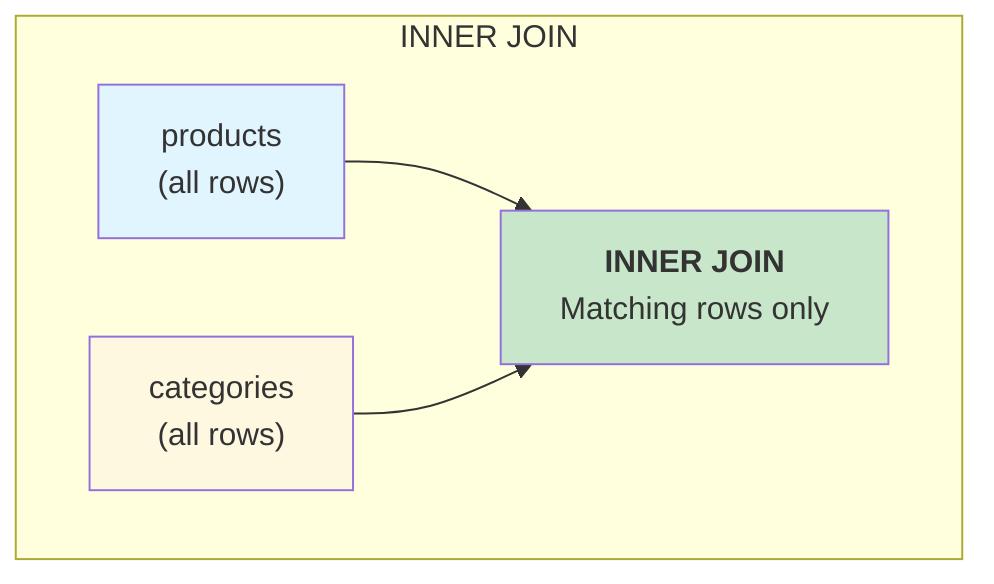
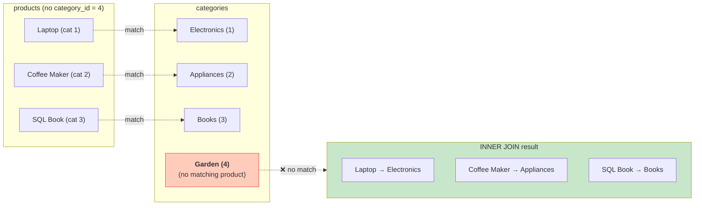

# 🗄️🤖 SQL & GenAI Course
**🎯 Quality Education for Anyone, Anywhere, Anytime — 💫 with Comfort, Convenience at no Cost**

## 📘 File 2: Inner Join – The Perfect Match

Welcome to the most common bridge in the SQLVerse: the **INNER JOIN**. You've learned what joins are and why we need them. Now you'll dive into this essential join type, which returns only the rows that have matching values in both tables – **the perfect match.** It is the **"Intersection"** of your data.

---

## 🧠 SQLVerse Architect's Truth

**Why `INNER JOIN`?** In the real world, you often want to see only the data that belongs together. When you ask *“Which customers placed orders?”*, you don't want to see customers who never ordered. `INNER JOIN` filters out the mismatches, leaving only the pairs that truly connect.

When you run an Inner Join, you are asking the database for **certainty**. You don't want "maybe" or "null" values. You want the products that *definitely* belong to a category.

> *“`INNER JOIN` is the loyal friend – it only shows you relationships that actually exist.”*

**In the Artisan's Garden, an Inner Join is a bouquet where every flower has a matching vase.**

---

### 📍 Your Current Stage – PREPARE Journey

```mermaid
flowchart LR
    A["✅ COMPLETED<br/>📘 File 1<br/>Intro to Joins"] --> B
    B["📍 YOU ARE HERE<br/>📘 File 2<br/>Inner Join"] --> C
    C["⏳ File 3<br/>Left Join"] --> D
    D["⏳ File 4<br/>Joining Multiple Tables"] --> E
    E["⏳ File 5<br/>Self Join"] --> F
    F["⏳ File 6<br/>Join Conditions"] --> G
    G["✅ PREPARE COMPLETE"] --> H
    H["🔄 RETURN TO MODULE GUIDE<br/>TO BEGIN PRACTICE SECTION"]
    
    style A fill:#e1f5fe,stroke:#4caf50,stroke-width:2px
    style B fill:#fff8e1,stroke:#ff9800,stroke-width:4px
    style C fill:#e1f5fe,stroke:#2196f3,stroke-width:2px
    style D fill:#e1f5fe,stroke:#2196f3,stroke-width:2px
    style E fill:#e1f5fe,stroke:#2196f3,stroke-width:2px
    style F fill:#e1f5fe,stroke:#2196f3,stroke-width:2px
    style G fill:#fff8e1,stroke:#ff9800,stroke-width:2px
    style H fill:#e8f5e8,stroke:#4caf50,stroke-width:2px
```



You've completed File 1. Now you'll master `INNER JOIN`.

---

## 🔧 Enhanced Browser Office for PREPARE

### 🔄 The Big Reveal – Database Swap

In Module 4, the roles of the two databases have reversed:

- **Normalized E‑Store** (`level1_estore_normalized_MODULE4.db`) → becomes the **demonstration database** (used for all concept file examples).  
  *(This database is located in the `1-sqlCommands/SQLVerse-Architects-Blueprint/` folder.)*
- **Training Institution** (`training_institution_sample.db`) → becomes the **practice database** (used for exercises in `2-practiceExercises/`).

This reversal reinforces the plot twist: you normalized the E‑Store in the Refactoring Lab, and now you'll use it to learn joins.

---

**🚀 Kickstart: Any Computer, Any Browser, Anytime.**  
**🌍 Destination: Any country, Any city, Any Platform.**

| Tab | Purpose | What to Do |
| :--- | :--- | :--- |
| **1: The Map** | Read concept files | You're here – reading this file. Next up: `3-LeftJoin.md`. |
| **2: The Factory** | Run queries | Keep the **Normalized E‑Store database** ([`level1_estore_normalized_MODULE4.db`](./SQLVerse-Architects-Blueprint/level1_estore_normalized_MODULE4.db)) loaded. Run every example query. |
| **3: The Consultant** | Conceptual Q&A | Ask about `INNER JOIN` syntax, matching logic, or why certain rows are excluded. Configure AI with Student Mode Prompt. |
| **4: The Vault** | Save your work | Save successful queries in: `Learning/Level-1-beginner/Level1-1-ACQUIRE/Module4-JoiningTables/1-sqlCommands/` |

---

### 🛠️ Module 4 Toolkit

🚀 Foundation First, AI Next, Projects Last.  
💎 Gemstone by Gemstone, Skill by Skill.

| | | | |
|---|---|---|---|
| **Browser Office** | 🔧 [Troubleshooting Common Issues](../../../Setup/STEP1_COMMISSION_BROWSER_OFFICE.md) | 🔄 [Browser Office Workflow](../../../Setup/STEP2_ESTABLISH_LEARNING_RITUAL.md) | ⌨️ [Tab Operations & Shortcuts](../../../Setup/STEP3_MASTER_TAB_OPERATIONS.md) |
| **ACQUIRE Section** | 🗄️ [Database Ecosystem](../../Guides/Section1-ACQUIRE/2_Database_Ecosystem.md) | 📚 [Knowledge Base (Vault)](../../Guides/Section1-ACQUIRE/3_Knowledge_Base.md) | 🧠 [Mindset Tuning](../../Guides/Section1-ACQUIRE/4_Mindset.md) |

---

## 🎯 What You'll Learn

By the end of this file, you will be able to:

- Write an `INNER JOIN` to combine rows from two tables.
- Understand that `INNER JOIN` returns only matching rows.
- Use table aliases to write cleaner, more readable joins.
- Combine `INNER JOIN` with `WHERE` to filter results.
- Recognize that `INNER JOIN` is the default and most common join type.

---

## 📊 Practice Tables: `products` and `categories`

We'll continue using the normalized E‑Store tables.

### `categories` Table

| category_id | category_name |
|-------------|---------------|
| 1           | Electronics   |
| 2           | Appliances    |
| 3           | Books         |

### `products` Table

| product_id | product_name      | price   | category_id |
|------------|-------------------|---------|-------------|
| 1          | Laptop            | 1200.00 | 1           |
| 2          | Coffee Maker      | 80.00   | 2           |
| 3          | SQL Essentials Book | 45.00 | 3           |
| 4          | Headphones        | 150.00  | 1           |
| 5          | Blender           | 60.00   | 2           |

---

## 🔍 Introducing INNER JOIN

`INNER JOIN` returns only the rows where the join condition is met. If a product has a `category_id` that doesn't exist in the `categories` table, that product would be excluded. If a category has no products, that category would be excluded.



The overlapping area represents the result of an `INNER JOIN` – rows that have a match in both tables.

---
## 🏗️ Visualizing the Inner Join

Think of two circles overlapping. The area where they cross is your result.

### 📝 The Syntax Breakdown

```sql
SELECT 
    p.product_name, 
    c.category_name
FROM products p
INNER JOIN categories c 
    ON p.category_id = c.category_id;
```

- **`FROM products p`** : We start with the `products` table (the "Left" table) and give it the alias `p`.
- **`INNER JOIN categories c`** : We bring in the `categories` table (the "Right" table) and alias it `c`.
- **`ON p.category_id = c.category_id`** : This is the logic. We only keep rows where the ID in `p` matches the ID in `c`.

---

## 📝 Your First INNER JOIN

Let's write an `INNER JOIN` to see each product with its category name.

```sql
SELECT p.product_name, c.category_name
FROM products p
INNER JOIN categories c ON p.category_id = c.category_id;
```

**Try it now in Tab 2.**

**What you're seeing:** Every product appears with its category name. Notice that all five products have valid `category_id` values, so all are included.

| product_name      | category_name |
|-------------------|---------------|
| Laptop            | Electronics   |
| Coffee Maker      | Appliances    |
| SQL Essentials Book | Books       |
| Headphones        | Electronics   |
| Blender           | Appliances    |

> 💡 **Note:** `INNER JOIN` is often written simply as `JOIN`. The `INNER` keyword is optional. So `FROM products JOIN categories ...` means the same thing.

---

## 💎 Artisan's Technique: Multi-Column Selection

You aren't limited to just two columns. You can pull any column from either table, as long as you use the alias to tell the database where to find it.

```sql
SELECT 
    p.product_id,
    p.product_name,
    p.price,
    c.category_name
FROM products p
INNER JOIN categories c 
    ON p.category_id = c.category_id
ORDER BY p.price DESC;
```

> 💡 **Artisan's Insight:** Notice how we can still use `ORDER BY` and `WHERE` just like before. The JOIN creates a "virtual table," and all your Module 2 skills apply to this new, combined view.

---
## ⚠️ The "Ambiguous Column" Error

One of the most common errors for beginners is: `ambiguous column name: category_id`.

This happens because `category_id` exists in **both** tables. If you just write `SELECT category_id`, the database gets confused – *“Do you want the ID from the product list or the category list?”*

**The Fix:** Always prefix with your alias: `p.category_id` or `c.category_id`.

```sql
-- This will cause an error
SELECT category_id FROM products p JOIN categories c ON p.category_id = c.category_id;

-- This works: tell the database which table's ID you want
SELECT p.category_id FROM products p JOIN categories c ON p.category_id = c.category_id;
```

> 💡 **Artisan’s Insight:** Always qualify column names with their table alias in joins. It prevents ambiguity and makes your intent clear to anyone reading your code.

---

## 🧪 Filtering an INNER JOIN

You can add a `WHERE` clause after the join to filter the results.

**Question:** Show me only products from the Electronics category.

```sql
SELECT p.product_name, c.category_name, p.price
FROM products p
JOIN categories c ON p.category_id = c.category_id
WHERE c.category_name = 'Electronics';
```

**Try it now in Tab 2.**

**What you're seeing:** Only Laptop and Headphones appear – both belong to Electronics.

| product_name | category_name | price |
|--------------|---------------|-------|
| Laptop       | Electronics   | 1200.00 |
| Headphones   | Electronics   | 150.00 |

**Reflect:** The `WHERE` clause filters the result of the join, not the original tables. This is a powerful pattern: join first, then filter.

---
## 🧪 Interactive Factory: The "Hidden" Data

Let's see the "Exclusion" rule in action. First, add a new category called **'Garden'** to the `categories` table.

```sql
INSERT INTO categories (category_id, category_name)
VALUES (4, 'Garden');
```

**Try it now in Tab 2.** Now run an `INNER JOIN` that shows all products with their category names.

```sql
SELECT p.product_name, c.category_name
FROM products p
JOIN categories c ON p.category_id = c.category_id;
```

**What you're seeing:** The 'Garden' category does **not** appear in the results. Why? Because there is no product with `category_id = 4`. The bridge cannot be built if one side is missing.



**Clean up:** Now remove the 'Garden' category so it doesn't affect later examples.

```sql
DELETE FROM categories WHERE category_id = 4;
```

**Try it now.** Now the `categories` table is back to its original state.

> 💎 **Artisan’s Insight:** `INNER JOIN` is strict – it only returns rows that have a complete connection. This is great for reports where missing data would be misleading, but be careful: you might lose information about categories that exist but have no products.

---

## 🧪 Joining More Than Two Tables

You can chain multiple `INNER JOIN`s. For example, to see products with their categories and also their order information, you would join `products` with `categories` and then with `order_items`. We'll explore this in File 4. For now, remember that `INNER JOIN` only returns rows that have matches in **all** joined tables.

---

## ⚠️ Common Mistakes

### Mistake 1: Forgetting the `ON` clause
```sql
-- Wrong: cartesian product (every row × every row)
SELECT p.product_name, c.category_name
FROM products p
JOIN categories c;
```
> 🔧 **Fix:** Always specify the join condition with `ON`.

### Mistake 2: Using the wrong column in `ON`
```sql
-- Wrong: joining on product_id (which doesn't exist in categories)
SELECT p.product_name, c.category_name
FROM products p
JOIN categories c ON p.product_id = c.category_id;
```
> 🔧 **Fix:** Use the foreign key column (`category_id`) that exists in both tables.

### Mistake 3: Assuming `INNER JOIN` includes unmatched rows
`INNER JOIN` excludes rows without a match. If you need to keep unmatched rows, you'll use `LEFT JOIN` (File 3).

---

## 🧪 Practice Challenges


**Challenge 1: The Appliances Filter**  
Write an Inner Join that only shows products belonging to the 'Appliances' category.  
*Save as:* `4-2-1-inner-appliances.sql`

**Challenge 2: The Budget Artisan**  
Show the `product_name` and `category_name` for all products that cost less than $100, sorted by price.  
*Save as:* `4-2-2-budget-inner.sql`

**Challenge 3: The Category Count**  
Show each category and the number of products in it. Use an `INNER JOIN` and `GROUP BY`.  
*Save as:* `4-2-3-category-count.sql`

**Challenge 4: The Expensive Electronics**  
Show products from the 'Electronics' category that cost more than $100. Display `product_name`, `price`, and `category_name`.  
*Save as:* `4-2-4-expensive-electronics.sql`

**Challenge 5: The Product Inventory Report**  
Create a report that shows `product_name`, `price`, and `category_name`. Sort by category name, then by price descending.  
*Save as:* `4-2-5-inventory-report.sql`

**Challenge 6: The Missing Match**  
Add a new category 'Luxury' (ID: 4) to the `categories` table. Then run an `INNER JOIN` that shows all products with their category names. Does 'Luxury' appear? Why not? Then delete the 'Luxury' category.  
*Save as:* `4-2-6-missing-match.sql`

---

## 📋 INNER JOIN Quick Reference Card

### Syntax

```sql
SELECT columns
FROM table1
[INNER] JOIN table2 ON table1.foreign_key = table2.primary_key
WHERE condition;
```

### Key Points

| Concept | Explanation |
|---------|-------------|
| **`INNER` is optional** | `JOIN` alone means `INNER JOIN`. |
| **Only matches** | Rows without a match in either table are excluded. |
| **Order doesn't matter** | `table1 JOIN table2` is the same as `table2 JOIN table1`. |
| **Filtering** | `WHERE` runs after the join. |

**Memory Aid:**  
> *“`INNER JOIN` is the matchmaker – it only introduces you to people who share your interests.”*

**Save this reference in your Vault as:** `4-inner-join-refcard.md`

---

## ✅ Progress Check

After reading this and trying the examples, can you:

- [ ] Write an `INNER JOIN` query to combine two tables?
- [ ] Explain what happens to rows that don't have a match?
- [ ] Filter the result of a join using `WHERE`?
- [ ] Use table aliases to make your queries shorter?
- [ ] Save your working queries in your Vault?

**If yes → You're ready for File 3: Left Join!**

---

## 💎 DESIGNER'S PERIGON

<div style="border: 3px solid #9c27b0; border-radius: 10px; padding: 20px; margin: 25px 0; background: linear-gradient(135deg, #f3e5f5 0%, #e1bee7 100%);">

### *The Art of the Perfect Match*
`INNER JOIN` is the most common join you'll write. It answers questions like *“Which customers actually bought a powerbank along with a smartphone?”* and *“Which customers ordered breakfast with coffee on weekends?”* It cuts through the noise and shows you only the relationships that exist.

In the **SQLVerse**, `INNER JOIN` is the loyal friend – it never shows you a promise without a delivery.

- On **HR Planet**, the inner join is used to find: *“Which candidates have cleared the third round of interview?”*
- On **Banking Planet**, the inner join gives you the list of: *“Customers who have spent more than $5000 with their credit cards.”*
- On **Tourism Planet**, the inner join gives you the list of: *"Customers who have booked Deluxe room with Spa service. "*

In the Artisan's Garden, `INNER JOIN` is picking flowers with varying shades of the same hue to complement each other.

> *“`INNER JOIN` tells the truth, but only the whole truth. It leaves out the stories that never began.”*

**The SQLVerse expands. Go build perfect matches.**


</div>

---

## 🧭 File Navigation


| Previous Step | Next Step |
|:---:|:---:|
| [← Back to File 1: Intro to Joins](./1-IntroToJoins.md) | [Continue to File 3: Left Join →](./3-LeftJoin.md) |

---

*Part of our mission for 🎯 Quality Education for Anyone, Anywhere, Anytime — 💫 with Comfort, Convenience at no Cost.*

**Level 1 | Module 4 | File 2: Inner Join | Next: [Left Join](./3-LeftJoin.md)**