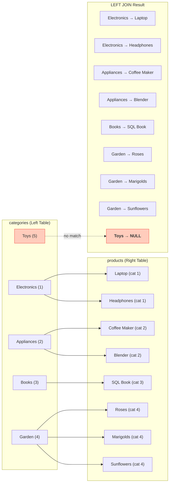

# 🗄️🤖 SQL & GenAI Course
**🎯 Quality Education for Anyone, Anywhere, Anytime — 💫 with Comfort, Convenience at no Cost**

## 📘 File 3: Left Join – The Inclusive Bridge

Welcome to the third concept file of Module 4. You've mastered `INNER JOIN` – the perfect match. But what if you want to keep **all** rows from one table, even when there's no match in the other? That's where `LEFT JOIN` comes in. It's the inclusive bridge that never leaves anyone behind.

Welcome to the bridge of **Inclusion**. While the `INNER JOIN` is a strict matchmaker, the **LEFT JOIN** (or `LEFT OUTER JOIN`) is more generous. It says: *"Give me everything from my main list (the Left table), and if there's a match in the second list (the Right table), show it. If not, just leave it blank."*

In the SQLVerse, this is how we find the **"Gaps"** – the customers who haven't ordered yet, or the categories that don't have any products.

---

## 🧠 SQLVerse Architect's Truth

**Why `LEFT JOIN`?** In the real world, you often need to see everything from a primary table, regardless of whether it has related data. When you ask *“List all customers, even those who never placed an order”*, `INNER JOIN` would exclude them. `LEFT JOIN` keeps them.

Imagine you are running an inventory report. You need to see **every** category you've created, even the new ones that don't have products yet. If you use an `INNER JOIN`, those empty categories vanish. With a `LEFT JOIN`, they stay on the map, marked with a `NULL` where the product info should be.

`LEFT JOIN` returns **all rows from the left table**, even if there is no match in the right table. Missing values from the right table appear as `NULL`.

> *“`LEFT JOIN` is the generous host – it sets a place at the table for everyone, even if they show up alone.”*

> *“`LEFT JOIN` is the compassionate narrator – it tells the whole story of the left side, even the parts that haven't found a partner yet.”*

**In the Artisan's Garden, a `LEFT JOIN` is a flower bed that includes every stem, even those that haven't yet bloomed.** The empty spaces are not mistakes – they are **missing information**.

---

### 📍 Your Current Stage – PREPARE Journey

```mermaid
flowchart LR
    A["✅ COMPLETED<br/>📘 File 1<br/>Intro to Joins"] --> B
    B["✅ COMPLETED<br/>📘 File 2<br/>Inner Join"] --> C
    C["📍 YOU ARE HERE<br/>📘 File 3<br/>Left Join"] --> D
    D["⏳ File 4<br/>Joining Multiple Tables"] --> E
    E["⏳ File 5<br/>Self Join"] --> F
    F["⏳ File 6<br/>Join Conditions"] --> G
    G["✅ PREPARE COMPLETE"] --> H
    H["🔄 RETURN TO MODULE GUIDE<br/>TO BEGIN PRACTICE SECTION"]
    
    style A fill:#e1f5fe,stroke:#4caf50,stroke-width:2px
    style B fill:#c8e6c9,stroke:#4caf50,stroke-width:2px
    style C fill:#fff8e1,stroke:#ff9800,stroke-width:4px
    style D fill:#e1f5fe,stroke:#2196f3,stroke-width:2px
    style E fill:#e1f5fe,stroke:#2196f3,stroke-width:2px
    style F fill:#e1f5fe,stroke:#2196f3,stroke-width:2px
    style G fill:#fff8e1,stroke:#ff9800,stroke-width:2px
    style H fill:#e8f5e8,stroke:#4caf50,stroke-width:2px
```



You've mastered `INNER JOIN`. Now you'll learn the inclusive `LEFT JOIN`.

---

## 🔧 Enhanced Browser Office for PREPARE

### 🔄 The Big Reveal – Database Swap

In Module 4, the roles of the two databases have reversed:

- **Normalized E‑Store** (`level1_estore_normalized_MODULE4.db`) → becomes the **demonstration database** (used for all concept file examples).  
  *(This database is located in the `1-sqlCommands/SQLVerse-Architects-Blueprint/` folder.)*
- **Training Institution** (`training_institution_sample.db`) → becomes the **practice database** (used for exercises in `2-practiceExercises/`).

This reversal reinforces the plot twist: you normalized the E‑Store in the Refactoring Lab, and now you'll use it to learn joins.

---

**🚀 Kickstart: Any Computer, Any Browser, Anytime.**  
**🌍 Destination: Any country, Any city, Any Platform.**

| Tab | Purpose | What to Do |
| :--- | :--- | :--- |
| **1: The Map** | Read concept files | You're here – reading this file. Next up: `4-JoiningMultipleTables.md`. |
| **2: The Factory** | Run queries | Keep the **Normalized E‑Store database** ([`level1_estore_normalized_MODULE4.db`](./SQLVerse-Architects-Blueprint/level1_estore_normalized_MODULE4.db)) loaded. Run every example query. |
| **3: The Consultant** | Conceptual Q&A | Ask about `LEFT JOIN`, why some rows appear with NULLs, or how to find orphaned records. Configure AI with Student Mode Prompt. |
| **4: The Vault** | Save your work | Save successful queries in: `Learning/Level-1-beginner/Level1-1-ACQUIRE/Module4-JoiningTables/1-sqlCommands/` |

---

### 🛠️ Module 4 Toolkit

🚀 Foundation First, AI Next, Projects Last.  
💎 Gemstone by Gemstone, Skill by Skill.

| | | | |
|---|---|---|---|
| **Browser Office** | 🔧 [Troubleshooting Common Issues](../../../Setup/STEP1_COMMISSION_BROWSER_OFFICE.md) | 🔄 [Browser Office Workflow](../../../Setup/STEP2_ESTABLISH_LEARNING_RITUAL.md) | ⌨️ [Tab Operations & Shortcuts](../../../Setup/STEP3_MASTER_TAB_OPERATIONS.md) |
| **ACQUIRE Section** | 🗄️ [Database Ecosystem](../../Guides/Section1-ACQUIRE/2_Database_Ecosystem.md) | 📚 [Knowledge Base (Vault)](../../Guides/Section1-ACQUIRE/3_Knowledge_Base.md) | 🧠 [Mindset Tuning](../../Guides/Section1-ACQUIRE/4_Mindset.md) |

---

## 🎯 What You'll Learn

By the end of this file, you will be able to:

- Write a `LEFT JOIN` to include all rows from the left table, even when there's no match in the right table.
- Understand the difference between `INNER JOIN` and `LEFT JOIN`.
- Identify which table is the "left" table (the one you keep all rows from).
- Handle `NULL` results that appear when no match exists.
- Find orphaned records (rows in the left table with no corresponding match in the right table).

---
## 🏗️ Visualizing the Left Join

In a `LEFT JOIN`, the table mentioned **first** (after the `FROM` clause) is the "Left" table. It is the dominant table. All its rows will appear in the final result at least once.

### 📝 The Syntax

```sql
SELECT 
    c.category_name, 
    p.product_name
FROM categories c
LEFT JOIN products p 
    ON c.category_id = p.category_id;
```

- **`FROM categories c`** : `categories` is our **Left Table**. We want to see every single category.
- **`LEFT JOIN products p`** : `products` is our **Right Table**.
- **The Result** : If a category has no products, `product_name` will show as `NULL`.

---

## 🧪 Interactive Factory: The "Missing" Data

Let's see `LEFT JOIN` in action. We'll add two new categories: `Garden` (with products) and `Toys` (without products).

**Step 1: Add the New Categories**

```sql
INSERT INTO categories (category_id, category_name)
VALUES 
    (4, 'Garden'),
    (5, 'Toys');
```

**Step 2: Add Products for the Garden Category**

```sql
INSERT INTO products (product_id, product_name, price, category_id)
VALUES 
    (6, 'Roses', 15.00, 4),
    (7, 'Marigolds', 10.00, 4),
    (8, 'Sunflowers', 12.00, 4);
```

**Step 3: Run the Inclusive Bridge**

```sql
SELECT c.category_name, p.product_name
FROM categories c
LEFT JOIN products p ON c.category_id = p.category_id
ORDER BY c.category_id;
```

**Try it now in Tab 2.**

**What you're seeing:**

| category_name | product_name |
| :--- | :--- |
| Electronics | Laptop |
| Electronics | Headphones |
| Appliances | Coffee Maker |
| Appliances | Blender |
| Books | SQL Essentials Book |
| **Garden** | **Roses** |
| **Garden** | **Marigolds** |
| **Garden** | **Sunflowers** |
| **Toys** | **NULL** |

**Observation:** 
- The `Garden` category appears with its three products.
- The `Toys` category appears with a `NULL` – it exists in the `categories` table but has no matching products.
- In an `INNER JOIN`, `Toys` would have been completely excluded. Here, the `NULL` tells us: *"The category exists, but the 'products' bridge led to a dead end."*



> 💎 **Artisan’s Insight:** Use `LEFT JOIN` when you want to keep every row from the main table, even if the related data is missing. Use `INNER JOIN` when you only want rows that have a complete connection.

---

## 💎 Artisan's Technique: The "IS NULL" Trick

This is a professional secret. `LEFT JOIN` is the most powerful tool for **finding what is missing**.

**Question:** *"Which categories have ZERO products?"*

```sql
SELECT c.category_name
FROM categories c
LEFT JOIN products p ON c.category_id = p.category_id
WHERE p.product_id IS NULL;
```

**Try it now in Tab 2.** (Using the data we added – `Toys` should appear.)

**What you're seeing:** Only the `Toys` category appears – because it has no matching products.

> 💡 **Artisan's Insight:** By joining and then filtering for `NULL` values in the right‑hand table, you can instantly generate a "To‑Do" list of empty categories, customers who haven't placed an order, or products without a category.

> *“`LEFT JOIN` tells you what's missing. `WHERE right_table.id IS NULL` gives you the list of orphans.”*

---
## ⚠️ Common Mistakes: The "Where" Trap

This is a classic trap. If you use a `LEFT JOIN` but then put a condition on the **Right** table in the `WHERE` clause, you accidentally turn it back into an `INNER JOIN`.

**The Trap:**
```sql
SELECT c.category_name, p.product_name
FROM categories c
LEFT JOIN products p ON c.category_id = p.category_id
WHERE p.price > 50; -- THIS TRAP REMOVES THE NULLS!
```
Because `NULL` is not greater than 50, the 'Toys' category will disappear again. 

**The Fix:** If you need to filter the right table while keeping the left rows, put the condition inside the `ON` clause (Advanced) or accept that `NULL`s will be filtered out.

---

## 🧪 Practice Challenges

**Challenge 1: The Empty Shelves**  
Show all categories, including those with no products. Display `category_name` and the count of products in each category (categories with no products should show 0).  
*Save as:* `4-3-1-empty-shelves.sql`

**Challenge 2: The Customer Contact List**  
Show all customers, even those who never placed an order. Display `name`, `email`, and `order_id` (which will be NULL for customers with no orders).  
*Hint: Use `customers` and `orders` tables.*  
*Save as:* `4-3-2-customer-contact.sql`

**Challenge 3: The Orphan Hunt**  
Find customers who have never placed an order. Display their `name` and `email`.  
*Save as:* `4-3-3-orphan-customers.sql`

**Challenge 4: The Product Audit**  
Show all products with their category names. If a product has no category (should not happen in our normalized schema, but imagine), show `NULL` as the category name.  
*Save as:* `4-3-4-product-audit.sql`

**Challenge 5: The Category Product List**  
Show each category and the list of product names in that category (as a comma‑separated list). Use `GROUP_CONCAT` (a SQLite function) to combine product names.  
*Save as:* `4-3-5-category-product-list.sql`

**Challenge 6: The Full Category List**  
Write a query to show all categories and their products. Ensure categories with no products are still listed (with `NULL` in the product column).  
*Save as:* `4-3-1-all-categories.sql`

**Challenge 7: The "Ghost" Categories**  
Use the `IS NULL` trick to find only the categories that currently have no products assigned to them.  
*Save as:* `4-3-2-empty-categories.sql`

---

## 📋 LEFT JOIN Quick Reference Card


### Syntax

```sql
SELECT columns
FROM left_table
LEFT JOIN right_table ON left_table.foreign_key = right_table.primary_key;
```

### Key Rules

| Rule | Description |
| :--- | :--- |
| **Dominance** | The table in the `FROM` clause is the "Left" and stays intact. |
| **NULLs** | When no match is found on the Right, the columns show as `NULL`. |
| **Purpose** | Used for comprehensive lists and finding missing data. |

**Memory Aid:**  
> *“`LEFT JOIN` leaves nothing behind on the left.”*

### Key Points

| Concept | Explanation |
|---------|-------------|
| **All rows from left** | Every row in the left table appears at least once. |
| **NULL for missing** | Columns from the right table are `NULL` when no match exists. |
| **Order matters** | `LEFT JOIN` is **not** symmetric – swapping tables changes results. |
| **Orphan detection** | `WHERE right_table.id IS NULL` finds left rows with no match. |

**Save this reference in your Vault as:** `4-left-join-refcard.md`

---

## 🧹 Optional Cleanup

If you want to restore the database to its original state (without the `Garden` and `Toys` categories and their products), run these commands:

```sql
DELETE FROM categories WHERE category_id IN (4, 5);
DELETE FROM products WHERE product_id IN (6, 7, 8);
```

> 💡 **Note:** You can skip this step if you want to keep the new data for further practice. The rest of the module's examples will still work fine.

---

## ✅ Progress Check

After reading this and trying the examples, can you:

- [ ] Write a `LEFT JOIN` query to include all rows from the left table?
- [ ] Explain what happens to right‑table columns when there's no match?
- [ ] Identify which table is the "left" table in a `LEFT JOIN`?
- [ ] Find orphaned records using `WHERE right_table.id IS NULL`?
- [ ] Save your working queries in your Vault?

**If yes → You're ready for File 4: Joining Multiple Tables!**

---

## 💎 DESIGNER'S PERIGON

<div style="border: 3px solid #9c27b0; border-radius: 10px; padding: 20px; margin: 25px 0; background: linear-gradient(135deg, #f3e5f5 0%, #e1bee7 100%);">

### *The Art of Inclusion*

`LEFT JOIN` is the join that never leaves anyone behind. It answers questions like *“Which customers never ordered?”* and *“Which categories have no products?”* It shows you the full picture, including the gaps.

In the **SQLVerse**, `LEFT JOIN` is the generous host – it sets a place at the table for everyone, even if they show up alone.

- On **HR Planet**, a `LEFT JOIN` might find: *“Which departments have no employees assigned?”*
- On **Banking Planet**, it could reveal: *“Which customers have never taken a loan?”*
- On **Tourism Planet**, it might list: *“Which hotels have no bookings this month?”*

In the Artisan's Garden:

- `INNER JOIN` is a **monochromatic bouquet** – pure, focused, and perfect in its simplicity.
- `LEFT JOIN` is a bouquet with **varying shades of the chosen color** to add dimension and interest. This includes incorporating both lighter and darker hues. Even if a flower bed has not bloomed, the **stems** are included in the bouquet, providing **contrast** and helping the **primary color pop.**

> *“`LEFT JOIN` tells the whole truth, including the silence. It reveals not just what exists, but what is missing.”*

**The SQLVerse expands. Go build inclusive bridges.**

</div>

---

## 🧭 File Navigation

```mermaid
flowchart LR
    A["✅ COMPLETED<br/>📘 File 1<br/>Intro to Joins"] --> B
    B["✅ COMPLETED<br/>📘 File 2<br/>Inner Join"] --> C
    C["✅ COMPLETED<br/>📘 File 3<br/>Left Join"] --> D
    D["⏳ File 4<br/>Joining Multiple Tables"] --> E
    E["⏳ File 5<br/>Self Join"] --> F
    F["⏳ File 6<br/>Join Conditions"] --> G
    G["✅ PREPARE COMPLETE"] --> H
    H["🔄 RETURN TO MODULE GUIDE<br/>TO BEGIN PRACTICE SECTION"]
    
    style A fill:#e1f5fe,stroke:#4caf50,stroke-width:2px
    style B fill:#c8e6c9,stroke:#4caf50,stroke-width:2px
    style C fill:#c8e6c9,stroke:#4caf50,stroke-width:2px
    style D fill:#fff8e1,stroke:#ff9800,stroke-width:4px
    style E fill:#fff8e1,stroke:#ff9800,stroke-width:2px
    style F fill:#fff8e1,stroke:#ff9800,stroke-width:2px
    style G fill:#fff8e1,stroke:#ff9800,stroke-width:2px
    style H fill:#e8f5e8,stroke:#4caf50,stroke-width:2px
```



| Previous Step | Next Step |
|:---:|:---:|
| [← Back to File 2: Inner Join](./2-InnerJoin.md) | [Continue to File 4: Joining Multiple Tables →](./4-JoiningMultipleTables.md) |

---

*Part of our mission for 🎯 Quality Education for Anyone, Anywhere, Anytime — 💫 with Comfort, Convenience at no Cost.*

**Level 1 | Module 4 | File 3: Left Join | Next: [Joining Multiple Tables](./4-JoiningMultipleTables.md)**