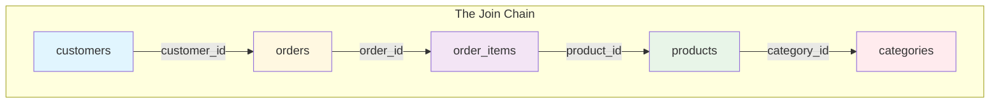

# 🗄️🤖 SQL & GenAI Course
**🎯 Quality Education for Anyone, Anywhere, Anytime — 💫 with Comfort, Convenience at no Cost**

## 📘 File 4: Joining Multiple Tables – The Art of the Chain

Welcome to the fourth concept file - the **architectural peak** of Module 4 . You've mastered joining two tables with `INNER JOIN` and `LEFT JOIN`. But the real world rarely stops at two tables.  Rare is the business question that can be answered by looking at just two tables.


 A customer places an order. That order contains items. Each item is a product. Each product belongs to a category. To answer questions like *"Which customers bought products from the Electronics category?"*, you need to **chain multiple joins** together in a single query – a **join chain**. 

Chaining joins is like building a **supply chain**. You connect Table A to Table B, and then use Table B as the platform to connect to Table C. **Chaining joins** is the art of the **assembly line**—each join adds a new layer of detail until the **full picture** emerges.

---

## 🧠 SQLVerse Architect's Truth

You’ve mastered the **Inner Join** (The Matchmaker) and the **Left Join** (The Inclusive Bridge). Now, it’s time to **Chain the Bridges**. Data **normalization** (which you did in the Refactoring Lab) **breaks data** apart to keep it clean. **Joining** is how we bring it back together to tell a **complete story.**

**Why join multiple tables?** In a normalized database, information is spread across many small tables. To answer business questions, you often need to walk through a chain of relationships: `customers` → `orders` → `order_items` → `products` → `categories`.

Each `JOIN` adds a new link to your chain, extending your reach across the database. The longer the chain, the more complete your picture becomes.

> *“A single join connects two tables. A chain of joins connects an entire database.”*

---

### 📍 Your Current Stage – PREPARE Journey


You've mastered two‑table joins. Now you'll learn to chain multiple joins.

---

## 🔧 Enhanced Browser Office for PREPARE

### 🔄 The Big Reveal – Database Swap

In Module 4, the roles of the two databases have reversed:

- **Normalized E‑Store** (`level1_estore_normalized_MODULE4.db`) → becomes the **demonstration database** (used for all concept file examples).  
  *(This database is located in the `1-sqlCommands/SQLVerse-Architects-Blueprint/` folder.)*
- **Training Institution** (`training_institution_sample.db`) → becomes the **practice database** (used for exercises in `2-practiceExercises/`).

This reversal reinforces the plot twist: you normalized the E‑Store in the Refactoring Lab, and now you'll use it to learn joins.

---

**🚀 Kickstart: Any Computer, Any Browser, Anytime.**  
**🌍 Destination: Any country, Any city, Any Platform.**

| Tab | Purpose | What to Do |
| :--- | :--- | :--- |
| **1: The Map** | Read concept files | You're here – reading this file. Next up: `5-SelfJoin.md`. |
| **2: The Factory** | Run queries | Keep the **Normalized E‑Store database** ([`level1_estore_normalized_MODULE4.db`](./SQLVerse-Architects-Blueprint/level1_estore_normalized_MODULE4.db)) loaded. Run every example query. |
| **3: The Consultant** | Conceptual Q&A | Ask about multi‑table joins, join order, or why a query returns unexpected results. Configure AI with Student Mode Prompt. |
| **4: The Vault** | Save your work | Save successful queries in: `Learning/Level-1-beginner/Level1-1-ACQUIRE/Module4-JoiningTables/1-sqlCommands/` |

---

### 🛠️ Module 4 Toolkit

🚀 Foundation First, AI Next, Projects Last.  
💎 Gemstone by Gemstone, Skill by Skill.

| | | | |
|---|---|---|---|
| **Browser Office** | 🔧 [Troubleshooting Common Issues](../../../Setup/STEP1_COMMISSION_BROWSER_OFFICE.md) | 🔄 [Browser Office Workflow](../../../Setup/STEP2_ESTABLISH_LEARNING_RITUAL.md) | ⌨️ [Tab Operations & Shortcuts](../../../Setup/STEP3_MASTER_TAB_OPERATIONS.md) |
| **ACQUIRE Section** | 🗄️ [Database Ecosystem](../../Guides/Section1-ACQUIRE/2_Database_Ecosystem.md) | 📚 [Knowledge Base (Vault)](../../Guides/Section1-ACQUIRE/3_Knowledge_Base.md) | 🧠 [Mindset Tuning](../../Guides/Section1-ACQUIRE/4_Mindset.md) |

---

## 🔄 Dynamic Data Check

The join examples in this file assume the `Garden` and `Toys` categories (with their products) exist. If you have reloaded your database or the data is missing, run this script:

```sql
-- Ensure dynamic data exists
INSERT OR IGNORE INTO categories (category_id, category_name)
VALUES (4, 'Garden'), (5, 'Toys');

INSERT OR IGNORE INTO products (product_id, product_name, price, category_id)
VALUES 
    (6, 'Roses', 15.00, 4),
    (7, 'Marigolds', 10.00, 4),
    (8, 'Sunflowers', 12.00, 4);
```

> 💡 `INSERT OR IGNORE` prevents duplicate key errors if the data already exists.

After running the check, here are the relevant tables (dynamic rows in **bold**):

### `categories` Table

| category_id | category_name |
|-------------|---------------|
| 1           | Electronics   |
| 2           | Appliances    |
| 3           | Books         |
| **4**       | **Garden**    |
| **5**       | **Toys**      |

### `products` Table

| product_id | product_name      | price   | category_id |
|------------|-------------------|---------|-------------|
| 1          | Laptop            | 1200.00 | 1           |
| 2          | Coffee Maker      | 80.00   | 2           |
| 3          | SQL Essentials Book | 45.00 | 3           |
| 4          | Headphones        | 150.00  | 1           |
| 5          | Blender           | 60.00   | 2           |
| **6**      | **Roses**         | **15.00**   | **4**       |
| **7**      | **Marigolds**     | **10.00**   | **4**       |
| **8**      | **Sunflowers**    | **12.00**   | **4**       |

> 💡 **Note:** Only `categories` and `products` are shown here. Other tables (`customers`, `orders`, `order_items`) remain unchanged from their original state.

---

## 🎯 What You'll Learn

By the end of this file, you will be able to:

- Join three or more tables in a single query.
- Understand the order of joins (the chain).
- Use table aliases to keep multi‑table joins readable.
- Combine `WHERE`, `GROUP BY`, and `ORDER BY` with multi‑table joins.

---

## 📊 Practice Tables: The E‑Store Schema

Here are all the tables you'll be working with in this file:

- **`customers`** – customer information (name, email, city, phone)
- **`orders`** – orders placed by customers (order_id, customer_id, order_date)
- **`order_items`** – items within each order (order_id, product_id, quantity)
- **`products`** – product details (product_id, product_name, price, category_id)
- **`categories`** – category names (category_id, category_name)

> 💡 **Key Insight:** The chain is: `customers` → `orders` → `order_items` → `products` → `categories`. Each step uses a foreign key to link to the next table.

---

## 🔍 Introducing Multi‑Table Joins

Imagine you want to answer: *“Which customers bought products from the Electronics category?”*

To answer this, you need to travel through the chain:
1. Start with `customers`.
2. Join to `orders` (via `customer_id`).
3. Join to `order_items` (via `order_id`).
4. Join to `products` (via `product_id`).
5. Join to `categories` (via `category_id`).
6. Filter where `category_name = 'Electronics'`.

A single join can't do this. You need a **join chain**.

---
## 🏗️ The Blueprint for Chaining

When joining multiple tables, the syntax simply repeats the `JOIN` and `ON` pattern. Think of it as a **logical train**:

```sql
SELECT 
    c.customer_name, 
    o.order_date, 
    p.product_name,
    cat.category_name
FROM customers c
JOIN orders o ON c.customer_id = o.customer_id       -- Bridge 1
JOIN order_items oi ON o.order_id = oi.order_id     -- Bridge 2
JOIN products p ON oi.product_id = p.product_id     -- Bridge 3
JOIN categories cat ON p.category_id = cat.category_id; -- Bridge 4
```

### 🗝️ Key Rules for the Great Connection:

1. **Follow the Foreign Keys:** You can only join tables that share a common column. You can't join `customers` directly to `categories` because they have no direct relationship. You must go through `orders` and `products`.
2. **Aliases are Non-Negotiable:** When you have 4 or 5 tables, using aliases (like `c`, `o`, `p`) is the only way to keep your sanity and avoid "Ambiguous Column" errors.
3. **The Order Matters (Sometimes):** If you are using `INNER JOIN`, the order of tables doesn't change the result. If you mix in a `LEFT JOIN`, the order determines which data stays and which data might become `NULL`.

---

## 🏗️ The Join Chain



Each arrow represents a `JOIN`. The chain starts at `customers` and ends at `categories`. Every table in between is linked by a foreign key.

---

## 📝 Your First Multi‑Table Join

Let's write the query that answers: *“Which customers bought products from the Electronics category?”*

```sql
SELECT DISTINCT c.name AS customer_name
FROM customers c
JOIN orders o ON c.customer_id = o.customer_id
JOIN order_items oi ON o.order_id = oi.order_id
JOIN products p ON oi.product_id = p.product_id
JOIN categories cat ON p.category_id = cat.category_id
WHERE cat.category_name = 'Electronics';
```

**Try it now in Tab 2.**

**What you're seeing:** A list of customers who have purchased at least one product from the Electronics category.

| customer_name |
|---------------|
| Alice Smith   |
| Bob Johnson   |
| David Kim     |
| Eva Gomez     |
| ... (and others) |

> 💡 **Note:** `DISTINCT` is used because a customer might have bought multiple Electronics products. We only want each customer once.

---
## 🧪 Interactive Factory: The Full E-Store Report

Let's run a query that connects almost every table in our Normalized E-Store to see exactly what is happening in our business.

**The Mission:** Generate a report showing Customer Name, Order Date, Product Name, and the Category of that product.

```sql
SELECT 
    cust.customer_name,
    ord.order_date,
    prod.product_name,
    cat.category_name
FROM customers cust
JOIN orders ord ON cust.customer_id = ord.customer_id
JOIN order_items oi ON ord.order_id = oi.order_id
JOIN products prod ON oi.product_id = prod.product_id
JOIN categories cat ON prod.category_id = cat.category_id
ORDER BY ord.order_date DESC;
```

**Try it now in Tab 2.**

**What you're seeing:** A unified view of your business. The database has "sewn" together five different tables in milliseconds to give you a human-readable report.

-----

## 💎 Artisan's Technique: Readability with Aliases

Notice how we used short aliases:
- `c` for `customers`
- `o` for `orders`
- `oi` for `order_items`
- `p` for `products`
- `cat` for `categories`

This makes the query shorter and easier to read. Without aliases, the query would be much longer and harder to follow.

```sql
-- Without aliases (harder to read)
SELECT DISTINCT customers.name
FROM customers
JOIN orders ON customers.customer_id = orders.customer_id
JOIN order_items ON orders.order_id = order_items.order_id
JOIN products ON order_items.product_id = products.product_id
JOIN categories ON products.category_id = categories.category_id
WHERE categories.category_name = 'Electronics';
```

> 💡 **Artisan's Insight:** Always use meaningful aliases. One or two letters are fine for short queries; for longer queries, slightly longer aliases (like `cust` or `cat`) can help.

---

## 🧪 Filtering a Multi‑Table Join

You can add `WHERE`, `GROUP BY`, and `ORDER BY` just like you did with single‑table queries.

**Question:** *“What is the total revenue from Electronics products, grouped by customer?”*

```sql
SELECT c.name, SUM(oi.quantity * p.price) AS total_spent
FROM customers c
JOIN orders o ON c.customer_id = o.customer_id
JOIN order_items oi ON o.order_id = oi.order_id
JOIN products p ON oi.product_id = p.product_id
JOIN categories cat ON p.category_id = cat.category_id
WHERE cat.category_name = 'Electronics'
GROUP BY c.customer_id
ORDER BY total_spent DESC;
```

**Try it now in Tab 2.**

**What you're seeing:** Customers who bought Electronics products, with their total spending, sorted from highest to lowest.

| name          | total_spent |
|---------------|-------------|
| Alice Smith   | 1350.00     |
| Bob Johnson   | 0.00? Wait, Bob bought Coffee Maker (Appliances), not Electronics. He won't appear. |

Notice that customers who never bought Electronics products don't appear at all – because we used `INNER JOIN` throughout the chain.

---
## 🔗 The "Weak Link" Risk – When the Chain Breaks

When chaining `INNER JOIN`s, every link in the chain must hold. If any table in the chain has no matching row, the entire record disappears from your results.

### ❌ The Problem Query

Suppose you want to see all categories and their products. You use an `INNER JOIN`:

```sql
SELECT c.category_name, p.product_name
FROM categories c
JOIN products p ON c.category_id = p.category_id;
```

**What's wrong?** The `Toys` category has no products. Because we used `INNER JOIN`, `Toys` is completely excluded from the results. The query silently filters out categories that have no products.

### ✅ The Correct Query

To keep all categories (even those with no products), use `LEFT JOIN`:

```sql
SELECT c.category_name, p.product_name
FROM categories c
LEFT JOIN products p ON c.category_id = p.category_id;
```

**What you're seeing:** Every category appears. `Toys` appears with `NULL` in the `product_name` column.

### 📊 Visual Comparison

**Query 1: INNER JOIN (Toys is excluded)**

```sql
SELECT c.category_name, p.product_name
FROM categories c
JOIN products p ON c.category_id = p.category_id;
```

| category_name | product_name |
|---------------|--------------|
| Electronics   | Laptop       |
| Electronics   | Headphones   |
| Appliances    | Coffee Maker |
| Appliances    | Blender      |
| Books         | SQL Book     |
| Garden        | Roses        |
| Garden        | Marigolds    |
| Garden        | Sunflowers   |

**Query 2: LEFT JOIN (Toys is included with NULL)**

```sql
SELECT c.category_name, p.product_name
FROM categories c
LEFT JOIN products p ON c.category_id = p.category_id;
```

| category_name | product_name |
|---------------|--------------|
| Electronics   | Laptop       |
| Electronics   | Headphones   |
| Appliances    | Coffee Maker |
| Appliances    | Blender      |
| Books         | SQL Book     |
| Garden        | Roses        |
| Garden        | Marigolds    |
| Garden        | Sunflowers   |
| **Toys**      | **NULL**     |


**Observation:** The `INNER JOIN` silently removes `Toys` because it has no matching products. The `LEFT JOIN` keeps `Toys` and shows `NULL` in the product column – a signal that the category exists but has no products.


### 🔗 Extending the Chain

Now imagine you want to see categories, their products, and the orders for those products. If you start with `LEFT JOIN` to keep all categories, but then use `INNER JOIN` to orders, the `NULL` rows (like `Toys`) will be filtered out by the later `INNER JOIN`.

```sql
-- This will lose the Toys category again!
SELECT c.category_name, p.product_name, o.order_id
FROM categories c
LEFT JOIN products p ON c.category_id = p.category_id
JOIN order_items oi ON p.product_id = oi.product_id   -- INNER JOIN kills NULLs!
JOIN orders o ON oi.order_id = o.order_id;
```


**The Fix:** Once you start with `LEFT JOIN`, continue with `LEFT JOIN` for the rest of the chain if you want to preserve those `NULL` rows.

```sql
-- Correct: Use LEFT JOIN throughout the chain
SELECT c.category_name, p.product_name, o.order_id
FROM categories c
LEFT JOIN products p ON c.category_id = p.category_id
LEFT JOIN order_items oi ON p.product_id = oi.product_id
LEFT JOIN orders o ON oi.order_id = o.order_id;
```

This query keeps all categories (including `Toys`) even when there are no matching products, no order items, or no orders. The `Toys` category will appear with `NULL` in all columns from the right-side tables.


**Expected Result (with `LEFT JOIN` throughout the chain):**

| category_name | product_name | order_id |
|---------------|--------------|----------|
| Electronics   | Laptop       | 1        |
| Electronics   | Headphones   | 3        |
| Appliances    | Coffee Maker | 2        |
| Appliances    | Blender      | 4        |
| Books         | SQL Book     | 1        |
| Books         | SQL Book     | 4        |
| Garden        | Roses        | NULL     |
| Garden        | Marigolds    | NULL     |
| Garden        | Sunflowers   | NULL     |
| **Toys**      | **NULL**     | **NULL** |


**Observation:** `Toys` appears with `NULL` in both `product_name` and `order_id`. The `LEFT JOIN` chain preserves the category even though it has no products and no orders. The `Garden` products appear but have no orders (hence `NULL` order_id).

> 💡 **Artisan's Insight:** In a chain of joins, the weakest link is the first `INNER JOIN` after a `LEFT JOIN`. It will silently discard the rows you intended to keep. Be intentional about when you switch from `LEFT` to `INNER`.

---

## ⚠️ Common Mistakes

### Mistake 1: Forgetting a Join in the Chain
```sql
-- Wrong: missing the join to products
SELECT c.name
FROM customers c
JOIN orders o ON c.customer_id = o.customer_id
JOIN order_items oi ON o.order_id = oi.order_id
JOIN categories cat ON p.category_id = cat.category_id;  -- ERROR! p is not defined
```
> 🔧 **Fix:** Every table you reference in `SELECT` or `WHERE` must be included in the chain.

### Mistake 2: Joining in the Wrong Order (for `INNER JOIN`, order doesn't matter)
For `INNER JOIN`, the order of tables doesn't affect the result. But for clarity, follow the logical chain: `customers` → `orders` → `order_items` → `products` → `categories`.

### Mistake 3: Ambiguous Column Names
When multiple tables have columns with the same name (e.g., `id`), you must prefix with the table alias.

```sql
-- Wrong: ambiguous
SELECT id FROM customers JOIN orders ON ...;

-- Right: specify which table
SELECT customers.customer_id FROM customers JOIN orders ON ...;
```

---

## 🧪 Practice Challenges

**Challenge 1: Customer Electronics Purchases**  
List the names of customers who have purchased at least one product from the Electronics category.  
*Save as:* `4-4-1-electronics-customers.sql`

**Challenge 2: Order Value Report**  
Show `order_id`, `customer_name`, and the total value of each order (sum of `quantity * price`). Sort by total value descending.  
*Save as:* `4-4-2-order-value.sql`

**Challenge 3: Top Spending Customers**  
Find customers who have spent more than $500 across all orders. Show `customer_name` and `total_spent`.  
*Save as:* `4-4-3-top-spenders.sql`

**Challenge 4: Category Sales Report**  
Show each category and the total revenue generated from products in that category.  
*Save as:* `4-4-4-category-sales.sql`

**Challenge 5: Customer Order History**  
For customer with ID 1 (Alice Smith), show all orders with `order_id`, `order_date`, `product_name`, `quantity`, and `price`.  
*Save as:* `4-4-5-customer-history.sql`

**Challenge 6: The Long Chain**  
Write a query that shows `customer_name`, `order_date`, `product_name`, `category_name`, and `quantity * price` as `line_total`. Sort by `customer_name`, then `order_date`.  
*Save as:* `4-4-6-long-chain.sql`

**Challenge 7: The Sales Map**  
Write a query to show `order_id`, `product_name`, and `price`. You will need to join `orders`, `order_items`, and `products`.  
*Save as:* `4-4-7-sales-map.sql`

---

## 📋 Multi‑Table Join Quick Reference Card

### Syntax Pattern

```sql
SELECT columns
FROM table1
JOIN table2 ON table1.key = table2.key
JOIN table3 ON table2.key = table3.key
...
WHERE condition
GROUP BY column
ORDER BY column;
```

### Key Points

| Concept | Explanation |
|---------|-------------|
| **Chain order** | Follow the foreign key relationships. |
| **Aliases** | Use short aliases to keep queries readable. |
| **`DISTINCT`** | Use when you want unique rows from the leftmost table. |
| **Filters** | `WHERE`, `GROUP BY`, and `ORDER BY` work normally. |

**Memory Aid:**  
> *“Each `JOIN` adds a link to your chain. Follow the foreign keys, and you'll never get lost.”*

**Save this reference in your Vault as:** `4-multi-join-refcard.md`

---

## ✅ Progress Check

After reading this and trying the examples, can you:

- [ ] Write a query that joins three or more tables?
- [ ] Explain the chain of relationships in the E‑Store database?
- [ ] Use table aliases to keep multi‑table joins readable?
- [ ] Add `WHERE`, `GROUP BY`, and `ORDER BY` to a multi‑table join?
- [ ] Save your working queries in your Vault?

**If yes → You're ready for File 5: Self Join!**

---

## 💎 DESIGNER'S PERIGON

<div style="border: 3px solid #9c27b0; border-radius: 10px; padding: 20px; margin: 25px 0; background: linear-gradient(135deg, #f3e5f5 0%, #e1bee7 100%);">

### *The Art of the Chain*

A single join is powerful. A chain of joins is transformative. It turns a scattered collection of tables into a unified view of your business.

> *“A single join connects two tables. A chain of joins connects an entire database.”*

> *“A chain of joins is a journey through your data. Start anywhere, follow the foreign keys, and discover the whole story.”*

---

### *The Symphony of Data*

Chaining joins is where the SQLVerse truly sings. In the **Refactoring Lab**, you learned how to break things apart for safety. Now, you are learning how to weave them back together for **insight**.

In the Artisan's Garden, chaining joins is like building a **trellis**. Each piece of wood is separate, but when connected, they support a vine that can grow across the entire garden. Without the connections, you just have a pile of sticks. With the connections, you have a structure for growth.

> *“A single join is a conversation; a chain of joins is a story.”*

In the SQLVerse, we connect Continents and countries in the **information superhighway** with a chain of joins.

**The SQLVerse expands. Go build longer bridges.**

</div>

---

## 🧭 File Navigation


| Previous Step | Next Step |
|:---:|:---:|
| [← Back to File 3: Left Join](./3-LeftJoin.md) | [Continue to File 5: Self Join →](./5-SelfJoin.md) |

---

*Part of our mission for 🎯 Quality Education for Anyone, Anywhere, Anytime — 💫 with Comfort, Convenience at no Cost.*

**Level 1 | Module 4 | File 4: Joining Multiple Tables | Next: [Self Join](./5-SelfJoin.md)**