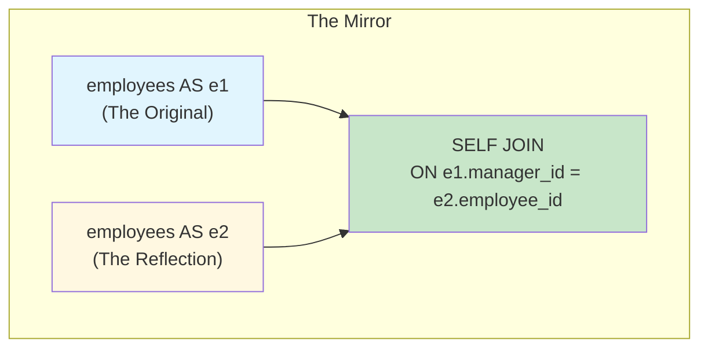

# 🗄️🤖 SQL & GenAI Course
**🎯 Quality Education for Anyone, Anywhere, Anytime — 💫 with Comfort, Convenience at no Cost**

## 📘 File 5: Self Join – The Mirror Bridge

Welcome to the fifth concept file of Module 4. You've mastered joining two tables, chaining multiple joins, and understanding the nuances of `INNER` and `LEFT` joins. Now, you'll learn a special kind of join – a **Self Join** – where a table joins with itself. This is the mirror bridge, where data looks into its own reflection.

A Self Join is not a loop; it is a conversation between two **different versions** of the **same truth**.

---

## 🧠 SQLVerse Architect's Truth

Welcome to the hall of mirrors! **Self Join?** A self join is exactly what it sounds like: a table joining with itself. It is a sophisticated architectural tool used to solve a specific problem: **Hierarchy**. When a row in a table has a relationship with another row in the same table (like an employee reporting to a manager, or a product being a sequel to another product), you need the self join.

**Why the Mirror?** In a normalized database, we avoid repeating data. Instead of creating a separate `managers` table, we realize that a manager is also an employee. Therefore, they both live in the `employees` table.

To see the name of an employee *and* the name of their manager in one row, the database must look at the `employees` table, find the `manager_id`, and then look *back* at the same `employees` table to find the name associated with that ID.

> *“A self join is a mirror – it lets a table see its own reflection and discover relationships within.”*

---

### 📍 Your Current Stage – PREPARE Journey

```mermaid
flowchart LR
    A["✅ COMPLETED<br/>📘 File 1<br/>Intro to Joins"] --> B
    B["✅ COMPLETED<br/>📘 File 2<br/>Inner Join"] --> C
    C["✅ COMPLETED<br/>📘 File 3<br/>Left Join"] --> D
    D["✅ COMPLETED<br/>📘 File 4<br/>Joining Multiple Tables"] --> E
    E["📍 YOU ARE HERE<br/>📘 File 5<br/>Self Join"] --> F
    F["⏳ File 6<br/>Join Conditions"] --> G
    G["✅ PREPARE COMPLETE"] --> H
    H["🔄 RETURN TO MODULE GUIDE<br/>TO BEGIN PRACTICE SECTION"]
    
    style A fill:#e1f5fe,stroke:#4caf50,stroke-width:2px
    style B fill:#c8e6c9,stroke:#4caf50,stroke-width:2px
    style C fill:#c8e6c9,stroke:#4caf50,stroke-width:2px
    style D fill:#c8e6c9,stroke:#4caf50,stroke-width:2px
    style E fill:#fff8e1,stroke:#ff9800,stroke-width:4px
    style F fill:#e1f5fe,stroke:#2196f3,stroke-width:2px
    style G fill:#fff8e1,stroke:#ff9800,stroke-width:2px
    style H fill:#e8f5e8,stroke:#4caf50,stroke-width:2px
```



You've mastered multi‑table joins. Now you'll learn to join a table to itself.

---
## 🗄️ Self Join Demonstration Databases

For this file only, we will use two special databases designed specifically to illustrate self‑join concepts.

**What is a Self Join?** A self join is exactly what it sounds like: a table joining with itself. It is a sophisticated architectural tool used to solve a specific problem: **Hierarchy**. When a row in a table has a relationship with another row in the same table (like an employee reporting to a manager, or a product being a sequel to another product), you need the self join.

**Why separate databases?** Our E‑Store is an e‑commerce database designed to analyze customer buying patterns and the sales & financial health of the store. The hierarchical relationships between employees and their bosses do not come under the purview of the E‑Store – it is an internal matter of the company (employee structure, pay packages, performance, promotion, etc.). The same is true for the Training Institution database. To explain hierarchy, we cannot use our normal E‑Store and Training Institution databases, as they are designed for different purposes.

Let us look at our E‑Store and Training Institution from a different perspective. Though they do not portray the employee‑manager relationships in the database, both of them are run by an **HR team** which definitely has these hierarchical relationships. Based on this perspective, we have designed these two databases to describe what happens behind the scenes.

- **`level1_estore_self_join.db`** – Contains an `employees` table (manager hierarchy) and a `product_series` relationship in the `products` table.
- **`training_institution_self_join.db`** – Contains an `instructors` table with a `taught_by` column, representing instructors who were once students.

Switch to the appropriate database in Tab 2 before running the examples in each section.

---

## 🔧 Browser Office: The Reflection Room

**🚀 Kickstart: Any Computer, Any Browser, Anytime.**  
**🌍 Destination: Any country, Any city, Any Platform.**

| Tab | Purpose | What to Do |
| :--- | :--- | :--- |
| **1: The Map** | Read concept files | You're here – reading this file. Next up: `6-JoinConditions.md`. |
| **2: The Factory** | Run queries | Switch to the appropriate self‑join database for each section. Each example will tell you which database to load.<br><br>📁 **Databases:**<br>• [`level1_estore_self_join.db`](./SQLVerse-Architects-Blueprint/level1_estore_self_join.db)<br>• [`training_institution_self_join.db`](./SQLVerse-Architects-Blueprint/training_institution_self_join.db) |
| **3: The Consultant** | Conceptual Q&A | Ask about self joins, hierarchy, or why table aliases are mandatory. Configure AI with Student Mode Prompt. |
| **4: The Vault** | Save your work | Save successful queries in: `Learning/Level-1-beginner/Level1-1-ACQUIRE/Module4-JoiningTables/1-sqlCommands/` |

> 💡 **Mirror Tip:** In a self join, you are looking at the same table from two different angles. Keep track of which alias represents which role (e.g., `e` for employee, `m` for manager). Your Consultant can help you reason through the logic.

---

### 🛠️ Module 4 Toolkit

🚀 Foundation First, AI Next, Projects Last.  
💎 Gemstone by Gemstone, Skill by Skill.

| | | | |
|---|---|---|---|
| **Browser Office** | 🔧 [Troubleshooting Common Issues](../../../Setup/STEP1_COMMISSION_BROWSER_OFFICE.md) | 🔄 [Browser Office Workflow](../../../Setup/STEP2_ESTABLISH_LEARNING_RITUAL.md) | ⌨️ [Tab Operations & Shortcuts](../../../Setup/STEP3_MASTER_TAB_OPERATIONS.md) |
| **ACQUIRE Section** | 🗄️ [Database Ecosystem](../../Guides/Section1-ACQUIRE/2_Database_Ecosystem.md) | 📚 [Knowledge Base (Vault)](../../Guides/Section1-ACQUIRE/3_Knowledge_Base.md) | 🧠 [Mindset Tuning](../../Guides/Section1-ACQUIRE/4_Mindset.md) |


---
## 📊 Self Join Databases – Table Previews

Here are the key tables you'll be working with in this file.

### `level1_estore_self_join.db`

#### `employees` Table (first 2 rows)

| employee_id | name         | manager_id |
|-------------|--------------|------------|
| 1           | Alice Smith  | NULL       |
| 2           | Bob Johnson  | 1          |

#### `products` Table (first 2 rows)

| product_id | product_name     | price | series_id |
|------------|------------------|-------|-----------|
| 1          | SQL Essentials   | 45.00 | 1         |
| 2          | Advanced SQL     | 55.00 | 1         |

#### `product_series` Table (first 2 rows)

| series_id | series_name         |
|-----------|---------------------|
| 1         | SQL Mastery Series  |
| 2         | Garden Blooms Series|

---

### `training_institution_self_join.db`

#### `instructors` Table (first 2 rows)

| instructor_id | first_name | last_name | specialization      | taught_by |
|---------------|------------|-----------|---------------------|-----------|
| 501           | Emily      | Watson    | Web Development     | NULL      |
| 502           | James      | Wilson    | Backend & SQL       | 501       |

> 💡 **View the full datasets:** Run `SELECT * FROM employees;`, `SELECT * FROM products;`, `SELECT * FROM product_series;`, or `SELECT * FROM instructors;` in your Factory to see all rows.

---

## 🎯 What You'll Learn

By the end of this file, you will be able to:

- Write a `SELF JOIN` using table aliases.
- Understand when a self join is necessary (hierarchical data, comparisons).
- Avoid common mistakes (forgetting aliases, creating a cartesian product).
- Apply self joins to employee hierarchies, product series, and mentor relationships.

---

## 🔍 Introducing Self Join

A self join is a regular join, but the table is joined with itself. Because you can't use the same table name twice in a query without confusion, you **must** use table aliases.

**The Mirror Metaphor:** Imagine looking into a mirror. You see yourself, but from a different perspective. A self join does the same – it lets you see a table from two different angles simultaneously.



---
## 🏗️ The Secret: Table Aliasing

To perform a Self Join, you **must** use aliases. You have to "trick" the database into thinking it is looking at two different tables. We usually name them `a` and `b`, or more descriptively, `emp` (employee) and `mng` (manager).

### 📝 The Syntax

```sql
SELECT 
    e.name AS Employee, 
    m.name AS Manager
FROM employees e
LEFT JOIN employees m ON e.manager_id = m.employee_id;
```

- **`FROM employees e`** : This is the "Employee" side of the mirror.
- **`LEFT JOIN employees m`** : This is the "Manager" side of the mirror.
- **`ON e.manager_id = m.employee_id`** : We connect the employee's manager pointer to the manager's actual ID.

> 💡 **Why LEFT JOIN?** Because the Big Boss (the CEO) usually has no manager. An `INNER JOIN` would exclude the CEO from the list! A `LEFT JOIN` ensures the CEO stays, with a `NULL` for their manager.

In the Artisan's Garden, a Self Join is a **grafted tree**. It is a single trunk where one branch **(the subordinate)** draws its life and direction from another branch **(the supervisor)** of the same species. They are made of the same wood, but they hold different **positions** in the sky.

> *“To understand the whole, one must sometimes look inward.”*

---

## 🏗️ Use Case 1: Employee Hierarchy (E‑Store Self Join DB)

Let's start with the classic self‑join example: an employee table where each employee has a manager (who is also an employee).

**Load `level1_estore_self_join.db` in Tab 2.**

### 📊 The `employees` Table

| employee_id | name         | manager_id |
|-------------|--------------|------------|
| 1           | Alice Smith  | NULL       |
| 2           | Bob Johnson  | 1          |
| 3           | Charlie Lee  | 1          |
| 4           | David Kim    | 2          |
| 5           | Eva Gomez    | 2          |
| 6           | Frank Miller | 3          |
| 7           | Grace Chen   | 3          |

### 📝 Your First Self Join

**Question:** *"List every employee and their manager's name."*

```sql
SELECT 
    e1.name AS employee,
    e2.name AS manager
FROM employees e1
LEFT JOIN employees e2 ON e1.manager_id = e2.employee_id
ORDER BY e1.employee_id;
```

**Try it now in Tab 2.**

**What you're seeing:**

| employee      | manager      |
|---------------|--------------|
| Alice Smith   | NULL         |
| Bob Johnson   | Alice Smith  |
| Charlie Lee   | Alice Smith  |
| David Kim     | Bob Johnson  |
| Eva Gomez     | Bob Johnson  |
| Frank Miller  | Charlie Lee  |
| Grace Chen    | Charlie Lee  |

**Reflect:** The `LEFT JOIN` ensures that even the CEO (Alice Smith, with `manager_id = NULL`) appears in the results. The `e1` alias represents the employee; the `e2` alias represents the manager.

> 💡 **Artisan's Insight:** Table aliases are **mandatory** in a self join. Without them, the database wouldn't know which copy of the table you're referring to.

---

### 🧪 Find the Managers

**Question:** *"Which employees are managers (have at least one direct report)?"*

```sql
SELECT DISTINCT e1.name AS manager
FROM employees e1
JOIN employees e2 ON e1.employee_id = e2.manager_id;
```

**Try it now in Tab 2.**

**What you're seeing:** Alice Smith, Bob Johnson, Charlie Lee.

**Reflect:** This query joins the table to itself, finding pairs where one employee is the manager of another. The `DISTINCT` ensures each manager appears only once.

---

### 🧪 Find the Top Boss

**Question:** *"Who is the CEO (the employee with no manager)?"*

```sql
SELECT name AS ceo
FROM employees
WHERE manager_id IS NULL;
```

**Try it now in Tab 2.**

**What you're seeing:** Alice Smith.

**Reflect:** This doesn't require a self join – it's a simple `WHERE` condition. But it completes the hierarchy picture.

---

## 🏗️ Use Case 2: Product Series (E‑Store Self Join DB)

Now let's look at a different kind of self join: products that belong to a series (sequels).

**Stay in `level1_estore_self_join.db`.**

### 📊 The `products` and `product_series` Tables

**`product_series` Table**

| series_id | series_name           |
|-----------|-----------------------|
| 1         | SQL Mastery Series    |
| 2         | Garden Blooms Series  |
| 3         | Smartphone Series     |

**`products` Table**

| product_id | product_name          | price | series_id |
|------------|-----------------------|-------|-----------|
| 1          | SQL Essentials        | 45.00 | 1         |
| 2          | Advanced SQL          | 55.00 | 1         |
| 3          | SQL Mastery           | 65.00 | 1         |
| 4          | Spring Blooms (Roses) | 15.00 | 2         |
| 5          | Autumn Hues (Marigolds)| 10.00| 2         |
| 6          | Winter Blooms (Sunflowers)| 12.00| 2      |
| 7          | Galaxy S1             | 500.00| 3         |
| 8          | Galaxy S2             | 600.00| 3         |
| 9          | Galaxy S3             | 700.00| 3         |

### 📝 Self Join on Product Series

**Question:** *"For each product, find other products in the same series that are more expensive."*

```sql
SELECT 
    p1.product_name AS product,
    p2.product_name AS more_expensive_product,
    p2.price AS higher_price
FROM products p1
JOIN products p2 ON p1.series_id = p2.series_id
WHERE p2.price > p1.price
ORDER BY p1.product_name;
```

**Try it now in Tab 2.**

**What you're seeing:** Each product paired with more expensive products in the same series.

| product          | more_expensive_product | higher_price |
|------------------|------------------------|--------------|
| Advanced SQL     | SQL Mastery            | 65.00        |
| Autumn Hues      | Winter Blooms          | 12.00        |
| Galaxy S1        | Galaxy S2              | 600.00       |
| Galaxy S1        | Galaxy S3              | 700.00       |
| Galaxy S2        | Galaxy S3              | 700.00       |
| SQL Essentials   | Advanced SQL           | 55.00        |
| SQL Essentials   | SQL Mastery            | 65.00        |
| Spring Blooms    | Autumn Hues            | 10.00        |
| Spring Blooms    | Winter Blooms          | 12.00        |

**Reflect:** The self join compares rows within the same series. The `WHERE` clause filters to show only pairs where the second product is more expensive.

> 💎 **Artisan's Insight:** Self joins aren't just for hierarchies. They're also powerful for comparing rows within a group – like finding sequels, price differences, or time‑based comparisons.

---

## 🏗️ Use Case 3: Mentor Hierarchy (Training Institution Self Join DB)

Now let's explore a richer hierarchy: instructors who were once students, learning from other instructors.

**Load `training_institution_self_join.db` in Tab 2.**

### 📊 The `instructors` Table

| instructor_id | first_name | last_name | specialization      | taught_by |
|---------------|------------|-----------|---------------------|-----------|
| 501           | Emily      | Watson    | Web Development     | NULL      |
| 502           | James      | Wilson    | Backend & SQL       | 501       |
| 503           | Maria      | Garcia    | Data Science        | 501       |
| 504           | Robert     | Chen      | Cybersecurity       | NULL      |
| 505           | Ahmed      | Khan      | Machine Learning    | 503       |
| 506           | Sarah      | Chen      | Frontend Development| 502       |
| 507           | Mike       | Rodriguez | Data Analysis       | 503       |
| 508           | Jessica    | Park      | Full Stack          | 502       |

### 📝 Self Join for Mentor Relationships

**Question:** *"List every instructor and who taught them."*

```sql
SELECT 
    i1.first_name || ' ' || i1.last_name AS instructor,
    i2.first_name || ' ' || i2.last_name AS taught_by
FROM instructors i1
LEFT JOIN instructors i2 ON i1.taught_by = i2.instructor_id
ORDER BY i1.instructor_id;
```

**Try it now in Tab 2.**

**What you're seeing:**

| instructor          | taught_by        |
|---------------------|------------------|
| Emily Watson        | NULL             |
| James Wilson        | Emily Watson     |
| Maria Garcia        | Emily Watson     |
| Robert Chen         | NULL             |
| Ahmed Khan          | Maria Garcia     |
| Sarah Chen          | James Wilson     |
| Mike Rodriguez      | Maria Garcia     |
| Jessica Park        | James Wilson     |

**Reflect:** This is the same pattern as the employee hierarchy, but with a richer educational context. The `LEFT JOIN` preserves instructors who have no mentor (the original experts).

---

### 🧪 Find the Original Experts

**Question:** *"Which instructors were never taught by anyone (the original experts)?"*

```sql
SELECT first_name || ' ' || last_name AS expert
FROM instructors
WHERE taught_by IS NULL;
```

**Try it now in Tab 2.**

**What you're seeing:** Emily Watson, Robert Chen.

**Reflect:** These are the founding instructors – the ones who built the knowledge base from scratch.

---

### 🧪 Find All Mentors

**Question:** *"Which instructors have taught at least one other instructor?"*

```sql
SELECT DISTINCT i2.first_name || ' ' || i2.last_name AS mentor
FROM instructors i1
JOIN instructors i2 ON i1.taught_by = i2.instructor_id;
```

**Try it now in Tab 2.**

**What you're seeing:** Emily Watson, James Wilson, Maria Garcia.

**Reflect:** This is the same pattern as finding managers. These instructors have passed on their knowledge to the next generation.

---

## 💎 Artisan's Technique: Table Aliases are Mandatory

In a self join, you **must** use table aliases. Without them, the database cannot distinguish between the two copies of the same table.

```sql
-- This will cause an error
SELECT * FROM employees JOIN employees ON employees.manager_id = employees.employee_id;

-- Correct: use aliases
SELECT * FROM employees e1 JOIN employees e2 ON e1.manager_id = e2.employee_id;
```

> 💡 **Artisan's Insight:** Think of aliases as labels for the mirror. `e1` is the original; `e2` is the reflection. Without labels, you can't tell them apart.

---

## ⚠️ Common Mistakes

### Mistake 1: Forgetting Table Aliases
```sql
-- Wrong: ambiguous table reference
SELECT * FROM employees JOIN employees ON manager_id = employee_id;
```
> 🔧 **Fix:** Always use aliases: `FROM employees e1 JOIN employees e2 ON e1.manager_id = e2.employee_id`

### Mistake 2: Forgetting the `ON` Clause
```sql
-- Wrong: cartesian product (every row × every row)
SELECT * FROM employees e1, employees e2;
```
> 🔧 **Fix:** Always specify the join condition.

### Mistake 3: Using `INNER JOIN` when you need `LEFT JOIN`
```sql
-- The CEO (with NULL manager) will disappear!
SELECT e1.name, e2.name FROM employees e1 JOIN employees e2 ON e1.manager_id = e2.employee_id;
```
> 🔧 **Fix:** Use `LEFT JOIN` if you want to keep rows that have no match.

### Mistake 4: Confusing the Direction of the Relationship
In `ON e1.manager_id = e2.employee_id`, `e1` is the employee, `e2` is the manager. Swap them, and you'll get the inverse relationship.

### Mistake 5: The Infinity Loop (Joining a Table to Itself Incorrectly)

Be careful with your `ON` condition. If you accidentally join on the primary key of both copies, you end up joining each row to itself – a useless operation that just repeats the table.

```sql
-- Wrong: joins each employee to themselves (useless)
SELECT e1.name AS employee, e2.name AS manager
FROM employees e1
JOIN employees e2 ON e1.employee_id = e2.employee_id;
```

This query returns every employee paired with themselves – not what we want!

```sql
-- Correct: joins employee to their manager using the foreign key (manager_id)
SELECT e1.name AS employee, e2.name AS manager
FROM employees e1
LEFT JOIN employees e2 ON e1.manager_id = e2.employee_id;
```

> 🔧 **Fix:** Always join the **Foreign Key** (e.g., `manager_id`) to the **Primary Key** (e.g., `employee_id`). Never join the primary key to itself unless you intentionally want self‑pairs.


---

## 🧪 Practice Challenges

**Challenge 1: Employee Hierarchy**  
List every employee and their manager's name. Use `LEFT JOIN` to include the CEO.  
*Save as:* `4-5-1-employee-hierarchy.sql`  
*(Use `level1_estore_self_join.db`)*

**Challenge 2: Find Direct Reports**  
List all employees who report directly to Alice Smith (employee_id = 1).  
*Save as:* `4-5-2-direct-reports.sql`  
*(Use `level1_estore_self_join.db`)*

**Challenge 3: Product Series – Cheaper Alternatives**  
For each product, find other products in the same series that are cheaper.  
*Save as:* `4-5-3-cheaper-alternatives.sql`  
*(Use `level1_estore_self_join.db`)*

**Challenge 4: Mentor Tree**  
List every instructor and the name of the instructor who taught them. Include those with no mentor.  
*Save as:* `4-5-4-mentor-tree.sql`  
*(Use `training_institution_self_join.db`)*

**Challenge 5: Knowledge Lineage**  
Find all instructors who were taught (directly or indirectly) by Emily Watson.  
*Hint: This requires a recursive query (advanced) – try a simple self join first, then think about multiple levels.*  
*Save as:* `4-5-5-knowledge-lineage.sql`  
*(Use `training_institution_self_join.db`)*

---

## 📋 Self Join Quick Reference Card

### Syntax

```sql
SELECT columns
FROM table t1
JOIN table t2 ON t1.foreign_key = t2.primary_key;
```

### Key Points

| Concept | Explanation |
|---------|-------------|
| **Aliases mandatory** | You cannot join a table to itself without aliases. |
| **Hierarchy** | Self joins are perfect for organizational charts, product series, and lineage. |
| **Direction matters** | The `ON` clause defines which copy is the "parent" and which is the "child". |
| **LEFT JOIN** | Use when you want to keep rows without a match (e.g., the CEO). |

**Memory Aid:**  
> *“A self join is a mirror – use aliases to tell the original from the reflection.”*

**Save this reference in your Vault as:** `4-self-join-refcard.md`

---

## ✅ Progress Check

After reading this and trying the examples, can you:

- [ ] Write a `SELF JOIN` query using table aliases?
- [ ] Explain when a self join is necessary (hierarchy, comparisons)?
- [ ] Distinguish between `INNER JOIN` and `LEFT JOIN` in a self join context?
- [ ] Find the top of a hierarchy (e.g., CEO, original expert)?
- [ ] Save your working queries in your Vault?

**If yes → You're ready for File 6: Join Conditions!**

---

## 💎 DESIGNER'S PERIGON

<div style="border: 3px solid #9c27b0; border-radius: 10px; padding: 20px; margin: 25px 0; background: linear-gradient(135deg, #f3e5f5 0%, #e1bee7 100%);">

### *The Art of the Mirror*

A self join is a mirror. It lets a table see its own reflection and discover relationships within. Every employee has a manager. Every product may have a sequel. Every instructor once had a teacher.

In the **SQLVerse**, a self join reveals the hidden hierarchies that make organizations, products, and knowledge grow. It's the tool that answers questions like:

- *“Who reports to whom?”*
- *“What are the sequels to this product?”*
- *“Who taught the teachers?”*

> *“A self join is a conversation with yourself – the most honest kind.”*

> *“A single join connects two tables. A self join connects a table to its own story.”*

---

### *The SQLVerse Garden and Hall of Mirrors*

In the SQLVerse Artisan's Garden, a self join is like looking into a still pond. The water reflects the same trees, but from a different angle, revealing how they connect to the sky.

In the SQLVerse Architect's mental model, a self join is the ultimate test – requiring you to see the same data in two different views simultaneously.

In SQLVerse, an Artisan doubles up as an Architect – the same person with two different thought processes: an Artist and an Engineer. What if we hold a self-join mirror on a SQLVerse citizen to reflect both the art and science?

- The **Artisan** sees the Garden, flowers, stems, blooms, designs the landscape, carefully selects the flowers, styles them, and creates magical floral arrangements to decorate any dashboard.
- The **Architect** sees Planets, worlds, continents, countries, data, normalization, joins, outer joins, equi joins, join chains, and creates reports to answer every query of the CEO and the business problems.

**Query:** What if we perform a self-join with the Artisan and Architect vision?

**The Resultset:** The SQLVerse connects Continents and countries in the **information superhighway** with a chain of joins where data travels with lightning speed – anytime, anywhere, any device.

**The SQLVerse expands. Go look in the mirror.**

</div>

---

## 🧭 File Navigation

```mermaid
flowchart LR
    A["✅ COMPLETED<br/>📘 File 1<br/>Intro to Joins"] --> B
    B["✅ COMPLETED<br/>📘 File 2<br/>Inner Join"] --> C
    C["✅ COMPLETED<br/>📘 File 3<br/>Left Join"] --> D
    D["✅ COMPLETED<br/>📘 File 4<br/>Joining Multiple Tables"] --> E
    E["✅ COMPLETED<br/>📘 File 5<br/>Self Join"] --> F
    F["⏳ File 6<br/>Join Conditions"] --> G
    G["✅ PREPARE COMPLETE"] --> H
    H["🔄 RETURN TO MODULE GUIDE<br/>TO BEGIN PRACTICE SECTION"]
    
    style A fill:#e1f5fe,stroke:#4caf50,stroke-width:2px
    style B fill:#c8e6c9,stroke:#4caf50,stroke-width:2px
    style C fill:#c8e6c9,stroke:#4caf50,stroke-width:2px
    style D fill:#c8e6c9,stroke:#4caf50,stroke-width:2px
    style E fill:#c8e6c9,stroke:#4caf50,stroke-width:2px
    style F fill:#fff8e1,stroke:#ff9800,stroke-width:4px
    style G fill:#fff8e1,stroke:#ff9800,stroke-width:2px
    style H fill:#e8f5e8,stroke:#4caf50,stroke-width:2px
```



| Previous Step | Next Step |
|:---:|:---:|
| [← Back to File 4: Joining Multiple Tables](./4-JoiningMultipleTables.md) | [Continue to File 6: Join Conditions →](./6-JoinConditions.md) |

---

*Part of our mission for 🎯 Quality Education for Anyone, Anywhere, Anytime — 💫 with Comfort, Convenience at no Cost.*

**Level 1 | Module 4 | File 5: Self Join | Next: [Join Conditions](./6-JoinConditions.md)**