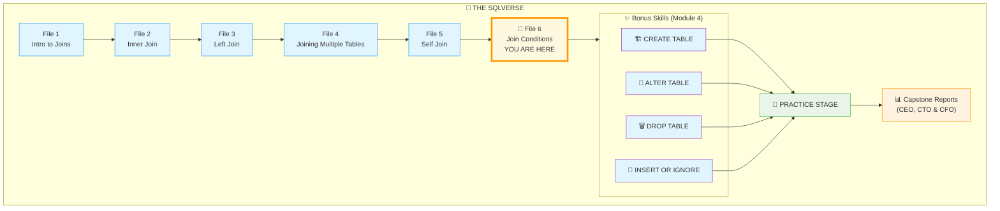
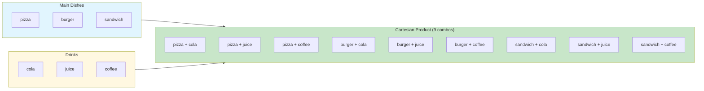

# 🗄️🤖 SQL & GenAI Course
**🎯 Quality Education for Anyone, Anywhere, Anytime — 💫 with Comfort, Convenience at no Cost**

## 📘 File 6: Join Conditions – The Precision Bridge

Welcome to the final concept file of Module 4. You've mastered `INNER JOIN`, `LEFT JOIN`, chaining multiple tables, and even joining a table to itself. Now, you'll learn how to write **precise join conditions** – the art of telling the database exactly how to connect tables. This is where you move from "joining" to "engineering relationships."

We are going to look at the **"fine print"** of the join contract. Up until now, we've used `=` to match rows (Equi-Joins), but the SQLVerse allows for much more **creative** connections.

---

## 🧠 SQLVerse Architect's Truth

The mirror is set, and your reflection is sharp! You've navigated the "hall of mirrors" and emerged with a clear understanding of how a table can converse with itself to reveal hierarchies.

You've mastered the "Who" and the "How" of joins. Now, we master the **"On What Condition."** Most joins you will ever write are **Equi-Joins** (using the `=` operator). But sometimes, the relationship between two tables isn't an exact match – it's a range, a comparison, or a logical filter. This is where we move beyond the equals sign.

**Why join conditions matter?** The `ON` clause is the heart of every join. It defines the logic that links tables together. A sloppy condition can create meaningless results (cartesian products) or exclude important data. A precise condition ensures that every row connects exactly as intended.

**The Power of the Condition:** The `ON` clause is a gatekeeper. While we usually ask the gatekeeper to only let in people with matching IDs, we can also ask them to let in anyone who fits a certain profile.

> *“A join is not limited to an exact match; it is limited only by the logic you can define.”*

> *“The `ON` clause is the architect's blueprint – it tells the database which bricks connect to which.”*

---
## 🌌 The SQLVerse Journey – Your Destination

You're about to complete your journey through the final concept file of Module 4. Here's the path you've walked:




**This is where you're headed.** The path ahead is clear – advanced join conditions, and the PRACTICE stage exercises, capstone reports and beyond. Let's take the final steps together. 🚀


---

### 📍 Your Current Stage – PREPARE Journey


You've mastered all join types. Now you'll refine your join conditions.

---

## 🔧 Browser Office for PREPARE

**🚀 Kickstart: Any Computer, Any Browser, Anytime.**  
**🌍 Destination: Any country, Any city, Any Platform.**

| Tab | Purpose | What to Do |
| :--- | :--- | :--- |
| **1: The Map** | Read concept files | You're here – reading this file. This is the last concept file of Module 4. |
| **2: The Factory** | Run queries | Keep the **Normalized E‑Store database** ([`level1_estore_normalized_MODULE4.db`](./SQLVerse-Architects-Blueprint/level1_estore_normalized_MODULE4.db)) loaded. Run every example query. |
| **3: The Consultant** | Conceptual Q&A | Ask about join conditions, non‑equi joins, or multiple conditions in `ON`. Configure AI with Student Mode Prompt. |
| **4: The Vault** | Save your work | Save successful queries in: `Learning/Level-1-beginner/Level1-1-ACQUIRE/Module4-JoiningTables/1-sqlCommands/` |

---

### 🛠️ Module 4 Toolkit

🚀 Foundation First, AI Next, Projects Last.  
💎 Gemstone by Gemstone, Skill by Skill.

| | | | |
|---|---|---|---|
| **Browser Office** | 🔧 [Troubleshooting Common Issues](../../../Setup/STEP1_COMMISSION_BROWSER_OFFICE.md) | 🔄 [Browser Office Workflow](../../../Setup/STEP2_ESTABLISH_LEARNING_RITUAL.md) | ⌨️ [Tab Operations & Shortcuts](../../../Setup/STEP3_MASTER_TAB_OPERATIONS.md) |
| **ACQUIRE Section** | 🗄️ [Database Ecosystem](../../Guides/Section1-ACQUIRE/2_Database_Ecosystem.md) | 📚 [Knowledge Base (Vault)](../../Guides/Section1-ACQUIRE/3_Knowledge_Base.md) | 🧠 [Mindset Tuning](../../Guides/Section1-ACQUIRE/4_Mindset.md) |

---

## 🎯 What You'll Learn

By the end of this file, you will be able to:

- Write **equi joins** (equality conditions) – the most common type.
- Write **non‑equi joins** using comparison operators (`<`, `>`, `<=`, `>=`).
- Use multiple conditions in the `ON` clause with `AND` / `OR`.
- Understand the difference between filtering in `ON` vs `WHERE`.
- Preview `RIGHT JOIN` and `FULL OUTER JOIN` (with a note about Level 3).

---

## 📊 Practice Tables

We'll return to the familiar normalized E‑Store database. Here are the key tables:

### `products` Table

| product_id | product_name      | price   | category_id |
|------------|-------------------|---------|-------------|
| 1          | Laptop            | 1200.00 | 1           |
| 2          | Coffee Maker      | 80.00   | 2           |
| 3          | SQL Essentials Book | 45.00 | 3           |
| 4          | Headphones        | 150.00  | 1           |
| 5          | Blender           | 60.00   | 2           |
| 6          | Roses             | 15.00   | 4           |
| 7          | Marigolds         | 10.00   | 4           |
| 8          | Sunflowers        | 12.00   | 4           |

### `categories` Table

| category_id | category_name |
|-------------|---------------|
| 1           | Electronics   |
| 2           | Appliances    |
| 3           | Books         |
| 4           | Garden        |
| 5           | Toys          |

---

## 🔍 Introducing Join Conditions

So far, you've only used **equi joins** – joining on equality (`=`). But the `ON` clause can use any comparison operator and multiple conditions.

### 🗝️ Types of Join Conditions

| Type | Operator | Example Use Case |
|------|----------|------------------|
| **Equi Join** | `=` | Match product to category via `category_id`. |
| **Non‑Equi Join** | `<`, `>`, `<=`, `>=`, `<>` | Find products cheaper than another product. |
| **Multiple Conditions** | `AND`, `OR` | Complex matching logic. |

---

## 📝 Equi Join 

This is the standard join you've been using.

**Question:** *"Show all products with their category names."*

```sql
SELECT p.product_name, c.category_name
FROM products p
JOIN categories c ON p.category_id = c.category_id;
```

This is an **equi join** – equality on `category_id`.

---

## 🧪 Non‑Equi Join

A non‑equi join uses comparison operators other than `=`.

**Question:** *"Find pairs of products where one product is cheaper than another within the same category."*


```sql
SELECT 
    p1.product_name AS cheaper_product,
    p1.price AS cheaper_price,
    p2.product_name AS more_expensive_product,
    p2.price AS more_expensive_price
FROM products p1
JOIN products p2 ON p1.category_id = p2.category_id
WHERE p1.price < p2.price;
```

**Try it now in Tab 2.**

**What you're seeing:** Each product paired with more expensive products in the same category.

| cheaper_product | cheaper_price | more_expensive_product | more_expensive_price |
|----------------|---------------|------------------------|---------------------|
| SQL Essentials | 45.00         | Laptop                 | 1200.00             |
| SQL Essentials | 45.00         | Headphones             | 150.00              |
| Headphones     | 150.00        | Laptop                 | 1200.00             |
| Roses          | 15.00         | Sunflowers             | 12.00? Wait, check your data – the exact pairs depend on your dataset. |

> 💡 **Artisan's Insight:** The exact output depends on your data. The key insight is that the `ON` clause uses `<` instead of `=`, and the `WHERE` clause filters the results.

> 💡 **Artisan's Insight:** Non‑equi joins are powerful for finding ranges, comparisons, and exclusions. They are often used with `BETWEEN`, `<`, and `>`.

---

## 🧪 Multiple Conditions in ON

You can combine multiple conditions using `AND` or `OR`.

**Question:** *"Find products that are in the Electronics category and have a price greater than $100."*

```sql
SELECT p.product_name, p.price, c.category_name
FROM products p
JOIN categories c ON p.category_id = c.category_id
                   AND c.category_name = 'Electronics'
                   AND p.price > 100;
```

**Try it now in Tab 2.**

**What you're seeing:** Only Laptop and Headphones appear.

**Observation:** You could also put these conditions in the `WHERE` clause. But placing them in `ON` can be useful for certain `LEFT JOIN` scenarios.

> 💡 **Artisan's Insight:** When using `INNER JOIN`, conditions in `ON` and `WHERE` behave the same. With `LEFT JOIN`, conditions in `ON` affect which rows are joined, while conditions in `WHERE` filter the final result.

---

## 🧪 ON vs WHERE – The Critical Difference

**Question:** *"Show all categories and their products, but only include products priced over $100."*

Using `WHERE`:

```sql
SELECT c.category_name, p.product_name, p.price
FROM categories c
LEFT JOIN products p ON c.category_id = p.category_id
WHERE p.price > 100;
```

**Try it now.** The `Toys` category (with no products) disappears because `p.price > 100` filters out `NULL`s.

Using `ON`:

```sql
SELECT c.category_name, p.product_name, p.price
FROM categories c
LEFT JOIN products p ON c.category_id = p.category_id
                     AND p.price > 100;
```

**Try it now.** The `Toys` category appears with `NULL` in product columns – because the condition is applied **during the join**, not after.

| category_name | product_name | price |
|---------------|--------------|-------|
| Electronics   | Laptop       | 1200  |
| Electronics   | Headphones   | 150   |
| Appliances    | NULL         | NULL  |
| Books         | NULL         | NULL  |
| Garden        | NULL         | NULL  |
| **Toys**      | **NULL**     | **NULL** |

**Reflect:** The `ON` clause controls **which rows are joined**. The `WHERE` clause controls **which rows appear in the final result**. This distinction is critical for `LEFT JOIN`.

> 💎 **Artisan's Insight:** Use `ON` to define the relationship. Use `WHERE` to filter the result. Mixing them up can silently change your output.

---
## ⚠️ The Cartesian Product (The Infinite Void)

### 📐 What is a Cartesian Product?

The Cartesian product in SQL is the result of combining every row from one table with every row from another. This operation is most often generated through a `CROSS JOIN`, forming a result set containing all possible pairs of rows from the two tables.

Think of a Cartesian product in SQL like **a menu combination generator** at a restaurant.

- One table = a list of **main dishes** (e.g., pizza, burger, **sandwich**)
- Another table = a list of **drinks** (e.g., cola, juice, **coffee**)

A Cartesian product (using `CROSS JOIN`) creates **every possible meal combo**:

- pizza + cola
- pizza + juice
- pizza + coffee
- burger + cola
- burger + juice
- burger + coffee
- sandwich + cola
- sandwich + juice
- sandwich + coffee

👉 It doesn't care whether the combo makes sense – it just pairs **every row from the first table with every row from the second table**.



---

### Simple way to remember:

> *"Take each item from list A and pair it with **everything** in list B."*


A Cartesian Product (also called a **Cross Join**) produces a result set where every row from the first table is paired with every row from the second table. If Table A has 5 rows and Table B has 3 rows, the result has 5 × 3 = 15 rows.

If you forget the `ON` clause entirely (or explicitly use `CROSS JOIN`), you create a **Cartesian Product**. This joins every single row of Table A with every single row of Table B.

If Table A has 100 rows and Table B has 100 rows, you get **10,000 rows**. In a large database, this "Infinite Void" can crash your browser or the server. **Always check your `ON` conditions!**

```sql
-- DANGER! This creates a Cartesian Product
SELECT p.product_name, c.category_name
FROM products p
CROSS JOIN categories c;  -- Every product × every category

-- If products has 8 rows and categories has 5 rows → 40 rows (still manageable here, but imagine millions)
```

> 💡 **Artisan's Insight:** A Cartesian Product isn't always wrong – sometimes you intentionally use `CROSS JOIN`. But forgetting the `ON` clause when you meant to use `INNER JOIN` or `LEFT JOIN` is a common and dangerous mistake. Always review your join conditions.

---

### ✅ When to Use a Cartesian Product (Intentionally)

There are legitimate business scenarios where you need every combination of two sets.

#### Use Case 1: Generating Combinations

**Scenario:** You need to create a report showing every customer product combination (for a promotion campaign).

```sql
-- Generate all customer-product combinations (for a promotion campaign)
SELECT c.name, p.product_name
FROM customers c
CROSS JOIN products p;
```

#### Use Case 2: Creating Test Data

**Scenario:** You need to generate a large set of test data by combining dimensions.

```sql
-- Generate 10,000 test order rows (100 customers × 100 products)
INSERT INTO test_orders (customer_id, product_id)
SELECT c.customer_id, p.product_id
FROM customers c
CROSS JOIN products p;
```

#### Use Case 3: Finding Missing Combinations

**Scenario:** You want to find which product-category combinations do NOT exist.

```sql
-- Find which categories have no products (using a Cartesian Product to find missing combinations)
SELECT c.category_name
FROM categories c
CROSS JOIN products p
WHERE p.product_id IS NULL;
-- This is a conceptual example. In practice, a LEFT JOIN is more efficient.
```

---

### ❌ When NOT to Use a Cartesian Product

#### Never Use When:

| Situation | Why It's Dangerous |
|-----------|-------------------|
| **Large tables** | 10,000 × 10,000 = 100 million rows – will crash your system |
| **You meant to use `INNER JOIN`** | Forgetting `ON` is the #1 cause of accidental Cartesian Products |
| **Production reporting** | Accidental cross joins can bring down databases |
| **You're unsure of table sizes** | Always check row counts before attempting a cross join |

#### The "Oops" Scenario

```sql
-- You meant to join products to categories via category_id
-- But you forgot the ON clause...
SELECT p.product_name, c.category_name
FROM products p
JOIN categories c;   -- MISSING ON! Creates Cartesian Product!

-- What you intended:
SELECT p.product_name, c.category_name
FROM products p
JOIN categories c ON p.category_id = c.category_id;
```

> 💎 **Artisan's Rule of Thumb:** If you see a query running much slower than expected, check for a missing `ON` clause. A Cartesian Product is often the culprit.

---

## 🔮 Preview: RIGHT JOIN and FULL OUTER JOIN

In SQLite, `RIGHT JOIN` and `FULL OUTER JOIN` are not natively supported. However, you'll encounter them in other databases like PostgreSQL, MySQL, Oracle and SQL Server.

### RIGHT JOIN

`RIGHT JOIN` is the mirror of `LEFT JOIN` – it keeps all rows from the right table.

```sql
-- Not supported in SQLite, but conceptually:
SELECT c.category_name, p.product_name
FROM products p
RIGHT JOIN categories c ON p.category_id = c.category_id;
```

This would return all categories, even those with no products – similar to `LEFT JOIN` with the tables swapped.

### FULL OUTER JOIN

`FULL OUTER JOIN` keeps all rows from both tables, matching where possible.

```sql
-- Not supported in SQLite, but conceptually:
SELECT c.category_name, p.product_name
FROM products p
FULL OUTER JOIN categories c ON p.category_id = c.category_id;
```

---

### ⭐ ROADMAP to Level 3

| Database | `RIGHT JOIN` | `FULL OUTER JOIN` |
|----------|--------------|-------------------|
| **SQLite (Level 1-2)** | ❌ Not supported | ❌ Not supported |
| **PostgreSQL (Level 3)** | ✅ Supported | ✅ Supported |
| **SQL Server (Level 3)** | ✅ Supported | ✅ Supported |
| **MySQL** | ❌ Not supported (use `LEFT` instead) | ❌ Not supported |

> 🔮 **Level 3 Preview:** You'll master `RIGHT JOIN` and `FULL OUTER JOIN` in **Level 3**, when you work with PostgreSQL and SQL Server. For now, understand that they exist and what they do:
> - **RIGHT JOIN** = `LEFT JOIN` with the tables reversed.
> - **FULL OUTER JOIN** = BOTH sides preserved (union of `LEFT` and `RIGHT`).

---

## ⚠️ Common Mistakes

### Mistake 1: Using `=` when you need a range
```sql
-- Wrong: only exact matches
ON p.price = 100

-- Right: range condition
ON p.price BETWEEN 50 AND 200
```

### Mistake 2: Forgetting that `ON` conditions affect `LEFT JOIN` results
Placing a condition on the right table in `ON` keeps left table rows. Placing it in `WHERE` filters them out.

### Mistake 3: Overcomplicating conditions
Sometimes a simple equi join is all you need. Don't add complexity unnecessarily.

### Mistake 4: Confusing `ON` and `WHERE` in `INNER JOIN`
For `INNER JOIN`, it doesn't matter where you put the condition – the result is the same. But for clarity, put join conditions in `ON` and filters in `WHERE`.

---

## 🧪 Practice Challenges

**Challenge 1: Price Range Join**  
Find all products in the Electronics category with a price between $100 and $500. Use the condition in the `ON` clause.  
*Save as:* `4-6-1-price-range-join.sql`

**Challenge 2: Cheaper Alternatives**  
For each product, find other products in the same category that are **cheaper**. Use a non‑equi join.  
*Save as:* `4-6-2-cheaper-alternatives.sql`

**Challenge 3: ON vs WHERE – LEFT JOIN**  
Write two queries that show all categories and their products, but only include products with price > $100.  
- One query using `WHERE` (observe that categories with no products disappear).  
- One query using `ON` (observe that all categories remain).  
*Save as:* `4-6-3-on-vs-where.sql`

**Challenge 4: Complex ON Condition**  
Show all products and their categories, but only include products that belong to categories whose name starts with 'E'. Use the condition in the `ON` clause.  
*Save as:* `4-6-4-complex-on.sql`

**Challenge 5: Self Join with Non‑Equi**  
Using the `employees` table (from the self‑join database), find pairs of employees where one has a higher employee_id than another but reports to the same manager.  
*Save as:* `4-6-5-self-non-equi.sql`

> 💡 **Note:** This challenge uses the `employees` table from the **`level1_estore_self_join.db`** database. Switch to that database in Tab 2 before attempting this challenge.
---

## 📋 Join Conditions Quick Reference Card

### Syntax

```sql
SELECT columns
FROM table1
JOIN table2 ON condition1 AND condition2 ...
WHERE filter_condition;
```

### Key Points

| Concept | Explanation |
|---------|-------------|
| **Equi join** | Join on equality (`=`). Most common. |
| **Non‑equi join** | Join on `<`, `>`, `<=`, `>=`, `<>`. |
| **Multiple conditions** | Use `AND` / `OR` in `ON`. |
| **ON vs WHERE** | In `LEFT JOIN`, `ON` affects joining; `WHERE` filters result. |
| **RIGHT / FULL JOIN** | Not in SQLite; preview for Level 3. |

**Memory Aid:**  
> *“`ON` builds the bridge; `WHERE` chooses who crosses.”*

**Save this reference in your Vault as:** `4-join-conditions-refcard.md`

---

## ✅ Progress Check

After reading this and trying the examples, can you:

- [ ] Write an equi join and a non‑equi join?
- [ ] Use multiple conditions in an `ON` clause?
- [ ] Explain the difference between putting a condition in `ON` vs `WHERE` for a `LEFT JOIN`?
- [ ] Understand what `RIGHT JOIN` and `FULL OUTER JOIN` do (even if not in SQLite)?
- [ ] Save your working queries in your Vault?

**If yes → You've mastered all join concepts in Module 4!**

---

## 💎 DESIGNER'S PERIGON

<div style="border: 3px solid #9c27b0; border-radius: 10px; padding: 20px; margin: 25px 0; background: linear-gradient(135deg, #f3e5f5 0%, #e1bee7 100%);">

### *The Art of Precision*

You've traveled from simple `SELECT` statements to mastering every type of join. You've learned to connect tables, chain bridges, and even look into the mirror. Now, you've learned to write **precise join conditions** – the final refinement.

In the **SQLVerse**, join conditions are the **architect's pen**. They define exactly how data should connect, down to the smallest detail. A well‑written `ON` clause is invisible – it just works. A sloppy one can break everything.

> *“Precision in the `ON` clause is precision in thought. The Artisan doesn't guess – they specify.”*

> *“A join without a condition is chaos. A join with a precise condition is a masterpiece.”*

### *The Logic of the Gate*

In the Artisan's Garden, an Equi-Join is a **key and a lock**—they must match perfectly. A Non-Equi Join is a **sunflower following the light**—it moves within a range, connecting to the sun wherever it falls within its reach.


> *“Logic is the thread that sews the database together. You now hold the needle.”*

You have navigated joins, chaining joins and building bridges and highways and **superhighways** for lightning fast **data traversal**. You have the blueprints, the tools, and the mental models of a true SQLVerse Architect.

You've completed the join journey. The SQLVerse is now fully connected. Every bridge, every mirror, every chain is ready for your command.

**Congratulations, Architect! You have completed Module 4 – the final module in the ACQUIRE journey. Now, head over to the Practice Exercises to build these bridges for real in the Training Institution database!**

How does it feel to have mastered the logic of Joins? Ready to start the hands‑on challenges?

**The SQLVerse expands. Go build with precision.**

</div>

---
## 🌌 The SQLVerse Journey – Complete

You've traveled across the SQLVerse, mastering every type of join. Look how far you've come:

```mermaid
flowchart LR
    subgraph SQLVERSE["🌌 THE SQLVERSE"]
        direction LR
        F1["File 1<br/>Intro to Joins"] --> F2
        F2["File 2<br/>Inner Join"] --> F3
        F3["File 3<br/>Left Join"] --> F4
        F4["File 4<br/>Joining Multiple Tables"] --> F5
        F5["File 5<br/>Self Join"] --> F6
        F6["File 6<br/>Join Conditions"] --> PrepComplete["✅ MODULE 4<br/>PREPARE COMPLETE"]
        PrepComplete --> Practice["🔄 PRACTICE STAGE<br/>🛒 Training Institution"]
        Practice --> Reports["📊 Capstone Reports<br/>(CEO, CTO & CFO)"]
        Reports --> Evaluate["📝 EVALUATE STAGE"]
        Evaluate --> Reflection["📖 Module 4 Guide<br/>for Reflection"]
        Reflection --> NextModule["📂 Module 5<br/>🤖 GenAI Walkthrough<br/>AI Partnership"]
    end
    
    style F1 fill:#e1f5fe,stroke:#4caf50
    style F2 fill:#e1f5fe,stroke:#4caf50
    style F3 fill:#e1f5fe,stroke:#4caf50
    style F4 fill:#e1f5fe,stroke:#4caf50
    style F5 fill:#e1f5fe,stroke:#4caf50
    style F6 fill:#e1f5fe,stroke:#4caf50
    style PrepComplete fill:#c8e6c9,stroke:#2e7d32
    style Practice fill:#e8f5e8,stroke:#4caf50
    style Reports fill:#fff3e0,stroke:#ff9800
    style Evaluate fill:#fff8e1,stroke:#ff9800
    style Reflection fill:#fff8e1,stroke:#ff9800
    style NextModule fill:#e1f5fe,stroke:#2196f3
```



### 💎 MODULE 4 ARC COMPLETION

| Dimension | Your Journey |
|-----------|--------------|
| **Journey** | Bridges → Exclusion → Inclusion → Chains → Mirrors → Precision |
| **Data Thread** | Toys exclusion → NULLs → Chains → Hierarchy → ON filtering |
| **Databases** | E‑Store → Self‑Join → E‑Store capstone |
| **Cohesive concepts** | 6 files → 1 mental model |

From your first `INNER JOIN` to mastering complex join conditions, every concept has led you here. The laws of the SQLVerse are now yours.

---

## ✨ Your Journey at a Glance

| File | What You Mastered |
|------|-------------------|
| **File 1** | Understanding joins – why we need them and the basic syntax |
| **File 2** | `INNER JOIN` – the perfect match, returning only matching rows |
| **File 3** | `LEFT JOIN` – the inclusive bridge, keeping all rows from the left table |
| **File 4** | Joining multiple tables – chaining bridges to answer complex questions |
| **File 5** | `SELF JOIN` – the mirror bridge, joining a table to itself |
| **File 6** | **Join Conditions** – equi joins, non‑equi joins, multiple conditions, and the Cartesian product |
| **✨ Bonus Skill 1** | **🏗️ CREATE TABLE** – defining new tables and schemas (Refactoring Lab) |
| **✨ Bonus Skill 2** | **🔧 ALTER TABLE** – modifying existing table structures (Refactoring Lab) |
| **✨ Bonus Skill 3** | **🗑️ DROP TABLE** – removing tables safely (Refactoring Lab) |
| **✨ Bonus Skill 4** | **🔁 INSERT OR IGNORE** – idempotent data insertion (Dynamic Data Check) |

---
## 🎯 What Sets This Course Apart

| Other Courses Teach You... | This Course Taught You... |
|---------------------------|---------------------------|
| `=` joins only | **Non‑equi joins** – ranges, comparisons, and creative connections |
| Simple `ON` conditions | **Multiple conditions** – complex logic inside the join |
| Ignoring Cartesian products | **The "Infinite Void"** – when it happens, why it's dangerous, and when to use it intentionally |
| `ON` and `WHERE` as the same | **The critical distinction** – `ON` builds the bridge; `WHERE` filters the result |
| `RIGHT JOIN` and `FULL OUTER JOIN` as advanced | **Preview for Level 3** – understanding their purpose even without SQLite support |
| Theory and syntax in isolation | **Portfolio‑Ready Mastery** – three executive‑level reports (CEO, CTO, CFO) that prove your skills to leadership |

**The Difference:** You're not just learning joins – you're becoming an **Artisan** who understands the precision of connection and the logic of conditions.

---
## ✅ Module 4: PREPARE - COMPLETE!

**Congratulations!** You have finished the "Knowledge Acquisition" phase of Module 4. 

- [x] You can write **equi joins** and **non‑equi joins** with confidence.
- [x] You can use **multiple conditions** in the `ON` clause with `AND` / `OR`.
- [x] You understand the **critical difference** between filtering in `ON` vs `WHERE`.
- [x] You know what a **Cartesian Product** is – and when to use it (or avoid it).
- [x] You've previewed `RIGHT JOIN` and `FULL OUTER JOIN` for Level 3.
- [x] You've mastered the **precision of join conditions** – the final refinement. 

It feels like a massive accomplishment, doesn't it? You’ve just completed the "Triple Crown" of SQL logic: **Relationships, Hierarchy, and Precision.** By mastering the "Gatekeeper" (the `ON` clause), you’ve graduated from someone who just pulls data to someone who **engineers** it. You’ve successfully navigated the entire **PREPARE** phase of the ACQUIRE journey for Module 4. 


### 🔄 What's Next?

It is time to leave the "Map" behind and enter **The Factory**. Return to your **Module 4 Guide** and navigate to the **PRACTICE** section. There, you'll find the detailed instructions for the practice exercises and your **CEO Report**, **CTO Report**, and **CFO Report**.

Build, break, and master these skills through real-world business cases. Your portfolio awaits! 🚀

What a journey we had in **Module 4**: from the perfect match to the inclusive bridge, from chaining multiple tables to the mirror bridge, and finally to the precision of join conditions. If we glance at the **mirror bridge** through a **self-join prism** this is what you see :

 - The Artisan's **Consummate ease** in assembling flowers and weaving magical floral arrangements.
  
 - The Architect's **razor-sharp** mind in engineering bridges and superhighways for information to travel at a  lightning speed with any device

In **Module 5**, you'll learn to wield AI as your co‑pilot, accelerating your SQL mastery with the **Socratic AI Method™**.

You have built the mental models. You’ve seen the mirrors. You’ve chained the highways. Now, the SQLVerse transitions from theory to **The Factory**.

**Are you ready to enter the Training Institution and begin the Practice Exercises?** Switch to **Tab 2 (The Factory)**, load your database, and let's see if those "Precision Bridges" can handle the weight of real data! 

**The SQLVerse expands. Go build with precision.**

---

## 🧭 File Navigation

```mermaid
flowchart LR
    A["✅ COMPLETED<br/>📘 File 1<br/>Intro to Joins"] --> B
    B["✅ COMPLETED<br/>📘 File 2<br/>Inner Join"] --> C
    C["✅ COMPLETED<br/>📘 File 3<br/>Left Join"] --> D
    D["✅ COMPLETED<br/>📘 File 4<br/>Joining Multiple Tables"] --> E
    E["✅ COMPLETED<br/>📘 File 5<br/>Self Join"] --> F
    F["✅ COMPLETED<br/>📘 File 6<br/>Join Conditions"] --> G
    G["✅ PREPARE COMPLETE"] --> H
    H["🔄 RETURN TO MODULE GUIDE<br/>TO BEGIN PRACTICE SECTION"]
    
    style A fill:#e1f5fe,stroke:#4caf50,stroke-width:2px
    style B fill:#c8e6c9,stroke:#4caf50,stroke-width:2px
    style C fill:#c8e6c9,stroke:#4caf50,stroke-width:2px
    style D fill:#c8e6c9,stroke:#4caf50,stroke-width:2px
    style E fill:#c8e6c9,stroke:#4caf50,stroke-width:2px
    style F fill:#c8e6c9,stroke:#4caf50,stroke-width:2px
    style G fill:#fff8e1,stroke:#ff9800,stroke-width:4px
    style H fill:#e8f5e8,stroke:#4caf50,stroke-width:2px
```



| Previous Step | Next Step |
|:---:|:---:|
| [← Back to File 5: Self Join](./5-SelfJoin.md) | [Return to Module 4 Guide →](../MODULE4_GUIDE.md) |

---

*Part of our mission for 🎯 Quality Education for Anyone, Anywhere, Anytime — 💫 with Comfort, Convenience at no Cost.*

**Level 1 | Module 4 | File 6: Join Conditions | Next: [Module 4 Guide](../MODULE4_GUIDE.md)**