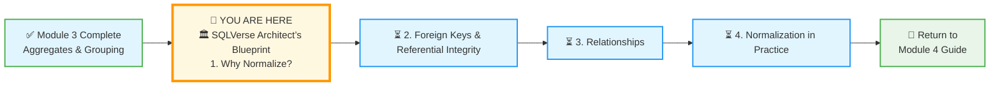
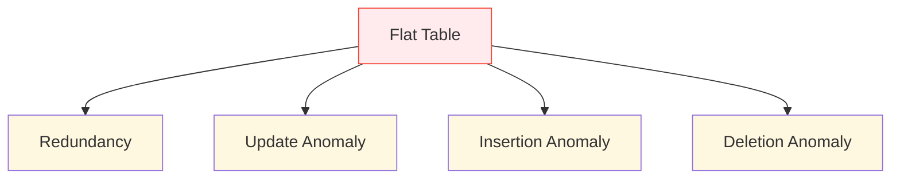
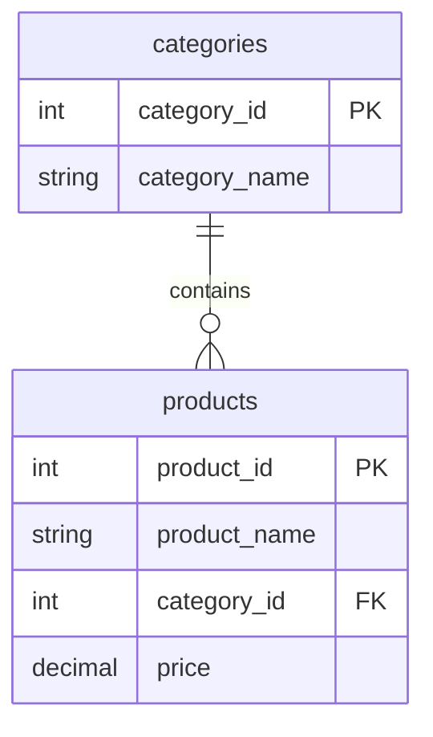

# 🗄️🤖 SQL & GenAI Course
**🎯 Quality Education for Anyone, Anywhere, Anytime — 💫 with Comfort, Convenience at no Cost**

## 🏛️ SQLVerse Architect’s Blueprint – File 1: Why Normalize?

Welcome to the **SQLVerse Architect’s Blueprint** – your foundation for understanding how professional databases are designed. In Module 3, you used a **flat** E‑Store database to master sorting, aggregation, and grouping. It worked beautifully. But as a business grows, so do its problems.

In this file, you’ll discover why storing data in a single, flat table can become **dangerous**, and why the Artisan’s path is to **normalize** – to split data into smaller, connected tables. This is the **“Big Reveal”** that sets the stage for everything you’ll learn in Module 4.

---

## 🌌 SQLVerse Check-In

**You are now on E‑Commerce Planet, but something has changed.** The CEO is thrilled with your reports, but the CTO is worried. Behind the scenes, the simple `products` table you used in Module 3 is starting to show cracks. The business is growing, and with growth comes data integrity nightmares.

In this file, you’ll step into the shoes of a **Data Architect** – someone who designs databases to be safe, efficient, and scalable. We’ll explore the problems with flat tables and why we need to **normalize**.

**The difference between a coder and an Artisan is discipline.**

---

## 📍 Your Current Stage – PREPARE Journey

You’re about to embark on the **PREPARE** stage of Module 4. This file is the first of four conceptual files that will transform how you think about data.

---

## 🛑 The Problem: A Flat Table’s Dark Secrets

Let’s revisit the `products` table from Module 3. It looked something like this:

| product_id | product_name      | category    | price |
|------------|-------------------|-------------|-------|
| 1          | Laptop            | Electronics | 1200  |
| 2          | Coffee Maker      | Appliances  | 80    |
| 3          | SQL Essentials Book | Books    | 45    |
| 4          | Headphones        | Electronics | 150   |
| 5          | Blender           | Appliances  | 60    |

At first glance, it seems fine. But imagine the E‑Store now has **500 products**. Suddenly, the word “Electronics” appears in hundreds of rows. **The "Spreadsheet" mindset works... until it doesn't:**

### 🔥 The Four Horsemen of Flat Table Apocalypse

1. **Redundancy** – The same category name (“Electronics”) is stored over and over. Wasted space, and worse, it invites mistakes. Storing "Electronics" 500 times is like writing the same sentence on 500 different pages. It’s a waste of ink (storage) and an invitation for a typo to sneak in.

2. **Update Anomaly** – What happens if the CEO decides to rename “Electronics” to “Tech & Gadgets”? In a flat table, you’d have to update **every single row** that contains that category. Miss one, and your data is inconsistent. If your query misses just **one** row out of 10,000, your database now has two "truths." Which one is right?

3. **Insertion Anomaly** – Suppose you want to add a new category (“Toys”) but you don’t have any products yet. With a flat table, you’d have to create a **dummy** product just to store the category which is **messy**. The alternative?  Completely **avoiding** to record that category which is worse. The database is holding your business strategy **hostage**.

4. **Deletion Anomaly** – If you delete the last product in a category, you lose the category information entirely. Did “Books” ever exist? After deletion, the data is gone. You’ve deleted your **history** along with your inventory.

These are not theoretical problems. In real‑world databases, they lead to **corrupted reports, wrong decisions, and hours of debugging**.

---

## 🎨 Visualizing the Update Anomaly

Imagine a small slice of our flat table, but with a typo in one row:

| product_id | product_name | category     | price |
|------------|--------------|--------------|-------|
| 1          | Laptop       | Electronics  | 1200  |
| 2          | Coffee Maker | Appliances   | 80    |
| 3          | SQL Book     | Electronics  | 45    |
| 4          | Headphones   | Electronics  | 150   |
| 5          | Blender      | **Appliance** | 60    |

Now, when you run `SELECT category, COUNT(*) FROM products GROUP BY category;`, you’ll see two different spellings for what should be the same category. Your report is wrong.

This is the kind of silent corruption that happens in flat tables as they grow. It’s the reason professional databases are **normalized**.

---

## 🏛️ The Relational Solution: Normalization

Normalization is the process of **decomposing** a table into smaller, themed tables to eliminate these risks.

**We move from one “Master List” to an “Ecosystem”:**
- **Products Table:** Only stores product‑specific info (name, price).
- **Categories Table:** Only stores category names.
- **Suppliers Table:** Only stores contact info and locations.

### 💎 The Artisan's Benefit
By normalizing, you ensure **Data Integrity**. The data becomes “Atomic”—each piece of information lives in exactly **one place**.

> *“In a normalized database, you tell the truth once. In a flat table, you have to remember to keep your lies consistent.”*

---

## 💡 The Artisan’s Insight: One Fact, One Place

The solution is to **normalize** – to split the data into multiple, related tables so that each piece of information is stored **exactly once**. For the E‑Store, we will:

- Create a `categories` table with a unique `category_id` and `category_name`.
- Replace the text column `category` in the `products` table with a `category_id` that references the `categories` table.

Now, “Electronics” is stored **once**. To rename it, you change **one row** in the `categories` table, and all products automatically reflect the change. No more anomalies, no more typos.

---

## 🏛️ The Artisan’s Guardrail: The Cost of Normalization

Normalization isn’t free. It introduces complexity: you now need to **join** tables to get the full picture. But for data integrity and scalability, it’s the Artisan’s choice. The trade‑off is:

- **Flat table:** Simple for beginners, but fragile at scale.
- **Normalized schema:** A bit more work upfront, but robust and professional.

> 💎 **Artisan’s Insight:** *“A flat table is a prototype. A normalized schema is a production system. Learn both, but build for the future.”*

---

## ✅ Progress Check

After reading this, can you:

- [ ] Explain why storing the same category name in hundreds of rows is problematic?
- [ ] Describe an **update anomaly** using the E‑Store example?
- [ ] Describe an **insertion anomaly**?
- [ ] Describe a **deletion anomaly**?
- [ ] Articulate why normalization is called “one fact, one place”?
- [ ] Understand the trade‑off between simplicity and integrity?

**If yes → You’re ready for File 2: Foreign Keys & Referential Integrity!**

---

## 💎 DESIGNER'S PERIGON

### *The Art of Structure*

A flat table is like a pile of bricks. It works for a small wall, but if you want to build a skyscraper, you need a blueprint. Normalization is that blueprint.

You’ve already seen the power of `GROUP BY` on a flat table. Now you’re about to discover the elegance of a well‑designed database – where every fact lives in one place, and changes ripple through the system without breaking it.

> *“A database is not just a container for data. It is a model of reality. When you design it well, it becomes a mirror of truth.”*

## 🧠 The “Big Reveal” Plot Twist

You might be thinking: *“Wait, in Module 3 I used `GROUP BY category` and it was easy! Why complicate things?”*

Exactly! That’s the **plot twist**. In Module 3, the flat table was perfect for learning aggregates. But now, as the business grows, the CTO is demanding **data integrity**. The simple solution that worked for a handful of products becomes a liability at scale.

**Normalization is the Artisan’s answer to scaling data.** It’s the difference between a prototype and a production system.

In the next file, we’ll learn the tools that make normalization possible: **Foreign Keys** and **Referential Integrity**. Then, in the **Refactoring Lab**, we will perform this transformation – splitting the flat `products` table into a normalized structure, right in your Factory.

---

## 🧭 File Navigation

After these four conceptual files, you’ll step into the **Refactoring Lab** and actually transform the E‑Store database. Then you’ll use that normalized database to learn **JOINs**.

| Previous Step | Next Step |
|:---:|:---:|
| [← Back to Module 3 Guide](../../Module3-Sort-Aggregate-Group/MODULE3_GUIDE.md) | [Continue to File 2: Foreign Keys & Referential Integrity →](./2-Foreign-Keys-Referential-Integrity.md) |

---

*Part of our mission for 🎯 Quality Education for Anyone, Anywhere, Anytime — 💫 with Comfort, Convenience at no Cost.*

**Level 1 | Module 4 | SQLVerse Architect’s Blueprint | Next: [Foreign Keys](./2-Foreign-Keys-Referential-Integrity.md)**