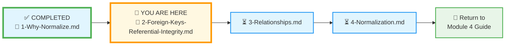
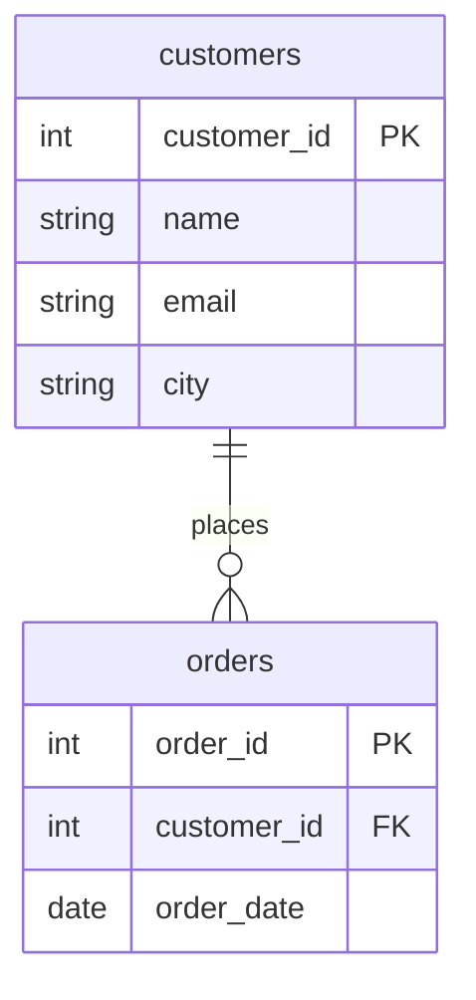
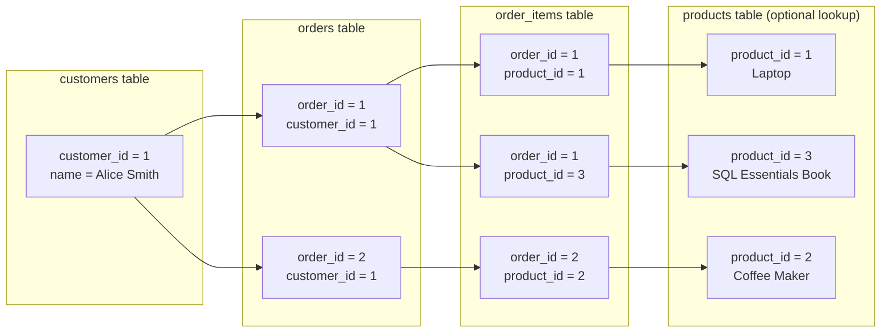
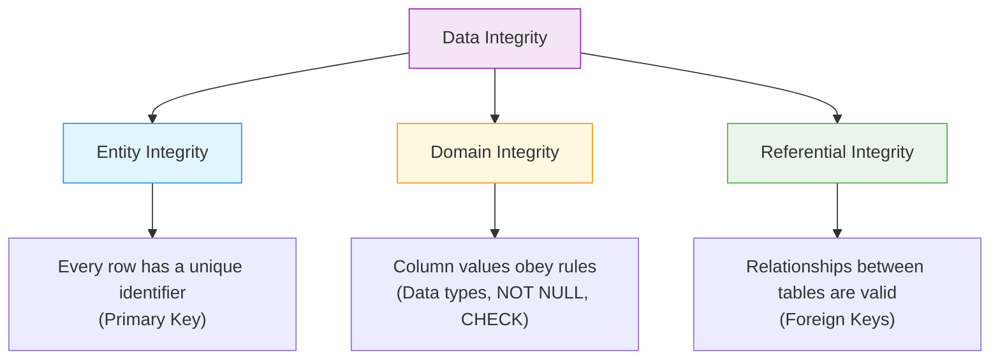
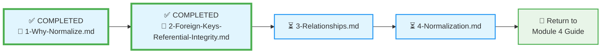

# 🗄️🤖 SQL & GenAI Course
**🎯 Quality Education for Anyone, Anywhere, Anytime — 💫 with Comfort, Convenience at no Cost**

## 🏛️ SQLVerse Architect’s Blueprint – File 2: Foreign Keys & Referential Integrity

Welcome back to the **SQLVerse Architect’s Blueprint**. In File 1, you discovered why flat tables are dangerous and why normalization is the Artisan’s solution. Now you’ll learn the **glue** that holds a normalized database together: **foreign keys** and **referential integrity**.

---

## 🌌 SQLVerse Check-In

<div style="border-left: 4px solid #9c27b0; background-color: #f3e5f5; padding: 15px; margin: 20px 0; border-radius: 0 8px 8px 0;">

**You are now moving from the *why* to the *how*.** Normalization told us to split data into multiple tables. But how do we keep those tables connected? How does the database know that a product belongs to a category? The answer is **foreign keys** – the threads that weave separate tables into a coherent fabric.

**The difference between a coder and an Artisan is discipline.**

</div>

---

## 📍 Your Current Stage – PREPARE Journey



You’ve completed File 1. Now you’ll learn the mechanism that makes normalization work.

---

## ✨ Bonus Skill: DELETE – Removing Data

Before we dive into foreign keys, let’s learn how to **remove** data – a skill you’ll need for the interactive experiments in this file. The SQL  **`DELETE`** statement is used to remove existing rows from a table. The key to using it safely and effectively is the `WHERE` clause, which specifies exactly which records to remove.

### 🔧 Basic DELETE Syntax

```sql
DELETE FROM table_name
WHERE condition;
```

> ⚠️ **Artisan’s Warning:** Without a `WHERE` clause, `DELETE` removes **every row** in the table. Always test your condition with a `SELECT` first.

### 🧪 Practice: Insert and Delete Customers

First, add two new customers to the `customers` table so we have fresh data to work with.

```sql
INSERT INTO customers (name, email, city) VALUES
('Wonder Woman', 'diana@themyscira.com', 'Themyscira'),
('Bruce Wayne', 'bruce@wayne.com', 'Gotham');
```

Now, let’s delete one of them safely. Run a `SELECT` first to confirm which row you want to delete.

```sql
-- Preview
SELECT * FROM customers WHERE name = 'Wonder Woman';

-- Delete
DELETE FROM customers WHERE name = 'Wonder Woman';
```

**Try it now in Tab 2.**  
**What you’re seeing:** The `DELETE` statement removes the row. Without a `WHERE`, it would delete all customers. Always double‑check your condition!

---

## 🔗 What Is a Foreign Key?

A **foreign key** is a column (or set of columns) in one table that refers to the **primary key** of another table. It creates a link between the two tables.

In our E‑Store database, the `orders` table already contains a foreign key:

- `orders.customer_id` references the `customer_id` primary key in the `customers` table.



**The arrow** tells you: `orders.customer_id` points to `customers.customer_id`. This is the foreign key.


> 💡 **Connecting to Module 3 – The Passport Analogy**  
>  
> In **File 3 of the Architect’s Ledger (Primary Keys)** , we concluded that a **Primary Key** is like a **passport** – a unique, immutable identifier that proves identity.  
>  
> A **Primary Key** is the *passport – the eternal truth*. The country code of your home country and the passport number in your passport are the unique identifiers that never change.  
>  
> A **Foreign Key** is like the *pages that get added to the passport when you visit other countries*. The passport number (primary key) never changes. You can visit another country multiple times, and each visit adds a stamp (a foreign key reference) – the same country can stamp your passport many times.  
>  
> In our E‑Store, **`customer_id = 101`** in the `customers` table is the passport. Every time that customer places an order, a **new stamp** (a row in the `orders` table) appears, carrying that same `customer_id` as a foreign key. The primary key is the eternal truth; the foreign key is the record of relationships.
> 
---

## ⚓ The Tethers of the SQLVerse

If we shatter our data into different tables, how do we make sure they stay connected? We use **Foreign Keys**.

### ⚓ The Anchor: Primary Key (PK)
A Primary Key (like `customer_id` in the `customers` table) is the **unique ID** in the home table. It is the “Source of Truth.”

### 🔗 The Tether: Foreign Key (FK)
A Foreign Key is that same ID “visiting” another table.  
- In the `customers` table, `customer_id` is the **Primary Key**.  
- In the `orders` table, `customer_id` is a **Foreign Key**.

> 💡 **Multiple Tethers:** The `order_items` table contains two foreign keys – `order_id` referencing `orders(order_id)` and `product_id` referencing `products(product_id)`. This is how a single row can be tethered to two different tables.

### 🛡️ Referential Integrity: The Safety Net
This is a set of rules the database enforces to prevent “Orphaned Data.”
- **The Rule:** You cannot insert an order with `customer_id = 99` if customer 99 doesn’t exist in the `customers` table.
- **The Guardrail:** You cannot delete a customer if there are still orders linked to that customer (unless you specify otherwise).

**This ensures the bridges (Joins) you build in Module 4 will never lead to a “404 Not Found” destination.**

---

## 🧪 Interactive Lab: Testing the Guardrails

Now let’s see referential integrity in action using three related tables: `products`, `orders`, and `order_items`.

### 📂 Open Your Database
In **Tab 2 (The Factory)** , open the **E‑Store database** (`level1_estore_basic.db`). Take a moment to look at the tables:

```sql
SELECT * FROM products;
SELECT * FROM orders;
SELECT * FROM order_items;
```

Notice how `order_items` uses `order_id` and `product_id` to connect to the other two tables.

### 📋 The Table Definitions (Simplified)

```sql
CREATE TABLE products (
    product_id INTEGER PRIMARY KEY,
    product_name TEXT,
    price REAL
);

CREATE TABLE orders (
    order_id INTEGER PRIMARY KEY,
    customer_id INTEGER,
    order_date TEXT,
    FOREIGN KEY (customer_id) REFERENCES customers(customer_id)
);

CREATE TABLE order_items (
    order_item_id INTEGER PRIMARY KEY,
    order_id INTEGER,
    product_id INTEGER,
    quantity INTEGER,
    FOREIGN KEY (order_id) REFERENCES orders(order_id),
    FOREIGN KEY (product_id) REFERENCES products(product_id)
);
```

These foreign keys are the guardrails that keep your data consistent.

### 🔍 See the Tethers in Action

Let’s look at the first few rows from the three tables and trace the connections.

#### Customers Table (first 3 rows)
| customer_id | name          | email               | city       |
|-------------|---------------|---------------------|------------|
| 1           | Alice Smith   | alice@email.com     | New York   |
| 2           | Bob Johnson   | bob@email.com       | Chicago    |
| 3           | Charlie Lee   | charlie@email.com   | New York   |

#### Orders Table (first 3 rows)
| order_id | customer_id | order_date |
|----------|-------------|------------|
| 1        | 1           | 2025-10-01 |
| 2        | 2           | 2025-10-01 |
| 3        | 1           | 2025-10-03 |

#### Order_Items Table (first 3 rows)
| order_item_id | order_id | product_id | quantity |
|---------------|----------|------------|----------|
| 1             | 1        | 1          | 1        |
| 2             | 1        | 3          | 1        |
| 3             | 2        | 2          | 1        |

#### Following the Foreign Keys

1. `order_items.order_id` → points to `orders.order_id`.  
   Example: `order_item_id = 1` belongs to `order_id = 1`.

2. `orders.customer_id` → points to `customers.customer_id`.  
   Example: `order_id = 1` belongs to `customer_id = 1` (Alice Smith).

3. `order_items.product_id` → points to `products.product_id` (not shown, but you can run `SELECT * FROM products;` in your Factory).

> 🧠 **Visual Trace Exercise – Manual Join**  
> 1. Find Alice Smith in the `customers` table (her `customer_id` is 1).  
> 2. Look at the `orders` table. How many orders does `customer_id = 1` have?  
> 3. Now look at the `order_items` table. What products (by `product_id`) did she buy in `order_id = 1`?  
> 4. (Optional) Run `SELECT * FROM products WHERE product_id IN (1,3);` to see the product names.  
>  



> **You just performed a manual JOIN – tracing a customer through their orders to the items they purchased. In Module 4, you'll learn to do this with a single query.**

**The complete chain:**  
An order item tells you which product was bought, which order it was part of, and which customer placed that order – all through foreign keys.

Now, when you run a `JOIN` in Module 4, you’ll be able to retrieve the customer’s name, the order date, and the product name in a single query, thanks to these links. Consider this scenario: there is an error in data entry and you want to update the quantity in the `Order_Items` table; for the update you need to provide the complete information – `order_item_id`, `order_id`, and `product_id` – to target the correct row precisely. Before running the update query, use the `JOIN` to retrieve the record to verify that you are updating the correct record. All these will be demonstrated in detail in the **PREPARE** section.


### 🚫 Attempt 1: Delete a Referenced Product

Try to delete a product that appears in `order_items` (e.g., `product_id = 1`).

```sql
DELETE FROM products WHERE product_id = 1;
```

**Expected Result:** The database will refuse with an error like:
```
FOREIGN KEY constraint failed
```

**What you’re seeing:** The database is protecting you! It won’t let you delete a product that still has order items attached. Otherwise, those order items would become **orphaned** – pointing to nothing.

### 🚫 Attempt 2: Insert an Order with a Fake Customer

Now try to insert an order with a `customer_id` that doesn’t exist (e.g., `999`).

```sql
INSERT INTO orders (customer_id, order_date) VALUES (999, '2025-01-01');
```

**Expected Result:** Another foreign key error. The database enforces that every order must belong to a real customer.

These errors are **good** – they prevent data corruption. In a well‑designed database, the rules are enforced at the database level, not left to application code.

---

## 🛡️ Referential Integrity – The Database’s Promise

A foreign key by itself is just a column. But when you **declare** it as a foreign key (using SQL), you activate **referential integrity** – a set of rules that the database enforces automatically.

### 🔍 What Referential Integrity Does

- **No orphaned records:** You cannot insert an order with a `customer_id` that doesn’t exist in the `customers` table.
- **No accidental deletions:** You cannot delete a product that is still referenced in `order_items` (unless you specify otherwise).
- **Consistency guaranteed:** The database ensures that every foreign key value has a matching primary key.

### 🧩 The Options: What Happens When You Delete?

Sometimes you *do* want to delete a parent record, and you need to decide what happens to its children. SQL offers **referential actions**:

| Action | Effect |
|--------|--------|
| `ON DELETE RESTRICT` (default) | Prevents deletion if child rows exist. |
| `ON DELETE CASCADE` | Deletes the child rows automatically when the parent is deleted. |
| `ON DELETE SET NULL` | Sets the foreign key column to `NULL` (if allowed) when the parent is deleted. |

> ⚠️ **Cascade Danger:** Deleting a customer with `ON DELETE CASCADE` would also delete all their orders – potentially erasing valuable sales history.

> ✅ **When CASCADE is safe:** Temporary test data, log tables, or child records that have no independent value (e.g., a `sessions` table tied to a user).

**Artisan’s Choice:** In most business scenarios, `RESTRICT` is safest – it forces you to handle orphans explicitly. `CASCADE` can be dangerous if used without thinking (e.g., deleting a customer could delete all their orders without warning).

---

## 🏛️ The Three Pillars of Data Integrity

In **[The Architect’s Ledger: RDBMS Core Concepts](../../../../Module3-Sort-Aggregate-Group/1-sqlCommands/1-theArchitectsLedger/1-RDBMS-Core-concepts.md)** , we discussed **ACID Compliance** – the properties that guarantee reliable transactions. One of those properties is **Consistency**, which ensures that data always follows defined rules. This concept of **data integrity** refers to the accuracy, consistency, and reliability of data throughout its entire lifecycle – from creation to deletion. It ensures data remains trustworthy, uncorrupted, and unaltered, preventing unauthorized modifications.

Data integrity isn’t just about foreign keys. It rests on three pillars, each enforced by different database features.



1. **Entity Integrity** – Guarantees that each row is uniquely identifiable. Enforced by **Primary Keys** (no NULLs, no duplicates).

2. **Domain Integrity** – Ensures that column values are valid. Enforced by **data types**, **NOT NULL**, **UNIQUE**, **CHECK** constraints, and **DEFAULT** values.

3. **Referential Integrity** – Ensures that relationships between tables remain consistent. Enforced by **Foreign Keys** with referential actions.

In this file, we focus on **Referential Integrity**. The other pillars are covered in the **SQLVerse Architect’s Blueprint** and the constraints section below.

---

## 🔒 Constraints: The Rules That Guard Your Data

Constraints are the database’s way of enforcing the rules of your data model. They are the **guardrails** that prevent bad data from ever entering your system.

| Constraint | Purpose | Example |
|------------|---------|---------|
| **`NOT NULL`** | Ensures a column cannot have NULL values. | `email TEXT NOT NULL` |
| **`UNIQUE`** | Guarantees all values in a column are distinct. | `email TEXT UNIQUE` |
| **`CHECK`** | Verifies that values meet a condition. | `price DECIMAL CHECK(price > 0)` |
| **`DEFAULT`** | Provides a default value when none is supplied. | `is_active INTEGER DEFAULT 1` |
| **`PRIMARY KEY`** | Uniquely identifies each row (NOT NULL + UNIQUE). | `product_id INTEGER PRIMARY KEY` |
| **`FOREIGN KEY`** | Links to a primary key in another table. | `FOREIGN KEY (category_id) REFERENCES categories(category_id)` |

In the **Refactoring Lab**, you’ll see these constraints in action when you create the normalized tables. They are the bedrock of a reliable database.

> 💎 **Artisan’s Insight:** *“Constraints are not obstacles; they are guarantees. Every constraint you add is a promise that the database will protect your data from mistakes you haven’t even made yet.”*

---

## ✅ Progress Check

After reading this and trying the interactive examples, can you:

- [ ] Define a foreign key and explain its purpose?
- [ ] Describe what referential integrity guarantees?
- [ ] Name at least one referential action (e.g., `CASCADE`) and when you might use it?
- [ ] Explain why orphaned records are dangerous?
- [ ] Understand that foreign keys are the “glue” that makes normalized databases work?
- [ ] Use `DELETE` safely with a `WHERE` clause?
- [ ] Observe the errors that occur when violating foreign key constraints?

**If yes → You’re ready for File 3: Relationships!**

---

## 💎 DESIGNER'S PERIGON

<div style="border: 3px solid #9c27b0; border-radius: 10px; padding: 20px; margin: 25px 0; background: linear-gradient(135deg, #f3e5f5 0%, #e1bee7 100%);">

### *The Art of Connection*

A foreign key is more than a column; it’s a **contract**. It says: “This data belongs with that data, and the database will enforce that truth.”

You’ve moved from seeing tables as isolated islands to seeing them as a network. Each foreign key is a bridge. Each referential integrity rule is a guardrail that prevents you from driving off the edge.

> *“A database without referential integrity is a house of cards. A database with it is a fortress.”*

> *“Not every constraint belongs at the database level. Email format validation, for example, is often handled by the application. While databases like PostgreSQL, Oracle, and SQL Server can enforce patterns with `CHECK` constraints, such checks consume CPU cycles and slows down the database performance. For high‑volume systems, pushing that logic to the application layer preserves database resources for what it does best: storing and relating data. The Artisan knows where to draw the line.”*

> *“Just because you can do something in SQL doesn't always mean you should.”*
</div>

---

## 🧭 File Navigation



| Previous Step | Next Step |
|:---:|:---:|
| [← Back to File 1: Why Normalize?](./1-Why-Normalize.md) | [Continue to File 3: Relationships →](./3-Relationships.md) |

---

*Part of our mission for 🎯 Quality Education for Anyone, Anywhere, Anytime — 💫 with Comfort, Convenience at no Cost.*

**Level 1 | Module 4 | SQLVerse Architect’s Blueprint | Next: [Relationships](./3-Relationships.md)**