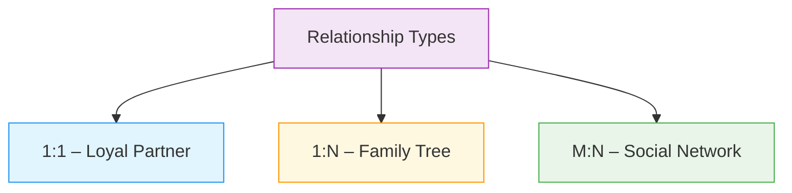
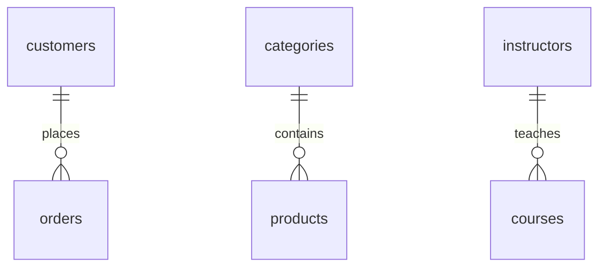
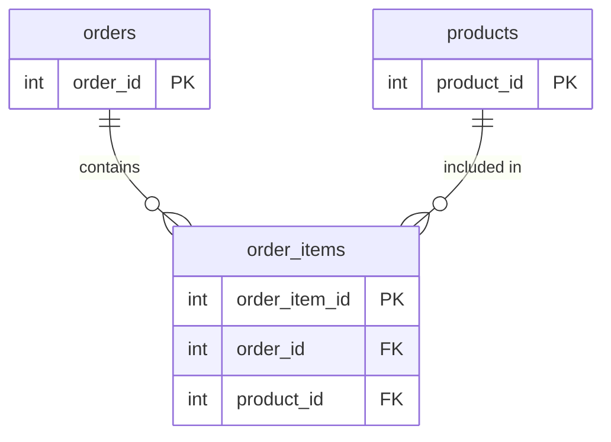

# 🗄️🤖 SQL & GenAI Course
**🎯 Quality Education for Anyone, Anywhere, Anytime — 💫 with Comfort, Convenience at no Cost**

## 🏛️ SQLVerse Architect’s Blueprint – File 3: Relationships

Welcome to the third file of the **SQLVerse Architect’s Blueprint**. You’ve learned why we normalize (File 1) and how we connect tables with foreign keys and referential integrity (File 2). Now you’ll discover the **blueprints** that define how tables relate to one another: **one‑to‑one**, **one‑to‑many**, and **many‑to‑many** relationships.

---

## 🌌 SQLVerse Check-In

<div style="border-left: 4px solid #9c27b0; background-color: #f3e5f5; padding: 15px; margin: 20px 0; border-radius: 0 8px 8px 0;">

**You are now moving from *how* to *what kind* of connection.** Foreign keys tell you that two tables are linked, but they don’t describe the *nature* of the link. Is one customer allowed to have many orders? Can a product belong to multiple categories? Understanding **relationships** is the key to **designing** a database that mirrors the real world.

In the real world, data doesn’t just exist in isolation; it interacts. A customer *places* orders. A product *belongs to* a category. These interactions—the “Social Logic” of your data—are what we call **Relationships**.

**The difference between a coder and an Artisan is discipline.**

</div>

---

## 📍 Your Current Stage – PREPARE Journey


You’ve mastered foreign keys. Now you’ll learn the patterns that define how tables interact.

---

## 👥 The Three Social Circles of Data

In database design, every interaction falls into one of three relationship types. Identifying these is the “Big Secret” to designing schemas that never break.



---

### 1️⃣ One‑to‑One (1:1) – The “Loyal Partner”

**The Concept:** Each record in Table A relates to exactly one record in Table B, and vice‑versa.

**Real‑World Example:** A **User** and their **Account Security Settings**. You don’t have multiple security settings profiles for one login; you have one unique pair. In a company, an **Employee** might have exactly one **Office** assigned.

**Design:** You often put these in the same table. If you split them, they share the same Primary Key, or one table’s primary key is also a foreign key referencing the other.

```sql
-- Example (conceptual)
CREATE TABLE users (
    user_id INTEGER PRIMARY KEY,
    username TEXT
);

CREATE TABLE security_settings (
    user_id INTEGER PRIMARY KEY,
    two_factor_enabled BOOLEAN,
    FOREIGN KEY (user_id) REFERENCES users(user_id)
);
```

**In our databases:** A one‑to‑one relationship doesn’t appear in the current E‑Store or Training Institution schemas, but you could imagine a `customer_details` table where each customer has exactly one row of extended info.

---

### 2️⃣ One‑to‑Many (1:N) – The “Family Tree”

**The Concept:** One record in Table A can relate to many records in Table B, but each record in Table B relates to only one in Table A.

**Real‑World Example:** Our **Customers and Orders**. Alice can place 10 orders, but each of those orders belongs only to Alice.  
- One **Category** can contain many **Products**.  
- One **Instructor** can teach many **Courses**.

**Design:** This is the most common relationship. Place a **foreign key** in the “many” side table that references the “one” side’s primary key.



#### E‑Store Example
```sql
CREATE TABLE customers (
    customer_id INTEGER PRIMARY KEY,
    name TEXT,
    email TEXT
);

CREATE TABLE orders (
    order_id INTEGER PRIMARY KEY,
    customer_id INTEGER,
    order_date TEXT,
    FOREIGN KEY (customer_id) REFERENCES customers(customer_id)
);
```

#### Training Institution Example
```sql
CREATE TABLE instructors (
    instructor_id INTEGER PRIMARY KEY,
    first_name TEXT,
    last_name TEXT
);

CREATE TABLE courses (
    course_id INTEGER PRIMARY KEY,
    course_name TEXT,
    instructor_id INTEGER,
    FOREIGN KEY (instructor_id) REFERENCES instructors(instructor_id)
);
```

> 💡 **Key Insight:** The “many” side holds the foreign key. This is the pattern you’ll use most often in joins.

---

### 3️⃣ Many‑to‑Many (M:N) – The “Social Network”

**The Concept:** Many records in Table A can relate to many records in Table B.

**Real‑World Example:** **Orders and Products**. One order can contain many products; one product can appear in many different orders.  
- **Students** and **Courses**: A student can enroll in many courses; a course can have many students.

---

## 🌉 The Junction Table: The Artisan's Matchmaker

In the M:N scenario (Orders ↔ Products), how do we store the data? If we put `product_id` in `orders`, we can only have one product per order. If we put `order_id` in `products`, we can only have one order per product.

**The Solution:** We create a third table—the **Junction Table**—that sits in the middle. This table doesn't have its own "data" like names or dates; it simply holds the `order_id` and the `product_id` together.



By splitting the Many-to-Many relationship into two One-to-Many relationships, we make the database flexible, scalable, and clean.

---

### Training Institution Example
```sql
CREATE TABLE students (
    student_id INTEGER PRIMARY KEY,
    first_name TEXT,
    last_name TEXT
);

CREATE TABLE courses (
    course_id INTEGER PRIMARY KEY,
    course_name TEXT
);

CREATE TABLE enrollments (
    enrollment_id INTEGER PRIMARY KEY,
    student_id INTEGER,
    course_id INTEGER,
    enrollment_date DATE,
    FOREIGN KEY (student_id) REFERENCES students(student_id),
    FOREIGN KEY (course_id) REFERENCES courses(course_id)
);
```

### E‑Store Example (Many‑to‑Many between Orders and Products)
```sql
CREATE TABLE orders (
    order_id INTEGER PRIMARY KEY,
    customer_id INTEGER,
    order_date TEXT
);

CREATE TABLE products (
    product_id INTEGER PRIMARY KEY,
    product_name TEXT,
    price REAL
);

CREATE TABLE order_items (
    order_item_id INTEGER PRIMARY KEY,
    order_id INTEGER,
    product_id INTEGER,
    quantity INTEGER,
    FOREIGN KEY (order_id) REFERENCES orders(order_id),
    FOREIGN KEY (product_id) REFERENCES products(product_id)
);
```

The `order_items` table is the junction table. It allows each order to contain many products, and each product to appear in many orders.

> 💎 **Artisan’s Insight:** *“A many‑to‑many relationship is not a direct link; it’s a relationship that requires a dedicated table. That table often holds additional information, like quantity or enrollment date.”*

> 💎 **Why Relationships Matter:** If you try to build a system without understanding these three circles, you will eventually find yourself trying to shove a “Many” relationship into a “One” slot. That’s when your database stops being a “Fortress” and starts being a mess.

---

<div style="border-left: 4px solid #ff9800; background-color: #fff8e1; padding: 15px; margin: 20px 0; border-radius: 0 8px 8px 0;">

### 🧠 Artisan’s Quick Tips

> **Tip 1:** If you see an ID in a table that refers to another table’s name (e.g., `instructor_id` in the `courses` table), you are likely looking at a **1:N relationship**. The “many” side holds the foreign key.

> **Tip 2:** **Junction tables** (like `enrollments` or `order_items`) are the “glue” of complex databases. You will often join *through* them to get the information you need.

</div>

---

## 🧪 Interactive Lab: Discover Relationships in Your Databases

### 🎨 The Artisan's Compass: Reading the Schema

Before you write a `JOIN`, always ask:

1. **Which table is the "Source of Truth"?** (The one with the Primary Key).
2. **Which table is the "Referencer"?** (The one with the Foreign Key).
3. **What is the common thread?** (The ID column they share).

**The Artisan’s Secret:** Always sketch your relationships on a piece of paper *before* you open your SQL editor. If the sketch doesn’t make sense to a non‑technical manager, the code won’t make sense to your team.

Now, open your **Factory (Tab 2)** and explore the relationships in the **Training Institution** and **E‑Store** databases. The tables below show all rows (you can run `SELECT *` in your Factory to verify).

### Task 1: One‑to‑Many (1:N) – Instructors to Courses
*One instructor can teach many courses. The foreign key `instructor_id` is in the `courses` table.*

**`instructors` Table (all rows)**

| instructor_id | first_name | last_name | email | specialization |
|---------------|------------|-----------|-------|----------------|
| 501 | Emily | Watson | emily.w@institution.com | Web Development |
| 502 | James | Wilson | james.w@institution.com | Backend & SQL |
| 503 | Maria | Garcia | maria.g@institution.com | Data Science |
| 504 | Robert | Chen | robert.c@institution.com | Cybersecurity |
| 505 | Ahmed | Khan | ahmed.k@institution.com | Machine Learning |

**`courses` Table (all rows)**

| course_id | course_name | course_track | instructor_id | course_fee |
|-----------|-------------|--------------|---------------|------------|
| 201 | Frontend Development | Web Development | 501 | 1500.00 |
| 202 | Backend with Node.js | Web Development | 502 | 1800.00 |
| 203 | Python for Data Analysis | Data Science | 503 | 2000.00 |
| 204 | Network Security Fundamentals | Cybersecurity | 504 | 1600.00 |
| 205 | Full Stack Project | Web Development | 501 | 1200.00 |
| 206 | Machine Learning Basics | Data Science | 505 | 2200.00 |
| 207 | Data Analysis for Beginners | Data Science | 503 | 800.00 |
| 208 | SQL Basics | Web Development | 502 | 600.00 |

**Your Task:**
1. Run `SELECT * FROM instructors;` and `SELECT * FROM courses;` in your Factory to see the full tables.
2. How many courses does instructor with ID 501 teach?  
   *Hint: `SELECT * FROM courses WHERE instructor_id = 501;`*
   *Count how many rows are returned – that’s the number of courses taught by instructor 501.*

---

### Task 2: Many‑to‑Many (M:N) – Students to Courses
*Many students can take many courses. The junction table `enrollments` holds the foreign keys `student_id` and `course_id`.*

**`students` Table (first 5 rows – run `SELECT * FROM students;` in your Factory to see the full list)**

| student_id | first_name | last_name | email |
|------------|------------|-----------|-------|
| 101 | Sarah | Chen | sarah.chen@email.com |
| 102 | Mike | Rodriguez | mike.rod@email.com |
| 103 | Jessica | Park | jessica.park@email.com |
| 104 | David | Thompson | david.t@email.com |
| 105 | Lisa | Johnson | lisa.j@email.com |
| ... | ... | ... | ... |

**`enrollments` Table (first 10 rows – run `SELECT * FROM enrollments;` to see all)**

| enrollment_id | student_id | course_id | enrollment_date | completion_status |
|---------------|------------|-----------|-----------------|-------------------|
| 1 | 101 | 201 | 2024-01-15 | Completed |
| 2 | 101 | 202 | 2024-03-01 | Ongoing |
| 3 | 102 | 203 | 2024-01-20 | Completed |
| 4 | 102 | 205 | 2024-04-01 | Ongoing |
| 5 | 103 | 201 | 2024-02-01 | Completed |
| 6 | 103 | 202 | 2024-04-01 | Ongoing |
| 7 | 104 | 204 | 2024-02-10 | Completed |
| 8 | 105 | 203 | 2024-02-15 | Completed |
| 9 | 105 | 205 | 2024-04-01 | Ongoing |
| 10 | 106 | 201 | 2024-03-01 | Completed |

**Your Task:**
1. Examine the `enrollments` table.  
   `SELECT * FROM enrollments LIMIT 5;`
2. Find all courses taken by student ID 101.  
   *Hint: `SELECT course_id FROM enrollments WHERE student_id = 101;`*  
   (If you want to see course names, you’d need a join – a preview of Module 4.)

---

### Task 3: Many‑to‑Many (M:N) – Orders to Products
*Many orders can contain many products. The junction table `order_items` holds the foreign keys `order_id` and `product_id`.*

**`orders` Table (all rows)**

| order_id | customer_id | order_date |
|----------|-------------|------------|
| 1 | 1 | 2025-10-01 |
| 2 | 2 | 2025-10-01 |
| 3 | 1 | 2025-10-03 |
| 4 | 4 | 2025-10-04 |
| 5 | 5 | 2025-10-05 |

**`products` Table (all rows)**

| product_id | product_name | price | category |
|------------|--------------|-------|----------|
| 1 | Laptop | 1200.00 | Electronics |
| 2 | Coffee Maker | 80.00 | Appliances |
| 3 | SQL Essentials Book | 45.00 | Books |
| 4 | Headphones | 150.00 | Electronics |
| 5 | Blender | 60.00 | Appliances |

**`order_items` Table (all rows)**

| order_item_id | order_id | product_id | quantity |
|---------------|----------|------------|----------|
| 1 | 1 | 1 | 1 |
| 2 | 1 | 3 | 1 |
| 3 | 2 | 2 | 1 |
| 4 | 3 | 4 | 2 |
| 5 | 4 | 3 | 1 |
| 6 | 4 | 5 | 1 |

**Your Task:**
1. Look at the `order_items` table.  
   `SELECT * FROM order_items LIMIT 5;`
2. Which products were in order ID 1?  
   *Hint: `SELECT product_id FROM order_items WHERE order_id = 1;`*

---
### Task 4: One‑to‑One (1:1) – Employee Details (HR Planet)
*A one‑to‑one relationship exists when each record in Table A is linked to exactly one record in Table B, and vice versa. For example, each **Employee** might have exactly one **EmployeeDetails** record containing their personal contact info, passport number, etc.*

**`employees` Table (first 5 rows)**

| employee_id | first_name | last_name | department |
|-------------|------------|-----------|------------|
| 101 | Sarah | Chen | Engineering |
| 102 | Mike | Rodriguez | Sales |
| 103 | Jessica | Park | Marketing |
| 104 | David | Thompson | Engineering |
| 105 | Lisa | Johnson | Sales |

**`employee_details` Table (all rows)**

| details_id | employee_id | phone | address | passport_number |
|------------|-------------|-------|---------|-----------------|
| 1 | 101 | 555-0101 | 123 Main St | AB123456 |
| 2 | 102 | 555-0102 | 456 Oak Ave | CD789012 |
| 3 | 103 | 555-0103 | 789 Pine Ln | EF345678 |
| 4 | 104 | 555-0104 | 321 Elm St | GH901234 |
| 5 | 105 | 555-0105 | 654 Maple Dr | IJ567890 |

**How to implement the one‑to‑one relationship:**
- The `employee_id` column in the `employee_details` table is a **foreign key** referencing `employees(employee_id)`.
- To ensure each employee has at most one details record, add a `UNIQUE` constraint on the foreign key.

```sql
CREATE TABLE employee_details (
    details_id INTEGER PRIMARY KEY,
    employee_id INTEGER UNIQUE,   -- Enforces one‑to‑one
    phone TEXT,
    address TEXT,
    passport_number TEXT,
    FOREIGN KEY (employee_id) REFERENCES employees(employee_id)
);
```
> 💡 **Artisan's Note:** An even tighter design would make `employee_id` the primary key of the `employee_details` table (since each employee has exactly one detail record). This is sometimes called a “shared primary key” pattern. Either way, the `UNIQUE` constraint ensures the one‑to‑one relationship.


**Your Task:**
1. In your Factory, run `SELECT * FROM employees;` and `SELECT * FROM employee_details;` (if the tables existed). Notice how each employee appears exactly once in the details table.
2. What would happen if you tried to insert a second details record for employee 101?  
   *Hint: The `UNIQUE` constraint would prevent it.*

> 💡 **Refactoring Lab Preview:** We will use this same example in the **Refactoring Lab** to design and build these tables from scratch. There, you'll actually create the tables, insert the data, and run the queries yourself.
---

## ✅ Progress Check

After reading this and trying the examples, can you:

- [ ] Describe a one‑to‑one relationship and give an example?
- [ ] Explain how a one‑to‑many relationship is implemented with a foreign key?
- [ ] Identify the “many” side in a one‑to‑many relationship?
- [ ] Describe a many‑to‑many relationship and explain why a junction table is needed?
- [ ] Find examples of each relationship type in the Training Institution or E‑Store databases?

**If yes → You’re ready for File 4: Normalization in Practice!**

---

## 💎 DESIGNER'S PERIGON

<div style="border: 3px solid #9c27b0; border-radius: 10px; padding: 20px; margin: 25px 0; background: linear-gradient(135deg, #f3e5f5 0%, #e1bee7 100%);">

### *The Art of Relationships*

Data rarely lives alone. A customer is meaningless without their orders. A course is empty without students. Relationships give context and meaning to isolated facts.

In this file, you’ve learned the three patterns that appear again and again in every database you’ll ever encounter:

- **One‑to‑many: The "Parent-Child" Link** – the workhorse of business data (customers → orders, categories → products). *One holds the many.*
- **Many‑to‑many: The "Web" Link** – the connector that builds networks (students ↔ courses, orders ↔ products). *Needs a junction table.*
- **One‑to‑one: The "Shadow" Link** – the occasional specialization (user → profile). *A unique foreign key.*

Each pattern has its place, and each is implemented with foreign keys – the threads you learned in File 2.

---

### 🏦 Relationships Across the SQLVerse – Banking Planet

Relationships are not just lines on a diagram—they are the **social logic** of your business. When you draw an ER (Entity‑Relationship) diagram, you are sketching the “rules of life” for your data.

On **Banking Planet**, we can observe the same patterns:

- **One‑to‑One (1:1)** – *Credit Card*: A customer can have only one credit card in a bank.
- **One‑to‑Many (1:N)** – *Accounts*: A customer can have multiple accounts (Savings, Current, Fixed Deposit, etc.).
- **Many‑to‑Many (M:N)** – *Loans*: A customer can avail multiple loans (Personal, Home, etc.), and a loan can have multiple customers (e.g., joint loan).

> *“A database is a mirror of reality. If your database relationships don’t match the reality of your business—e.g., if you think a customer can only avail one loan—your system will eventually reject the truth.”*

---

> *“A table without relationships is a list. A database with relationships is a story.”*

In the next file, you’ll see how these relationship patterns are formalized into **normalization** – the process of refining your tables to eliminate redundancy while preserving these connections.

**The SQLVerse expands. Go build relationships.**

</div>

---

## 🧭 File Navigation


| Previous Step | Next Step |
|:---:|:---:|
| [← Back to File 2: Foreign Keys & Referential Integrity](./2-Foreign-Keys-Referential-Integrity.md) | [Continue to File 4: Normalization in Practice →](./4-Normalization.md) |

---

*Part of our mission for 🎯 Quality Education for Anyone, Anywhere, Anytime — 💫 with Comfort, Convenience at no Cost.*

**Level 1 | Module 4 | SQLVerse Architect’s Blueprint | Next: [Normalization](./4-Normalization.md)**