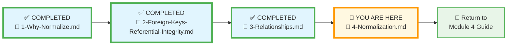
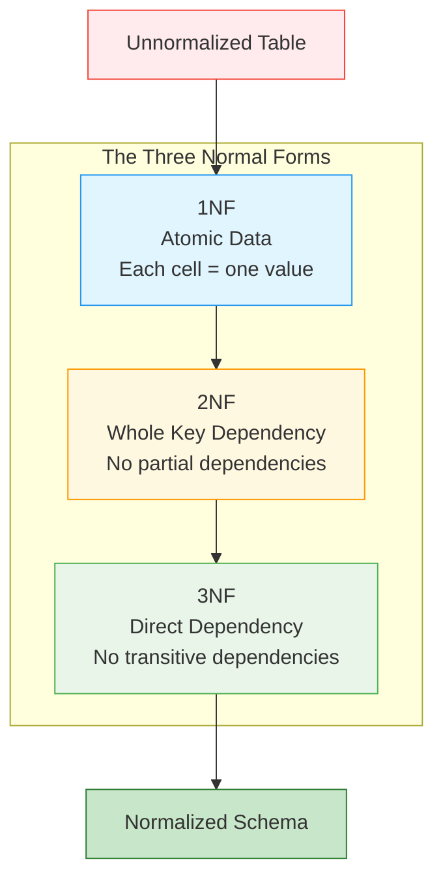
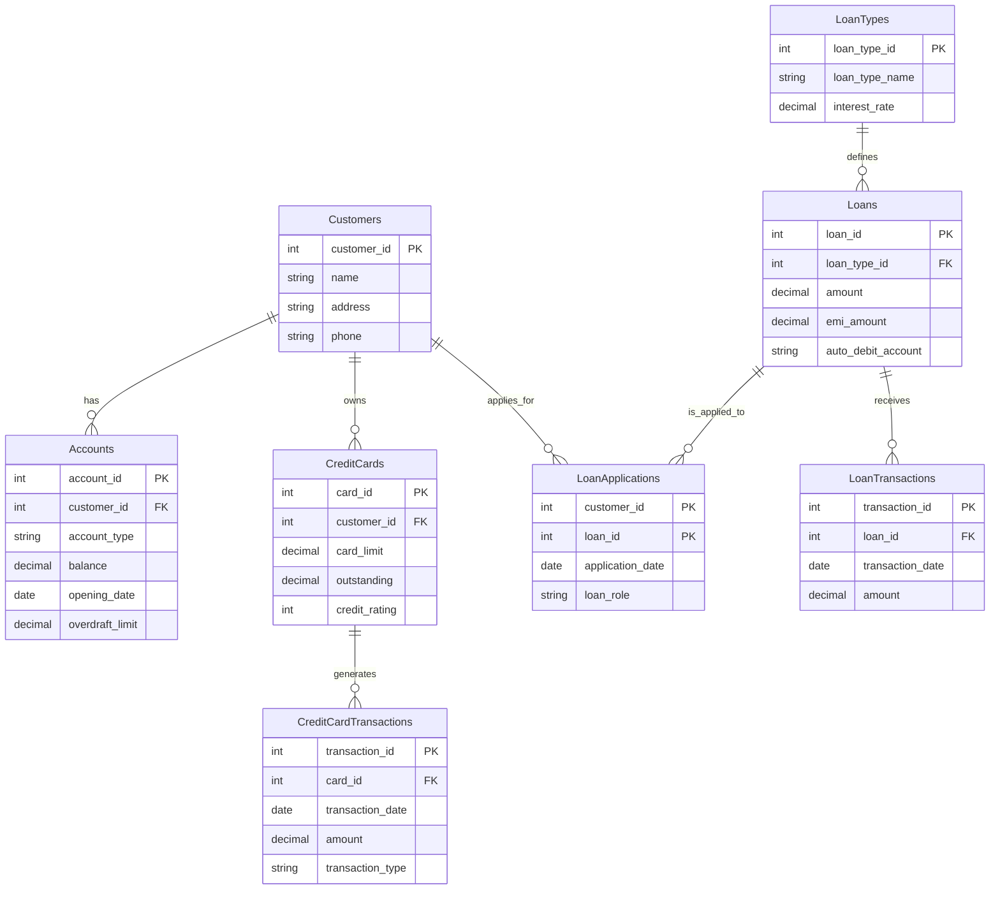
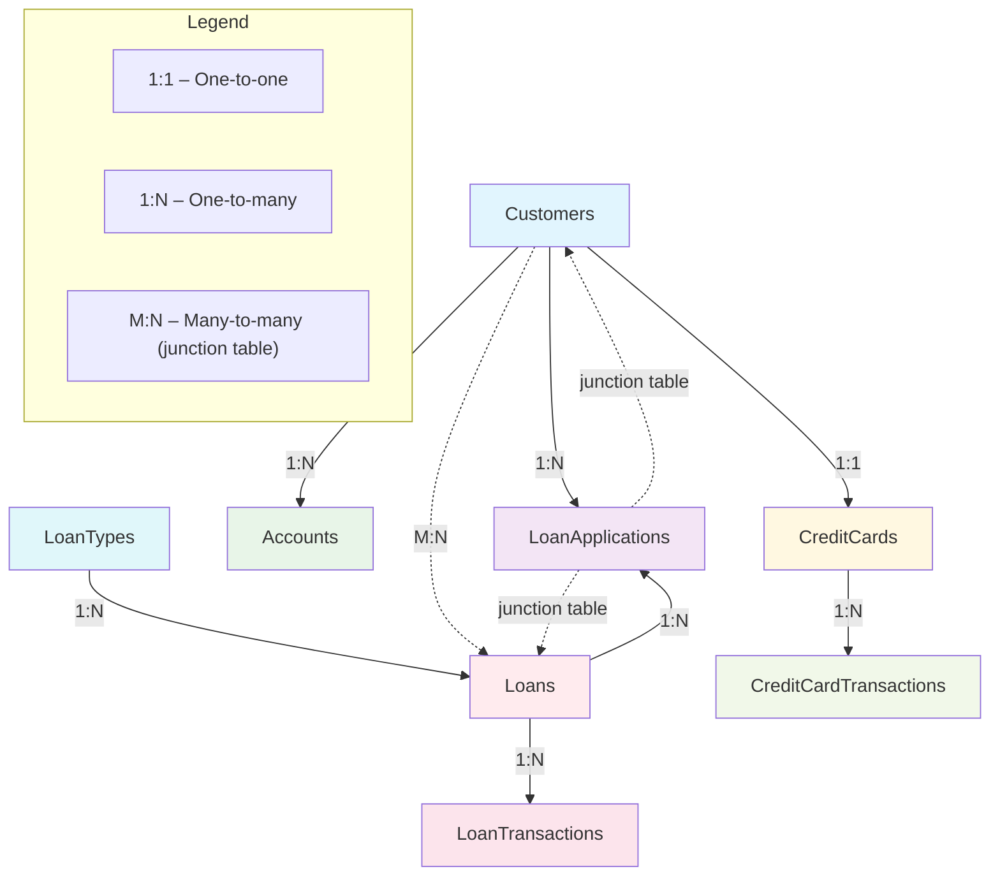
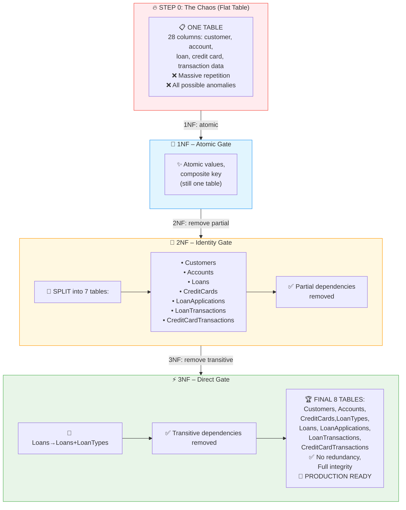
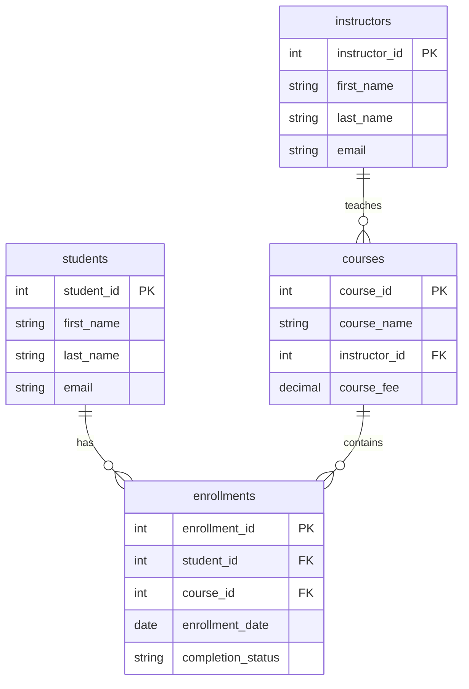
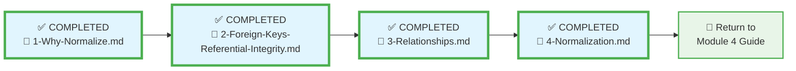

# 🗄️🤖 SQL & GenAI Course
**🎯 Quality Education for Anyone, Anywhere, Anytime — 💫 with Comfort, Convenience at no Cost**

## 🏛️ SQLVerse Architect’s Blueprint – File 4: Normalization in Practice

Welcome to the final file of the **SQLVerse Architect’s Blueprint**. You’ve learned why flat tables are dangerous (File 1), how to connect tables with foreign keys (File 2), and the three relationship patterns (File 3). Now you’ll put it all together by applying **normalization** – the process of refining your tables to eliminate redundancy while preserving relationships. This is the bridge between theory and practice.

We’ll explore normalization through two lenses:

1. **Banking Domain** – We’ll start with an unnormalized table and step through 1NF, 2NF, and 3NF to build a clean, scalable schema from scratch.
2. **Training Institution** – We’ll reverse‑engineer the already‑normalized database you’ve been querying all along, so you can see the final product in action.

By the end, you’ll understand why your favorite databases are structured the way they are – and you’ll be ready to apply these principles to the E‑Store in the **Refactoring Lab**.

---

## 🌌 SQLVerse Check-In

**You are now moving from theory to practice.** Normalization is the Artisan’s tool for turning a messy spreadsheet into a clean, professional database. It’s the difference between a prototype and a production system.

Now, we define the **Rulebook**. We are going to codify your design instincts into the three formal "Gates" of normalization. These rules aren't just theory—they are the industry standards that ensure your database is scalable, performant, and error‑free. **You are moving from "building by intuition" to "building by design."** Normalization is a step‑by‑step process of cleaning your data until it is "Atomic." Think of this as the final polishing of a gemstone.

In this file, you’ll learn the three normal forms (1NF, 2NF, 3NF) and see them applied in two different domains. Then you’ll be ready to tear apart the E‑Store and rebuild it in the **Refactoring Lab**.

**The difference between a coder and an Artisan is discipline.**

---

## 📍 Your Current Stage – PREPARE Journey

You’ve completed the first three blueprint files. Now you’ll learn the step‑by‑step process that makes a database “normalized.”

---

## 📐 What Is Normalization?

**Normalization** is the process of organizing data in a database to reduce redundancy, eliminate anomalies and improve data integrity. It involves splitting tables into smaller, related tables and defining relationships between them.

In File 1, we saw the problems of a flat table:
- Redundancy (repeating data)
- Update anomalies (changing the same fact in many places)
- Insertion anomalies (can’t add a fact without creating a dummy row)
- Deletion anomalies (losing facts when a row is deleted)

Normalization solves these by applying a set of rules called **normal forms**. The three most common are:

- **First Normal Form (1NF)**
- **Second Normal Form (2NF)**
- **Third Normal Form (3NF)**

Let’s define them formally.

---

## 🚪 The Three Gates of Normalization

To reach professional‑grade database design, your schema must pass through these three gates.

### 1️⃣ First Normal Form (1NF): The Atomic Gate

- **The Rule:** Each cell must contain exactly one value. No lists, no comma‑separated values, and every row must be unique.
- **Violation:** A `tags` column containing `"electronics, sale, popular"`.
- **The Fix:** Split those values into a separate, related table.

### 2️⃣ Second Normal Form (2NF): The Identity Gate

- **The Rule:** The table must be in 1NF, and every non‑key column must depend on the **whole** primary key.
- **Violation:** In a `student_enrollments` table with a composite key of `(student_id, course_id)`, storing `instructor_name`. The instructor depends only on the `course_id`, not the student.
- **The Fix:** Move `instructor_name` to a `courses` table.

### 3️⃣ Third Normal Form (3NF): The Direct Gate

- **The Rule:** The table must be in 2NF, and no column should depend on another column that isn't the primary key (no “transitive” dependencies).
- **Violation:** Storing `zip_code` and `city` in the same table. `city` depends on `zip_code`, not directly on the `user_id`.
- **The Fix:** Move `city` to a `locations` table.

---

## 💡 The Artisan's Mantra: "The Key, the Whole Key, and Nothing But the Key"

This is the mnemonic every data architect keeps in their pocket. It summarizes the goal of 2NF and 3NF:

- **The Key:** Every table needs a unique identifier.
- **The Whole Key:** Every piece of data must relate to that identifier.
- **Nothing But the Key:** Don't store data that relates to something else.

With these three gates and this mantra, you’re ready to apply normalization to a real‑world domain.

---

## 🏦 Banking Domain – Building from Scratch

Let’s design a database for a bank. A bank has customers, each with one or more accounts (Savings, Current, etc.), possibly one credit card, and possibly one or more loans. The bank tracks EMI payments for loans. A loan is linked to a specific account for auto‑debit. A loan may have multiple customers (e.g., a joint loan), and a customer may take multiple loans – a **many‑to‑many** relationship.

Before we write any SQL, we must understand the key components: **entities**, **attributes**, and **relationships**.

---

### 🧩 Core Banking Entities & Attributes

- **Customer** – Individuals or entities holding accounts.  
  *Attributes:* `Name`, `Address`, `Phone`

- **Account** – Financial containers within the bank.  
  *Attributes:* `Account_Type` (Savings/Current), `Balance`, `Opening_Date`, `Overdraft_Limit` (only for Current accounts)

- **Loan** – Funds provided to customers for a specific purpose.  
  *Attributes:* `Loan_Type`, `Amount`, `Interest_Rate`, `EMI_Amount`

- **Credit Card** – Financial tool that allows customers to borrow funds up to a pre‑approved limit.  
  *Attributes:* `Card_Limit`, `Outstanding_Payment`, `Credit_Rating`

- **Loan Application** – A record linking a customer to a loan they are part of.  
  *Attributes:* `Application_Date`, `Role` (Primary/Co‑applicant), `Status`

- **Credit Card Transaction** – Movement of funds on a credit card.  
  *Attributes:* `Transaction_Date`, `Amount`, `Type` (Purchase/Cash Advance)

- **Loan Transaction** – EMI payments on a loan.  
  *Attributes:* `Payment_Date`, `Amount`

---

### 🧪 From Entities to a Flat Table

We’ll start with a single table that tries to hold all this information – and then normalize it step by step, passing through the three gates.

#### Step 0: The Unnormalized Table

Suppose we create a spreadsheet that tries to capture customers, their accounts, loans, credit cards, and transactions all in one place. A few rows might look like this (notice the joint loan L201 is associated with two customers):

| customer_id | customer_name | customer_address | customer_phone | account_id | account_type | balance | opening_date | overdraft_limit | loan_id | loan_type | loan_amount | interest_rate | emi_amount | application_date | loan_role | card_id | card_limit | outstanding | credit_rating | card_trans_id | card_trans_date | card_trans_amount | card_trans_type | loan_trans_id | loan_trans_date | loan_trans_amount | auto_debit_account |
|-------------|---------------|------------------|----------------|------------|--------------|---------|--------------|-----------------|---------|-----------|-------------|---------------|------------|------------------|-----------|---------|-----------|-------------|---------------|---------------|-----------------|-------------------|------------------|---------------|-----------------|-------------------|--------------------|
| 101         | Alice Smith   | 123 Main St     | 555-0101       | A101       | Savings      | 5000    | 2023-01-01   | NULL            | L201    | Home      | 200000      | 7.5           | 1500       | 2023-12-01       | Primary   | C101    | 10000     | 2000        | 720           | T1001         | 2024-02-01       | 150               | Purchase         | P1001         | 2024-02-01       | 1500              | A101               |
| 101         | Alice Smith   | 123 Main St     | 555-0101       | A102       | Current      | 12000   | 2023-02-01   | 5000            | L201    | Home      | 200000      | 7.5           | 1500       | 2023-12-01       | Primary   | C101    | 10000     | 2000        | 720           | T1002         | 2024-03-01       | 80                | Purchase         | P1002         | 2024-03-01       | 1500              | A101               |
| 101         | Alice Smith   | 123 Main St     | 555-0101       | A101       | Savings      | 5000    | 2023-01-01   | NULL            | L202    | Auto      | 30000       | 8.0           | 600        | 2024-01-15       | Primary   | C101    | 10000     | 2000        | 720           | T1003         | 2024-03-01       | 200               | Purchase         | P1003         | 2024-03-01       | 600               | A102               |
| 102         | Bob Johnson   | 456 Oak Ave     | 555-0102       | A103       | Savings      | 12000   | 2023-01-15   | NULL            | L201    | Home      | 200000      | 7.5           | 1500       | 2023-12-01       | Co‑applicant| C102    | 5000      | 1000        | 680           | T1004         | 2024-02-15       | 50                | Purchase         | P1004         | 2024-02-15       | 1500              | A103               |
| 102         | Bob Johnson   | 456 Oak Ave     | 555-0102       | A103       | Savings      | 12000   | 2023-01-15   | NULL            | L203    | Personal  | 10000       | 10.0          | 300        | 2024-01-20       | Primary   | C102    | 5000      | 1000        | 680           | T1005         | 2024-03-10       | 100               | Purchase         | P1005         | 2024-03-10       | 300               | A103               |

This table has many problems:
- **1NF violation**: The `auto_debit_account` column is fine, but the table itself is massively redundant – each row repeats customer, loan, and card details for every transaction.
- **Redundancy**: Customer name, address, phone repeat for each account and each transaction.
- **Update anomaly**: If Alice’s phone number changes, it must be updated in every row.
- **Insertion anomaly**: Can’t add a new account for a customer without also adding a loan or transaction.
- **Deletion anomaly**: Deleting the last transaction for a loan loses the loan information.

Let’s normalize it step by step.

---

### 1️⃣ First Normal Form (1NF): Atomic Gate

**The Rule:** Each cell must contain exactly one value. No lists, no comma‑separated values.

Our table already has atomic values (no lists), so it passes 1NF. However, we must identify a primary key. A natural choice is a composite key: `(customer_id, account_id, loan_id, card_id, loan_application_id, card_trans_id, loan_trans_id)`. But this is unwieldy; we’ll use it for the analysis.

---

### 2️⃣ Second Normal Form (2NF): Identity Gate

**The Rule:** The table must be in 1NF, and every non‑key column must depend on the **whole** primary key.

With the composite key above, we look for partial dependencies:
- `customer_name`, `customer_address`, `customer_phone` depend only on `customer_id`.
- `account_type`, `balance`, `opening_date`, `overdraft_limit` depend only on `account_id`.
- `loan_type`, `loan_amount`, `interest_rate`, `emi_amount` depend only on `loan_id`.
- `application_date`, `loan_role` depend only on the combination `(customer_id, loan_id)` – this is the **many‑to‑many** junction.
- `card_limit`, `outstanding`, `credit_rating` depend only on `card_id`.
- `card_trans_date`, `card_trans_amount`, `card_trans_type` depend only on `card_trans_id`.
- `loan_trans_date`, `loan_trans_amount` depend only on `loan_trans_id`.
- `auto_debit_account` depends on `loan_id`.

To fix, we split into separate tables, each with its own primary key, and keep only columns that depend on that key.

**Result after 2NF:**

- **Customers** (`customer_id`, `name`, `address`, `phone`)
- **Accounts** (`account_id`, `customer_id`, `account_type`, `balance`, `opening_date`, `overdraft_limit`)
- **Loans** (`loan_id`, `loan_type`, `amount`, `interest_rate`, `emi_amount`, `auto_debit_account`)
- **LoanApplications** (`customer_id`, `loan_id`, `application_date`, `loan_role`) – junction table
- **CreditCards** (`card_id`, `customer_id`, `card_limit`, `outstanding`, `credit_rating`)
- **CreditCardTransactions** (`card_trans_id`, `card_id`, `transaction_date`, `amount`, `transaction_type`)
- **LoanTransactions** (`loan_trans_id`, `loan_id`, `transaction_date`, `amount`)

Now each non‑key column depends on the whole primary key of its table.

---

### 3️⃣ Third Normal Form (3NF): Direct Gate

**The Rule:** The table must be in 2NF, and no non‑key column should depend on another non‑key column.

Look at the `Loans` table. `interest_rate` depends on `loan_type` (e.g., “Home” loans have 7.5%, “Auto” have 8.0%, “Personal” have 10.0%). This is a transitive dependency: `interest_rate` → `loan_type`, and `loan_type` is not the primary key. To pass 3NF, we extract loan types into a separate table.

**Result after 3NF:**

- **LoanTypes** (`loan_type_id`, `loan_type_name`, `interest_rate`)
- **Loans** (`loan_id`, `loan_type_id`, `amount`, `emi_amount`, `auto_debit_account`)

Similarly, `overdraft_limit` might depend on `account_type` (only Current accounts have it), so we could split `Accounts` further, but for simplicity we’ll keep it as a column that can be NULL for Savings accounts.

The final normalized schema looks like this:

Now the many‑to‑many relationship between customers and loans is explicitly modeled with the `LoanApplications` junction table.

---

### 📋 Relationship Summary

- **One‑to‑One:**  
  - One `Customer` → one `CreditCard` (enforced by `UNIQUE` on `customer_id` in `CreditCards`)

- **One‑to‑Many:**  
  - One `Customer` → many `Accounts`  
  - One `Customer` → many `CreditCardTransactions` (through `CreditCards`)  
  - One `Loan` → many `LoanTransactions`  
  - One `LoanType` → many `Loans`  
  - One `Customer` → many `LoanApplications`  
  - One `Loan` → many `LoanApplications`

- **Many‑to‑Many:**  
  - `Customers` ↔ `Loans` (via `LoanApplications`)

---

Let’s look at the evolution of our Bank database. By applying these three gates, we have moved from a fragile "Flat" table to a robust, professional ecosystem.

| Level | State of the Bank Database |
| :--- | :--- |
| **Flat** | One table, massive repetition, high risk of corruption. |
| **1NF** | Atomic data, unique rows, lists separated. |
| **2NF** | Data split to remove partial dependencies. |
| **3NF** | Data refined to remove transitive dependencies (the "Professional Fortress"). |

> 💎 **Artisan’s Insight:** *“Normalization is not about making your database as complex as possible. It is about making it as simple as possible, but no simpler.”*

This design eliminates redundancy and anomalies. It also reflects a real‑world business rule: **if a customer has multiple loans, their credit card spending limit might be adjusted** – but that rule would be enforced by application logic, not by the database structure. The clean schema makes it easy to implement such rules.

---

## 🏫 Training Institution – Reverse‑Engineering a Normalized Database

Now let’s look at a database you already know: the **Training Institution**. You’ve been querying it since Module 2. But have you ever wondered *why* it’s designed with separate `students`, `courses`, `enrollments`, and `instructors` tables?

Imagine a **hypothetical flat version** of the Training Institution data:

| enrollment_id | student_name | course_name | instructor_name | enrollment_date |
|---------------|--------------|-------------|-----------------|-----------------|
| 1             | Sarah Chen   | Frontend Dev | Emily Watson    | 2024-01-15     |
| 2             | Sarah Chen   | Backend Node | James Wilson    | 2024-03-01     |
| 3             | Mike Rodriguez| Data Analysis| Maria Garcia    | 2024-01-20     |

Problems:
- **Redundancy**: Instructor names repeat for every course.
- **Update anomaly**: If Emily Watson changes her name, we must update every course she teaches.
- **Insertion anomaly**: Can’t add a new course without a student enrollment.
- **Deletion anomaly**: If we delete the last enrollment for a course, we lose the course and instructor info.

Now look at the actual normalized schema:

### 📋 Relationship Summary

- **One‑to‑One:**  
  - None explicitly modeled in this schema (though a `student_details` table would create one).

- **One‑to‑Many:**  
  - One `Instructor` → many `Courses`  
  - One `Student` → many `Enrollments`  
  - One `Course` → many `Enrollments`  
  - One `Student` → many `Payments`  

- **Many‑to‑Many:**  
  - `Students` ↔ `Courses` (via the `Enrollments` junction table)

All these relationships are enforced by foreign keys, ensuring referential integrity. The `Enrollments` table is the classic junction table that resolves the many‑to‑many relationship between students and courses, and it also holds additional data (`enrollment_date`, `completion_status`, scores) that belong to the relationship itself.

This design satisfies **1NF** (atomic data), **2NF** (no partial dependencies – all non‑key columns depend on the whole primary key), and **3NF** (no transitive dependencies – e.g., `instructor_name` is stored only in the `instructors` table, not in `courses`). It’s the same pattern we applied to the banking domain, now realized in a database you’ve been using all along.

> 💡 **Artisan’s Insight:** *“You’ve been querying a perfectly normalized database without even knowing it. Now you understand why it was built that way – and why it’s so robust.”*

---

## 🔄 What’s Next: The Refactoring Lab

Now it’s your turn. In the **Refactoring Lab**, you’ll take the flat `products` table from the E‑Store (the one you used in Module 3) and normalize it using the exact steps you’ve just learned. You’ll create a `categories` table, migrate the data, and add the foreign key constraint. The result will be a clean, normalized E‑Store that you’ll use to practice **joins** in Module 4.

After the lab, you’ll have transformed three different domains (banking, education, e‑commerce) into professional schemas – proof that normalization is a universal skill.

---

## ✅ Progress Check

After reading this, can you:

- [ ] Define normalization and explain why it’s important?
- [ ] Describe the three normal forms (1NF, 2NF, 3NF) in simple terms?
- [ ] Identify a partial dependency in the unnormalized banking table and explain how 2NF fixed it?
- [ ] Identify a transitive dependency in the 2NF banking schema and explain how 3NF fixed it?
- [ ] Recognize that the Training Institution database is already normalized and explain why?
- [ ] Understand the trade‑offs between normalization and performance?

**If yes → You’re ready for the Refactoring Lab!**

---

## 💎 DESIGNER'S PERIGON

### *The Architect's Legacy*

You have now reached the end of the conceptual blueprint. You know the *why*, the *link*, the *shape*, and the *rules*.

When you start your **Refactoring Lab**, you won't be guessing. You will look at a flat file and see the anomalies. You will look at a business problem and see the relationships. You will build tables that are atomic, direct, and protected by referential integrity.

> *“A well‑normalized database is invisible. When it’s built correctly, users never see the corruption, the errors, or the maintenance headaches—they only see a system that works, every single time.”*

**Your journey from a user of data to an architect of data is complete.**

---

### *The Art of Cleaning*

A messy room is easy to live in – until you need to find something. A messy database is the same. Normalization is the Artisan’s way of putting every fact in its place.

You’ve learned the why, the how, and the patterns. You’ve seen normalization applied to banking and education. Now you’re ready to do it yourself. In the **Refactoring Lab**, you’ll tear apart the E‑Store’s flat `products` table and rearrange it into a professional, scalable schema.

> *“A database without normalization is a pile of bricks. A normalized database is a cathedral.”*

In the next step, you’ll open your Factory, write the SQL, and build that cathedral. Then you’ll use it to learn **joins** – the tool that brings all the pieces back together.

**The SQLVerse expands. Go build something beautiful.**

---

## 🧭 File Navigation

| Previous Step | Next Step |
|:---:|:---:|
| [← Back to File 3: Relationships](./3-Relationships.md) | [Return to Module 4 Guide →](../MODULE4_GUIDE.md) |

---

*Part of our mission for 🎯 Quality Education for Anyone, Anywhere, Anytime — 💫 with Comfort, Convenience at no Cost.*

**Level 1 | Module 4 | SQLVerse Architect’s Blueprint | Next: [Module 4 Guide](../MODULE4_GUIDE.md)**