# 🗄️🤖 SQL & GenAI Course
**🎯 Quality Education for Anyone, Anywhere, Anytime — 💫 with Comfort, Convenience at no Cost**

---

## 🧪 Exercise 0: Normalization Practice – From Flat to Fab

You've learned why flat tables are dangerous – redundancy, update anomalies, insertion anomalies, deletion anomalies. You've watched the **Refactoring Lab** transform the E‑Store from a flat `products` table into a normalized schema with `categories` and `products`.

Now it's time to apply those same normalization skills to a **new, unfamiliar dataset** – a messy **Library Management spreadsheet** from a fictional public library. Your mission: diagnose the anomalies, normalize to 3NF, and write the `CREATE TABLE` statements.

**This is an independent exercise. No schema is provided. No INSERT statements are provided. You must design and build everything yourself.**

---

## 🌌 SQLVerse Check-In

<div style="border-left: 4px solid #9c27b0; background-color: #f3e5f5; padding: 15px; margin: 20px 0; border-radius: 0 8px 8px 0;">

**You are now on Library Planet.** The laws of normalization are universal. Whether you're cleaning up a library spreadsheet or designing an enterprise database, the process is the same – identify redundancy, split tables, define relationships.

### 🔍 SQLVerse Artisan's Objective

In this exercise, you will move beyond watching normalization happen. You will **do it yourself**. You will diagnose the "rot" in a flat table, apply the three normal forms, and produce a clean, queryable schema.

**The difference between a coder and an Artisan is discipline.**

</div>

---

### 📍 Your Current Stage – PRACTICE Journey

```mermaid
flowchart LR
    A["✅ PREPARE Complete<br/>📘 Files 1-6"] --> B
    B["📍 YOU ARE HERE<br/>🧪 Exercise 0<br/>Normalization Practice"] --> C
    C["⏳ Exercise 1<br/>INNER JOIN Practice"] --> D
    D["⏳ Exercise 2<br/>LEFT JOIN Practice"] --> E
    E["⏳ Exercise 3<br/>Multiple Tables"] --> F
    F["⏳ Exercise 4<br/>SELF JOIN Practice"] --> G
    G["⏳ Exercise 5<br/>Mixed JOIN Practice"] --> H
    H["⏳ Capstone Reports<br/>CEO / CTO / CFO"] --> I
    I["✅ PRACTICE COMPLETE<br/>Ready for Quiz"]
    
    style A fill:#e1f5fe,stroke:#4caf50,stroke-width:2px
    style B fill:#fff8e1,stroke:#ff9800,stroke-width:4px
    style C fill:#fff8e1,stroke:#ff9800,stroke-width:2px
    style D fill:#fff8e1,stroke:#ff9800,stroke-width:2px
    style E fill:#fff8e1,stroke:#ff9800,stroke-width:2px
    style F fill:#fff8e1,stroke:#ff9800,stroke-width:2px
    style G fill:#fff8e1,stroke:#ff9800,stroke-width:2px
    style H fill:#fff8e1,stroke:#ff9800,stroke-width:2px
    style I fill:#a5d6a7,stroke:#2e7d32,stroke-width:2px
```



You've watched the Refactoring Lab. Now it's time to normalize a new dataset on your own.

---

## 🔧 Browser Office for PRACTICE

**🚀 Kickstart: Any Computer, Any Browser, Anytime.**  
**🌍 Destination: Any country, Any city, Any Platform.**

| Tab | Purpose | What to Do |
| :--- | :--- | :--- |
| **1: The Map** | Reference materials | • Keep your **[Module 4 Reference Guide](./module4-reference.md)** handy.<br>• Complete the challenges below. |
| **2: The Factory** | Design & Test | Use **SQLite Online** to create tables and test queries. No database file needed – you'll create from scratch. |
| **3: The Consultant** | Conceptual Q&A | If stuck, follow the **3‑Attempt Rule**. Ask for conceptual hints, not code. Configure with **[Student Mode Prompt](../../../STUDENT_MODE_PROMPT_LEVEL1.md)**. |
| **4: The Vault** | Save your work | Save your analysis and SQL in: `Learning/Level-1-beginner/Level1-1-ACQUIRE/Module4-JoiningTables/2-practiceExercises/` |

---

### 🛠️ Module 4 Toolkit

🚀 Foundation First, AI Next, Projects Last.  
💎 Gemstone by Gemstone, Skill by Skill.

| | | | |
|---|---|---|---|
| **Browser Office** | 🔧 [Troubleshooting Common Issues](../../../Setup/STEP1_COMMISSION_BROWSER_OFFICE.md) | 🔄 [Browser Office Workflow](../../../Setup/STEP2_ESTABLISH_LEARNING_RITUAL.md) | ⌨️ [Tab Operations & Shortcuts](../../../Setup/STEP3_MASTER_TAB_OPERATIONS.md) |
| **ACQUIRE Section** | 🗄️ [Database Ecosystem](../../Guides/Section1-ACQUIRE/2_Database_Ecosystem.md) | 📚 [Knowledge Base (Vault)](../../Guides/Section1-ACQUIRE/3_Knowledge_Base.md) | 🧠 [Mindset Tuning](../../Guides/Section1-ACQUIRE/4_Mindset.md) |

---

## 🏛️ Your Data Playground – The Messy Library Spreadsheet

Below is a flat, unnormalized table containing book loans from a public library. It has **redundancy, update anomalies, insertion anomalies, and deletion anomalies**. Your job is to normalize it.

### `flat_library_loans` (Raw Data)

| loan_id | loan_date | member_name | member_email | member_phone | book_title | book_author | book_genre | return_date | fine_amount |
|---------|-----------|-------------|--------------|--------------|------------|-------------|------------|-------------|-------------|
| 1001 | 2025-01-10 | Sarah Chen | sarah.c@email.com | 555-1001 | The Hobbit | J.R.R. Tolkien | Fantasy | 2025-01-24 | 0.00 |
| 1001 | 2025-01-10 | Sarah Chen | sarah.c@email.com | 555-1001 | The Fellowship of the Ring | J.R.R. Tolkien | Fantasy | 2025-02-07 | 5.00 |
| 1002 | 2025-01-12 | Mike Rodriguez | mike.r@email.com | 555-1002 | Dune | Frank Herbert | Sci-Fi | 2025-01-26 | 0.00 |
| 1003 | 2025-01-15 | Sarah Chen | sarah.c@email.com | 555-1001 | The Two Towers | J.R.R. Tolkien | Fantasy | 2025-01-29 | 0.00 |
| 1004 | 2025-01-20 | Lisa Johnson | lisa.j@email.com | 555-1003 | Becoming | Michelle Obama | Biography | 2025-02-03 | 0.00 |
| 1004 | 2025-01-20 | Lisa Johnson | lisa.j@email.com | 555-1003 | The Silent Patient | Alex Michaelides | Thriller | 2025-02-17 | 3.00 |
| 1005 | 2025-02-01 | David Thompson | david.t@email.com | 555-1004 | Dune | Frank Herbert | Sci-Fi | 2025-02-15 | 0.00 |
| 1006 | 2025-02-05 | Sarah Chen | sarah.c@email.com | 555-1001 | The Hobbit | J.R.R. Tolkien | Fantasy | 2025-02-19 | 0.00 |

> 💡 **Observation:** Loan #1001 has two rows because Sarah borrowed two books at the same time. Member information repeats. Book information repeats. This is the "rot" you will fix.

---

## 📋 Phase 1: Identify Anomalies (The Structural Audit)

Before you write a single `CREATE TABLE` command, diagnose the problems in the flat table.

### Redundancy (The Echo Effect)

**Question:** Look at `member_name`, `member_email`, and `member_phone`. How many times does "Sarah Chen" appear? What problem does this create if she changes her phone number?

*Write your reasoning:* `________________________________________________`

---

### Update Anomaly (The Ripple Effect)

**Scenario:** Sarah Chen changes her email from `sarah.c@email.com` to `sarah.chen@newmail.com`.

**Question:** How many rows would you need to update? What happens if you miss one?

*Write your reasoning:* `________________________________________________`

---

### Insertion Anomaly (The "Wait-for-it" Problem)

**Scenario:** You want to add a new member, "Priya Patel," who hasn't borrowed any books yet.

**Question:** Can you add her to this table without creating a row with NULL `loan_id` and `book_title`? Why is that a problem?

*Write your reasoning:* `________________________________________________`

---

### Deletion Anomaly (The Burned Bridge)

**Scenario:** You need to delete loan #1005 (David Thompson's loan of Dune).

**Question:** If you delete that row, do you lose any information about David Thompson? What if that was his only loan?

*Write your reasoning:* `________________________________________________`

---

## 📐 Phase 2: Normalize to 1NF

**1NF Rule:** No repeating groups. Each cell contains a single atomic value.

**Question:** Does the flat table already satisfy 1NF? Look at each row – are there any columns with multiple values in one cell? Explain.

*Write your reasoning:* `________________________________________________`

**Your 1NF result:** Write your conclusion here.

---

## 📐 Phase 3: Normalize to 2NF

**2NF Rule:** In 1NF + no partial dependencies. If a table has a composite key, every non‑key column must depend on the **entire** key, not just part of it.

> 💡 **Hint:** Look at Loan #1001. A single `loan_id` isn't enough to identify a unique row because Sarah borrowed two different books. What *combination* of columns makes each row unique?

**Question:** What is the composite primary key of this table? (Hint: Which columns together uniquely identify a row?)

*Write your answer:* `________________________________________________`

**Question:** Does `member_name` depend on the whole composite key, or just part of it? Explain.

*Write your reasoning:* `________________________________________________`

**Question:** Does `book_author` depend on the whole composite key, or just part of it? Explain.

*Write your reasoning:* `________________________________________________`

**Your 2NF result:** Based on your answers, split the table into separate tables. List each table and its columns.

| Table Name | Columns |
|------------|---------|
| 1. | |
| 2. | |
| 3. | |
| 4. | |

---

## 📐 Phase 4: Normalize to 3NF

**3NF Rule:** In 2NF + no transitive dependencies. A non‑key column should not depend on another non‑key column.

**Question:** In your `Books` table, does `book_genre` depend on `book_title`? Does it depend on `book_author`? Is there a transitive dependency? Explain.

*Write your reasoning:* `________________________________________________`

**Question:** In your `Members` table, does any column depend on another non‑key column? Explain.

*Write your reasoning:* `________________________________________________`

**Your 3NF result:** Write your final normalized table structure below. List each table, its columns, primary key, and foreign keys.

| Table | Columns | Primary Key | Foreign Key(s) |
|-------|---------|-------------|----------------|
| 1. | | | |
| 2. | | | |
| 3. | | | |
| 4. | | | |

---

## 🔧 Phase 5: Write CREATE TABLE Statements

Based on your 3NF result, write SQL `CREATE TABLE` statements. Include all primary keys and foreign keys. Choose appropriate data types (`INTEGER`, `TEXT`, `REAL`, `DATE`).

```sql
-- Write your CREATE TABLE statements here
-- Save as: 0-normalization-schema.sql


```

---

## 🧪 Phase 6: Write INSERT Statements

Write `INSERT` statements to populate your normalized tables with the data from the flat spreadsheet. Extract unique records for each table.

```sql
-- Write your INSERT statements here
-- Save as: 0-normalization-insert.sql


```

---

## 🔍 Phase 7: Write Verification Queries

Write SQL queries to verify your normalization worked correctly.

**Query 1:** Reconstruct the original flat view – show each loan with member name, book title, return date, and fine amount.

```sql
-- Write your query here


```

**Query 2:** Find members with total fines greater than zero.

```sql
-- Write your query here


```

**Query 3:** Find members who have never borrowed a book (to prove insertion anomaly is solved). After running this, manually add a new member with no loans and run again.

```sql
-- Write your query here


```

---

## 💡 Artisan's Pro‑Tips for Normalization

1. **Start with the questions you'll ask.** Your schema should make common queries easy.
2. **Every table should represent one thing.** Members, books, loans – each gets its own table.
3. **Foreign keys are bridges.** They connect tables without repeating data.
4. **Test with `LEFT JOIN` to find orphans.** That's how you verify referential integrity.

---

## 🎯 Your Progress Tracker

| Step | Status (✅/⏳) |
|------|---------------|
| Phase 1: Identify Anomalies | |
| Phase 2: 1NF Check | |
| Phase 3: 2NF Split | |
| Phase 4: 3NF Check | |
| Phase 5: CREATE TABLE Statements | |
| Phase 6: INSERT Statements | |
| Phase 7: Verification Queries | |

---
## 💎 DESIGNER'S PERIGON

### *The Art of Deconstruction*

You've taken a messy, redundant spreadsheet and transformed it into a clean, normalized database. You identified anomalies, split tables, defined relationships, and wrote the SQL to bring it all to life.

In the **SQLVerse**, normalization is the foundation of every robust database. Without it, data rots. With it, data sings.

> *“Normalization is not about breaking things apart. It's about giving each piece of data its proper home.”*

### 🌍 Real‑World Application

The normalization process you just completed is exactly what happens when a library (or any organization) moves from Excel spreadsheets to a real database.

#### The Spreadsheet Nightmare

A public library tracks loans in a single Excel file. A member, Sarah Chen, changes her phone number. In the flat spreadsheet, her phone number appears in 6 different rows (one for each book she ever borrowed). The librarian must update all 6 rows manually. If one row is missed, the library has inconsistent data – some records show the old number, some show the new number. Reports become unreliable. Calls go to the wrong number.

#### The Cost of Bad Data

| Problem | Business Impact |
|---------|-----------------|
| **Update Anomaly** | Wasted staff hours hunting down every occurrence of a changed phone number. |
| **Insertion Anomaly** | Cannot add a new member who hasn't borrowed a book yet – forcing fake loans just to create a record. |
| **Deletion Anomaly** | Deleting a loan accidentally deletes the member's entire history. Goodbye, audit trail. |
| **Redundancy** | The same book information stored 50 times. One typo in "J.R.R. Tolkien" spreads everywhere. |

#### Your Normalized Solution

Your `members`, `books`, `loans`, and `loan_details` tables solve every anomaly:

- **Update once** – Change Sarah's phone number in exactly one row of the `members` table.
- **Insert new members** – Add Priya Patel with no loans. No fake data required.
- **Delete a loan** – Remove loan #1005 without losing David Thompson's member profile.
- **Store once** – "J.R.R. Tolkien" appears exactly once in the `books` table.

> *“You didn't just write SQL. You designed a system that prevents data rot before it starts. This is what database administrators do every day.”*

#### The Bottom Line

Companies pay for normalization. Every time you prevent an update anomaly, you save hours of manual correction. Every time you eliminate redundancy, you reduce storage costs and improve query speed. You just built a skill that has **direct dollar value** to employers.

**The SQLVerse expands. Go build with integrity.**

---

## ✅ When You're Done

- [ ] I identified all four anomalies in the flat table.
- [ ] I normalized the data to 3NF on my own.
- [ ] I wrote `CREATE TABLE` statements that run without errors.
- [ ] I wrote `INSERT` statements that populate all tables correctly.
- [ ] I wrote verification queries that return expected results.
- [ ] I saved all files in my Vault.
- [ ] I feel ready for Exercise 1: INNER JOIN Practice.

---

## 🧭 Practice Navigation


---

And the **navigation links** at the bottom:

| Previous Step | Next Step |
|:---:|:---:|
| [← Back to File 6: Join Conditions](../1-sqlCommands/6-JoinConditions.md) | [Continue to Exercise 1: INNER JOIN Practice →](./1-inner-join-practice.md) |


---

*Part of our mission for 🎯 Quality Education for Anyone, Anywhere, Anytime — 💫 with Comfort, Convenience at no Cost.*

**Level 1 | Module 4 | Practice Exercise 0 | Next: [INNER JOIN Practice](./1-inner-join-practice.md)**