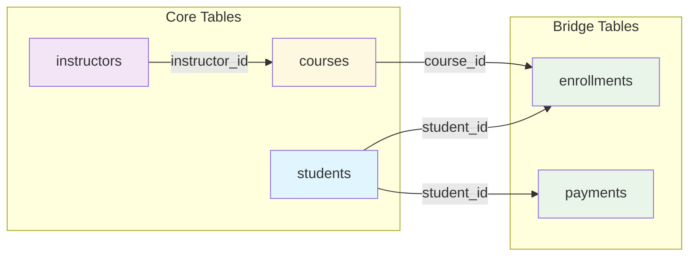

# 🗄️🤖 SQL & GenAI Course
**🎯 Quality Education for Anyone, Anywhere, Anytime — 💫 with Comfort, Convenience at no Cost**

## 🧠 Exercise 1: INNER JOIN Practice – The Perfect Match

You've learned how `INNER JOIN` works – matching rows from two tables where the foreign key equals the primary key. Now it's time to practice these skills on the **Training Institution database** – the same one you'll use for the rest of the Module 4 practice exercises. You'll connect students to their enrollments, courses to their instructors, and payments to the students who made them.

---

## 🌌 SQLVerse Check-In

<div style="border-left: 4px solid #9c27b0; background-color: #f3e5f5; padding: 15px; margin: 20px 0; border-radius: 0 8px 8px 0;">

**You are now on Education Planet.** The laws of joins are universal. Whether you're matching students to enrollments or customers to orders, the logic is the same – only the data changes.

### 🔍 SQLVerse Artisan's Objective

In this exercise, you will move beyond single-table queries. You will learn to **bridge** tables using foreign keys, retrieve related data from multiple sources, and answer questions that span the entire database.

**The difference between a coder and an Artisan is discipline.**

</div>

---

### 📍 Your Current Stage – PRACTICE Journey


You've completed the normalization practice. Now it's time to build bridges between tables using `INNER JOIN`.

---

## 🔧 Browser Office for PRACTICE

**🚀 Kickstart: Any Computer, Any Browser, Anytime.**  
**🌍 Destination: Any country, Any city, Any Platform.**

| Tab | Purpose | What to Do |
| :--- | :--- | :--- |
| **1: The Map** | Reference materials | • Keep your **[Module 4 Reference Guide](./module4-reference.md)** handy.<br>• Complete the challenges below. |
| **2: The Factory** | Run queries | Switch to the **Training Institution database**: [`training_institution_sample.db`](../../../Resources/sample_databases/training_institution_sample.db). Run every query. |
| **3: The Consultant** | Conceptual Q&A | If stuck, follow the **3‑Attempt Rule**. Ask for conceptual hints, not code. Configure with **[Student Mode Prompt](../../../STUDENT_MODE_PROMPT_LEVEL1.md)**. |
| **4: The Vault** | Save your work | Save each successful query in your Vault at: `Learning/Level-1-beginner/Level1-1-ACQUIRE/Module4-JoiningTables/2-practiceExercises/` |

---

### 🛠️ Module 4 Toolkit

🚀 Foundation First, AI Next, Projects Last.  
💎 Gemstone by Gemstone, Skill by Skill.

| | | | |
|---|---|---|---|
| **Browser Office** | 🔧 [Troubleshooting Common Issues](../../../Setup/STEP1_COMMISSION_BROWSER_OFFICE.md) | 🔄 [Browser Office Workflow](../../../Setup/STEP2_ESTABLISH_LEARNING_RITUAL.md) | ⌨️ [Tab Operations & Shortcuts](../../../Setup/STEP3_MASTER_TAB_OPERATIONS.md) |
| **ACQUIRE Section** | 🗄️ [Database Ecosystem](../../Guides/Section1-ACQUIRE/2_Database_Ecosystem.md) | 📚 [Knowledge Base (Vault)](../../Guides/Section1-ACQUIRE/3_Knowledge_Base.md) | 🧠 [Mindset Tuning](../../Guides/Section1-ACQUIRE/4_Mindset.md) |

---

## 🏛️ Your Data Playground – Training Institution Database

You'll work with the `students`, `courses`, `instructors`, `enrollments`, and `payments` tables. Here are reminders of their key columns and relationships.

### Relationship Map



### `students` Table (first 3 rows for context)

| student_id | first_name | last_name | email | enrollment_date |
|------------|------------|-----------|-------|-----------------|
| 101 | Sarah | Chen | sarah.chen@email.com | 2024-01-15 |
| 102 | Mike | Rodriguez | mike.rod@email.com | 2024-01-20 |
| 103 | Jessica | Park | jessica.park@email.com | 2024-02-01 |

### `courses` Table (first 3 rows for context)

| course_id | course_code | course_name | course_track | instructor_id | course_fee |
|-----------|-------------|-------------|--------------|---------------|------------|
| 201 | WD101 | Frontend Development | Web Development | 501 | 1500.00 |
| 202 | WD102 | Backend with Node.js | Web Development | 502 | 1800.00 |
| 203 | DS101 | Python for Data Analysis | Data Science | 503 | 2000.00 |

### `instructors` Table (first 3 rows for context)

| instructor_id | first_name | last_name | email | specialization |
|---------------|------------|-----------|-------|-----------------|
| 501 | Emily | Watson | emily.w@institution.com | Web Development |
| 502 | James | Wilson | james.w@institution.com | Backend & SQL |
| 503 | Maria | Garcia | maria.g@institution.com | Data Science |

### `enrollments` Table (first 3 rows for context)

| enrollment_id | student_id | course_id | enrollment_date | completion_status | final_exam_score |
|---------------|------------|-----------|-----------------|-------------------|------------------|
| 1 | 101 | 201 | 2024-01-15 | Completed | 85.00 |
| 2 | 101 | 202 | 2024-03-01 | Ongoing | NULL |
| 3 | 102 | 203 | 2024-01-20 | Completed | 94.00 |

### `payments` Table (first 3 rows for context)

| payment_id | student_id | amount | payment_date | payment_method |
|------------|------------|--------|--------------|----------------|
| 301 | 101 | 1500.00 | 2024-01-10 | Credit Card |
| 302 | 101 | 1500.00 | 2024-02-28 | Bank Transfer |
| 303 | 102 | 2000.00 | 2024-01-15 | Debit Card |

> 💡 **View the full datasets:** Run `SELECT * FROM students;`, `SELECT * FROM courses;`, `SELECT * FROM instructors;`, `SELECT * FROM enrollments;`, and `SELECT * FROM payments;` in your Factory to see all rows.

---

## 💡 Artisan's Pro‑Tips for INNER JOIN

1. **Always use table aliases** – `students s`, `courses c` – to keep queries readable.
2. **The `ON` clause defines the bridge** – usually `table1.foreign_key = table2.primary_key`.
3. **`INNER JOIN` only returns matching rows** – if a student has no enrollments, they won't appear.
4. **You can join more than two tables** – but start with two, then add more gradually.
5. **Column names don't have to match** – you join on `student_id` in one table and `student_id` in another, but they could be named differently (e.g., `id` and `student_fk`).

---

## 🧪 Challenges

For each challenge, use the **Artisan's Query Rhythm**:
- **The Question** – read the business request.
- **The Query** – write your SQL.
- **Expected Result** – predict what you should see.
- **Try it now** – run it in Tab 2.
- **Reflect & Learn** – compare actual with expectation.

---

### Challenge 1: Students and Their Enrollments
**Question:** Show all students who are enrolled in at least one course. Display the student's full name (concatenate `first_name` and `last_name` as `student_name`), the course ID, and the enrollment date. Order by student name.

```sql
-- Your query here
-- Save as: 4-1-1-students-enrollments.sql
```

**Expected Result:** Only students with enrollments appear (Sarah, Mike, Jessica, David, Lisa, Alex, Maria, James, Priya, Carlos).  
**What this teaches:** Basic `INNER JOIN` between `students` and `enrollments`.

---

### Challenge 2: Courses and Their Instructors
**Question:** Show all courses with their instructor names. Display `course_name`, `course_track`, and the instructor's full name (as `instructor_name`). Order by course name.

```sql
-- Your query here
-- Save as: 4-1-2-courses-instructors.sql
```

**Expected Result:** Every course appears with its assigned instructor (Emily Watson teaches WD101 and WD201, James Wilson teaches WD102 and WD103, etc.).  
**What this teaches:** `INNER JOIN` using the `instructor_id` foreign key.

---

### Challenge 3: Payments with Student Names
**Question:** Show all payments made by students. Display the student's full name (`student_name`), payment amount, payment date, and payment method. Order by payment date descending (newest first).

```sql
-- Your query here
-- Save as: 4-1-3-payments-students.sql
```

**Expected Result:** Every payment row shows which student made it. Students who haven't paid anything (James Wilson with student_id 108) will not appear because `INNER JOIN` only shows matches.  
**What this teaches:** `INNER JOIN` between `payments` and `students`.

---

### Challenge 4: Completed Courses with Scores
**Question:** Show all completed enrollments where the student passed (final exam score >= 60). Display the student's full name, course name, and final exam score. Order by score descending (highest first).

> 💡 **Artisan's Note:** The condition `final_exam_score >= 60` should be applied **after** the joins, not inside them. Keep your `ON` clauses for defining relationships only. Use `WHERE` for filtering the result.

*Hint: You'll need to join students to enrollments, and then enrollments to courses.*

```sql
-- Your query here
-- Save as: 4-1-4-completed-courses.sql
```
**Expected Result:** Students who completed courses with scores >= 60. Alex Kumar appears with 97 in Frontend Development.  
**What this teaches:** Joining three tables (`students` → `enrollments` → `courses`) with a `WHERE` filter.

---

### Challenge 5: Web Development Courses Only
**Question:** Show all students enrolled in 'Web Development' track courses. Display the student's full name, course name, and enrollment date. Order by student name, then by course name.

```sql
-- Your query here
-- Hint: You'll need to join students → enrollments → courses, then filter by course_track = 'Web Development'
-- Save as: 4-1-5-webdev-students.sql
```

**Expected Result:** Only students in Web Development courses (WD101, WD102, WD103, WD201) appear.  
**What this teaches:** Joining three tables with a `WHERE` filter on a column from the third table.

---

### Challenge 6: Students Who Paid More Than $1000
**Question:** Show all students who have made a single payment greater than $1000. Display the student's full name, payment amount, and payment date. Order by payment amount descending.

```sql
-- Your query here
-- Save as: 4-1-6-large-payments.sql
```

**Expected Result:** Students with payments > $1000 (Sarah, Mike, David, Alex, Priya, Carlos).  
**What this teaches:** `INNER JOIN` with a numeric filter on the `payments` table.

---

### Challenge 7: Instructor's Course Load 

**Question:** Show each instructor and **count the number of courses per instructor**. Display the instructor's full name and the count of courses (as `courses_taught`). Only include instructors who are currently assigned to at least one course. Order by course count descending.

```sql
-- Your query here
-- Hint: You'll need to join instructors to courses and use COUNT(*) with GROUP BY
-- Save as: 4-1-7-instructor-load.sql
```

**Expected Result:** Emily Watson teaches 2 courses, James Wilson teaches 2, Maria Garcia teaches 2, Robert Chen teaches 1, Ahmed Khan teaches 1.  
**What this teaches:** `INNER JOIN` with aggregation (`GROUP BY` and `COUNT`).

---

## 🎯 Your Progress Tracker

| Challenge | Status (✅/⏳) | Confidence (1‑5) |
|-----------|---------------|------------------|
| 1: Students and Their Enrollments | | |
| 2: Courses and Their Instructors | | |
| 3: Payments with Student Names | | |
| 4: Completed Courses with Scores | | |
| 5: Web Development Courses Only | | |
| 6: Students Who Paid More Than $1000 | | |
| 7: Instructor's Course Load (Optional) | | |

---
## 💎 DESIGNER'S PERIGON

### *The Art of Connection*

You've learned to split data into clean, normalized tables. Now you're learning to bring it back together. `INNER JOIN` is the perfect match – it shows you only what belongs together.

In the **SQLVerse**, `INNER JOIN` is the handshake between tables. It says, *"You have this ID; I have the same ID. Let's share our stories."*

> *“A join without a condition is chaos. A join with a precise condition is a masterpiece.”*

In the Artisan's Garden, `INNER JOIN` is a **monochromatic bouquet** – by keeping the hue consistent, you create depth and **modern elegance.** This **minimalist approach** highlights the natural elegance of blooms and brings a refined sophistication to the floral arrangement.

### 🌍 Real‑World Application

The `INNER JOIN` queries you just wrote power business features you interact with every day.

**The Student Enrollment Report:** Your query joining `students` to `enrollments` is exactly what a training manager uses to see which students are active in which courses.

**The Instructor Course Load:** Your aggregation query (`instructors` → `courses` with `COUNT`) is what a department head uses to balance teaching assignments.

**The Payment Tracker:** Your query joining `payments` to `students` is what an accounts receivable team uses to match payments to the correct student accounts.

> *“The queries you wrote are not just syntax exercises – they are the logic behind real business decisions.”*

**The SQLVerse expands. Go build connections.**

---

## ✅ When You're Done

- [ ] I successfully ran all 7 queries (or made a solid attempt at each).
- [ ] I saved each query in my Vault with the correct filename.
- [ ] I can explain the difference between `INNER JOIN` and querying a single table.
- [ ] I understand why a student with no enrollments doesn't appear in Challenge 1.
- [ ] I can join three tables together in a single query.
- [ ] I feel ready for Exercise 2: LEFT JOIN Practice.

---

## 🧭 Practice Navigation


| Previous Step | Next Step |
|:---:|:---:|
| [← Back to Exercise 0: Normalization Practice](./0-normalization-practice.md) | [Continue to Exercise 2: LEFT JOIN Practice →](./2-left-join-practice.md) |

---

*Part of our mission for 🎯 Quality Education for Anyone, Anywhere, Anytime — 💫 with Comfort, Convenience at no Cost.*

**Level 1 | Module 4 | Practice Exercise 1 | Next: [LEFT JOIN Practice](./2-left-join-practice.md)**


