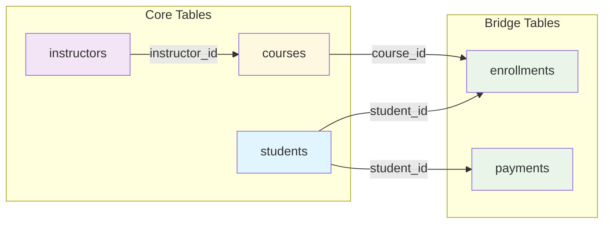

# 🗄️🤖 SQL & GenAI Course
**🎯 Quality Education for Anyone, Anywhere, Anytime — 💫 with Comfort, Convenience at no Cost**

## 🧠 Exercise 2: LEFT JOIN Practice – The Inclusive Bridge

You've learned how `INNER JOIN` shows only matching rows. Now you'll master `LEFT JOIN` – the inclusive bridge that keeps **all** rows from the left table, even when there's no match in the right table. This is how you find gaps, orphans, and missing data.

In the real world, you often need to see everything from a primary table, regardless of whether it has related data. *“List all students, even those not enrolled in any course.”* `INNER JOIN` would exclude them. `LEFT JOIN` keeps them.

---

## 🌌 SQLVerse Check-In

<div style="border-left: 4px solid #9c27b0; background-color: #f3e5f5; padding: 15px; margin: 20px 0; border-radius: 0 8px 8px 0;">

**You are now on Education Planet.** The laws of `LEFT JOIN` are universal. Whether you're finding students with no enrollments or courses with no students, the logic is the same – keep everything from the left, match what you can on the right.

### 🔍 SQLVerse Artisan's Objective

In this exercise, you will move beyond perfect matches. You will learn to find **what is missing** – the students who never enrolled, the courses with no students, the instructors with no courses. This is how you audit systems and find gaps.

**The difference between a coder and an Artisan is discipline.**

</div>

---

### 📍 Your Current Stage – PRACTICE Journey

```mermaid
flowchart LR
    A["✅ PREPARE Complete<br/>📘 Files 1-6"] --> B
    B["✅ Exercise 0<br/>Normalization Practice"] --> C
    C["✅ Exercise 1<br/>INNER JOIN Practice"] --> D
    D["📍 YOU ARE HERE<br/>🧠 Exercise 2<br/>LEFT JOIN Practice"] --> E
    E["⏳ Exercise 3<br/>Multiple Tables"] --> F
    F["⏳ Exercise 4<br/>SELF JOIN Practice"] --> G
    G["⏳ Exercise 5<br/>Mixed JOIN Practice"] --> H
    H["⏳ Capstone Reports<br/>CEO / CTO / CFO"] --> I
    I["✅ PRACTICE COMPLETE<br/>Ready for Quiz"]
    
    style A fill:#e1f5fe,stroke:#4caf50,stroke-width:2px
    style B fill:#c8e6c9,stroke:#4caf50,stroke-width:2px
    style C fill:#c8e6c9,stroke:#4caf50,stroke-width:2px
    style D fill:#fff8e1,stroke:#ff9800,stroke-width:4px
    style E fill:#fff8e1,stroke:#ff9800,stroke-width:2px
    style F fill:#fff8e1,stroke:#ff9800,stroke-width:2px
    style G fill:#fff8e1,stroke:#ff9800,stroke-width:2px
    style H fill:#fff8e1,stroke:#ff9800,stroke-width:2px
    style I fill:#a5d6a7,stroke:#2e7d32,stroke-width:2px
```



You've mastered `INNER JOIN`. Now you'll learn to find gaps and missing data with `LEFT JOIN`.

---

## 🔧 Browser Office for PRACTICE

**🚀 Kickstart: Any Computer, Any Browser, Anytime.**  
**🌍 Destination: Any country, Any city, Any Platform.**

| Tab | Purpose | What to Do |
| :--- | :--- | :--- |
| **1: The Map** | Reference materials | • Keep your **[Module 4 Reference Guide](./module4-reference.md)** handy.<br>• Complete the challenges below. |
| **2: The Factory** | Run queries | Switch to the **Training Institution database**: [`training_institution_sample.db`](../../../Resources/sample_databases/training_institution_sample.db). Run every query. |
| **3: The Consultant** | Conceptual Q&A | If stuck, follow the **3‑Attempt Rule**. Ask for conceptual hints, not code. Configure with **[Student Mode Prompt](../../../STUDENT_MODE_PROMPT_LEVEL1.md)**. |
| **4: The Vault** | Save your work | Save each successful query in your Vault at: `Learning/Level-1-beginner/Level1-1-ACQUIRE/Module4-JoiningTables/2-practiceExercises/` |

---

### 🛠️ Module 4 Toolkit

🚀 Foundation First, AI Next, Projects Last.  
💎 Gemstone by Gemstone, Skill by Skill.

| | | | |
|---|---|---|---|
| **Browser Office** | 🔧 [Troubleshooting Common Issues](../../../Setup/STEP1_COMMISSION_BROWSER_OFFICE.md) | 🔄 [Browser Office Workflow](../../../Setup/STEP2_ESTABLISH_LEARNING_RITUAL.md) | ⌨️ [Tab Operations & Shortcuts](../../../Setup/STEP3_MASTER_TAB_OPERATIONS.md) |
| **ACQUIRE Section** | 🗄️ [Database Ecosystem](../../Guides/Section1-ACQUIRE/2_Database_Ecosystem.md) | 📚 [Knowledge Base (Vault)](../../Guides/Section1-ACQUIRE/3_Knowledge_Base.md) | 🧠 [Mindset Tuning](../../Guides/Section1-ACQUIRE/4_Mindset.md) |

---

## 🏛️ Your Data Playground – Training Institution Database

You'll work with the same tables as Exercise 1: `students`, `courses`, `instructors`, `enrollments`, and `payments`.

### Relationship Map (Refresher)



### `students` Table (first 3 rows for context)

| student_id | first_name | last_name | email | enrollment_date |
|------------|------------|-----------|-------|-----------------|
| 101 | Sarah | Chen | sarah.chen@email.com | 2024-01-15 |
| 102 | Mike | Rodriguez | mike.rod@email.com | 2024-01-20 |
| 103 | Jessica | Park | jessica.park@email.com | 2024-02-01 |

### `courses` Table (first 3 rows for context)

| course_id | course_code | course_name | course_track | instructor_id | course_fee |
|-----------|-------------|-------------|--------------|---------------|------------|
| 201 | WD101 | Frontend Development | Web Development | 501 | 1500.00 |
| 202 | WD102 | Backend with Node.js | Web Development | 502 | 1800.00 |
| 203 | DS101 | Python for Data Analysis | Data Science | 503 | 2000.00 |

### `instructors` Table (all rows for context – only 5 instructors)

| instructor_id | first_name | last_name | email | specialization |
|---------------|------------|-----------|-------|-----------------|
| 501 | Emily | Watson | emily.w@institution.com | Web Development |
| 502 | James | Wilson | james.w@institution.com | Backend & SQL |
| 503 | Maria | Garcia | maria.g@institution.com | Data Science |
| 504 | Robert | Chen | robert.c@institution.com | Cybersecurity |
| 505 | Ahmed | Khan | ahmed.k@institution.com | Machine Learning |

### `enrollments` Table (first 3 rows for context)

| enrollment_id | student_id | course_id | enrollment_date | completion_status | final_exam_score |
|---------------|------------|-----------|-----------------|-------------------|------------------|
| 1 | 101 | 201 | 2024-01-15 | Completed | 85.00 |
| 2 | 101 | 202 | 2024-03-01 | Ongoing | NULL |
| 3 | 102 | 203 | 2024-01-20 | Completed | 94.00 |

### `payments` Table (first 3 rows for context)

| payment_id | student_id | amount | payment_date | payment_method |
|------------|------------|--------|--------------|----------------|
| 301 | 101 | 1500.00 | 2024-01-10 | Credit Card |
| 302 | 101 | 1500.00 | 2024-02-28 | Bank Transfer |
| 303 | 102 | 2000.00 | 2024-01-15 | Debit Card |

> 💡 **View the full datasets:** Run `SELECT * FROM students;`, `SELECT * FROM courses;`, `SELECT * FROM instructors;`, `SELECT * FROM enrollments;`, and `SELECT * FROM payments;` in your Factory to see all rows.

---

### 📊 Quick Data Reminder

| Table | Key Columns | Row Count | Notes |
|-------|-------------|-----------|-------|
| `students` | student_id, first_name, last_name | 10 | Students 101-110 |
| `courses` | course_id, course_name, instructor_id | 8 | Courses 201-208 |
| `instructors` | instructor_id, first_name, last_name | 5 | Instructors 501-505 |
| `enrollments` | enrollment_id, student_id, course_id | 18 | Some students have multiple enrollments |
| `payments` | payment_id, student_id, amount | 18 | Student 108 has no payments |

> 💡 **Key Insight for LEFT JOIN:** `students` has 10 rows, but `enrollments` has 18 rows (some students have multiple enrollments, some may have none). `payments` has 18 rows (student_id 108 has no payments). These mismatches are where `LEFT JOIN` shines.


---

## 💡 Artisan's Pro‑Tips for LEFT JOIN

1. **The left table is the one in the `FROM` clause** – all its rows will appear.
2. **Missing data appears as `NULL`** – columns from the right table become `NULL` when no match exists.
3. **Use `WHERE right_table.id IS NULL` to find orphans** – this is the "missing data" pattern.
4. **Order matters** – `LEFT JOIN` is **not** symmetric. Swapping tables changes results.
5. **`LEFT JOIN` is for inclusion** – use it when you want to keep everything from the main table, even if related data is missing.

---

## 🧪 Challenges

For each challenge, use the **Artisan's Query Rhythm**:
- **The Question** – read the business request.
- **The Query** – write your SQL.
- **Expected Result** – predict what you should see.
- **Try it now** – run it in Tab 2.
- **Reflect & Learn** – compare actual with expectation.

---

### Challenge 1: All Students – With or Without Enrollments
**Question:** Show all students, including those who are not enrolled in any course. Display the student's full name (`student_name`), and if they have an enrollment, show the course ID and enrollment date. If they have no enrollment, show `NULL` for course ID and enrollment date.

> 💡 **Artisan's Note:** Keep all rows from `students`. Match to `enrollments` where possible. Students with no enrollments will show `NULL` for course-related columns.

```sql
-- Your query here
-- Save as: 4-2-1-all-students.sql
```

**Expected Result:** All 10 students appear. Students with enrollments show course details. Students with no enrollments (check your data – possibly none, but the pattern is what matters) show `NULL`.  
**What this teaches:** Basic `LEFT JOIN` – keeping all rows from the left table.

---

### Challenge 2: Find Students with No Enrollments
**Question:** Find students who are not enrolled in any course. Display their full name (`student_name`) and email address.

> 💡 **Artisan's Note:** Use `LEFT JOIN` from `students` to `enrollments`, then filter for `NULL` in the right table's key column (`enrollment_id` or `course_id`). This is the "orphan detection" pattern.

```sql
-- Your query here
-- Save as: 4-2-2-no-enrollments.sql
```

**Expected Result:** Students who appear in `students` but have no matching rows in `enrollments`. (Based on our data, check if any student has zero enrollments.)  
**What this teaches:** The `IS NULL` trick – finding what's missing.

---

### Challenge 3: All Courses – With or Without Enrollments
**Question:** Show all courses, including those with no students enrolled. Display the course name, and if there are enrollments, show the student's full name (`student_name`). If no student is enrolled, show `NULL` for student name.

```sql
-- Your query here
-- Save as: 4-2-3-all-courses.sql
```

**Expected Result:** All 8 courses appear. Courses with enrollments show student names. Courses with no enrollments (check your data – some may have zero) show `NULL`.  
**What this teaches:** `LEFT JOIN` with `courses` as the left table (the dominant table).

---

### Challenge 4: Find Courses with No Students
**Question:** Find courses that have no students enrolled. Display the course code and course name.

```sql
-- Your query here
-- Save as: 4-2-4-empty-courses.sql
```

**Expected Result:** Courses that exist in `courses` but have no matching rows in `enrollments`.  
**What this teaches:** The `IS NULL` trick applied to courses instead of students.

---

### Challenge 5: All Instructors – With or Without Courses
**Question:** Show all instructors, including those who are not assigned to any course. Display the instructor's full name (`instructor_name`), and if they teach a course, show the course name. If they teach no courses, show `NULL` for course name.

```sql
-- Your query here
-- Hint: You'll need to join instructors to courses
-- Save as: 4-2-5-all-instructors.sql
```

**Expected Result:** All 5 instructors appear. Instructors with courses show course names. Instructors with no courses (check your data – Robert Chen and Ahmed Khan have courses? Verify) show `NULL`.  
**What this teaches:** `LEFT JOIN` with `instructors` as the left table.

---

### Challenge 6: All Students – With or Without Payments
**Question:** Show all students, including those who have made no payments. Display the student's full name (`student_name`), and if they have made a payment, show the payment amount and payment date. If they have no payments, show `NULL` for amount and date. Order by student name.

```sql
-- Your query here
-- Save as: 4-2-6-all-students-payments.sql
```

**Expected Result:** All 10 students appear. Students with payments show payment details. Students with no payments (check your data – James Wilson with student_id 108 has no payments) show `NULL`.  
**What this teaches:** `LEFT JOIN` with `students` as left table, `payments` as right table.

---

### Challenge 7: Find Students Who Have Paid Nothing 

**Question:** Find students who have made zero payments. Display their full name (`student_name`), email, and total fees owed (from `students.total_fees`). Order by total fees owed descending.

> 💡 **Artisan's Note:** Students with no payments will have `NULL` in the `payments` table columns after a `LEFT JOIN`. For this challenge, you only need columns from the `students` table (`total_fees` is already there). Use `WHERE payment_id IS NULL` to identify students with no payments. No need to calculate balances – just show what they owe.

```sql
-- Your query here
-- Hint: LEFT JOIN students to payments, filter WHERE payment_id IS NULL
-- Save as: 4-2-7-no-payments.sql
```

**Expected Result:** Students who appear in `students` but have no matching rows in `payments`. (James Wilson with student_id 108 should appear.)

**What this teaches:** Combining `LEFT JOIN` with the `IS NULL` trick to find missing data – without worrying about NULL handling in calculations.

---

## 🎯 Your Progress Tracker

| Challenge | Status (✅/⏳) | Confidence (1‑5) |
|-----------|---------------|------------------|
| 1: All Students – With or Without Enrollments | | |
| 2: Find Students with No Enrollments | | |
| 3: All Courses – With or Without Enrollments | | |
| 4: Find Courses with No Students | | |
| 5: All Instructors – With or Without Courses | | |
| 6: All Students – With or Without Payments | | |
| 7: Find Students Who Have Paid Nothing (Optional) | | |

---

## 💎 DESIGNER'S PERIGON

### 🎨 *The Art of Inclusion*

`LEFT JOIN` is the join that never leaves anyone behind. It answers questions like *“Which students never enrolled?”* and *“Which courses have no students?”* It shows you the full picture, including the gaps.

In the **SQLVerse**, `LEFT JOIN` is the generous host – it sets a place at the table for everyone, even if they show up alone.

In the Artisan's Garden:

- `INNER JOIN` is a **monochromatic bouquet** – pure, focused, and perfect in its simplicity with exact color match.
- `LEFT JOIN` is a bouquet with **varying shades of the chosen color** to add dimension and interest. This is designed to create a sophisticated, elegant, and modern look by utilizing different **tints and tones.** Even if a flower bed has not bloomed, the **stems** are included in the bouquet, providing **contrast** and helping the **primary color pop.**

> *“`LEFT JOIN` tells the whole truth, including the silence. It reveals not just what exists, but what is missing.”*

---

### 🌍 Real‑World Application

The `LEFT JOIN` queries you just wrote solve real business problems that `INNER JOIN` cannot.

| Query | Real‑World Scenario | Business Impact |
|-------|---------------------|-----------------|
| 📊 **Students with No Enrollments** | A training manager needs to identify inactive students who paid but never started. | **Revenue recovery** – reach out to inactive students before they request refunds. |
| 👨‍🏫 **Courses with No Students** | A department head needs to identify unpopular courses for review or cancellation. | **Curriculum optimization** – cut low-demand courses, add high-demand ones. |
| 💰 **Students with No Payments** | An accounts receivable team needs to identify students who owe fees. | **Cash flow improvement** – follow up on unpaid balances before they grow. |
| 🏫 **Instructors with No Courses** | A staffing coordinator needs to identify underutilized instructors for reassignment. | **Resource optimization** – balance teaching loads across all faculty. |

### The Cost of Missing a `LEFT JOIN`

Imagine a university that uses only `INNER JOIN`. The registrar runs a report: *"Show all students and their enrollments."* Students with no enrollments disappear. The registrar doesn't know they exist. The university loses track of inactive students.

| Without `LEFT JOIN` | With `LEFT JOIN` |
|---------------------|------------------|
| Inactive students are invisible | Every student is visible, enrollment status clear |
| "We have no inactive students" (false) | "Here are the 3 students with no enrollments" |
| No follow‑up, no recovery | Targeted outreach, potential revenue recovered |


#### The Artisan's Advantage

When an interviewer asks, *"What's the difference between INNER JOIN and LEFT JOIN?"* – every candidate can recite the definition. When they ask, *"Give me a business scenario where you MUST use LEFT JOIN instead of INNER JOIN"* – **you** will say:

> *"When I need to find students who have never enrolled in a course. An INNER JOIN would exclude them entirely. A LEFT JOIN keeps them, and the IS NULL filter identifies them. That's how you find gaps in your data."*

**That answer gets you hired.**

**The SQLVerse expands. Go build inclusive bridges.** 🔗

---

## ✅ When You're Done

- [ ] I successfully ran all 7 queries (or made a solid attempt at each).
- [ ] I saved each query in my Vault with the correct filename.
- [ ] I can explain the difference between `INNER JOIN` and `LEFT JOIN`.
- [ ] I understand why `LEFT JOIN` keeps all rows from the left table.
- [ ] I can find orphaned records using `WHERE right_table.id IS NULL`.
- [ ] I feel ready for Exercise 3: Multiple Tables.

---

## 🧭 Practice Navigation


| Previous Step | Next Step |
|:---:|:---:|
| [← Back to Exercise 1: INNER JOIN Practice](./1-inner-join-practice.md) | [Continue to Exercise 3: Multiple Tables →](./3-multiple-tables-practice.md) |

---

*Part of our mission for 🎯 Quality Education for Anyone, Anywhere, Anytime — 💫 with Comfort, Convenience at no Cost.*

**Level 1 | Module 4 | Practice Exercise 2 | Next: [Multiple Tables Practice](./3-multiple-tables-practice.md)**