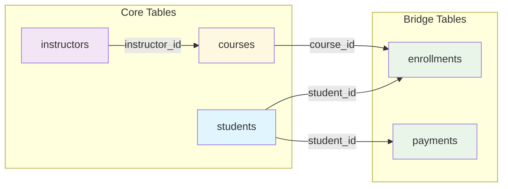

# 🗄️🤖 SQL & GenAI Course
**🎯 Quality Education for Anyone, Anywhere, Anytime — 💫 with Comfort, Convenience at no Cost**

---

## 🧠 Exercise 3: Multiple Tables Practice – The Art of the Chain

You've mastered joining two tables with `INNER JOIN` and `LEFT JOIN`. Now it's time to **chain multiple joins** together in a single query. This is where the real power of SQL emerges – answering complex business questions that span the entire database.

In the Training Institution, a single question might require data from `students`, `enrollments`, `courses`, `instructors`, and `payments`. To answer *"Which students are taking Web Development courses and have paid more than $500?"* – you need a **join chain**.

---

## 🌌 SQLVerse Check-In

<div style="border-left: 4px solid #9c27b0; background-color: #f3e5f5; padding: 15px; margin: 20px 0; border-radius: 0 8px 8px 0;">

**You are now on Education Planet – Advanced Navigation.** The laws of chaining joins are universal. Whether you're connecting students to payments or customers to categories, the logic is the same – follow the foreign keys.

### 🔍 SQLVerse Artisan's Objective

In this exercise, you will move beyond two-table joins. You will learn to **chain** three, four, or even five tables together in a single query. You will answer questions that require walking across the entire database schema.

**The difference between a coder and an Artisan is discipline.**

</div>

---

### 📍 Your Current Stage – PRACTICE Journey

```mermaid
flowchart LR
    A["✅ PREPARE Complete<br/>📘 Files 1-6"] --> B
    B["✅ Exercise 0<br/>Normalization Practice"] --> C
    C["✅ Exercise 1<br/>INNER JOIN Practice"] --> D
    D["✅ Exercise 2<br/>LEFT JOIN Practice"] --> E
    E["📍 YOU ARE HERE<br/>🧠 Exercise 3<br/>Multiple Tables"] --> F
    F["⏳ Exercise 4<br/>SELF JOIN Practice"] --> G
    G["⏳ Exercise 5<br/>Mixed JOIN Practice"] --> H
    H["⏳ Capstone Reports<br/>CEO / CTO / CFO"] --> I
    I["✅ PRACTICE COMPLETE<br/>Ready for Quiz"]
    
    style A fill:#e1f5fe,stroke:#4caf50,stroke-width:2px
    style B fill:#c8e6c9,stroke:#4caf50,stroke-width:2px
    style C fill:#c8e6c9,stroke:#4caf50,stroke-width:2px
    style D fill:#c8e6c9,stroke:#4caf50,stroke-width:2px
    style E fill:#fff8e1,stroke:#ff9800,stroke-width:4px
    style F fill:#fff8e1,stroke:#ff9800,stroke-width:2px
    style G fill:#fff8e1,stroke:#ff9800,stroke-width:2px
    style H fill:#fff8e1,stroke:#ff9800,stroke-width:2px
    style I fill:#a5d6a7,stroke:#2e7d32,stroke-width:2px
```



You've mastered two-table joins. Now you'll learn to chain multiple joins.

---

## 🔧 Browser Office for PRACTICE

**🚀 Kickstart: Any Computer, Any Browser, Anytime.**  
**🌍 Destination: Any country, Any city, Any Platform.**

| Tab | Purpose | What to Do |
| :--- | :--- | :--- |
| **1: The Map** | Reference materials | • Keep your **[Module 4 Reference Guide](./module4-reference.md)** handy.<br>• Complete the challenges below. |
| **2: The Factory** | Run queries | Switch to the **Training Institution database**: [`training_institution_sample.db`](../../../Resources/sample_databases/training_institution_sample.db). Run every query. |
| **3: The Consultant** | Conceptual Q&A | If stuck, follow the **3‑Attempt Rule**. Ask for conceptual hints, not code. Configure with **[Student Mode Prompt](../../../STUDENT_MODE_PROMPT_LEVEL1.md)**. |
| **4: The Vault** | Save your work | Save each successful query in your Vault at: `Learning/Level-1-beginner/Level1-1-ACQUIRE/Module4-JoiningTables/2-practiceExercises/` |

---

### 🛠️ Module 4 Toolkit

🚀 Foundation First, AI Next, Projects Last.  
💎 Gemstone by Gemstone, Skill by Skill.

| | | | |
|---|---|---|---|
| **Browser Office** | 🔧 [Troubleshooting Common Issues](../../../Setup/STEP1_COMMISSION_BROWSER_OFFICE.md) | 🔄 [Browser Office Workflow](../../../Setup/STEP2_ESTABLISH_LEARNING_RITUAL.md) | ⌨️ [Tab Operations & Shortcuts](../../../Setup/STEP3_MASTER_TAB_OPERATIONS.md) |
| **ACQUIRE Section** | 🗄️ [Database Ecosystem](../../Guides/Section1-ACQUIRE/2_Database_Ecosystem.md) | 📚 [Knowledge Base (Vault)](../../Guides/Section1-ACQUIRE/3_Knowledge_Base.md) | 🧠 [Mindset Tuning](../../Guides/Section1-ACQUIRE/4_Mindset.md) |

---

## 🏛️ Your Data Playground – Training Institution Database

You'll work with the `students`, `courses`, `instructors`, `enrollments`, and `payments` tables.

### Relationship Map



### `students` Table (first 3 rows for context)

| student_id | first_name | last_name | email | enrollment_date |
|------------|------------|-----------|-------|-----------------|
| 101 | Sarah | Chen | sarah.chen@email.com | 2024-01-15 |
| 102 | Mike | Rodriguez | mike.rod@email.com | 2024-01-20 |
| 103 | Jessica | Park | jessica.park@email.com | 2024-02-01 |

### `courses` Table (first 3 rows for context)

| course_id | course_code | course_name | course_track | instructor_id | course_fee |
|-----------|-------------|-------------|--------------|---------------|------------|
| 201 | WD101 | Frontend Development | Web Development | 501 | 1500.00 |
| 202 | WD102 | Backend with Node.js | Web Development | 502 | 1800.00 |
| 203 | DS101 | Python for Data Analysis | Data Science | 503 | 2000.00 |

### `instructors` Table (all rows for context – only 5 instructors)

| instructor_id | first_name | last_name | email | specialization |
|---------------|------------|-----------|-------|-----------------|
| 501 | Emily | Watson | emily.w@institution.com | Web Development |
| 502 | James | Wilson | james.w@institution.com | Backend & SQL |
| 503 | Maria | Garcia | maria.g@institution.com | Data Science |
| 504 | Robert | Chen | robert.c@institution.com | Cybersecurity |
| 505 | Ahmed | Khan | ahmed.k@institution.com | Machine Learning |

### `enrollments` Table (first 3 rows for context)

| enrollment_id | student_id | course_id | enrollment_date | completion_status | final_exam_score |
|---------------|------------|-----------|-----------------|-------------------|------------------|
| 1 | 101 | 201 | 2024-01-15 | Completed | 85.00 |
| 2 | 101 | 202 | 2024-03-01 | Ongoing | NULL |
| 3 | 102 | 203 | 2024-01-20 | Completed | 94.00 |

### `payments` Table (first 3 rows for context)

| payment_id | student_id | amount | payment_date | payment_method |
|------------|------------|--------|--------------|----------------|
| 301 | 101 | 1500.00 | 2024-01-10 | Credit Card |
| 302 | 101 | 1500.00 | 2024-02-28 | Bank Transfer |
| 303 | 102 | 2000.00 | 2024-01-15 | Debit Card |

> 💡 **View the full datasets:** Run `SELECT * FROM students;`, `SELECT * FROM courses;`, `SELECT * FROM instructors;`, `SELECT * FROM enrollments;`, and `SELECT * FROM payments;` in your Factory to see all rows.

---

### 📊 Quick Data Reminder

| Table | Key Columns | Row Count | Notes |
|-------|-------------|-----------|-------|
| `students` | student_id, first_name, last_name | 10 | Students 101-110 |
| `courses` | course_id, course_name, instructor_id | 8 | Courses 201-208 |
| `instructors` | instructor_id, first_name, last_name | 5 | Instructors 501-505 |
| `enrollments` | enrollment_id, student_id, course_id | 18 | Some students have multiple enrollments |
| `payments` | payment_id, student_id, amount | 18 | Student 108 has no payments |

> 💡 **Key Insight for Chaining:** The chain is: `students` → `enrollments` → `courses` → `instructors`. Also `students` → `payments`. To connect `payments` to `courses`, you must go through `students` and `enrollments`.

---

## 💡 Artisan's Pro‑Tips for Multiple Tables

1. **Follow the foreign keys** – You can only join tables that share a common column.
2. **Use table aliases** – With 3+ tables, aliases are essential for readability.
3. **Chain order matters for `LEFT JOIN`** – The first `LEFT JOIN` determines which rows are preserved.
4. **Test incrementally** – Build your chain one join at a time. Verify after each addition.
5. **`DISTINCT` may be needed** – When joining one-to-many relationships, rows can duplicate.

---

## 🧪 Challenges

For each challenge, use the **Artisan's Query Rhythm**:
- **The Question** – read the business request.
- **The Query** – write your SQL.
- **Expected Result** – predict what you should see.
- **Try it now** – run it in Tab 2.
- **Reflect & Learn** – compare actual with expectation.

---

### Challenge 1: Students with Course and Instructor Details
**Question:** Show all students and their enrollments, including the course name and the instructor's full name (`instructor_name`). Display `student_name`, `course_name`, `instructor_name`, and `completion_status`.

> 💡 **Artisan's Note:** You'll need to join `students` → `enrollments` → `courses` → `instructors`. That's **four tables** in one chain.

```sql
-- Your query here
-- Save as: 4-3-1-students-courses-instructors.sql
```

**Expected Result:** Every enrollment appears with student name, course name, and instructor name.  
**What this teaches:** Chaining four tables using `INNER JOIN`.

---

### Challenge 2: Students and Their Total Payments
**Question:** Show each student's full name (`student_name`) and the total amount they have paid across all payments. Only include students who have made at least one payment.

> 💡 **Artisan's Note:** You'll need to join `students` to `payments`, then use `SUM()` and `GROUP BY`.

```sql
-- Your query here
-- Save as: 4-3-2-student-total-payments.sql
```

**Expected Result:** Students with payments appear with their total paid. Student 108 (James Wilson) with no payments does NOT appear.  
**What this teaches:** Two-table join with aggregation.

---

### Challenge 3: Students in Data Science Track
**Question:** Show all students enrolled in courses from the 'Data Science' track. Display `student_name`, `course_name`, and `enrollment_date`. Order by student name.

> 💡 **Artisan's Note:** You'll need to join `students` → `enrollments` → `courses`, then filter `course_track = 'Data Science'`.

```sql
-- Your query here
-- Save as: 4-3-3-data-science-students.sql
```

**Expected Result:** Students enrolled in DS101, DS102, or DS201.  
**What this teaches:** Three-table join with a `WHERE` filter.

---

### Challenge 4: Complete Payment History with Course Details
**Question:** Show all payments made by students, including the student name, payment amount, payment date, and the course(s) they are enrolled in. If a student is enrolled in multiple courses, they may appear multiple times.

> 💡 **Artisan's Note:** You'll need to join `payments` → `students` → `enrollments` → `courses`. This creates a chain where payment records multiply across multiple enrollments.

```sql
-- Your query here
-- Save as: 4-3-4-payments-with-courses.sql
```

> 📊 **Observation Box:** If your query returns more rows than expected (e.g., 36 rows when there are only 18 payments), you are not wrong. This is the **multiplication effect** of joining one-to-many relationships. Each payment appears once for every enrollment the student has. An Artisan recognizes this pattern and uses `DISTINCT` or aggregation when needed.

**Expected Result:** Each payment appears once per enrollment (if a student has 2 enrollments and 2 payments, you may see 4 rows).  
**What this teaches:** The multiplication effect of joining one-to-many relationships.

---

### Challenge 5: Students Who Completed Courses with High Scores
**Question:** Show all students who completed a course with a final exam score of 85 or higher. Display `student_name`, `course_name`, and `final_exam_score`. Order by score descending.

```sql
-- Your query here
-- Save as: 4-3-5-high-scorers.sql
```

**Expected Result:** Students like Alex Kumar (97 in WD101), Mike Rodriguez (94 in DS101).  
**What this teaches:** Three-table join with a numeric filter.

---

### Challenge 6: Instructor Course Roster
**Question:** Show each instructor and the list of students enrolled in their courses. Display `instructor_name`, `course_name`, and `student_name`. Order by instructor name, then course name, then student name.

> 💡 **Artisan's Note:** You'll need to join `instructors` → `courses` → `enrollments` → `students`. That's four tables from a different starting point.

```sql
-- Your query here
-- Save as: 4-3-6-instructor-roster.sql
```

**Expected Result:** Each instructor appears multiple times – once per student in their courses.  
**What this teaches:** Chaining joins starting from `instructors` instead of `students`.

---

### Challenge 7: Students Who Owe Balance 
**Question:** Find students who have unpaid fees. Display `student_name`, `total_fees`, `fees_paid`, and the calculated `balance_owed` (`total_fees - fees_paid`). Only include students with a balance greater than 0.

> 💡 **Artisan's Note:** This query only needs the `students` table (no joins required!). But to verify payments, you might cross-reference with `payments` using a subquery or join. For Level 1, keep it simple – use the `total_fees` and `fees_paid` columns already in `students`.

> 💡 **Artisan's Note – Economy of Effort:** This query uses only the `students` table. No joins required. An Artisan doesn't use a `JOIN` just because they can; they use it only when the data demands it. The most elegant query is often the simplest one. **Economy of Effort** is a hallmark of mastery.

```sql
-- Your query here
-- Save as: 4-3-7-balance-owed.sql
```

**Expected Result:** Students who owe money (Jessica Park, Lisa Johnson, James Wilson, Priya Patel).  
**What this teaches:** Sometimes the answer is in a single table – don't always over-complicate with joins.

---

## 🎯 Your Progress Tracker

| Challenge | Status (✅/⏳) | Confidence (1‑5) |
|-----------|---------------|------------------|
| 1: Students with Course and Instructor Details | | |
| 2: Students and Their Total Payments | | |
| 3: Students in Data Science Track | | |
| 4: Complete Payment History with Course Details | | |
| 5: Students Who Completed Courses with High Scores | | |
| 6: Instructor Course Roster | | |
| 7: Students Who Owe Balance (Optional) | | |

---

## 💎 DESIGNER'S PERIGON

### 🎨 *The Art of the Chain*

A single join is powerful. A chain of joins is transformative. It turns a scattered collection of tables into a unified view of your business.

> *“A single join connects two tables. A chain of joins connects an entire database.”*

> *“A chain of joins is a journey through your data. Start anywhere, follow the foreign keys, and discover the whole story.”*

In the Artisan’s Garden, the multi-table join is a **multi-colored bouquet** that combines **vibrant** contrasting blooms for a **lively, cheerful effect** which turns a simple arrangement into an **extraordinary work** of art. By mixing colors purposefully you can create a striking **centerpiece** to decorate any dashboard for any C-Suite executive. Choosing **Flower Explosion** offers you the advantage of outstanding quality and variety which are the hallmarks of a **SQLVerse Artisan**.

---

### 🌍 Real‑World Application

The multi-table join queries you just wrote solve complex business questions that two-table joins cannot.

| Query | Real‑World Scenario | Business Impact |
|-------|---------------------|-----------------|
| 📊 **Student-Course-Instructor Chain** | A registrar needs to generate a complete transcript showing student, course, and instructor for audit purposes. | **Audit readiness** – complete traceability of every enrollment. |
| 👨‍🏫 **Instructor Course Roster** | A department head needs to see which students are in which instructors' courses for workload review. | **Resource visibility** – understand teaching assignments at a glance. |
| 💰 **Payments with Course Details** | A finance team needs to reconcile payments against specific course enrollments. | **Financial accuracy** – ensure payments are correctly attributed. |
| 🎓 **High Scorers by Course** | An academic director needs to identify top-performing students across all courses. | **Recognition programs** – reward excellence with data-backed decisions. |

#### The Artisan's Advantage

When an interviewer asks, *"Can you join three tables?"* – many candidates say yes. When they ask, *"Walk me through a query that joins students, enrollments, courses, and instructors – and explain why you need each join"* – **you** will say:

> *"I start with students, join to enrollments via student_id to see which courses each student took. Then I join to courses via course_id to get course names. Finally, I join to instructors via instructor_id to see who taught each course. Each join adds a new layer of detail – from student to enrollment to course to instructor."*

**That answer gets you hired.**

---

**The SQLVerse expands. Go build longer bridges.** 🔗

---

## ✅ When You're Done

- [ ] I successfully ran all 7 queries (or made a solid attempt at each).
- [ ] I saved each query in my Vault with the correct filename.
- [ ] I can chain three or more tables together in a single query.
- [ ] I understand why joining one-to-many relationships can create duplicate rows.
- [ ] I know when to use `DISTINCT` to remove duplicates.
- [ ] I feel ready for Exercise 4: SELF JOIN Practice.

---

## 🧭 Practice Navigation


| Previous Step | Next Step |
|:---:|:---:|
| [← Back to Exercise 2: LEFT JOIN Practice](./2-left-join-practice.md) | [Continue to Exercise 4: SELF JOIN Practice →](./4-self-join-practice.md) |