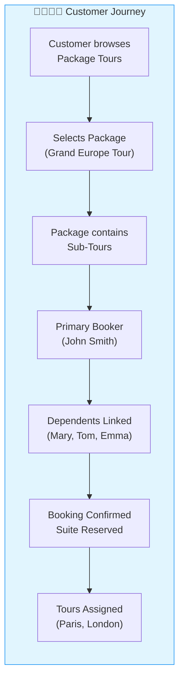
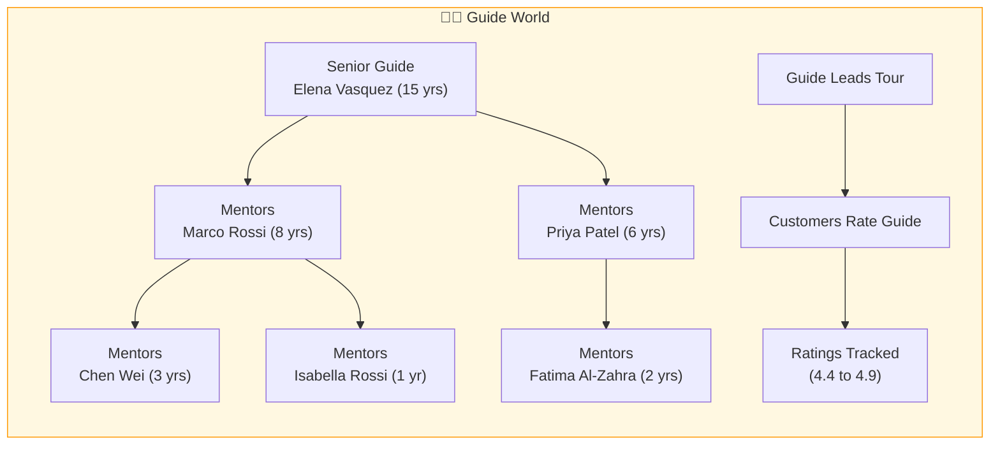
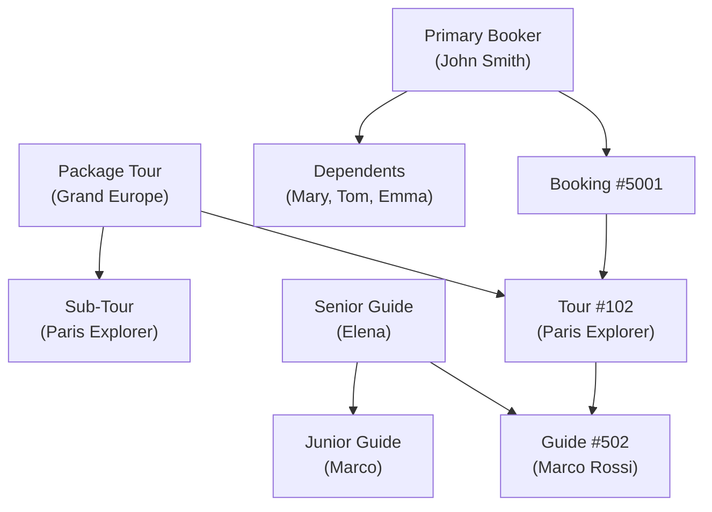
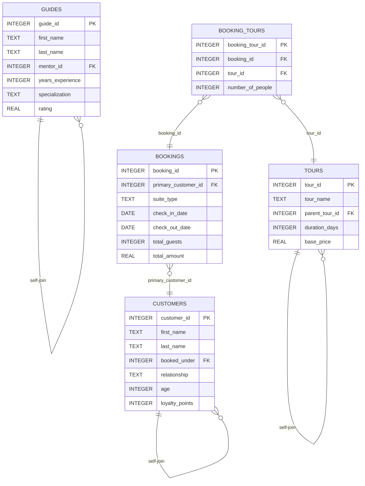

# 🗄️🤖 SQL & GenAI Course
**🎯 Quality Education for Anyone, Anywhere, Anytime — 💫 with Comfort, Convenience at no Cost**

---

## 🧠 Exercise 4: Self Join Practice – The Mirror Bridge

You've learned how `INNER JOIN` and `LEFT JOIN` connect different tables. Now you'll master **Self Join** – joining a table to itself. This is how you uncover hierarchies: package tours containing sub-tours, senior guides mentoring juniors, and primary bookers managing family travel.

On **Tourism Planet**, every journey reveals a connection. Every guide has a mentor. Every family has a primary booker. Every package tour contains smaller adventures. These relationships live inside the same table – and only a Self Join can reveal them.

---

## 🌌 SQLVerse Check-In

<div style="border-left: 4px solid #9c27b0; background-color: #f3e5f5; padding: 15px; margin: 20px 0; border-radius: 0 8px 8px 0;">

**You are now on Tourism Planet – The Land of Connections.** The laws of self joins are universal. Whether you're finding sub-tours, mentor relationships, or family dependencies, the logic is the same – look into the mirror.

### 🔍 SQLVerse Artisan's Objective

In this exercise, you will move beyond joining different tables. You will learn to **look into the mirror** – joining a table to itself to reveal hierarchies, relationships, and dependencies hidden within a single table.

**The difference between a coder and an Artisan is discipline.**

</div>

---

### 📍 Your Current Stage – PRACTICE Journey

```mermaid
flowchart LR
    A["✅ PREPARE Complete<br/>📘 Files 1-6"] --> B
    B["✅ Exercise 0<br/>Normalization Practice"] --> C
    C["✅ Exercise 1<br/>INNER JOIN Practice"] --> D
    D["✅ Exercise 2<br/>LEFT JOIN Practice"] --> E
    E["✅ Exercise 3<br/>Multiple Tables"] --> F
    F["📍 YOU ARE HERE<br/>🧠 Exercise 4<br/>Self Join Practice"] --> G
    G["⏳ Exercise 5<br/>Mixed JOIN Practice"] --> H
    H["⏳ Capstone Reports<br/>CEO / CTO / CFO"] --> I
    I["✅ PRACTICE COMPLETE<br/>Ready for Quiz"]
    
    style A fill:#e1f5fe,stroke:#4caf50,stroke-width:2px
    style B fill:#c8e6c9,stroke:#4caf50,stroke-width:2px
    style C fill:#c8e6c9,stroke:#4caf50,stroke-width:2px
    style D fill:#c8e6c9,stroke:#4caf50,stroke-width:2px
    style E fill:#c8e6c9,stroke:#4caf50,stroke-width:2px
    style F fill:#fff8e1,stroke:#ff9800,stroke-width:4px
    style G fill:#fff8e1,stroke:#ff9800,stroke-width:2px
    style H fill:#fff8e1,stroke:#ff9800,stroke-width:2px
    style I fill:#a5d6a7,stroke:#2e7d32,stroke-width:2px
```



You've mastered multi-table joins. Now you'll learn to join a table to itself.

---

## 🔧 Browser Office for PRACTICE

**🚀 Kickstart: Any Computer, Any Browser, Anytime.**  
**🌍 Destination: Any country, Any city, Any Platform.**

| Tab | Purpose | What to Do |
| :--- | :--- | :--- |
| **1: The Map** | Reference materials | • Keep your **[Module 4 Reference Guide](./module4-reference.md)** handy.<br>• Complete the challenges below. |
| **2: The Factory** | Run queries | Switch to the **Tourism Planet Self-Join database**: [`tourism_planet_self_join.db`](../1-sqlCommands/SQLVerse-Architects-Blueprint/tourism_planet_self_join.db) |
| **3: The Consultant** | Conceptual Q&A | If stuck, follow the **3‑Attempt Rule**. Ask for conceptual hints, not code. Configure with **[Student Mode Prompt](../../../STUDENT_MODE_PROMPT_LEVEL1.md)**. |
| **4: The Vault** | Save your work | Save each successful query in your Vault at: `Learning/Level-1-beginner/Level1-1-ACQUIRE/Module4-JoiningTables/2-practiceExercises/` |

---

### 🛠️ Module 4 Toolkit

🚀 Foundation First, AI Next, Projects Last.  
💎 Gemstone by Gemstone, Skill by Skill.

| | | | |
|---|---|---|---|
| **Browser Office** | 🔧 [Troubleshooting Common Issues](../../../Setup/STEP1_COMMISSION_BROWSER_OFFICE.md) | 🔄 [Browser Office Workflow](../../../Setup/STEP2_ESTABLISH_LEARNING_RITUAL.md) | ⌨️ [Tab Operations & Shortcuts](../../../Setup/STEP3_MASTER_TAB_OPERATIONS.md) |
| **ACQUIRE Section** | 🗄️ [Database Ecosystem](../../Guides/Section1-ACQUIRE/2_Database_Ecosystem.md) | 📚 [Knowledge Base (Vault)](../../Guides/Section1-ACQUIRE/3_Knowledge_Base.md) | 🧠 [Mindset Tuning](../../Guides/Section1-ACQUIRE/4_Mindset.md) |

---
## 🌍 SQLVerse Tour of Tourism Planet

Welcome to **Tourism Planet** – a vibrant world where travelers explore exotic destinations, guides share their knowledge, and families create lasting memories. Let's take a tour from two perspectives: the **customer's journey** and the **guide's world**.

---

### 🧳 The Customer's Journey

**Step 1: Choosing a Package**

A customer visits the travel agency's website. They see package tours like **"Grand Europe Tour"** – a 14-day journey covering 6 countries. But this package contains smaller sub-tours: **Paris Explorer** (4 days), **London Highlights** (3 days), and **Swiss Alps Adventure** (5 days). The customer can book the entire package or pick individual sub-tours.

**Step 2: Booking with Family**

John Smith books a **2 Bedroom Suite** for his family of four. He is the **primary booker**. His wife Mary and children Tom and Emma are **dependents** – linked to John's booking. The hotel needs to know: *"Who is traveling with John?"* That's where a self join on `booked_under` reveals the entire family.

**Step 3: Sightseeing & Commuting**

Each booking includes selected tours. The family chooses **Paris Explorer** and **London Highlights**. They commute via guided coaches, stay in suite-style hotels, and enjoy pre-arranged sightseeing. The travel agency tracks which tours are included in each booking through the `booking_tours` junction table.



---

### 🧭 The Guide's World

**Step 1: Senior Guides Train Juniors**

Elena Vasquez is a senior guide with 15 years of experience. She mentors Marco Rossi and Priya Patel. Marco later mentors Chen Wei, Liam O'Brien, and Isabella Rossi. This creates a **mentorship hierarchy** – knowledge flows from senior to junior guides.

**Step 2: Interacting with Customers**

Guides lead the sub-tours. Marco Rossi leads **Paris Explorer**. Priya Patel leads **Art & Architecture** tours. Customers rate their guides (ratings stored in the `guides` table). The agency tracks which guides are most effective.

**Step 3: Career Progression**

A junior guide like Isabella Rossi (1 year experience) learns from Marco Rossi. After gaining experience, she may become a mentor to future guides. The `mentor_id` column in the `guides` table captures this relationship – a perfect use case for a self join.



---

### 🔗 How It All Connects



---


## 🏛️ Your Data Playground – Tourism Planet Database

You'll work with five tables: `tours`, `guides`, `customers`, `bookings`, and `booking_tours`.

### Entity-Relationship Diagram




---

### `tours` Table (first 3 rows for context)

| tour_id | tour_name | parent_tour_id | duration_days | base_price |
|---------|-----------|----------------|---------------|------------|
| 101 | Grand Europe Tour | NULL | 14 | 3500.00 |
| 102 | Paris Explorer | 101 | 4 | 1200.00 |
| 103 | London Highlights | 101 | 3 | 1000.00 |

> 💡 **Self-Join Insight:** `parent_tour_id = 101` means Paris Explorer is a sub-tour of Grand Europe Tour.

---

### `guides` Table (first 3 rows for context)

| guide_id | first_name | last_name | mentor_id | years_experience | specialization |
|----------|------------|-----------|-----------|------------------|----------------|
| 501 | Elena | Vasquez | NULL | 15 | Cultural Heritage |
| 502 | Marco | Rossi | 501 | 8 | European History |
| 503 | Priya | Patel | 501 | 6 | Art & Architecture |

> 💡 **Self-Join Insight:** `mentor_id = 501` means Marco and Priya were trained by Elena.

---

### `customers` Table (first 3 rows for context)

| customer_id | first_name | last_name | booked_under | relationship | age |
|-------------|------------|-----------|--------------|--------------|-----|
| 1001 | John | Smith | NULL | Primary | 45 |
| 1002 | Mary | Smith | 1001 | Spouse | 42 |
| 1003 | Tom | Smith | 1001 | Child | 16 |

> 💡 **Self-Join Insight:** `booked_under = 1001` means Mary and Tom are dependents of John Smith.

---

### `bookings` Table (first 3 rows for context)

| booking_id | primary_customer_id | suite_type | check_in_date | total_guests |
|------------|---------------------|------------|---------------|--------------|
| 5001 | 1001 | 2 Bedroom Suite | 2025-06-01 | 4 |
| 5002 | 1005 | 3 Bedroom Suite | 2025-07-15 | 3 |
| 5003 | 1008 | 2 Bedroom Suite | 2025-08-10 | 3 |

---

### `booking_tours` Table (first 3 rows for context)

| booking_tour_id | booking_id | tour_id | number_of_people |
|-----------------|------------|---------|------------------|
| 1 | 5001 | 102 | 4 |
| 2 | 5001 | 103 | 4 |
| 3 | 5001 | 104 | 2 |

> 💡 **View the full datasets:** Run `SELECT * FROM tours;`, `SELECT * FROM guides;`, `SELECT * FROM customers;`, `SELECT * FROM bookings;`, and `SELECT * FROM booking_tours;` in your Factory to see all rows.

---

### 📊 Quick Data Reminder

| Table | Key Columns | Row Count | Self-Join Column |
|-------|-------------|-----------|------------------|
| `tours` | tour_id, tour_name, parent_tour_id | 12 | `parent_tour_id` → `tour_id` |
| `guides` | guide_id, first_name, last_name, mentor_id | 10 | `mentor_id` → `guide_id` |
| `customers` | customer_id, first_name, last_name, booked_under | 15 | `booked_under` → `customer_id` |
| `bookings` | booking_id, primary_customer_id | 5 | `primary_customer_id` → `customer_id` |
| `booking_tours` | booking_tour_id, booking_id, tour_id | 10 | (Join table, no self-join) |

> 💡 **Key Insight for Self Joins:** Three tables in this database have self-referential foreign keys: `tours`, `guides`, and `customers`. Each one is designed for a specific self-join use case.

---

## 💡 Artisan's Pro‑Tips for Self Join (Tourism Edition)

1. **Always use table aliases** – `t1` and `t2` for tours, `g1` and `g2` for guides, `c1` and `c2` for customers.
2. **The `ON` clause defines the relationship** – `ON t1.tour_id = t2.parent_tour_id` (find sub-tours of a tour)
3. **`LEFT JOIN` preserves the root** – The CEO of tours (package with NULL parent) stays in results.
4. **`WHERE right_table.id IS NULL` finds orphans** – Tours with no parent, guides with no mentor, customers with no booker.
5. **Think in pairs** – One alias is the "child" (sub-tour, junior guide, dependent). The other alias is the "parent" (package tour, senior guide, primary booker).

---

## 🧪 Challenges

For each challenge, use the **Artisan's Query Rhythm**:
- **The Question** – read the business request.
- **The Query** – write your SQL.
- **Expected Result** – predict what you should see.
- **Try it now** – run it in Tab 2.
- **Reflect & Learn** – compare actual with expectation.

---

### Challenge 1: Package Tours and Their Sub-Tours
**Question:** Show all package tours and their sub-tours. Display `package_name` (the parent tour), `sub_tour_name`, and `duration_days` of the sub-tour. Only include tours that have a parent (sub-tours). Order by package name.

> 💡 **Artisan's Note:** Join `tours` to itself. One alias represents the package (parent), the other represents the sub-tour (child).

```sql
-- Your query here
-- Save as: 4-4-1-package-subtours.sql
```

**Expected Result:** Grand Europe Tour appears with Paris Explorer, London Highlights, Swiss Alps Adventure. Rome Ancient Wonders appears with Vatican City Tour, Colosseum Underground. Bali Tropical Escape appears with Ubud Cultural Tour, Bali Beaches Adventure, Mount Batur Sunrise Trek.  
**What this teaches:** Basic self join – finding parent-child relationships in a hierarchy.

---

### Challenge 2: All Tours – Including Standalone Packages
**Question:** Show all tours and their parent package. If a tour has no parent (it is a standalone package), show `NULL` in the parent column. Display `tour_name` and `parent_tour_name`. Order by tour_id.

```sql
-- Your query here
-- Save as: 4-4-2-all-tours-with-parents.sql
```

**Expected Result:** All 12 tours appear. Grand Europe Tour shows NULL parent. Paris Explorer shows Grand Europe Tour as parent. Tokyo Explorer shows NULL parent.  
**What this teaches:** `LEFT JOIN` in a self join – preserving rows without matches.

---

### Challenge 3: Find Standalone Packages (No Parent)
**Question:** Find all tours that are standalone packages (not sub-tours of any other tour). Display `tour_name` and `base_price`. Order by price descending.

```sql
-- Your query here
-- Save as: 4-4-3-standalone-packages.sql
```

**Expected Result:** Grand Europe Tour, Rome Ancient Wonders, Bali Tropical Escape, Tokyo Explorer.  
**What this teaches:** The `IS NULL` trick – finding rows with no parent in a hierarchy.

---

### Challenge 4: Guide Mentorship Hierarchy
**Question:** List every guide and their mentor's name. Display `guide_name` (first and last combined) and `mentor_name`. Include guides with no mentor (show NULL). Order by guide_id.

```sql
-- Your query here
-- Save as: 4-4-4-guide-mentorship.sql
```

**Expected Result:** Elena Vasquez (NULL), Marco Rossi (Elena Vasquez), Priya Patel (Elena Vasquez), Chen Wei (Marco Rossi), Fatima Al-Zahra (Priya Patel), Liam O'Brien (Marco Rossi), Yuki Tanaka (NULL), Sofia Silva (Yuki Tanaka), Kenji Watanabe (Yuki Tanaka), Isabella Rossi (Marco Rossi).  
**What this teaches:** Self join on `mentor_id` – revealing the training hierarchy.

---

### Challenge 5: Find Senior Guides (Mentors)
**Question:** Find all guides who have trained at least one other guide. Display `guide_name` and `years_experience`. Order by years_experience descending.

```sql
-- Your query here
-- Save as: 4-4-5-senior-guides.sql
```

**Expected Result:** Elena Vasquez (15 years), Marco Rossi (8 years), Priya Patel (6 years), Yuki Tanaka (12 years).  
**What this teaches:** Using `DISTINCT` and self join to find parents in a hierarchy.

---

### Challenge 6: Family Members Under a Primary Booker
**Question:** Show all family members for John Smith (customer_id = 1001). Display `family_member_name`, `relationship`, and `age`. Order by age descending.

```sql
-- Your query here
-- Save as: 4-4-6-family-members.sql
```

**Expected Result:** Mary Smith (Spouse, 42), Tom Smith (Child, 16), Emma Smith (Child, 12).  
**What this teaches:** Self join on `booked_under` – finding dependents of a primary booker.

---

### Challenge 7: Count Dependents Per Primary Booker 
**Question:** Show each primary booker and the number of dependents in their family. Display `primary_name` and `dependent_count`. Only include primary bookers who have at least one dependent. Order by dependent_count descending.

```sql
-- Your query here
-- Hint: Use GROUP BY and COUNT(*) on the self-joined table
-- Save as: 4-4-7-dependent-count.sql
```

**Expected Result:** John Smith (3 dependents), Robert Johnson (2 dependents), Linda Garcia (2 dependents), David Kim (1 dependent), James Wilson (2 dependents).  
**What this teaches:** Self join with aggregation – counting child records per parent.

---

## 🎯 Your Progress Tracker

| Challenge | Status (✅/⏳) | Confidence (1‑5) |
|-----------|---------------|------------------|
| 1: Package Tours and Their Sub-Tours | | |
| 2: All Tours – Including Standalone Packages | | |
| 3: Find Standalone Packages (No Parent) | | |
| 4: Guide Mentorship Hierarchy | | |
| 5: Find Senior Guides (Mentors) | | |
| 6: Family Members Under a Primary Booker | | |
| 7: Count Dependents Per Primary Booker (Optional) | | |

---

## 💎 DESIGNER'S PERIGON

### 🎨 *The Art of the Mirror*

A self join is a mirror. It lets a table see its own reflection and discover relationships within. Every tour may have sub-tours. Every guide has a mentor. Every family has a primary booker.

In the **SQLVerse**, a self join reveals the hidden hierarchies that make organizations, products, and families grow. It's the tool that answers questions like:

- *“What sub-tours are included in this package?”*
- *“Which guides report to Elena Vasquez?”*
- *“Who are all the family members traveling with John Smith?”*

> *“A self join is a conversation with yourself – the most honest kind.”*

In the Artisan's Garden,  a Self Join is like a **Bicoloured Flower**—a **single bloom** that carries **two distinct colors**; pretty but unusual. 

In the Artisan’s Garden, these are nature’s **magic tricks:** one plant playing two roles. While a standard join brings two different flowers together, the **Self Join** looks within a single variety to find a striking, two-tone contrast.

* **The First Tone:** The "Parent" (The Package, The Mentor, The Booker).
* **The Second Tone:** The "Child" (The Sub-tour, The Junior, The Dependent).

By selecting these "two-toned wonders," the Artisan creates depth and visual interest from a **single source** without needing many different flower varieties as in a multi-colored bouquet(multi-table join). **It is the art of seeing the relationship hidden within the individual.**

What makes the **Bicoloured Flower** arrangement special? It brings out the **vibrant** and **cheerful effect** of a multi-table bouquet in a single bloom. All while keeping your query lean and focused on a single source.


> *"A Self Join is like a still pond. The water reflects the same trees back to themselves, revealing how the branches (children) connect to the roots (parents). One table, two perspectives."*

---

### 🌍 Real‑World Application

The self join queries you just wrote solve real business problems across industries.

| Query | Real‑World Scenario | Business Impact |
|-------|---------------------|-----------------|
| 🎯 **Package Tour Hierarchy** | A travel agency needs to display all sub-tours within a package on their website. | **Customer experience** – clear navigation of tour options. |
| 👨‍🏫 **Guide Mentorship** | A training manager needs to track which senior guides are training juniors. | **Knowledge transfer** – ensure expertise is passed down. |
| 👨‍👩‍👧‍👦 **Family Dependencies** | A hotel needs to know all guests linked to a primary booker for room assignments. | **Operational efficiency** – correct room allocation. |

#### The Artisan's Advantage

When an interviewer asks, *"What is a self join?"* – every candidate can recite the definition. When they ask, *"Give me a real business scenario where you MUST use a self join"* – **you** will say:

> *"When I need to find all sub-tours under a package tour. The tours table has a parent_tour_id column that references the same table's tour_id. A self join lets me pair each sub-tour with its parent package – something no other join can do."*

**That answer gets you hired.**

---

**The SQLVerse expands. Go look in the mirror.** 🔗

---

## ✅ When You're Done

- [ ] I successfully ran all 7 queries (or made a solid attempt at each).
- [ ] I saved each query in my Vault with the correct filename.
- [ ] I can write a self join using table aliases.
- [ ] I understand the difference between `INNER JOIN` and `LEFT JOIN` in a self join.
- [ ] I can find orphans using `WHERE right_table.id IS NULL`.
- [ ] I feel ready for Exercise 5: Mixed JOIN Practice.

---

## 🧭 Practice Navigation


| Previous Step | Next Step |
|:---:|:---:|
| [← Back to Exercise 3: Multiple Tables Practice](./3-multiple-tables-practice.md) | [Continue to Exercise 5: Mixed JOIN Practice →](./5-mixed-joins-practice.md) |

---

*Part of our mission for 🎯 Quality Education for Anyone, Anywhere, Anytime — 💫 with Comfort, Convenience at no Cost.*

**Level 1 | Module 4 | Practice Exercise 4 | Next: [Mixed JOIN Practice](./5-mixed-joins-practice.md)**