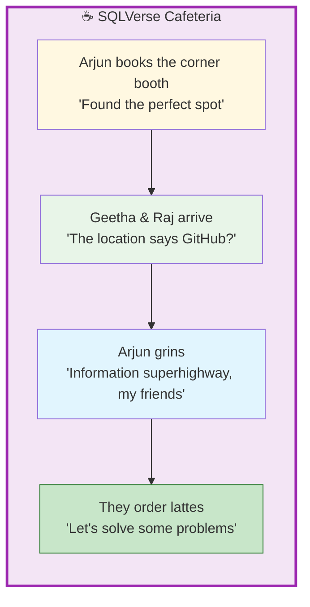
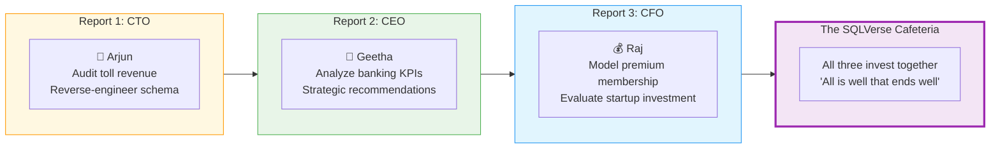

# 🗄️🤖 SQL & GenAI Course
**🎯 Quality Education for Anyone, Anywhere, Anytime — 💫 with Comfort, Convenience at no Cost**

## ☕ 0-CAPSTONE-STORY: The SQLVerse Cafeteria

Welcome to the **SQLVerse Cafeteria** – a cozy corner of the universe **adjacent  to the Artisan's garden**, where data leaders gather, ideas cross-pollinate, and careers are forged over endless cups of coffee.

This is the story of three friends **Arjun, Geetha and Raj** -  who met in Class 10, built their careers in the C-suite, and never stopped learning from each other. Their journey will take you across four domains, three executive reports, and one unforgettable investment decision.

**You are about to walk in their shoes.**

---

## 🌌 Setting the Scene: The SQLVerse Cafeteria

Arjun rings up Geetha and Raj to say that he has spotted a futuristic dining spot named **SQLVerse Cafeteria** – a place that offers a serene and relaxed atmosphere.

Set between green lawns, it offers a breathtaking view of the lush **Artisan's garden**, enhanced by gentle breeze and soothing music aligned with **Artisan's Rhythm**. It offers an elegant and comfortable ambience, perfect for unwinding with a latte and great conversations. It has become a favoured choice for business lunches.

Arjun has booked a corner booth for their meeting.

Geetha and Raj ask for the location. He sends it to them. The location reads:

| | |
|---|---|
| **📍 Name** | **SQLVerse Cafeteria** – Themed Restaurant |
| **🔍 Source** | Searched on – **GitHub** |
| **🌐 USP** | Away from the city noise but provides convenient connectivity through the **Information superhighway** |
| **🏛️ Conceptual Design** | Functional and sustainable design by **SQLVerse Architects** with immersive guest experiences |
| **🎨 Interior Design** | Effective design balancing aesthetic appeal and functionality by **SQLVerse Artisans** |

The **SQLVerse Cafeteria** is a state of mind. It’s the weekly (sometimes monthly) meeting (in a barista or video call if there is time constraint) where three old friends check in, complain about work, pull each other's leg, exchange notes about family, celebrate wins, and accidentally build million-dollar ideas.

**They don't know it yet, but their next meeting will change everything.**

---

## 👥 The Protagonists

### 🔧 Arjun – The CTO (Intelligent Transportation Planet)

| Aspect | Detail |
|--------|--------|
| **Role** | Chief Technology Officer of a tolling authority |
| **Domain** | Intelligent Transportation Systems |
| **Personality** | Technical, analytical, loves building systems |
| **Current Challenge** | Revenue leaks across 4 streams – tolls, cafeteria, convenience store, repair services, fuel station |
| **Secret Superpower** | Can reverse-engineer any system from its outputs |

**Arjun's Voice:** *"I know the data is there. I just don't know where. Give me the reports – I'll find the schema."*

---

### 👔 Geetha – The CEO (Banking Planet)

| Aspect | Detail |
|--------|--------|
| **Role** | Chief Executive Officer of a regional bank |
| **Domain** | Banking Planet |
| **Personality** | Strategic, data-driven, loves spotting trends |
| **Current Challenge** | Deposit growth is slowing; loan portfolio needs optimization |
| **Secret Superpower** | Translates complex data into decisions that move markets |

**Geetha's Voice:** *"I don't need more reports. I need one report that tells me what to do."*

---

### 💰 Raj – The CFO (Library Planet)

| Aspect | Detail |
|--------|--------|
| **Role** | Chief Financial Officer of a library network |
| **Domain** | Library Planet |
| **Personality** | Financial, risk-aware, loves modeling scenarios |
| **Current Challenge** | Premium membership isn't growing; book demand is unpredictable |
| **Secret Superpower** | Sees investment opportunities where others see spreadsheets |

**Raj's Voice:** *"Show me the numbers. Show me the risk. Show me the upside. Then I'll decide."*

---

## ☕ The Bi-Monthly Meetings

For 25 years – from Class 10 geometry to C‑suite boardrooms – they've kept a promise: meet every 2 months, no excuses.

| Decade | What They Discussed |
|--------|---------------------|
| **School** | Homework, exams, who would become what |
| **College** | Internships, first jobs, late-night coding |
| **Early Career** | Promotions, failures, learning to lead |
| **C-Suite** | Strategy, people, and the loneliness of decision-making |

**But now, something has changed.** They don't just complain anymore. They **solve**.

**The Conversation**

- **Geetha** gives Arjun *"2‑cent advice"* on profitability metrics – banking KPIs applied to toll gates.
- **Raj** listens to both and offers suggestions to Arjun for profitability:
  - *"Give discounts at the convenience store if they shop for $250 or more."*
  - *"Waive the parking fee in the cafeteria if they have lunch."*
- **Raj** then narrates a startup opportunity he came across in **Tourism Planet**.
- **Arjun** asks for details.
- **Raj** assures he will provide a complete picture along with his insights in the next meeting.
- **Geetha and Arjun** express interest in investing – *"We're in if you're confident, Raj."*

**This is where you come in.**

---

## 🗺️ The Narrative Arc – Your Journey

You will complete **three reports** – one for each friend. Each report stands alone. Together, they tell a story.

| Report | Character | Domain | Core Skill |
|--------|-----------|--------|------------|
| **CTO Report** | Arjun | Intelligent Transportation | Reverse engineering |
| **CEO Report** | Geetha | Banking Planet | Strategic analysis |
| **CFO Report** | Raj | Library + Tourism Planet | Financial modeling + investment |

---

## 💎 The Closing Quote

> *“Three friends. Four domains. One SQLVerse. You didn't just write queries – you made business decisions that changed lives. Your portfolio now shines with three platinum-grade reports.”*

> *“The SQLVerse expands. Go build and conquer the world.”*

---
## 🚀 Where to Begin

**Start with the CTO Report.** Arjun's technical audit lays the foundation. Geetha's strategic advice builds on it. Raj's investment decision closes the loop.

➡️ **[Begin Your Capstone Journey with the CTO Report →](./1-MODULE4-CTO-REPORT.md)**

---

*Part of our mission for 🎯 Quality Education for Anyone, Anywhere, Anytime — 💫 with Comfort, Convenience at no Cost.*

**Level 1 | Module 4 | Capstone Narrative | Next: [CTO Report](./1-MODULE4-CTO-REPORT.md)**