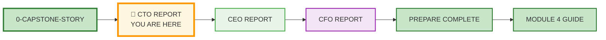
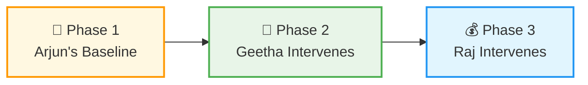
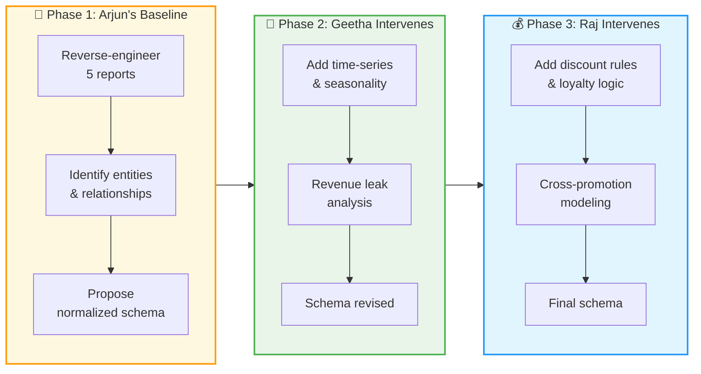

# 🗄️🤖 SQL & GenAI Course
**🎯 Quality Education for Anyone, Anywhere, Anytime — 💫 with Comfort, Convenience at no Cost**

---

## 🔧 1-MODULE4-CTO-REPORT: Intelligent Transportation Planet

> *This report is part of a trilogy. For the full story of Arjun, Geetha, Raj, and the SQLVerse Cafeteria, read [0-CAPSTONE-STORY.md](./0-CAPSTONE-STORY.md) first.*

---

## 🌌 SQLVerse Check-In

<div style="border-left: 4px solid #9c27b0; background-color: #f3e5f5; padding: 15px; margin: 20px 0; border-radius: 0 8px 8px 0;">

**You are now on Intelligent Transportation Planet.** The laws of joins and normalization are universal. Whether you're tracking license plates across toll gates or analyzing revenue streams, the logic is the same – follow the foreign keys.

### 🔍 SQLVerse Artisan's Objective

In this report, you will reverse-engineer five legacy systems into a normalized schema. You will think like a CTO, then a CEO, then a CFO. By the end, you'll have a portfolio piece that proves you can architect data for the C-suite.

**The difference between a coder and an Artisan is discipline.**

</div>

---

## 📍 Your Current Stage – Capstone Journey




---

## 🎬 Scene: Arjun's Challenge - The Toll Plaza Puzzle

### ☕ **SQLVerse Cafeteria**

Arjun, CTO of a tolling authority, has a problem. His systems work – toll gates log transactions, cafes ring up orders, repair bays service vehicles, convenience stores sell snacks, and fuel stations pump gas. But they don't **talk** to each other.

**Five legacy systems. One messy data landscape. No single source of truth.**

Arjun is buried in back-to-back meetings. He's hired **you** – an SQLVerse Architect – to make sense of the mess.

Arjun leans back in the corner booth, the steam from his latte rising to meet the gentle breeze from the Artisan’s Garden. He slides a thick, slightly disorganized folder across the polished table toward you. 

*"Here it is,"* Arjun says, his voice dropping to a conspiratorial whisper. *"The 'Great Toll Plaza Puzzle.' We have thousands of vehicles passing through every hour. We sell fuel, we fix tires, we serve lattes, and we collect tolls. But each service uses a different legacy 'black box' system. I have the outputs, but I don't have a unified database. If I can't connect these stories, I can't stop the revenue leaks Geetha is worried about."*

He taps the folder. *"I need you to look at these five reports. Don't just look at the numbers—look at the **structure**. Tell me how these tables should be built so we can join them into one master dashboard."*

He hands you the five reports and says: *"Build me a schema. Make it clean. Make it work."*

**That's all he tells you. For now.**

*What he doesn't say is that his old friends – a banker and a CFO – will be reviewing your work. And they have opinions.*

**Let the revisions begin.**

---

## 🔧 The Toolkit – What You'll Work With


### The Five Legacy Reports (Reverse Engineering Inputs)

Arjun has pulled together **five disparate outputs** from his legacy systems. Your first task is to reverse-engineer these reports into a **normalized schema**.

---

### 📊 **The Audit Artifacts (Legacy System Outputs)**

#### Report 1: The Toll Gate Log (System: GateKeeper v2.1)

| Transaction_ID | Gate_Num | Timestamp | lane_id | license_plate | Vehicle_Class | fee_collected |
|----------------|----------|-----------|---------|---------------|---------------|---------------|
| 10001 | G1 | 2025-03-15 08:23:15 | A1 | KA-01-AB-1234 | Passenger | 120.00 |
| 10002 | G2 | 2025-03-15 08:45:22 | A2 | KA-02-CD-5678 | Heavy truck | 240.00 |
| 10003 | G1 | 2025-03-15 09:12:07 | A1 | KA-01-EF-9012 | Passenger | 120.00 |

---

#### Report 2: Café POS Receipt Summary (System: BeanCounter POS)

| Receipt_ID | Timestamp | license_plate | item_name | category | amount |
|------------|-----------|---------------|-----------|----------|--------|
| 1001 | 2025-03-15 09:30:00 | KA-01-AB-1234 | Latte | Beverage | 180.00 |
| 1001 | 2025-03-15 09:30:00 | KA-01-AB-1234 | Sandwich | Food | 250.00 |
| 1002 | 2025-03-15 12:15:00 | KA-03-GH-3456 | Lunch Combo | Food | 450.00 |

---

#### Report 3: Convenience Store Z-Report (Daily Close) (System: RetailSync)

| sku | item_description | quantity_sold | unit_price | total_revenue |
|-----|------------------|---------------|------------|----------------|
| SKU-101 | Energy Drink | 45 | 120.00 | 5400.00 |
| SKU-102 | Chips | 78 | 50.00 | 3900.00 |
| SKU-103 | Phone Charger | 12 | 800.00 | 9600.00 |

---

#### Report 4: Repair Bay Service Ticket (System: GreaseMonkey v4)

| service_ticket_id | timestamp | license_plate | service_type | labor_cost | parts_cost | status |
|-------------------|-----------|---------------|--------------|------------|------------|---------|
| 5001 | 2025-03-15 10:00:00 | KA-01-AB-1234 | Oil Change | 500.00 | 1200.00 | Completed |
| 5002 | 2025-03-15 14:30:00 | KA-02-CD-5678 | Tire Repair | 400.00 | 800.00 | In-Progress |
| 5003 | 2025-03-16 11:00:00 | KA-04-IJ-7890 | Brake Pad | 800.00 | 2500.00 | Completed |

---

#### Report 5: Fuel Station Meter Data (System: HydroFlow)

| Pump_ID | Fuel_Type | Liters_Dispensed | Price_Per_Liter | Total_Value | Timestamp |
|---------|-----------|------------------|-----------------|-------------|-----------|
| P1 | Petrol | 35 | 100.00 | 3500.00 | 2025-03-15 08:30:00 |
| P2 | Diesel | 40 | 90.00 | 3600.00 | 2025-03-15 13:00:00 |
| P1 | Petrol | 30 | 100.00 | 3000.00 | 2025-03-16 09:00:00 |


---
### 📋 Legacy Systems Summary

| Report | System Name |
|--------|-------------|
| Toll Gate Log | GateKeeper v2.1 |
| Café POS Receipt Summary | BeanCounter POS |
| Convenience Store Z-Report | RetailSync |
| Repair Bay Service Ticket | GreaseMonkey v4 |
| Fuel Station Meter Data | HydroFlow |

---

## 🎯 The Mission – Phases That Unfold Naturally



---



---

## Sub-Step Details

| Phase | Sub-steps |
|-------|-----------|
| **Phase 1: Arjun's Baseline** | 1. Reverse-engineer 5 reports → 2. Identify entities & relationships → 3. Propose normalized schema |
| **Phase 2: Geetha Intervenes** | 1. Add time-series & seasonality → 2. Revenue leak analysis → 3. Schema revised |
| **Phase 3: Raj Intervenes** | 1. Add discount rules & loyalty logic → 2. Cross-promotion modeling → 3. Final schema |

---


### Phase 1: Arjun's Baseline (CTO Lens)

Arjun needs a **single source of truth**. His instructions:

> *"I don't care about fancy analytics yet. Just give me a schema that captures everything from these five reports. Make sure I can track a license plate across tolls, café, repairs, and fuel. The store doesn't have plates – that's fine. Just make it clean."*

**Your Tasks:**

| Task | Description |
|------|-------------|
| **1.1** | Identify all entities (tables) from the five reports |
| **1.2** | Define attributes (columns) for each table |
| **1.3** | Determine primary keys and foreign keys |
| **1.4** | Draw an ER diagram (mermaid or text) |
| **1.5** | Write `CREATE TABLE` statements for your proposed schema |

**💡 Artisan's Hint:** License plate is the **golden key** – it connects tolls, café, repairs, and fuel. The convenience store stands alone (no plate), but can be linked via timestamp for daily aggregation.

---

### Phase 2: Geetha Intervenes (CEO Lens)

You present your schema to Arjun. He nods. *"Good start."*

Just then, Geetha (the banker) walks in. She glances at your work.

> *"Technically sound. But where are the revenue leaks? I need to see seasonality – compare Q1 vs Q2. I need to know if toll prices are optimized. Add time-series dimensions. Let me slice by week, month, quarter."*

**Your Tasks:**

| Task | Description |
|------|-------------|
| **2.1** | Add a `date` dimension table (or time-series columns) to existing tables |
| **2.2** | Write a query to find **total revenue by month** across all streams |
| **2.3** | Write a query to find **top 10 license plates by total spend** (all domains combined) |
| **2.4** | Write a query to identify **vehicles that paid toll but never visited fuel station** (cross-sell opportunity) |

**💡 Artisan's Hint:** Geetha is thinking like a banker – "wallet share." How much of a driver's total "road spend" are we capturing?

---

### Phase 3: Raj Intervenes (CFO Lens)

You revise the schema. Geetha approves. Arjun is about to sign off when Raj (the CFO) walks in.

He scans your work and says:

> *"Good. Now let's make money. I want discounts at the convenience store if they spend ₹250 or more. I want to waive the parking fee in the cafeteria if they have lunch. Add loyalty logic."*

**Your Tasks:**

| Task | Description |
|------|-------------|
| **3.1** | Add a `discount_rules` table to capture Raj's logic |
| **3.2** | Add a `promotions` table to track active offers |
| **3.3** | Write a query to calculate **potential revenue uplift** if 10% of toll payers visit the convenience store |
| **3.4** | Write a query to identify **frequent visitors** (more than 3 transactions per week) for loyalty program |

**💡 Artisan's Hint:** Raj is thinking about **incremental revenue**. The data is there – now you need to model the "what if."

---

## 🎯 Your Artisan Tasks

---

### Task 1: The Structural Blueprint (DDL Design)

Based on the reports above, design a **Normalized Schema**.

- Identify at least **4 core tables**.
- Define the **Primary Key (PK)** for each table.
- Define the **Foreign Keys (FK)** required to link these tables (e.g., How do we know which car in the Toll Log also got an Oil Change?).

**Save as:** `cto_schema.sql`

---

### Task 2: The "Revenue Leak" Query

Arjun suspects that many people are getting their cars repaired but skipping the Toll Gate (using a maintenance bypass).

Write a query using a **LEFT JOIN** to find all `License_Plate` numbers that appear in the **Repair Bay** system but **not** in the **Toll Gate** system for the same day.

> 💡 **Hint:** `WHERE toll.transaction_id IS NULL`

**Save as:** `cto_revenue_leak.sql`

---

### Task 3: The "Cross-Domain" Summary

Raj (the CFO) wants to see the total "Wallet Share" per vehicle.

Write a query that joins the **Toll Log** and the **Repair Bay** table to show a list of `License_Plate` numbers and their **Total Spend** (Toll Fee + Labor + Parts).

> 💡 **Hint:** Use `SUM(fee_collected + labor_cost + parts_cost)`

**Save as:** `cto_wallet_share.sql`

---

### 💡 Artisan's Tip

*"Notice how the Convenience store report doesn't have a License_Plate? That's a 'Data Gap.' Think about how an Architect might solve that in the future (perhaps a Loyalty Card linked to a plate?). For now, focus on connecting what you can."*

---

### 📝 Reflection Question

In 2 sentences, explain why the `License_Plate` is the most **"dangerous"** and **"powerful"** column in this entire system.

*Write your answer in your deliverable document.*

---

## 🏆 The Final Reveal

You started with five messy reports. You built a schema. Geetha audited it – you added time-series analytics. Raj reviewed it – you added discount rules and loyalty logic.

**By the end, you didn't just build a database. You built a database that passed the scrutiny of a CTO, a CEO, and a CFO.**

Arjun grins. *"I knew I hired the right Architect."*

Geetha nods. *"Clean. Strategic. Bank-ready."*

Raj checks his watch. *"Good work. Now... about that Tourism startup..."*

---

## 📝 The Deliverable

Create a **Technical Architecture Document** in your Vault at:

```
Projects/Level-1-beginner/Module4/Capstone-Reports/CTO-REPORT/
```

### Required Sections

| Section | Content |
|---------|---------|
| **1. Inferred Schema** | `CREATE TABLE` statements for all tables (Phase 1) |
| **2. ER Diagram** | Mermaid diagram showing relationships |
| **3. Revised Schema** | Changes made after Geetha's audit (Phase 2) |
| **4. Final Schema** | Changes made after Raj's optimization (Phase 3) |
| **5. Key Queries** | SQL for all tasks (2.2, 2.3, 2.4, 3.3, 3.4) |
| **6. Reflection** | What was challenging? What would you do differently? |

### File Naming

- `cto_technical_architecture.md` – Main report
- `cto_schema.sql` – Final `CREATE TABLE` statements
- `cto_queries.sql` – All key queries

---

## 💎 DESIGNER'S PERIGON

### *The Art of Reverse Engineering*

You didn't start with a clean schema. You started with **messy reports** – receipts, logs, meter readings, service tickets. You looked at the outputs and methodically arrived at the inputs. You took the fragmented pools of data sources and integrated everything into a single data stream.

That is reverse engineering. That is what senior architects do when they inherit legacy systems.

> *“Every report hides a schema. The Artisan sees the blueprint behind the finished product.”*

More than schema design, you have learned about how to approach and solve a problem – which is the biggest takeaway of this mission – summed up as follows:

1. **Define the root cause.**
2. **Focus on the reasons for solving the problem.**
3. **Base decisions on fact and data rather than assumptions and arrive at a working solution.**
4. **Brainstorm with different stakeholders and generate a wide range of potential solutions without immediately evaluating them.**
5. **Implement solutions on a small scale first to observe, adjust, and avoid creating new issues.**
6. **Add enhancements.**

---

### 🏛️ Architect's Clairvoyance

*We noticed that the Convenience store report doesn't have a License_Plate. That's a 'Data Gap.'* As an architect, you can solve it by adding a Loyalty Card linked to a plate in the future. It is not of immediate concern.

The question you must ask:

- *In the future, if I have to add this feature, will the current design support it?*
- *Is my design based on the **Open-Closed Principle**?*

The **open-closed principle** states that software entities should be **open for extension, but closed for modification**.

What does this mean? Your primary keys, foreign keys, and their relationships are the **eternal truth** – closed for modification. Adding new tables to support new features to close the data gap is **open for extension**.


**You took a bunch of scattered and mixed flowers and crafted a balanced, harmonious bouquet capturing the vision of 3 C-suite executives.**

---

### 🌍 Real‑World Application

| Skill | How You Used It |
|-------|-----------------|
| **Reverse engineering** | Inferred tables from 5 disparate reports |
| **Cross-domain thinking** | Applied banking KPIs (Geetha) to transportation data |
| **Financial modeling** | Added loyalty rules and discount logic (Raj) |
| **Iterative design** | Schema evolved through three lenses |

#### The Artisan's Advantage

When an interviewer asks, *"Have you ever worked with messy legacy data?"* – **you** will say:

> *"Yes. I was given five different reports from five different systems – toll gates, café, repair bay, fuel station, convenience store. No single source of truth. I reverse-engineered the schema, normalized it, and then added time-series analytics for seasonality. Then I modeled discount rules and cross-promotion logic. The final schema satisfied the CTO, the CEO, and the CFO."*

**That answer gets you hired.**

---

**The SQLVerse expands. Go build and conquer the world.** 🚀

---

## 🧭 Capstone Navigation

You've completed the **CTO Report**. Now it's time to step into Geetha's shoes.


| Previous Step | Next Step |
|:---:|:---:|
| [← Back to SQLVerse Cafeteria](./0-CAPSTONE-STORY.md) | [Continue to CEO Report →](./2-MODULE4-CEO-REPORT.md) |

---

*Part of our mission for 🎯 Quality Education for Anyone, Anywhere, Anytime — 💫 with Comfort, Convenience at no Cost.*

**Level 1 | Module 4 | CTO Report | Next: [CEO Report](./2-MODULE4-CEO-REPORT.md)**