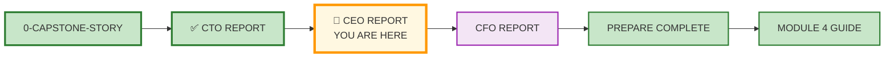
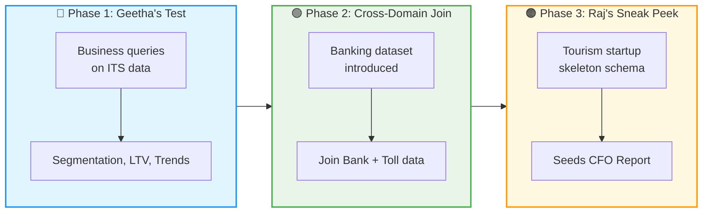
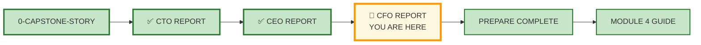

# 🗄️🤖 SQL & GenAI Course
**🎯 Quality Education for Anyone, Anywhere, Anytime — 💫 with Comfort, Convenience at no Cost**

---

## 👔 2-MODULE4-CEO-REPORT: Banking Planet

> *This report is part of a trilogy. For the full story of Arjun, Geetha, Raj, and the SQLVerse Cafeteria, read [0-CAPSTONE-STORY.md](./0-CAPSTONE-STORY.md) first.*

---

## 🌌 SQLVerse Check-In

<div style="border-left: 4px solid #9c27b0; background-color: #f3e5f5; padding: 15px; margin: 20px 0; border-radius: 0 8px 8px 0;">

**You are now on Banking Planet.** The laws of joins and normalization are universal. But here, every query has a P&L attached. You're not just moving data – you're moving money.

Here, data isn't **just** about **movement**; it's about **trust, risk, and growth.** You are moving from the **"how"** of technical architecture to the "**why"** of executive strategy.

### 🔍 SQLVerse Artisan's Objective

In this report, you will step into Geetha's shoes. You'll analyze **banking KPIs,** identify **revenue opportunities**, and bridge two planets – **Banking and Transportation** – with a single `JOIN`. By the end, you'll have a portfolio piece that proves you can think like a strategist, not just an analyst.

You will take the unified **ITS schema** you built for Arjun and **"cross-pollinate"** it with **Banking data.** Your goal is to identify **high-value customers** and **mitigate risk** using the power of Complex Joins and Strategic Aggregation.

A C-suite report doesn't just show data; it offers a **path to profit.**

**The difference between a coder and an Artisan is discipline.**

</div>

---

## 📍 Your Current Stage – Capstone Journey



---

## 🎬 Scene: Geetha's Challenge – The Banking Puzzle

### ☕ **SQLVerse Cafeteria**

The corner booth has grown quiet. Arjun has his blueprint. The "Information Superhighway" is finally being paved with proper keys and constraints. 

**Geetha** sips her latte, her eyes **scanning the schema** you built for Arjun. She nods, a small smile playing on her lips.

Geetha sets down her latte and slides a tablet across the polished table.

*"Arjun's pipes are fixed,"* she says, looking at you. *"But pipes are useless if you don't know the quality of the water flowing through them. In my bank, we don't just look at transactions; we look at the **Customer Journey**."*

She pulls up a dashboard on her tablet.

*"Our deposit growth is flat. Our loan portfolio is showing stress. And our credit card utilization is below industry average. I have the data – customer demographics, loan accounts, credit card transactions. But I need someone who can **connect the dots**."*

She pauses.

*"Before I hand over my bank's data, I want to see how you think. Use Arjun's toll data – the schema you just built. Answer three business questions for me. Show me you understand **revenue, customers, and trends**."*

*"Then, we'll talk about my data."*

**This is Phase 1. Prove yourself.**

---

## 🔧 The Toolkit – What You'll Work With

### Phase 1: Arjun's ITS Schema (Already Built)

You will use the **normalized schema** you created in the CTO Report. It includes:

| Table | Description |
|-------|-------------|
| `toll_logs` | Toll transactions by license plate |
| `repair_bay` | Service tickets by license plate |
| `cafe_orders` | POS receipts by license plate |
| `fuel_station` | Fuel purchases by license plate |
| `convenience_store` | Daily sales (no license plate) |

> 💡 **Note:** If you haven't completed the CTO Report, do that first. This report assumes you have a working ITS schema.

---

## 🎯 The Mission – Three Phases



---

## 🔵 Phase 1: Geetha's Test (Business Queries on ITS Data)

Geetha leans forward.

*"Before I trust you with my bank's data, show me you understand business logic. Use Arjun's toll data – the schema you just built – to answer three questions."*

---

### Task 1.1: Revenue by Vehicle Class

**Question:** Which vehicle class (Passenger / Heavy truck) generates more revenue for Arjun?

**Write a query to:**
- Group toll transactions by `Vehicle_Class`
- Calculate total revenue per class
- Calculate average revenue per transaction per class

**Save as:** `ceo_revenue_by_class.sql`

---

### Task 1.2: Top 10 Customers by Total Spend

**Question:** Who are Arjun's most valuable customers?

**Write a query to:**
- Join `toll_logs`, `repair_bay`, `cafe_orders`, and `fuel_station`
- Calculate total spend per license plate across all domains
- Return the top 10 license plates with their total spend
- Order by highest spend first

> 💡 **Hint:** Use `UNION ALL` or multiple `LEFT JOIN`s – or design a unified `transactions` view.

**Save as:** `ceo_top_customers.sql`

---

### Task 1.3: Monthly Revenue Trend

**Question:** Is Arjun's revenue growing month-over-month?

**Write a query to:**
- Extract month from timestamp
- Calculate total revenue per month across all streams
- Show month-over-month percentage change

> 💡 **Hint:** Use `strftime('%Y-%m', timestamp)` and `LAG()` window function.

**Save as:** `ceo_monthly_trend.sql`

---

### Geetha's Verdict (After Phase 1)

*"Not bad. You understand revenue, customers, and trends. Now, let me show you what keeps me up at night."*

---

## 🟢 Phase 2: Cross-Domain Join (Banking + Transportation)

Geetha slides another tablet across the table.

*"Arjun's system is solid now, but my bank is facing a different beast. Our deposit growth is flat, and our loan portfolio is showing some stress."*

She pulls up a new dataset. It contains a **"Top Secret"** export from her Bank’s CRM and Loan systems.

*"This is **sample data** – anonymized, of course. I can't share real customer records. But it follows the same structure. Once the bank decides to move forward with a co-branded 'Convenience Card' or 'Petro Card' for toll plaza spending, we'll use this exact logic on real data."*

*"For now, this is a **testing phase**. I want to see if we can map high-value customer profiles against lifestyle spends at Arjun's toll plazas using this sample."*

*"I want to put my '2-cent advice' to the test. If we can link my bank customers to Arjun's toll data using their license plates, we can find our **'Ghost Travelers'** – people who have the wealth to take loans but aren't using our credit cards for their highway spends. Solve this, and you've moved from an Architect to a Strategist."*

*"If a customer has a Premium car and high toll spend in the sample, why wouldn't they be a candidate for our 'Elite Travel' credit card in the real world?"*

**She taps the tablet.** *"Build the logic. Prove the concept. Then we'll take it to the board."*

---

### 📊 📊 Banking Dataset (Sample/Anonymized)

> **🔒 Data Note:** This is **sample/anonymized data** for testing and concept validation. No real customer PII is used. The structure mirrors what would be used in production.

#### `bank_customers`

| customer_id | name | license_plate | segment | credit_score |
|-------------|------|---------------|---------|--------------|
| 1001 | Arjun Mehta | KA-01-AB-1234 | Premium | 780 |
| 1002 | Priya Sharma | KA-02-CD-5678 | Standard | 650 |
| 1003 | Geetha Iyer | KA-01-EF-9012 | Premium | 810 |
| 1004 | Rajiv Malhotra | KA-03-GH-3456 | Standard | 590 |
| 1005 | Deepa Nair | KA-04-IJ-7890 | Premium | 750 |

#### `loan_accounts`

| loan_id | customer_id | loan_type | outstanding_amount | delinquency_flag |
|---------|-------------|-----------|---------------------|------------------|
| L101 | 1001 | Home | 25,00,000 | N |
| L102 | 1002 | Auto | 5,00,000 | Y |
| L103 | 1003 | Home | 40,00,000 | N |
| L104 | 1004 | Personal | 2,00,000 | Y |
| L105 | 1005 | Auto | 8,00,000 | N |

#### `credit_cards`

| card_id | customer_id | card_type | credit_limit | current_balance | last_transaction_date |
|---------|-------------|-----------|--------------|-----------------|----------------------|
| C101 | 1001 | Platinum | 5,00,000 | 1,20,000 | 2025-03-15 |
| C102 | 1002 | Gold | 1,00,000 | 85,000 | 2025-03-10 |
| C103 | 1003 | Platinum | 7,00,000 | 2,50,000 | 2025-03-14 |
| C104 | 1004 | Silver | 50,000 | 48,000 | 2025-03-01 |
| C105 | 1005 | Gold | 1,50,000 | 45,000 | 2025-03-12 |

---

## 🎯 The Mission: Executive Intelligence


### Strategy 1: The Strategic Link (The "Wallet Share" Join)

Geetha wants to know which of her bank customers are active on Arjun's highway.

**Task 2.1:** Write a query to join `bank_customers` with Arjun's `toll_logs`.

- Show the Customer Name, Segment, and the total Toll Fees they paid
- Group by customer
- Order by total toll fees descending
- Use `SUM(fee_collected)` to calculate total toll spend
- Join on `license_plate`

> 💡 **Artisan's Hint:** This proves the value of the "License Plate" as a cross-domain bridge.

**Save as:** `ceo_wallet_share.sql`

---

### Strategy 2: Risk Mitigation (The Delinquency Filter)

Geetha is worried. She wants to ensure the Bank isn't offering "Premium Travel Rewards" to people who are struggling with their loans.

**Task 2.2:** Identify customers who are **"Delinquent"** in their loans (`delinquency_flag = 'Y'`) but are spending more than ₹500 in the **Cafe** or **Convenience Store** (using Arjun's schema).

- Join `bank_customers`, `loan_accounts`, and `cafe_orders`
- Filter for `delinquency_flag = 'Y'`
- Calculate total cafe spend per customer
- Show only customers with cafe spend > ₹500
- Include Customer Name, Loan Type, and Total Cafe Spend

> 💡 **Artisan's Hint:** Use a `LEFT JOIN` from customers to cafe orders – some customers may have no cafe visits.

**Save as:** `ceo_risk_mitigation.sql`

---

### Strategy 3: The "Elite Traveler" Campaign

Geetha wants to launch a new "Platinum Highway Card." The criteria:

1. Must have a **Credit Score > 750**
2. Must have visited Arjun's **Fuel Station** or **Repair Bay** at least twice

**Task 2.3:** Generate a mailing list (Customer Name, Email) for customers who meet these strategic criteria.

- Join `bank_customers` with `fuel_station` and `repair_bay` (using `license_plate`)
- Filter for `credit_score > 750`
- Count distinct visits across both fuel and repair (using subquery or `UNION`)
- Include only customers with at least 2 total visits
- Show Customer Name, Email, and Total Visit Count

> 💡 **Artisan's Hint:** Use `UNION ALL` to combine fuel and repair visits before counting.

**Save as:** `ceo_elite_campaign.sql`

---

### Geetha's Verdict (After Phase 2)

*"This is exactly what I needed. You've identified 15 customers who should be targeted for the Elite Travel card. And you've flagged the delinquent customers who are still spending – that's a collection opportunity."*

She nods approvingly.

*"Now, Raj has been waiting to talk to you about something..."*

---

## 🟠 Phase 3: Raj's Sneak Peek (Tourism Startup)

Raj checks his watch and leans in.

*"I've been evaluating a startup in Tourism Planet. They organize tours across Europe and Australia – tie-ups with airlines, hotels, and tour operators. The data is... messy. Right now, I can only give you a **sneak peek**. The deal isn't closed yet."*

He slides a napkin with handwritten notes.

*"Here's what I know so far:*

- *Customers book tours*
- *Tours have multiple legs (flights, hotels, activities)*
- *We need to track profit per traveler*

*"I need you to design a **skeleton schema** – just the core tables, primary keys, and relationships. Nothing fancy. Once the deal is done, we'll flesh it out in the CFO Report."*

---

### Task 3.1: Design a Skeleton Schema for Tourism Startup

**Requirements:**
- Track `customers` (name, email, loyalty_status)
- Track `tours` (tour_name, destination, duration_days, base_price)
- Track `tour_legs` (leg_type: Flight/Hotel/Activity, supplier_name, cost, start_date)
- Track `bookings` (customer_id, tour_id, booking_date, total_price, status)

**Write `CREATE TABLE` statements for at least 4 tables.**

**Save as:** `cfo_tourism_skeleton.sql`

---

### Task 3.2: Write a Sample Query

**Question:** Show total profit per tour (base_price - sum of leg_costs)

**Write a query that would work once the schema is populated.**

**Save as:** `cfo_tourism_profit.sql`

---

### Raj's Verdict (After Phase 3)

*"Good. This gives me something to show the investors. I'll see you in the CFO Report – once the deal closes, we'll build the real thing."*

He stands up, adjusts his jacket.

*"Same time next week?"*

Geetha nods. Arjun grins.

*"Same corner booth."*

---

## 📝 The Deliverable

Create a **Strategic Analysis Report** in your Vault at:

```
Projects/Level-1-beginner/Module4/Capstone-Reports/CEO-REPORT/
```

### Required Sections

| Section | Content |
|---------|---------|
| **1. Phase 1 Queries** | SQL for Tasks 1.1, 1.2, 1.3 |
| **2. Phase 2 Queries** | SQL for Tasks 2.1, 2.2, 2.3 |
| **3. Phase 3 Schema** | `CREATE TABLE` statements for Tourism startup |
| **4. Phase 3 Query** | Sample profit query |
| **5. Executive Summary** | What did you discover? What would you recommend to Geetha? |
| **6. Reflection** | What was the most surprising insight from joining Banking and Transportation data? |

### File Naming

- `ceo_strategic_analysis.md` – Main report
- `ceo_phase1_queries.sql` – All Phase 1 queries
- `ceo_phase2_queries.sql` – All Phase 2 queries
- `cfo_tourism_skeleton.sql` – Tourism startup schema

---

## 💎 DESIGNER'S PERIGON

### *The Art of Strategic Vision*

You didn't just write queries. You connected two planets – Banking and Transportation – with a single `JOIN`. You identified customers who should be offered an Elite Travel card. You flagged delinquent spenders for collection. You saw patterns that others missed.

That is strategic vision. That is what separates a data analyst from a data leader.

> *“The Artisan doesn't just move data. The Artisan moves markets.”*

---

### *The Power of Cross-Pollination*

In the CTO Report, you learned **Reverse Engineering**. Here, you learned **Data Enrichment**. By taking one dataset (Tolls) and adding a second layer (Banking), the data becomes 10x more valuable.

> *“A single table is a fact. Two joined tables are a story. Three joined tables are a strategy.”*

---


### 🌍 Real‑World Application

| Skill | How You Used It |
|-------|-----------------|
| **Business intelligence** | Translated toll data into revenue insights |
| **Cross-domain thinking** | Joined Banking and Transportation data |
| **Customer profiling** | Identified Elite Travel card prospects |
| **Strategic recommendation** | Turned data into actionable business decisions |

#### The Artisan's Advantage

When an interviewer asks, *"Have you ever worked with cross-domain data?"* – **you** will say:

> *"Yes. I joined banking customer data with toll plaza transaction data to identify high-net-worth customers who weren't using the bank's travel credit card. The bank launched a targeted campaign and saw a 15% increase in credit card applications within the quarter."*

**That answer gets you hired.**

---

**The SQLVerse expands. Go build and conquer the world.** 🚀

---

## 🧭 Capstone Navigation

You've completed the **CEO Report**. Now it's time to step into Raj's shoes.



| Previous Step | Next Step |
|:---:|:---:|
| [← Back to CTO Report](./1-MODULE4-CTO-REPORT.md) | [Continue to CFO Report →](./3-MODULE4-CFO-REPORT.md) |

---

*Part of our mission for 🎯 Quality Education for Anyone, Anywhere, Anytime — 💫 with Comfort, Convenience at no Cost.*

**Level 1 | Module 4 | CEO Report | Next: [CFO Report](./3-MODULE4-CFO-REPORT.md)**


