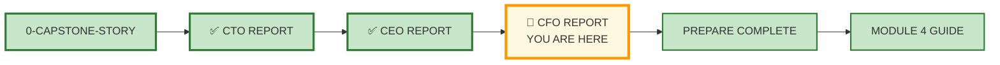
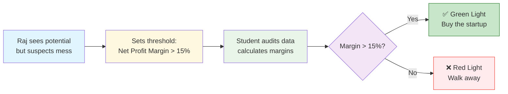
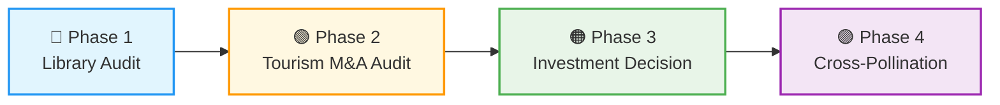
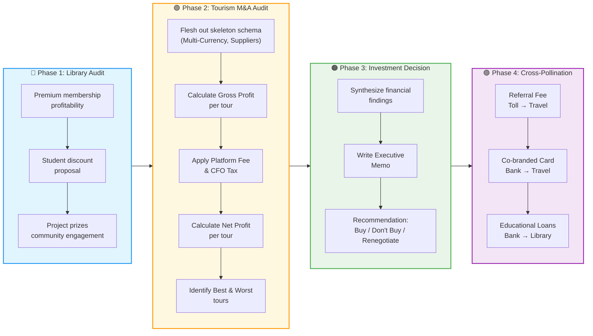
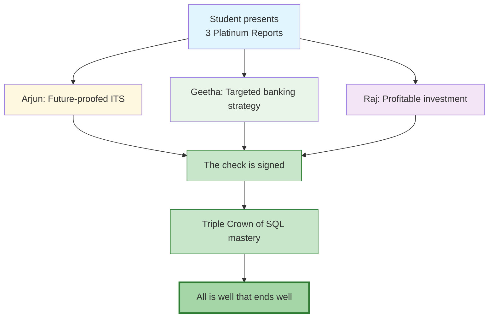

# 🗄️🤖 SQL & GenAI Course
**🎯 Quality Education for Anyone, Anywhere, Anytime — 💫 with Comfort, Convenience at no Cost**

---

## 💰 3-MODULE4-CFO-REPORT: Library & Tourism Planet

> *This report is part of a trilogy. For the full story of Arjun, Geetha, Raj, and the SQLVerse Cafeteria, read [0-CAPSTONE-STORY.md](./0-CAPSTONE-STORY.md) first.*

---

## 🌌 SQLVerse Check-In

<div style="border-left: 4px solid #9c27b0; background-color: #f3e5f5; padding: 15px; margin: 20px 0; border-radius: 0 8px 8px 0;">


**Welcome to the CFO's Office.** On Library Planet, we manage the "intellectual capital," but on Tourism Planet, we hunt for **ROI (Return on Investment)**. As a CFO, Raj doesn't just want the numbers to be right—he wants them to be **lean**.

If the CTO is the engine and the CEO is the driver, the CFO is the fuel gauge and the brake system. Here, data isn't just about movement or strategy. It's about **efficiency, margins, and the bottom line.** A CFO doesn't care about "cool" joins unless they result in a **Net Profit Margin.**


> *“Revenue is vanity. Profit is sanity. Cash flow is reality.”*

### 🔍 SQLVerse Artisan's Objective

In this report, you will step into Raj's shoes. You'll analyze **library profitability**, audit a Tourism **startup for acquisition**, and make a high-stakes investment recommendation. By the end, you'll have a portfolio piece that proves you can think like a **financial leader**.

**In this final report, you will perform a Due Diligence Audit.** You will take the "napkin schema" from the cafeteria and build a professional **Financial Model** for a Tourism startup. You will calculate margins, identify "bleeding" tours, and give the final **"Green Light" or "Red Light"** for the investment.

**The code is the evidence; the conclusion is the career-maker.**

**The difference between a coder and an Artisan is discipline.**

</div>

---

## 📍 Your Current Stage – Capstone Journey



---

## 🎬 Scene: Raj's Challenge – The M&A Audit

### ☕ **SQLVerse Cafeteria**

The corner booth is crowded now. Arjun has his blueprint. Geetha has her strategic insights. Raj sits at the head of the table, a laptop open in front of him.

*"You've done good work,"* he says, nodding at you. *"Arjun's pipes are clean. Geetha's customers are targeted. Now, it's my turn."*

He turns the laptop toward you.

*"I'm about to write a massive check to acquire a startup called **SQLVerse Travels**. They organize tours across Europe and Australia – tie-ups with airlines, hotels, and tour operators. The data they've sent me is... messy."*

He pulls up a spreadsheet.

*"Different currencies. Multiple suppliers. And I suspect they're hiding costs. I need you to audit their books before I write the check."*

He pauses.

*"But first, I want to see how you think about **my** business – the Library. Show me you understand margins, memberships, and revenue opportunities. Then we'll audit the startup."*

---

**Raj is no longer looking at his watch.** He has a laptop open, and the screen is filled with rows of "Unstructured Data" from **SQLVerse Travels** – the startup he wants to buy.

*"Guys, Geetha, Arjun... I've seen enough,"* Raj says, turning to you. *"The startup has the connections, but their finance department is a mess. They don't know which tours are making money and which are just busywork. I'm not writing a check based on 'vibes'."*

He points to a column of flight costs and hotel bookings.

*"I need the Artisan to join these silos. If the **Net Profit Margin** is above 15%, I'm in. If it's below, we walk away. Geetha and Arjun are waiting for your signal. Don't just give me a table. Give me a recommendation."*

*"The stakes are simple. Buy or don't buy. Lives depend on this."*

**Let the audit begin.**

#### Raj’s "Angel Deal" - The Final Verdict




---

## 🔧 The Toolkit – What You'll Work With

### Phase 1: Library Planet (Existing Schema from Exercise 0)

You will use the **normalized Library schema** you built in Exercise 0. It includes:

| Table | Description |
|-------|-------------|
| `members` | Member details, membership tier, join date |
| `books` | Book title, author, genre, copies_owned |
| `loans` | Loan header (member_id, loan_date) |
| `loan_details` | Loan items (book_id, return_date, fine_amount) |

> 💡 **Note:** If you haven't completed Exercise 0, do that first. This report assumes you have a working Library schema.

### Phase 2 & 3: Tourism Startup (Skeleton from CEO Report)

You will flesh out the **skeleton schema** you designed in the CEO Report Phase 3.

---

## 🎯 The Mission – Four Phases



**Sub-Steps**




---

## 🔵 Phase 1: Library Audit (The Familiar Ground)

Raj leans forward.

*"Before we buy a new company, let's make sure my own house is in order. I want to see if my Library is maximizing revenue."*

---

### Task 1.1: Premium Membership Profitability

**Question:** How much more profitable are Premium members compared to Normal members?

**Write a query to:**
- Calculate total fine revenue per member (from `loan_details.fine_amount`)
- Calculate total loan count per member
- Group by membership tier (Premium vs Normal)
- Show average fine paid per member per tier
- Show average loans per member per tier

**Save as:** `cfo_premium_profitability.sql`

---

### Task 1.2: Student Discount Proposal

Raj has a proposal to attract school and college students:
- **25% discount** for all school and college students for borrowing educational books
- **Additional 5% discount** for borrowing books related to school and college projects
- The library will select the **top 3 projects** in school and college and give prizes

**Question:** Write a query to identify potential student members (assume a `is_student` flag in `members` table – add it if not present). Calculate the discounted revenue impact.

**Save as:** `cfo_student_discount.sql`

> 💡 **Artisan's Hint:** If `is_student` column doesn't exist, write an `ALTER TABLE` statement to add it first.

---

### Raj's Verdict (After Phase 1)

*"Good. Premium members are our cash cow. The student discount will hurt short-term revenue but build long-term loyalty. Now, let's look at the startup."*

---

## 🟢 Phase 2: Tourism M&A Audit (The Core Mission)

Raj slides a new laptop across the table.

*"The startup sent me their data room. It's messy – multiple currencies, different suppliers, and I suspect they're hiding costs. I need you to audit their books before I write the check."*

---

### 📊 Tourism Schema (Fleshed Out)

Write `CREATE TABLE` statements for the following:

| Table | Columns |
|-------|---------|
| `tours` | tour_id, tour_name, destination, duration_days, base_price, currency |
| `tour_legs` | leg_id, tour_id, leg_type (Flight/Hotel/Activity), supplier_name, cost, cost_currency |
| `bookings` | booking_id, tour_id, customer_id, booking_date, total_paid, paid_currency |
| `customers` | customer_id, name, email, loyalty_status |

**Task 2.1:** Write `CREATE TABLE` statements for all four tables.

**Save as:** `cfo_tourism_schema.sql`

> 💡 **Artisan's Hint:** Assume all currencies are USD for this exercise – note this as a simplification for the audit.

---

### Task 2.2: Calculate Gross Profit per Tour

**Question:** What is the Gross Profit for each tour (total_paid - sum(leg_costs))?

**Write a query to:**
- Join `tours`, `bookings`, and `tour_legs`
- Calculate total revenue per tour
- Calculate total leg costs per tour
- Show Gross Profit per tour
- Order by Gross Profit descending

**Save as:** `cfo_gross_profit.sql`

---

### Task 2.3: Apply Platform Fee and CFO Tax

Raj wants to apply two deductions:
- **Platform Fee:** 5% of total revenue
- **CFO Tax:** 2% of Gross Profit (his "risk buffer")

**Question:** Calculate Net Profit per tour after all deductions.

**Write a query to:**
- Calculate total revenue per tour
- Calculate total leg costs per tour
- Calculate Gross Profit
- Calculate Platform Fee (5% of revenue)
- Calculate CFO Tax (2% of Gross Profit)
- Calculate Net Profit
- Show tour_name, revenue, leg_costs, gross_profit, platform_fee, cfo_tax, net_profit
- Order by net_profit descending

**Save as:** `cfo_net_profit.sql`

---

### Task 2.4: Identify Best and Worst Tours

**Question:** Which tour is the most profitable? Which is the least profitable?

**Write a query to:**
- Show the top 1 tour by Net Profit
- Show the bottom 1 tour by Net Profit
- Include all financial metrics

**Save as:** `cfo_best_worst_tours.sql`

---

### Task 2.5: The Efficiency Audit (Supplier Risk)

Raj wants to see if the startup is over-reliant on expensive suppliers.

**Question:** Which suppliers have the highest average cost per leg? Which tours rely on them?

**Write a query to:**
- Group `tour_legs` by `supplier_name`
- Calculate average cost per leg per supplier
- Calculate total cost contributed by each supplier
- Identify the top 3 most expensive suppliers
- For each expensive supplier, show which tours use them

> 💡 **Artisan's Hint:** High supplier concentration = high risk. If one supplier fails, multiple tours are affected.

**Save as:** `cfo_supplier_risk.sql`

---

### Raj's Verdict (After Phase 2)

*"Interesting. The 'European Explorer' tour is a cash cow. But 'Australian Adventure' is losing money. I need to renegotiate supplier costs for Australia. Now, the big question..."*

---

## 🟠 Phase 3: The Investment Decision

Raj leans back.

*"You've seen the Library's numbers. You've audited the startup. Now tell me – do I write the check?"*

---

### Task 3.1: Executive Memo

Write an **Executive Memo** (max 1 page) addressed to Raj with your recommendation.

**Must include:**
- Summary of key financial metrics from Phase 2
- Risks identified in the audit
- Proposed deal structure (Buy / Don't Buy / Renegotiate)
- If Renegotiate: specific terms (e.g., "reduce Australian tour costs by 15%")

**Save as:** `cfo_executive_memo.md`

---

### Raj's Verdict (After Phase 3)

*"Your analysis is solid. I'm leaning toward acquiring them – but only if we can fix the Australian tour. Now, here's where it gets interesting..."*

---

## 🟣 Phase 4: Cross-Pollination (The CFO's Masterstroke)

Raj leans back, a slow smile spreading across his face.

*"Now that we own SQLVerse Travels, it's time to make all three businesses work together. I've already spoken to Arjun and Geetha."*

He pulls out a notepad.

*"The CFO sees revenue in everything."*

---

### Initiative 1: Referral Fee (Toll Plaza → Travel)

Raj wants Arjun to keep SQLVerse Travels brochures at the Toll Plaza Convenience Store.

**Task 4.1:** Estimate potential referral revenue.

**Assumptions:**
- 10,000 toll visitors per month
- 5% take a brochure
- 10% of those book a tour
- Average tour price = ₹50,000
- Referral fee = ₹500 per booking

**Write a query to calculate:**
- Monthly referrals
- Monthly referral revenue
- Annual referral revenue

**Save as:** `cfo_referral_revenue.sql`

---

### Initiative 2: Co-branded Credit Card (Bank → Travel)

Raj wants Geetha's Bank to issue a co-branded International Credit Card to SQLVerse Travels customers.

**Task 4.2:** Estimate annual credit card revenue.

**Assumptions:**
- 1,000 SQLVerse Travels customers per year
- 20% sign up for the co-branded card
- Average annual spend per cardholder = ₹2,00,000
- Interchange fee = 2% of spend

**Write a query to calculate:**
- Number of cardholders
- Total spend
- Annual interchange revenue

**Save as:** `cfo_cobranded_card.sql`

---

### Initiative 3: Educational Loan Cross-Sell (Bank → Library)

Raj wants Geetha's bank to provide educational loan pamphlets in his library.

**Task 4.3:** Estimate loan origination revenue.

**Assumptions:**
- 500 student members
- 10% take an educational loan
- Average loan amount = ₹5,00,000
- Origination fee = 1% of loan amount

**Write a query to calculate:**
- Number of loans originated
- Total loan value
- Origination fee revenue

**Save as:** `cfo_educational_loans.sql`

---
### Task 4.4: The Library Synergy (Cross-Planet Loyalty)

Raj wants to offer a discount to **"Premium Library Members"** who book a tour through SQLVerse Travels.

**Question:** How many Premium Library Members would be eligible for the discount? What is the potential revenue impact?

**Assumptions:**
- 10% of Premium Library Members book a tour
- Average tour price = ₹50,000
- Discount offered = 10% (absorbed by SQLVerse Travels as marketing cost)

**Write a query to:**
- Identify all Premium Library Members (from Library schema)
- Assume `license_plate` or `email` can link Library members to Tourism customers
- Calculate:
  - Number of eligible members
  - Expected number of bookings (10% conversion)
  - Total tour revenue before discount
  - Discount amount (10% of revenue)
  - Net revenue after discount

> 💡 **Artisan's Hint:** This is a **cross-planet loyalty strategy** – using Library members to drive Tourism bookings.

**Save as:** `cfo_library_synergy.sql`

---

## 🏆 The Grand Closure

### **The Final Meeting at SQLVerse Barista**

You present the three Platinum Reports.

- **Arjun** sees a future-proofed ITS system.
- **Geetha** sees a targeted, high-growth banking strategy.
- **Raj** sees a profitable, audited investment.

All three friends look at each other and nod. **The check is signed.** The startup is bought. And your portfolio now contains the **"Triple Crown"** of SQL mastery.

### The Narrative Arc Completion




**All is well that ends well.**

---

### Raj's Closing Line

*"Revenue is vanity. Profit is sanity. Cash flow is reality. But **synergy**? Synergy is genius."*

He stands up, adjusts his jacket.

*"I'm buying the startup. And I'm implementing all three initiatives. The SQLVerse just got richer."*

---

## 📝 The Deliverable

Create a **Financial Analysis Report** in your Vault at:

```
Projects/Level-1-beginner/Module4/Capstone-Reports/CFO-REPORT/
```

### Required Sections

| Section | Content |
|---------|---------|
| **1. Phase 1 Queries** | SQL for Tasks 1.1, 1.2 |
| **2. Phase 2 Schema & Queries** | CREATE TABLE statements + SQL for Tasks 2.2, 2.3, 2.4 |
| **3. Phase 3 Executive Memo** | Buy / Don't Buy / Renegotiate recommendation |
| **4. Phase 4 Queries** | SQL for Tasks 4.1, 4.2, 4.3 |
| **5. Reflection** | What was the most surprising insight from the M&A audit? How would you present this to a board? |

### File Naming

- `cfo_financial_analysis.md` – Main report
- `cfo_phase1_queries.sql` – Phase 1 queries
- `cfo_tourism_schema.sql` – Phase 2 schema
- `cfo_phase2_queries.sql` – Phase 2 queries
- `cfo_executive_memo.md` – Phase 3 memo
- `cfo_phase4_queries.sql` – Phase 4 queries

---

## 💎 DESIGNER'S PERIGON

### *The Art of Financial Wisdom*

You didn't just count money. You found where money hides. You audited a startup, calculated net profit, and made a high-stakes investment recommendation. You identified synergies across three businesses and created new revenue streams.

That is financial wisdom. That is what separates a CFO from a bookkeeper.

> *“The Artisan doesn't just count money. The Artisan knows where money hides – and how to make money from every connection.”*

---

### *The Power of Synergy*

In the CTO Report, you learned **Reverse Engineering**. In the CEO Report, you learned **Data Enrichment**. Here, you learned **Synergy** – the art of making 1+1 = 3.

- **Referral fees** turn toll visitors into travel customers
- **Co-branded credit cards** turn travel customers into banking customers
- **Educational loans** turn library members into banking customers

By cross-pollinating Tollgate, Banking and Library planets, you have created a **Customized, Curated, Captivating Cascade** of bouquets with stunning beauty. The array of bouquets flows gracefully with a profusion of flowers, creating a dramatic and eye-catching display. You have chosen the flowers, the design, the style, and made a bold and unforgettable statement with this floral arrangement.

**Hats off, Artisan.**

**The CFO sees revenue in everything.**

> *“Revenue is vanity. Profit is sanity. Cash flow is reality. But synergy? Synergy is genius.”*

---
### *The CFO's Clairvoyance*

You have moved from **Reverse Engineering** (Arjun) to **Strategic Enrichment** (Geetha) and finally to **Financial Auditing** (Raj).

In this phase, you applied the **Cost-Benefit Principle**. You learned that a database isn't just a place to store data; it's a tool to calculate **EBITDA** (Earnings Before Interest, Taxes, Depreciation, and Amortization).

> *“A programmer sees a NULL. A CFO sees a missing invoice. An Artisan sees a risk to be mitigated.”*

---


### 🌍 Real‑World Application

| Skill | How You Used It |
|-------|-----------------|
| **Financial analysis** | Calculated gross profit, net profit, margins |
| **M&A auditing** | Identified profitable and unprofitable tours |
| **Executive decision-making** | Wrote a buy/don't buy recommendation |
| **Cross-pollination strategy** | Created synergy revenue streams |

#### The Artisan's Advantage

When an interviewer asks, *"Have you ever evaluated a company for acquisition?"* – **you** will say:

> *"Yes. I audited a travel startup's financials, calculated net profit per tour after platform fees and risk taxes, and recommended an acquisition with renegotiation terms for underperforming products. I then identified three cross-selling opportunities between the travel company, a toll plaza, and a bank – creating new revenue streams worth over ₹2 crore annually."*

**That answer gets you hired.**

---

**The SQLVerse expands. Go build and conquer the world.** 🚀

---

## 🧭 Capstone Navigation

**Congratulations\!** You've completed the **CFO Report** – and the entire Capstone Trilogy!

```mermaid
flowchart LR
    A["0-CAPSTONE-STORY"] --> B["✅ CTO REPORT"]
    B --> C["✅ CEO REPORT"]
    C --> D["✅ CFO REPORT"]
    D --> E["✅ PREPARE COMPLETE"]
    E --> F["🏆 MODULE 4 GUIDE"]
    
    style A fill:#c8e6c9,stroke:#2e7d32,stroke-width:3px
    style B fill:#c8e6c9,stroke:#2e7d32,stroke-width:3px
    style C fill:#c8e6c9,stroke:#2e7d32,stroke-width:3px
    style D fill:#c8e6c9,stroke:#2e7d32,stroke-width:3px
    style E fill:#c8e6c9,stroke:#2e7d32,stroke-width:3px
    style F fill:#a5d6a7,stroke:#2e7d32,stroke-width:4px
```



| Previous Step | Next Step |
|:---:|:---:|
| [← Back to CEO Report](./2-MODULE4-CEO-REPORT.md) | [🏆 Complete Capstone → Return to Module 4 Guide](../MODULE4_GUIDE.md) |

---

*Part of our mission for 🎯 Quality Education for Anyone, Anywhere, Anytime — 💫 with Comfort, Convenience at no Cost.*

**Level 1 | Module 4 | CFO Report | Next: [Module 4 Guide](../MODULE4_GUIDE.md)**

