# 🗄️🤖 SQL & GenAI Course
**🎯 Quality Education for Anyone, Anywhere, Anytime — 💫 with Comfort, Convenience at no Cost**

## 📘 Module 4: SQL Reference for Practice – Joining Tables

### Your Module 4 Mastery Report

This document is the **distilled essence** of everything you've mastered in the **PREPARE** stage of Module 4. It's your official Data Artisan's reference – a tool you'll return to again and again during practice, whether you're building executive reports or engineering complex join chains.

---
## 🌌 SQLVerse Check-In

**The laws of the SQLVerse are no longer mysteries to you. You have the keys.** You've journeyed across Education Planet, normalized the E‑Store, explored Tourism Planet, and mastered every join type. Now you're ready to connect tables, reveal hierarchies, and engineer precision bridges.

This reference guide is your **field manual** – the collected wisdom of connections, inclusions, reflections, and chains. Keep it close as you venture into the PRACTICE stage and beyond.

**The difference between a coder and an Artisan is discipline.**

---

## 🧭 Your Journey from SQLVerse Architect’s Blueprint → Files 1–6 → Capstone

```mermaid
flowchart LR
    subgraph PREPARE ["PREPARE Stage"]
        direction LR
        BP["🏛️ Blueprint<br/>Normalization"] --> RL["🧪 Refactoring Lab"]
        RL --> F1["📘 File 1<br/>Intro to Joins"]
        F1 --> F2["📘 File 2<br/>INNER JOIN"]
        F2 --> F3["📘 File 3<br/>LEFT JOIN"]
        F3 --> F4["📘 File 4<br/>Multiple Tables"]
        F4 --> F5["📘 File 5<br/>SELF JOIN"]
        F5 --> F6["📘 File 6<br/>Join Conditions"]
    end
    
    PREPARE --> BONUS["✨ Bonus Skills<br/>CREATE, ALTER, DROP, INSERT OR IGNORE, GROUP_CONCAT"]
    BONUS --> REPORTS["🏆 Capstone Reports<br/>CTO → CEO → CFO"]
    REPORTS --> MASTERY["🎓 MODULE 4 MASTERY"]
    
    style BP fill:#f3e5f5
    style RL fill:#fff8e1
    style F1 fill:#e1f5fe
    style F2 fill:#e1f5fe
    style F3 fill:#e1f5fe
    style F4 fill:#e1f5fe
    style F5 fill:#e1f5fe
    style F6 fill:#e1f5fe
    style BONUS fill:#fff8e1
    style REPORTS fill:#c8e6c9
    style MASTERY fill:#a5d6a7,stroke:#2e7d32,stroke-width:3px
```

---

## 🏛️ The Three Gates of Normalization (Quick Reference)

| Gate | Rule | Violation Example | Fix |
|------|------|-------------------|-----|
| **1NF** | Each cell = one value | `"Electronics, Appliances"` in a cell | Split into separate rows or tables |
| **2NF** | No partial dependencies | `instructor_name` depends only on `course_id`, not on `(student_id, course_id)` | Move to `courses` table |
| **3NF** | No transitive dependencies | `city` depends on `zip_code`, not on `customer_id` | Move to `locations` table |

**💡 Artisan's Mantra:** *"The Key, the Whole Key, and Nothing But the Key."*

---

## 📑 Module 4 Quick Reference – Join Types

### INNER JOIN

| Aspect | Detail |
|--------|--------|
| **Syntax** | `FROM table1 JOIN table2 ON table1.key = table2.key` |
| **Use when** | Only matching rows from both tables |
| **Hint** | Think "perfect match" – if no match, row disappears |
| **Alias** | `FROM products p JOIN categories c ON p.category_id = c.category_id` |

---

### LEFT JOIN

| Aspect | Detail |
|--------|--------|
| **Syntax** | `FROM table1 LEFT JOIN table2 ON table1.key = table2.key` |
| **Use when** | All rows from left table, matches from right (NULL if no match) |
| **Hint** | Think "inclusive bridge" – left table always wins |
| **Orphan pattern** | `WHERE right_table.key IS NULL` finds rows with no match |

---

### SELF JOIN

| Aspect | Detail |
|--------|--------|
| **Syntax** | `FROM table t1 JOIN table t2 ON t1.fk = t2.pk` |
| **Use when** | Hierarchy within a single table (employee → manager, tour → sub-tour) |
| **Hint** | **Aliases are MANDATORY** – you're looking in a mirror |
| **Example** | `FROM employees e1 LEFT JOIN employees e2 ON e1.manager_id = e2.employee_id` |

---

### CROSS JOIN (Cartesian Product)

| Aspect | Detail |
|--------|--------|
| **Syntax** | `FROM table1 CROSS JOIN table2` |
| **Warning** | Every row from table1 × every row from table2 |
| **Accidental cause** | Forgetting the `ON` clause in a `JOIN` |
| **Check** | If your query is unexpectedly slow, check for missing `ON` |

---

### Non-Equi Join

| Aspect | Detail |
|--------|--------|
| **Syntax** | `FROM table1 JOIN table2 ON table1.column < table2.column` |
| **Use when** | Range comparisons, not just equality |
| **Operators** | `<`, `>`, `<=`, `>=`, `<>`, `BETWEEN` |
| **Example** | Find products cheaper than others in same category |

---

## 🔑 ON vs WHERE – The Critical Distinction

| Clause | When It Runs | Purpose | LEFT JOIN Effect |
|--------|--------------|---------|------------------|
| **`ON`** | During the join | Defines the relationship | Conditions on right table preserve left rows |
| **`WHERE`** | After the join | Filters the result | Conditions on right table **kill NULLs** |

**💡 Artisan's Insight:**
- Use `ON` to define **how** tables connect
- Use `WHERE` to filter **what** you see
- In `LEFT JOIN`, putting right-table conditions in `WHERE` converts it to `INNER JOIN`

---

## ✨ Bonus Skills Quick Reference

| Skill | Syntax | Use Case |
|-------|--------|----------|
| **CREATE TABLE** | `CREATE TABLE table_name (columns);` | Define new tables |
| **ALTER TABLE** | `ALTER TABLE table_name ADD COLUMN column_name;` | Modify existing tables |
| **DROP TABLE** | `DROP TABLE table_name;` | Remove tables (⚠️ irreversible) |
| **INSERT OR IGNORE** | `INSERT OR IGNORE INTO table VALUES (...);` | Insert without duplicate errors |
| **GROUP_CONCAT** | `GROUP_CONCAT(column, ',')` | Combine multiple rows into comma-separated list |

---

## 🛡️ Guardrail Summary: Common Module 4 Pitfalls

| Rule | Reminder |
|------|----------|
| **Always alias self-joins** | `FROM employees e1 JOIN employees e2` – without aliases, it fails |
| **Don't forget the `ON` clause** | Missing `ON` = accidental Cartesian product |
| **`LEFT JOIN` + `WHERE` on right table** | Converts to `INNER JOIN` – NULLs disappear |
| **Join order matters for `LEFT JOIN`** | The left table is the one that stays intact |
| **Test incrementally** | Build chains one join at a time – verify each step |
| **Know your relationship** | 1:1, 1:N, M:N – each affects your join pattern |

---

## 🚀 Transition to PRACTICE + Capstone Reports

The **PREPARE** stage gave you the tools: normalization, INNER JOIN, LEFT JOIN, chaining, self-joins, and precision conditions. Now, you step into the **PRACTICE** stage, where you'll apply these tools to real business problems across multiple planets.

**Your PRACTICE journey has two parts:**

1. **Standard Exercises (0–5)** – Sharpen your skills with targeted drills across Training Institution, Tourism Planet, and Library datasets.
2. **🏆 Capstone Reports** – Three executive‑level portfolio pieces:
   - **🔧 CTO Report** – Reverse engineer an Intelligent Transportation System
   - **👔 CEO Report** – Analyze Banking Planet for strategic insights
   - **💰 CFO Report** – Model premium membership and startup investment

These reports aren't just exercises – they are **evidence of your growth**. They show that you can not only execute SQL but also think like an executive, engineer, and economist.

---

### 🎯 Your Mission in PRACTICE

| Component | What You'll Do | Why It Matters |
|-----------|----------------|----------------|
| **Exercises 0–5** | Complete hands‑on drills on normalization, INNER JOIN, LEFT JOIN, multiple tables, self-join, and mixed joins | Builds muscle memory and reinforces every join concept |
| **CTO Report** | Reverse‑engineer reports to discover the underlying schema | Proves you can audit and rebuild legacy systems |
| **CEO Report** | Analyze banking data for strategic recommendations | Proves you can translate data into business decisions |
| **CFO Report** | Model premium membership and evaluate a startup investment | Proves you can think like a financial leader |

Before you dive in, review this reference guide. It's your compass as you navigate the PRACTICE stage, tackle the exercises, and craft your capstone reports.

Your portfolio awaits. 🚀

---
## 💎 FINAL ARCHITECT'S LOG: MODULE 4

Before you dive into the practice exercises, take a moment to reflect on your toolkit:

| Artifact | SQL Equivalent | What It Does |
|----------|----------------|---------------|
| **The Bridge** | `INNER JOIN` | You only connect where there is a perfect match. |
| **The Safety Net** | `LEFT JOIN` | You preserve the "lonely" data that has no partner. |
| **The Chain** | Multi-table JOIN | You can link infinite worlds together through foreign keys. |
| **The Mirror** | `SELF JOIN` | You can find depth and hierarchy within a single source. |
| **The Precision Gate** | `ON` vs `WHERE` | You know exactly when to filter and when to join. |

> *“You didn't just learn syntax. You built an engineer's mindset. Now go build.”*

---

## 💎 DESIGNER'S PERIGON

### *The Art of Connection*

You've moved from single tables to connected worlds. The observer is becoming an architect, one join at a time.

In the **SQLVerse**, data is a garden with all types of flowers.
- **Normalization** is the landscape design – giving each flower its proper bed.
- **Foreign keys** are the paths between beds.
- **INNER JOIN** is a monochromatic bouquet – pure, focused, perfect.
- **LEFT JOIN** is a bouquet with varying shades – inclusive, complete.
- **SELF JOIN** is a bicoloured flower – one bloom, two tones.
- **Chaining joins** is a rainbow array – multiple bouquets arranged for a memorable event.

You are now ready to create **three executive bouquets** – one for the CTO (technical architecture), one for the CEO (strategic insights), and one for the CFO (financial wisdom). Each tells a different story, but all are crafted with the same Artisan's care.

---

### 🏆 Your Module 4 Mastery Report

This document is **your official certification** that you have mastered the skills of normalization, joining, and precision conditions. These concepts are not just academic exercises – they are the tools used daily by data professionals to:

- 🔗 **Connect disparate data sources** into unified views
- 🏗️ **Design scalable, maintainable schemas** that resist corruption
- 🧠 **Answer complex business questions** that span multiple tables
- 🎯 **Engineer precision bridges** with conditions that tell the truth

You have progressed from a learner to a **Data Artisan**. The queries you can now write are the same ones used by analysts, data engineers, and database architects in corporations worldwide to answer the hardest business questions.

**This is your Module 4 Mastery Report – a document of professional caliber, certifying that you command the language of connections with precision, clarity, and purpose.**

---

### 🧠 The Artisan's Truth

> *"A single table is a sketch. Joins turn it into a masterpiece – combining colors, textures, and dimensions to reveal the full picture."*

> *"The right join at the right time – that is mastery. The Artisan doesn't ask 'How do I write a join?' The Artisan asks 'Which join tells the truth?'"*

> *"The SQLVerse is vast, but you now carry its map. Education, E‑Commerce, HR, Banking, Transportation, Library – every planet follows the same laws. Go forth and connect."*

---

*Part of our mission for 🎯 Quality Education for Anyone, Anywhere, Anytime — 💫 with Comfort, Convenience at no Cost.*

**Level 1 | Module 4 | Reference Guide**