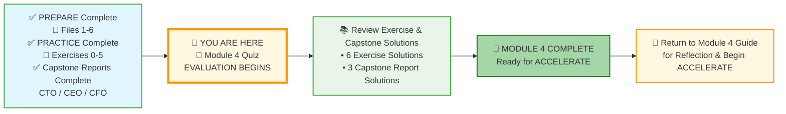
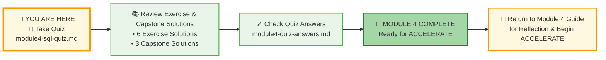

# 🗄️🤖 SQL & GenAI Course
**🎯 Quality Education for Anyone, Anywhere, Anytime — 💫 with Comfort, Convenience at no Cost**

---
## 📝 Module 4 Quiz: Joins, Normalization, and Join Conditions

Welcome to the **EVALUATE** stage! This quiz will help you confirm that you've mastered all the SQL concepts from Module 4 – from normalization and foreign keys to INNER JOIN, LEFT JOIN, SELF JOIN, and advanced join conditions. Take your time – it's not timed, and there's no pressure. The goal is to identify any areas you might want to review before moving on to ACCELERATE.

---

### 📍 Your Current Stage



### 📋 Complete Journey at a Glance

| Stage | Status | What's Included |
|-------|--------|-----------------|
| **Start** | ✅ Complete | PREPARE (Files 1-6) + PRACTICE (Exercises 0-5) + Capstone Reports (CTO, CEO, CFO) |
| **A** | 🔄 Current | Module 4 Quiz – EVALUATION begins |
| **B** | ⏳ Next | Review all 6 exercise solutions and 3 Capstone solutions |
| **C** | 🎉 Goal | Module 4 Complete – Ready for ACCELERATE |
| **D** | 🔙 Final | Return to Guide for reflection |

You've completed all preparation and practice, and you've built three platinum-grade Capstone Reports. Now you begin the **EVALUATE** stage. After the quiz, you'll check your answers, review solutions, and celebrate your Module 4 completion.

---

## 🌌 SQLVerse Check-In

<div style="border-left: 4px solid #9c27b0; background-color: #f3e5f5; padding: 15px; margin: 20px 0; border-radius: 0 8px 8px 0;">

**You've journeyed across Education, E‑Commerce, Tourism, Banking, and Library Planets – mastering joins, normalization, and cross-domain enrichment.** This quiz isn't a test – it's a celebration of how far you've come.

The quiz focuses on the **Art of Connection** – knowing which join to use, when to use it, and how to design schemas that resist corruption.

The SQLVerse is waiting. Your portfolio is calling.

**The difference between a coder and an Artisan is discipline.**

</div>

---

### 🧭 Your Evaluation Path



### 📋 Evaluation Steps Explained

| Step | Action | Purpose |
|------|--------|---------|
| **1** | Take the Module 4 Quiz | Test your understanding of joins, normalization, and join conditions |
| **2** | Review Exercise & Capstone Solutions | Compare your work with expert solutions |
| **3** | Check Quiz Answers | Verify your quiz responses and learn from explanations |
| **4** | Module 4 Complete | Celebrate your achievement! |
| **5** | Return to Guide | Reflect and prepare for ACCELERATE |

---

## 📋 Quiz

### Section 1: Normalization & Keys (Conceptual)

**Q1. The Three Gates**  
What are the three normal forms (1NF, 2NF, 3NF) in simple terms? Provide a one-sentence definition for each.

---

**Q2. The Golden Key**  
In the CTO Report (Intelligent Transportation System), which column served as the **"golden key"** to connect toll logs, café receipts, repair tickets, and fuel station data? Why was this column so powerful?

---

**Q3. Foreign Keys**  
What is a foreign key? Why are they essential for joins?

---

### Section 2: Join Types (Technical)

**Q4. INNER vs LEFT**  
Explain the difference between `INNER JOIN` and `LEFT JOIN`. Provide a real-world business scenario where you would use `LEFT JOIN` instead of `INNER JOIN`.

---

**Q5. The Mirror Bridge**  
What is a `SELF JOIN`? Give an example of a business scenario that requires a self join (e.g., employee-manager hierarchy, product series, mentor relationships).

---

**Q6. Spot the Error**  
Why will the following query produce unexpected results?

```sql
SELECT c.category_name, p.product_name
FROM categories c
LEFT JOIN products p ON c.category_id = p.category_id
WHERE p.price > 100;
```

What happens to categories with no products? How would you fix it?

---

### Section 3: Join Conditions & ON vs WHERE (Applied)

**Q7. The Critical Distinction**  
In a `LEFT JOIN`, what is the difference between putting a condition in the `ON` clause vs the `WHERE` clause? Use an example to explain.

---

**Q8. Non-Equi Join**  
What is a non-equi join? Give an example scenario (e.g., finding cheaper alternatives in the same product category).

---

### Section 4: Cartesians & Performance (Troubleshooting)

**Q9. The Infinite Void**  
What is a Cartesian Product (CROSS JOIN)? Why is it dangerous? How can you accidentally create one?

---

### Section 5: Write the Query (Training Institution Database)

*Write a SQL query to answer each business question using the Training Institution database.*

---

**Q10. Students with No Enrollments**  
Find students who are **not enrolled in any course**. Display their full name (`student_name`) and email address.

```sql
-- Your query here
```

---

**Q11. Complete Student Transcript**  
Show all students and their enrollments, including the course name and instructor name. Include students with no enrollments (show NULL for course and instructor). Display `student_name`, `course_name`, `instructor_name`, and `completion_status`. Order by student name.

```sql
-- Your query here
```

---

**Q12. Instructor Course Load**  
Show each instructor and the **number of courses they teach**. Display `instructor_name` and `courses_taught`. Only include instructors who are currently assigned to at least one course. Order by courses_taught descending.

```sql
-- Your query here
```

---

**Q13. High-Value Students**  
Find students who have made **total payments greater than ₹3000**. Display `student_name` and `total_paid`. Order by total_paid descending.

```sql
-- Your query here
```

---

**Q14. The Cross-Domain Challenge (Preview of ACCELERATE)**  
This query previews the kind of complex reporting you'll build in Capstone. Write a query to show `course_name`, `instructor_name`, and the **number of students enrolled** in each course. Only show courses with at least 2 students. Order by student count descending.

```sql
-- Your query here
```

---

### Section 6: The Artisan’s Challenge (Conceptual – 5 Questions)

*Answer in 2–3 sentences.*

---

**Q15.** In the CTO Report, you reverse-engineered five legacy reports into a normalized schema. What was the most important insight you gained about data modeling from that exercise?

---

**Q16.** In the CEO Report, you performed a cross-domain join between Banking and Transportation data. What business value did this create? Why is cross-pollination valuable to organizations?

---

**Q17.** In the CFO Report, you calculated Net Profit Margin and identified "bleeding" tours. Why is understanding profitability more important than just tracking revenue?

---

**Q18.** The CTO, CEO, and CFO reports each required a different mindset (Technical, Strategic, Financial). How will this experience help you communicate with business stakeholders in your career?

---

**Q19.** What does it mean to be a Data Artisan rather than just a SQL coder? How has this mindset shaped your learning in Module 4?

---

## ✅ When You're Done

1. Write your answers in a new file `module4-quiz-answers.md` inside your Vault at:
   ```
   Learning/Level-1-beginner/Level1-1-ACQUIRE/Module4-JoiningTables/3-quizCheckpoint/
   ```
2. Check your answers against the detailed solutions in the **[module4-quiz-answers.md](../4-exerciseAndQuizSolutions/module4-quiz-answers.md)** file (located in the `4-exerciseAndQuizSolutions` folder). This file contains explanations for all quiz questions as well as sample answers for the exercises.
3. For any questions you missed, review the relevant concept file or practice exercise.
4. Once you're confident, celebrate – you've completed Module 4!

---

## 🧭 Evaluation Navigation

```mermaid
flowchart LR
    A["📝 Take Quiz<br/>module4-sql-quiz.md"] --> B["📚 Exercise 0 Solutions<br/>0-normalization-practice-solutions.md"]
    B --> C["📚 Exercise 1 Solutions<br/>1-inner-join-practice-solutions.md"]
    C --> D["📚 Exercise 2-5 Solutions<br/>+ Capstone Solutions"]
    D --> E["✅ Check Quiz Answers<br/>module4-quiz-answers.md"]
    E --> F["🔄 Return to Module 4 Guide<br/>for Reflection & Begin ACCELERATE"]
    
    style A fill:#fff8e1,stroke:#ff9800
    style B fill:#e8f5e8,stroke:#4caf50
    style C fill:#e8f5e8,stroke:#4caf50
    style D fill:#e8f5e8,stroke:#4caf50
    style E fill:#e8f5e8,stroke:#4caf50
    style F fill:#a5d6a7,stroke:#2e7d32,stroke-width:3px
```




| Previous Step | Next Step |
|:---:|:---:|
| [← Back to Module 4 Guide](../MODULE4_GUIDE.md) | [Continue to Exercise 0 Solutions →](../../4-exerciseAndQuizSolutions/0-normalization-practice-solutions.md) |


---

*Part of our mission for 🎯 Quality Education for Anyone, Anywhere, Anytime — 💫 with Comfort, Convenience at no Cost.*

**Level 1 | Module 4 | SQL Quiz | Next: [Exercise 0  Solutions](../../4-exerciseAndQuizSolutions//0-normalization-practice-solutions.md)**