# 🗄️🤖 SQL & GenAI Course
**🎯 Quality Education for Anyone, Anywhere, Anytime — 💫 with Comfort, Convenience at no Cost**

---
## 🧠 Exercise 1 Solutions: INNER JOIN Practice – Training Institution

This document contains the solutions for **Exercise 1: INNER JOIN Practice**. Use it to check your work, understand alternative approaches, and reinforce your learning.

---

## 🌌 SQLVerse Check-In

<div style="border-left: 4px solid #9c27b0; background-color: #f3e5f5; padding: 15px; margin: 20px 0; border-radius: 0 8px 8px 0;">

**The laws of the SQLVerse are no longer mysteries to you. You have the keys.** You've mastered INNER JOIN on Education Planet. Now check your solutions and see the Artisan's approach.

**The difference between a coder and an Artisan is discipline.**

</div>

---

### 📍 Your Current Stage

```mermaid
flowchart LR
    Ex0["✅ Exercise 0 Solutions<br/>Normalization Practice"] --> Ex1
    Ex1["📍 YOU ARE HERE<br/>📖 Exercise 1 Solutions<br/>INNER JOIN Practice"] --> Ex2
    Ex2["⏳ Exercise 2 Solutions<br/>LEFT JOIN Practice"] --> Ex3
    Ex3["⏳ Exercise 3 Solutions<br/>Multiple Tables Practice"] --> Ex4
    Ex4["⏳ Exercise 4 Solutions<br/>Self Join Practice"] --> Ex5
    Ex5["⏳ Exercise 5 Solutions<br/>Mixed JOIN Practice"] --> Cap
    Cap["⏳ Capstone Solutions<br/>CTO / CEO / CFO"] --> QuizAns
    QuizAns["⏳ Quiz Answers<br/>module4-quiz-answers.md"] --> Complete
    Complete["🎉 MODULE 4 COMPLETE<br/>Ready for ACCELERATE"] --> Guide
    Guide["🔄 Return to Module 4 Guide<br/>for Reflection & Begin ACCELERATE"]
    
    style Ex0 fill:#e1f5fe,stroke:#4caf50,stroke-width:2px
    style Ex1 fill:#fff8e1,stroke:#ff9800,stroke-width:4px
    style Ex2 fill:#fff8e1,stroke:#ff9800,stroke-width:2px
    style Ex3 fill:#fff8e1,stroke:#ff9800,stroke-width:2px
    style Ex4 fill:#fff8e1,stroke:#ff9800,stroke-width:2px
    style Ex5 fill:#fff8e1,stroke:#ff9800,stroke-width:2px
    style Cap fill:#fff8e1,stroke:#ff9800,stroke-width:2px
    style QuizAns fill:#fff8e1,stroke:#ff9800,stroke-width:2px
    style Complete fill:#a5d6a7,stroke:#2e7d32,stroke-width:2px
    style Guide fill:#fff8e1,stroke:#ff9800,stroke-width:2px
```



---

### Challenge 1: Students and Their Enrollments

**Question:** Show all students who are enrolled in at least one course. Display the student's full name (concatenate first_name and last_name as student_name), the course ID, and the enrollment date. Order by student name.

**Solution:**

```sql
SELECT 
    s.first_name || ' ' || s.last_name AS student_name,
    e.course_id,
    e.enrollment_date
FROM students s
JOIN enrollments e ON s.student_id = e.student_id
ORDER BY student_name;
```

**Explanation:** 
- `||` concatenates first and last names with a space
- `JOIN` links students to enrollments via `student_id`
- `ORDER BY student_name` sorts alphabetically

**Expected Result (first 5 rows):**

| student_name | course_id | enrollment_date |
|--------------|-----------|-----------------|
| Alex Kumar | 201 | 2024-03-01 |
| Alex Kumar | 202 | 2024-04-01 |
| Alex Kumar | 205 | 2024-04-01 |
| Carlos Mendez | 207 | 2024-04-05 |
| David Thompson | 204 | 2024-02-10 |

---

### Challenge 2: Courses and Their Instructors

**Question:** Show all courses with their instructor names. Display course_name, course_track, and the instructor's full name (as instructor_name). Order by course name.

**Solution:**

```sql
SELECT 
    c.course_name,
    c.course_track,
    i.first_name || ' ' || i.last_name AS instructor_name
FROM courses c
JOIN instructors i ON c.instructor_id = i.instructor_id
ORDER BY c.course_name;
```

**Explanation:**
- `JOIN` links courses to instructors via `instructor_id`
- Concatenation creates the instructor's full name
- `ORDER BY c.course_name` sorts alphabetically

**Expected Result (all 8 rows):**

| course_name | course_track | instructor_name |
|-------------|--------------|-----------------|
| Backend with Node.js | Web Development | James Wilson |
| Data Analysis for Beginners | Data Science | Maria Garcia |
| Frontend Development | Web Development | Emily Watson |
| Full Stack Project | Web Development | Emily Watson |
| Machine Learning Basics | Data Science | Ahmed Khan |
| Network Security Fundamentals | Cybersecurity | Robert Chen |
| Python for Data Analysis | Data Science | Maria Garcia |
| SQL Basics | Web Development | James Wilson |

---

### Challenge 3: Payments with Student Names

**Question:** Show all payments made by students. Display the student's full name (student_name), payment amount, payment date, and payment method. Order by payment date descending (newest first).

**Solution:**

```sql
SELECT 
    s.first_name || ' ' || s.last_name AS student_name,
    p.amount,
    p.payment_date,
    p.payment_method
FROM payments p
JOIN students s ON p.student_id = s.student_id
ORDER BY p.payment_date DESC;
```

**Explanation:**
- `JOIN` links payments to students via `student_id`
- `ORDER BY p.payment_date DESC` shows newest payments first

**Expected Result (first 5 rows):**

| student_name | amount | payment_date | payment_method |
|--------------|--------|--------------|----------------|
| Priya Patel | 800.00 | 2024-04-01 | Credit Card |
| Priya Patel | 600.00 | 2024-04-01 | Credit Card |
| Carlos Mendez | 800.00 | 2024-04-05 | Debit Card |
| Alex Kumar | 1200.00 | 2024-03-30 | Debit Card |
| Alex Kumar | 1800.00 | 2024-03-28 | Credit Card |

---

### Challenge 4: Completed Courses with Scores

**Question:** Show all completed enrollments where the student passed (final exam score >= 60). Display the student's full name, course name, and final exam score. Order by score descending (highest first).

> 💡 **Artisan's Note:** The condition `final_exam_score >= 60` is applied in the `WHERE` clause (after the joins), not inside the `ON` clause.

**Solution:**

```sql
SELECT 
    s.first_name || ' ' || s.last_name AS student_name,
    c.course_name,
    e.final_exam_score
FROM students s
JOIN enrollments e ON s.student_id = e.student_id
JOIN courses c ON e.course_id = c.course_id
WHERE e.completion_status = 'Completed' 
  AND e.final_exam_score >= 60
ORDER BY e.final_exam_score DESC;
```

**Explanation:**
- Three-table join: students → enrollments → courses
- `WHERE` filters for completed courses with passing scores
- `ORDER BY e.final_exam_score DESC` puts highest scores first

**Expected Result:**

| student_name | course_name | final_exam_score |
|--------------|-------------|------------------|
| Alex Kumar | Frontend Development | 97.00 |
| Mike Rodriguez | Python for Data Analysis | 94.00 |
| David Thompson | Network Security Fundamentals | 90.00 |
| Sarah Chen | Frontend Development | 85.00 |
| Lisa Johnson | Python for Data Analysis | 85.00 |

---

### Challenge 5: Web Development Courses Only

**Question:** Show all students enrolled in 'Web Development' track courses. Display the student's full name, course name, and enrollment date. Order by student name, then by course name.

**Solution:**

```sql
SELECT 
    s.first_name || ' ' || s.last_name AS student_name,
    c.course_name,
    e.enrollment_date
FROM students s
JOIN enrollments e ON s.student_id = e.student_id
JOIN courses c ON e.course_id = c.course_id
WHERE c.course_track = 'Web Development'
ORDER BY student_name, c.course_name;
```

**Explanation:**
- Three-table join filtered by `course_track`
- Multi-column `ORDER BY` sorts by student name first, then course name

**Expected Result (first 5 rows):**

| student_name | course_name | enrollment_date |
|--------------|-------------|-----------------|
| Alex Kumar | Backend with Node.js | 2024-04-01 |
| Alex Kumar | Frontend Development | 2024-03-01 |
| Alex Kumar | Full Stack Project | 2024-04-01 |
| Jessica Park | Backend with Node.js | 2024-04-01 |
| Jessica Park | Frontend Development | 2024-02-01 |

---

### Challenge 6: Students Who Paid More Than $1000

**Question:** Show all students who have made a single payment greater than $1000. Display the student's full name, payment amount, and payment date. Order by payment amount descending.

**Solution:**

```sql
SELECT 
    s.first_name || ' ' || s.last_name AS student_name,
    p.amount,
    p.payment_date
FROM payments p
JOIN students s ON p.student_id = s.student_id
WHERE p.amount > 1000
ORDER BY p.amount DESC;
```

**Explanation:**
- `WHERE p.amount > 1000` filters for large payments
- `ORDER BY p.amount DESC` shows largest payments first

**Expected Result:**

| student_name | amount | payment_date |
|--------------|--------|--------------|
| Mike Rodriguez | 2000.00 | 2024-01-15 |
| Mike Rodriguez | 2000.00 | 2024-03-20 |
| Alex Kumar | 1800.00 | 2024-03-28 |
| David Thompson | 1600.00 | 2024-02-05 |
| Sarah Chen | 1500.00 | 2024-01-10 |
| Alex Kumar | 1500.00 | 2024-02-25 |
| Priya Patel | 1400.00 | 2024-04-01 |

---

### Challenge 7: Instructor's Course Load (Optional)

**Question:** Show each instructor and count the number of courses per instructor. Display the instructor's full name and the count of courses (as courses_taught). Only include instructors who are currently assigned to at least one course. Order by course count descending.

**Solution:**

```sql
SELECT 
    i.first_name || ' ' || i.last_name AS instructor_name,
    COUNT(c.course_id) AS courses_taught
FROM instructors i
JOIN courses c ON i.instructor_id = c.instructor_id
GROUP BY i.instructor_id
ORDER BY courses_taught DESC;
```

**Explanation:**
- `JOIN` links instructors to courses
- `GROUP BY i.instructor_id` groups by each instructor
- `COUNT(c.course_id)` counts courses per instructor
- `ORDER BY courses_taught DESC` shows busiest instructors first

**Expected Result:**

| instructor_name | courses_taught |
|-----------------|----------------|
| Emily Watson | 2 |
| James Wilson | 2 |
| Maria Garcia | 2 |
| Robert Chen | 1 |
| Ahmed Khan | 1 |

---

## ✅ Solution Summary

| Challenge | Key Concepts |
|-----------|--------------|
| 1 | INNER JOIN, concatenation, ORDER BY |
| 2 | INNER JOIN, concatenation, ORDER BY |
| 3 | INNER JOIN, ORDER BY DESC |
| 4 | Multiple INNER JOINs, WHERE filter, ORDER BY DESC |
| 5 | Multiple INNER JOINs, WHERE filter, multi-column ORDER BY |
| 6 | INNER JOIN, WHERE numeric filter, ORDER BY DESC |
| 7 | INNER JOIN, GROUP BY, COUNT, ORDER BY DESC |

---

## 🧭 EVALUATE Navigation

```mermaid
flowchart LR
    Ex0["✅ Exercise 0 Solutions<br/>Normalization Practice"] --> Ex1
    Ex1["✅ COMPLETED<br/>📖 Exercise 1 Solutions<br/>INNER JOIN Practice"] --> Ex2
    Ex2["⏳ Exercise 2 Solutions<br/>LEFT JOIN Practice"] --> Ex3
    Ex3["⏳ Exercise 3 Solutions<br/>Multiple Tables Practice"] --> Ex4
    Ex4["⏳ Exercise 4 Solutions<br/>Self Join Practice"] --> Ex5
    Ex5["⏳ Exercise 5 Solutions<br/>Mixed JOIN Practice"] --> Cap
    Cap["⏳ Capstone Solutions<br/>CTO / CEO / CFO"] --> QuizAns
    QuizAns["⏳ Quiz Answers<br/>module4-quiz-answers.md"] --> Complete
    Complete["🎉 MODULE 4 COMPLETE<br/>Ready for ACCELERATE"] --> Guide
    Guide["🔄 Return to Module 4 Guide<br/>for Reflection & Begin ACCELERATE"]
    
    style Ex0 fill:#e1f5fe,stroke:#4caf50,stroke-width:2px
    style Ex1 fill:#e1f5fe,stroke:#4caf50,stroke-width:4px
    style Ex2 fill:#fff8e1,stroke:#ff9800,stroke-width:2px
    style Ex3 fill:#fff8e1,stroke:#ff9800,stroke-width:2px
    style Ex4 fill:#fff8e1,stroke:#ff9800,stroke-width:2px
    style Ex5 fill:#fff8e1,stroke:#ff9800,stroke-width:2px
    style Cap fill:#fff8e1,stroke:#ff9800,stroke-width:2px
    style QuizAns fill:#fff8e1,stroke:#ff9800,stroke-width:2px
    style Complete fill:#a5d6a7,stroke:#2e7d32,stroke-width:2px
    style Guide fill:#fff8e1,stroke:#ff9800,stroke-width:2px
```



| Previous Step | Next Step |
|:---:|:---:|
| [← Back to Exercise 0 Solutions](./0-normalization-practice-solutions.md) | [Continue to Exercise 2 Solutions →](./2-left-join-practice-solutions.md) |

---

*Part of our mission for 🎯 Quality Education for Anyone, Anywhere, Anytime — 💫 with Comfort, Convenience at no Cost.*

**Level 1 | Module 4 | Exercise 1 Solutions**