# 🗄️🤖 SQL & GenAI Course
**🎯 Quality Education for Anyone, Anywhere, Anytime — 💫 with Comfort, Convenience at no Cost**

---

## 🧠 Exercise 2 Solutions: LEFT JOIN Practice – Training Institution

This document contains the solutions for **Exercise 2: LEFT JOIN Practice**. Use it to check your work, understand alternative approaches, and reinforce your learning.

---

## 🌌 SQLVerse Check-In

<div style="border-left: 4px solid #9c27b0; background-color: #f3e5f5; padding: 15px; margin: 20px 0; border-radius: 0 8px 8px 0;">

**The laws of the SQLVerse are no longer mysteries to you. You have the keys.** You've mastered LEFT JOIN on Education Planet – finding gaps, orphans, and missing data. Now check your solutions and see the Artisan's approach.

**The difference between a coder and an Artisan is discipline.**

</div>

---

### 📍 Your Current Stage

```mermaid
flowchart LR
    Ex0["✅ Exercise 0 Solutions<br/>Normalization Practice"] --> Ex1
    Ex1["✅ Exercise 1 Solutions<br/>INNER JOIN Practice"] --> Ex2
    Ex2["📍 YOU ARE HERE<br/>📖 Exercise 2 Solutions<br/>LEFT JOIN Practice"] --> Ex3
    Ex3["⏳ Exercise 3 Solutions<br/>Multiple Tables Practice"] --> Ex4
    Ex4["⏳ Exercise 4 Solutions<br/>Self Join Practice"] --> Ex5
    Ex5["⏳ Exercise 5 Solutions<br/>Mixed JOIN Practice"] --> Cap
    Cap["⏳ Capstone Solutions<br/>CTO / CEO / CFO"] --> QuizAns
    QuizAns["⏳ Quiz Answers<br/>module4-quiz-answers.md"] --> Complete
    Complete["🎉 MODULE 4 COMPLETE<br/>Ready for ACCELERATE"] --> Guide
    Guide["🔄 Return to Module 4 Guide<br/>for Reflection & Begin ACCELERATE"]
    
    style Ex0 fill:#e1f5fe,stroke:#4caf50,stroke-width:2px
    style Ex1 fill:#e1f5fe,stroke:#4caf50,stroke-width:2px
    style Ex2 fill:#fff8e1,stroke:#ff9800,stroke-width:4px
    style Ex3 fill:#fff8e1,stroke:#ff9800,stroke-width:2px
    style Ex4 fill:#fff8e1,stroke:#ff9800,stroke-width:2px
    style Ex5 fill:#fff8e1,stroke:#ff9800,stroke-width:2px
    style Cap fill:#fff8e1,stroke:#ff9800,stroke-width:2px
    style QuizAns fill:#fff8e1,stroke:#ff9800,stroke-width:2px
    style Complete fill:#a5d6a7,stroke:#2e7d32,stroke-width:2px
    style Guide fill:#fff8e1,stroke:#ff9800,stroke-width:2px
```



---

### Challenge 1: All Students – With or Without Enrollments

**Question:** Show all students, including those who are not enrolled in any course. Display the student's full name (`student_name`), and if they have an enrollment, show the course ID and enrollment date. If they have no enrollment, show `NULL` for course ID and enrollment date.

**Solution:**

```sql
SELECT 
    s.first_name || ' ' || s.last_name AS student_name,
    e.course_id,
    e.enrollment_date
FROM students s
LEFT JOIN enrollments e ON s.student_id = e.student_id
ORDER BY student_name;
```

**Explanation:**
- `LEFT JOIN` keeps all students, even those with no matching enrollments
- Students without enrollments show `NULL` in course_id and enrollment_date

**Expected Result (first 5 rows):**

| student_name | course_id | enrollment_date |
|--------------|-----------|-----------------|
| Alex Kumar | 201 | 2024-03-01 |
| Alex Kumar | 202 | 2024-04-01 |
| Alex Kumar | 205 | 2024-04-01 |
| Carlos Mendez | 207 | 2024-04-05 |
| David Thompson | 204 | 2024-02-10 |

---

### Challenge 2: Find Students with No Enrollments

**Question:** Find students who are not enrolled in any course. Display their full name (`student_name`) and email address.

**Solution:**

```sql
SELECT 
    s.first_name || ' ' || s.last_name AS student_name,
    s.email
FROM students s
LEFT JOIN enrollments e ON s.student_id = e.student_id
WHERE e.enrollment_id IS NULL;
```

**Explanation:**
- `LEFT JOIN` keeps all students
- `WHERE e.enrollment_id IS NULL` filters to only students with no matching enrollments

**Expected Result:**

| student_name | email |
|--------------|-------|
| (Based on data – any student with zero enrollments) | |

> 💡 **Note:** In the current dataset, all 10 students have at least one enrollment. This query would return no rows, but the pattern is what matters.

---

### Challenge 3: All Courses – With or Without Enrollments

**Question:** Show all courses, including those with no students enrolled. Display the course name, and if there are enrollments, show the student's full name (`student_name`). If no student is enrolled, show `NULL` for student name.

**Solution:**

```sql
SELECT 
    c.course_name,
    s.first_name || ' ' || s.last_name AS student_name
FROM courses c
LEFT JOIN enrollments e ON c.course_id = e.course_id
LEFT JOIN students s ON e.student_id = s.student_id
ORDER BY c.course_name;
```

**Explanation:**
- First `LEFT JOIN` keeps all courses, even without enrollments
- Second `LEFT JOIN` keeps all enrollment rows, even without students (though this shouldn't happen due to FK)

**Expected Result (first 5 rows):**

| course_name | student_name |
|-------------|--------------|
| Backend with Node.js | Alex Kumar |
| Backend with Node.js | Jessica Park |
| Backend with Node.js | Sarah Chen |
| Data Analysis for Beginners | Carlos Mendez |
| Data Analysis for Beginners | Priya Patel |

---

### Challenge 4: Find Courses with No Students

**Question:** Find courses that have no students enrolled. Display the course code and course name.

**Solution:**

```sql
SELECT 
    c.course_code,
    c.course_name
FROM courses c
LEFT JOIN enrollments e ON c.course_id = e.course_id
WHERE e.enrollment_id IS NULL;
```

**Explanation:**
- `LEFT JOIN` keeps all courses
- `WHERE e.enrollment_id IS NULL` filters to only courses with no enrollments

**Expected Result:**

| course_code | course_name |
|-------------|-------------|
| (Any course with zero enrollments – check your data) | |

> 💡 **Note:** Based on the sample data, all courses have at least one enrollment. The pattern is what matters.

---

### Challenge 5: All Instructors – With or Without Courses

**Question:** Show all instructors, including those who are not assigned to any course. Display the instructor's full name (`instructor_name`), and if they teach a course, show the course name. If they teach no courses, show `NULL` for course name.

**Solution:**

```sql
SELECT 
    i.first_name || ' ' || i.last_name AS instructor_name,
    c.course_name
FROM instructors i
LEFT JOIN courses c ON i.instructor_id = c.instructor_id
ORDER BY instructor_name;
```

**Explanation:**
- `LEFT JOIN` keeps all instructors, even those with no courses
- Instructors without courses show `NULL` in course_name

**Expected Result:**

| instructor_name | course_name |
|-----------------|-------------|
| Ahmed Khan | Machine Learning Basics |
| Emily Watson | Frontend Development |
| Emily Watson | Full Stack Project |
| James Wilson | Backend with Node.js |
| James Wilson | SQL Basics |
| Maria Garcia | Data Analysis for Beginners |
| Maria Garcia | Python for Data Analysis |
| Robert Chen | Network Security Fundamentals |

---

### Challenge 6: All Students – With or Without Payments

**Question:** Show all students, including those who have made no payments. Display the student's full name (`student_name`), and if they have made a payment, show the payment amount and payment date. If they have no payments, show `NULL` for amount and date. Order by student name.

**Solution:**

```sql
SELECT 
    s.first_name || ' ' || s.last_name AS student_name,
    p.amount,
    p.payment_date
FROM students s
LEFT JOIN payments p ON s.student_id = p.student_id
ORDER BY student_name;
```

**Explanation:**
- `LEFT JOIN` keeps all students, even those with no payments
- Students without payments show `NULL` in amount and payment_date

**Expected Result (first 5 rows):**

| student_name | amount | payment_date |
|--------------|--------|--------------|
| Alex Kumar | 1500.00 | 2024-02-25 |
| Alex Kumar | 1800.00 | 2024-03-28 |
| Alex Kumar | 1200.00 | 2024-03-30 |
| Carlos Mendez | 800.00 | 2024-04-05 |
| David Thompson | 1600.00 | 2024-02-05 |

---

### Challenge 7: Find Students Who Have Paid Nothing (Optional)

**Question:** Find students who have made zero payments. Display their full name (`student_name`), email, and total fees owed (from `students.total_fees`). Order by total fees owed descending.

**Solution:**

```sql
SELECT 
    s.first_name || ' ' || s.last_name AS student_name,
    s.email,
    s.total_fees
FROM students s
LEFT JOIN payments p ON s.student_id = p.student_id
WHERE p.payment_id IS NULL
ORDER BY s.total_fees DESC;
```

**Explanation:**
- `LEFT JOIN` keeps all students
- `WHERE p.payment_id IS NULL` filters to students with no payments
- Order by total_fees descending shows highest debt first

**Expected Result:**

| student_name | email | total_fees |
|--------------|-------|------------|
| James Wilson | james.w@email.com | 5200.00 |
| (Any other students with zero payments) | | |

> 💡 **Note:** Based on the sample data, James Wilson (student_id 108) has no payments.

---

## ✅ Solution Summary

| Challenge | Key Concepts |
|-----------|--------------|
| 1 | LEFT JOIN, NULL handling |
| 2 | LEFT JOIN + IS NULL pattern (orphan detection) |
| 3 | Chained LEFT JOINs (courses → enrollments → students) |
| 4 | LEFT JOIN + IS NULL (courses with no enrollments) |
| 5 | LEFT JOIN (instructors → courses) |
| 6 | LEFT JOIN (students → payments) |
| 7 | LEFT JOIN + IS NULL + ORDER BY (students with no payments) |

---

## 🧭 EVALUATE Navigation

```mermaid
flowchart LR
    Ex0["✅ Exercise 0 Solutions<br/>Normalization Practice"] --> Ex1
    Ex1["✅ Exercise 1 Solutions<br/>INNER JOIN Practice"] --> Ex2
    Ex2["✅ COMPLETED<br/>📖 Exercise 2 Solutions<br/>LEFT JOIN Practice"] --> Ex3
    Ex3["⏳ Exercise 3 Solutions<br/>Multiple Tables Practice"] --> Ex4
    Ex4["⏳ Exercise 4 Solutions<br/>Self Join Practice"] --> Ex5
    Ex5["⏳ Exercise 5 Solutions<br/>Mixed JOIN Practice"] --> Cap
    Cap["⏳ Capstone Solutions<br/>CTO / CEO / CFO"] --> QuizAns
    QuizAns["⏳ Quiz Answers<br/>module4-quiz-answers.md"] --> Complete
    Complete["🎉 MODULE 4 COMPLETE<br/>Ready for ACCELERATE"] --> Guide
    Guide["🔄 Return to Module 4 Guide<br/>for Reflection & Begin ACCELERATE"]
    
    style Ex0 fill:#e1f5fe,stroke:#4caf50,stroke-width:2px
    style Ex1 fill:#e1f5fe,stroke:#4caf50,stroke-width:2px
    style Ex2 fill:#e1f5fe,stroke:#4caf50,stroke-width:4px
    style Ex3 fill:#fff8e1,stroke:#ff9800,stroke-width:2px
    style Ex4 fill:#fff8e1,stroke:#ff9800,stroke-width:2px
    style Ex5 fill:#fff8e1,stroke:#ff9800,stroke-width:2px
    style Cap fill:#fff8e1,stroke:#ff9800,stroke-width:2px
    style QuizAns fill:#fff8e1,stroke:#ff9800,stroke-width:2px
    style Complete fill:#a5d6a7,stroke:#2e7d32,stroke-width:2px
    style Guide fill:#fff8e1,stroke:#ff9800,stroke-width:2px
```



| Previous Step | Next Step |
|:---:|:---:|
| [← Back to Exercise 1 Solutions](./1-inner-join-practice-solutions.md) | [Continue to Exercise 3 Solutions →](./3-multiple-tables-practice-solutions.md) |

---

*Part of our mission for 🎯 Quality Education for Anyone, Anywhere, Anytime — 💫 with Comfort, Convenience at no Cost.*

**Level 1 | Module 4 | Exercise 2 Solutions**