# 🗄️🤖 SQL & GenAI Course
**🎯 Quality Education for Anyone, Anywhere, Anytime — 💫 with Comfort, Convenience at no Cost**

## 🧠 Exercise 3 Solutions: Multiple Tables Practice – Training Institution

This document contains the solutions for **Exercise 3: Multiple Tables Practice**. Use it to check your work, understand alternative approaches, and reinforce your learning.

---

## 🌌 SQLVerse Check-In

<div style="border-left: 4px solid #9c27b0; background-color: #f3e5f5; padding: 15px; margin: 20px 0; border-radius: 0 8px 8px 0;">

**The laws of the SQLVerse are no longer mysteries to you. You have the keys.** You've mastered chaining multiple joins on Education Planet – turning scattered tables into unified stories. Now check your solutions and see the Artisan's approach.

**The difference between a coder and an Artisan is discipline.**

</div>

---

### 📍 Your Current Stage

```mermaid
flowchart LR
    Ex0["✅ Exercise 0 Solutions<br/>Normalization Practice"] --> Ex1
    Ex1["✅ Exercise 1 Solutions<br/>INNER JOIN Practice"] --> Ex2
    Ex2["✅ Exercise 2 Solutions<br/>LEFT JOIN Practice"] --> Ex3
    Ex3["📍 YOU ARE HERE<br/>📖 Exercise 3 Solutions<br/>Multiple Tables Practice"] --> Ex4
    Ex4["⏳ Exercise 4 Solutions<br/>Self Join Practice"] --> Ex5
    Ex5["⏳ Exercise 5 Solutions<br/>Mixed JOIN Practice"] --> Cap
    Cap["⏳ Capstone Solutions<br/>CTO / CEO / CFO"] --> QuizAns
    QuizAns["⏳ Quiz Answers<br/>module4-quiz-answers.md"] --> Complete
    Complete["🎉 MODULE 4 COMPLETE<br/>Ready for ACCELERATE"] --> Guide
    Guide["🔄 Return to Module 4 Guide<br/>for Reflection & Begin ACCELERATE"]
    
    style Ex0 fill:#e1f5fe,stroke:#4caf50,stroke-width:2px
    style Ex1 fill:#e1f5fe,stroke:#4caf50,stroke-width:2px
    style Ex2 fill:#e1f5fe,stroke:#4caf50,stroke-width:2px
    style Ex3 fill:#fff8e1,stroke:#ff9800,stroke-width:4px
    style Ex4 fill:#fff8e1,stroke:#ff9800,stroke-width:2px
    style Ex5 fill:#fff8e1,stroke:#ff9800,stroke-width:2px
    style Cap fill:#fff8e1,stroke:#ff9800,stroke-width:2px
    style QuizAns fill:#fff8e1,stroke:#ff9800,stroke-width:2px
    style Complete fill:#a5d6a7,stroke:#2e7d32,stroke-width:2px
    style Guide fill:#fff8e1,stroke:#ff9800,stroke-width:2px
```



---

### Challenge 1: Students with Course and Instructor Details

**Question:** Show all students and their enrollments, including the course name and the instructor's full name (`instructor_name`). Display `student_name`, `course_name`, `instructor_name`, and `completion_status`.

**Solution:**

```sql
SELECT 
    s.first_name || ' ' || s.last_name AS student_name,
    c.course_name,
    i.first_name || ' ' || i.last_name AS instructor_name,
    e.completion_status
FROM students s
JOIN enrollments e ON s.student_id = e.student_id
JOIN courses c ON e.course_id = c.course_id
JOIN instructors i ON c.instructor_id = i.instructor_id
ORDER BY student_name;
```

**Explanation:**
- Four-table chain: students → enrollments → courses → instructors
- Each join adds a new layer of detail

**Expected Result (first 5 rows):**

| student_name | course_name | instructor_name | completion_status |
|--------------|-------------|-----------------|-------------------|
| Alex Kumar | Frontend Development | Emily Watson | Completed |
| Alex Kumar | Backend with Node.js | James Wilson | Ongoing |
| Alex Kumar | Full Stack Project | Emily Watson | Ongoing |
| Carlos Mendez | Data Analysis for Beginners | Maria Garcia | Ongoing |
| David Thompson | Network Security Fundamentals | Robert Chen | Completed |

---

### Challenge 2: Students and Their Total Payments

**Question:** Show each student's full name (`student_name`) and the total amount they have paid across all payments. Only include students who have made at least one payment.

**Solution:**

```sql
SELECT 
    s.first_name || ' ' || s.last_name AS student_name,
    SUM(p.amount) AS total_paid
FROM students s
JOIN payments p ON s.student_id = p.student_id
GROUP BY s.student_id
ORDER BY total_paid DESC;
```

**Explanation:**
- `JOIN` links students to payments
- `GROUP BY` groups by student
- `SUM(p.amount)` calculates total per student
- Students with no payments are excluded (INNER JOIN behavior)

**Expected Result:**

| student_name | total_paid |
|--------------|------------|
| Alex Kumar | 4500.00 |
| Mike Rodriguez | 4000.00 |
| Sarah Chen | 3000.00 |
| Lisa Johnson | 3000.00 |
| David Thompson | 1600.00 |
| Priya Patel | 1400.00 |
| Carlos Mendez | 800.00 |
| Jessica Park | 2000.00 |
| Maria Garcia | 2000.00 |

---

### Challenge 3: Students in Data Science Track

**Question:** Show all students enrolled in courses from the 'Data Science' track. Display `student_name`, `course_name`, and `enrollment_date`. Order by student name.

**Solution:**

```sql
SELECT 
    s.first_name || ' ' || s.last_name AS student_name,
    c.course_name,
    e.enrollment_date
FROM students s
JOIN enrollments e ON s.student_id = e.student_id
JOIN courses c ON e.course_id = c.course_id
WHERE c.course_track = 'Data Science'
ORDER BY student_name;
```

**Explanation:**
- Three-table join: students → enrollments → courses
- `WHERE c.course_track = 'Data Science'` filters for Data Science track only

**Expected Result:**

| student_name | course_name | enrollment_date |
|--------------|-------------|-----------------|
| Carlos Mendez | Data Analysis for Beginners | 2024-04-05 |
| James Wilson | Machine Learning Basics | 2024-03-15 |
| Lisa Johnson | Python for Data Analysis | 2024-02-15 |
| Mike Rodriguez | Python for Data Analysis | 2024-01-20 |
| Priya Patel | Data Analysis for Beginners | 2024-04-01 |

---

### Challenge 4: Complete Payment History with Course Details

**Question:** Show all payments made by students, including the student name, payment amount, payment date, and the course(s) they are enrolled in. If a student is enrolled in multiple courses, they may appear multiple times.

**Solution:**

```sql
SELECT 
    s.first_name || ' ' || s.last_name AS student_name,
    p.amount,
    p.payment_date,
    c.course_name
FROM payments p
JOIN students s ON p.student_id = s.student_id
JOIN enrollments e ON s.student_id = e.student_id
JOIN courses c ON e.course_id = c.course_id
ORDER BY s.student_name, p.payment_date;
```

**Explanation:**
- Four-table chain: payments → students → enrollments → courses
- Each payment appears once per enrollment (multiplication effect)

> 📊 **Observation Box:** If your query returns more rows than expected (e.g., 36 rows when there are only 18 payments), you are not wrong. This is the **multiplication effect** of joining one-to-many relationships. Each payment appears once for every enrollment the student has.

**Expected Result (first 5 rows):**

| student_name | amount | payment_date | course_name |
|--------------|--------|--------------|-------------|
| Alex Kumar | 1500.00 | 2024-02-25 | Frontend Development |
| Alex Kumar | 1800.00 | 2024-03-28 | Frontend Development |
| Alex Kumar | 1200.00 | 2024-03-30 | Frontend Development |
| Alex Kumar | 1500.00 | 2024-02-25 | Backend with Node.js |
| Alex Kumar | 1800.00 | 2024-03-28 | Backend with Node.js |

---

### Challenge 5: Students Who Completed Courses with High Scores

**Question:** Show all students who completed a course with a final exam score of 85 or higher. Display `student_name`, `course_name`, and `final_exam_score`. Order by score descending.

**Solution:**

```sql
SELECT 
    s.first_name || ' ' || s.last_name AS student_name,
    c.course_name,
    e.final_exam_score
FROM students s
JOIN enrollments e ON s.student_id = e.student_id
JOIN courses c ON e.course_id = c.course_id
WHERE e.completion_status = 'Completed' 
  AND e.final_exam_score >= 85
ORDER BY e.final_exam_score DESC;
```

**Explanation:**
- Three-table join with two filters
- `WHERE` conditions applied after joins
- `ORDER BY DESC` shows highest scores first

**Expected Result:**

| student_name | course_name | final_exam_score |
|--------------|-------------|------------------|
| Alex Kumar | Frontend Development | 97.00 |
| Mike Rodriguez | Python for Data Analysis | 94.00 |
| David Thompson | Network Security Fundamentals | 90.00 |
| Sarah Chen | Frontend Development | 85.00 |
| Lisa Johnson | Python for Data Analysis | 85.00 |

---

### Challenge 6: Instructor Course Roster

**Question:** Show each instructor and the list of students enrolled in their courses. Display `instructor_name`, `course_name`, and `student_name`. Order by instructor name, then course name, then student name.

**Solution:**

```sql
SELECT 
    i.first_name || ' ' || i.last_name AS instructor_name,
    c.course_name,
    s.first_name || ' ' || s.last_name AS student_name
FROM instructors i
JOIN courses c ON i.instructor_id = c.instructor_id
JOIN enrollments e ON c.course_id = e.course_id
JOIN students s ON e.student_id = s.student_id
ORDER BY instructor_name, c.course_name, student_name;
```

**Explanation:**
- Four-table chain starting from instructors
- Multi-column `ORDER BY` sorts by instructor, then course, then student

**Expected Result (first 5 rows):**

| instructor_name | course_name | student_name |
|-----------------|-------------|--------------|
| Ahmed Khan | Machine Learning Basics | James Wilson |
| Emily Watson | Frontend Development | Alex Kumar |
| Emily Watson | Frontend Development | Jessica Park |
| Emily Watson | Frontend Development | Maria Garcia |
| Emily Watson | Frontend Development | Sarah Chen |

---

### Challenge 7: Students Who Owe Balance (Optional)

**Question:** Find students who have unpaid fees. Display `student_name`, `total_fees`, `fees_paid`, and the calculated `balance_owed` (`total_fees - fees_paid`). Only include students with a balance greater than 0.

> 💡 **Artisan's Note – Economy of Effort:** This query uses only the `students` table. No joins required. An Artisan doesn't use a `JOIN` just because they can; they use it only when the data demands it.

**Solution:**

```sql
SELECT 
    first_name || ' ' || last_name AS student_name,
    total_fees,
    fees_paid,
    (total_fees - fees_paid) AS balance_owed
FROM students
WHERE (total_fees - fees_paid) > 0
ORDER BY balance_owed DESC;
```

**Explanation:**
- Single table query – no joins needed
- Calculated column for balance owed
- `WHERE` filters to students with outstanding balance

**Expected Result:**

| student_name | total_fees | fees_paid | balance_owed |
|--------------|------------|-----------|--------------|
| James Wilson | 5200.00 | 0.00 | 5200.00 |
| Jessica Park | 4500.00 | 2000.00 | 2500.00 |
| Lisa Johnson | 5200.00 | 3000.00 | 2200.00 |
| Priya Patel | 4500.00 | 1500.00 | 3000.00 |

---

## ✅ Solution Summary

| Challenge | Key Concepts |
|-----------|--------------|
| 1 | Four-table chain (students → enrollments → courses → instructors) |
| 2 | JOIN + GROUP BY + SUM aggregation |
| 3 | Three-table join + WHERE filter |
| 4 | Four-table chain with multiplication effect |
| 5 | Three-table join + multiple WHERE conditions |
| 6 | Four-table chain from instructors + multi-column ORDER BY |
| 7 | Economy of Effort – single table query |

---

## 🧭 EVALUATE Navigation

```mermaid
flowchart LR
    Ex0["✅ Exercise 0 Solutions<br/>Normalization Practice"] --> Ex1
    Ex1["✅ Exercise 1 Solutions<br/>INNER JOIN Practice"] --> Ex2
    Ex2["✅ Exercise 2 Solutions<br/>LEFT JOIN Practice"] --> Ex3
    Ex3["✅ COMPLETED<br/>📖 Exercise 3 Solutions<br/>Multiple Tables Practice"] --> Ex4
    Ex4["⏳ Exercise 4 Solutions<br/>Self Join Practice"] --> Ex5
    Ex5["⏳ Exercise 5 Solutions<br/>Mixed JOIN Practice"] --> Cap
    Cap["⏳ Capstone Solutions<br/>CTO / CEO / CFO"] --> QuizAns
    QuizAns["⏳ Quiz Answers<br/>module4-quiz-answers.md"] --> Complete
    Complete["🎉 MODULE 4 COMPLETE<br/>Ready for ACCELERATE"] --> Guide
    Guide["🔄 Return to Module 4 Guide<br/>for Reflection & Begin ACCELERATE"]
    
    style Ex0 fill:#e1f5fe,stroke:#4caf50,stroke-width:2px
    style Ex1 fill:#e1f5fe,stroke:#4caf50,stroke-width:2px
    style Ex2 fill:#e1f5fe,stroke:#4caf50,stroke-width:2px
    style Ex3 fill:#e1f5fe,stroke:#4caf50,stroke-width:4px
    style Ex4 fill:#fff8e1,stroke:#ff9800,stroke-width:2px
    style Ex5 fill:#fff8e1,stroke:#ff9800,stroke-width:2px
    style Cap fill:#fff8e1,stroke:#ff9800,stroke-width:2px
    style QuizAns fill:#fff8e1,stroke:#ff9800,stroke-width:2px
    style Complete fill:#a5d6a7,stroke:#2e7d32,stroke-width:2px
    style Guide fill:#fff8e1,stroke:#ff9800,stroke-width:2px
```



| Previous Step | Next Step |
|:---:|:---:|
| [← Back to Exercise 2 Solutions](./2-left-join-practice-solutions.md) | [Continue to Exercise 4 Solutions →](./4-self-join-practice-solutions.md) |

---

*Part of our mission for 🎯 Quality Education for Anyone, Anywhere, Anytime — 💫 with Comfort, Convenience at no Cost.*

**Level 1 | Module 4 | Exercise 3 Solutions**