# 🗄️🤖 SQL & GenAI Course
**🎯 Quality Education for Anyone, Anywhere, Anytime — 💫 with Comfort, Convenience at no Cost**

---

## 🧠 Exercise 4 Solutions: Self Join Practice – Tourism Planet

This document contains the solutions for **Exercise 4: Self Join Practice**. Use it to check your work, understand alternative approaches, and reinforce your learning.

---

## 🌌 SQLVerse Check-In

<div style="border-left: 4px solid #9c27b0; background-color: #f3e5f5; padding: 15px; margin: 20px 0; border-radius: 0 8px 8px 0;">

**The laws of the SQLVerse are no longer mysteries to you. You have the keys.** You've mastered Self Join on Tourism Planet – looking into the mirror to reveal hierarchies. Now check your solutions and see the Artisan's approach.

**The difference between a coder and an Artisan is discipline.**

</div>

---

### 📍 Your Current Stage

```mermaid
flowchart LR
    Ex0["✅ Exercise 0 Solutions<br/>Normalization Practice"] --> Ex1
    Ex1["✅ Exercise 1 Solutions<br/>INNER JOIN Practice"] --> Ex2
    Ex2["✅ Exercise 2 Solutions<br/>LEFT JOIN Practice"] --> Ex3
    Ex3["✅ Exercise 3 Solutions<br/>Multiple Tables Practice"] --> Ex4
    Ex4["📍 YOU ARE HERE<br/>📖 Exercise 4 Solutions<br/>Self Join Practice"] --> Ex5
    Ex5["⏳ Exercise 5 Solutions<br/>Mixed JOIN Practice"] --> Cap
    Cap["⏳ Capstone Solutions<br/>CTO / CEO / CFO"] --> QuizAns
    QuizAns["⏳ Quiz Answers<br/>module4-quiz-answers.md"] --> Complete
    Complete["🎉 MODULE 4 COMPLETE<br/>Ready for ACCELERATE"] --> Guide
    Guide["🔄 Return to Module 4 Guide<br/>for Reflection & Begin ACCELERATE"]
    
    style Ex0 fill:#e1f5fe,stroke:#4caf50,stroke-width:2px
    style Ex1 fill:#e1f5fe,stroke:#4caf50,stroke-width:2px
    style Ex2 fill:#e1f5fe,stroke:#4caf50,stroke-width:2px
    style Ex3 fill:#e1f5fe,stroke:#4caf50,stroke-width:2px
    style Ex4 fill:#fff8e1,stroke:#ff9800,stroke-width:4px
    style Ex5 fill:#fff8e1,stroke:#ff9800,stroke-width:2px
    style Cap fill:#fff8e1,stroke:#ff9800,stroke-width:2px
    style QuizAns fill:#fff8e1,stroke:#ff9800,stroke-width:2px
    style Complete fill:#a5d6a7,stroke:#2e7d32,stroke-width:2px
    style Guide fill:#fff8e1,stroke:#ff9800,stroke-width:2px
```



---

### Challenge 1: Package Tours and Their Sub-Tours

**Question:** Show all package tours and their sub-tours. Display `package_name` (the parent tour), `sub_tour_name`, and `duration_days` of the sub-tour. Only include tours that have a parent (sub-tours). Order by package name.

**Solution:**

```sql
SELECT 
    parent.tour_name AS package_name,
    child.tour_name AS sub_tour_name,
    child.duration_days
FROM tours parent
JOIN tours child ON parent.tour_id = child.parent_tour_id
ORDER BY package_name;
```

**Explanation:**
- Self join: `parent` alias for package tours, `child` alias for sub-tours
- `JOIN` condition matches `parent.tour_id` to `child.parent_tour_id`
- Only sub-tours (non-NULL parent_tour_id) are included

**Expected Result:**

| package_name | sub_tour_name | duration_days |
|--------------|---------------|---------------|
| Bali Tropical Escape | Ubud Cultural Tour | 2 |
| Bali Tropical Escape | Bali Beaches Adventure | 2 |
| Bali Tropical Escape | Mount Batur Sunrise Trek | 1 |
| Grand Europe Tour | Paris Explorer | 4 |
| Grand Europe Tour | London Highlights | 3 |
| Grand Europe Tour | Swiss Alps Adventure | 5 |
| Rome Ancient Wonders | Vatican City Tour | 1 |
| Rome Ancient Wonders | Colosseum Underground | 1 |

---

### Challenge 2: All Tours – Including Standalone Packages

**Question:** Show all tours and their parent package. If a tour has no parent (it is a standalone package), show `NULL` in the parent column. Display `tour_name` and `parent_tour_name`. Order by tour_id.

**Solution:**

```sql
SELECT 
    child.tour_name,
    parent.tour_name AS parent_tour_name
FROM tours child
LEFT JOIN tours parent ON child.parent_tour_id = parent.tour_id
ORDER BY child.tour_id;
```

**Explanation:**
- `LEFT JOIN` keeps all tours, even those with no parent
- `parent_tour_name` is `NULL` for standalone packages
- Table aliases: `child` for the tour itself, `parent` for its parent

**Expected Result (first 5 rows):**

| tour_name | parent_tour_name |
|-----------|------------------|
| Grand Europe Tour | NULL |
| Paris Explorer | Grand Europe Tour |
| London Highlights | Grand Europe Tour |
| Swiss Alps Adventure | Grand Europe Tour |
| Rome Ancient Wonders | NULL |

---

### Challenge 3: Find Standalone Packages (No Parent)

**Question:** Find all tours that are standalone packages (not sub-tours of any other tour). Display `tour_name` and `base_price`. Order by price descending.

**Solution:**

```sql
SELECT 
    tour_name,
    base_price
FROM tours
WHERE parent_tour_id IS NULL
ORDER BY base_price DESC;
```

**Explanation:**
- Simple `WHERE` filter – no self join needed
- `parent_tour_id IS NULL` identifies standalone packages

**Expected Result:**

| tour_name | base_price |
|-----------|------------|
| Grand Europe Tour | 3500.00 |
| Bali Tropical Escape | 2200.00 |
| Tokyo Explorer | 2100.00 |
| Rome Ancient Wonders | 850.00 |

---

### Challenge 4: Guide Mentorship Hierarchy

**Question:** List every guide and their mentor's name. Display `guide_name` (first and last combined) and `mentor_name`. Include guides with no mentor (show NULL). Order by guide_id.

**Solution:**

```sql
SELECT 
    junior.first_name || ' ' || junior.last_name AS guide_name,
    senior.first_name || ' ' || senior.last_name AS mentor_name
FROM guides junior
LEFT JOIN guides senior ON junior.mentor_id = senior.guide_id
ORDER BY junior.guide_id;
```

**Explanation:**
- Self join on `guides` table
- `LEFT JOIN` preserves guides with no mentor
- `junior` alias represents the guide, `senior` represents their mentor

**Expected Result (first 5 rows):**

| guide_name | mentor_name |
|------------|-------------|
| Elena Vasquez | NULL |
| Marco Rossi | Elena Vasquez |
| Priya Patel | Elena Vasquez |
| Chen Wei | Marco Rossi |
| Fatima Al-Zahra | Priya Patel |

---

### Challenge 5: Find Senior Guides (Mentors)

**Question:** Find all guides who have trained at least one other guide. Display `guide_name` and `years_experience`. Order by years_experience descending.

**Solution:**

```sql
SELECT DISTINCT
    senior.first_name || ' ' || senior.last_name AS guide_name,
    senior.years_experience
FROM guides senior
JOIN guides junior ON senior.guide_id = junior.mentor_id
ORDER BY senior.years_experience DESC;
```

**Explanation:**
- Self join where senior guides are matched to their juniors
- `DISTINCT` ensures each senior appears only once
- `JOIN` (INNER) automatically excludes guides with no juniors

**Expected Result:**

| guide_name | years_experience |
|------------|------------------|
| Elena Vasquez | 15 |
| Yuki Tanaka | 12 |
| Marco Rossi | 8 |
| Priya Patel | 6 |

---

### Challenge 6: Family Members Under a Primary Booker

**Question:** Show all family members for John Smith (customer_id = 1001). Display `family_member_name`, `relationship`, and `age`. Order by age descending.

**Solution:**

```sql
SELECT 
    first_name || ' ' || last_name AS family_member_name,
    relationship,
    age
FROM customers
WHERE booked_under = 1001
ORDER BY age DESC;
```

**Explanation:**
- Simple `WHERE` filter – no self join needed
- `booked_under = 1001` finds all dependents of John Smith

**Expected Result:**

| family_member_name | relationship | age |
|--------------------|--------------|-----|
| Mary Smith | Spouse | 42 |
| Tom Smith | Child | 16 |
| Emma Smith | Child | 12 |

---

### Challenge 7: Count Dependents Per Primary Booker (Optional)

**Question:** Show each primary booker and the number of dependents in their family. Display `primary_name` and `dependent_count`. Only include primary bookers who have at least one dependent. Order by dependent_count descending.

**Solution:**

```sql
SELECT 
    primary_cust.first_name || ' ' || primary_cust.last_name AS primary_name,
    COUNT(dependent.customer_id) AS dependent_count
FROM customers primary_cust
JOIN customers dependent ON primary_cust.customer_id = dependent.booked_under
WHERE primary_cust.booked_under IS NULL
GROUP BY primary_cust.customer_id
ORDER BY dependent_count DESC;
```

**Explanation:**
- Self join: `primary_cust` for primary bookers, `dependent` for dependents
- `WHERE primary_cust.booked_under IS NULL` ensures only primary bookers
- `GROUP BY` and `COUNT` aggregate dependents per primary
- `JOIN` (INNER) automatically excludes primary bookers with no dependents

**Expected Result:**

| primary_name | dependent_count |
|--------------|-----------------|
| John Smith | 3 |
| Robert Johnson | 2 |
| Linda Garcia | 2 |
| James Wilson | 2 |
| David Kim | 1 |

---

## ✅ Solution Summary

| Challenge | Key Concepts |
|-----------|--------------|
| 1 | Self join (parent → child), INNER JOIN |
| 2 | Self join, LEFT JOIN (preserve all tours) |
| 3 | Simple WHERE filter (parent_tour_id IS NULL) |
| 4 | Self join, LEFT JOIN (preserve guides with no mentor) |
| 5 | Self join, DISTINCT, ORDER BY |
| 6 | Simple WHERE filter (booked_under = specific ID) |
| 7 | Self join with aggregation, GROUP BY, COUNT, WHERE filter for primary bookers |

---

## 🧭 EVALUATE Navigation

```mermaid
flowchart LR
    Ex0["✅ Exercise 0 Solutions<br/>Normalization Practice"] --> Ex1
    Ex1["✅ Exercise 1 Solutions<br/>INNER JOIN Practice"] --> Ex2
    Ex2["✅ Exercise 2 Solutions<br/>LEFT JOIN Practice"] --> Ex3
    Ex3["✅ Exercise 3 Solutions<br/>Multiple Tables Practice"] --> Ex4
    Ex4["✅ COMPLETED<br/>📖 Exercise 4 Solutions<br/>Self Join Practice"] --> Ex5
    Ex5["⏳ Exercise 5 Solutions<br/>Mixed JOIN Practice"] --> Cap
    Cap["⏳ Capstone Solutions<br/>CTO / CEO / CFO"] --> QuizAns
    QuizAns["⏳ Quiz Answers<br/>module4-quiz-answers.md"] --> Complete
    Complete["🎉 MODULE 4 COMPLETE<br/>Ready for ACCELERATE"] --> Guide
    Guide["🔄 Return to Module 4 Guide<br/>for Reflection & Begin ACCELERATE"]
    
    style Ex0 fill:#e1f5fe,stroke:#4caf50,stroke-width:2px
    style Ex1 fill:#e1f5fe,stroke:#4caf50,stroke-width:2px
    style Ex2 fill:#e1f5fe,stroke:#4caf50,stroke-width:2px
    style Ex3 fill:#e1f5fe,stroke:#4caf50,stroke-width:2px
    style Ex4 fill:#e1f5fe,stroke:#4caf50,stroke-width:4px
    style Ex5 fill:#fff8e1,stroke:#ff9800,stroke-width:2px
    style Cap fill:#fff8e1,stroke:#ff9800,stroke-width:2px
    style QuizAns fill:#fff8e1,stroke:#ff9800,stroke-width:2px
    style Complete fill:#a5d6a7,stroke:#2e7d32,stroke-width:2px
    style Guide fill:#fff8e1,stroke:#ff9800,stroke-width:2px
```



| Previous Step | Next Step |
|:---:|:---:|
| [← Back to Exercise 3 Solutions](./3-multiple-tables-practice-solutions.md) | [Continue to Exercise 5 Solutions →](./5-mixed-joins-practice-solutions.md) |

---

*Part of our mission for 🎯 Quality Education for Anyone, Anywhere, Anytime — 💫 with Comfort, Convenience at no Cost.*

**Level 1 | Module 4 | Exercise 4 Solutions**